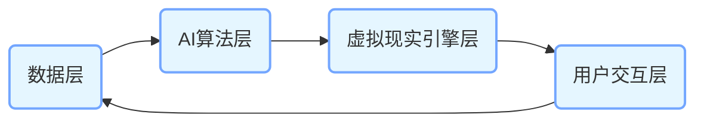

# AI助力下的虚拟现实开发创新

> 关键词：AI、虚拟现实、开发创新、智能交互、场景生成

> 摘要：本文深入探讨了AI助力下的虚拟现实开发创新。随着AI技术和虚拟现实技术的不断发展，二者的融合为虚拟现实领域带来了新的机遇和变革。文章首先介绍了相关背景，包括目的范围、预期读者等内容。接着阐述了AI与虚拟现实的核心概念及联系，详细讲解了核心算法原理和具体操作步骤，并通过数学模型和公式进行深入分析。通过项目实战案例展示了代码实现和详细解释，探讨了实际应用场景。同时推荐了相关的学习资源、开发工具框架以及论文著作。最后总结了未来发展趋势与挑战，并给出常见问题解答和参考资料，旨在全面呈现AI助力下虚拟现实开发创新的全貌，为相关领域的研究和开发提供参考。

## 1. 背景介绍 
### 1.1 目的和范围
本文章的目的在于全面剖析AI助力下虚拟现实开发创新的相关内容。旨在为从事虚拟现实开发、AI研究以及对二者融合感兴趣的人员提供深入的技术知识和实践指导。范围涵盖了AI与虚拟现实的核心概念、算法原理、数学模型、项目实战、应用场景等多个方面，力求从理论到实践，全方位呈现这一领域的创新成果和发展趋势。

### 1.2 预期读者
预期读者包括虚拟现实开发人员、AI工程师、计算机科学专业的学生、相关领域的研究人员以及对科技前沿动态感兴趣的爱好者。这些读者希望通过本文深入了解AI与虚拟现实融合的技术细节、创新应用和未来发展方向，以提升自身的技术水平和创新能力。

### 1.3 文档结构概述
本文首先介绍背景信息，让读者对文章的目的、预期读者和整体结构有初步了解。接着阐述AI与虚拟现实的核心概念及联系，为后续的深入讲解奠定基础。然后详细讲解核心算法原理和具体操作步骤，通过Python代码进行示例。再通过数学模型和公式对相关原理进行深入分析，并举例说明。之后通过项目实战案例展示代码实现和详细解释，探讨实际应用场景。推荐相关的学习资源、开发工具框架以及论文著作，为读者提供进一步学习和研究的方向。最后总结未来发展趋势与挑战，给出常见问题解答和参考资料，使文章内容更加完整。

### 1.4 术语表
#### 1.4.1 核心术语定义
- **AI（Artificial Intelligence）**：即人工智能，是研究、开发用于模拟、延伸和扩展人的智能的理论、方法、技术及应用系统的一门新的技术科学。
- **虚拟现实（Virtual Reality，VR）**：是一种可以创建和体验虚拟世界的计算机仿真系统，它利用计算机生成一种模拟环境，使用户沉浸到该环境中。
- **增强现实（Augmented Reality，AR）**：是一种将虚拟信息与真实世界巧妙融合的技术，广泛运用多媒体、三维建模、实时跟踪及注册、智能交互、传感等多种技术手段，将计算机生成的文字、图像、三维模型、音乐、视频等虚拟信息模拟仿真后，应用到真实世界中，两种信息互为补充，从而实现对真实世界的“增强”。
- **机器学习（Machine Learning，ML）**：是一门多领域交叉学科，涉及概率论、统计学、逼近论、凸分析、算法复杂度理论等多门学科。它专门研究计算机怎样模拟或实现人类的学习行为，以获取新的知识或技能，重新组织已有的知识结构使之不断改善自身的性能。

#### 1.4.2 相关概念解释
- **智能交互**：指在AI技术的支持下，用户与虚拟现实环境之间实现更加自然、高效、智能的交互方式，如语音交互、手势识别、眼动追踪等。
- **场景生成**：利用AI算法自动生成虚拟现实场景，包括地形、建筑、物体等，减少人工建模的工作量，提高开发效率。

#### 1.4.3 缩略词列表
- **AI**：Artificial Intelligence
- **VR**：Virtual Reality
- **AR**：Augmented Reality
- **ML**：Machine Learning

## 2. 核心概念与联系 
### 核心概念原理
AI和虚拟现实是两个具有巨大潜力的技术领域，它们的融合为用户带来了更加沉浸式、智能和个性化的体验。

AI的核心在于模拟人类的智能行为，通过机器学习、深度学习等算法，使计算机能够从数据中学习模式和规律，从而实现预测、分类、决策等功能。在虚拟现实中，AI可以用于实现智能交互、场景生成、角色行为模拟等功能。

虚拟现实的核心是创建一个虚拟环境，使用户能够沉浸其中，通过头戴式显示器、手柄等设备与虚拟环境进行交互。虚拟现实技术涉及到计算机图形学、图像处理、传感器技术等多个领域，旨在为用户提供逼真的视觉、听觉和触觉体验。

### 架构的文本示意图
AI与虚拟现实融合的架构主要包括以下几个部分：
1. **数据层**：包括用户行为数据、环境数据、虚拟场景数据等，这些数据是AI算法进行学习和决策的基础。
2. **AI算法层**：包括机器学习算法、深度学习算法等，用于对数据进行分析和处理，实现智能交互、场景生成等功能。
3. **虚拟现实引擎层**：如Unity、Unreal Engine等，用于创建和渲染虚拟场景，提供用户与虚拟环境的交互接口。
4. **用户交互层**：包括头戴式显示器、手柄、传感器等设备，用于用户与虚拟环境进行交互。

### Mermaid流程图


## 3. 核心算法原理 & 具体操作步骤 
### 智能交互算法原理
智能交互是AI助力虚拟现实开发的重要方面，其中语音交互和手势识别是常见的交互方式。下面以语音交互为例，介绍其核心算法原理和具体操作步骤。

语音交互的核心算法包括语音识别、自然语言处理和语音合成三个部分。语音识别将用户的语音信号转换为文本，自然语言处理对文本进行理解和分析，语音合成将计算机的回复转换为语音输出。

### Python源代码示例
```python
import speech_recognition as sr
import pyttsx3

# 语音识别
def recognize_speech():
    r = sr.Recognizer()
    with sr.Microphone() as source:
        print("请说话...")
        audio = r.listen(source)

    try:
        text = r.recognize_google(audio, language='zh-CN')
        print("你说的是: " + text)
        return text
    except sr.UnknownValueError:
        print("无法识别语音")
    except sr.RequestError as e:
        print("请求错误; {0}".format(e))
    return None

# 语音合成
def speak(text):
    engine = pyttsx3.init()
    engine.say(text)
    engine.runAndWait()

# 主程序
if __name__ == "__main__":
    while True:
        text = recognize_speech()
        if text:
            if "退出" in text:
                speak("再见！")
                break
            else:
                response = "你说的是: " + text
                speak(response)
```
### 具体操作步骤
1. **安装依赖库**：使用`pip install speech_recognition pyttsx3`安装语音识别和语音合成的库。
2. **语音识别**：使用`speech_recognition`库监听用户的语音输入，并将其转换为文本。
3. **自然语言处理**：在上述示例中，简单地判断文本中是否包含“退出”关键字，实际应用中可以使用更复杂的自然语言处理算法进行语义理解和分析。
4. **语音合成**：使用`pyttsx3`库将计算机的回复转换为语音输出。

## 4. 数学模型和公式 & 详细讲解 & 举例说明 
### 机器学习中的线性回归模型
线性回归是机器学习中最基本的模型之一，用于预测连续值。其数学模型可以表示为：
$$y = \theta_0 + \theta_1x_1 + \theta_2x_2 + \cdots + \theta_nx_n$$
其中，$y$ 是预测值，$x_1, x_2, \cdots, x_n$ 是输入特征，$\theta_0, \theta_1, \theta_2, \cdots, \theta_n$ 是模型的参数。

### 详细讲解
线性回归的目标是找到一组最优的参数 $\theta$，使得预测值 $y$ 与真实值之间的误差最小。常用的误差度量方法是均方误差（Mean Squared Error，MSE）：
$$MSE = \frac{1}{m}\sum_{i=1}^{m}(y^{(i)} - \hat{y}^{(i)})^2$$
其中，$m$ 是样本数量，$y^{(i)}$ 是第 $i$ 个样本的真实值，$\hat{y}^{(i)}$ 是第 $i$ 个样本的预测值。

为了找到最优的参数 $\theta$，可以使用梯度下降算法。梯度下降算法的基本思想是沿着误差函数的负梯度方向更新参数，直到误差函数达到最小值。

### 举例说明
假设我们有一组数据 $(x_1, y_1), (x_2, y_2), \cdots, (x_m, y_m)$，我们想要使用线性回归模型预测 $y$ 的值。我们可以使用以下Python代码实现：
```python
import numpy as np

# 生成数据
x = np.array([1, 2, 3, 4, 5])
y = np.array([2, 4, 6, 8, 10])

# 初始化参数
theta = np.zeros(2)

# 学习率
alpha = 0.01

# 迭代次数
num_iters = 1000

# 特征矩阵
X = np.c_[np.ones((len(x), 1)), x]

# 梯度下降
for iter in range(num_iters):
    predictions = X.dot(theta)
    error = predictions - y
    theta = theta - alpha * (1/len(x)) * X.T.dot(error)

# 输出结果
print("参数 theta: ", theta)
```
在上述代码中，我们首先生成了一组数据 $(x, y)$，然后初始化了参数 $\theta$。接着，我们使用梯度下降算法迭代更新参数，直到误差函数达到最小值。最后，我们输出了最优的参数 $\theta$。

## 5. 项目实战：代码实际案例和详细解释说明 
### 5.1  开发环境搭建
本项目使用Unity作为虚拟现实开发引擎，Python作为AI算法的开发语言。以下是开发环境搭建的步骤：
1. **安装Unity**：从Unity官方网站下载并安装Unity Hub，然后通过Unity Hub安装所需的Unity版本。
2. **安装Python**：从Python官方网站下载并安装Python 3.x版本。
3. **安装相关库**：使用`pip install`命令安装所需的Python库，如`speech_recognition`、`pyttsx3`等。

### 5.2  源代码详细实现和代码解读
本项目实现了一个简单的虚拟现实场景，用户可以通过语音交互与虚拟角色进行对话。以下是主要的代码实现和解读：

#### Unity部分
```csharp
using UnityEngine;
using UnityEngine.UI;
using System.Collections;
using System.Diagnostics;
using System.IO;
using System.Text;

public class VoiceInteraction : MonoBehaviour
{
    public Text outputText;

    void Start()
    {
        StartCoroutine(RunPythonScript());
    }

    IEnumerator RunPythonScript()
    {
        ProcessStartInfo start = new ProcessStartInfo();
        start.FileName = "python";
        start.Arguments = Path.Combine(Application.dataPath, "Scripts", "voice_interaction.py");
        start.UseShellExecute = false;
        start.RedirectStandardOutput = true;
        start.CreateNoWindow = true;

        using (Process process = new Process())
        {
            process.StartInfo = start;
            process.Start();
            StringBuilder output = new StringBuilder();
            using (StreamReader reader = process.StandardOutput)
            {
                string line;
                while ((line = reader.ReadLine()) != null)
                {
                    output.AppendLine(line);
                    outputText.text = line;
                    yield return null;
                }
            }
            process.WaitForExit();
        }
    }
}
```
**代码解读**：
- `Start`方法：在游戏开始时调用`RunPythonScript`协程。
- `RunPythonScript`协程：启动一个Python进程，执行`voice_interaction.py`脚本，并将脚本的输出显示在Unity的文本框中。

#### Python部分
```python
import speech_recognition as sr
import pyttsx3

# 语音识别
def recognize_speech():
    r = sr.Recognizer()
    with sr.Microphone() as source:
        print("请说话...")
        audio = r.listen(source)

    try:
        text = r.recognize_google(audio, language='zh-CN')
        print("你说的是: " + text)
        return text
    except sr.UnknownValueError:
        print("无法识别语音")
    except sr.RequestError as e:
        print("请求错误; {0}".format(e))
    return None

# 语音合成
def speak(text):
    engine = pyttsx3.init()
    engine.say(text)
    engine.runAndWait()

# 主程序
if __name__ == "__main__":
    while True:
        text = recognize_speech()
        if text:
            if "退出" in text:
                speak("再见！")
                break
            else:
                response = "你说的是: " + text
                speak(response)
                print(response)
```
**代码解读**：
- `recognize_speech`方法：监听用户的语音输入，并将其转换为文本。
- `speak`方法：将计算机的回复转换为语音输出。
- 主程序：不断监听用户的语音输入，根据用户的输入进行相应的回复，直到用户说出“退出”为止。

### 5.3  代码解读与分析
通过上述代码，我们实现了一个简单的虚拟现实语音交互系统。Unity作为虚拟现实开发引擎，负责创建和渲染虚拟场景，Python作为AI算法的开发语言，负责语音识别和语音合成。通过Unity和Python之间的进程通信，实现了虚拟现实场景与AI算法的结合。

在实际应用中，我们可以进一步扩展该系统，如使用更复杂的自然语言处理算法进行语义理解和分析，实现更智能的对话系统；使用机器学习算法对用户的行为数据进行分析，实现个性化的虚拟场景和交互体验。

## 6. 实际应用场景 
### 教育领域
在教育领域，AI助力的虚拟现实可以为学生提供更加沉浸式和个性化的学习体验。例如，通过虚拟现实技术创建历史场景、科学实验场景等，让学生身临其境地学习知识。AI可以根据学生的学习进度和表现，提供个性化的学习建议和辅导，提高学习效果。

### 医疗领域
在医疗领域，AI助力的虚拟现实可以用于手术培训、康复治疗等方面。例如，通过虚拟现实技术创建手术模拟场景，让医生在虚拟环境中进行手术操作训练，提高手术技能。AI可以对患者的康复数据进行分析，提供个性化的康复方案，帮助患者更快地恢复健康。

### 娱乐领域
在娱乐领域，AI助力的虚拟现实可以为用户带来更加丰富和刺激的娱乐体验。例如，通过虚拟现实技术创建游戏场景，让玩家身临其境地参与游戏。AI可以根据玩家的行为和偏好，动态调整游戏难度和情节，提高游戏的趣味性和挑战性。

### 工业领域
在工业领域，AI助力的虚拟现实可以用于产品设计、虚拟装配、远程协作等方面。例如，通过虚拟现实技术创建产品的三维模型，让设计师在虚拟环境中进行产品设计和优化。AI可以对产品的性能数据进行分析，提供优化建议，提高产品的质量和性能。

## 7. 工具和资源推荐
### 7.1 学习资源推荐
#### 7.1.1 书籍推荐
- 《人工智能：一种现代的方法》：全面介绍了人工智能的基本概念、算法和应用，是人工智能领域的经典教材。
- 《虚拟现实：原理、技术与应用》：详细介绍了虚拟现实的原理、技术和应用，是虚拟现实领域的权威著作。
- 《Python机器学习》：介绍了Python在机器学习中的应用，包括机器学习算法的实现和优化。

#### 7.1.2 在线课程
- Coursera上的“人工智能基础”课程：由斯坦福大学教授授课，介绍了人工智能的基本概念和算法。
- edX上的“虚拟现实开发基础”课程：介绍了虚拟现实开发的基本技术和工具。
- Udemy上的“Python数据分析与机器学习实战”课程：通过实际案例介绍了Python在数据分析和机器学习中的应用。

#### 7.1.3 技术博客和网站
- Medium：有许多关于AI和虚拟现实的技术博客和文章，提供了最新的技术动态和实践经验。
- arXiv：提供了大量的学术论文，包括AI和虚拟现实领域的最新研究成果。
- 开源中国：有许多关于AI和虚拟现实的技术文章和开源项目，是学习和交流的好平台。

### 7.2 开发工具框架推荐
#### 7.2.1 IDE和编辑器
- Unity：是一款强大的虚拟现实开发引擎，提供了丰富的工具和资源，支持多种平台的开发。
- Unreal Engine：是另一款知名的虚拟现实开发引擎，具有强大的图形渲染能力和物理模拟功能。
- PyCharm：是一款专门用于Python开发的集成开发环境，提供了丰富的代码编辑、调试和分析功能。

#### 7.2.2 调试和性能分析工具
- Unity Profiler：用于分析Unity项目的性能，找出性能瓶颈并进行优化。
- Visual Studio Profiler：用于分析C#和Python代码的性能，提供详细的性能报告和分析结果。
- Google Chrome DevTools：用于调试和分析Web应用程序的性能，包括虚拟现实Web应用。

#### 7.2.3 相关框架和库
- TensorFlow：是一个开源的机器学习框架，提供了丰富的机器学习算法和工具，支持深度学习模型的开发和训练。
- PyTorch：是另一个开源的机器学习框架，具有简洁的API和高效的计算性能，适合快速开发和实验。
- OpenCV：是一个开源的计算机视觉库，提供了丰富的图像处理和计算机视觉算法，可用于虚拟现实中的图像识别和处理。

### 7.3 相关论文著作推荐
#### 7.3.1 经典论文
- “A Logical Calculus of the Ideas Immanent in Nervous Activity”：由Warren S. McCulloch和Walter Pitts于1943年发表，提出了神经元的数学模型，是人工智能领域的经典论文之一。
- “Perceptrons: An Introduction to Computational Geometry”：由Frank Rosenblatt于1958年发表，提出了感知机模型，是机器学习领域的经典论文之一。
- “Virtual Reality: A Definition and Taxonomy”：由Jaron Lanier于1989年发表，对虚拟现实的概念和分类进行了定义和阐述。

#### 7.3.2 最新研究成果
- 关注顶级学术会议和期刊，如NeurIPS（神经信息处理系统大会）、CVPR（计算机视觉与模式识别会议）、ACM SIGGRAPH（计算机图形学特别兴趣小组会议）等，了解AI和虚拟现实领域的最新研究成果。
- 关注知名研究机构和学者的研究动态，如斯坦福大学、麻省理工学院、DeepMind等，他们在AI和虚拟现实领域的研究处于世界领先水平。

#### 7.3.3 应用案例分析
- 分析知名公司和研究机构的应用案例，如Facebook的Oculus VR、Google的Daydream VR等，了解AI和虚拟现实在实际应用中的技术实现和创新思路。
- 参考相关的行业报告和白皮书，如IDC（国际数据公司）的虚拟现实市场报告、Gartner的新兴技术炒作周期报告等，了解AI和虚拟现实的市场趋势和应用前景。

## 8. 总结：未来发展趋势与挑战
### 未来发展趋势
- **更加智能的交互体验**：随着AI技术的不断发展，虚拟现实中的交互将更加自然、智能和个性化。例如，语音交互、手势识别、眼动追踪等技术将得到进一步优化，用户可以更加方便地与虚拟环境进行交互。
- **生成式AI在场景创建中的应用**：生成式AI技术，如GAN（生成对抗网络）、VAE（变分自编码器）等，将被广泛应用于虚拟现实场景的创建。通过这些技术，可以自动生成逼真的虚拟场景，减少人工建模的工作量，提高开发效率。
- **AI与其他技术的融合**：AI将与增强现实（AR）、混合现实（MR）、5G、物联网等技术深度融合，创造出更加丰富和多样化的应用场景。例如，AI与AR的融合可以实现更加智能的增强现实体验，用户可以通过AR设备获取更加个性化的信息和服务。

### 挑战
- **数据隐私和安全问题**：AI助力的虚拟现实需要收集和处理大量的用户数据，如用户的行为数据、生理数据等。这些数据的隐私和安全问题是一个重要的挑战，需要采取有效的措施来保护用户的数据安全。
- **计算资源和性能需求**：AI和虚拟现实都对计算资源和性能有较高的需求。随着应用的不断复杂和功能的不断增加，对计算资源和性能的要求也越来越高。如何在有限的计算资源下实现高效的AI和虚拟现实应用是一个需要解决的问题。
- **伦理和法律问题**：AI助力的虚拟现实可能会带来一些伦理和法律问题，如虚拟角色的权利和义务、虚拟世界中的犯罪和侵权等。需要建立相应的伦理和法律框架，来规范AI和虚拟现实的发展和应用。

## 9. 附录：常见问题与解答
### 1. AI与虚拟现实融合的技术难度大吗？
AI与虚拟现实融合的技术难度相对较大，涉及到多个领域的知识和技术，如AI算法、计算机图形学、传感器技术等。但是，随着技术的不断发展和开源资源的不断丰富，开发难度也在逐渐降低。开发者可以通过学习和实践，逐步掌握相关技术。

### 2. 如何选择适合的虚拟现实开发引擎？
选择适合的虚拟现实开发引擎需要考虑多个因素，如项目需求、开发经验、性能要求等。Unity和Unreal Engine是两款比较知名的虚拟现实开发引擎，Unity具有简单易用、跨平台等优点，适合初学者和快速开发；Unreal Engine具有强大的图形渲染能力和物理模拟功能，适合开发大型、高质量的虚拟现实项目。

### 3. AI算法在虚拟现实中的应用有哪些限制？
AI算法在虚拟现实中的应用存在一些限制，如计算资源的限制、数据质量的影响、算法的可解释性等。在实际应用中，需要根据具体情况选择合适的AI算法，并对算法进行优化和改进，以提高算法的性能和效果。

### 4. 如何保护用户在虚拟现实中的数据隐私和安全？
保护用户在虚拟现实中的数据隐私和安全需要采取多种措施，如数据加密、访问控制、安全审计等。开发者需要遵守相关的法律法规和隐私政策，确保用户的数据不被泄露和滥用。同时，用户也需要提高自身的安全意识，注意保护个人信息。

## 10. 扩展阅读 & 参考资料
### 扩展阅读
- 《AI未来进行式》：李开复和王咏刚所著，探讨了AI在各个领域的应用和未来发展趋势。
- 《虚拟现实：从阿凡达到永生》：介绍了虚拟现实的发展历程、技术原理和应用前景。
- 《深度学习》：Ian Goodfellow、Yoshua Bengio和Aaron Courville所著，是深度学习领域的经典教材。

### 参考资料
- [Unity官方文档](https://docs.unity3d.com/)
- [Unreal Engine官方文档](https://docs.unrealengine.com/)
- [TensorFlow官方文档](https://www.tensorflow.org/)
- [PyTorch官方文档](https://pytorch.org/)
- [OpenCV官方文档](https://opencv.org/)