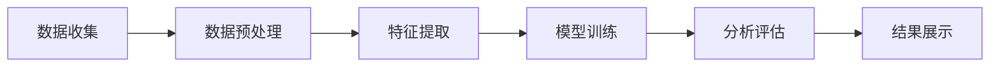

# AI协作分析专利组合：评估技术驱动型公司的未来价值

> 关键词：AI协作、专利组合、技术驱动型公司、未来价值评估、技术分析、专利挖掘、价值预测

> 摘要：本文聚焦于利用AI协作来分析专利组合，以此评估技术驱动型公司的未来价值。首先介绍了研究的背景、目的、预期读者等基础信息，接着阐述了AI协作与专利组合分析的核心概念及联系，深入讲解了相关核心算法原理与具体操作步骤，通过数学模型和公式进行理论支撑并举例说明。然后通过项目实战展示代码实现与解读，探讨了实际应用场景。同时推荐了学习、开发工具和相关论文著作等资源。最后总结了未来发展趋势与挑战，提供常见问题解答及扩展阅读参考资料，旨在为评估技术驱动型公司未来价值提供全面且深入的技术与理论指导。

## 1. 背景介绍 
### 1.1 目的和范围
在当今竞争激烈的商业环境中，技术驱动型公司的发展速度和创新能力决定了其市场地位和未来潜力。专利作为公司技术创新的重要成果体现，蕴含着丰富的技术信息和商业价值。然而，面对海量的专利数据，传统的人工分析方法效率低下且难以全面挖掘专利背后的技术关联和潜在价值。本研究的目的在于引入AI协作技术，实现对专利组合的高效、深入分析，从而准确评估技术驱动型公司的未来价值。

本研究的范围涵盖了专利数据的收集、整理、分析以及基于分析结果对公司未来价值的评估。研究将综合运用自然语言处理、机器学习等AI技术，结合专利分析的专业知识，构建一个完整的分析体系。

### 1.2 预期读者
本文预期读者包括投资机构的分析师、技术驱动型公司的管理者、专利律师、知识产权专家以及对AI和专利分析领域感兴趣的科研人员。投资机构分析师可以借助本文的方法更准确地评估技术驱动型公司的投资价值；公司管理者可以通过分析自身专利组合，了解公司技术优势和不足，制定合理的发展战略；专利律师和知识产权专家可以在专利诉讼、专利布局等方面获得新的分析视角；科研人员则可以将本文的研究作为进一步深入研究的参考。

### 1.3 文档结构概述
本文将按照以下结构展开：首先介绍研究的背景信息，包括目的、预期读者等；接着阐述AI协作与专利组合分析的核心概念及联系，通过文本示意图和Mermaid流程图进行直观展示；然后深入讲解核心算法原理与具体操作步骤，结合Python源代码详细阐述；再通过数学模型和公式对分析过程进行理论支撑并举例说明；之后通过项目实战展示代码实现与解读；探讨实际应用场景；推荐学习、开发工具和相关论文著作等资源；最后总结未来发展趋势与挑战，提供常见问题解答及扩展阅读参考资料。

### 1.4 术语表
#### 1.4.1 核心术语定义
- **AI协作**：指利用人工智能技术，如自然语言处理、机器学习、知识图谱等，实现对大量数据的自动化处理、分析和协同工作，以提高分析效率和准确性。
- **专利组合**：是指一个公司或组织拥有的一系列专利的集合，这些专利在技术领域、应用场景等方面可能存在关联或互补。
- **技术驱动型公司**：主要依靠技术创新来推动业务发展和市场竞争的公司，其核心竞争力在于不断研发和应用新技术。
- **未来价值评估**：对公司在未来一段时间内的市场价值、盈利能力、发展潜力等进行预测和评估的过程。

#### 1.4.2 相关概念解释
- **自然语言处理（NLP）**：是AI的一个重要分支，主要研究如何让计算机理解、处理和生成人类语言。在专利分析中，NLP技术可以用于提取专利文本中的关键信息，如技术领域、发明点、权利要求等。
- **机器学习**：是一门多领域交叉学科，涉及概率论、统计学、逼近论、凸分析、算法复杂度理论等多门学科。它专门研究计算机怎样模拟或实现人类的学习行为，以获取新的知识或技能，重新组织已有的知识结构使之不断改善自身的性能。在专利分析中，机器学习可以用于分类、聚类、预测等任务。
- **知识图谱**：是一种基于图的数据结构，由节点（实体）和边（关系）组成。它可以将不同来源的数据进行整合，构建实体之间的关联关系，帮助人们更好地理解和分析数据。在专利分析中，知识图谱可以用于展示专利之间的技术关联、公司之间的竞争合作关系等。

#### 1.4.3 缩略词列表
- **NLP**：Natural Language Processing（自然语言处理）
- **ML**：Machine Learning（机器学习）
- **KG**：Knowledge Graph（知识图谱）

## 2. 核心概念与联系 

### 核心概念原理
AI协作分析专利组合的核心在于利用AI技术对专利数据进行多维度的分析和挖掘，以揭示专利背后的技术价值和商业潜力。具体来说，涉及以下几个关键原理：

- **自然语言处理原理**：专利文本通常包含大量的技术描述和法律条款，NLP技术通过词法分析、句法分析、语义分析等手段，将专利文本转化为计算机可以处理的结构化数据。例如，通过命名实体识别技术，可以提取专利文本中的技术术语、公司名称、发明人等关键信息；通过文本分类技术，可以将专利按照技术领域进行分类。

- **机器学习原理**：机器学习算法可以对处理后的专利数据进行建模和分析，以发现数据中的潜在模式和规律。例如，聚类算法可以将相似的专利归为一类，帮助分析师快速了解公司的技术布局；分类算法可以预测专利的价值等级、技术成熟度等；回归算法可以建立专利数量、质量与公司未来价值之间的关系模型。

- **知识图谱原理**：知识图谱通过整合专利数据中的实体和关系，构建一个语义网络。例如，将专利与发明人、公司、技术领域、引用专利等实体关联起来，形成一个复杂的知识网络。通过知识图谱，可以直观地展示专利之间的技术关联、公司之间的竞争合作关系等，为分析师提供更全面的信息。

### 架构的文本示意图
```plaintext
                            AI协作分析专利组合系统
                                ┌────────────────────┐
                                │                    │
                                │   数据收集模块    │
                                │                    │
                                └────────────────────┘
                                          │
                                          ▼
                                ┌────────────────────┐
                                │                    │
                                │   数据预处理模块  │
                                │                    │
                                └────────────────────┘
                                          │
                                          ▼
                                ┌────────────────────┐
                                │                    │
                                │   特征提取模块    │
                                │                    │
                                └────────────────────┘
                                          │
                                          ▼
                                ┌────────────────────┐
                                │                    │
                                │   模型训练模块    │
                                │                    │
                                └────────────────────┘
                                          │
                                          ▼
                                ┌────────────────────┐
                                │                    │
                                │   分析评估模块    │
                                │                    │
                                └────────────────────┘
                                          │
                                          ▼
                                ┌────────────────────┐
                                │                    │
                                │   结果展示模块    │
                                │                    │
                                └────────────────────┘
```

### Mermaid流程图


## 3. 核心算法原理 & 具体操作步骤 

### 核心算法原理
在AI协作分析专利组合中，涉及到多种核心算法，下面以文本分类算法和聚类算法为例进行详细讲解。

#### 文本分类算法（以朴素贝叶斯算法为例）
朴素贝叶斯算法是一种基于贝叶斯定理和特征条件独立假设的分类算法。其基本思想是通过计算每个类别的后验概率，将文本分类到后验概率最大的类别中。

设 $C = \{c_1, c_2, \cdots, c_n\}$ 是类别集合，$x = \{x_1, x_2, \cdots, x_m\}$ 是文本的特征向量。根据贝叶斯定理，文本 $x$ 属于类别 $c_i$ 的后验概率为：

$P(c_i|x) = \frac{P(x|c_i)P(c_i)}{P(x)}$

由于对于所有类别 $P(x)$ 是相同的，因此只需要比较 $P(x|c_i)P(c_i)$ 的大小即可。在朴素贝叶斯算法中，假设特征之间是条件独立的，即：

$P(x|c_i) = \prod_{j=1}^{m}P(x_j|c_i)$

#### 聚类算法（以K-Means算法为例）
K-Means算法是一种无监督学习算法，用于将数据点划分为 $k$ 个不同的簇。其基本思想是通过迭代的方式，不断更新簇的中心，使得每个数据点到其所属簇中心的距离之和最小。

算法步骤如下：
1. 随机选择 $k$ 个数据点作为初始簇中心。
2. 对于每个数据点，计算其到各个簇中心的距离，将其分配到距离最近的簇中。
3. 重新计算每个簇的中心。
4. 重复步骤2和3，直到簇中心不再发生变化或达到最大迭代次数。

### 具体操作步骤

#### 数据收集
通过专利数据库（如中国国家知识产权局专利数据库、美国专利商标局数据库等）收集技术驱动型公司的专利数据。数据格式通常为文本文件，包含专利标题、摘要、权利要求、技术领域等信息。

#### 数据预处理
- **清洗数据**：去除专利文本中的噪声信息，如HTML标签、特殊字符、停用词等。
- **分词**：将专利文本分割成单个的词语或词组。
- **词干提取**：将词语还原为其词干形式，以减少词汇的多样性。

#### 特征提取
- **词袋模型**：将专利文本表示为一个向量，向量的每个维度对应一个词语，向量的值表示该词语在文本中出现的频率。
- **TF-IDF**：计算词语的词频 - 逆文档频率，以反映词语在文本中的重要性。

#### 模型训练
- **文本分类模型训练**：使用朴素贝叶斯算法或其他分类算法，对预处理后的专利数据进行训练，得到文本分类模型。
- **聚类模型训练**：使用K-Means算法或其他聚类算法，对专利数据进行聚类，得到聚类模型。

#### 分析评估
- **文本分类评估**：使用准确率、召回率、F1值等指标评估文本分类模型的性能。
- **聚类评估**：使用轮廓系数、Calinski-Harabasz指数等指标评估聚类模型的性能。

#### 结果展示
将分析评估结果以可视化的方式展示，如柱状图、饼图、知识图谱等，以便用户直观地了解专利组合的情况。

### Python源代码实现
```python
import pandas as pd
from sklearn.feature_extraction.text import CountVectorizer, TfidfVectorizer
from sklearn.naive_bayes import MultinomialNB
from sklearn.cluster import KMeans
from sklearn.metrics import accuracy_score, silhouette_score
from sklearn.model_selection import train_test_split
import nltk
from nltk.corpus import stopwords
from nltk.stem import PorterStemmer
import re

# 数据收集（假设数据已经存储在CSV文件中）
data = pd.read_csv('patent_data.csv')

# 数据预处理
nltk.download('stopwords')
stop_words = set(stopwords.words('english'))
stemmer = PorterStemmer()

def preprocess_text(text):
    text = re.sub(r'[^\w\s]', '', text)  # 去除特殊字符
    text = text.lower()  # 转换为小写
    words = text.split()
    words = [stemmer.stem(word) for word in words if word not in stop_words]  # 去除停用词并进行词干提取
    return ' '.join(words)

data['preprocessed_text'] = data['abstract'].apply(preprocess_text)

# 特征提取
vectorizer = TfidfVectorizer()
X = vectorizer.fit_transform(data['preprocessed_text'])

# 文本分类模型训练
y = data['category']  # 假设数据集中有一个类别标签列
X_train, X_test, y_train, y_test = train_test_split(X, y, test_size=0.2, random_state=42)
clf = MultinomialNB()
clf.fit(X_train, y_train)
y_pred = clf.predict(X_test)
accuracy = accuracy_score(y_test, y_pred)
print(f"Text classification accuracy: {accuracy}")

# 聚类模型训练
kmeans = KMeans(n_clusters=5, random_state=42)
kmeans.fit(X)
labels = kmeans.labels_
silhouette = silhouette_score(X, labels)
print(f"Clustering silhouette score: {silhouette}")
```

## 4. 数学模型和公式 & 详细讲解 & 举例说明 

### 贝叶斯定理
贝叶斯定理是概率论中的一个重要定理，用于计算条件概率。其数学表达式为：

$$P(A|B) = \frac{P(B|A)P(A)}{P(B)}$$

其中，$P(A|B)$ 表示在事件 $B$ 发生的条件下事件 $A$ 发生的概率，称为后验概率；$P(B|A)$ 表示在事件 $A$ 发生的条件下事件 $B$ 发生的概率，称为似然概率；$P(A)$ 表示事件 $A$ 发生的先验概率；$P(B)$ 表示事件 $B$ 发生的概率。

在文本分类中，贝叶斯定理可以用于计算文本属于某个类别的后验概率。例如，假设有两个类别 $C_1$ 和 $C_2$，文本 $x$ 属于类别 $C_1$ 的后验概率为：

$$P(C_1|x) = \frac{P(x|C_1)P(C_1)}{P(x)}$$

其中，$P(x|C_1)$ 表示在类别 $C_1$ 下文本 $x$ 出现的概率，$P(C_1)$ 表示类别 $C_1$ 出现的先验概率，$P(x)$ 表示文本 $x$ 出现的概率。

### 词频 - 逆文档频率（TF-IDF）
词频 - 逆文档频率是一种用于评估词语在文本集合中重要性的统计方法。其数学表达式为：

$$TF - IDF(t, d, D) = TF(t, d) \times IDF(t, D)$$

其中，$TF(t, d)$ 表示词语 $t$ 在文档 $d$ 中出现的频率，$IDF(t, D)$ 表示词语 $t$ 在文档集合 $D$ 中的逆文档频率。逆文档频率的计算公式为：

$$IDF(t, D) = \log\frac{|D|}{|d \in D: t \in d| + 1}$$

其中，$|D|$ 表示文档集合 $D$ 中的文档总数，$|d \in D: t \in d|$ 表示包含词语 $t$ 的文档数。

例如，假设有一个文档集合 $D = \{d_1, d_2, d_3\}$，文档 $d_1$ 的内容为 “apple banana cherry”，文档 $d_2$ 的内容为 “apple orange”，文档 $d_3$ 的内容为 “banana grape”。词语 “apple” 在文档 $d_1$ 中的词频为 $1$，在文档集合 $D$ 中的逆文档频率为 $\log\frac{3}{2 + 1} \approx -0.405$，则 “apple” 在文档 $d_1$ 中的 TF - IDF 值为 $1 \times (-0.405) = -0.405$。

### 聚类评估指标
#### 轮廓系数
轮廓系数是一种用于评估聚类效果的指标，其取值范围为 $[-1, 1]$。轮廓系数越接近 $1$，表示聚类效果越好；越接近 $-1$，表示聚类效果越差。其数学表达式为：

$$s(i) = \frac{b(i) - a(i)}{\max\{a(i), b(i)\}}$$

其中，$a(i)$ 表示样本 $i$ 到其所属簇中其他样本的平均距离，$b(i)$ 表示样本 $i$ 到最近的非所属簇中样本的平均距离。

#### Calinski - Harabasz指数
Calinski - Harabasz指数是一种用于评估聚类效果的指标，其值越大表示聚类效果越好。其数学表达式为：

$$CH(k) = \frac{Tr(B_k)}{Tr(W_k)} \times \frac{N - k}{k - 1}$$

其中，$Tr(B_k)$ 表示类间离散矩阵的迹，$Tr(W_k)$ 表示类内离散矩阵的迹，$N$ 表示样本总数，$k$ 表示聚类的簇数。

## 5. 项目实战：代码实际案例和详细解释说明 

### 5.1  开发环境搭建
#### 安装Python
首先需要安装Python开发环境，建议使用Python 3.7及以上版本。可以从Python官方网站（https://www.python.org/downloads/） 下载安装包进行安装。

#### 安装依赖库
在安装好Python后，需要安装一些必要的依赖库，如`pandas`、`scikit-learn`、`nltk`等。可以使用以下命令进行安装：

```sh
pip install pandas scikit-learn nltk
```

#### 下载NLTK数据
在使用NLTK库时，需要下载一些必要的数据，如停用词表、词干提取器等。可以在Python交互环境中执行以下代码进行下载：

```python
import nltk
nltk.download('stopwords')
```

### 5.2  源代码详细实现和代码解读
```python
import pandas as pd
from sklearn.feature_extraction.text import CountVectorizer, TfidfVectorizer
from sklearn.naive_bayes import MultinomialNB
from sklearn.cluster import KMeans
from sklearn.metrics import accuracy_score, silhouette_score
from sklearn.model_selection import train_test_split
import nltk
from nltk.corpus import stopwords
from nltk.stem import PorterStemmer
import re

# 数据收集（假设数据已经存储在CSV文件中）
data = pd.read_csv('patent_data.csv')

# 数据预处理
nltk.download('stopwords')
stop_words = set(stopwords.words('english'))
stemmer = PorterStemmer()

def preprocess_text(text):
    text = re.sub(r'[^\w\s]', '', text)  # 去除特殊字符
    text = text.lower()  # 转换为小写
    words = text.split()
    words = [stemmer.stem(word) for word in words if word not in stop_words]  # 去除停用词并进行词干提取
    return ' '.join(words)

data['preprocessed_text'] = data['abstract'].apply(preprocess_text)

# 特征提取
vectorizer = TfidfVectorizer()
X = vectorizer.fit_transform(data['preprocessed_text'])

# 文本分类模型训练
y = data['category']  # 假设数据集中有一个类别标签列
X_train, X_test, y_train, y_test = train_test_split(X, y, test_size=0.2, random_state=42)
clf = MultinomialNB()
clf.fit(X_train, y_train)
y_pred = clf.predict(X_test)
accuracy = accuracy_score(y_test, y_pred)
print(f"Text classification accuracy: {accuracy}")

# 聚类模型训练
kmeans = KMeans(n_clusters=5, random_state=42)
kmeans.fit(X)
labels = kmeans.labels_
silhouette = silhouette_score(X, labels)
print(f"Clustering silhouette score: {silhouette}")
```

### 代码解读与分析
1. **数据收集**：使用`pandas`库的`read_csv`函数读取存储在CSV文件中的专利数据。
2. **数据预处理**：
    - 使用`re`库的`sub`函数去除专利文本中的特殊字符。
    - 将文本转换为小写，以减少词汇的多样性。
    - 使用`nltk`库的停用词表去除停用词，并使用`PorterStemmer`进行词干提取。
3. **特征提取**：使用`TfidfVectorizer`将专利文本转换为TF - IDF特征向量。
4. **文本分类模型训练**：
    - 使用`train_test_split`函数将数据集划分为训练集和测试集。
    - 使用`MultinomialNB`训练朴素贝叶斯分类模型。
    - 使用`accuracy_score`评估模型的准确率。
5. **聚类模型训练**：
    - 使用`KMeans`进行聚类分析。
    - 使用`silhouette_score`评估聚类效果。

## 6. 实际应用场景 
### 投资决策
投资机构在评估技术驱动型公司的投资价值时，可以通过AI协作分析专利组合，了解公司的技术实力、创新能力和市场竞争力。例如，分析公司的专利数量、质量、技术领域分布等指标，预测公司未来的发展潜力和盈利能力，从而做出更明智的投资决策。

### 公司战略规划
技术驱动型公司的管理者可以通过分析自身的专利组合，了解公司的技术优势和不足，制定合理的发展战略。例如，发现公司在某些技术领域的专利布局薄弱，可以加大研发投入，加强技术创新；发现公司的专利存在侵权风险，可以及时采取措施进行防范。

### 专利诉讼
专利律师在处理专利诉讼案件时，可以使用AI协作分析专利组合，帮助客户评估专利的有效性和侵权风险。例如，通过分析专利的权利要求、引用关系等信息，判断专利是否具有创新性和可实施性；通过比较不同公司的专利组合，判断是否存在侵权行为。

### 行业竞争分析
知识产权专家可以通过分析行业内公司的专利组合，了解行业的技术发展趋势和竞争格局。例如，分析不同公司在同一技术领域的专利数量、质量和技术创新点，判断公司之间的竞争优势和劣势；通过分析专利的引用关系，了解行业内的技术传承和创新脉络。

## 7. 工具和资源推荐
### 7.1 学习资源推荐
#### 7.1.1 书籍推荐
- 《Python机器学习》：本书详细介绍了Python在机器学习领域的应用，包括数据预处理、特征工程、模型训练、评估等内容，适合初学者学习。
- 《自然语言处理入门》：全面介绍了自然语言处理的基本概念、算法和应用，是学习自然语言处理的经典教材。
- 《知识图谱：方法、实践与应用》：深入讲解了知识图谱的构建、推理和应用，对于理解知识图谱在专利分析中的应用具有重要参考价值。

#### 7.1.2 在线课程
- Coursera上的“机器学习”课程：由斯坦福大学教授Andrew Ng主讲，是机器学习领域的经典课程，涵盖了机器学习的基本概念、算法和应用。
- edX上的“自然语言处理基础”课程：系统介绍了自然语言处理的基本理论和方法，包括词法分析、句法分析、语义分析等内容。
- 中国大学MOOC上的“知识图谱”课程：详细讲解了知识图谱的构建、表示和推理，以及在不同领域的应用。

#### 7.1.3 技术博客和网站
- 博客园：是国内知名的技术博客平台，有许多关于AI、机器学习、自然语言处理等领域的技术文章和经验分享。
- Medium：是一个全球性的技术博客平台，有许多国际知名的技术专家和学者在上面分享最新的技术研究成果和实践经验。
- arXiv：是一个预印本数据库，提供了大量关于AI、机器学习、计算机科学等领域的最新研究论文。

### 7.2 开发工具框架推荐
#### 7.2.1 IDE和编辑器
- PyCharm：是一款专业的Python集成开发环境，具有代码编辑、调试、版本控制等功能，适合Python开发。
- Jupyter Notebook：是一个交互式的开发环境，可以在浏览器中编写和运行Python代码，支持Markdown文本和可视化展示，适合数据探索和模型实验。
- Visual Studio Code：是一款轻量级的代码编辑器，支持多种编程语言和插件扩展，具有丰富的开发工具和功能。

#### 7.2.2 调试和性能分析工具
- PDB：是Python自带的调试器，可以在代码中设置断点，单步执行代码，查看变量的值等。
- cProfile：是Python的性能分析工具，可以分析代码的运行时间和函数调用次数，帮助优化代码性能。
- TensorBoard：是TensorFlow的可视化工具，可以可视化模型的训练过程、参数分布、损失函数等，帮助调试和优化模型。

#### 7.2.3 相关框架和库
- Scikit-learn：是一个简单易用的机器学习库，提供了多种机器学习算法和工具，如分类、聚类、回归等。
- NLTK：是一个自然语言处理工具包，提供了多种自然语言处理任务的工具和数据集，如分词、词性标注、命名实体识别等。
- NetworkX：是一个用于创建、操作和研究复杂网络的Python库，可以用于构建和分析知识图谱。

### 7.3 相关论文著作推荐
#### 7.3.1 经典论文
- “A Survey on Text Classification Algorithms”：对文本分类算法进行了全面的综述，介绍了各种文本分类算法的原理、优缺点和应用场景。
- “K-Means++: The Advantages of Careful Seeding”：提出了K-Means++算法，改进了K-Means算法的初始簇中心选择方法，提高了聚类效果。
- “Knowledge Graph Embedding: A Survey of Approaches and Applications”：对知识图谱嵌入技术进行了全面的综述，介绍了各种知识图谱嵌入算法的原理、优缺点和应用场景。

#### 7.3.2 最新研究成果
- 在ACM SIGKDD、NeurIPS、ACL等顶级学术会议上发表的关于AI、机器学习、自然语言处理等领域的最新研究论文。
- 在《Journal of Artificial Intelligence Research》、《Artificial Intelligence》等顶级学术期刊上发表的关于AI、机器学习、自然语言处理等领域的最新研究成果。

#### 7.3.3 应用案例分析
- 一些知名公司（如Google、Microsoft、IBM等）在AI协作分析专利组合方面的应用案例和实践经验分享。
- 一些研究机构（如MIT、Stanford University等）在专利分析和技术评估方面的研究报告和案例分析。

## 8. 总结：未来发展趋势与挑战
### 未来发展趋势
- **多模态数据融合**：未来的AI协作分析专利组合将不仅仅局限于文本数据，还将融合图像、视频、音频等多模态数据，以更全面地挖掘专利背后的技术价值和商业潜力。
- **深度学习技术的应用**：深度学习技术（如卷积神经网络、循环神经网络、Transformer等）将在专利分析中得到更广泛的应用，提高分析的准确性和效率。
- **知识图谱的深化应用**：知识图谱将不仅仅用于展示专利之间的技术关联，还将用于知识推理、智能问答等高级应用，为用户提供更智能、更便捷的服务。
- **跨领域融合**：AI协作分析专利组合将与其他领域（如金融、法律、医疗等）进行更深入的融合，为不同领域的用户提供定制化的解决方案。

### 挑战
- **数据质量问题**：专利数据的质量参差不齐，存在噪声、错误、缺失等问题，需要开发更有效的数据清洗和预处理方法，提高数据质量。
- **算法可解释性问题**：深度学习等复杂算法在提高分析准确性的同时，也带来了算法可解释性的问题。如何让用户理解算法的决策过程和结果，是未来需要解决的重要问题。
- **隐私和安全问题**：专利数据包含大量的敏感信息，如技术秘密、商业机密等，需要加强数据的隐私保护和安全管理，防止数据泄露和滥用。
- **人才短缺问题**：AI协作分析专利组合需要具备AI、机器学习、自然语言处理、专利分析等多领域知识的复合型人才，目前这类人才短缺，需要加强人才培养和引进。

## 9. 附录：常见问题与解答
### 1. 如何选择合适的专利数据库？
选择专利数据库时，需要考虑以下因素：数据的完整性、准确性、更新频率、覆盖范围、检索功能、使用成本等。常见的专利数据库包括中国国家知识产权局专利数据库、美国专利商标局数据库、欧洲专利局数据库等。可以根据自己的需求选择合适的数据库。

### 2. 如何确定文本分类的类别标签？
文本分类的类别标签可以根据具体的应用场景和需求进行确定。例如，在专利分析中，可以根据技术领域、应用场景、创新程度等因素进行分类。可以通过人工标注、专家经验、聚类分析等方法确定类别标签。

### 3. 如何选择合适的聚类算法？
选择聚类算法时，需要考虑数据的特点、聚类的目的、算法的复杂度等因素。常见的聚类算法包括K-Means算法、层次聚类算法、DBSCAN算法等。可以通过实验比较不同算法的性能，选择合适的算法。

### 4. 如何评估模型的性能？
评估模型的性能可以使用多种指标，如准确率、召回率、F1值、轮廓系数、Calinski - Harabasz指数等。不同的任务和应用场景需要选择不同的评估指标。例如，在文本分类任务中，常用准确率、召回率、F1值等指标；在聚类任务中，常用轮廓系数、Calinski - Harabasz指数等指标。

### 5. 如何处理大规模的专利数据？
处理大规模的专利数据可以采用分布式计算、云计算、并行计算等技术，提高数据处理的效率。同时，可以采用数据采样、特征选择等方法，减少数据的维度和规模，降低计算复杂度。

## 10. 扩展阅读 & 参考资料
### 扩展阅读
- 《人工智能：现代方法》：全面介绍了人工智能的基本概念、算法和应用，是学习人工智能的经典教材。
- 《机器学习实战》：通过实际案例详细介绍了机器学习的算法和应用，适合初学者实践学习。
- 《Python自然语言处理实战》：结合实际案例介绍了Python在自然语言处理领域的应用，包括文本分类、情感分析、信息提取等内容。

### 参考资料
- 中国国家知识产权局官方网站：https://www.cnipa.gov.cn/
- 美国专利商标局官方网站：https://www.uspto.gov/
- 欧洲专利局官方网站：https://www.epo.org/
- Scikit-learn官方文档：https://scikit-learn.org/
- NLTK官方文档：https://www.nltk.org/
- NetworkX官方文档：https://networkx.org/