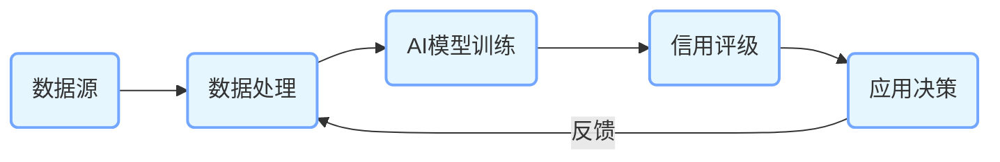

# AI在供应链金融信用评级中的深度应用

> 关键词：AI、供应链金融、信用评级、机器学习、大数据、风险评估、金融科技

> 摘要：本文聚焦于AI在供应链金融信用评级中的深度应用。首先介绍了研究背景和相关概念，明确了研究目的和预期读者等内容。接着阐述了AI与供应链金融信用评级的核心概念及联系，分析了核心算法原理并给出Python代码示例。通过数学模型和公式详细讲解了信用评级中的计算逻辑。在项目实战部分，从开发环境搭建到源代码实现与解读，全面展示了AI在信用评级中的具体应用。同时探讨了其实际应用场景，推荐了相关学习资源、开发工具和论文著作。最后总结了未来发展趋势与挑战，提供常见问题解答和参考资料，旨在为深入理解和应用AI进行供应链金融信用评级提供全面且深入的指导。

## 1. 背景介绍 
### 1.1 目的和范围
随着全球经济的快速发展，供应链金融作为一种创新的金融模式，逐渐成为解决中小企业融资难题的重要手段。然而，供应链金融中的信用风险评估一直是一个关键且具有挑战性的问题。传统的信用评级方法往往依赖于有限的财务数据和主观判断，难以全面、准确地评估供应链中各参与方的信用状况。

本文章的目的在于深入探讨AI在供应链金融信用评级中的应用，旨在揭示AI技术如何提高信用评级的准确性、效率和可靠性，为金融机构和企业提供更科学的信用评估方法。范围涵盖了AI相关技术如机器学习、深度学习等在信用评级中的原理、算法、应用案例以及未来发展趋势等方面。

### 1.2 预期读者
本文预期读者包括金融行业从业者，如银行信贷人员、供应链金融分析师、风险管理专家等，他们可以从本文中获取AI在信用评级中的最新应用方法和技术，以优化现有的信用评估流程。同时，对于计算机科学领域的研究人员和开发者，本文提供了AI在金融领域具体应用的案例和实践经验，有助于拓展其技术应用场景。此外，对供应链金融和AI技术感兴趣的学者、学生也可以从本文中获取相关知识和研究思路。

### 1.3 文档结构概述
本文将按照以下结构展开：首先介绍背景信息，包括目的、预期读者等内容。接着阐述AI与供应链金融信用评级的核心概念及联系，通过文本示意图和Mermaid流程图进行详细说明。然后分析核心算法原理，并给出Python源代码进行详细阐述。通过数学模型和公式进一步解释信用评级的计算逻辑，并举例说明。在项目实战部分，从开发环境搭建到源代码实现与解读，全面展示AI在信用评级中的具体应用。之后探讨AI在供应链金融信用评级中的实际应用场景。推荐相关学习资源、开发工具和论文著作。最后总结未来发展趋势与挑战，提供常见问题解答和参考资料。

### 1.4 术语表
#### 1.4.1 核心术语定义
- **供应链金融**：指银行等金融机构围绕核心企业，管理上下游中小企业的资金流和物流，并把单个企业的不可控风险转变为供应链企业整体的可控风险，通过立体获取各类信息，将风险控制在最低的金融服务。
- **信用评级**：是指由独立的信用评级机构对影响评级对象的信用风险因素进行分析研究，就其偿还债务的能力及其偿债意愿进行综合评价，并且用简单明了的符号表示出来的一种评价行为。
- **AI（人工智能）**：是研究、开发用于模拟、延伸和扩展人的智能的理论、方法、技术及应用系统的一门新的技术科学。
- **机器学习**：是一门多领域交叉学科，涉及概率论、统计学、逼近论、凸分析、算法复杂度理论等多门学科。它专门研究计算机怎样模拟或实现人类的学习行为，以获取新的知识或技能，重新组织已有的知识结构使之不断改善自身的性能。
- **深度学习**：是机器学习的一个分支领域，它是一种基于对数据进行表征学习的方法。深度学习通过构建具有很多层的神经网络模型，自动从大量数据中学习特征和模式。

#### 1.4.2 相关概念解释
- **数据挖掘**：是指从大量的数据中通过算法搜索隐藏于其中信息的过程。在供应链金融信用评级中，数据挖掘可用于从海量的供应链数据中提取有价值的信息，如企业的交易记录、物流信息等，为信用评级提供数据支持。
- **风险评估**：是指在风险事件发生之前或之后（但还没有结束），该事件给人们的生活、生命、财产等各个方面造成的影响和损失的可能性进行量化评估的工作。在供应链金融中，风险评估是信用评级的重要环节，通过对各种风险因素的评估，确定企业的信用等级。
- **特征工程**：是指对原始数据进行清洗、转换、提取等操作，以得到适合机器学习算法处理的特征数据的过程。在供应链金融信用评级中，特征工程可用于从供应链数据中提取与信用风险相关的特征，如企业的财务比率、交易频率等。

#### 1.4.3 缩略词列表
- **AI**：Artificial Intelligence（人工智能）
- **ML**：Machine Learning（机器学习）
- **DL**：Deep Learning（深度学习）
- **PCA**：Principal Component Analysis（主成分分析）
- **SVM**：Support Vector Machine（支持向量机）

## 2. 核心概念与联系 

### 核心概念原理
#### 供应链金融原理
供应链金融的核心在于围绕核心企业，将供应链中的上下游企业视为一个整体。核心企业通常具有较强的信用实力和市场地位，通过与金融机构合作，将其信用延伸到上下游企业。金融机构基于供应链中的真实交易背景，对上下游企业提供融资服务。例如，供应商可以凭借与核心企业的应收账款向金融机构申请融资，经销商可以凭借与核心企业的采购合同获得库存融资。

#### 信用评级原理
信用评级是基于对企业的信用风险进行评估，确定其信用等级。传统的信用评级主要基于企业的财务报表、信用记录等信息，通过分析企业的偿债能力、盈利能力、运营能力等方面的指标，对企业的信用状况进行评价。而在供应链金融中，信用评级不仅考虑企业自身的财务状况，还需要考虑供应链中的交易关系、物流信息等因素，以更全面地评估企业的信用风险。

#### AI原理
AI技术包括机器学习、深度学习等，其原理是通过对大量数据的学习和分析，发现数据中的模式和规律，并利用这些模式和规律进行预测和决策。在供应链金融信用评级中，AI技术可以处理海量的供应链数据，自动提取与信用风险相关的特征，建立信用评级模型，从而提高信用评级的准确性和效率。

### 架构的文本示意图
```plaintext
供应链金融信用评级系统架构

数据源层：
    - 企业财务数据
    - 供应链交易数据
    - 物流数据
    - 信用记录数据

数据处理层：
    - 数据清洗
    - 特征提取
    - 数据转换

AI模型层：
    - 机器学习模型（如决策树、随机森林、SVM等）
    - 深度学习模型（如神经网络、循环神经网络等）

信用评级层：
    - 根据AI模型的输出，确定企业的信用等级

应用层：
    - 金融机构的信贷决策
    - 企业的融资申请
    - 供应链风险管理
```

### Mermaid流程图


## 3. 核心算法原理 & 具体操作步骤 

### 核心算法原理
#### 决策树算法
决策树是一种基于树结构进行决策的机器学习算法。它通过对数据的特征进行划分，构建一棵决策树，每个内部节点表示一个特征上的测试，每个分支表示一个测试输出，每个叶节点表示一个类别或值。在供应链金融信用评级中，决策树可以根据企业的各种特征（如财务指标、交易记录等），构建决策树模型，对企业的信用等级进行分类。

#### 随机森林算法
随机森林是一种集成学习算法，它由多个决策树组成。在构建随机森林时，首先从原始数据中随机抽取样本，构建多个决策树，然后对这些决策树的结果进行综合，得到最终的预测结果。随机森林可以减少决策树的过拟合问题，提高模型的泛化能力。

#### 支持向量机算法
支持向量机是一种二分类模型，它的基本思想是在特征空间中找到一个最优的超平面，使得不同类别的样本能够被最大程度地分开。在供应链金融信用评级中，支持向量机可以将企业分为不同的信用等级类别。

### 具体操作步骤
1. **数据收集**：收集企业的财务数据、供应链交易数据、物流数据、信用记录数据等。
2. **数据预处理**：对收集到的数据进行清洗，去除缺失值、异常值等；进行特征提取，选择与信用风险相关的特征；进行数据转换，将数据转换为适合机器学习算法处理的格式。
3. **模型训练**：选择合适的AI算法（如决策树、随机森林、支持向量机等），使用训练数据对模型进行训练。
4. **模型评估**：使用测试数据对训练好的模型进行评估，计算模型的准确率、召回率、F1值等指标，评估模型的性能。
5. **信用评级**：使用训练好的模型对新的企业数据进行预测，确定企业的信用等级。

### Python源代码示例
```python
import pandas as pd
from sklearn.model_selection import train_test_split
from sklearn.tree import DecisionTreeClassifier
from sklearn.ensemble import RandomForestClassifier
from sklearn.svm import SVC
from sklearn.metrics import accuracy_score, recall_score, f1_score

# 数据收集和预处理
data = pd.read_csv('supply_chain_data.csv')
X = data.drop('credit_rating', axis=1)
y = data['credit_rating']

# 划分训练集和测试集
X_train, X_test, y_train, y_test = train_test_split(X, y, test_size=0.2, random_state=42)

# 决策树模型
dt_model = DecisionTreeClassifier()
dt_model.fit(X_train, y_train)
dt_pred = dt_model.predict(X_test)
dt_accuracy = accuracy_score(y_test, dt_pred)
dt_recall = recall_score(y_test, dt_pred, average='weighted')
dt_f1 = f1_score(y_test, dt_pred, average='weighted')

print(f"Decision Tree - Accuracy: {dt_accuracy}, Recall: {dt_recall}, F1-score: {dt_f1}")

# 随机森林模型
rf_model = RandomForestClassifier()
rf_model.fit(X_train, y_train)
rf_pred = rf_model.predict(X_test)
rf_accuracy = accuracy_score(y_test, rf_pred)
rf_recall = recall_score(y_test, rf_pred, average='weighted')
rf_f1 = f1_score(y_test, rf_pred, average='weighted')

print(f"Random Forest - Accuracy: {rf_accuracy}, Recall: {rf_recall}, F1-score: {rf_f1}")

# 支持向量机模型
svm_model = SVC()
svm_model.fit(X_train, y_train)
svm_pred = svm_model.predict(X_test)
svm_accuracy = accuracy_score(y_test, svm_pred)
svm_recall = recall_score(y_test, svm_pred, average='weighted')
svm_f1 = f1_score(y_test, svm_pred, average='weighted')

print(f"SVM - Accuracy: {svm_accuracy}, Recall: {svm_recall}, F1-score: {svm_f1}")
```

## 4. 数学模型和公式 & 详细讲解 & 举例说明 

### 决策树算法数学模型
决策树的核心是选择最优的特征进行划分，常用的划分标准有信息增益、信息增益率、基尼指数等。

#### 信息增益
信息增益是指在划分数据集前后信息发生的变化。设数据集 $D$ 中第 $k$ 类样本所占的比例为 $p_k$（$k = 1,2,\cdots,K$），则数据集 $D$ 的信息熵为：
$$
H(D)=-\sum_{k = 1}^{K}p_k\log_2p_k
$$
设特征 $A$ 有 $V$ 个可能的取值 $\{a^1,a^2,\cdots,a^V\}$，根据特征 $A$ 的取值将数据集 $D$ 划分为 $V$ 个子集 $\{D^1,D^2,\cdots,D^V\}$，则特征 $A$ 对数据集 $D$ 的信息增益为：
$$
Gain(D,A)=H(D)-\sum_{v = 1}^{V}\frac{|D^v|}{|D|}H(D^v)
$$
其中，$|D|$ 表示数据集 $D$ 的样本数量，$|D^v|$ 表示子集 $D^v$ 的样本数量。

#### 举例说明
假设有一个数据集 $D$ 包含 10 个样本，分为 2 类，其中第 1 类有 6 个样本，第 2 类有 4 个样本。则数据集 $D$ 的信息熵为：
$$
H(D)=-\frac{6}{10}\log_2\frac{6}{10}-\frac{4}{10}\log_2\frac{4}{10}\approx 0.971
$$
假设有一个特征 $A$，它有 2 个取值，根据特征 $A$ 的取值将数据集 $D$ 划分为 2 个子集 $D^1$ 和 $D^2$，其中 $D^1$ 有 4 个样本，第 1 类有 3 个，第 2 类有 1 个；$D^2$ 有 6 个样本，第 1 类有 3 个，第 2 类有 3 个。则子集 $D^1$ 的信息熵为：
$$
H(D^1)=-\frac{3}{4}\log_2\frac{3}{4}-\frac{1}{4}\log_2\frac{1}{4}\approx 0.811
$$
子集 $D^2$ 的信息熵为：
$$
H(D^2)=-\frac{3}{6}\log_2\frac{3}{6}-\frac{3}{6}\log_2\frac{3}{6}=1
$$
特征 $A$ 对数据集 $D$ 的信息增益为：
$$
Gain(D,A)=0.971-\frac{4}{10}\times 0.811-\frac{6}{10}\times 1\approx 0.046
$$

### 随机森林算法数学模型
随机森林是由多个决策树组成的集成学习模型。设随机森林中有 $T$ 棵决策树，对于一个样本 $x$，第 $t$ 棵决策树的预测结果为 $h_t(x)$，则随机森林的最终预测结果为：
$$
H(x)=\arg\max_{y}\sum_{t = 1}^{T}I(h_t(x)=y)
$$
其中，$I$ 为指示函数，当 $h_t(x)=y$ 时，$I(h_t(x)=y)=1$，否则 $I(h_t(x)=y)=0$。

### 支持向量机算法数学模型
支持向量机的目标是在特征空间中找到一个最优的超平面 $w^Tx + b = 0$，使得不同类别的样本能够被最大程度地分开。设训练数据集为 $\{(x_1,y_1),(x_2,y_2),\cdots,(x_n,y_n)\}$，其中 $x_i\in\mathbb{R}^d$ 为样本特征向量，$y_i\in\{-1,1\}$ 为样本标签。支持向量机的优化问题可以表示为：
$$
\min_{w,b}\frac{1}{2}\|w\|^2
$$
约束条件为：
$$
y_i(w^Tx_i + b)\geq 1, i = 1,2,\cdots,n
$$
通过引入拉格朗日乘子 $\alpha_i\geq 0$，可以将上述优化问题转化为对偶问题：
$$
\max_{\alpha}\sum_{i = 1}^{n}\alpha_i-\frac{1}{2}\sum_{i = 1}^{n}\sum_{j = 1}^{n}\alpha_i\alpha_jy_iy_jx_i^Tx_j
$$
约束条件为：
$$
\sum_{i = 1}^{n}\alpha_iy_i = 0, \alpha_i\geq 0, i = 1,2,\cdots,n
$$

## 5. 项目实战：代码实际案例和详细解释说明 

### 5.1  开发环境搭建
#### 安装Python
首先需要安装Python环境，建议使用Python 3.7及以上版本。可以从Python官方网站（https://www.python.org/downloads/） 下载安装包，按照安装向导进行安装。

#### 安装必要的库
使用pip命令安装必要的库，包括pandas、scikit-learn等。在命令行中执行以下命令：
```sh
pip install pandas scikit-learn
```

### 5.2  源代码详细实现和代码解读
```python
import pandas as pd
from sklearn.model_selection import train_test_split
from sklearn.tree import DecisionTreeClassifier
from sklearn.ensemble import RandomForestClassifier
from sklearn.svm import SVC
from sklearn.metrics import accuracy_score, recall_score, f1_score

# 数据收集和预处理
# 读取数据集
data = pd.read_csv('supply_chain_data.csv')
# 提取特征和标签
X = data.drop('credit_rating', axis=1)
y = data['credit_rating']

# 划分训练集和测试集
# test_size=0.2 表示将20%的数据作为测试集
# random_state=42 是为了保证结果的可重复性
X_train, X_test, y_train, y_test = train_test_split(X, y, test_size=0.2, random_state=42)

# 决策树模型
dt_model = DecisionTreeClassifier()
# 训练决策树模型
dt_model.fit(X_train, y_train)
# 使用训练好的模型进行预测
dt_pred = dt_model.predict(X_test)
# 计算决策树模型的准确率
dt_accuracy = accuracy_score(y_test, dt_pred)
# 计算决策树模型的召回率
dt_recall = recall_score(y_test, dt_pred, average='weighted')
# 计算决策树模型的F1值
dt_f1 = f1_score(y_test, dt_pred, average='weighted')

print(f"Decision Tree - Accuracy: {dt_accuracy}, Recall: {dt_recall}, F1-score: {dt_f1}")

# 随机森林模型
rf_model = RandomForestClassifier()
# 训练随机森林模型
rf_model.fit(X_train, y_train)
# 使用训练好的模型进行预测
rf_pred = rf_model.predict(X_test)
# 计算随机森林模型的准确率
rf_accuracy = accuracy_score(y_test, rf_pred)
# 计算随机森林模型的召回率
rf_recall = recall_score(y_test, rf_pred, average='weighted')
# 计算随机森林模型的F1值
rf_f1 = f1_score(y_test, rf_pred, average='weighted')

print(f"Random Forest - Accuracy: {rf_accuracy}, Recall: {rf_recall}, F1-score: {rf_f1}")

# 支持向量机模型
svm_model = SVC()
# 训练支持向量机模型
svm_model.fit(X_train, y_train)
# 使用训练好的模型进行预测
svm_pred = svm_model.predict(X_test)
# 计算支持向量机模型的准确率
svm_accuracy = accuracy_score(y_test, svm_pred)
# 计算支持向量机模型的召回率
svm_recall = recall_score(y_test, svm_pred, average='weighted')
# 计算支持向量机模型的F1值
svm_f1 = f1_score(y_test, svm_pred, average='weighted')

print(f"SVM - Accuracy: {svm_accuracy}, Recall: {svm_recall}, F1-score: {svm_f1}")
```

### 5.3  代码解读与分析
- **数据读取和预处理**：使用`pandas`库的`read_csv`函数读取数据集，然后使用`drop`方法提取特征和标签。
- **数据集划分**：使用`train_test_split`函数将数据集划分为训练集和测试集，方便后续的模型训练和评估。
- **模型训练和预测**：分别创建决策树、随机森林和支持向量机模型，使用`fit`方法进行训练，使用`predict`方法进行预测。
- **模型评估**：使用`accuracy_score`、`recall_score`和`f1_score`函数计算模型的准确率、召回率和F1值，评估模型的性能。

通过比较不同模型的评估指标，可以选择性能最优的模型用于供应链金融信用评级。

## 6. 实际应用场景 
### 金融机构信贷决策
金融机构在进行信贷决策时，需要对借款企业的信用状况进行评估。传统的信用评估方法往往只关注企业的财务报表和信用记录，难以全面反映企业的真实信用风险。AI在供应链金融信用评级中的应用，可以帮助金融机构更全面地评估企业的信用状况。通过分析供应链中的交易数据、物流信息等，金融机构可以了解企业的上下游合作关系、交易稳定性等情况，从而更准确地评估企业的还款能力和信用风险。例如，银行可以根据AI模型的信用评级结果，决定是否给予企业贷款以及贷款的额度和利率。

### 企业融资申请
对于中小企业来说，融资难一直是制约其发展的重要问题。在供应链金融模式下，企业可以凭借与核心企业的交易关系申请融资。AI技术可以帮助企业更准确地了解自身的信用状况，提高融资申请的成功率。企业可以通过分析自身在供应链中的交易数据，利用AI模型进行信用评级，找出影响信用评级的因素，并采取相应的措施进行改进。例如，企业可以优化与供应商和客户的合作关系，提高交易的稳定性和质量，从而提升自身的信用等级。

### 供应链风险管理
供应链中的任何一个环节出现问题，都可能影响整个供应链的稳定性和效率。AI在供应链金融信用评级中的应用，可以帮助企业和金融机构更好地管理供应链风险。通过对供应链中各参与方的信用状况进行实时监测和评估，及时发现潜在的风险因素，并采取相应的措施进行防范和控制。例如，当发现某个供应商的信用等级下降时，企业可以及时调整采购策略，寻找替代供应商，以降低供应链中断的风险。

## 7. 工具和资源推荐
### 7.1 学习资源推荐
#### 7.1.1 书籍推荐
- 《机器学习》（周志华）：这本书是机器学习领域的经典教材，全面介绍了机器学习的基本概念、算法和应用。
- 《深度学习》（Ian Goodfellow、Yoshua Bengio和Aaron Courville）：本书是深度学习领域的权威著作，深入讲解了深度学习的理论和实践。
- 《Python数据分析实战》（Sebastian Raschka）：该书介绍了使用Python进行数据分析的方法和技巧，包括数据处理、可视化、机器学习等方面的内容。

#### 7.1.2 在线课程
- Coursera上的“机器学习”课程（Andrew Ng）：这是一门非常经典的机器学习课程，由斯坦福大学的Andrew Ng教授授课，内容涵盖了机器学习的基本概念、算法和应用。
- edX上的“深度学习微硕士”课程：该课程由多家知名高校和企业联合推出，深入讲解了深度学习的理论和实践，包括神经网络、卷积神经网络、循环神经网络等内容。
- 中国大学MOOC上的“人工智能基础”课程：该课程介绍了人工智能的基本概念、技术和应用，适合初学者学习。

#### 7.1.3 技术博客和网站
- 博客园（https://www.cnblogs.com/）：这是一个技术博客平台，有很多关于机器学习、人工智能等领域的技术文章和经验分享。
- 开源中国（https://www.oschina.net/）：该网站提供了丰富的开源项目和技术文章，涵盖了计算机科学的各个领域。
- Kaggle（https://www.kaggle.com/）：这是一个数据科学竞赛平台，有很多关于机器学习、数据挖掘等领域的竞赛和数据集，同时也有很多优秀的数据科学家分享他们的经验和代码。

### 7.2 开发工具框架推荐
#### 7.2.1 IDE和编辑器
- PyCharm：这是一款专门为Python开发设计的集成开发环境，具有代码编辑、调试、版本控制等功能，非常适合Python开发。
- Jupyter Notebook：这是一个交互式的开发环境，支持多种编程语言，适合进行数据分析、机器学习等领域的开发和实验。
- Visual Studio Code：这是一款轻量级的代码编辑器，支持多种编程语言和插件，具有丰富的功能和扩展能力。

#### 7.2.2 调试和性能分析工具
- PySnooper：这是一个简单易用的Python调试工具，可以自动记录函数的执行过程和变量的值，方便调试代码。
- cProfile：这是Python自带的性能分析工具，可以分析代码的运行时间和函数调用次数，帮助优化代码性能。
- TensorBoard：这是TensorFlow的可视化工具，可以可视化模型的训练过程、损失函数、准确率等指标，方便调试和优化深度学习模型。

#### 7.2.3 相关框架和库
- scikit-learn：这是一个常用的机器学习库，提供了丰富的机器学习算法和工具，包括分类、回归、聚类等算法。
- TensorFlow：这是一个开源的深度学习框架，由Google开发，支持多种深度学习模型的构建和训练。
- PyTorch：这是一个开源的深度学习框架，由Facebook开发，具有动态计算图等特点，适合进行深度学习研究和开发。

### 7.3 相关论文著作推荐
#### 7.3.1 经典论文
- 《A Decision-Theoretic Generalization of On-Line Learning and an Application to Boosting》（Yoav Freund和Robert E. Schapire）：这篇论文介绍了Adaboost算法，是机器学习领域的经典论文之一。
- 《ImageNet Classification with Deep Convolutional Neural Networks》（Alex Krizhevsky、Ilya Sutskever和Geoffrey E. Hinton）：这篇论文介绍了AlexNet模型，开启了深度学习在计算机视觉领域的广泛应用。
- 《Long Short-Term Memory》（Sepp Hochreiter和Jürgen Schmidhuber）：这篇论文介绍了LSTM模型，解决了循环神经网络中的梯度消失问题，在自然语言处理等领域有广泛应用。

#### 7.3.2 最新研究成果
- 关注顶级学术会议如NeurIPS（神经信息处理系统大会）、ICML（国际机器学习会议）、CVPR（计算机视觉与模式识别会议）等的最新论文，了解AI在供应链金融信用评级等领域的最新研究进展。
- 关注知名学术期刊如《Journal of Artificial Intelligence Research》、《Artificial Intelligence》等的相关研究论文。

#### 7.3.3 应用案例分析
- 关注金融机构和企业的官方网站，了解他们在供应链金融信用评级中应用AI技术的成功案例和实践经验。
- 阅读相关的行业报告和研究白皮书，如艾瑞咨询、德勤等机构发布的关于供应链金融和金融科技的报告，了解行业动态和应用案例。

## 8. 总结：未来发展趋势与挑战
### 未来发展趋势
#### 多模态数据融合
未来，AI在供应链金融信用评级中将更多地融合多模态数据，如文本、图像、音频等。除了传统的财务数据和交易数据，还可以利用企业的社交媒体数据、产品图片、物流视频等信息，更全面地了解企业的信用状况。例如，通过分析企业在社交媒体上的口碑和评价，了解企业的市场形象和声誉。

#### 深度学习的进一步应用
深度学习技术将在供应链金融信用评级中得到更广泛的应用。深度学习模型可以自动从大量数据中学习复杂的特征和模式，提高信用评级的准确性和效率。例如，使用卷积神经网络（CNN）处理图像数据，使用循环神经网络（RNN）处理序列数据，使用生成对抗网络（GAN）进行数据增强等。

#### 与区块链技术的结合
区块链技术具有去中心化、不可篡改、可追溯等特点，可以为供应链金融信用评级提供更可靠的数据基础。AI与区块链技术的结合，可以实现供应链数据的安全共享和可信存储，提高信用评级的可信度。例如，通过区块链记录供应链中的交易信息，AI可以基于这些可信数据进行信用评级。

#### 实时信用评估
未来，供应链金融信用评级将向实时评估方向发展。随着物联网技术的发展，企业的生产、销售、物流等数据可以实时采集和传输。AI可以利用这些实时数据，对企业的信用状况进行实时监测和评估，及时发现潜在的信用风险。

### 挑战
#### 数据质量和安全问题
AI在供应链金融信用评级中依赖大量的数据，但数据质量和安全问题是一个重要的挑战。数据可能存在缺失、错误、不一致等问题，影响信用评级的准确性。同时，供应链数据涉及企业的商业机密和敏感信息，数据安全和隐私保护至关重要。

#### 模型可解释性问题
深度学习等AI模型往往是黑盒模型，其决策过程难以解释。在供应链金融信用评级中，金融机构和企业需要了解模型的决策依据，以便做出合理的决策。因此，如何提高AI模型的可解释性是一个亟待解决的问题。

#### 法律法规和监管问题
AI在供应链金融信用评级中的应用涉及到一系列法律法规和监管问题。例如，数据的收集、使用和共享需要遵守相关的法律法规，确保数据的合法性和合规性。同时，监管机构需要制定相应的监管政策，规范AI在金融领域的应用，防范金融风险。

#### 人才短缺问题
AI在供应链金融信用评级中的应用需要既懂AI技术又懂金融业务的复合型人才。目前，这类人才相对短缺，限制了AI技术在供应链金融领域的推广和应用。

## 9. 附录：常见问题与解答
### 1. AI在供应链金融信用评级中的应用是否会完全取代人工评估？
不会。虽然AI技术可以提高信用评级的准确性和效率，但人工评估仍然具有重要的作用。人工评估可以结合行业经验和专业知识，对一些复杂的情况进行判断和分析。同时，人工评估也可以对AI模型的结果进行审核和验证，确保信用评级的可靠性。

### 2. 如何保证AI模型在供应链金融信用评级中的公正性和客观性？
为了保证AI模型的公正性和客观性，需要从以下几个方面入手：
- **数据质量**：确保数据的准确性、完整性和一致性，避免数据偏差对模型的影响。
- **模型选择和训练**：选择合适的AI模型，并使用合理的训练方法和参数，避免模型过拟合或欠拟合。
- **模型评估和验证**：使用多种评估指标对模型进行评估和验证，确保模型的性能和可靠性。
- **审计和监督**：对AI模型的开发、训练和应用过程进行审计和监督，确保模型的公正性和客观性。

### 3. AI模型在供应链金融信用评级中的性能如何评估？
可以使用以下指标评估AI模型在供应链金融信用评级中的性能：
- **准确率**：预测正确的样本数占总样本数的比例。
- **召回率**：预测为正类的样本中实际为正类的比例。
- **F1值**：准确率和召回率的调和平均数，综合考虑了模型的准确性和召回率。
- **ROC曲线和AUC值**：ROC曲线是描述真阳性率和假阳性率之间关系的曲线，AUC值是ROC曲线下的面积，反映了模型的整体性能。

### 4. 如何处理供应链金融信用评级中的缺失数据？
处理缺失数据的方法有很多种，常见的方法包括：
- **删除缺失值**：如果缺失值的比例较小，可以直接删除包含缺失值的样本。
- **填充缺失值**：可以使用均值、中位数、众数等统计量填充缺失值，也可以使用机器学习算法进行填充。
- **使用不依赖缺失值的算法**：一些算法如决策树、随机森林等可以处理缺失值，不需要对缺失值进行特殊处理。

## 10. 扩展阅读 & 参考资料
### 扩展阅读
- 《金融科技：重构未来金融生态》：本书介绍了金融科技的发展趋势和应用场景，包括AI、区块链、大数据等技术在金融领域的应用。
- 《供应链金融：新经济下的新金融》：该书深入探讨了供应链金融的理论和实践，包括供应链金融的模式、风险控制等方面的内容。
- 《人工智能时代的金融科技与金融安全》：本书分析了人工智能时代金融科技的发展对金融安全的影响，以及如何应对金融科技带来的挑战。

### 参考资料
- 相关学术论文和研究报告，如IEEE Transactions on Neural Networks and Learning Systems、ACM Transactions on Intelligent Systems and Technology等期刊上的论文。
- 金融机构和企业的官方网站和年报，了解他们在供应链金融信用评级中应用AI技术的实践经验和数据。
- 行业协会和研究机构发布的统计数据和行业报告，如中国供应链金融产业生态联盟、艾瑞咨询等机构发布的报告。