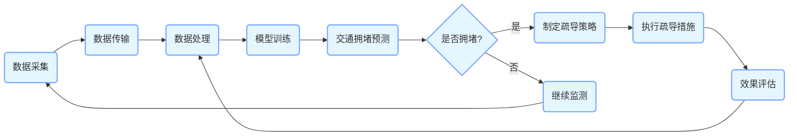

# AI在智能交通拥堵预测与疏导中的应用

> 关键词：人工智能、智能交通、拥堵预测、拥堵疏导、机器学习、深度学习、交通大数据

> 摘要：本文深入探讨了AI在智能交通拥堵预测与疏导中的应用。首先介绍了智能交通领域的背景知识，包括目的、预期读者等内容。接着阐述了AI相关的核心概念及其与智能交通的联系，详细讲解了核心算法原理及具体操作步骤，并给出了Python代码示例。通过数学模型和公式进一步剖析了拥堵预测与疏导的理论基础。在项目实战部分，展示了开发环境搭建、源代码实现及代码解读。同时探讨了AI在智能交通中的实际应用场景，推荐了相关的学习资源、开发工具框架和论文著作。最后总结了未来发展趋势与挑战，并对常见问题进行了解答，为相关研究和实践提供了全面且深入的参考。

## 1. 背景介绍 
### 1.1 目的和范围
随着城市化进程的加速和机动车保有量的持续增长，交通拥堵已成为困扰各大城市的严重问题。交通拥堵不仅导致出行时间增加、能源消耗增大、环境污染加剧，还影响了城市的经济发展和居民的生活质量。因此，如何有效地预测交通拥堵并进行及时疏导，成为智能交通领域的关键研究课题。

本文的目的在于全面介绍AI在智能交通拥堵预测与疏导中的应用，涵盖从基本概念、算法原理到实际项目应用的各个方面，旨在为相关领域的研究人员、开发者和决策者提供系统的知识和实用的技术参考。范围包括但不限于AI技术在交通数据采集、处理、分析、预测和疏导策略制定等环节的应用，以及相关的数学模型、算法实现和实际案例分析。

### 1.2 预期读者
本文预期读者包括智能交通领域的研究人员、学者，他们可以从本文中获取AI在交通拥堵预测与疏导方面的最新研究进展和技术思路，为进一步的学术研究提供参考；交通管理部门的决策者，通过了解AI技术在智能交通中的应用，能够制定更加科学合理的交通管理政策和规划；软件开发者和工程师，可从本文中学习到具体的算法实现和项目开发经验，用于开发智能交通相关的软件系统和应用；以及对智能交通和AI技术感兴趣的广大爱好者，帮助他们了解这一领域的基本概念和应用前景。

### 1.3 文档结构概述
本文按照以下结构进行组织：首先介绍背景知识，包括目的、预期读者和文档结构概述等内容；接着阐述AI在智能交通中的核心概念及其与交通拥堵预测和疏导的联系，并给出相应的文本示意图和Mermaid流程图；然后详细讲解核心算法原理及具体操作步骤，结合Python代码进行说明；通过数学模型和公式进一步深入剖析相关理论；在项目实战部分，展示开发环境搭建、源代码实现及代码解读；探讨AI在智能交通中的实际应用场景；推荐相关的学习资源、开发工具框架和论文著作；总结未来发展趋势与挑战；解答常见问题；最后提供扩展阅读和参考资料。

### 1.4 术语表
#### 1.4.1 核心术语定义
- **人工智能（AI）**：是一门研究如何使计算机能够模拟人类智能的学科，包括机器学习、深度学习、自然语言处理等多个领域。
- **智能交通系统（ITS）**：是将先进的信息技术、通信技术、传感器技术、控制技术和计算机技术等有效地集成运用于整个交通运输管理体系，从而建立起一种在大范围内、全方位发挥作用的，实时、准确、高效的综合运输和管理系统。
- **交通拥堵预测**：是指通过对历史交通数据和实时交通信息的分析，运用一定的算法和模型，对未来某一时刻或时间段内的交通拥堵状况进行预测。
- **交通拥堵疏导**：是指在交通拥堵发生或即将发生时，采取一系列措施，如调整交通信号灯配时、引导车辆分流、发布交通信息等，以缓解交通拥堵，提高交通运行效率。
- **机器学习**：是人工智能的一个重要分支，它致力于研究如何让计算机从数据中自动学习规律，并利用这些规律对未知数据进行预测和决策。
- **深度学习**：是机器学习的一种特殊形式，它通过构建多层神经网络，自动从大量数据中学习特征和模式，在图像识别、语音识别、自然语言处理等领域取得了显著的成果。

#### 1.4.2 相关概念解释
- **交通大数据**：是指在智能交通系统中产生的大量、多源、异构的数据，包括交通流量数据、车速数据、车辆位置数据、交通事件数据等。这些数据具有海量性、高维性、实时性等特点，为交通拥堵预测和疏导提供了丰富的信息来源。
- **传感器网络**：是由大量的传感器节点组成的网络，用于实时采集交通数据，如交通流量、车速、车辆密度等。常见的传感器包括地磁传感器、激光雷达、摄像头等。
- **交通流理论**：是研究交通流特性和规律的理论，主要包括交通流的基本参数（如流量、速度、密度）之间的关系，以及交通流的动力学模型和行为特性。

#### 1.4.3 缩略词列表
- **AI**：Artificial Intelligence（人工智能）
- **ITS**：Intelligent Transportation System（智能交通系统）
- **ML**：Machine Learning（机器学习）
- **DL**：Deep Learning（深度学习）
- **GPS**：Global Positioning System（全球定位系统）
- **RFID**：Radio Frequency Identification（射频识别）

## 2. 核心概念与联系 
### 核心概念原理
在智能交通拥堵预测与疏导中，AI技术起着至关重要的作用。其核心原理在于利用各种传感器和数据源收集交通数据，然后运用机器学习和深度学习等AI算法对这些数据进行分析和处理，以实现对交通拥堵的预测和疏导。

交通数据的采集是整个过程的基础，通过分布在道路上的各种传感器（如地磁传感器、摄像头、GPS等），可以实时获取交通流量、车速、车辆位置等信息。这些数据被传输到数据中心进行存储和预处理，去除噪声和异常值，以提高数据的质量。

机器学习和深度学习算法则用于对预处理后的数据进行分析和建模。机器学习算法可以通过对历史数据的学习，发现交通流量、车速等参数之间的关系和规律，从而建立预测模型。常见的机器学习算法包括线性回归、决策树、支持向量机等。深度学习算法则通过构建多层神经网络，自动从大量数据中学习复杂的特征和模式，在交通拥堵预测方面具有更高的准确性和泛化能力。常见的深度学习模型包括卷积神经网络（CNN）、循环神经网络（RNN）及其变体（如LSTM、GRU）等。

基于预测模型，可以对未来某一时刻或时间段内的交通拥堵状况进行预测。当预测到交通拥堵即将发生时，交通管理部门可以采取相应的疏导措施，如调整交通信号灯配时、引导车辆分流、发布交通信息等，以缓解交通拥堵，提高交通运行效率。

### 架构的文本示意图
智能交通拥堵预测与疏导系统的架构主要包括以下几个部分：
1. **数据采集层**：负责实时采集交通数据，包括交通流量、车速、车辆位置等信息。数据源主要包括各种传感器（如地磁传感器、摄像头、GPS等）、交通信息平台和社交媒体等。
2. **数据传输层**：将采集到的交通数据传输到数据中心进行存储和处理。传输方式可以采用有线或无线通信技术，如以太网、Wi-Fi、4G/5G等。
3. **数据处理层**：对采集到的交通数据进行预处理，去除噪声和异常值，提取有用的特征。同时，利用机器学习和深度学习算法对预处理后的数据进行分析和建模，建立交通拥堵预测模型。
4. **决策支持层**：根据交通拥堵预测结果，制定相应的疏导策略。决策支持系统可以结合交通规则、道路状况和实时交通信息等因素，生成最优的疏导方案。
5. **执行层**：将疏导策略下发到相关的交通设备和管理部门，如交通信号灯、可变情报板、执法车辆等，以执行相应的疏导措施。
6. **用户交互层**：为交通管理部门、驾驶员和公众提供交互界面，方便他们获取交通信息和反馈意见。用户交互方式可以包括网站、手机应用、短信等。

### Mermaid流程图


## 3. 核心算法原理 & 具体操作步骤 
### 线性回归算法原理
线性回归是一种简单而常用的机器学习算法，用于建立自变量和因变量之间的线性关系。在交通拥堵预测中，可以将交通流量、车速等因素作为自变量，将交通拥堵程度作为因变量，通过线性回归模型来预测交通拥堵状况。

线性回归模型的基本形式为：
$$y = \theta_0 + \theta_1x_1 + \theta_2x_2 + \cdots + \theta_nx_n + \epsilon$$
其中，$y$ 是因变量，$x_1, x_2, \cdots, x_n$ 是自变量，$\theta_0, \theta_1, \theta_2, \cdots, \theta_n$ 是模型的参数，$\epsilon$ 是误差项。

线性回归的目标是找到一组最优的参数 $\theta$，使得模型的预测值与真实值之间的误差最小。常用的误差度量方法是均方误差（MSE）：
$$MSE = \frac{1}{m}\sum_{i = 1}^{m}(y^{(i)} - \hat{y}^{(i)})^2$$
其中，$m$ 是样本数量，$y^{(i)}$ 是第 $i$ 个样本的真实值，$\hat{y}^{(i)}$ 是第 $i$ 个样本的预测值。

### 具体操作步骤及Python代码实现
以下是使用Python实现线性回归算法进行交通拥堵预测的具体步骤和代码示例：

```python
import numpy as np
from sklearn.linear_model import LinearRegression
from sklearn.model_selection import train_test_split
from sklearn.metrics import mean_squared_error

# 生成示例数据
# 假设我们有两个特征：交通流量和车速
# 以及一个目标变量：交通拥堵程度
np.random.seed(0)
traffic_flow = np.random.randint(100, 1000, 100)
speed = np.random.randint(10, 100, 100)
congestion_level = 0.5 * traffic_flow - 0.3 * speed + np.random.normal(0, 10, 100)

# 组合特征
X = np.column_stack((traffic_flow, speed))
y = congestion_level

# 划分训练集和测试集
X_train, X_test, y_train, y_test = train_test_split(X, y, test_size=0.2, random_state=42)

# 创建线性回归模型
model = LinearRegression()

# 训练模型
model.fit(X_train, y_train)

# 预测
y_pred = model.predict(X_test)

# 计算均方误差
mse = mean_squared_error(y_test, y_pred)
print(f"均方误差: {mse}")

# 输出模型参数
print(f"截距: {model.intercept_}")
print(f"系数: {model.coef_}")
```

### 代码解释
1. **数据生成**：使用 `numpy` 库生成示例数据，包括交通流量、车速和交通拥堵程度。
2. **数据划分**：使用 `train_test_split` 函数将数据划分为训练集和测试集，其中测试集占总数据的20%。
3. **模型创建**：使用 `LinearRegression` 类创建线性回归模型。
4. **模型训练**：使用 `fit` 方法对模型进行训练，即找到最优的参数 $\theta$。
5. **模型预测**：使用 `predict` 方法对测试集进行预测，得到预测值。
6. **误差计算**：使用 `mean_squared_error` 函数计算预测值与真实值之间的均方误差。
7. **参数输出**：输出模型的截距和系数，即 $\theta_0$ 和 $\theta_1, \theta_2$。

## 4. 数学模型和公式 & 详细讲解 & 举例说明 
### 交通流基本模型
交通流理论中，最基本的模型是流量 - 速度 - 密度关系模型。该模型描述了交通流量 $q$、车速 $v$ 和交通密度 $k$ 之间的关系，通常用以下公式表示：
$$q = k \cdot v$$
其中，$q$ 的单位是车辆数/小时，$k$ 的单位是车辆数/公里，$v$ 的单位是公里/小时。

这个公式表明，交通流量等于交通密度与车速的乘积。在交通拥堵预测中，可以通过实时监测交通密度和车速，计算出交通流量，从而判断交通拥堵状况。

### 举例说明
假设在某条道路上，交通密度为 $k = 50$ 车辆/公里，车速为 $v = 30$ 公里/小时，则根据上述公式，交通流量为：
$$q = k \cdot v = 50 \times 30 = 1500$$ 车辆/小时。

如果该道路的设计通行能力为 $q_{max} = 2000$ 车辆/小时，则当前交通流量未达到饱和，交通状况相对较好。如果交通密度增加到 $k = 80$ 车辆/公里，车速下降到 $v = 20$ 公里/小时，则交通流量为：
$$q = k \cdot v = 80 \times 20 = 1600$$ 车辆/小时。

虽然交通流量仍然未达到饱和，但车速明显下降，交通拥堵程度有所增加。

### 排队论模型
排队论是研究排队系统的数学理论，在交通拥堵疏导中具有重要的应用。排队论模型可以用来描述车辆在交叉口、收费站等地方的排队现象，通过分析排队长度、等待时间等参数，制定合理的疏导策略。

排队论中最基本的模型是 $M/M/1$ 模型，该模型假设车辆到达服从泊松分布，服务时间服从指数分布，且只有一个服务台。在 $M/M/1$ 模型中，排队系统的主要参数包括：
- 车辆到达率 $\lambda$：单位时间内到达的车辆数。
- 服务率 $\mu$：单位时间内能够服务的车辆数。
- 系统利用率 $\rho = \frac{\lambda}{\mu}$：表示服务台的繁忙程度。
- 平均排队长度 $L_q = \frac{\rho^2}{1 - \rho}$：表示系统中平均等待服务的车辆数。
- 平均等待时间 $W_q = \frac{\rho}{\mu(1 - \rho)}$：表示车辆平均等待服务的时间。

### 举例说明
假设在某交叉口，车辆到达率 $\lambda = 300$ 车辆/小时，服务率 $\mu = 400$ 车辆/小时，则系统利用率为：
$$\rho = \frac{\lambda}{\mu} = \frac{300}{400} = 0.75$$

平均排队长度为：
$$L_q = \frac{\rho^2}{1 - \rho} = \frac{0.75^2}{1 - 0.75} = \frac{0.5625}{0.25} = 2.25$$ 车辆。

平均等待时间为：
$$W_q = \frac{\rho}{\mu(1 - \rho)} = \frac{0.75}{400(1 - 0.75)} = \frac{0.75}{400 \times 0.25} = 0.0075$$ 小时，即 $0.0075 \times 60 = 0.45$ 分钟。

通过分析这些参数，可以判断交叉口的交通拥堵状况，并采取相应的疏导措施，如调整交通信号灯配时、增加服务台数量等。

## 5. 项目实战：代码实际案例和详细解释说明 
### 5.1  开发环境搭建
本项目使用Python语言进行开发，需要安装以下必要的库：
- **NumPy**：用于数值计算和数组操作。
- **Pandas**：用于数据处理和分析。
- **Scikit-learn**：用于机器学习算法的实现和模型评估。
- **Matplotlib**：用于数据可视化。

可以使用以下命令安装这些库：
```bash
pip install numpy pandas scikit-learn matplotlib
```

### 5.2  源代码详细实现和代码解读
以下是一个基于随机森林算法的交通拥堵预测项目的完整代码示例：

```python
import numpy as np
import pandas as pd
from sklearn.ensemble import RandomForestRegressor
from sklearn.model_selection import train_test_split
from sklearn.metrics import mean_squared_error
import matplotlib.pyplot as plt

# 加载数据
data = pd.read_csv('traffic_data.csv')

# 数据预处理
# 假设数据集中包含特征列 'traffic_flow', 'speed', 'vehicle_density'
# 和目标列 'congestion_level'
X = data[['traffic_flow', 'speed', 'vehicle_density']]
y = data['congestion_level']

# 划分训练集和测试集
X_train, X_test, y_train, y_test = train_test_split(X, y, test_size=0.2, random_state=42)

# 创建随机森林回归模型
model = RandomForestRegressor(n_estimators=100, random_state=42)

# 训练模型
model.fit(X_train, y_train)

# 预测
y_pred = model.predict(X_test)

# 计算均方误差
mse = mean_squared_error(y_test, y_pred)
print(f"均方误差: {mse}")

# 特征重要性分析
importances = model.feature_importances_
feature_names = X.columns
indices = np.argsort(importances)[::-1]

plt.figure()
plt.title("特征重要性")
plt.bar(range(X_train.shape[1]), importances[indices])
plt.xticks(range(X_train.shape[1]), feature_names[indices], rotation=90)
plt.show()
```

### 5.3  代码解读与分析
1. **数据加载**：使用 `pandas` 库的 `read_csv` 函数加载交通数据文件 `traffic_data.csv`。
2. **数据预处理**：从数据集中提取特征列 `traffic_flow`, `speed`, `vehicle_density` 和目标列 `congestion_level`。
3. **数据划分**：使用 `train_test_split` 函数将数据划分为训练集和测试集，其中测试集占总数据的20%。
4. **模型创建**：使用 `RandomForestRegressor` 类创建随机森林回归模型，设置树的数量为100。
5. **模型训练**：使用 `fit` 方法对模型进行训练。
6. **模型预测**：使用 `predict` 方法对测试集进行预测，得到预测值。
7. **误差计算**：使用 `mean_squared_error` 函数计算预测值与真实值之间的均方误差。
8. **特征重要性分析**：使用 `feature_importances_` 属性获取每个特征的重要性，并使用 `matplotlib` 库绘制特征重要性柱状图。

通过特征重要性分析，可以了解哪些特征对交通拥堵预测的影响最大，从而在实际应用中更加关注这些特征，提高预测的准确性。

## 6. 实际应用场景 
### 城市交通管理
AI在城市交通管理中的应用非常广泛。交通管理部门可以利用AI技术对城市道路的交通流量、车速、拥堵状况等进行实时监测和预测，及时发现交通拥堵点，并采取相应的疏导措施。例如，通过调整交通信号灯配时，优化路口的交通组织，提高道路的通行能力；利用可变情报板和手机应用等渠道，向驾驶员发布实时交通信息，引导车辆分流，缓解交通拥堵。

### 高速公路交通管理
在高速公路上，AI技术可以用于实时监测车辆的行驶速度、间距、车道占用情况等，及时发现交通事故和异常事件，并自动报警。同时，通过对交通流量的预测，提前制定交通疏导方案，如设置可变限速标志、引导车辆分流等，确保高速公路的安全畅通。

### 智能公交系统
AI技术可以应用于智能公交系统中，实现公交车辆的实时定位、调度和优化。通过对公交客流量的预测，合理安排公交车辆的发车时间和线路，提高公交服务的效率和质量。同时，利用智能公交站台和手机应用，为乘客提供实时公交信息，方便乘客出行。

### 物流运输
在物流运输领域，AI技术可以用于优化物流配送路线，提高物流运输效率。通过对交通拥堵状况的预测，选择最优的配送路线，避开拥堵路段，减少运输时间和成本。同时，利用物联网技术对货物的运输状态进行实时监测，确保货物的安全和准时送达。

## 7. 工具和资源推荐
### 7.1 学习资源推荐
#### 7.1.1 书籍推荐
- 《Python机器学习》：本书详细介绍了Python在机器学习领域的应用，包括各种机器学习算法的原理、实现和应用案例，适合初学者和有一定基础的开发者阅读。
- 《深度学习》：由深度学习领域的三位权威专家Ian Goodfellow、Yoshua Bengio和Aaron Courville共同撰写，是深度学习领域的经典教材，全面介绍了深度学习的理论、算法和应用。
- 《智能交通系统》：本书系统地介绍了智能交通系统的基本概念、技术原理和应用案例，涵盖了交通信息采集、处理、分析、控制和决策等各个方面，是智能交通领域的重要参考书籍。

#### 7.1.2 在线课程
- Coursera平台上的“机器学习”课程：由斯坦福大学的Andrew Ng教授主讲，是机器学习领域的经典课程，全面介绍了机器学习的基本概念、算法和应用。
- edX平台上的“深度学习”课程：由百度公司的吴恩达教授主讲，深入介绍了深度学习的理论、算法和应用，包括卷积神经网络、循环神经网络等。
- 中国大学MOOC平台上的“智能交通系统”课程：由国内知名高校的教授主讲，系统地介绍了智能交通系统的基本概念、技术原理和应用案例。

#### 7.1.3 技术博客和网站
- 机器之心：是一个专注于人工智能领域的技术博客和资讯平台，提供最新的人工智能技术、研究成果和应用案例。
- 雷锋网：是一个关注前沿科技的媒体平台，涵盖了人工智能、智能交通、物联网等多个领域的技术资讯和深度报道。
- 交通技术网：是一个专注于智能交通领域的技术网站，提供智能交通系统的技术原理、应用案例、标准规范等方面的信息。

### 7.2 开发工具框架推荐
#### 7.2.1 IDE和编辑器
- PyCharm：是一款专业的Python集成开发环境，提供了丰富的代码编辑、调试、版本控制等功能，适合Python开发者使用。
- Jupyter Notebook：是一个开源的交互式笔记本，支持Python、R等多种编程语言，方便进行数据探索、模型训练和可视化展示。
- Visual Studio Code：是一款轻量级的代码编辑器，支持多种编程语言和插件扩展，具有强大的代码编辑和调试功能。

#### 7.2.2 调试和性能分析工具
- PySnooper：是一个简单易用的Python调试工具，可以自动记录函数的调用过程和变量的值，方便调试代码。
- cProfile：是Python标准库中的性能分析工具，可以统计函数的调用次数、执行时间等信息，帮助开发者优化代码性能。
- TensorBoard：是TensorFlow提供的可视化工具，可以用于可视化模型的训练过程、网络结构和性能指标等。

#### 7.2.3 相关框架和库
- Scikit-learn：是一个简单易用的Python机器学习库，提供了各种机器学习算法的实现和模型评估工具，适合初学者和快速开发。
- TensorFlow：是一个开源的深度学习框架，由Google开发，提供了丰富的深度学习模型和工具，支持分布式训练和部署。
- PyTorch：是一个开源的深度学习框架，由Facebook开发，具有动态图的特点，适合快速原型开发和研究。

### 7.3 相关论文著作推荐
#### 7.3.1 经典论文
- “Gradient-Based Learning Applied to Document Recognition”：由Yann LeCun等人发表，介绍了卷积神经网络（CNN）在手写数字识别中的应用，是深度学习领域的经典论文之一。
- “Long Short-Term Memory”：由Sepp Hochreiter和Jürgen Schmidhuber发表，提出了长短期记忆网络（LSTM），解决了传统循环神经网络（RNN）中的梯度消失问题。
- “Traffic Flow Prediction With Big Data: A Deep Learning Approach”：介绍了使用深度学习方法进行交通流量预测的研究成果，为交通拥堵预测提供了新的思路和方法。

#### 7.3.2 最新研究成果
- 关注IEEE Transactions on Intelligent Transportation Systems、Transportation Research Part C: Emerging Technologies等学术期刊，及时了解智能交通领域的最新研究成果。
- 参加国际智能交通系统协会（ITSA）、中国智能交通协会等组织的学术会议，与国内外专家学者交流最新的研究进展。

#### 7.3.3 应用案例分析
- 可以参考国内外智能交通系统的实际应用案例，如新加坡的智能交通系统、北京的交通大数据平台等，了解AI技术在智能交通拥堵预测与疏导中的实际应用效果和经验教训。

## 8. 总结：未来发展趋势与挑战
### 未来发展趋势
- **多源数据融合**：未来的智能交通系统将融合更多来源的数据，如社交媒体数据、气象数据、地理信息数据等，以更全面地了解交通状况，提高交通拥堵预测和疏导的准确性。
- **深度学习的广泛应用**：深度学习在图像识别、语音识别等领域取得了显著的成果，未来将在智能交通领域得到更广泛的应用。例如，利用深度学习算法对交通视频进行分析，实时检测交通事故、交通违法行为等。
- **车路协同**：车路协同是未来智能交通的发展方向之一，通过车辆与道路基础设施之间的信息交互，实现车辆的自动驾驶和交通的高效管理。AI技术将在车路协同中发挥重要作用，如车辆的路径规划、交通信号的智能控制等。
- **智能交通决策支持系统**：未来的智能交通系统将更加智能化和自动化，通过建立智能交通决策支持系统，根据实时交通信息和预测结果，自动制定最优的交通疏导策略，提高交通管理的效率和科学性。

### 挑战
- **数据隐私和安全**：智能交通系统涉及大量的个人隐私数据，如车辆位置、行驶轨迹等，如何保护这些数据的隐私和安全是一个重要的挑战。
- **算法的可解释性**：深度学习等AI算法通常是黑盒模型，其决策过程难以解释。在智能交通领域，需要确保算法的可解释性，以便交通管理部门和公众理解和信任预测结果和疏导策略。
- **系统的可靠性和稳定性**：智能交通系统是一个复杂的系统，其可靠性和稳定性直接关系到交通安全和社会稳定。如何确保系统在各种复杂环境下的可靠运行是一个亟待解决的问题。
- **技术标准和规范**：目前，智能交通领域的技术标准和规范还不够完善，不同厂家的设备和系统之间缺乏兼容性和互操作性。需要加快制定统一的技术标准和规范，促进智能交通系统的健康发展。

## 9. 附录：常见问题与解答
### 1. AI在智能交通拥堵预测与疏导中的准确性如何？
AI在智能交通拥堵预测与疏导中的准确性受到多种因素的影响，如数据质量、算法选择、模型训练等。一般来说，通过合理选择算法和模型，以及对大量高质量数据的训练，可以提高预测的准确性。但由于交通系统的复杂性和不确定性，目前还无法实现完全准确的预测。

### 2. 如何获取交通数据？
交通数据的获取方式有多种，包括使用各种传感器（如地磁传感器、摄像头、GPS等）、交通信息平台和社交媒体等。同时，一些政府部门和企业也会公开部分交通数据，供研究和开发使用。

### 3. AI技术在智能交通中的应用成本高吗？
AI技术在智能交通中的应用成本包括硬件设备成本、软件开发成本、数据采集和处理成本等。随着技术的不断发展和成本的不断降低，AI技术在智能交通中的应用成本也在逐渐下降。同时，AI技术的应用可以提高交通管理的效率和效益，从长远来看，具有较高的投资回报率。

### 4. 如何确保AI算法的可解释性？
为了确保AI算法的可解释性，可以采用一些可解释的机器学习算法，如决策树、线性回归等。同时，也可以使用一些解释性工具和方法，如特征重要性分析、局部解释模型等，对AI算法的决策过程进行解释。

### 5. 智能交通系统的可靠性和稳定性如何保障？
为了保障智能交通系统的可靠性和稳定性，可以采取以下措施：采用冗余设计和备份机制，确保系统在部分设备故障时仍能正常运行；加强系统的监测和维护，及时发现和处理系统故障；进行严格的测试和验证，确保系统的功能和性能符合要求。

## 10. 扩展阅读 & 参考资料
### 扩展阅读
- 《人工智能时代的交通变革》
- 《智能交通技术与应用》
- 《交通大数据分析与应用》

### 参考资料
- IEEE Transactions on Intelligent Transportation Systems
- Transportation Research Part C: Emerging Technologies
- 中国智能交通协会官网
- 国际智能交通系统协会官网