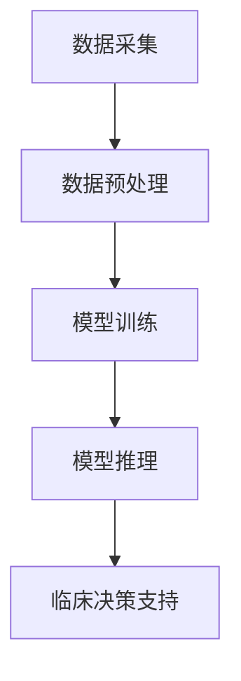

# AI在智能医疗影像辅助诊断中的应用与创新

> 关键词：人工智能、医疗影像、辅助诊断、深度学习、医学图像处理、创新应用、临床决策支持

> 摘要：本文聚焦于AI在智能医疗影像辅助诊断中的应用与创新。首先介绍了相关背景，包括目的范围、预期读者等。接着阐述了AI与医疗影像辅助诊断的核心概念及联系，通过流程图清晰展示其架构。详细讲解了核心算法原理并给出Python源代码示例，同时介绍了相关数学模型和公式。通过项目实战，给出了开发环境搭建、源代码实现与解读。分析了AI在智能医疗影像辅助诊断中的实际应用场景，推荐了学习资源、开发工具框架以及相关论文著作。最后总结了未来发展趋势与挑战，并提供常见问题解答和参考资料，旨在全面深入地探讨AI在该领域的应用与创新。

## 1. 背景介绍 
### 1.1 目的和范围
随着医疗技术的不断进步，医疗影像在疾病诊断中发挥着越来越重要的作用。然而，传统的医疗影像诊断主要依赖医生的经验和专业知识，存在诊断效率低、准确性受主观因素影响等问题。AI技术的发展为解决这些问题提供了新的途径。本文的目的在于深入探讨AI在智能医疗影像辅助诊断中的应用与创新，范围涵盖AI技术在各种医疗影像（如X光、CT、MRI等）诊断中的应用，包括疾病的检测、分类、定量分析等方面，以及相关的创新技术和方法。

### 1.2 预期读者
本文预期读者包括医疗领域的专业人士，如医生、医学影像技师等，他们可以通过本文了解AI技术在医疗影像诊断中的应用，为临床工作提供参考；计算机科学领域的研究人员和开发者，他们可以从本文中获取AI在医疗影像领域的应用场景和技术需求，开展相关的研究和开发工作；以及对医疗科技和AI技术感兴趣的普通读者，帮助他们了解AI在医疗领域的发展动态和潜在价值。

### 1.3 文档结构概述
本文首先介绍背景信息，包括目的范围、预期读者和文档结构概述等。接着阐述核心概念与联系，包括AI和医疗影像辅助诊断的基本概念、原理和架构。然后详细讲解核心算法原理和具体操作步骤，给出Python源代码示例。再介绍相关的数学模型和公式，并举例说明。通过项目实战，展示开发环境搭建、源代码实现与解读。分析实际应用场景，推荐学习资源、开发工具框架和相关论文著作。最后总结未来发展趋势与挑战，提供常见问题解答和参考资料。

### 1.4 术语表
#### 1.4.1 核心术语定义
- **人工智能（AI）**：是一门研究如何使计算机能够模拟人类智能的学科，包括机器学习、深度学习、自然语言处理等技术。
- **医疗影像**：是指通过各种医学成像技术（如X光、CT、MRI等）获取的人体内部结构的图像，用于疾病的诊断和治疗。
- **辅助诊断**：是指利用计算机技术和医学知识，为医生提供诊断建议和参考信息，帮助医生提高诊断的准确性和效率。
- **深度学习**：是机器学习的一个分支，通过构建多层神经网络来学习数据的特征和模式，在图像识别、语音识别等领域取得了显著的成果。
- **卷积神经网络（CNN）**：是一种专门用于处理具有网格结构数据（如图像）的深度学习模型，通过卷积层、池化层等结构自动提取图像的特征。

#### 1.4.2 相关概念解释
- **医学图像处理**：是指对医疗影像进行预处理、特征提取、分割、配准等操作，以提高影像的质量和诊断的准确性。
- **临床决策支持系统（CDSS）**：是一种基于计算机技术的系统，通过分析患者的临床信息和医疗影像数据，为医生提供决策支持和建议。
- **数据标注**：是指对医疗影像数据进行标记和分类，为机器学习模型提供训练数据。

#### 1.4.3 缩略词列表
- **AI**：Artificial Intelligence（人工智能）
- **CNN**：Convolutional Neural Network（卷积神经网络）
- **CT**：Computed Tomography（计算机断层扫描）
- **MRI**：Magnetic Resonance Imaging（磁共振成像）
- **CDSS**：Clinical Decision Support System（临床决策支持系统）

## 2. 核心概念与联系 

### 核心概念原理
人工智能在医疗影像辅助诊断中的应用主要基于机器学习和深度学习技术。机器学习是让计算机通过数据学习模式和规律，从而进行预测和决策。深度学习作为机器学习的一个分支，通过构建深度神经网络，能够自动从大量数据中学习到复杂的特征和模式。

在医疗影像领域，深度学习模型（如卷积神经网络）可以对X光、CT、MRI等影像数据进行分析。卷积神经网络通过卷积层、池化层和全连接层等结构，对影像进行特征提取和分类。卷积层通过卷积核在影像上滑动，提取局部特征；池化层对特征图进行下采样，减少数据量；全连接层将提取的特征映射到不同的类别上，实现疾病的分类和诊断。

### 架构的文本示意图
智能医疗影像辅助诊断系统通常由数据采集、数据预处理、模型训练、模型推理和临床决策支持等模块组成。

数据采集模块负责收集各种医疗影像数据，包括X光、CT、MRI等。数据预处理模块对采集到的影像数据进行清洗、归一化、增强等操作，以提高数据的质量和可用性。模型训练模块使用预处理后的数据对深度学习模型进行训练，调整模型的参数，使其能够准确地识别疾病。模型推理模块使用训练好的模型对新的医疗影像数据进行预测和诊断。临床决策支持模块将模型的诊断结果与患者的临床信息相结合，为医生提供决策支持和建议。

### Mermaid流程图


## 3. 核心算法原理 & 具体操作步骤 

### 核心算法原理
在智能医疗影像辅助诊断中，卷积神经网络（CNN）是最常用的算法之一。CNN的核心思想是通过卷积操作自动提取图像的特征。

卷积操作是通过一个卷积核在图像上滑动，对每个位置的像素进行加权求和，得到一个新的特征图。卷积核的参数是通过训练学习得到的，不同的卷积核可以提取不同的特征。

池化操作是对特征图进行下采样，减少数据量，同时保留重要的特征信息。常见的池化操作有最大池化和平均池化。

全连接层将提取的特征映射到不同的类别上，通过softmax函数输出每个类别的概率。

### 具体操作步骤
1. **数据准备**：收集大量的医疗影像数据，并进行标注，将不同的疾病类别进行分类。
2. **数据预处理**：对影像数据进行清洗、归一化、增强等操作，提高数据的质量和可用性。
3. **模型构建**：构建卷积神经网络模型，包括卷积层、池化层和全连接层等。
4. **模型训练**：使用预处理后的数据对模型进行训练，调整模型的参数，使其能够准确地识别疾病。
5. **模型评估**：使用测试数据对训练好的模型进行评估，计算模型的准确率、召回率、F1值等指标。
6. **模型部署**：将训练好的模型部署到实际应用中，对新的医疗影像数据进行预测和诊断。

### Python源代码示例
```python
import tensorflow as tf
from tensorflow.keras import layers, models

# 构建卷积神经网络模型
def build_cnn_model():
    model = models.Sequential()
    model.add(layers.Conv2D(32, (3, 3), activation='relu', input_shape=(224, 224, 3)))
    model.add(layers.MaxPooling2D((2, 2)))
    model.add(layers.Conv2D(64, (3, 3), activation='relu'))
    model.add(layers.MaxPooling2D((2, 2)))
    model.add(layers.Conv2D(128, (3, 3), activation='relu'))
    model.add(layers.MaxPooling2D((2, 2)))
    model.add(layers.Flatten())
    model.add(layers.Dense(128, activation='relu'))
    model.add(layers.Dense(10, activation='softmax'))  # 假设有10个疾病类别
    return model

# 编译模型
model = build_cnn_model()
model.compile(optimizer='adam',
              loss='categorical_crossentropy',
              metrics=['accuracy'])

# 数据加载和预处理（这里省略具体代码）
# train_images, train_labels, test_images, test_labels = load_and_preprocess_data()

# 模型训练
# model.fit(train_images, train_labels, epochs=10, validation_data=(test_images, test_labels))

# 模型评估
# test_loss, test_acc = model.evaluate(test_images, test_labels)
# print(f"Test accuracy: {test_acc}")
```

## 4. 数学模型和公式 & 详细讲解 & 举例说明 

### 卷积操作的数学模型和公式
卷积操作可以用以下公式表示：

$$(I * K)_{i,j} = \sum_{m=0}^{M-1} \sum_{n=0}^{N-1} I_{i+m,j+n} K_{m,n}$$

其中，$I$ 是输入图像，$K$ 是卷积核，$M$ 和 $N$ 是卷积核的尺寸，$(I * K)_{i,j}$ 是卷积结果在位置 $(i,j)$ 处的值。

### 详细讲解
卷积操作的本质是对输入图像的局部区域进行加权求和。卷积核的每个元素对应一个权重，通过与输入图像的局部区域相乘并求和，得到一个新的特征值。不同的卷积核可以提取不同的特征，例如边缘、纹理等。

### 举例说明
假设输入图像 $I$ 是一个 $3\times3$ 的矩阵：

$$
I = 
\begin{bmatrix}
1 & 2 & 3 \\
4 & 5 & 6 \\
7 & 8 & 9
\end{bmatrix}
$$

卷积核 $K$ 是一个 $2\times2$ 的矩阵：

$$
K = 
\begin{bmatrix}
1 & 0 \\
0 & 1
\end{bmatrix}
$$

则卷积结果 $(I * K)$ 为：

$$
(I * K) = 
\begin{bmatrix}
1\times1 + 2\times0 + 4\times0 + 5\times1 & 2\times1 + 3\times0 + 5\times0 + 6\times1 \\
4\times1 + 5\times0 + 7\times0 + 8\times1 & 5\times1 + 6\times0 + 8\times0 + 9\times1
\end{bmatrix}
= 
\begin{bmatrix}
6 & 8 \\
12 & 14
\end{bmatrix}
$$

### 池化操作的数学模型和公式
最大池化操作可以用以下公式表示：

$$(P_{max})_{i,j} = \max_{m=0}^{M-1} \max_{n=0}^{N-1} I_{iM+m,jN+n}$$

其中，$I$ 是输入特征图，$M$ 和 $N$ 是池化窗口的尺寸，$(P_{max})_{i,j}$ 是最大池化结果在位置 $(i,j)$ 处的值。

平均池化操作可以用以下公式表示：

$$(P_{avg})_{i,j} = \frac{1}{MN} \sum_{m=0}^{M-1} \sum_{n=0}^{N-1} I_{iM+m,jN+n}$$

### 详细讲解
最大池化操作是在池化窗口内选择最大的值作为输出，平均池化操作是在池化窗口内计算所有值的平均值作为输出。池化操作的目的是减少数据量，同时保留重要的特征信息。

### 举例说明
假设输入特征图 $I$ 是一个 $4\times4$ 的矩阵：

$$
I = 
\begin{bmatrix}
1 & 2 & 3 & 4 \\
5 & 6 & 7 & 8 \\
9 & 10 & 11 & 12 \\
13 & 14 & 15 & 16
\end{bmatrix}
$$

池化窗口的尺寸为 $2\times2$，则最大池化结果 $(P_{max})$ 为：

$$
(P_{max}) = 
\begin{bmatrix}
6 & 8 \\
14 & 16
\end{bmatrix}
$$

平均池化结果 $(P_{avg})$ 为：

$$
(P_{avg}) = 
\begin{bmatrix}
3.5 & 5.5 \\
11.5 & 13.5
\end{bmatrix}
$$

### 全连接层的数学模型和公式
全连接层的输出可以用以下公式表示：

$$y = \sigma(Wx + b)$$

其中，$x$ 是输入向量，$W$ 是权重矩阵，$b$ 是偏置向量，$\sigma$ 是激活函数（如softmax函数），$y$ 是输出向量。

### 详细讲解
全连接层将输入的特征向量映射到不同的类别上，通过权重矩阵和偏置向量进行线性变换，再通过激活函数进行非线性变换，输出每个类别的概率。

### 举例说明
假设输入向量 $x$ 是一个 $3$ 维向量：

$$
x = 
\begin{bmatrix}
1 \\
2 \\
3
\end{bmatrix}
$$

权重矩阵 $W$ 是一个 $2\times3$ 的矩阵：

$$
W = 
\begin{bmatrix}
1 & 2 & 3 \\
4 & 5 & 6
\end{bmatrix}
$$

偏置向量 $b$ 是一个 $2$ 维向量：

$$
b = 
\begin{bmatrix}
1 \\
2
\end{bmatrix}
$$

则线性变换结果为：

$$
Wx + b = 
\begin{bmatrix}
1\times1 + 2\times2 + 3\times3 + 1 \\
4\times1 + 5\times2 + 6\times3 + 2
\end{bmatrix}
= 
\begin{bmatrix}
15 \\
34
\end{bmatrix}
$$

假设激活函数为softmax函数，则输出向量 $y$ 为：

$$
y = \text{softmax}(Wx + b) = 
\begin{bmatrix}
\frac{e^{15}}{e^{15} + e^{34}} \\
\frac{e^{34}}{e^{15} + e^{34}}
\end{bmatrix}
$$

## 5. 项目实战：代码实际案例和详细解释说明 

### 5.1  开发环境搭建
1. **安装Python**：建议安装Python 3.7及以上版本，可以从Python官方网站（https://www.python.org/downloads/）下载安装包进行安装。
2. **安装深度学习框架**：选择TensorFlow或PyTorch等深度学习框架，这里以TensorFlow为例，可以使用以下命令进行安装：
```sh
pip install tensorflow
```
3. **安装其他依赖库**：安装NumPy、Pandas、Matplotlib等常用的Python库，用于数据处理和可视化。
```sh
pip install numpy pandas matplotlib
```
4. **安装开发工具**：选择合适的开发工具，如PyCharm、Jupyter Notebook等。

### 5.2  源代码详细实现和代码解读
以下是一个基于TensorFlow的简单医疗影像分类项目的源代码示例：

```python
import tensorflow as tf
from tensorflow.keras import layers, models
import numpy as np
import matplotlib.pyplot as plt
from sklearn.model_selection import train_test_split

# 模拟医疗影像数据和标签
# 这里假设影像数据是224x224的RGB图像，共有1000个样本，分为10个类别
num_samples = 1000
image_size = 224
num_classes = 10

# 生成随机影像数据
images = np.random.rand(num_samples, image_size, image_size, 3)
# 生成随机标签
labels = np.random.randint(0, num_classes, num_samples)

# 数据预处理
# 将标签转换为one-hot编码
labels = tf.keras.utils.to_categorical(labels, num_classes)

# 划分训练集和测试集
train_images, test_images, train_labels, test_labels = train_test_split(images, labels, test_size=0.2, random_state=42)

# 构建卷积神经网络模型
def build_cnn_model():
    model = models.Sequential()
    model.add(layers.Conv2D(32, (3, 3), activation='relu', input_shape=(image_size, image_size, 3)))
    model.add(layers.MaxPooling2D((2, 2)))
    model.add(layers.Conv2D(64, (3, 3), activation='relu'))
    model.add(layers.MaxPooling2D((2, 2)))
    model.add(layers.Conv2D(128, (3, 3), activation='relu'))
    model.add(layers.MaxPooling2D((2, 2)))
    model.add(layers.Flatten())
    model.add(layers.Dense(128, activation='relu'))
    model.add(layers.Dense(num_classes, activation='softmax'))
    return model

# 编译模型
model = build_cnn_model()
model.compile(optimizer='adam',
              loss='categorical_crossentropy',
              metrics=['accuracy'])

# 模型训练
history = model.fit(train_images, train_labels, epochs=10, validation_data=(test_images, test_labels))

# 模型评估
test_loss, test_acc = model.evaluate(test_images, test_labels)
print(f"Test accuracy: {test_acc}")

# 可视化训练过程
plt.plot(history.history['accuracy'], label='Training accuracy')
plt.plot(history.history['val_accuracy'], label='Validation accuracy')
plt.xlabel('Epoch')
plt.ylabel('Accuracy')
plt.legend()
plt.show()
```

### 代码解读与分析
1. **数据生成和预处理**：使用`np.random.rand`生成随机的影像数据，使用`np.random.randint`生成随机的标签。将标签转换为one-hot编码，方便模型训练。使用`train_test_split`函数将数据划分为训练集和测试集。
2. **模型构建**：使用`Sequential`模型构建卷积神经网络，包括卷积层、池化层和全连接层。卷积层使用`Conv2D`函数，池化层使用`MaxPooling2D`函数，全连接层使用`Dense`函数。
3. **模型编译**：使用`compile`函数编译模型，指定优化器、损失函数和评估指标。
4. **模型训练**：使用`fit`函数对模型进行训练，指定训练数据、训练轮数和验证数据。
5. **模型评估**：使用`evaluate`函数对模型进行评估，计算测试集的损失和准确率。
6. **可视化训练过程**：使用`matplotlib`库绘制训练集和验证集的准确率曲线，观察模型的训练过程。

## 6. 实际应用场景 
### 疾病检测与分类
AI技术可以帮助医生快速准确地检测和分类各种疾病。例如，在肺癌检测中，通过对CT影像进行分析，AI模型可以自动识别肺部的结节，并判断其良恶性。在乳腺癌检测中，对乳腺X光影像进行分析，AI模型可以检测出乳腺组织中的肿块，并进行分类。

### 定量分析
AI技术可以对医疗影像进行定量分析，提供更准确的诊断信息。例如，在肝脏疾病诊断中，通过对CT或MRI影像进行分析，AI模型可以计算肝脏的体积、密度等参数，帮助医生评估肝脏的健康状况。在心脏疾病诊断中，对心脏超声影像进行分析，AI模型可以测量心脏的大小、功能等指标，辅助医生进行诊断和治疗。

### 影像引导治疗
AI技术可以在影像引导治疗中发挥重要作用。例如，在肿瘤放疗中，通过对CT影像进行分析，AI模型可以帮助医生确定肿瘤的位置、大小和形状，制定更精确的放疗计划。在手术导航中，对MRI或CT影像进行分析，AI模型可以提供实时的解剖结构信息，帮助医生更准确地进行手术操作。

### 临床决策支持
AI技术可以为医生提供临床决策支持。通过对患者的医疗影像数据和临床信息进行分析，AI模型可以预测疾病的发展趋势、治疗效果等，为医生提供决策建议。例如，在心血管疾病治疗中，AI模型可以根据患者的心电图、心脏超声等影像数据和临床信息，预测患者发生心血管事件的风险，帮助医生制定个性化的治疗方案。

## 7. 工具和资源推荐
### 7.1 学习资源推荐
#### 7.1.1 书籍推荐
- 《深度学习》（Deep Learning）：由Ian Goodfellow、Yoshua Bengio和Aaron Courville所著，是深度学习领域的经典教材，全面介绍了深度学习的基本概念、算法和应用。
- 《Python深度学习》（Deep Learning with Python）：由Francois Chollet所著，以Python和Keras为工具，介绍了深度学习的实践方法和应用案例。
- 《医学图像处理》（Medical Image Processing）：由Richard M. Leahy、Joseph M. Reinhardt和Rafael C. Gonzalez所著，全面介绍了医学图像处理的基本概念、算法和应用。

#### 7.1.2 在线课程
- Coursera上的“深度学习专项课程”（Deep Learning Specialization）：由Andrew Ng教授授课，包括神经网络和深度学习、改善深层神经网络、结构化机器学习项目、卷积神经网络、序列模型等课程，全面介绍了深度学习的理论和实践。
- edX上的“医学影像分析”（Medical Image Analysis）：由哈佛大学和麻省理工学院联合授课，介绍了医学影像分析的基本概念、算法和应用。
- 中国大学MOOC上的“人工智能基础”（Fundamentals of Artificial Intelligence）：由北京大学的王飞跃教授授课，介绍了人工智能的基本概念、算法和应用。

#### 7.1.3 技术博客和网站
- Medium上的“Towards Data Science”：是一个专注于数据科学和机器学习的技术博客，提供了大量的深度学习和医疗影像分析的文章和教程。
- Kaggle：是一个数据科学竞赛平台，提供了大量的医疗影像数据集和相关的竞赛项目，可以通过参与竞赛来学习和实践医疗影像分析技术。
- ArXiv：是一个开放获取的预印本服务器，提供了大量的关于人工智能和医疗影像分析的研究论文，可以及时了解最新的研究成果。

### 7.2 开发工具框架推荐
#### 7.2.1 IDE和编辑器
- PyCharm：是一款专门为Python开发设计的集成开发环境（IDE），提供了代码编辑、调试、版本控制等功能，适合开发大型的Python项目。
- Jupyter Notebook：是一个交互式的开发环境，支持Python、R等多种编程语言，适合进行数据探索、模型训练和可视化等工作。
- Visual Studio Code：是一款轻量级的代码编辑器，支持多种编程语言和插件，适合快速开发和调试代码。

#### 7.2.2 调试和性能分析工具
- TensorBoard：是TensorFlow提供的可视化工具，可以帮助用户可视化模型的训练过程、网络结构、性能指标等，方便用户进行调试和优化。
- PyTorch Profiler：是PyTorch提供的性能分析工具，可以帮助用户分析模型的性能瓶颈，优化模型的训练和推理速度。
- NVIDIA Nsight Systems：是NVIDIA提供的性能分析工具，可以帮助用户分析GPU的使用情况，优化模型的GPU加速性能。

#### 7.2.3 相关框架和库
- TensorFlow：是一个开源的深度学习框架，由Google开发和维护，提供了丰富的深度学习模型和工具，支持多种编程语言和平台。
- PyTorch：是一个开源的深度学习框架，由Facebook开发和维护，提供了动态计算图和丰富的深度学习模型和工具，适合进行研究和开发。
- Scikit-learn：是一个开源的机器学习库，提供了丰富的机器学习算法和工具，适合进行数据预处理、模型选择和评估等工作。
- OpenCV：是一个开源的计算机视觉库，提供了丰富的图像处理和计算机视觉算法，适合进行医疗影像的预处理和特征提取等工作。

### 7.3 相关论文著作推荐
#### 7.3.1 经典论文
- “ImageNet Classification with Deep Convolutional Neural Networks”：由Alex Krizhevsky、Ilya Sutskever和Geoffrey E. Hinton所著，介绍了AlexNet卷积神经网络，开启了深度学习在图像识别领域的热潮。
- “Very Deep Convolutional Networks for Large-Scale Image Recognition”：由Karen Simonyan和Andrew Zisserman所著，介绍了VGGNet卷积神经网络，提出了深度卷积神经网络的架构设计原则。
- “Deep Residual Learning for Image Recognition”：由Kaiming He、Xiangyu Zhang、Shaoqing Ren和Jian Sun所著，介绍了ResNet残差神经网络，解决了深度神经网络训练中的梯度消失和梯度爆炸问题。

#### 7.3.2 最新研究成果
- “Deep Learning for Medical Image Analysis: A Review”：由Alireza Mehrtash、Michael A. McLean和Dana Cobzas所著，对深度学习在医疗影像分析中的应用进行了全面的综述。
- “Artificial Intelligence in Medical Imaging: A Comprehensive Review”：由Ali Rahmim、Ramin Rabbani和Andrew J. Reader所著，对人工智能在医疗影像中的应用进行了全面的综述。
- “Deep Learning in Medical Imaging: Challenges and Opportunities”：由Jianming Liang、Huiying Li和Le Lu所著，讨论了深度学习在医疗影像中的挑战和机遇。

#### 7.3.3 应用案例分析
- “Deep Learning for Lung Cancer Detection in CT Images: A Systematic Review”：对深度学习在CT影像中肺癌检测的应用进行了系统的综述和分析。
- “Artificial Intelligence in Breast Cancer Screening: A Review of the Literature”：对人工智能在乳腺癌筛查中的应用进行了综述和分析。
- “Deep Learning for Cardiac Image Analysis: A Review”：对深度学习在心脏影像分析中的应用进行了综述和分析。

## 8. 总结：未来发展趋势与挑战
### 未来发展趋势
1. **多模态数据融合**：未来的智能医疗影像辅助诊断系统将不仅仅依赖于单一的医疗影像数据，而是会融合多种模态的数据，如医疗影像、临床信息、基因数据等，提供更全面、准确的诊断信息。
2. **个性化医疗**：AI技术将结合患者的个体特征和病史，实现个性化的医疗影像辅助诊断和治疗方案推荐，提高治疗效果和患者的生活质量。
3. **智能医疗机器人**：AI技术将与机器人技术相结合，开发智能医疗机器人，实现自动化的医疗影像采集、分析和诊断，提高医疗效率和准确性。
4. **远程医疗**：AI技术将支持远程医疗的发展，通过互联网实现医疗影像数据的远程传输和分析，让患者在偏远地区也能享受到优质的医疗服务。

### 挑战
1. **数据质量和隐私问题**：医疗影像数据的质量和隐私是AI在智能医疗影像辅助诊断中面临的重要挑战。需要建立严格的数据质量控制和隐私保护机制，确保数据的安全性和可靠性。
2. **模型可解释性**：深度学习模型通常是黑盒模型，其决策过程难以解释。在医疗领域，模型的可解释性至关重要，需要开发可解释的AI模型，让医生能够理解模型的决策依据。
3. **法律法规和伦理问题**：AI在智能医疗影像辅助诊断中的应用涉及到法律法规和伦理问题，如医疗责任、数据所有权、算法偏见等。需要建立相应的法律法规和伦理准则，规范AI技术的应用。
4. **技术标准和互操作性**：目前，智能医疗影像辅助诊断领域缺乏统一的技术标准和互操作性，不同的系统和模型之间难以进行数据共享和协同工作。需要建立统一的技术标准和规范，促进AI技术在医疗领域的广泛应用。

## 9. 附录：常见问题与解答
### 1. AI在智能医疗影像辅助诊断中的准确性如何？
AI在智能医疗影像辅助诊断中的准确性取决于多种因素，如数据质量、模型架构、训练方法等。在一些特定的疾病诊断任务中，AI模型的准确性已经达到或超过了人类专家的水平。然而，AI模型仍然存在一定的局限性，不能完全替代医生的诊断。在实际应用中，AI模型通常作为医生的辅助工具，帮助医生提高诊断的准确性和效率。

### 2. AI在智能医疗影像辅助诊断中的应用是否会导致医生失业？
不会。AI在智能医疗影像辅助诊断中的应用是为了帮助医生更好地完成工作，而不是替代医生。AI模型可以快速处理大量的医疗影像数据，提供诊断建议和参考信息，帮助医生提高诊断的准确性和效率。医生仍然需要对AI模型的诊断结果进行评估和判断，结合患者的临床信息和自身的经验，做出最终的诊断和治疗决策。因此，AI技术的应用将使医生能够更加专注于复杂的诊断和治疗任务，提高医疗服务的质量和水平。

### 3. 如何确保AI在智能医疗影像辅助诊断中的数据安全和隐私？
为了确保AI在智能医疗影像辅助诊断中的数据安全和隐私，需要采取以下措施：
- **数据加密**：对医疗影像数据进行加密处理，确保数据在传输和存储过程中的安全性。
- **访问控制**：建立严格的访问控制机制，只有授权人员才能访问和处理医疗影像数据。
- **匿名化处理**：对医疗影像数据进行匿名化处理，去除患者的个人身份信息，保护患者的隐私。
- **合规性管理**：遵守相关的法律法规和行业标准，如《网络安全法》、《医疗数据保护条例》等，确保数据的安全和隐私。

### 4. AI在智能医疗影像辅助诊断中的可解释性如何解决？
为了解决AI在智能医疗影像辅助诊断中的可解释性问题，可以采取以下方法：
- **模型选择**：选择可解释性较强的模型，如决策树、线性回归等，而不是复杂的深度学习模型。
- **特征可视化**：通过可视化技术，展示模型提取的特征和决策过程，帮助医生理解模型的决策依据。
- **局部解释方法**：使用局部解释方法，如LIME、SHAP等，对模型的预测结果进行局部解释，提供更详细的解释信息。
- **专家知识融合**：将专家知识融入到AI模型中，使模型的决策过程更加符合医学逻辑和常识。

## 10. 扩展阅读 & 参考资料
### 扩展阅读
- 《人工智能时代的医疗革命》
- 《医疗大数据与人工智能》
- 《智能医疗：从理论到实践》

### 参考资料
1. Goodfellow, I., Bengio, Y., & Courville, A. (2016). Deep Learning. MIT Press.
2. Chollet, F. (2018). Deep Learning with Python. Manning Publications.
3. Leahy, R. M., Reinhardt, J. M., & Gonzalez, R. C. (2000). Medical Image Processing. IEEE Press.
4. Krizhevsky, A., Sutskever, I., & Hinton, G. E. (2012). ImageNet Classification with Deep Convolutional Neural Networks. Advances in Neural Information Processing Systems.
5. Simonyan, K., & Zisserman, A. (2014). Very Deep Convolutional Networks for Large-Scale Image Recognition. arXiv preprint arXiv:1409.1556.
6. He, K., Zhang, X., Ren, S., & Sun, J. (2016). Deep Residual Learning for Image Recognition. Proceedings of the IEEE conference on computer vision and pattern recognition.
7. Mehrtash, A., McLean, M. A., & Cobzas, D. (2017). Deep Learning for Medical Image Analysis: A Review. Medical Image Analysis, 36, 60-88.
8. Rahmim, A., Rabbani, R., & Reader, A. J. (2019). Artificial Intelligence in Medical Imaging: A Comprehensive Review. Canadian Association of Radiologists Journal, 70(1), 3-18.
9. Liang, J., Li, H., & Lu, L. (2020). Deep Learning in Medical Imaging: Challenges and Opportunities. Medical Physics, 47(11), e745-e762.