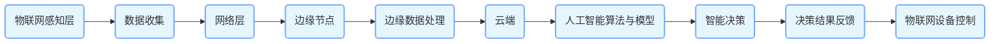

# AI在物联网软件开发中的应用

> 关键词：人工智能、物联网、软件开发、数据分析、智能决策、边缘计算、传感器网络

> 摘要：本文聚焦于AI在物联网软件开发中的应用，深入探讨了相关核心概念、算法原理、数学模型等内容。通过详细的代码案例展示了如何将AI与物联网软件相结合，分析了其在实际场景中的应用情况。同时，推荐了学习资源、开发工具框架以及相关论文著作，最后总结了未来发展趋势与挑战，并对常见问题进行了解答。旨在为读者全面呈现AI在物联网软件开发领域的应用全貌，助力读者深入理解和实践这一前沿技术融合领域。

## 1. 背景介绍 
### 1.1 目的和范围
随着信息技术的飞速发展，物联网（Internet of Things, IoT）和人工智能（Artificial Intelligence, AI）成为了推动数字化转型的关键技术。物联网通过传感器、设备和网络连接，实现了物理世界和数字世界的互联互通，产生了海量的数据。而人工智能则能够对这些数据进行分析、处理和挖掘，提取有价值的信息，实现智能决策和自动化控制。本文的目的在于深入探讨AI在物联网软件开发中的应用，涵盖从核心概念到实际应用的各个方面，包括算法原理、数学模型、代码实现以及实际场景分析等，为读者提供全面且深入的技术指导。

### 1.2 预期读者
本文预期读者包括物联网和人工智能领域的开发者、软件架构师、技术爱好者、研究人员以及对相关技术应用感兴趣的企业管理人员等。无论您是初学者想要了解AI与物联网结合的基本原理，还是有一定经验的专业人士希望深入研究其在软件开发中的应用细节，本文都将为您提供有价值的参考。

### 1.3 文档结构概述
本文将按照以下结构展开：首先介绍背景信息，包括目的、预期读者和文档结构概述等；接着阐述核心概念与联系，通过文本示意图和Mermaid流程图展示AI与物联网的关系；然后讲解核心算法原理和具体操作步骤，使用Python源代码进行详细阐述；再介绍数学模型和公式，并举例说明；之后通过项目实战展示代码实际案例和详细解释；分析实际应用场景；推荐相关的工具和资源；最后总结未来发展趋势与挑战，解答常见问题并提供扩展阅读和参考资料。

### 1.4 术语表
#### 1.4.1 核心术语定义
- **物联网（IoT）**：通过各种信息传感器、射频识别技术、全球定位系统、红外感应器、激光扫描器等各种装置与技术，实时采集任何需要监控、连接、互动的物体或过程，采集其声、光、热、电、力学、化学、生物、位置等各种需要的信息，通过各类可能的网络接入，实现物与物、物与人的泛在连接，实现对物品和过程的智能化感知、识别和管理。
- **人工智能（AI）**：研究、开发用于模拟、延伸和扩展人的智能的理论、方法、技术及应用系统的一门新的技术科学。它企图了解智能的实质，并生产出一种新的能以人类智能相似的方式做出反应的智能机器，该领域的研究包括机器人、语言识别、图像识别、自然语言处理和专家系统等。
- **机器学习（Machine Learning）**：一门多领域交叉学科，涉及概率论、统计学、逼近论、凸分析、算法复杂度理论等多门学科。它专门研究计算机怎样模拟或实现人类的学习行为，以获取新的知识或技能，重新组织已有的知识结构使之不断改善自身的性能。
- **深度学习（Deep Learning）**：机器学习的一个分支领域，它是一种基于对数据进行表征学习的方法。深度学习通过构建具有很多层的神经网络模型，自动从大量数据中学习特征和模式，从而实现对数据的分类、预测等任务。
- **边缘计算（Edge Computing）**：在靠近物或数据源头的一侧，采用网络、计算、存储、应用核心能力为一体的开放平台，就近提供最近端服务。其应用程序在边缘侧发起，产生更快的网络服务响应，满足行业在实时业务、应用智能、安全与隐私保护等方面的基本需求。

#### 1.4.2 相关概念解释
- **传感器网络**：由大量的静止或移动的传感器以自组织和多跳的方式构成的无线网络，其目的是协作地感知、采集、处理和传输网络覆盖地理区域内被感知对象的信息，并最终把这些信息发送给网络所有者。
- **数据挖掘**：从大量的数据中通过算法搜索隐藏于其中信息的过程。数据挖掘通常与计算机科学有关，并通过统计、在线分析处理、情报检索、机器学习、专家系统（依靠过去的经验法则）和模式识别等诸多方法来实现上述目标。
- **智能决策**：利用人工智能技术，对大量的数据进行分析和处理，为决策者提供科学、合理的决策建议和方案。智能决策系统能够自动识别问题、分析数据、生成决策方案，并对方案进行评估和优化。

#### 1.4.3 缩略词列表
- **IoT**：Internet of Things（物联网）
- **AI**：Artificial Intelligence（人工智能）
- **ML**：Machine Learning（机器学习）
- **DL**：Deep Learning（深度学习）
- **EC**：Edge Computing（边缘计算）

## 2. 核心概念与联系 

### 核心概念原理
物联网的核心原理在于通过各种传感器收集物理世界的数据，这些数据通过网络传输到后端服务器或云端进行存储和处理。传感器可以是温度传感器、湿度传感器、加速度传感器、摄像头等，它们能够实时感知环境的各种参数和状态。物联网的架构通常包括感知层、网络层和应用层。感知层负责数据的采集，网络层负责数据的传输，应用层负责数据的处理和应用。

人工智能则是通过各种算法和模型对数据进行分析和处理，以实现智能决策和自动化控制。机器学习是人工智能的重要分支，它通过对大量数据的学习，自动发现数据中的模式和规律，并用于预测和分类等任务。深度学习是机器学习的一种高级形式，它通过构建深度神经网络，自动从数据中学习特征和模式，具有强大的表示能力和泛化能力。

### 架构的文本示意图
物联网与人工智能相结合的架构可以描述为：在物联网的感知层，各种传感器收集数据；数据通过网络层传输到边缘节点或云端；在边缘节点，进行初步的数据处理和分析，提取有用的信息；然后将处理后的数据传输到云端，云端利用人工智能算法和模型对数据进行进一步的分析和挖掘，实现智能决策和自动化控制；最后，决策结果通过网络层反馈到物联网设备，实现对物理世界的控制和调节。

### Mermaid 流程图


## 3. 核心算法原理 & 具体操作步骤 

### 核心算法原理
在物联网软件开发中，常用的人工智能算法包括机器学习算法和深度学习算法。以机器学习中的决策树算法为例，决策树是一种基于树结构进行决策的算法，它通过对数据的特征进行划分，构建一棵决策树，每个内部节点表示一个特征上的测试，每个分支表示一个测试输出，每个叶节点表示一个类别或值。决策树的构建过程是一个递归的过程，通过选择最优的特征进行划分，直到满足停止条件。

### Python源代码详细阐述
以下是一个使用Python实现决策树算法进行鸢尾花分类的示例代码：
```python
from sklearn.datasets import load_iris
from sklearn.model_selection import train_test_split
from sklearn.tree import DecisionTreeClassifier
from sklearn.metrics import accuracy_score

# 加载鸢尾花数据集
iris = load_iris()
X = iris.data  # 特征数据
y = iris.target  # 标签数据

# 划分训练集和测试集
X_train, X_test, y_train, y_test = train_test_split(X, y, test_size=0.3, random_state=42)

# 创建决策树分类器
clf = DecisionTreeClassifier()

# 训练模型
clf.fit(X_train, y_train)

# 预测
y_pred = clf.predict(X_test)

# 计算准确率
accuracy = accuracy_score(y_test, y_pred)
print(f"决策树模型的准确率: {accuracy}")
```
### 具体操作步骤
1. **数据加载**：使用`load_iris`函数加载鸢尾花数据集，将特征数据存储在`X`中，标签数据存储在`y`中。
2. **数据划分**：使用`train_test_split`函数将数据集划分为训练集和测试集，测试集占比为30%。
3. **模型创建**：创建一个决策树分类器`DecisionTreeClassifier`。
4. **模型训练**：使用训练集数据对模型进行训练，调用`fit`方法。
5. **模型预测**：使用训练好的模型对测试集数据进行预测，调用`predict`方法。
6. **结果评估**：使用`accuracy_score`函数计算模型的准确率。

## 4. 数学模型和公式 & 详细讲解 & 举例说明 

### 决策树的数学模型和公式
决策树的核心是选择最优的特征进行划分，常用的划分标准包括信息增益、信息增益率和基尼指数等。

#### 信息增益
信息增益是基于信息熵的概念，信息熵是对数据不确定性的度量。设数据集 $D$ 中共有 $n$ 个类别，第 $i$ 个类别的样本数为 $|C_i|$，则数据集 $D$ 的信息熵 $Ent(D)$ 定义为：
$$Ent(D)=-\sum_{i=1}^{n}p_i\log_2p_i$$
其中 $p_i=\frac{|C_i|}{|D|}$ 是第 $i$ 个类别的样本在数据集中所占的比例。

对于特征 $A$，其取值有 $v$ 个，将数据集 $D$ 划分为 $v$ 个子集 $D^1,D^2,\cdots,D^v$，则特征 $A$ 对数据集 $D$ 的信息增益 $Gain(D,A)$ 定义为：
$$Gain(D,A)=Ent(D)-\sum_{v=1}^{V}\frac{|D^v|}{|D|}Ent(D^v)$$

#### 详细讲解
信息熵 $Ent(D)$ 表示数据集 $D$ 的不确定性，信息熵越大，数据集的不确定性越高。信息增益 $Gain(D,A)$ 表示使用特征 $A$ 对数据集 $D$ 进行划分后，数据集不确定性的减少量。信息增益越大，说明使用特征 $A$ 进行划分越有效。

#### 举例说明
假设有一个数据集 $D$ 包含10个样本，分为两个类别，其中类别1有6个样本，类别2有4个样本。则数据集 $D$ 的信息熵为：
$$p_1=\frac{6}{10}=0.6, p_2=\frac{4}{10}=0.4$$
$$Ent(D)=-0.6\log_20.6 - 0.4\log_20.4\approx0.971$$

假设存在一个特征 $A$，其取值有两个，将数据集 $D$ 划分为两个子集 $D^1$ 和 $D^2$，其中 $D^1$ 包含4个样本，类别1有3个，类别2有1个；$D^2$ 包含6个样本，类别1有3个，类别2有3个。则：
$$Ent(D^1)=-\frac{3}{4}\log_2\frac{3}{4}-\frac{1}{4}\log_2\frac{1}{4}\approx0.811$$
$$Ent(D^2)=-\frac{3}{6}\log_2\frac{3}{6}-\frac{3}{6}\log_2\frac{3}{6}=1$$
$$Gain(D,A)=0.971 - (\frac{4}{10}\times0.811+\frac{6}{10}\times1)\approx0.135$$

## 5. 项目实战：代码实际案例和详细解释说明 

### 5.1  开发环境搭建
本项目使用Python语言进行开发，需要安装以下库：
- **NumPy**：用于数值计算。
- **Pandas**：用于数据处理和分析。
- **Scikit-learn**：用于机器学习算法的实现。
- **Matplotlib**：用于数据可视化。

可以使用以下命令进行安装：
```sh
pip install numpy pandas scikit-learn matplotlib
```

### 5.2  源代码详细实现和代码解读
以下是一个基于物联网的温度预测项目的代码示例：
```python
import numpy as np
import pandas as pd
from sklearn.model_selection import train_test_split
from sklearn.linear_model import LinearRegression
import matplotlib.pyplot as plt

# 加载数据
data = pd.read_csv('temperature_data.csv')

# 提取特征和标签
X = data[['humidity', 'pressure']].values
y = data['temperature'].values

# 划分训练集和测试集
X_train, X_test, y_train, y_test = train_test_split(X, y, test_size=0.2, random_state=42)

# 创建线性回归模型
model = LinearRegression()

# 训练模型
model.fit(X_train, y_train)

# 预测
y_pred = model.predict(X_test)

# 绘制预测结果和真实结果的对比图
plt.scatter(y_test, y_pred)
plt.xlabel('真实温度')
plt.ylabel('预测温度')
plt.title('温度预测结果对比')
plt.show()

# 计算均方误差
mse = np.mean((y_test - y_pred) ** 2)
print(f"均方误差: {mse}")
```
### 代码解读与分析
1. **数据加载**：使用`pandas`的`read_csv`函数加载温度数据集。
2. **特征提取**：从数据集中提取湿度和气压作为特征，温度作为标签。
3. **数据划分**：使用`train_test_split`函数将数据集划分为训练集和测试集，测试集占比为20%。
4. **模型创建**：创建一个线性回归模型`LinearRegression`。
5. **模型训练**：使用训练集数据对模型进行训练，调用`fit`方法。
6. **模型预测**：使用训练好的模型对测试集数据进行预测，调用`predict`方法。
7. **结果可视化**：使用`matplotlib`绘制预测结果和真实结果的对比图。
8. **结果评估**：计算均方误差，评估模型的性能。

## 6. 实际应用场景 
### 智能家居
在智能家居领域，AI与物联网的结合可以实现家居设备的智能化控制和管理。例如，通过安装在房间内的温度传感器、湿度传感器、光照传感器等物联网设备，实时收集环境数据。然后利用AI算法对这些数据进行分析，根据用户的习惯和环境条件自动调节空调、加湿器、灯光等设备的运行状态，实现能源的高效利用和用户的舒适体验。

### 工业物联网
在工业物联网中，AI可以用于设备故障预测和维护、生产过程优化等方面。通过在工业设备上安装各种传感器，实时监测设备的运行状态和性能参数。利用AI算法对这些数据进行分析，提前预测设备可能出现的故障，并及时进行维护，减少设备停机时间和维修成本。同时，通过对生产过程数据的分析，优化生产流程，提高生产效率和产品质量。

### 智能交通
在智能交通领域，AI与物联网的结合可以实现交通流量的实时监测和智能调度。通过在道路上安装摄像头、传感器等物联网设备，实时收集交通流量、车速、车辆位置等信息。利用AI算法对这些数据进行分析，预测交通拥堵情况，并及时调整信号灯的时间和交通路线，提高交通效率和安全性。

### 医疗保健
在医疗保健领域，AI与物联网的结合可以实现远程医疗监测和疾病诊断。通过穿戴式设备、医疗传感器等物联网设备，实时收集患者的生理数据，如心率、血压、血糖等。利用AI算法对这些数据进行分析，及时发现患者的健康问题，并提供相应的医疗建议和治疗方案。同时，AI还可以辅助医生进行疾病诊断，提高诊断的准确性和效率。

## 7. 工具和资源推荐
### 7.1 学习资源推荐
#### 7.1.1 书籍推荐
- 《Python机器学习》：本书详细介绍了Python在机器学习领域的应用，包括各种机器学习算法的原理和实现，以及如何使用Python进行数据处理、模型训练和评估等。
- 《深度学习》：由深度学习领域的三位先驱Ian Goodfellow、Yoshua Bengio和Aaron Courville撰写，全面介绍了深度学习的理论和实践，是深度学习领域的经典著作。
- 《物联网：技术、应用与标准》：本书系统地介绍了物联网的技术体系、应用场景和相关标准，对于了解物联网的整体架构和发展趋势有很大的帮助。

#### 7.1.2 在线课程
- Coursera上的“机器学习”课程：由斯坦福大学的Andrew Ng教授授课，是机器学习领域的经典在线课程，课程内容涵盖了机器学习的基本概念、算法和应用。
- edX上的“深度学习”课程：由微软和伯克利大学联合推出，系统地介绍了深度学习的理论和实践，包括神经网络、卷积神经网络、循环神经网络等。
- 中国大学MOOC上的“物联网技术与应用”课程：由国内知名高校的教授授课，全面介绍了物联网的技术体系、应用场景和发展趋势。

#### 7.1.3 技术博客和网站
- Medium：一个开放的技术博客平台，上面有很多关于AI和物联网的技术文章和经验分享。
- IEEE Xplore：电气和电子工程师协会（IEEE）的数字图书馆，提供了大量关于AI和物联网的学术论文和研究报告。
- 开源中国：国内知名的开源技术社区，上面有很多关于AI和物联网的开源项目和技术文章。

### 7.2 开发工具框架推荐
#### 7.2.1 IDE和编辑器
- PyCharm：一款专业的Python集成开发环境，提供了丰富的功能和插件，方便Python开发。
- Visual Studio Code：一款轻量级的代码编辑器，支持多种编程语言，具有丰富的插件生态系统，适合快速开发和调试。
- Jupyter Notebook：一种交互式的开发环境，适合数据探索、模型训练和可视化等任务。

#### 7.2.2 调试和性能分析工具
- Py-Spy：一个用于Python程序的性能分析工具，可以实时监测Python程序的CPU使用率、内存占用等信息。
- TensorBoard：TensorFlow的可视化工具，可以用于可视化深度学习模型的训练过程、网络结构等信息。
- Sentry：一个开源的错误跟踪和性能监控平台，可以帮助开发者快速定位和解决代码中的错误。

#### 7.2.3 相关框架和库
- TensorFlow：Google开发的开源深度学习框架，提供了丰富的深度学习模型和工具，支持分布式训练和部署。
- PyTorch：Facebook开发的开源深度学习框架，具有动态图机制，适合快速原型开发和研究。
- Scikit-learn：一个简单易用的机器学习库，提供了各种机器学习算法和工具，适合初学者和快速开发。

### 7.3 相关论文著作推荐
#### 7.3.1 经典论文
- “Gradient-Based Learning Applied to Document Recognition”：由Yann LeCun等人发表的关于卷积神经网络的经典论文，奠定了卷积神经网络在图像识别领域的基础。
- “Long Short-Term Memory”：由Sepp Hochreiter和Jürgen Schmidhuber发表的关于长短期记忆网络（LSTM）的经典论文，提出了LSTM的基本结构和原理。
- “A Mathematical Theory of Communication”：由Claude Shannon发表的关于信息论的经典论文，奠定了信息论的基础。

#### 7.3.2 最新研究成果
- 关注顶级学术会议如NeurIPS（神经信息处理系统大会）、ICML（国际机器学习会议）、CVPR（计算机视觉与模式识别会议）等上的最新研究成果，了解AI和物联网领域的前沿技术和发展趋势。
- 关注知名学术期刊如《IEEE Transactions on Pattern Analysis and Machine Intelligence》、《Journal of Artificial Intelligence Research》等上的最新研究论文。

#### 7.3.3 应用案例分析
- 可以参考一些实际的应用案例分析报告，了解AI和物联网在不同行业的应用实践和成功经验，如工业4.0案例分析、智能家居应用案例分析等。

## 8. 总结：未来发展趋势与挑战
### 未来发展趋势
- **融合创新**：AI与物联网的融合将越来越深入，不断催生新的技术和应用模式。例如，将AI技术与区块链技术相结合，实现物联网数据的安全共享和可信交易；将AI技术与5G技术相结合，实现物联网设备的高速、低延迟通信。
- **边缘智能**：随着边缘计算技术的发展，越来越多的AI算法将在边缘设备上运行，实现边缘智能。边缘智能可以减少数据传输延迟，提高系统的实时性和可靠性，同时保护用户数据的隐私。
- **行业应用拓展**：AI在物联网软件开发中的应用将不断拓展到更多的行业和领域，如农业、环保、能源等。通过AI和物联网技术的应用，实现这些行业的智能化升级和转型。
- **自主学习与进化**：未来的AI系统将具备更强的自主学习和进化能力，能够自动适应环境的变化和用户的需求。例如，智能物联网设备可以通过不断学习用户的使用习惯和环境数据，自动优化自身的运行策略。

### 挑战
- **数据安全与隐私**：物联网产生的大量数据涉及用户的隐私和企业的商业机密，如何保障数据的安全和隐私是一个重要的挑战。需要采用先进的加密技术、访问控制技术和安全审计技术等，确保数据的安全性。
- **算法复杂度与资源限制**：AI算法通常具有较高的复杂度，需要大量的计算资源和存储资源。而物联网设备的计算能力和存储容量有限，如何在资源受限的情况下实现高效的AI算法是一个挑战。需要研究和开发轻量级的AI算法和优化技术。
- **标准与规范缺乏**：目前，AI和物联网领域的标准和规范还不够完善，不同厂商的设备和系统之间缺乏互操作性。需要加强标准和规范的制定，促进AI和物联网技术的互联互通和协同发展。
- **人才短缺**：AI和物联网领域的发展需要大量的专业人才，包括AI算法工程师、物联网开发工程师、数据分析师等。目前，相关领域的人才短缺是制约行业发展的一个重要因素。需要加强人才培养和引进，提高行业的整体技术水平。

## 9. 附录：常见问题与解答
### 问题1：AI在物联网软件开发中的主要作用是什么？
答：AI在物联网软件开发中的主要作用包括数据处理和分析、智能决策、自动化控制等。通过AI算法对物联网设备收集的大量数据进行分析和挖掘，提取有价值的信息，实现智能决策和自动化控制，提高物联网系统的效率和性能。

### 问题2：如何选择适合物联网软件开发的AI算法？
答：选择适合物联网软件开发的AI算法需要考虑多个因素，如数据类型、数据规模、应用场景、计算资源等。对于小规模的数据和简单的任务，可以选择一些简单的机器学习算法，如决策树、线性回归等；对于大规模的数据和复杂的任务，可以选择深度学习算法，如卷积神经网络、循环神经网络等。同时，还需要考虑算法的复杂度和计算资源的限制，选择在资源受限的情况下能够高效运行的算法。

### 问题3：AI在物联网中的应用会带来哪些安全风险？
答：AI在物联网中的应用可能会带来以下安全风险：数据泄露风险，AI算法在处理和分析物联网数据时，如果数据安全措施不到位，可能会导致用户隐私和企业商业机密的泄露；算法被攻击风险，恶意攻击者可能会对AI算法进行攻击，如输入恶意数据导致算法误判等；系统被控制风险，攻击者可能会利用AI系统的漏洞，控制物联网设备，造成安全事故。

### 问题4：如何保障AI在物联网软件开发中的数据安全？
答：保障AI在物联网软件开发中的数据安全可以采取以下措施：采用先进的加密技术对数据进行加密，确保数据在传输和存储过程中的安全性；建立严格的访问控制机制，对数据的访问进行权限管理，防止未经授权的访问；定期对数据进行备份，防止数据丢失；加强安全审计，及时发现和处理安全事件。

## 10. 扩展阅读 & 参考资料
### 扩展阅读
- 《人工智能简史》：全面介绍了人工智能的发展历程、重要事件和关键技术，对于了解人工智能的历史和发展趋势有很大的帮助。
- 《物联网时代：驱动人类未来的新动力》：探讨了物联网对人类社会的影响和未来发展趋势，从宏观角度介绍了物联网的应用前景和挑战。
- 《大数据时代：生活、工作与思维的大变革》：介绍了大数据的概念、特点和应用，以及大数据对社会和经济的影响，对于理解物联网产生的大量数据有重要的参考价值。

### 参考资料
- 相关学术论文和研究报告，如IEEE、ACM等学术组织发表的关于AI和物联网的论文。
- 开源项目的文档和代码，如TensorFlow、PyTorch等开源深度学习框架的官方文档。
- 行业报告和白皮书，如市场研究机构发布的关于AI和物联网市场的研究报告。