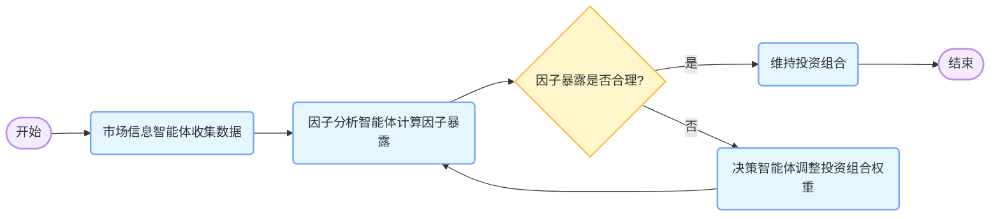

# AI多智能体优化价值投资的动态因子暴露控制

> 关键词：AI多智能体、价值投资、动态因子暴露控制、优化策略、投资决策

> 摘要：本文聚焦于AI多智能体在价值投资领域的应用，探讨如何通过多智能体系统实现对价值投资中动态因子暴露的有效控制。首先介绍了研究的背景和相关概念，包括多智能体系统、价值投资以及动态因子暴露的原理。接着详细阐述了核心算法原理和具体操作步骤，结合Python源代码进行说明。同时，给出了相应的数学模型和公式，并通过举例进行详细讲解。在项目实战部分，提供了开发环境搭建、源代码实现和代码解读等内容。分析了该技术的实际应用场景，推荐了相关的工具和资源，最后对未来发展趋势与挑战进行了总结，还给出了常见问题的解答和参考资料。

## 1. 背景介绍 
### 1.1 目的和范围
在当今复杂多变的金融市场中，价值投资作为一种重要的投资策略，旨在寻找被低估的资产并长期持有以获取收益。然而，市场环境的动态变化使得资产的风险因子暴露也处于不断变化之中。传统的投资策略往往难以实时、精准地应对这些变化，导致投资组合的风险控制和收益优化面临挑战。

本文的目的在于研究如何利用AI多智能体技术来优化价值投资中的动态因子暴露控制。通过多智能体之间的协作和交互，实现对市场信息的实时感知、分析和决策，从而调整投资组合以适应市场变化，降低风险并提高收益。

研究范围涵盖了AI多智能体的基本原理、价值投资的理论基础、动态因子暴露的测量和控制方法，以及如何将这些技术整合到一个完整的投资决策系统中。同时，通过实际案例和代码实现，验证该方法的可行性和有效性。

### 1.2 预期读者
本文的预期读者包括金融领域的投资者、投资经理、量化分析师，以及对人工智能和金融科技交叉领域感兴趣的研究人员和技术开发者。对于希望了解如何利用先进技术优化投资策略、控制投资风险的专业人士，本文提供了深入的理论分析和实践指导。对于从事相关领域研究的学者和开发者，本文可以为他们的研究和开发工作提供参考和启示。

### 1.3 文档结构概述
本文共分为十个部分，具体结构如下：
1. 背景介绍：阐述研究的目的、范围、预期读者和文档结构，以及相关术语的定义。
2. 核心概念与联系：介绍AI多智能体、价值投资和动态因子暴露的核心概念，以及它们之间的联系，并给出相应的文本示意图和Mermaid流程图。
3. 核心算法原理 & 具体操作步骤：详细讲解实现动态因子暴露控制的核心算法原理，并通过Python源代码展示具体的操作步骤。
4. 数学模型和公式 & 详细讲解 & 举例说明：给出描述动态因子暴露和投资决策的数学模型和公式，并通过具体例子进行详细讲解。
5. 项目实战：代码实际案例和详细解释说明：包括开发环境搭建、源代码实现和代码解读，通过实际案例展示如何应用上述理论和算法。
6. 实际应用场景：分析AI多智能体优化价值投资的动态因子暴露控制在实际金融市场中的应用场景。
7. 工具和资源推荐：推荐相关的学习资源、开发工具框架和论文著作，帮助读者进一步深入学习和研究。
8. 总结：未来发展趋势与挑战：对AI多智能体在价值投资领域的未来发展趋势进行展望，并分析可能面临的挑战。
9. 附录：常见问题与解答：解答读者在阅读和实践过程中可能遇到的常见问题。
10. 扩展阅读 & 参考资料：提供相关的扩展阅读材料和参考资料，方便读者进一步查阅。

### 1.4 术语表
#### 1.4.1 核心术语定义
- **AI多智能体（AI Multi - Agent）**：由多个智能体组成的系统，每个智能体具有一定的自主决策能力和学习能力，它们之间通过协作和交互来完成复杂的任务。
- **价值投资（Value Investing）**：一种投资策略，基于对资产内在价值的评估，寻找被市场低估的资产并长期持有，以获取资产价值回归带来的收益。
- **动态因子暴露（Dynamic Factor Exposure）**：资产或投资组合对各种风险因子的暴露程度随时间变化的情况。风险因子包括市场风险、行业风险、利率风险等。
- **智能体（Agent）**：具有感知环境、决策和行动能力的个体，在多智能体系统中可以独立地与其他智能体和环境进行交互。

#### 1.4.2 相关概念解释
- **投资组合（Portfolio）**：由多种资产组成的集合，投资者通过合理配置资产来实现风险和收益的平衡。
- **风险因子（Risk Factor）**：影响资产价格波动的各种因素，如宏观经济指标、行业政策、公司财务状况等。
- **因子模型（Factor Model）**：用于描述资产收益与风险因子之间关系的数学模型，常见的有单因子模型和多因子模型。

#### 1.4.3 缩略词列表
- **AI**：Artificial Intelligence（人工智能）
- **MDP**：Markov Decision Process（马尔可夫决策过程）
- **RL**：Reinforcement Learning（强化学习）

## 2. 核心概念与联系 
### 2.1 AI多智能体系统
AI多智能体系统是由多个智能体组成的分布式系统。每个智能体可以感知周围环境的信息，根据自身的目标和规则进行决策，并采取相应的行动。智能体之间通过通信和协作来实现共同的目标。

智能体的基本结构包括感知模块、决策模块和行动模块。感知模块负责收集环境信息，决策模块根据感知到的信息和智能体的目标进行决策，行动模块则执行决策结果。

### 2.2 价值投资
价值投资的核心思想是寻找被市场低估的资产。投资者通过对公司的基本面分析，包括财务报表、行业前景、管理团队等，评估公司的内在价值。当市场价格低于内在价值时，投资者认为该资产被低估，从而买入并长期持有，等待资产价值回归。

价值投资强调长期投资和基本面分析，注重资产的内在价值而非短期市场波动。

### 2.3 动态因子暴露
动态因子暴露描述了资产或投资组合对各种风险因子的暴露程度随时间的变化。风险因子的变化会导致资产价格的波动，因此控制动态因子暴露对于降低投资组合的风险至关重要。

通过调整投资组合中资产的权重，可以改变投资组合对不同风险因子的暴露程度。例如，如果预期市场风险上升，可以减少对高风险资产的投资，增加对低风险资产的投资，从而降低投资组合对市场风险的暴露。

### 2.4 核心概念联系
AI多智能体系统可以应用于价值投资中的动态因子暴露控制。多个智能体可以分别负责不同的任务，如市场信息收集、因子分析、投资决策等。智能体之间通过协作和交互，实现对动态因子暴露的实时监测和调整。

例如，一个智能体可以负责收集市场数据和公司基本面信息，另一个智能体可以根据这些信息进行因子分析，计算投资组合的动态因子暴露。然后，决策智能体根据因子暴露情况和投资目标，调整投资组合中资产的权重，以实现对动态因子暴露的控制。

### 2.5 文本示意图
```plaintext
+----------------+       +----------------+       +----------------+
| 市场信息智能体 | ----> | 因子分析智能体 | ----> | 决策智能体     |
+----------------+       +----------------+       +----------------+
          |                          |                    |
          v                          v                    v
   收集市场数据             计算因子暴露         调整投资组合权重
```

### 2.6 Mermaid流程图


## 3. 核心算法原理 & 具体操作步骤 
### 3.1 核心算法原理
在AI多智能体优化价值投资的动态因子暴露控制中，核心算法主要涉及智能体的决策和协作机制。这里我们采用强化学习算法，特别是基于马尔可夫决策过程（MDP）的深度强化学习算法。

马尔可夫决策过程是一个五元组 $(S, A, P, R, \gamma)$，其中：
- $S$ 是状态空间，表示智能体所处的环境状态。在价值投资中，状态可以包括市场数据、公司基本面信息、投资组合的因子暴露等。
- $A$ 是动作空间，表示智能体可以采取的行动。在投资决策中，动作可以是调整投资组合中资产的权重。
- $P$ 是状态转移概率，表示在当前状态下采取某个动作后转移到下一个状态的概率。
- $R$ 是奖励函数，表示智能体在某个状态下采取某个动作后获得的奖励。奖励函数可以根据投资组合的收益和风险来设计。
- $\gamma$ 是折扣因子，用于衡量未来奖励的重要性。

智能体的目标是通过不断地与环境交互，学习到一个最优策略 $\pi^*$，使得在每个状态下采取的动作能够最大化长期累积奖励。

### 3.2 具体操作步骤
以下是实现AI多智能体优化价值投资的动态因子暴露控制的具体操作步骤：

#### 3.2.1 初始化
- 初始化智能体的参数，包括神经网络的权重、学习率等。
- 初始化投资组合，设定初始的资产权重。

#### 3.2.2 环境感知
- 市场信息智能体收集市场数据和公司基本面信息，将这些信息作为当前状态输入到因子分析智能体。

#### 3.2.3 因子分析
- 因子分析智能体根据市场信息，计算投资组合的动态因子暴露。

#### 3.2.4 决策
- 决策智能体根据当前状态（包括因子暴露信息）和奖励函数，选择一个动作（调整投资组合权重）。

#### 3.2.5 环境交互
- 执行决策智能体选择的动作，更新投资组合的权重。
- 观察环境的反馈，计算奖励值。

#### 3.2.6 学习
- 根据奖励值和状态转移信息，更新智能体的策略网络，以提高决策的性能。

#### 3.2.7 循环
- 重复步骤 3.2.2 - 3.2.6，直到达到终止条件（如达到最大迭代次数或满足特定的性能指标）。

### 3.3 Python源代码实现
```python
import numpy as np
import torch
import torch.nn as nn
import torch.optim as optim

# 定义状态空间维度、动作空间维度和折扣因子
STATE_DIM = 10
ACTION_DIM = 5
GAMMA = 0.9

# 定义神经网络模型
class PolicyNetwork(nn.Module):
    def __init__(self):
        super(PolicyNetwork, self).__init__()
        self.fc1 = nn.Linear(STATE_DIM, 64)
        self.fc2 = nn.Linear(64, 64)
        self.fc3 = nn.Linear(64, ACTION_DIM)

    def forward(self, x):
        x = torch.relu(self.fc1(x))
        x = torch.relu(self.fc2(x))
        x = torch.softmax(self.fc3(x), dim=-1)
        return x

# 初始化策略网络和优化器
policy_network = PolicyNetwork()
optimizer = optim.Adam(policy_network.parameters(), lr=0.001)

# 模拟环境感知
def observe_environment():
    return np.random.rand(STATE_DIM)

# 模拟因子分析
def factor_analysis(state):
    # 简单示例，实际中需要复杂的计算
    factor_exposure = np.sum(state)
    return factor_exposure

# 模拟奖励函数
def reward_function(state, action):
    # 简单示例，实际中需要根据投资组合收益和风险设计
    reward = np.sum(action)
    return reward

# 主循环
num_episodes = 1000
for episode in range(num_episodes):
    state = observe_environment()
    state_tensor = torch.FloatTensor(state)

    # 决策
    action_probs = policy_network(state_tensor)
    action = torch.multinomial(action_probs, 1).item()

    # 环境交互
    factor_exposure = factor_analysis(state)
    reward = reward_function(state, action)

    # 计算损失
    log_prob = torch.log(action_probs[action])
    loss = -log_prob * reward

    # 学习
    optimizer.zero_grad()
    loss.backward()
    optimizer.step()

    if episode % 100 == 0:
        print(f"Episode {episode}: Loss = {loss.item()}")
```

## 4. 数学模型和公式 & 详细讲解 & 举例说明 
### 4.1 因子模型
在价值投资中，常用的因子模型是多因子模型，用于描述资产收益与风险因子之间的关系。假设存在 $K$ 个风险因子，第 $i$ 个资产的收益率 $r_i$ 可以表示为：

$$r_i = \alpha_i + \sum_{k = 1}^{K} \beta_{ik} f_k + \epsilon_i$$

其中：
- $\alpha_i$ 是资产 $i$ 的超额收益率，即无法由风险因子解释的部分。
- $\beta_{ik}$ 是资产 $i$ 对第 $k$ 个风险因子的暴露程度。
- $f_k$ 是第 $k$ 个风险因子的收益率。
- $\epsilon_i$ 是资产 $i$ 的特异性收益率，服从均值为 0 的正态分布。

### 4.2 投资组合的因子暴露
假设投资组合中包含 $N$ 个资产，第 $j$ 个资产的权重为 $w_j$，则投资组合对第 $k$ 个风险因子的暴露程度 $B_k$ 可以表示为：

$$B_k = \sum_{j = 1}^{N} w_j \beta_{jk}$$

### 4.3 奖励函数设计
奖励函数用于衡量智能体的决策效果，通常考虑投资组合的收益和风险。一种简单的奖励函数可以表示为：

$$R = r_p - \lambda \sigma_p^2$$

其中：
- $r_p$ 是投资组合的收益率。
- $\sigma_p^2$ 是投资组合的方差，用于衡量风险。
- $\lambda$ 是风险厌恶系数，用于调整收益和风险的权重。

### 4.4 举例说明
假设存在两个风险因子 $f_1$ 和 $f_2$，三个资产 $A$、$B$、$C$，它们的因子暴露矩阵为：

$$\beta = \begin{bmatrix}
\beta_{A1} & \beta_{A2} \\
\beta_{B1} & \beta_{B2} \\
\beta_{C1} & \beta_{C2}
\end{bmatrix} = \begin{bmatrix}
0.5 & 0.3 \\
0.2 & 0.6 \\
0.4 & 0.4
\end{bmatrix}$$

投资组合的权重向量为 $w = [0.3, 0.4, 0.3]$，则投资组合对风险因子 $f_1$ 的暴露程度为：

$$B_1 = 0.3 \times 0.5 + 0.4 \times 0.2 + 0.3 \times 0.4 = 0.37$$

对风险因子 $f_2$ 的暴露程度为：

$$B_2 = 0.3 \times 0.3 + 0.4 \times 0.6 + 0.3 \times 0.4 = 0.45$$

假设投资组合的收益率 $r_p = 0.1$，方差 $\sigma_p^2 = 0.05$，风险厌恶系数 $\lambda = 0.5$，则奖励值为：

$$R = 0.1 - 0.5 \times 0.05 = 0.075$$

## 5. 项目实战：代码实际案例和详细解释说明 
### 5.1  开发环境搭建
#### 5.1.1 安装Python
首先，确保你已经安装了Python 3.6 或更高版本。可以从Python官方网站（https://www.python.org/downloads/） 下载并安装适合你操作系统的Python版本。

#### 5.1.2 安装依赖库
使用以下命令安装项目所需的依赖库：
```sh
pip install numpy torch
```

#### 5.1.3 选择开发环境
可以选择使用Jupyter Notebook、PyCharm或VS Code等开发环境进行代码编写和调试。

### 5.2  源代码详细实现和代码解读
```python
import numpy as np
import torch
import torch.nn as nn
import torch.optim as optim

# 定义状态空间维度、动作空间维度和折扣因子
STATE_DIM = 10
ACTION_DIM = 5
GAMMA = 0.9

# 定义神经网络模型
class PolicyNetwork(nn.Module):
    def __init__(self):
        super(PolicyNetwork, self).__init__()
        self.fc1 = nn.Linear(STATE_DIM, 64)
        self.fc2 = nn.Linear(64, 64)
        self.fc3 = nn.Linear(64, ACTION_DIM)

    def forward(self, x):
        x = torch.relu(self.fc1(x))
        x = torch.relu(self.fc2(x))
        x = torch.softmax(self.fc3(x), dim=-1)
        return x

# 初始化策略网络和优化器
policy_network = PolicyNetwork()
optimizer = optim.Adam(policy_network.parameters(), lr=0.001)

# 模拟环境感知
def observe_environment():
    return np.random.rand(STATE_DIM)

# 模拟因子分析
def factor_analysis(state):
    # 简单示例，实际中需要复杂的计算
    factor_exposure = np.sum(state)
    return factor_exposure

# 模拟奖励函数
def reward_function(state, action):
    # 简单示例，实际中需要根据投资组合收益和风险设计
    reward = np.sum(action)
    return reward

# 主循环
num_episodes = 1000
for episode in range(num_episodes):
    state = observe_environment()
    state_tensor = torch.FloatTensor(state)

    # 决策
    action_probs = policy_network(state_tensor)
    action = torch.multinomial(action_probs, 1).item()

    # 环境交互
    factor_exposure = factor_analysis(state)
    reward = reward_function(state, action)

    # 计算损失
    log_prob = torch.log(action_probs[action])
    loss = -log_prob * reward

    # 学习
    optimizer.zero_grad()
    loss.backward()
    optimizer.step()

    if episode % 100 == 0:
        print(f"Episode {episode}: Loss = {loss.item()}")
```

### 5.3  代码解读与分析
#### 5.3.1 导入库
```python
import numpy as np
import torch
import torch.nn as nn
import torch.optim as optim
```
导入了NumPy用于数值计算，PyTorch用于深度学习模型的构建和训练。

#### 5.3.2 定义超参数
```python
STATE_DIM = 10
ACTION_DIM = 5
GAMMA = 0.9
```
定义了状态空间维度、动作空间维度和折扣因子。

#### 5.3.3 定义神经网络模型
```python
class PolicyNetwork(nn.Module):
    def __init__(self):
        super(PolicyNetwork, self).__init__()
        self.fc1 = nn.Linear(STATE_DIM, 64)
        self.fc2 = nn.Linear(64, 64)
        self.fc3 = nn.Linear(64, ACTION_DIM)

    def forward(self, x):
        x = torch.relu(self.fc1(x))
        x = torch.relu(self.fc2(x))
        x = torch.softmax(self.fc3(x), dim=-1)
        return x
```
定义了一个三层全连接神经网络作为策略网络，用于输出动作概率分布。

#### 5.3.4 初始化网络和优化器
```python
policy_network = PolicyNetwork()
optimizer = optim.Adam(policy_network.parameters(), lr=0.001)
```
初始化策略网络和Adam优化器。

#### 5.3.5 模拟环境感知、因子分析和奖励函数
```python
def observe_environment():
    return np.random.rand(STATE_DIM)

def factor_analysis(state):
    # 简单示例，实际中需要复杂的计算
    factor_exposure = np.sum(state)
    return factor_exposure

def reward_function(state, action):
    # 简单示例，实际中需要根据投资组合收益和风险设计
    reward = np.sum(action)
    return reward
```
模拟了环境感知、因子分析和奖励函数，实际应用中需要根据具体情况进行实现。

#### 5.3.6 主循环
```python
num_episodes = 1000
for episode in range(num_episodes):
    state = observe_environment()
    state_tensor = torch.FloatTensor(state)

    # 决策
    action_probs = policy_network(state_tensor)
    action = torch.multinomial(action_probs, 1).item()

    # 环境交互
    factor_exposure = factor_analysis(state)
    reward = reward_function(state, action)

    # 计算损失
    log_prob = torch.log(action_probs[action])
    loss = -log_prob * reward

    # 学习
    optimizer.zero_grad()
    loss.backward()
    optimizer.step()

    if episode % 100 == 0:
        print(f"Episode {episode}: Loss = {loss.item()}")
```
在主循环中，智能体不断与环境交互，进行决策、环境交互、计算损失和学习，直到达到最大迭代次数。

## 6. 实际应用场景 
### 6.1 机构投资者的资产配置
机构投资者如养老基金、保险公司等，管理着大量的资产，需要进行有效的资产配置以实现风险和收益的平衡。AI多智能体优化价值投资的动态因子暴露控制可以帮助机构投资者实时监测市场变化，调整投资组合的因子暴露，降低风险并提高收益。

例如，当市场利率上升时，债券资产的价格可能下跌，通过动态调整投资组合中债券和股票的权重，降低对利率风险的暴露，从而减少投资组合的损失。

### 6.2 量化投资策略的优化
量化投资策略基于数学模型和算法进行投资决策。AI多智能体技术可以用于优化量化投资策略中的动态因子暴露控制。通过多智能体之间的协作和交互，实现对市场信息的实时分析和决策，提高量化投资策略的性能。

例如，在动量策略中，智能体可以根据市场趋势和因子暴露情况，动态调整投资组合中股票的权重，增强策略的盈利能力。

### 6.3 个人投资者的投资决策
个人投资者在进行投资决策时，往往面临信息不足和专业知识缺乏的问题。AI多智能体优化价值投资的动态因子暴露控制可以为个人投资者提供智能化的投资建议。

例如，智能体可以根据个人投资者的风险偏好和投资目标，实时监测市场变化，调整投资组合的因子暴露，为个人投资者提供个性化的投资策略。

## 7. 工具和资源推荐
### 7.1 学习资源推荐
#### 7.1.1 书籍推荐
- 《人工智能：一种现代的方法》：全面介绍了人工智能的基本概念、算法和应用，是学习人工智能的经典教材。
- 《Python机器学习》：详细介绍了Python在机器学习领域的应用，包括机器学习算法的实现和模型评估。
- 《金融市场计量经济学》：介绍了金融市场中的计量经济学方法，包括因子模型、风险度量等，对于理解价值投资和动态因子暴露控制有很大帮助。

#### 7.1.2 在线课程
- Coursera上的“人工智能基础”课程：由知名教授授课，系统地介绍了人工智能的基本原理和算法。
- edX上的“机器学习”课程：提供了丰富的机器学习案例和实践项目，帮助学习者掌握机器学习的应用。
- 中国大学MOOC上的“金融计量学”课程：讲解了金融计量学的基本理论和方法，适用于金融领域的学习者。

#### 7.1.3 技术博客和网站
- Medium：有很多关于人工智能和金融科技的技术博客，提供了最新的研究成果和实践经验。
- arXiv：一个预印本服务器，包含了大量的学术论文，对于了解AI多智能体和价值投资的前沿研究有很大帮助。
- 金融界网站：提供了丰富的金融市场数据和分析报告，对于研究价值投资和动态因子暴露控制有参考价值。

### 7.2 开发工具框架推荐
#### 7.2.1 IDE和编辑器
- PyCharm：一款专业的Python集成开发环境，提供了丰富的代码编辑、调试和版本控制功能。
- VS Code：一款轻量级的代码编辑器，支持多种编程语言和插件，适合快速开发和调试。
- Jupyter Notebook：一个交互式的开发环境，适合进行数据探索、模型训练和可视化。

#### 7.2.2 调试和性能分析工具
- PyTorch Profiler：用于分析PyTorch模型的性能，帮助开发者找出性能瓶颈。
- TensorBoard：一个可视化工具，用于监控深度学习模型的训练过程和性能指标。
- cProfile：Python内置的性能分析工具，用于分析Python代码的执行时间和调用关系。

#### 7.2.3 相关框架和库
- PyTorch：一个开源的深度学习框架，提供了丰富的神经网络模型和优化算法。
- NumPy：一个用于数值计算的Python库，提供了高效的数组操作和数学函数。
- Pandas：一个用于数据处理和分析的Python库，提供了数据结构和数据操作方法。

### 7.3 相关论文著作推荐
#### 7.3.1 经典论文
- Fama, E. F., & French, K. R. (1993). Common risk factors in the returns on stocks and bonds. Journal of Financial Economics, 33(1), 3-56.：提出了著名的Fama - French三因子模型，是因子模型领域的经典论文。
- Merton, R. C. (1973). Theory of rational option pricing. The Bell Journal of Economics and Management Science, 4(1), 141-183.：奠定了期权定价理论的基础，对于理解金融市场的风险和定价有重要意义。

#### 7.3.2 最新研究成果
- 关注顶级学术期刊如Journal of Finance、Journal of Financial Economics、Review of Financial Studies等，获取关于AI多智能体和价值投资的最新研究成果。

#### 7.3.3 应用案例分析
- 可以参考一些金融科技公司的研究报告和案例分析，了解AI多智能体在价值投资中的实际应用和效果。

## 8. 总结：未来发展趋势与挑战
### 8.1 未来发展趋势
#### 8.1.1 多智能体协作的智能化
未来，AI多智能体系统将更加智能化，智能体之间的协作将更加高效和灵活。通过引入深度学习和强化学习等技术，智能体可以更好地理解环境和其他智能体的行为，实现更加复杂的协作任务。

#### 8.1.2 与区块链技术的结合
区块链技术具有去中心化、不可篡改等特点，可以为AI多智能体系统提供更加安全和可信的环境。将区块链技术与AI多智能体相结合，可以实现投资决策的透明化和可追溯性，提高投资者的信任度。

#### 8.1.3 跨领域应用的拓展
AI多智能体优化价值投资的动态因子暴露控制将不仅仅局限于金融领域，还将拓展到其他领域，如供应链管理、医疗保健、能源管理等。通过多智能体系统的协作和优化，可以提高这些领域的效率和效益。

### 8.2 挑战
#### 8.2.1 数据质量和隐私问题
AI多智能体系统需要大量的市场数据和公司基本面信息来进行决策。数据的质量和隐私问题将是一个重要的挑战。如何确保数据的准确性、完整性和安全性，以及如何保护用户的隐私，是需要解决的问题。

#### 8.2.2 模型的可解释性
深度学习模型通常是黑盒模型，其决策过程难以解释。在金融领域，模型的可解释性非常重要，因为投资者需要了解投资决策的依据。如何提高AI多智能体系统的可解释性，是一个亟待解决的问题。

#### 8.2.3 市场的不确定性
金融市场具有高度的不确定性，市场情况随时可能发生变化。AI多智能体系统需要具备快速适应市场变化的能力，以应对市场的不确定性。如何提高系统的鲁棒性和适应性，是需要研究的方向。

## 9. 附录：常见问题与解答
### 9.1 什么是AI多智能体系统？
AI多智能体系统是由多个智能体组成的分布式系统，每个智能体具有一定的自主决策能力和学习能力，它们之间通过协作和交互来完成复杂的任务。

### 9.2 价值投资和动态因子暴露控制有什么关系？
价值投资的目标是寻找被低估的资产并长期持有，而动态因子暴露控制可以帮助投资者实时监测和调整投资组合对各种风险因子的暴露程度，降低投资组合的风险，提高价值投资的收益。

### 9.3 如何实现AI多智能体优化价值投资的动态因子暴露控制？
可以采用强化学习算法，特别是基于马尔可夫决策过程的深度强化学习算法。通过多智能体之间的协作和交互，实现对市场信息的实时感知、分析和决策，调整投资组合的权重，以控制动态因子暴露。

### 9.4 开发AI多智能体系统需要哪些技术和工具？
开发AI多智能体系统需要掌握人工智能、机器学习、深度学习等技术，以及Python编程语言。常用的开发工具包括PyTorch、NumPy、Pandas等框架和库，以及PyCharm、VS Code等开发环境。

### 9.5 AI多智能体优化价值投资的动态因子暴露控制在实际应用中存在哪些问题？
在实际应用中，可能存在数据质量和隐私问题、模型的可解释性问题以及市场的不确定性问题。需要采取相应的措施来解决这些问题，提高系统的性能和可靠性。

## 10. 扩展阅读 & 参考资料
### 10.1 扩展阅读
- 《人工智能与金融科技》：深入探讨了人工智能在金融领域的应用和发展趋势。
- 《智能投资组合管理》：介绍了智能投资组合管理的理论和方法，包括动态因子暴露控制等内容。

### 10.2 参考资料
- 相关学术论文和研究报告，如上述提到的Fama - French三因子模型论文、Merton期权定价理论论文等。
- 金融市场数据提供商的网站，如Wind、Bloomberg等，获取最新的市场数据和分析报告。
- 开源代码库，如GitHub上的相关项目，参考其他开发者的实现和经验。