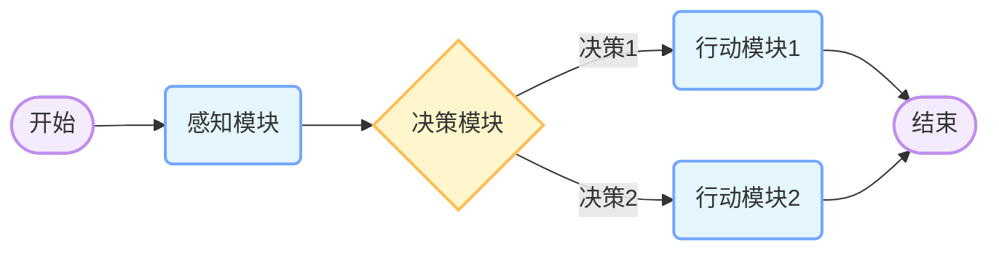

# AI多智能体在价值投资中的ESG因素分析

> 关键词：AI多智能体、价值投资、ESG因素、数据分析、投资决策

> 摘要：本文聚焦于AI多智能体在价值投资中对ESG因素的分析。随着可持续发展理念的深入人心，ESG因素在投资决策中的重要性日益凸显。AI多智能体技术凭借其分布式、自适应等特性，能够高效处理复杂的ESG数据，为价值投资提供更全面、准确的决策依据。文章详细介绍了相关核心概念、算法原理、数学模型，通过项目实战展示了具体应用，探讨了实际应用场景，推荐了学习资源和开发工具，最后对未来发展趋势与挑战进行了总结，旨在为相关领域的研究者和投资者提供有价值的参考。

## 1. 背景介绍 
### 1.1 目的和范围
本研究的目的在于深入探讨AI多智能体技术如何在价值投资中对ESG因素进行有效分析，以提升投资决策的科学性和可持续性。范围涵盖了AI多智能体技术的原理、ESG因素的内涵、两者结合的理论基础和实践应用，以及对未来发展的展望。

### 1.2 预期读者
本文预期读者包括金融投资领域的专业人士，如投资经理、分析师等；计算机科学领域对AI多智能体技术感兴趣的研究者；以及关注可持续发展和社会责任投资的企业管理者和政策制定者。

### 1.3 文档结构概述
本文首先介绍了相关的背景知识，包括目的、预期读者和文档结构。接着阐述了核心概念与联系，包括AI多智能体、价值投资和ESG因素的定义和相互关系。然后详细讲解了核心算法原理和具体操作步骤，给出了数学模型和公式并举例说明。通过项目实战展示了代码实现和详细解释。探讨了实际应用场景，推荐了相关的工具和资源。最后总结了未来发展趋势与挑战，提供了常见问题解答和扩展阅读参考资料。

### 1.4 术语表
#### 1.4.1 核心术语定义
- **AI多智能体**：由多个智能体组成的系统，每个智能体具有一定的自主决策能力，通过相互协作来完成复杂任务。
- **价值投资**：一种基于公司基本面分析，寻找被低估股票并长期持有的投资策略。
- **ESG因素**：环境（Environmental）、社会（Social）和治理（Governance）因素的统称，用于评估企业在可持续发展方面的表现。

#### 1.4.2 相关概念解释
- **环境因素**：包括企业对环境的影响，如碳排放、资源利用效率、污染治理等。
- **社会因素**：涉及企业与员工、客户、社区等利益相关者的关系，如员工福利、产品质量、社区参与等。
- **治理因素**：关注企业的内部管理和决策机制，如董事会结构、高管薪酬、信息披露等。

#### 1.4.3 缩略词列表
- **AI**：Artificial Intelligence（人工智能）
- **ESG**：Environmental, Social and Governance（环境、社会和治理）

## 2. 核心概念与联系 

### 2.1 AI多智能体原理
AI多智能体系统由多个智能体组成，每个智能体具有感知、决策和行动的能力。智能体之间通过通信和协作来实现系统的整体目标。智能体可以是软件程序、机器人等。其架构通常包括以下几个部分：
- **感知模块**：负责收集环境信息。
- **决策模块**：根据感知信息和自身的目标，做出决策。
- **行动模块**：执行决策，对环境产生影响。

以下是AI多智能体系统的Mermaid流程图：


### 2.2 价值投资理念
价值投资的核心思想是寻找被市场低估的股票，通过长期持有来获取价值回归带来的收益。价值投资者通常关注公司的基本面，如财务状况、盈利能力、竞争优势等。他们相信市场会在长期内正确反映公司的价值，因此会耐心等待股票价格的上涨。

### 2.3 ESG因素内涵
ESG因素是衡量企业可持续发展能力的重要指标。环境因素反映了企业对环境的影响和资源利用效率；社会因素关注企业与利益相关者的关系；治理因素则涉及企业的内部管理和决策机制。综合考虑ESG因素可以更全面地评估企业的长期价值和风险。

### 2.4 三者的联系
AI多智能体技术可以用于收集、分析和处理ESG数据，为价值投资提供更准确的信息。通过对ESG因素的评估，价值投资者可以更好地识别具有可持续发展潜力的企业，降低投资风险。同时，ESG因素的考虑也符合社会对企业社会责任的要求，有助于实现经济、社会和环境的可持续发展。

## 3. 核心算法原理 & 具体操作步骤 

### 3.1 核心算法原理
在AI多智能体系统中，常用的算法包括强化学习算法、博弈论算法等。这里以强化学习算法为例进行介绍。强化学习是一种通过智能体与环境的交互来学习最优策略的算法。智能体在环境中采取行动，根据环境的反馈（奖励或惩罚）来调整自己的策略，以最大化长期累积奖励。

以下是一个简单的强化学习算法的Python源代码示例：
```python
import numpy as np

# 定义环境
class Environment:
    def __init__(self):
        self.state = 0
        self.num_states = 5
        self.num_actions = 2

    def step(self, action):
        if action == 0:
            self.state = max(0, self.state - 1)
        else:
            self.state = min(self.num_states - 1, self.state + 1)
        reward = 1 if self.state == self.num_states - 1 else 0
        done = self.state == self.num_states - 1
        return self.state, reward, done

# 定义智能体
class Agent:
    def __init__(self, num_states, num_actions):
        self.num_states = num_states
        self.num_actions = num_actions
        self.q_table = np.zeros((num_states, num_actions))
        self.learning_rate = 0.1
        self.discount_factor = 0.9
        self.epsilon = 0.1

    def choose_action(self, state):
        if np.random.uniform(0, 1) < self.epsilon:
            return np.random.choice(self.num_actions)
        else:
            return np.argmax(self.q_table[state])

    def update_q_table(self, state, action, reward, next_state):
        predict = self.q_table[state][action]
        target = reward + self.discount_factor * np.max(self.q_table[next_state])
        self.q_table[state][action] += self.learning_rate * (target - predict)

# 训练智能体
env = Environment()
agent = Agent(env.num_states, env.num_actions)
num_episodes = 1000

for episode in range(num_episodes):
    state = 0
    done = False
    while not done:
        action = agent.choose_action(state)
        next_state, reward, done = env.step(action)
        agent.update_q_table(state, action, reward, next_state)
        state = next_state

print(agent.q_table)
```

### 3.2 具体操作步骤
1. **数据收集**：使用多个智能体收集与ESG因素相关的数据，如企业的环境报告、社会责任报告、财务报表等。
2. **数据预处理**：对收集到的数据进行清洗、转换和归一化处理，以提高数据质量。
3. **特征提取**：从预处理后的数据中提取与ESG因素相关的特征，如碳排放强度、员工满意度等。
4. **模型训练**：使用强化学习等算法对智能体进行训练，使其能够根据ESG特征做出投资决策。
5. **决策生成**：在实际投资过程中，智能体根据当前的ESG数据和训练好的模型，生成投资决策。
6. **反馈与优化**：根据投资结果对智能体的策略进行反馈和优化，不断提高投资决策的准确性。

## 4. 数学模型和公式 & 详细讲解 & 举例说明 

### 4.1 强化学习数学模型
强化学习的数学模型可以用马尔可夫决策过程（MDP）来描述。MDP由一个四元组 $(S, A, P, R)$ 组成，其中：
- $S$ 是状态空间，表示环境的所有可能状态。
- $A$ 是动作空间，表示智能体可以采取的所有动作。
- $P$ 是状态转移概率，表示在状态 $s$ 采取动作 $a$ 后转移到状态 $s'$ 的概率，即 $P(s'|s, a)$。
- $R$ 是奖励函数，表示在状态 $s$ 采取动作 $a$ 后获得的即时奖励，即 $R(s, a)$。

智能体的目标是找到一个最优策略 $\pi^*$，使得长期累积奖励最大化。长期累积奖励可以用折扣回报来表示：
$$G_t = \sum_{k=0}^{\infty} \gamma^k R_{t+k+1}$$
其中，$\gamma$ 是折扣因子，$0 \leq \gamma \leq 1$，表示未来奖励的重要程度。

### 4.2 Q学习算法公式
Q学习是一种常用的强化学习算法，用于估计动作价值函数 $Q(s, a)$。Q学习的更新公式为：
$$Q(s_t, a_t) \leftarrow Q(s_t, a_t) + \alpha [R_{t+1} + \gamma \max_{a} Q(s_{t+1}, a) - Q(s_t, a_t)]$$
其中，$\alpha$ 是学习率，$0 \leq \alpha \leq 1$，表示每次更新的步长。

### 4.3 举例说明
假设有一个简单的投资环境，状态空间 $S = \{s_1, s_2, s_3\}$，动作空间 $A = \{a_1, a_2\}$。初始时，$Q$ 表的值都为0。智能体在状态 $s_1$ 采取动作 $a_1$，获得奖励 $R = 1$，转移到状态 $s_2$。学习率 $\alpha = 0.1$，折扣因子 $\gamma = 0.9$。

根据Q学习的更新公式，$Q(s_1, a_1)$ 的更新过程如下：
$$Q(s_1, a_1) \leftarrow Q(s_1, a_1) + 0.1 [1 + 0.9 \max_{a} Q(s_2, a) - Q(s_1, a_1)]$$
由于 $Q$ 表初始值都为0，所以 $\max_{a} Q(s_2, a) = 0$，则：
$$Q(s_1, a_1) \leftarrow 0 + 0.1 [1 + 0.9 \times 0 - 0] = 0.1$$

## 5. 项目实战：代码实际案例和详细解释说明 

### 5.1  开发环境搭建
1. **安装Python**：建议使用Python 3.7及以上版本。
2. **安装必要的库**：使用pip安装numpy、pandas、matplotlib等库。例如：
```sh
pip install numpy pandas matplotlib
```

### 5.2  源代码详细实现和代码解读
以下是一个使用AI多智能体分析ESG因素进行价值投资的示例代码：
```python
import numpy as np
import pandas as pd

# 模拟ESG数据
def generate_esg_data(num_companies, num_features):
    esg_data = np.random.rand(num_companies, num_features)
    return pd.DataFrame(esg_data, columns=[f'ESG_{i}' for i in range(num_features)])

# 定义智能体类
class ESGAgent:
    def __init__(self, num_features):
        self.weights = np.random.rand(num_features)
        self.learning_rate = 0.1

    def evaluate_company(self, esg_data):
        score = np.dot(esg_data, self.weights)
        return score

    def update_weights(self, feedback):
        self.weights += self.learning_rate * feedback

# 模拟投资过程
def investment_process(num_companies, num_features, num_episodes):
    esg_data = generate_esg_data(num_companies, num_features)
    agent = ESGAgent(num_features)

    for episode in range(num_episodes):
        scores = []
        for index, row in esg_data.iterrows():
            score = agent.evaluate_company(row)
            scores.append(score)

        # 假设投资排名前3的公司
        top_indices = np.argsort(scores)[-3:]
        # 模拟投资反馈
        feedback = np.zeros(num_features)
        for index in top_indices:
            feedback += esg_data.iloc[index]

        agent.update_weights(feedback)

    return agent.weights

# 运行投资过程
weights = investment_process(10, 5, 100)
print("Final weights:", weights)
```
### 5.3  代码解读与分析
1. **数据生成**：`generate_esg_data` 函数用于生成模拟的ESG数据，每个公司有多个ESG特征。
2. **智能体类**：`ESGAgent` 类表示一个智能体，它有一组权重用于评估公司的ESG得分。`evaluate_company` 方法根据权重计算公司的得分，`update_weights` 方法根据投资反馈更新权重。
3. **投资过程**：`investment_process` 函数模拟了投资过程，在每个回合中，智能体评估所有公司的ESG得分，选择排名前3的公司进行投资，并根据投资反馈更新权重。
4. **结果输出**：最后输出智能体的最终权重，这些权重反映了智能体对不同ESG特征的重视程度。

## 6. 实际应用场景 
### 6.1 机构投资者决策
机构投资者，如养老基金、保险公司等，在进行大规模投资时，需要考虑投资组合的长期风险和回报。AI多智能体技术可以帮助他们收集和分析大量的ESG数据，识别具有可持续发展潜力的企业，优化投资组合，降低投资风险。

### 6.2 企业战略规划
企业可以利用AI多智能体技术分析自身和竞争对手的ESG表现，制定可持续发展战略。通过改进环境管理、加强社会责任和完善公司治理，企业可以提高自身的竞争力，吸引更多的投资者和客户。

### 6.3 监管机构评估
监管机构可以使用AI多智能体技术对企业的ESG信息进行监测和评估，确保企业遵守相关的法律法规和社会责任标准。这有助于提高市场的透明度和公正性，促进经济的可持续发展。

## 7. 工具和资源推荐
### 7.1 学习资源推荐
#### 7.1.1 书籍推荐
- 《人工智能：一种现代的方法》：全面介绍了人工智能的基本概念、算法和应用。
- 《强化学习：原理与Python实现》：详细讲解了强化学习的理论和实践。
- 《ESG投资：从理论到实践》：介绍了ESG投资的基本概念、评估方法和案例分析。

#### 7.1.2 在线课程
- Coursera上的“人工智能基础”课程：由知名大学教授授课，涵盖了人工智能的基础知识。
- edX上的“强化学习”课程：提供了丰富的案例和实践项目。
- 中国大学MOOC上的“ESG与可持续金融”课程：介绍了ESG在金融领域的应用。

#### 7.1.3 技术博客和网站
- Medium上的AI相关博客：有很多关于AI多智能体技术的最新研究和实践经验。
- Towards Data Science：提供了大量的数据科学和机器学习的教程和案例。
- ESG Investor：专注于ESG投资的新闻和分析。

### 7.2 开发工具框架推荐
#### 7.2.1 IDE和编辑器
- PyCharm：功能强大的Python集成开发环境，适合开发AI多智能体应用。
- Jupyter Notebook：交互式的开发环境，方便进行数据分析和模型训练。
- Visual Studio Code：轻量级的代码编辑器，支持多种编程语言和插件。

#### 7.2.2 调试和性能分析工具
- PDB：Python自带的调试工具，用于调试Python代码。
- cProfile：Python的性能分析工具，用于分析代码的性能瓶颈。
- TensorBoard：用于可视化深度学习模型的训练过程和性能指标。

#### 7.2.3 相关框架和库
- OpenAI Gym：用于开发和比较强化学习算法的工具包。
- Ray RLlib：分布式强化学习框架，支持大规模的强化学习训练。
- Scikit-learn：用于机器学习的Python库，提供了丰富的算法和工具。

### 7.3 相关论文著作推荐
#### 7.3.1 经典论文
- “Reinforcement Learning: An Introduction”：强化学习领域的经典著作，系统介绍了强化学习的理论和算法。
- “Multi-Agent Systems: Algorithmic, Game-Theoretic, and Logical Foundations”：多智能体系统的经典教材，涵盖了多智能体系统的各个方面。
- “ESG and Financial Performance: Aggregated Evidence from More than 2000 Empirical Studies”：对ESG与财务绩效关系的综合研究。

#### 7.3.2 最新研究成果
- 关注顶级学术会议，如NeurIPS、ICML等，获取AI多智能体技术的最新研究成果。
- 查阅金融领域的顶级期刊，如Journal of Finance、Review of Financial Studies等，了解ESG投资的最新进展。

#### 7.3.3 应用案例分析
- 一些知名投资机构的研究报告，如贝莱德、富达等，提供了ESG投资的实际案例和经验分享。
- 企业的社会责任报告和可持续发展报告，展示了企业在ESG方面的实践和成果。

## 8. 总结：未来发展趋势与挑战
### 8.1 未来发展趋势
- **技术融合**：AI多智能体技术将与区块链、物联网等技术深度融合，提高ESG数据的可信度和实时性。
- **个性化投资**：根据投资者的偏好和风险承受能力，提供个性化的ESG投资方案。
- **全球合作**：各国政府、企业和投资者将加强合作，共同推动ESG投资的发展，实现全球可持续发展目标。

### 8.2 挑战
- **数据质量**：ESG数据的质量和标准化程度有待提高，需要建立统一的数据采集和评估标准。
- **算法复杂性**：AI多智能体算法的复杂性较高，需要进一步优化算法，提高计算效率和决策准确性。
- **法律法规**：相关的法律法规和监管政策还不完善，需要加强立法和监管，保障ESG投资的健康发展。

## 9. 附录：常见问题与解答
### 9.1 AI多智能体技术在ESG分析中的优势是什么？
AI多智能体技术具有分布式、自适应等特性，能够高效处理复杂的ESG数据。多个智能体可以同时收集和分析不同来源的数据，提高数据处理的效率和准确性。智能体之间的协作可以实现知识的共享和互补，从而更好地理解ESG因素对企业价值的影响。

### 9.2 如何确保ESG数据的可靠性？
可以通过以下方法确保ESG数据的可靠性：
- 建立统一的数据采集标准和规范，确保数据的一致性和可比性。
- 对数据进行多源验证，通过不同渠道获取的数据进行交叉验证。
- 加强对数据提供者的监管和审计，确保数据的真实性和准确性。

### 9.3 AI多智能体技术在价值投资中的应用前景如何？
随着可持续发展理念的深入人心，ESG因素在价值投资中的重要性将不断提高。AI多智能体技术作为一种高效的数据处理和决策工具，将在价值投资中发挥越来越重要的作用。未来，AI多智能体技术有望实现自动化的投资决策，提高投资效率和收益，同时促进经济的可持续发展。

## 10. 扩展阅读 & 参考资料
1. 《人工智能及其应用》，蔡自兴等著
2. 《金融科技前沿：ESG投资》，相关研究报告
3. OpenAI官方文档
4. 各金融机构和企业的ESG报告和研究资料

通过以上内容，我们全面探讨了AI多智能体在价值投资中的ESG因素分析，从核心概念到实际应用，为相关领域的研究和实践提供了有益的参考。未来，随着技术的不断发展和应用的深入，AI多智能体技术将在价值投资中发挥更大的作用，推动可持续金融的发展。