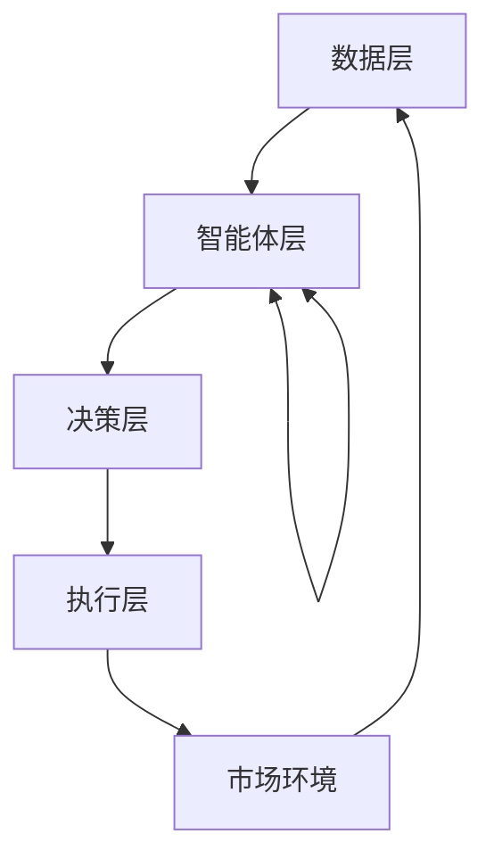

# AI多智能体增强价值投资的跨市场比较分析

> 关键词：AI多智能体、价值投资、跨市场比较、增强学习、金融市场

> 摘要：本文聚焦于AI多智能体增强价值投资在跨市场环境下的应用与比较分析。首先介绍了研究的背景、目的和范围，明确预期读者和文档结构。详细阐述了AI多智能体、价值投资等核心概念及其联系，给出相应的原理和架构示意图与流程图。深入探讨了核心算法原理，用Python代码进行详细说明，同时介绍了相关数学模型和公式并举例。通过项目实战展示了代码的实际应用和详细解读。分析了AI多智能体增强价值投资在不同市场的实际应用场景。推荐了学习资源、开发工具框架以及相关论文著作。最后总结了未来发展趋势与挑战，还提供了常见问题解答和扩展阅读参考资料，旨在为相关领域的研究者和投资者提供全面深入的参考。

## 1. 背景介绍 
### 1.1 目的和范围
在当今全球化的金融市场环境下，投资者面临着越来越复杂的投资决策。不同市场具有各自独特的特点和运行规律，如何在跨市场环境中做出更明智的价值投资决策是投资者关注的焦点。本研究的目的在于探讨AI多智能体技术在增强价值投资方面的应用，并对其在不同市场中的表现进行比较分析。范围涵盖股票市场、债券市场、期货市场等多种金融市场，旨在揭示AI多智能体在不同市场中的优势和局限性，为投资者提供更科学的投资策略参考。

### 1.2 预期读者
本文预期读者包括金融市场的投资者、金融研究机构的研究人员、人工智能领域的开发者以及对金融与人工智能交叉领域感兴趣的学者。对于投资者，本文可以提供新的投资思路和方法；对于研究人员，有助于深入了解AI多智能体在金融领域的应用；对于开发者，能为其在相关领域的技术实现提供参考；对于学者，则可以作为进一步研究的基础。

### 1.3 文档结构概述
本文首先介绍研究的背景信息，包括目的、预期读者和文档结构等。接着阐述核心概念及其联系，通过示意图和流程图直观展示。然后详细讲解核心算法原理和具体操作步骤，结合Python代码进行说明。再介绍相关数学模型和公式，并举例说明。之后通过项目实战展示代码的实际应用和解读。分析实际应用场景，推荐相关学习资源、开发工具框架和论文著作。最后总结未来发展趋势与挑战，提供常见问题解答和扩展阅读参考资料。

### 1.4 术语表
#### 1.4.1 核心术语定义
- **AI多智能体**：由多个智能体组成的系统，每个智能体具有一定的自主决策能力，能够通过与环境和其他智能体的交互来实现共同的目标。在金融投资领域，智能体可以根据市场信息做出投资决策。
- **价值投资**：一种投资策略，投资者通过分析公司的基本面，如财务状况、盈利能力、行业地位等，寻找被低估的资产进行投资，以期在长期获得稳定的回报。
- **跨市场**：涉及不同类型的金融市场，如股票市场、债券市场、期货市场等，投资者在多个市场中进行投资决策。
- **增强学习**：一种机器学习方法，智能体通过与环境进行交互，根据环境反馈的奖励信号来学习最优策略，以最大化长期累积奖励。

#### 1.4.2 相关概念解释
- **智能体**：具有感知、决策和行动能力的实体。在AI多智能体系统中，智能体可以是软件程序，根据预设的规则和算法对市场信息进行分析和处理，并做出投资决策。
- **市场环境**：包括各种金融市场的交易规则、价格波动、宏观经济因素等，是智能体进行决策的外部条件。
- **投资组合**：投资者持有的多种资产的组合，通过合理配置不同资产，可以降低风险并提高收益。

#### 1.4.3 缩略词列表
- **AI**：Artificial Intelligence，人工智能
- **RL**：Reinforcement Learning，增强学习
- **MDP**：Markov Decision Process，马尔可夫决策过程

## 2. 核心概念与联系 
### 核心概念原理
#### AI多智能体
AI多智能体系统由多个智能体组成，每个智能体具有独立的感知、决策和行动能力。智能体通过传感器感知市场环境信息，如资产价格、交易量等。然后根据内部的决策算法，如增强学习算法，对这些信息进行分析和处理，做出投资决策。多个智能体之间可以进行通信和协作，共同优化投资策略。

#### 价值投资
价值投资的核心原理是基于公司的内在价值进行投资。投资者通过分析公司的财务报表、行业前景、管理层能力等因素，评估公司的内在价值。如果市场价格低于内在价值，投资者认为该资产被低估，从而进行投资。价值投资强调长期投资，关注公司的基本面和盈利能力。

#### 增强学习
增强学习是一种通过智能体与环境交互来学习最优策略的方法。智能体在环境中采取行动，环境会根据智能体的行动给予奖励或惩罚。智能体的目标是通过不断尝试和学习，找到一种能够最大化长期累积奖励的策略。在价值投资中，增强学习可以帮助智能体根据市场环境的变化调整投资策略，以获得更高的收益。

### 架构的文本示意图
AI多智能体增强价值投资的架构可以分为以下几个层次：
- **数据层**：收集和整理来自不同市场的各种数据，如资产价格、财务报表、宏观经济数据等。
- **智能体层**：由多个智能体组成，每个智能体根据数据层提供的信息进行分析和决策。智能体之间可以进行通信和协作。
- **决策层**：综合多个智能体的决策，形成最终的投资策略。
- **执行层**：根据决策层制定的投资策略，在市场中进行实际的投资操作。

### Mermaid流程图


## 3. 核心算法原理 & 具体操作步骤 
### 增强学习算法原理
增强学习的核心是马尔可夫决策过程（MDP）。MDP可以用一个五元组 $<S, A, P, R, \gamma>$ 来表示，其中：
- $S$ 是状态集合，表示智能体在环境中可能处于的状态。
- $A$ 是动作集合，表示智能体可以采取的动作。
- $P$ 是状态转移概率，表示在状态 $s$ 下采取动作 $a$ 后转移到状态 $s'$ 的概率。
- $R$ 是奖励函数，表示在状态 $s$ 下采取动作 $a$ 后获得的奖励。
- $\gamma$ 是折扣因子，用于权衡当前奖励和未来奖励的重要性。

智能体的目标是找到一个最优策略 $\pi$，使得长期累积奖励最大化。最优策略可以通过求解贝尔曼方程得到：
$$V^*(s) = \max_{a \in A} \left[ R(s, a) + \gamma \sum_{s' \in S} P(s'|s, a) V^*(s') \right]$$
其中 $V^*(s)$ 是状态 $s$ 的最优价值函数。

### 具体操作步骤
1. **数据收集与预处理**：收集来自不同市场的各种数据，包括资产价格、财务报表、宏观经济数据等。对数据进行清洗、归一化等预处理操作，以提高数据的质量和可用性。
2. **状态定义**：根据收集到的数据，定义智能体的状态。状态可以包括资产价格、交易量、财务指标等。
3. **动作定义**：定义智能体可以采取的动作，如买入、卖出、持有等。
4. **奖励函数设计**：设计奖励函数，根据智能体的投资决策和市场表现给予相应的奖励或惩罚。奖励函数可以考虑投资收益、风险等因素。
5. **增强学习算法选择与训练**：选择合适的增强学习算法，如Q - learning、深度Q网络（DQN）等。使用收集到的数据对智能体进行训练，不断优化策略。
6. **策略评估与优化**：在训练过程中，对智能体的策略进行评估，根据评估结果调整算法参数，进一步优化策略。

### Python源代码实现
```python
import numpy as np

# 定义状态集合
states = [0, 1, 2]  # 示例状态
# 定义动作集合
actions = [0, 1]  # 示例动作，0: 持有，1: 买入

# 定义状态转移概率
P = np.array([
    [[0.7, 0.3, 0], [0.4, 0.6, 0]],
    [[0.3, 0.7, 0], [0.2, 0.8, 0]],
    [[0, 0.3, 0.7], [0, 0.2, 0.8]]
])

# 定义奖励函数
R = np.array([
    [[1, 0, 0], [2, 0, 0]],
    [[0, 1, 0], [0, 2, 0]],
    [[0, 0, 1], [0, 0, 2]]
])

# 折扣因子
gamma = 0.9

# 初始化价值函数
V = np.zeros(len(states))

# 迭代次数
num_iterations = 100

# 价值迭代算法
for _ in range(num_iterations):
    new_V = np.zeros(len(states))
    for s in range(len(states)):
        action_values = []
        for a in range(len(actions)):
            action_value = 0
            for s_prime in range(len(states)):
                action_value += P[s, a, s_prime] * (R[s, a, s_prime] + gamma * V[s_prime])
            action_values.append(action_value)
        new_V[s] = max(action_values)
    V = new_V

print("最优价值函数:", V)
```

## 4. 数学模型和公式 & 详细讲解 & 举例说明 
### 马尔可夫决策过程（MDP）
如前所述，MDP用五元组 $<S, A, P, R, \gamma>$ 表示。

#### 状态转移概率 $P$
$P(s'|s, a)$ 表示在状态 $s$ 下采取动作 $a$ 后转移到状态 $s'$ 的概率。例如，在股票市场中，状态 $s$ 可以表示股票的价格区间，动作 $a$ 可以表示买入或卖出。如果当前股票价格处于某个区间 $s$，买入股票（动作 $a$）后，股票价格可能会转移到另一个区间 $s'$，$P(s'|s, a)$ 就是这种转移的概率。

#### 奖励函数 $R$
$R(s, a)$ 表示在状态 $s$ 下采取动作 $a$ 后获得的奖励。在价值投资中，奖励可以与投资收益相关。例如，如果买入股票后股票价格上涨，智能体可以获得正的奖励；如果股票价格下跌，智能体获得负的奖励。

#### 折扣因子 $\gamma$
$\gamma$ 用于权衡当前奖励和未来奖励的重要性。$\gamma$ 的取值范围是 $[0, 1]$。当 $\gamma$ 接近 1 时，智能体更注重未来的奖励；当 $\gamma$ 接近 0 时，智能体更注重当前的奖励。例如，在长期投资中，$\gamma$ 可以取较大的值，以考虑未来的收益；在短期投资中，$\gamma$ 可以取较小的值。

### 贝尔曼方程
贝尔曼方程 $V^*(s) = \max_{a \in A} \left[ R(s, a) + \gamma \sum_{s' \in S} P(s'|s, a) V^*(s') \right]$ 用于求解最优价值函数 $V^*(s)$。

#### 详细讲解
方程的左边 $V^*(s)$ 表示状态 $s$ 的最优价值。右边的 $\max_{a \in A}$ 表示在所有可能的动作中选择能使价值最大的动作。$R(s, a)$ 是在状态 $s$ 下采取动作 $a$ 获得的即时奖励。$\gamma \sum_{s' \in S} P(s'|s, a) V^*(s')$ 是未来奖励的期望，考虑了状态转移概率和未来状态的最优价值。

#### 举例说明
假设在一个简单的投资场景中，状态 $S = \{s_1, s_2\}$，动作 $A = \{a_1, a_2\}$，状态转移概率 $P$ 和奖励函数 $R$ 如下：
$P = \begin{bmatrix}
    [0.6, 0.4] & [0.3, 0.7] \\
    [0.4, 0.6] & [0.2, 0.8]
\end{bmatrix}$
$R = \begin{bmatrix}
    [1, 2] & [0, 3] \\
    [0, 1] & [2, 0]
\end{bmatrix}$
折扣因子 $\gamma = 0.9$。

初始化 $V^*(s_1) = 0$，$V^*(s_2) = 0$。

第一次迭代：
对于 $s_1$：
- 当 $a = a_1$：$R(s_1, a_1) + \gamma \sum_{s' \in S} P(s'|s_1, a_1) V^*(s') = 1 + 0.9\times(0.6\times0 + 0.4\times0) = 1$
- 当 $a = a_2$：$R(s_1, a_2) + \gamma \sum_{s' \in S} P(s'|s_1, a_2) V^*(s') = 2 + 0.9\times(0.3\times0 + 0.7\times0) = 2$
所以 $V^*(s_1) = \max(1, 2) = 2$。

对于 $s_2$：
- 当 $a = a_1$：$R(s_2, a_1) + \gamma \sum_{s' \in S} P(s'|s_2, a_1) V^*(s') = 0 + 0.9\times(0.4\times0 + 0.6\times0) = 0$
- 当 $a = a_2$：$R(s_2, a_2) + \gamma \sum_{s' \in S} P(s'|s_2, a_2) V^*(s') = 3 + 0.9\times(0.2\times0 + 0.8\times0) = 3$
所以 $V^*(s_2) = \max(0, 3) = 3$。

继续迭代，直到 $V^*(s)$ 收敛。

## 5. 项目实战：代码实际案例和详细解释说明 
### 5.1  开发环境搭建
- **操作系统**：推荐使用 Linux 或 macOS 系统，也可以使用 Windows 系统。
- **编程语言**：Python 3.x
- **开发工具**：推荐使用 PyCharm 或 Jupyter Notebook 作为开发环境。
- **依赖库**：需要安装 numpy、pandas、matplotlib 等库，用于数据处理、分析和可视化。可以使用以下命令安装：
```bash
pip install numpy pandas matplotlib
```

### 5.2  源代码详细实现和代码解读
```python
import numpy as np
import pandas as pd
import matplotlib.pyplot as plt

# 模拟股票价格数据
np.random.seed(0)
num_days = 100
stock_prices = np.cumprod(1 + np.random.normal(0, 0.01, num_days))

# 定义状态和动作
states = ['low', 'medium', 'high']
actions = ['buy', 'hold', 'sell']

# 初始化Q表
Q = np.zeros((len(states), len(actions)))

# 定义参数
alpha = 0.1  # 学习率
gamma = 0.9  # 折扣因子
epsilon = 0.1  # 探索率

# 定义状态转换函数
def get_state(price):
    if price < np.mean(stock_prices) - np.std(stock_prices):
        return 0
    elif price < np.mean(stock_prices) + np.std(stock_prices):
        return 1
    else:
        return 2

# 定义奖励函数
def get_reward(action, price, next_price):
    if action == 0:  # 买入
        if next_price > price:
            return 1
        else:
            return -1
    elif action == 1:  # 持有
        return 0
    else:  # 卖出
        if next_price < price:
            return 1
        else:
            return -1

# Q - learning 算法
for episode in range(100):
    state = get_state(stock_prices[0])
    for t in range(num_days - 1):
        if np.random.uniform(0, 1) < epsilon:
            action = np.random.choice(len(actions))
        else:
            action = np.argmax(Q[state, :])
        next_state = get_state(stock_prices[t + 1])
        reward = get_reward(action, stock_prices[t], stock_prices[t + 1])
        Q[state, action] = (1 - alpha) * Q[state, action] + alpha * (reward + gamma * np.max(Q[next_state, :]))
        state = next_state

# 可视化Q表
plt.imshow(Q, interpolation='nearest', cmap='hot')
plt.colorbar()
plt.xticks(np.arange(len(actions)), actions)
plt.yticks(np.arange(len(states)), states)
plt.show()
```

### 5.3  代码解读与分析
1. **数据模拟**：使用 `np.random.normal` 模拟股票价格数据，并使用 `np.cumprod` 计算累积收益率。
2. **状态和动作定义**：定义了三个状态（低、中、高）和三个动作（买入、持有、卖出）。
3. **Q表初始化**：初始化一个 $3\times3$ 的 Q 表，用于存储每个状态 - 动作对的价值。
4. **参数设置**：设置学习率 `alpha`、折扣因子 `gamma` 和探索率 `epsilon`。
5. **状态转换函数**：根据股票价格的分布将其转换为对应的状态。
6. **奖励函数**：根据动作和股票价格的变化给予相应的奖励。
7. **Q - learning 算法**：使用 Q - learning 算法更新 Q 表。在每个时间步，根据探索率选择动作，然后根据奖励和下一个状态更新 Q 表。
8. **可视化**：使用 `matplotlib` 可视化 Q 表，帮助理解不同状态 - 动作对的价值。

## 6. 实际应用场景 
### 股票市场
在股票市场中，AI多智能体增强价值投资可以帮助投资者更准确地评估股票的价值，制定更合理的投资策略。智能体可以通过分析大量的财务数据、市场新闻、技术指标等信息，判断股票是否被低估或高估。多个智能体可以协作，从不同的角度对股票进行评估，提高投资决策的准确性。例如，一个智能体专注于公司的基本面分析，另一个智能体关注市场情绪和技术指标，它们通过信息共享和协作，为投资者提供更全面的投资建议。

### 债券市场
在债券市场中，AI多智能体可以分析债券的信用风险、利率风险等因素，帮助投资者选择合适的债券进行投资。智能体可以根据宏观经济数据、债券发行方的财务状况等信息，评估债券的价值和风险。多个智能体可以通过协作，优化债券投资组合，降低风险并提高收益。例如，一个智能体负责评估债券的信用风险，另一个智能体关注利率走势，它们共同制定投资策略，选择信用风险较低且利率合理的债券。

### 期货市场
在期货市场中，AI多智能体可以根据市场行情、供求关系等因素，预测期货价格的走势，制定合理的交易策略。智能体可以通过实时监测市场数据，及时调整投资策略。多个智能体可以通过协作，对不同的期货品种进行分析和交易，实现跨品种的投资组合优化。例如，一个智能体专注于农产品期货市场，另一个智能体关注金属期货市场，它们通过信息共享和协作，为投资者提供更全面的期货投资建议。

## 7. 工具和资源推荐
### 7.1 学习资源推荐
#### 7.1.1 书籍推荐
- 《人工智能：一种现代的方法》：全面介绍了人工智能的基本概念、算法和应用，是人工智能领域的经典教材。
- 《机器学习》：详细讲解了机器学习的各种算法和模型，包括增强学习、深度学习等，适合初学者和有一定基础的读者。
- 《金融市场与金融机构基础》：介绍了金融市场的基本原理和金融机构的运作方式，对于理解金融投资的背景和环境非常有帮助。

#### 7.1.2 在线课程
- Coursera 上的 “Machine Learning” 课程：由 Andrew Ng 教授讲授，是机器学习领域的经典课程，涵盖了机器学习的基本概念、算法和应用。
- edX 上的 “Artificial Intelligence” 课程：系统介绍了人工智能的基本原理和技术，包括搜索算法、知识表示、机器学习等。
- Udemy 上的 “Reinforcement Learning A-Z™: Learn How To Build A Self-Driving Car” 课程：专注于增强学习的应用，通过实际案例讲解如何使用增强学习算法构建自动驾驶汽车等系统。

#### 7.1.3 技术博客和网站
- Medium：上面有很多关于人工智能、金融科技等领域的技术博客和文章，作者来自全球各地的专业人士，可以获取最新的技术动态和研究成果。
- Towards Data Science：专注于数据科学和机器学习领域，提供了大量的技术文章、教程和案例分析，对于学习和实践非常有帮助。
- arXiv：是一个开放的学术预印本平台，上面有很多关于人工智能、金融等领域的最新研究论文，可以及时了解最新的研究进展。

### 7.2 开发工具框架推荐
#### 7.2.1 IDE和编辑器
- PyCharm：是一款专业的 Python 集成开发环境，具有代码自动补全、调试、版本控制等功能，非常适合 Python 开发。
- Jupyter Notebook：是一个交互式的开发环境，可以将代码、文本、图表等内容集成在一个文档中，方便进行数据分析和实验。
- Visual Studio Code：是一款轻量级的代码编辑器，支持多种编程语言，具有丰富的插件生态系统，可以根据需要进行扩展。

#### 7.2.2 调试和性能分析工具
- PDB：Python 内置的调试器，可以帮助开发者定位代码中的错误和问题。
- cProfile：Python 标准库中的性能分析工具，可以分析代码的执行时间和函数调用次数，帮助开发者优化代码性能。
- TensorBoard：是 TensorFlow 提供的可视化工具，可以用于可视化训练过程、模型结构等，帮助开发者更好地理解和优化模型。

#### 7.2.3 相关框架和库
- TensorFlow：是一个开源的机器学习框架，提供了丰富的工具和库，支持深度学习、增强学习等多种算法和模型。
- PyTorch：是另一个流行的深度学习框架，具有动态计算图、易于使用等特点，在学术界和工业界都有广泛的应用。
- Stable Baselines：是一个基于 OpenAI Gym 的增强学习库，提供了多种预训练的增强学习算法和模型，方便开发者快速实现和测试增强学习算法。

### 7.3 相关论文著作推荐
#### 7.3.1 经典论文
- “Reinforcement Learning: An Introduction” by Richard S. Sutton and Andrew G. Barto：是增强学习领域的经典著作，系统介绍了增强学习的基本概念、算法和理论。
- “Deep Q - Learning for Optimal Execution of Portfolio Transactions” by Marco Brigo, Andrea Pallavicini, and Samuele Pioda：探讨了深度 Q - learning 在投资组合交易执行中的应用。
- “Multi - Agent Reinforcement Learning: A Selective Overview of Theories and Algorithms” by Zhi - Yuan Liu, et al.：对多智能体增强学习的理论和算法进行了综述。

#### 7.3.2 最新研究成果
- 关注顶级学术会议如 NeurIPS（神经信息处理系统大会）、ICML（国际机器学习会议）、IJCAI（国际人工智能联合会议）等上的相关研究论文，了解最新的研究进展和趋势。
- 查阅金融领域的顶级期刊如《Journal of Finance》、《Review of Financial Studies》等，获取关于金融与人工智能交叉领域的最新研究成果。

#### 7.3.3 应用案例分析
- 一些金融科技公司的官方博客和研究报告中会分享 AI多智能体增强价值投资的实际应用案例，可以从中学习到实际应用中的经验和技巧。
- 一些学术研究机构的研究项目中也会有相关的应用案例分析，可以深入了解不同市场环境下的应用情况和效果。

## 8. 总结：未来发展趋势与挑战
### 未来发展趋势
- **多市场融合**：随着金融市场的全球化和互联互通，AI多智能体增强价值投资将更加注重跨市场的融合和协同。智能体将能够同时处理来自多个市场的信息，实现跨市场的投资组合优化和风险控制。
- **深度学习与增强学习的融合**：深度学习可以处理复杂的非结构化数据，如文本、图像等，增强学习可以根据环境反馈优化策略。未来，两者的融合将进一步提高智能体的决策能力和适应性。
- **可解释性增强**：随着AI技术在金融领域的广泛应用，对模型可解释性的要求越来越高。未来的AI多智能体系统将更加注重模型的可解释性，以便投资者更好地理解和信任投资决策。
- **人机协作**：AI多智能体系统将与人类投资者实现更紧密的协作。人类投资者的经验和判断力与智能体的计算能力和数据处理能力相结合，将提高投资决策的质量和效率。

### 挑战
- **数据质量和隐私问题**：AI多智能体系统需要大量的高质量数据进行训练和决策。然而，数据的质量和隐私问题是一个挑战。数据可能存在噪声、缺失值等问题，同时，数据的隐私保护也需要得到重视。
- **模型复杂性和计算资源**：随着模型的复杂性增加，计算资源的需求也会相应增加。如何在有限的计算资源下实现高效的模型训练和推理是一个挑战。
- **市场不确定性**：金融市场具有高度的不确定性，AI多智能体系统难以准确预测市场的变化。如何提高智能体在不确定环境下的决策能力和适应性是一个关键问题。
- **伦理和法律问题**：AI多智能体在金融领域的应用可能会引发一些伦理和法律问题，如算法歧视、责任认定等。如何制定相应的伦理和法律规范是一个亟待解决的问题。

## 9. 附录：常见问题与解答
### 1. AI多智能体增强价值投资与传统价值投资有什么区别？
传统价值投资主要依靠投资者的经验和分析能力，对公司的基本面进行评估。而AI多智能体增强价值投资利用人工智能技术，通过多个智能体的协作和学习，能够处理大量的数据和复杂的信息，更准确地评估资产的价值，制定更合理的投资策略。同时，AI多智能体系统可以实时监测市场变化，及时调整投资策略，具有更强的适应性。

### 2. 如何选择合适的增强学习算法？
选择合适的增强学习算法需要考虑多个因素，如问题的复杂度、数据的规模、计算资源等。对于简单的问题，可以选择 Q - learning 等经典算法；对于复杂的问题，如高维状态空间和连续动作空间的问题，可以选择深度 Q 网络（DQN）、策略梯度算法等。此外，还可以根据算法的性能和效率进行比较和选择。

### 3. AI多智能体系统的训练时间通常需要多久？
AI多智能体系统的训练时间取决于多个因素，如数据的规模、模型的复杂度、计算资源等。对于简单的模型和小规模的数据，训练时间可能较短；对于复杂的模型和大规模的数据，训练时间可能会很长，甚至需要数天或数周。可以通过优化算法、并行计算等方法来缩短训练时间。

### 4. 如何评估AI多智能体增强价值投资的效果？
可以从多个方面评估AI多智能体增强价值投资的效果，如投资收益、风险控制、夏普比率等。投资收益是最直接的评估指标，可以比较智能体的投资收益与市场基准的收益。风险控制可以通过评估投资组合的波动率、最大回撤等指标来衡量。夏普比率综合考虑了投资收益和风险，可以更全面地评估投资效果。

## 10. 扩展阅读 & 参考资料
- 李开复, 王咏刚. 《人工智能》. 文化发展出版社, 2017.
- 周志华. 《机器学习》. 清华大学出版社, 2016.
- 兹维·博迪, 亚历克斯·凯恩, 艾伦·马库斯. 《投资学》. 机械工业出版社, 2019.
- Sutton, R. S., & Barto, A. G. (2018). Reinforcement Learning: An Introduction. MIT Press.
- Mnih, V., et al. (2015). Human - level control through deep reinforcement learning. Nature, 518(7540), 529 - 533.
- OpenAI Gym 官方文档: https://gym.openai.com/
- TensorFlow 官方文档: https://www.tensorflow.org/
- PyTorch 官方文档: https://pytorch.org/