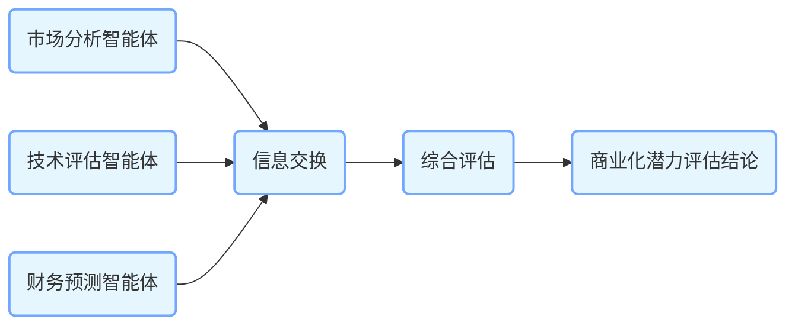

# AI多智能体如何提升对新兴技术商业化潜力的评估

> 关键词：AI多智能体、新兴技术、商业化潜力评估、智能决策、协同计算

> 摘要：本文聚焦于AI多智能体在提升新兴技术商业化潜力评估方面的应用。随着科技的快速发展，新兴技术不断涌现，准确评估其商业化潜力成为关键问题。AI多智能体凭借其分布式、协同性等特点，为新兴技术商业化潜力评估提供了新的思路和方法。文章深入探讨了AI多智能体的核心概念与联系、核心算法原理、数学模型等内容，并通过项目实战展示其应用，分析实际应用场景，推荐相关工具和资源，最后总结未来发展趋势与挑战，旨在为相关领域的研究和实践提供全面且深入的参考。

## 1. 背景介绍 
### 1.1 目的和范围
在当今快速发展的科技时代，新兴技术如人工智能、区块链、量子计算等不断涌现。这些新兴技术具有巨大的发展潜力，但要将其成功商业化并非易事。准确评估新兴技术的商业化潜力对于投资者、企业和政策制定者来说至关重要。本文章的目的在于探讨AI多智能体如何提升对新兴技术商业化潜力的评估，范围涵盖AI多智能体的基本原理、相关算法、数学模型以及实际应用等方面，旨在为相关领域的研究和实践提供理论支持和实践指导。

### 1.2 预期读者
本文预期读者包括对新兴技术商业化潜力评估感兴趣的研究人员、投资者、企业管理者、政策制定者以及相关领域的技术爱好者。研究人员可以从本文中获取关于AI多智能体在新兴技术评估方面的前沿理论和研究方法；投资者可以借助文中的方法和案例，更准确地评估新兴技术的投资价值；企业管理者可以利用相关知识优化企业的技术创新和商业化战略；政策制定者可以根据本文的研究成果制定更合理的科技政策；技术爱好者则可以通过本文了解AI多智能体的应用场景和实际价值。

### 1.3 文档结构概述
本文将按照以下结构展开：首先介绍AI多智能体和新兴技术商业化潜力评估的背景知识；接着阐述AI多智能体的核心概念与联系，包括其原理和架构；然后详细讲解核心算法原理及具体操作步骤，并给出相应的Python源代码；之后介绍数学模型和公式，并通过举例说明其应用；再通过项目实战展示AI多智能体在新兴技术商业化潜力评估中的具体应用；分析实际应用场景；推荐相关的工具和资源；最后总结未来发展趋势与挑战，并提供常见问题与解答以及扩展阅读和参考资料。

### 1.4 术语表
#### 1.4.1 核心术语定义
- **AI多智能体（AI Multi - Agent）**：由多个智能体组成的系统，每个智能体具有一定的自主决策能力，能够感知环境、与其他智能体进行交互，并根据自身的目标和规则采取行动，以实现系统的整体目标。
- **新兴技术（Emerging Technology）**：指那些处于发展初期，但具有巨大发展潜力和应用前景的技术，如人工智能、区块链、物联网等。
- **商业化潜力（Commercialization Potential）**：指一项技术在市场上实现商业成功的可能性和潜力，包括市场需求、竞争优势、盈利能力等多个方面。

#### 1.4.2 相关概念解释
- **智能体（Agent）**：在AI领域，智能体是指能够自主感知环境、进行决策并采取行动的实体。它可以是软件程序、机器人或其他具有智能行为的系统。
- **分布式系统（Distributed System）**：由多个独立的计算单元组成的系统，这些计算单元通过网络进行通信和协作，共同完成一个或多个任务。AI多智能体系统通常采用分布式架构，以提高系统的灵活性和可扩展性。
- **协同计算（Collaborative Computing）**：指多个计算单元通过协作的方式共同完成一个任务的计算模式。在AI多智能体系统中，智能体之间通过协同计算来实现信息共享、决策优化等功能。

#### 1.4.3 缩略词列表
- **AI**：Artificial Intelligence（人工智能）
- **MAS**：Multi - Agent System（多智能体系统）

## 2. 核心概念与联系 
### 2.1 AI多智能体的基本原理
AI多智能体系统由多个智能体组成，每个智能体都有自己的感知器、决策器和执行器。感知器用于感知环境信息，决策器根据感知到的信息和自身的目标、规则进行决策，执行器则根据决策结果采取相应的行动。智能体之间通过通信机制进行信息交换和协作，以实现系统的整体目标。

例如，在一个新兴技术商业化潜力评估的多智能体系统中，可能包括市场分析智能体、技术评估智能体、财务预测智能体等。市场分析智能体负责收集和分析市场需求、竞争态势等信息；技术评估智能体负责评估新兴技术的技术成熟度、创新性等；财务预测智能体则根据市场和技术信息预测新兴技术的盈利能力和投资回报率。这些智能体通过相互协作，共同完成对新兴技术商业化潜力的评估。

### 2.2 AI多智能体的架构
AI多智能体系统的架构通常可以分为集中式架构、分布式架构和混合式架构。

- **集中式架构**：在集中式架构中，有一个中央控制单元负责协调和管理所有智能体的行为。智能体将感知到的信息发送给中央控制单元，中央控制单元进行决策并向智能体发送指令。这种架构的优点是易于实现和管理，缺点是中央控制单元可能成为系统的瓶颈，并且缺乏灵活性和可扩展性。
- **分布式架构**：在分布式架构中，智能体之间通过网络进行通信和协作，没有中央控制单元。每个智能体都可以自主决策和行动，并与其他智能体进行信息交换和协作。这种架构的优点是具有较高的灵活性和可扩展性，缺点是系统的协调和管理难度较大。
- **混合式架构**：混合式架构结合了集中式架构和分布式架构的优点，既有中央控制单元进行宏观协调和管理，又允许智能体之间进行自主的通信和协作。这种架构在实际应用中较为常见。

### 2.3 核心概念的联系
AI多智能体与新兴技术商业化潜力评估之间存在着密切的联系。AI多智能体可以通过分布式感知和协同计算，收集和分析大量的市场、技术、财务等信息，从而更全面、准确地评估新兴技术的商业化潜力。同时，新兴技术的发展也为AI多智能体的应用提供了更广阔的空间和更丰富的数据源。例如，物联网技术的发展使得智能体可以更方便地感知环境信息；区块链技术的应用可以提高智能体之间信息交换的安全性和可信度。

### 2.4 文本示意图
AI多智能体在新兴技术商业化潜力评估中的应用可以用以下文本示意图表示：

AI多智能体系统由多个智能体组成，包括市场分析智能体、技术评估智能体、财务预测智能体等。这些智能体通过通信机制进行信息交换和协作。市场分析智能体收集市场需求、竞争态势等信息；技术评估智能体评估新兴技术的技术成熟度、创新性等；财务预测智能体根据市场和技术信息预测新兴技术的盈利能力和投资回报率。最后，这些智能体的评估结果综合起来，得到对新兴技术商业化潜力的评估结论。

### 2.5 Mermaid流程图


## 3. 核心算法原理 & 具体操作步骤 
### 3.1 核心算法原理
在AI多智能体系统中，常用的算法包括强化学习算法、博弈论算法、群体智能算法等。下面以强化学习算法为例，介绍其在新兴技术商业化潜力评估中的应用原理。

强化学习是一种通过智能体与环境进行交互来学习最优策略的机器学习方法。在新兴技术商业化潜力评估中，智能体可以将新兴技术的商业化过程看作一个环境，通过不断地尝试不同的评估策略，并根据环境的反馈（如评估结果的准确性、投资回报率等）来调整自己的策略，以实现对新兴技术商业化潜力的最优评估。

### 3.2 具体操作步骤
#### 3.2.1 定义智能体和环境
- **智能体**：在新兴技术商业化潜力评估中，智能体可以是一个或多个评估模型，每个智能体具有自己的状态、动作和奖励函数。
- **环境**：环境包括新兴技术的相关信息，如技术特点、市场需求、竞争态势等，以及评估结果的反馈信息。

#### 3.2.2 初始化智能体的策略
智能体的策略可以初始化为随机策略，即智能体在每个状态下随机选择一个动作。

#### 3.2.3 智能体与环境进行交互
智能体根据当前的状态选择一个动作，并将该动作应用于环境。环境根据智能体的动作给出相应的反馈，即奖励值。智能体根据奖励值更新自己的策略，以提高未来的奖励值。

#### 3.2.4 重复步骤3，直到满足终止条件
终止条件可以是达到最大迭代次数、评估结果收敛等。

### 3.3 Python源代码实现
```python
import numpy as np

# 定义环境类
class TechnologyCommercializationEnv:
    def __init__(self):
        # 初始化环境状态
        self.state = np.random.rand(10)  # 假设状态是一个10维的向量
        self.max_steps = 100
        self.current_step = 0

    def reset(self):
        # 重置环境状态
        self.state = np.random.rand(10)
        self.current_step = 0
        return self.state

    def step(self, action):
        # 智能体采取动作，环境给出反馈
        # 这里简单模拟奖励值的计算
        reward = np.sum(self.state * action)
        self.current_step += 1
        done = self.current_step >= self.max_steps
        # 更新环境状态
        self.state = self.state + action * 0.1
        return self.state, reward, done, {}

# 定义智能体类
class Agent:
    def __init__(self, state_size, action_size):
        # 初始化智能体的策略
        self.state_size = state_size
        self.action_size = action_size
        self.q_table = np.zeros((state_size, action_size))
        self.learning_rate = 0.1
        self.discount_factor = 0.9
        self.epsilon = 0.1

    def act(self, state):
        # 根据当前状态选择动作
        if np.random.uniform(0, 1) < self.epsilon:
            action = np.random.choice(self.action_size)
        else:
            action = np.argmax(self.q_table[state])
        return action

    def update(self, state, action, reward, next_state):
        # 根据奖励值更新智能体的策略
        target = reward + self.discount_factor * np.max(self.q_table[next_state])
        self.q_table[state, action] = (1 - self.learning_rate) * self.q_table[state, action] + self.learning_rate * target

# 主程序
if __name__ == "__main__":
    env = TechnologyCommercializationEnv()
    state_size = 10  # 假设状态空间大小为10
    action_size = 5  # 假设动作空间大小为5
    agent = Agent(state_size, action_size)

    num_episodes = 1000
    for episode in range(num_episodes):
        state = env.reset()
        done = False
        total_reward = 0
        while not done:
            action = agent.act(state)
            next_state, reward, done, _ = env.step(action)
            agent.update(state, action, reward, next_state)
            state = next_state
            total_reward += reward
        print(f"Episode {episode}: Total Reward = {total_reward}")
```

### 3.4 代码解释
- **TechnologyCommercializationEnv类**：表示新兴技术商业化潜力评估的环境。`reset`方法用于重置环境状态，`step`方法用于智能体采取动作后环境给出反馈，包括下一个状态、奖励值、是否终止等信息。
- **Agent类**：表示智能体。`act`方法根据当前状态选择动作，采用了epsilon - greedy策略；`update`方法根据奖励值更新智能体的Q表，以提高未来的奖励值。
- **主程序**：初始化环境和智能体，进行多个回合的训练，每个回合中智能体与环境进行交互，更新策略，并记录总奖励值。

## 4. 数学模型和公式 & 详细讲解 & 举例说明 
### 4.1 强化学习的数学模型
强化学习的数学模型可以用马尔可夫决策过程（Markov Decision Process, MDP）来描述。一个MDP由以下几个部分组成：

- **状态空间（State Space）**：用 $S$ 表示，是所有可能状态的集合。
- **动作空间（Action Space）**：用 $A$ 表示，是所有可能动作的集合。
- **状态转移概率（State Transition Probability）**：用 $P(s'|s,a)$ 表示，是在状态 $s$ 下采取动作 $a$ 后转移到状态 $s'$ 的概率。
- **奖励函数（Reward Function）**：用 $R(s,a,s')$ 表示，是在状态 $s$ 下采取动作 $a$ 后转移到状态 $s'$ 所获得的奖励值。
- **折扣因子（Discount Factor）**：用 $\gamma$ 表示，取值范围为 $[0,1]$，用于权衡当前奖励和未来奖励的重要性。

### 4.2 价值函数和Q函数
- **价值函数（Value Function）**：用 $V(s)$ 表示，是从状态 $s$ 开始，遵循某个策略 $\pi$ 所能获得的期望累积折扣奖励值。其数学公式为：
$$V^{\pi}(s) = \mathbb{E}_{\pi}\left[\sum_{t=0}^{\infty}\gamma^{t}R_{t+1}|S_{0}=s\right]$$
其中，$\mathbb{E}_{\pi}$ 表示在策略 $\pi$ 下的期望，$R_{t+1}$ 是在时间步 $t + 1$ 获得的奖励值，$S_{0}$ 是初始状态。

- **Q函数（Q - Function）**：用 $Q(s,a)$ 表示，是在状态 $s$ 下采取动作 $a$，遵循某个策略 $\pi$ 所能获得的期望累积折扣奖励值。其数学公式为：
$$Q^{\pi}(s,a) = \mathbb{E}_{\pi}\left[\sum_{t=0}^{\infty}\gamma^{t}R_{t+1}|S_{0}=s,A_{0}=a\right]$$
其中，$A_{0}$ 是初始动作。

### 4.3 Q学习算法的更新公式
Q学习算法是一种无模型的强化学习算法，其Q函数的更新公式为：
$$Q(s,a) \leftarrow Q(s,a) + \alpha\left[R(s,a,s')+\gamma\max_{a'}Q(s',a') - Q(s,a)\right]$$
其中，$\alpha$ 是学习率，$R(s,a,s')$ 是在状态 $s$ 下采取动作 $a$ 后转移到状态 $s'$ 所获得的奖励值，$\gamma$ 是折扣因子，$\max_{a'}Q(s',a')$ 是在状态 $s'$ 下采取最优动作所能获得的Q值。

### 4.4 举例说明
假设一个简单的新兴技术商业化潜力评估场景，状态空间 $S = \{s_1,s_2\}$，动作空间 $A = \{a_1,a_2\}$，初始Q表如下：

| 状态 | $a_1$ | $a_2$ |
|------|-------|-------|
| $s_1$ | 0 | 0 |
| $s_2$ | 0 | 0 |

学习率 $\alpha = 0.1$，折扣因子 $\gamma = 0.9$。

在状态 $s_1$ 下采取动作 $a_1$，转移到状态 $s_2$，获得奖励值 $R(s_1,a_1,s_2) = 1$。根据Q学习算法的更新公式，$Q(s_1,a_1)$ 的更新过程如下：

首先，计算 $\max_{a'}Q(s_2,a')$，由于初始Q表中 $Q(s_2,a_1) = Q(s_2,a_2) = 0$，所以 $\max_{a'}Q(s_2,a') = 0$。

然后，更新 $Q(s_1,a_1)$：
$$Q(s_1,a_1) \leftarrow Q(s_1,a_1) + \alpha\left[R(s_1,a_1,s_2)+\gamma\max_{a'}Q(s_2,a') - Q(s_1,a_1)\right]$$
$$Q(s_1,a_1) \leftarrow 0 + 0.1\times(1 + 0.9\times0 - 0) = 0.1$$

更新后的Q表如下：

| 状态 | $a_1$ | $a_2$ |
|------|-------|-------|
| $s_1$ | 0.1 | 0 |
| $s_2$ | 0 | 0 |

## 5. 项目实战：代码实际案例和详细解释说明 
### 5.1 开发环境搭建
#### 5.1.1 安装Python
首先，需要安装Python编程语言。可以从Python官方网站（https://www.python.org/downloads/） 下载适合自己操作系统的Python版本，并按照安装向导进行安装。

#### 5.1.2 安装必要的库
在本项目中，需要使用`numpy`库进行数值计算。可以使用以下命令安装`numpy`库：
```sh
pip install numpy
```

### 5.2 源代码详细实现和代码解读
```python
import numpy as np

# 定义环境类
class TechnologyCommercializationEnv:
    def __init__(self):
        # 初始化环境状态
        self.state = np.random.rand(10)  # 假设状态是一个10维的向量
        self.max_steps = 100
        self.current_step = 0

    def reset(self):
        # 重置环境状态
        self.state = np.random.rand(10)
        self.current_step = 0
        return self.state

    def step(self, action):
        # 智能体采取动作，环境给出反馈
        # 这里简单模拟奖励值的计算
        reward = np.sum(self.state * action)
        self.current_step += 1
        done = self.current_step >= self.max_steps
        # 更新环境状态
        self.state = self.state + action * 0.1
        return self.state, reward, done, {}

# 定义智能体类
class Agent:
    def __init__(self, state_size, action_size):
        # 初始化智能体的策略
        self.state_size = state_size
        self.action_size = action_size
        self.q_table = np.zeros((state_size, action_size))
        self.learning_rate = 0.1
        self.discount_factor = 0.9
        self.epsilon = 0.1

    def act(self, state):
        # 根据当前状态选择动作
        if np.random.uniform(0, 1) < self.epsilon:
            action = np.random.choice(self.action_size)
        else:
            action = np.argmax(self.q_table[state])
        return action

    def update(self, state, action, reward, next_state):
        # 根据奖励值更新智能体的策略
        target = reward + self.discount_factor * np.max(self.q_table[next_state])
        self.q_table[state, action] = (1 - self.learning_rate) * self.q_table[state, action] + self.learning_rate * target

# 主程序
if __name__ == "__main__":
    env = TechnologyCommercializationEnv()
    state_size = 10  # 假设状态空间大小为10
    action_size = 5  # 假设动作空间大小为5
    agent = Agent(state_size, action_size)

    num_episodes = 1000
    for episode in range(num_episodes):
        state = env.reset()
        done = False
        total_reward = 0
        while not done:
            action = agent.act(state)
            next_state, reward, done, _ = env.step(action)
            agent.update(state, action, reward, next_state)
            state = next_state
            total_reward += reward
        print(f"Episode {episode}: Total Reward = {total_reward}")
```

### 5.3 代码解读与分析
#### 5.3.1 环境类（TechnologyCommercializationEnv）
- `__init__`方法：初始化环境状态，设置最大步数和当前步数。
- `reset`方法：重置环境状态，将当前步数归零，并返回重置后的状态。
- `step`方法：智能体采取动作后，环境根据动作计算奖励值，更新当前步数，判断是否终止，并更新环境状态。

#### 5.3.2 智能体类（Agent）
- `__init__`方法：初始化智能体的状态空间大小、动作空间大小、Q表、学习率、折扣因子和epsilon值。
- `act`方法：根据当前状态选择动作，采用epsilon - greedy策略，以一定的概率随机选择动作，否则选择Q值最大的动作。
- `update`方法：根据奖励值更新智能体的Q表，使用Q学习算法的更新公式。

#### 5.3.3 主程序
- 初始化环境和智能体。
- 进行多个回合的训练，每个回合中智能体与环境进行交互，更新策略，并记录总奖励值。

通过观察总奖励值的变化，可以评估智能体的学习效果。如果总奖励值随着回合数的增加而逐渐增加，说明智能体正在学习到更优的策略。

## 6. 实际应用场景 
### 6.1 投资决策
在投资领域，投资者需要评估新兴技术的商业化潜力，以决定是否进行投资。AI多智能体可以通过收集和分析市场、技术、财务等多方面的信息，为投资者提供更准确的评估结果。例如，市场分析智能体可以分析市场需求、竞争态势等信息，技术评估智能体可以评估新兴技术的技术成熟度、创新性等，财务预测智能体可以预测新兴技术的盈利能力和投资回报率。投资者可以根据这些评估结果，做出更明智的投资决策。

### 6.2 企业战略规划
企业在制定战略规划时，需要考虑新兴技术的发展趋势和商业化潜力。AI多智能体可以帮助企业评估不同新兴技术的商业化潜力，为企业的技术创新和市场拓展提供决策支持。例如，企业可以利用AI多智能体评估不同新兴技术的市场需求、竞争优势、技术风险等，从而选择最适合企业发展的技术方向。

### 6.3 政策制定
政策制定者需要制定相关政策来促进新兴技术的发展和商业化。AI多智能体可以为政策制定者提供更全面、准确的信息，帮助他们制定更合理的政策。例如，通过分析不同新兴技术的商业化潜力、社会影响等，政策制定者可以确定重点扶持的技术领域，制定相应的财政、税收、人才等政策，以推动新兴技术的发展和商业化。

### 6.4 技术研发管理
在技术研发过程中，企业需要评估研发项目的商业化潜力，以合理分配资源。AI多智能体可以通过对研发项目的技术、市场、财务等方面进行评估，为企业的研发管理提供决策支持。例如，对于商业化潜力较大的研发项目，企业可以加大资源投入；对于商业化潜力较小的研发项目，企业可以调整研发方向或减少资源投入。

## 7. 工具和资源推荐
### 7.1 学习资源推荐
#### 7.1.1 书籍推荐
- 《人工智能：一种现代的方法》（Artificial Intelligence: A Modern Approach）：这是一本经典的人工智能教材，涵盖了人工智能的各个领域，包括多智能体系统、强化学习等内容。
- 《强化学习：原理与Python实现》：该书详细介绍了强化学习的基本原理和算法，并通过Python代码实现了多个强化学习案例，适合初学者学习。
- 《多智能体系统》（Multi - Agent Systems）：专门介绍多智能体系统的理论和应用，对多智能体系统的架构、通信、协作等方面进行了深入探讨。

#### 7.1.2 在线课程
- Coursera上的“人工智能基础”课程：该课程由知名高校的教授授课，涵盖了人工智能的基本概念、算法和应用，包括多智能体系统和强化学习的相关内容。
- edX上的“强化学习”课程：该课程系统地介绍了强化学习的理论和算法，通过案例分析和编程实践帮助学员掌握强化学习的应用。
- 中国大学MOOC上的“人工智能导论”课程：国内高校推出的人工智能入门课程，对多智能体系统等前沿技术进行了介绍。

#### 7.1.3 技术博客和网站
- Medium上的AI相关博客：Medium上有很多关于人工智能、多智能体系统、强化学习等方面的优质博客文章，作者来自全球各地的科研人员和从业者。
- arXiv.org：一个开放的学术预印本平台，提供了大量关于人工智能、多智能体系统等领域的最新研究成果。
- AI Stack Exchange：一个人工智能领域的问答社区，用户可以在上面提问、回答问题，获取关于多智能体系统等技术的专业知识。

### 7.2 开发工具框架推荐
#### 7.2.1 IDE和编辑器
- PyCharm：一款专业的Python集成开发环境，具有代码编辑、调试、版本控制等功能，适合Python开发。
- Visual Studio Code：一款轻量级的代码编辑器，支持多种编程语言，通过安装Python扩展可以方便地进行Python开发。

#### 7.2.2 调试和性能分析工具
- pdb：Python自带的调试器，可以帮助开发者调试Python代码，定位问题。
- cProfile：Python的性能分析工具，可以分析代码的性能瓶颈，帮助开发者优化代码。

#### 7.2.3 相关框架和库
- OpenAI Gym：一个用于开发和比较强化学习算法的工具包，提供了多种环境和基准测试，方便开发者进行强化学习实验。
- Stable Baselines：一个基于TensorFlow的强化学习库，提供了多种预训练的强化学习算法，方便开发者快速实现强化学习模型。
- Mesa：一个用于开发多智能体系统的Python库，提供了多智能体系统的基本框架和工具，方便开发者实现多智能体系统的开发。

### 7.3 相关论文著作推荐
#### 7.3.1 经典论文
- “Reinforcement Learning: A Survey”：这是一篇关于强化学习的经典综述论文，对强化学习的发展历程、基本原理、算法等进行了全面的介绍。
- “Multi - Agent Systems: A Modern Approach to Distributed Artificial Intelligence”：该论文对多智能体系统的理论和应用进行了深入探讨，是多智能体系统领域的经典文献。

#### 7.3.2 最新研究成果
- 在顶级人工智能会议（如AAAI、IJCAI、NeurIPS等）上发表的关于多智能体系统、强化学习在新兴技术评估中应用的论文，这些论文反映了该领域的最新研究动态和技术趋势。
- 在知名学术期刊（如Journal of Artificial Intelligence Research、Artificial Intelligence等）上发表的相关研究论文。

#### 7.3.3 应用案例分析
- 一些关于AI多智能体在投资决策、企业战略规划等实际应用场景中的案例分析报告，这些报告可以帮助读者更好地理解AI多智能体在新兴技术商业化潜力评估中的应用。

## 8. 总结：未来发展趋势与挑战
### 8.1 未来发展趋势
#### 8.1.1 与其他技术的融合
AI多智能体将与区块链、物联网、大数据等技术深度融合，进一步提升对新兴技术商业化潜力评估的准确性和可靠性。例如，区块链技术可以提高智能体之间信息交换的安全性和可信度；物联网技术可以为智能体提供更丰富的环境信息；大数据技术可以帮助智能体更好地分析和处理海量数据。

#### 8.1.2 智能化和自动化程度的提高
随着人工智能技术的不断发展，AI多智能体的智能化和自动化程度将不断提高。智能体将能够自主学习、自主决策，并且能够更好地适应复杂多变的环境。例如，智能体可以自动调整评估策略，以适应不同新兴技术的特点和市场变化。

#### 8.1.3 应用领域的拓展
AI多智能体在新兴技术商业化潜力评估中的应用领域将不断拓展，不仅局限于投资、企业战略规划等领域，还将应用于医疗、教育、交通等更多领域。例如，在医疗领域，AI多智能体可以评估新兴医疗技术的商业化潜力，为医疗企业的研发和投资决策提供支持。

### 8.2 挑战
#### 8.2.1 数据质量和隐私问题
AI多智能体在评估新兴技术商业化潜力时需要大量的数据支持，但数据质量和隐私问题是一个挑战。低质量的数据可能导致评估结果不准确，而数据隐私问题则可能影响用户的信任和数据的可用性。因此，需要采取有效的数据管理和隐私保护措施，确保数据的质量和安全。

#### 8.2.2 智能体之间的协作和协调问题
在AI多智能体系统中，智能体之间的协作和协调是一个关键问题。由于智能体具有一定的自主性，可能会出现智能体之间的冲突和不协调的情况。因此，需要研究有效的协作和协调机制，确保智能体之间能够高效地协作，实现系统的整体目标。

#### 8.2.3 算法的可解释性和可靠性问题
AI多智能体系统中使用的一些算法（如深度学习算法、强化学习算法等）具有较高的复杂性，其决策过程往往难以解释。这可能导致用户对评估结果的信任度降低。此外，算法的可靠性也是一个问题，在复杂多变的环境中，算法可能会出现错误或不稳定的情况。因此，需要研究算法的可解释性和可靠性，提高用户对评估结果的信任度。

## 9. 附录：常见问题与解答
### 9.1 AI多智能体系统的开发难度大吗？
AI多智能体系统的开发难度相对较大，需要掌握人工智能、分布式系统、算法设计等多方面的知识。但是，随着相关技术的发展和开发工具的不断完善，开发难度也在逐渐降低。可以通过学习相关的知识和使用现有的开发框架来降低开发难度。

### 9.2 如何选择适合的智能体算法？
选择适合的智能体算法需要考虑多个因素，如问题的特点、数据的规模、计算资源等。例如，如果问题具有明确的目标和规则，可以选择基于规则的算法；如果问题需要智能体通过与环境进行交互来学习最优策略，可以选择强化学习算法。在选择算法时，还可以参考相关的研究文献和实践经验。

### 9.3 AI多智能体系统在实际应用中存在哪些风险？
AI多智能体系统在实际应用中可能存在数据安全风险、算法错误风险、智能体之间的冲突风险等。为了降低这些风险，需要采取有效的数据安全措施、进行算法的验证和测试、设计合理的协作和协调机制等。

### 9.4 如何评估AI多智能体系统的性能？
可以从多个方面评估AI多智能体系统的性能，如评估结果的准确性、智能体之间的协作效率、系统的可扩展性等。可以通过实验和模拟的方法，比较不同系统或不同算法的性能指标，以评估系统的性能。

## 10. 扩展阅读 & 参考资料
### 10.1 扩展阅读
- 《人工智能时代的多智能体系统》：深入探讨了多智能体系统在人工智能时代的发展和应用。
- 《新兴技术商业化之路》：介绍了新兴技术商业化的过程和方法，对理解新兴技术商业化潜力评估有一定的帮助。

### 10.2 参考资料
- 相关的学术论文和研究报告，如在IEEE、ACM等学术会议和期刊上发表的关于AI多智能体、新兴技术商业化潜力评估的论文。
- 行业报告和统计数据，如市场研究机构发布的关于新兴技术市场的报告。
- 相关的开源项目和代码库，如在GitHub上的多智能体系统和强化学习相关的开源项目。