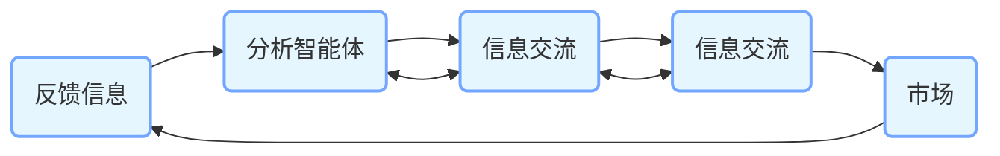

# AI多智能体系统在价值投资中的竞争对手分析

> 关键词：AI多智能体系统、价值投资、竞争对手分析、金融科技、投资策略、人工智能、市场竞争

> 摘要：本文聚焦于AI多智能体系统在价值投资领域的应用，深入探讨该领域中的竞争对手分析。首先介绍了相关背景知识，包括目的、预期读者等内容。接着阐述核心概念与联系，分析核心算法原理及操作步骤，同时给出数学模型和公式。通过项目实战案例详细解释代码实现与解读。探讨了AI多智能体系统在价值投资中的实际应用场景，推荐了相关工具和资源。最后总结未来发展趋势与挑战，解答常见问题并提供扩展阅读和参考资料，旨在全面剖析AI多智能体系统在价值投资中竞争对手分析的相关内容，为投资者和研究者提供有价值的参考。

## 1. 背景介绍 
### 1.1 目的和范围
价值投资作为一种长期投资策略，旨在寻找被低估的资产并长期持有以获取价值回归带来的收益。随着人工智能技术的发展，AI多智能体系统逐渐被应用于价值投资领域，以更智能、高效地进行投资决策。本文的目的在于对AI多智能体系统在价值投资中的竞争对手进行全面分析，明确其在市场中的地位和竞争态势。范围涵盖了使用AI技术的各类投资机构、投资策略以及相关的智能投资系统等。

### 1.2 预期读者
本文预期读者包括金融投资领域的从业者，如基金经理、投资分析师等，他们可以通过本文了解AI多智能体系统在价值投资中的竞争情况，为投资决策提供参考；人工智能领域的研究者和开发者，能够从中获取关于多智能体系统在金融场景应用的竞争信息，推动技术的进一步发展；以及对价值投资和人工智能交叉领域感兴趣的学生和爱好者，帮助他们深入了解该领域的现状和发展趋势。

### 1.3 文档结构概述
本文首先介绍背景知识，让读者了解研究的目的、范围和预期读者。接着阐述核心概念与联系，明确AI多智能体系统和价值投资的相关概念及它们之间的关系。然后详细讲解核心算法原理和具体操作步骤，通过Python代码进行说明。随后给出数学模型和公式，并举例说明。通过项目实战案例，介绍开发环境搭建、源代码实现和代码解读。探讨实际应用场景，推荐相关工具和资源。最后总结未来发展趋势与挑战，解答常见问题并提供扩展阅读和参考资料。

### 1.4 术语表
#### 1.4.1 核心术语定义
- **AI多智能体系统**：由多个智能体组成的系统，每个智能体具有一定的自主性和智能性，能够感知环境、与其他智能体进行交互，并根据自身的目标和规则进行决策和行动。在价值投资中，智能体可以代表不同的投资策略、投资机构或市场参与者。
- **价值投资**：一种投资策略，基于对资产内在价值的评估，寻找被市场低估的资产并长期持有，等待资产价值回归以获取收益。
- **竞争对手分析**：对与目标主体在同一市场或领域中竞争的其他主体进行研究和评估的过程，包括分析竞争对手的优势、劣势、策略和市场地位等。

#### 1.4.2 相关概念解释
- **智能体**：具有一定智能和自主性的实体，能够感知环境、做出决策并采取行动。在AI多智能体系统中，智能体可以是软件程序、机器人或其他具有智能的设备。
- **市场效率**：市场价格反映资产内在价值的程度。在有效市场中，资产价格能够迅速、准确地反映所有可用信息，而在非有效市场中，资产价格可能偏离其内在价值，为价值投资提供机会。
- **投资组合**：由多种资产组成的集合，投资者通过合理配置资产来实现风险分散和收益最大化的目标。

#### 1.4.3 缩略词列表
- **AI**：Artificial Intelligence，人工智能
- **MAB**：Multi - Armed Bandit，多臂老虎机算法

## 2. 核心概念与联系 

### 核心概念原理
#### AI多智能体系统原理
AI多智能体系统基于分布式人工智能的思想，多个智能体在一个环境中协同工作。每个智能体具有自己的知识库、决策规则和目标。智能体通过感知环境获取信息，根据自身的规则和目标进行推理和决策，然后采取行动。智能体之间可以通过通信机制进行信息交换和协作，以实现共同的或各自的目标。例如，在价值投资中，不同的智能体可以代表不同的投资策略，如基本面分析策略、技术分析策略等。这些智能体可以根据市场信息和自身的规则进行投资决策，并且可以相互交流信息，共同优化投资组合。

#### 价值投资原理
价值投资的核心原理是基于资产的内在价值进行投资。资产的内在价值是由其未来现金流的现值决定的。价值投资者通过对公司的财务状况、行业前景、竞争优势等基本面因素进行分析，评估资产的内在价值。当市场价格低于资产的内在价值时，投资者认为该资产被低估，从而进行买入操作；当市场价格高于资产的内在价值时，投资者认为该资产被高估，从而进行卖出操作。价值投资强调长期投资，相信市场最终会纠正价格与价值的偏离。

### 架构的文本示意图
AI多智能体系统在价值投资中的架构可以描述如下：

系统由多个智能体组成，这些智能体包括数据收集智能体、分析智能体、决策智能体和执行智能体。数据收集智能体负责从各种数据源（如金融报表、新闻资讯、市场数据等）收集与投资相关的信息。分析智能体对收集到的数据进行处理和分析，运用各种分析方法（如基本面分析、技术分析、机器学习算法等）评估资产的价值和风险。决策智能体根据分析结果和自身的目标规则进行投资决策，如确定投资组合的构成、买卖时机等。执行智能体根据决策智能体的指令执行具体的投资操作，如买入或卖出股票。智能体之间通过通信机制进行信息传递和协作，以实现整个系统的高效运行。

### Mermaid流程图


该流程图展示了AI多智能体系统在价值投资中的工作流程。数据收集智能体收集信息后传递给分析智能体，分析智能体进行分析后将结果提供给决策智能体，决策智能体做出决策后由执行智能体执行操作。执行操作的结果反馈到市场，市场的变化信息又作为反馈信息回到数据收集智能体。同时，智能体之间存在信息交流，以实现协作和优化。

## 3. 核心算法原理 & 具体操作步骤 

### 核心算法原理
在AI多智能体系统应用于价值投资中，多臂老虎机（Multi - Armed Bandit，MAB）算法是一种常用的算法。多臂老虎机算法的核心思想是在探索（尝试不同的投资策略以发现更好的策略）和利用（选择当前已知的最优投资策略）之间进行平衡。

假设有 $n$ 个投资策略（相当于 $n$ 个臂），每个策略有一个未知的期望收益。在每一轮中，智能体需要选择一个策略进行投资，然后根据投资结果更新对每个策略的收益估计。

### Python源代码阐述
```python
import numpy as np

class MultiArmedBandit:
    def __init__(self, num_arms):
        self.num_arms = num_arms
        self.arm_counts = np.zeros(num_arms)  # 每个臂的选择次数
        self.arm_rewards = np.zeros(num_arms)  # 每个臂的累计收益

    def select_arm(self, epsilon):
        if np.random.uniform(0, 1) < epsilon:
            # 探索：随机选择一个臂
            return np.random.randint(0, self.num_arms)
        else:
            # 利用：选择平均收益最高的臂
            arm_averages = self.arm_rewards / (self.arm_counts + 1e-6)
            return np.argmax(arm_averages)

    def update(self, arm, reward):
        self.arm_counts[arm] += 1
        self.arm_rewards[arm] += reward

# 示例使用
num_arms = 5  # 假设有5个投资策略
mab = MultiArmedBandit(num_arms)
epsilon = 0.1  # 探索概率

for _ in range(100):
    arm = mab.select_arm(epsilon)
    # 模拟投资收益
    reward = np.random.normal(0, 1)  
    mab.update(arm, reward)

print("每个臂的选择次数:", mab.arm_counts)
print("每个臂的累计收益:", mab.arm_rewards)
```

### 具体操作步骤
1. **初始化**：创建一个 `MultiArmedBandit` 对象，指定投资策略的数量（臂的数量）。同时，初始化每个臂的选择次数和累计收益为 0。
2. **选择臂**：在每一轮中，根据探索概率 $\epsilon$ 决定是进行探索还是利用。如果随机数小于 $\epsilon$，则随机选择一个臂进行探索；否则，选择平均收益最高的臂进行利用。
3. **获取收益**：选择一个臂后，模拟投资操作并获取相应的收益。在实际应用中，收益可以是投资的实际回报。
4. **更新信息**：根据选择的臂和获取的收益，更新该臂的选择次数和累计收益。
5. **重复步骤2 - 4**：不断进行投资决策和更新，直到达到预定的轮数或满足其他终止条件。

## 4. 数学模型和公式 & 详细讲解 & 举例说明 

### 数学模型和公式
#### 多臂老虎机模型
设 $A$ 是所有投资策略（臂）的集合，$|A| = n$ 表示策略的数量。在第 $t$ 轮，智能体选择一个策略 $a_t \in A$ 进行投资，获得收益 $r_t$。

- **选择概率**：在 $\epsilon$-贪心算法中，选择策略 $a$ 的概率为：
$$
P(a_t = a) = 
\begin{cases}
\epsilon / n, & \text{探索阶段} \\
1 - \epsilon + \epsilon / n, & \text{如果 } a = \arg\max_{a' \in A} \bar{r}_{a'} \\
\epsilon / n, & \text{如果 } a \neq \arg\max_{a' \in A} \bar{r}_{a'}
\end{cases}
$$
其中，$\bar{r}_{a'}$ 是策略 $a'$ 的平均收益。

- **平均收益更新公式**：在第 $t$ 轮选择策略 $a_t$ 后，更新该策略的平均收益：
$$
\bar{r}_{a_t}^{(t)} = \frac{\bar{r}_{a_t}^{(t - 1)} \cdot N_{a_t}^{(t - 1)} + r_t}{N_{a_t}^{(t - 1)} + 1}
$$
其中，$\bar{r}_{a_t}^{(t)}$ 是第 $t$ 轮更新后策略 $a_t$ 的平均收益，$N_{a_t}^{(t - 1)}$ 是第 $t - 1$ 轮策略 $a_t$ 的选择次数。

### 详细讲解
- **选择概率公式**：$\epsilon$-贪心算法的核心思想是在探索和利用之间进行平衡。$\epsilon$ 是探索概率，当随机数小于 $\epsilon$ 时，智能体进行探索，随机选择一个策略，每个策略被选中的概率为 $\epsilon / n$。当随机数大于等于 $\epsilon$ 时，智能体进行利用，选择当前平均收益最高的策略，该策略被选中的概率为 $1 - \epsilon + \epsilon / n$，其他策略被选中的概率为 $\epsilon / n$。
- **平均收益更新公式**：平均收益的更新是基于增量更新的思想。每次选择一个策略并获得收益后，根据该策略之前的平均收益、选择次数和当前获得的收益，计算更新后的平均收益。

### 举例说明
假设有 3 个投资策略（$n = 3$），$\epsilon = 0.2$。在第 1 轮，随机数为 0.1，小于 $\epsilon$，则进行探索，随机选择策略 2。假设获得收益 $r_1 = 1$。此时，策略 2 的选择次数 $N_2^{(1)} = 1$，平均收益 $\bar{r}_2^{(1)} = 1$，其他策略的选择次数和平均收益仍为 0。

在第 2 轮，随机数为 0.3，大于 $\epsilon$，则进行利用。假设此时策略 2 的平均收益最高，则选择策略 2。假设获得收益 $r_2 = 2$。更新策略 2 的平均收益：
$$
\bar{r}_2^{(2)} = \frac{\bar{r}_2^{(1)} \cdot N_2^{(1)} + r_2}{N_2^{(1)} + 1} = \frac{1 \times 1 + 2}{1 + 1} = 1.5
$$
策略 2 的选择次数 $N_2^{(2)} = 2$。

## 5. 项目实战：代码实际案例和详细解释说明 

### 5.1  开发环境搭建
#### 安装Python
首先，确保你已经安装了 Python 环境。可以从 Python 官方网站（https://www.python.org/downloads/）下载并安装适合你操作系统的 Python 版本。建议安装 Python 3.6 及以上版本。

#### 安装必要的库
在项目中，我们需要使用 `numpy` 库进行数值计算。可以使用以下命令安装 `numpy`：
```sh
pip install numpy
```

### 5.2  源代码详细实现和代码解读
```python
import numpy as np

# 定义 AI 多智能体系统类
class AIAgentSystem:
    def __init__(self, num_agents, num_stocks, initial_funds):
        self.num_agents = num_agents  # 智能体数量
        self.num_stocks = num_stocks  # 股票数量
        self.initial_funds = initial_funds  # 初始资金
        self.agent_funds = np.full(num_agents, initial_funds)  # 每个智能体的资金
        self.agent_portfolios = np.zeros((num_agents, num_stocks))  # 每个智能体的投资组合

    def agent_decision(self, stock_prices):
        decisions = []
        for i in range(self.num_agents):
            # 简单的决策规则：如果股票价格低于均值则买入，高于均值则卖出
            mean_price = np.mean(stock_prices)
            agent_decision = []
            for j in range(self.num_stocks):
                if stock_prices[j] < mean_price:
                    if self.agent_funds[i] > stock_prices[j]:
                        self.agent_funds[i] -= stock_prices[j]
                        self.agent_portfolios[i][j] += 1
                        agent_decision.append(1)  # 买入
                    else:
                        agent_decision.append(0)  # 不操作
                elif stock_prices[j] > mean_price:
                    if self.agent_portfolios[i][j] > 0:
                        self.agent_funds[i] += stock_prices[j]
                        self.agent_portfolios[i][j] -= 1
                        agent_decision.append(-1)  # 卖出
                    else:
                        agent_decision.append(0)  # 不操作
                else:
                    agent_decision.append(0)  # 不操作
            decisions.append(agent_decision)
        return decisions

    def update_portfolios(self, decisions, stock_prices):
        for i in range(self.num_agents):
            for j in range(self.num_stocks):
                if decisions[i][j] == 1:
                    self.agent_funds[i] -= stock_prices[j]
                    self.agent_portfolios[i][j] += 1
                elif decisions[i][j] == -1:
                    self.agent_funds[i] += stock_prices[j]
                    self.agent_portfolios[i][j] -= 1

# 模拟市场数据
num_agents = 3
num_stocks = 5
initial_funds = 1000
stock_prices = np.random.uniform(10, 100, num_stocks)

# 创建 AI 多智能体系统对象
ai_system = AIAgentSystem(num_agents, num_stocks, initial_funds)

# 智能体决策
decisions = ai_system.agent_decision(stock_prices)

# 更新投资组合
ai_system.update_portfolios(decisions, stock_prices)

# 输出结果
print("每个智能体的资金:", ai_system.agent_funds)
print("每个智能体的投资组合:", ai_system.agent_portfolios)
```

### 5.3  代码解读与分析
#### 类的定义
- `AIAgentSystem` 类表示 AI 多智能体系统，包含智能体数量、股票数量、初始资金等属性，以及每个智能体的资金和投资组合。
#### 方法分析
- `__init__` 方法：初始化智能体系统的各种属性，将每个智能体的初始资金设置为相同的值，并将投资组合初始化为 0。
- `agent_decision` 方法：实现智能体的决策逻辑。对于每个智能体，根据股票价格与均值的比较结果进行决策。如果股票价格低于均值且智能体有足够资金，则买入；如果股票价格高于均值且智能体持有该股票，则卖出；否则不操作。
- `update_portfolios` 方法：根据智能体的决策更新投资组合和资金。如果决策为买入，则减少资金并增加股票持有量；如果决策为卖出，则增加资金并减少股票持有量。
#### 主程序分析
- 模拟市场数据，包括智能体数量、股票数量、初始资金和股票价格。
- 创建 `AIAgentSystem` 对象。
- 调用 `agent_decision` 方法进行决策。
- 调用 `update_portfolios` 方法更新投资组合。
- 输出每个智能体的资金和投资组合。

## 6. 实际应用场景 
### 投资机构决策支持
大型投资机构可以利用AI多智能体系统进行价值投资决策。不同的智能体可以代表不同的投资策略，如基本面分析策略、技术分析策略、量化投资策略等。这些智能体可以根据市场信息和自身的规则进行投资决策，并且可以相互协作和交流信息。投资机构可以根据智能体的决策结果，结合自身的风险偏好和投资目标，制定最终的投资组合。

### 个人投资者辅助
对于个人投资者来说，AI多智能体系统可以作为投资辅助工具。个人投资者可以通过该系统了解不同的投资策略和市场动态，获得投资建议。例如，系统可以根据投资者的风险偏好和投资目标，为其推荐适合的投资组合。同时，系统可以实时监测市场变化，提醒投资者进行调整投资组合。

### 风险管理
在价值投资中，风险管理至关重要。AI多智能体系统可以用于风险管理，通过多个智能体的协作和分析，评估投资组合的风险水平。例如，一些智能体可以负责监测市场风险因素，如宏观经济指标、行业竞争态势等；另一些智能体可以负责评估投资组合的风险暴露程度，如波动率、贝塔系数等。系统可以根据风险评估结果，及时调整投资组合，降低风险。

### 市场趋势预测
AI多智能体系统可以通过对大量市场数据的分析和学习，预测市场趋势。不同的智能体可以采用不同的分析方法和模型，如机器学习算法、时间序列分析等。这些智能体可以相互交流和验证预测结果，提高预测的准确性。投资者可以根据市场趋势预测结果，调整投资策略和投资组合。

## 7. 工具和资源推荐
### 7.1 学习资源推荐
#### 7.1.1 书籍推荐
- 《人工智能：一种现代的方法》：这本书是人工智能领域的经典教材，全面介绍了人工智能的基本概念、算法和应用。对于理解AI多智能体系统的原理和技术有很大帮助。
- 《价值投资：从格雷厄姆到巴菲特》：详细阐述了价值投资的理论和实践，是价值投资领域的权威著作。通过阅读这本书，可以深入了解价值投资的核心思想和方法。
- 《Python 数据分析实战》：介绍了使用 Python 进行数据分析的方法和技巧，对于在AI多智能体系统中处理和分析金融数据非常有用。

#### 7.1.2 在线课程
- Coursera 上的 “人工智能基础” 课程：由知名大学的教授授课，系统地介绍了人工智能的基础知识和算法。
- edX 上的 “价值投资原理” 课程：讲解了价值投资的原理和实践，通过案例分析帮助学习者掌握价值投资的方法。
- 网易云课堂上的 “Python 金融数据分析” 课程：专门针对金融数据分析，介绍了如何使用 Python 进行数据处理、分析和可视化。

#### 7.1.3 技术博客和网站
- Medium：上面有很多关于人工智能和金融科技的技术博客文章，作者来自不同的领域，可以了解到最新的研究成果和实践经验。
- Towards Data Science：专注于数据科学和人工智能领域，提供了很多高质量的技术文章和教程。
- 雪球网：是国内知名的投资交流社区，有很多价值投资者分享投资经验和观点，可以了解到市场动态和投资策略。

### 7.2 开发工具框架推荐
#### 7.2.1 IDE和编辑器
- PyCharm：是一款专业的 Python 集成开发环境，具有强大的代码编辑、调试和自动补全功能，适合开发 AI 多智能体系统。
- Jupyter Notebook：是一个交互式的开发环境，支持 Python 代码的实时运行和可视化展示，非常适合进行数据分析和模型实验。

#### 7.2.2 调试和性能分析工具
- PDB：Python 自带的调试器，可以帮助开发者调试代码，查找和解决问题。
- cProfile：Python 的性能分析工具，可以分析代码的运行时间和函数调用情况，帮助优化代码性能。

#### 7.2.3 相关框架和库
- NumPy：是 Python 的数值计算库，提供了高效的数组操作和数学函数，在 AI 多智能体系统中用于数据处理和计算。
- Pandas：是 Python 的数据处理库，提供了灵活的数据结构和数据操作方法，适合处理金融数据。
- Scikit - learn：是 Python 的机器学习库，提供了各种机器学习算法和工具，可用于构建智能体的决策模型。

### 7.3 相关论文著作推荐
#### 7.3.1 经典论文
- “Multi - Agent Systems: A Modern Approach to Distributed Artificial Intelligence”：介绍了多智能体系统的基本概念、模型和算法，是多智能体系统领域的经典论文。
- “The Intelligent Investor” by Benjamin Graham：是价值投资领域的经典著作，阐述了价值投资的基本原则和方法。

#### 7.3.2 最新研究成果
- 可以关注顶级学术会议如 AAAI（Association for the Advancement of Artificial Intelligence）、IJCAI（International Joint Conference on Artificial Intelligence）上关于 AI 多智能体系统在金融领域应用的研究论文，了解最新的研究成果和发展趋势。
- 金融学术期刊如 The Journal of Finance、The Review of Financial Studies 上也会发表关于价值投资和金融科技的研究论文。

#### 7.3.3 应用案例分析
- 一些知名投资机构的研究报告和案例分析，如桥水基金、贝莱德等，会分享他们在价值投资和人工智能应用方面的实践经验和成果。可以通过这些案例分析了解实际应用中的问题和解决方案。

## 8. 总结：未来发展趋势与挑战
### 未来发展趋势
#### 技术融合
AI多智能体系统将与其他前沿技术如区块链、物联网等深度融合。区块链技术可以提供更安全、透明的交易环境，保证智能体之间的信息交互和资产交易的可信性。物联网技术可以提供更丰富的市场数据，如企业的生产数据、物流数据等，帮助智能体更准确地评估资产的价值。

#### 个性化投资服务
随着人工智能技术的发展，AI多智能体系统可以根据投资者的个性化需求和风险偏好，提供更加定制化的投资服务。例如，系统可以为不同年龄段、不同收入水平的投资者制定不同的投资策略和投资组合。

#### 智能投顾普及
智能投顾将逐渐普及，成为投资者进行价值投资的重要工具。AI多智能体系统可以模拟专业投资顾问的决策过程，为投资者提供实时的投资建议和风险管理服务。

#### 跨市场、跨领域应用
AI多智能体系统将不仅仅应用于股票市场，还将扩展到债券市场、期货市场、外汇市场等其他金融市场。同时，也将应用于非金融领域，如房地产投资、创业投资等，实现跨市场、跨领域的价值投资。

### 挑战
#### 数据质量和隐私问题
AI多智能体系统的决策依赖于大量的市场数据，数据的质量直接影响决策的准确性。同时，金融数据涉及投资者的隐私和商业机密，如何保证数据的质量和隐私安全是一个重要的挑战。

#### 算法复杂度和可解释性
随着AI多智能体系统的复杂性增加，算法的复杂度也会相应提高。复杂的算法可能导致计算效率低下，并且难以解释决策的过程和结果。在价值投资中，投资者需要了解投资决策的依据，因此算法的可解释性是一个亟待解决的问题。

#### 市场不确定性和黑天鹅事件
金融市场具有高度的不确定性，黑天鹅事件时有发生。AI多智能体系统基于历史数据和模型进行决策，难以准确预测和应对黑天鹅事件。如何提高系统在市场不确定性下的适应性和鲁棒性是一个挑战。

#### 法律法规和监管问题
AI多智能体系统在价值投资中的应用涉及到一系列的法律法规和监管问题。例如，智能体的决策责任归属、算法的合规性等。如何制定相应的法律法规和监管政策，确保系统的合法、合规运行是一个重要的问题。

## 9. 附录：常见问题与解答
### 1. AI多智能体系统在价值投资中的准确性如何保证？
AI多智能体系统的准确性可以通过多种方式保证。首先，要保证数据的质量，收集准确、全面的市场数据。其次，选择合适的算法和模型，并进行充分的训练和优化。同时，多个智能体之间可以相互协作和验证，提高决策的准确性。此外，定期对系统进行评估和调整，根据市场变化及时优化算法和模型。

### 2. 如何解决AI多智能体系统中算法的可解释性问题？
可以采用一些可解释的机器学习算法，如决策树、线性回归等。这些算法的决策过程相对简单，容易解释。另外，可以通过可视化技术将算法的决策过程和结果直观地展示出来，帮助投资者理解。还可以对算法进行分解和分析，解释每个步骤的作用和影响。

### 3. AI多智能体系统在价值投资中如何应对市场不确定性？
可以采用多元化的投资策略，通过分散投资降低风险。同时，系统可以实时监测市场变化，及时调整投资组合。另外，可以引入风险评估和预警机制，当市场出现异常情况时，及时发出警报并采取相应的措施。还可以结合人类投资者的经验和判断，提高系统在不确定性下的决策能力。

### 4. AI多智能体系统在价值投资中的应用是否会取代人类投资者？
不会完全取代人类投资者。虽然AI多智能体系统具有高效、准确的决策能力，但人类投资者具有独特的优势，如直觉、经验和判断力。在价值投资中，人类投资者可以对系统的决策进行评估和调整，结合自己的经验和判断做出最终的投资决策。AI多智能体系统更多地是作为人类投资者的辅助工具，提高投资决策的效率和准确性。

## 10. 扩展阅读 & 参考资料
### 扩展阅读
- 《金融科技前沿：人工智能与区块链》：进一步介绍了人工智能和区块链在金融领域的应用，包括AI多智能体系统的相关内容。
- 《量化投资：策略与技术》：详细讲解了量化投资的策略和技术，对于理解AI多智能体系统在价值投资中的量化分析方法有帮助。
- 《金融市场学》：全面介绍了金融市场的基本概念、结构和运行机制，为理解AI多智能体系统在价值投资中的应用场景提供了基础。

### 参考资料
- 相关学术论文：在 IEEE Xplore、ACM Digital Library 等学术数据库中搜索关于 AI 多智能体系统和价值投资的学术论文。
- 行业报告：如麦肯锡、波士顿咨询等咨询公司发布的关于金融科技和投资领域的行业报告。
- 金融数据提供商：如 Wind、Bloomberg 等提供的金融数据和研究报告。