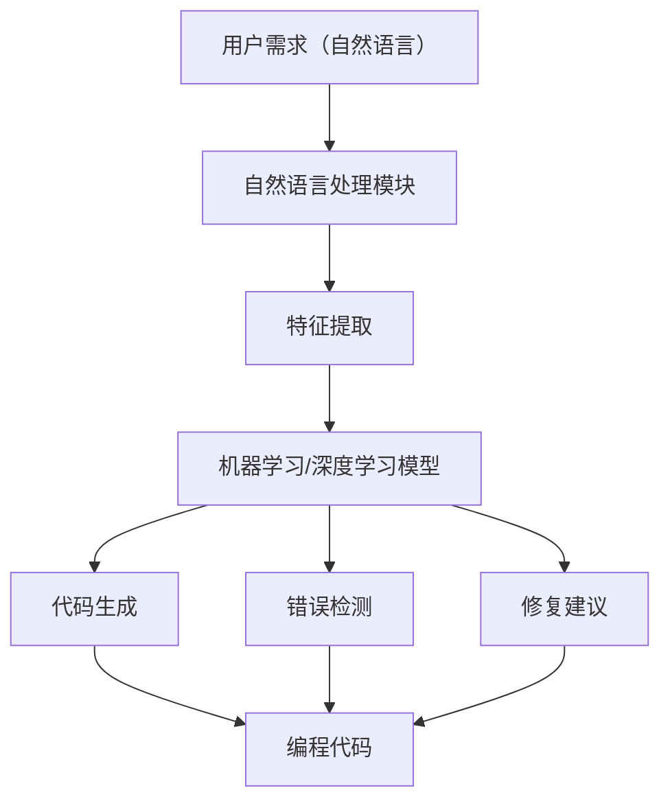

# AI如何推动编程行业的创新与变革

> 关键词：AI、编程行业、创新、变革、代码生成、智能调试、自动化测试

> 摘要：本文深入探讨了AI在编程行业中所起到的推动创新与变革的作用。首先介绍了相关背景，包括目的、预期读者等内容。接着阐述了AI与编程的核心概念及联系，详细讲解了AI在编程中涉及的核心算法原理与具体操作步骤，并给出了相应的数学模型和公式。通过项目实战展示了AI在编程中的实际应用，分析了实际应用场景。同时推荐了学习AI编程的工具和资源，最后总结了未来发展趋势与挑战，还设置了常见问题解答及扩展阅读参考资料，全面呈现了AI对编程行业创新与变革的影响。

## 1. 背景介绍 
### 1.1 目的和范围
本文章的目的在于全面且深入地剖析AI对编程行业创新与变革的推动作用。范围涵盖了AI在编程各个环节的应用，包括但不限于代码生成、智能调试、自动化测试等，同时探讨其背后的算法原理、数学模型以及实际应用场景等多个方面。通过对这些内容的研究，帮助读者清晰地了解AI与编程行业的融合现状以及未来发展趋势。

### 1.2 预期读者
本文预期读者包括广大的程序员、软件开发者、软件架构师、CTO等编程行业从业者，以及对AI和编程技术感兴趣的科研人员、学生等。对于编程从业者来说，希望能够从中获取到AI在编程实践中的具体应用方法和技术，为其工作带来新的思路和方法；对于科研人员和学生，期望能激发他们对相关领域的研究兴趣，了解前沿技术动态。

### 1.3 文档结构概述
本文将按照以下结构展开：首先介绍背景信息，让读者对文章的目的、读者群体和文档结构有一个初步的了解；接着阐述AI与编程的核心概念及联系，包括原理和架构的文本示意图以及Mermaid流程图；然后详细讲解AI在编程中涉及的核心算法原理和具体操作步骤，通过Python源代码进行说明；之后给出相关的数学模型和公式，并举例说明；通过项目实战展示AI在编程中的实际应用，包括开发环境搭建、源代码实现和代码解读；分析AI在编程行业的实际应用场景；推荐学习AI编程的工具和资源；总结未来发展趋势与挑战；设置常见问题解答及扩展阅读参考资料。

### 1.4 术语表
#### 1.4.1 核心术语定义
- **AI（Artificial Intelligence）**：即人工智能，是研究、开发用于模拟、延伸和扩展人的智能的理论、方法、技术及应用系统的一门新的技术科学。
- **编程（Programming）**：是编定程序的中文简称，就是让计算机代为解决某个问题，对某个计算体系规定一定的运算方式，使计算体系按照该计算方式运行，并最终得到相应结果的过程。
- **代码生成（Code Generation）**：指利用特定的工具或技术自动生成计算机程序代码的过程。
- **智能调试（Intelligent Debugging）**：借助AI技术对程序中的错误进行自动检测、定位和修复的过程。
- **自动化测试（Automated Testing）**：使用自动化测试工具来执行测试用例并自动验证测试结果的过程。

#### 1.4.2 相关概念解释
- **机器学习（Machine Learning）**：是一门多领域交叉学科，涉及概率论、统计学、逼近论、凸分析、算法复杂度理论等多门学科。它专门研究计算机怎样模拟或实现人类的学习行为，以获取新的知识或技能，重新组织已有的知识结构使之不断改善自身的性能。
- **深度学习（Deep Learning）**：是机器学习的一个分支领域，它是一种基于对数据进行表征学习的方法。深度学习通过构建具有很多层的神经网络模型，自动从大量数据中学习特征和模式。
- **自然语言处理（Natural Language Processing）**：是计算机科学领域与人工智能领域中的一个重要方向。它研究能实现人与计算机之间用自然语言进行有效通信的各种理论和方法。

#### 1.4.3 缩略词列表
- **ML（Machine Learning）**：机器学习
- **DL（Deep Learning）**：深度学习
- **NLP（Natural Language Processing）**：自然语言处理

## 2. 核心概念与联系 
### 核心概念原理
AI在编程行业的应用主要基于机器学习、深度学习和自然语言处理等技术。机器学习算法可以从大量的代码数据中学习模式和规律，从而实现代码的自动生成、错误检测等功能。深度学习通过构建深度神经网络，能够处理复杂的代码结构和语义信息，提高代码处理的准确性和效率。自然语言处理技术则使得程序员可以用自然语言与编程工具进行交互，降低编程的门槛。

例如，在代码生成方面，基于深度学习的语言模型可以学习大量的代码语料库，理解代码的语法和语义结构。当用户输入自然语言描述的需求时，模型可以根据学习到的知识生成相应的代码。在智能调试中，机器学习算法可以分析程序的运行日志和错误信息，通过模式匹配和异常检测来定位错误的位置，并给出可能的修复建议。

### 架构的文本示意图
```plaintext
用户需求（自然语言） -> 自然语言处理模块 -> 特征提取 -> 机器学习/深度学习模型 -> 代码生成/错误检测/修复建议 -> 编程代码
```
这个示意图展示了AI在编程中处理用户需求的基本流程。用户以自然语言表达自己的编程需求，自然语言处理模块将其转换为计算机能够理解的特征，然后机器学习或深度学习模型根据这些特征进行相应的处理，最终生成编程代码或提供错误检测和修复建议。

### Mermaid流程图


这个流程图更加直观地展示了AI在编程中的工作流程。用户的自然语言需求经过自然语言处理和特征提取后，进入机器学习或深度学习模型，模型根据需求进行代码生成、错误检测和提供修复建议，最终输出编程代码。

## 3. 核心算法原理 & 具体操作步骤 
### 核心算法原理
在AI辅助编程中，常见的算法包括循环神经网络（RNN）及其变体长短期记忆网络（LSTM）、门控循环单元（GRU），以及Transformer架构等。这里以Transformer架构为例进行讲解。

Transformer架构是一种基于自注意力机制的深度学习模型，它通过多头自注意力机制来捕捉序列中不同位置之间的依赖关系。自注意力机制的核心思想是计算序列中每个位置与其他位置的相关性，从而为每个位置分配不同的权重。

### 具体操作步骤及Python源代码阐述
以下是一个简单的基于Transformer架构的代码生成示例，使用PyTorch库实现：

```python
import torch
import torch.nn as nn
import torch.optim as optim

# 定义Transformer模型
class TransformerModel(nn.Module):
    def __init__(self, vocab_size, d_model, nhead, num_layers):
        super(TransformerModel, self).__init__()
        self.embedding = nn.Embedding(vocab_size, d_model)
        self.transformer_encoder = nn.TransformerEncoder(
            nn.TransformerEncoderLayer(d_model, nhead), num_layers
        )
        self.decoder = nn.Linear(d_model, vocab_size)

    def forward(self, src):
        src = self.embedding(src)
        src = src.permute(1, 0, 2)  # 调整维度以适应Transformer输入要求
        output = self.transformer_encoder(src)
        output = output.permute(1, 0, 2)  # 调整维度以适应后续处理
        output = self.decoder(output)
        return output

# 初始化模型参数
vocab_size = 1000  # 词汇表大小
d_model = 128  # 模型维度
nhead = 4  # 注意力头数
num_layers = 2  # 编码器层数

model = TransformerModel(vocab_size, d_model, nhead, num_layers)

# 定义损失函数和优化器
criterion = nn.CrossEntropyLoss()
optimizer = optim.Adam(model.parameters(), lr=0.001)

# 模拟训练数据
input_sequence = torch.randint(0, vocab_size, (32, 10))  # 32个样本，每个样本长度为10
target_sequence = torch.randint(0, vocab_size, (32, 10))

# 训练模型
num_epochs = 10
for epoch in range(num_epochs):
    optimizer.zero_grad()
    output = model(input_sequence)
    output = output.view(-1, vocab_size)
    target_sequence = target_sequence.view(-1)
    loss = criterion(output, target_sequence)
    loss.backward()
    optimizer.step()
    print(f'Epoch {epoch+1}/{num_epochs}, Loss: {loss.item()}')

# 生成代码示例
input_sample = torch.randint(0, vocab_size, (1, 5))
output_sample = model(input_sample)
predicted_sequence = torch.argmax(output_sample, dim=2)
print('Predicted sequence:', predicted_sequence)
```

### 代码解释
1. **模型定义**：`TransformerModel`类定义了一个基于Transformer架构的模型，包括嵌入层、Transformer编码器和线性解码器。
2. **初始化参数**：设置词汇表大小、模型维度、注意力头数和编码器层数等参数。
3. **损失函数和优化器**：使用交叉熵损失函数和Adam优化器进行模型训练。
4. **模拟训练数据**：生成随机的输入序列和目标序列作为训练数据。
5. **训练模型**：通过多个epoch进行模型训练，计算损失并更新模型参数。
6. **生成代码**：输入一个样本序列，模型输出预测的序列。

## 4. 数学模型和公式 & 详细讲解 & 举例说明 
### 自注意力机制的数学模型和公式
自注意力机制是Transformer架构的核心，其数学模型可以用以下公式表示：

$$Attention(Q, K, V) = softmax(\frac{QK^T}{\sqrt{d_k}})V$$

其中：
- $Q$ 是查询矩阵，形状为 $(n, d_k)$，$n$ 是序列长度，$d_k$ 是键的维度。
- $K$ 是键矩阵，形状为 $(m, d_k)$，$m$ 通常等于 $n$。
- $V$ 是值矩阵，形状为 $(m, d_v)$，$d_v$ 是值的维度。
- $\sqrt{d_k}$ 是缩放因子，用于防止点积结果过大。

### 详细讲解
自注意力机制的主要步骤如下：
1. **计算注意力分数**：$QK^T$ 计算查询矩阵 $Q$ 与键矩阵 $K$ 的转置的点积，得到注意力分数矩阵，形状为 $(n, m)$。
2. **缩放**：将注意力分数矩阵除以 $\sqrt{d_k}$，以防止点积结果过大。
3. **softmax操作**：对缩放后的注意力分数矩阵应用softmax函数，得到注意力权重矩阵，形状为 $(n, m)$，权重值在 $[0, 1]$ 之间且每行之和为1。
4. **加权求和**：将注意力权重矩阵与值矩阵 $V$ 相乘，得到最终的输出矩阵，形状为 $(n, d_v)$。

### 举例说明
假设我们有一个输入序列 $x = [x_1, x_2, x_3]$，每个元素的维度为 $d = 4$。我们将其分别映射到查询、键和值空间，得到 $Q$, $K$, $V$ 矩阵：

$$Q = \begin{bmatrix}
0.1 & 0.2 & 0.3 & 0.4 \\
0.5 & 0.6 & 0.7 & 0.8 \\
0.9 & 1.0 & 1.1 & 1.2
\end{bmatrix}$$

$$K = \begin{bmatrix}
0.2 & 0.3 & 0.4 & 0.5 \\
0.6 & 0.7 & 0.8 & 0.9 \\
1.0 & 1.1 & 1.2 & 1.3
\end{bmatrix}$$

$$V = \begin{bmatrix}
0.3 & 0.4 & 0.5 & 0.6 \\
0.7 & 0.8 & 0.9 & 1.0 \\
1.1 & 1.2 & 1.3 & 1.4
\end{bmatrix}$$

首先计算 $QK^T$：

$$QK^T = \begin{bmatrix}
0.1\times0.2 + 0.2\times0.6 + 0.3\times1.0 + 0.4\times1.1 & 0.1\times0.3 + 0.2\times0.7 + 0.3\times1.1 + 0.4\times1.2 & 0.1\times0.4 + 0.2\times0.8 + 0.3\times1.2 + 0.4\times1.3 \\
0.5\times0.2 + 0.6\times0.6 + 0.7\times1.0 + 0.8\times1.1 & 0.5\times0.3 + 0.6\times0.7 + 0.7\times1.1 + 0.8\times1.2 & 0.5\times0.4 + 0.6\times0.8 + 0.7\times1.2 + 0.8\times1.3 \\
0.9\times0.2 + 1.0\times0.6 + 1.1\times1.0 + 1.2\times1.1 & 0.9\times0.3 + 1.0\times0.7 + 1.1\times1.1 + 1.2\times1.2 & 0.9\times0.4 + 1.0\times0.8 + 1.1\times1.2 + 1.2\times1.3
\end{bmatrix}$$

然后进行缩放和softmax操作，最后与 $V$ 相乘得到最终的输出。

## 5. 项目实战：代码实际案例和详细解释说明 
### 5.1  开发环境搭建
- **操作系统**：推荐使用Ubuntu 20.04或Windows 10。
- **Python环境**：安装Python 3.8及以上版本。
- **深度学习框架**：安装PyTorch，可以根据自己的显卡情况选择合适的版本。例如，使用CUDA 11.3的用户可以使用以下命令安装：
```bash
pip install torch torchvision torchaudio --extra-index-url https://download.pytorch.org/whl/cu113
```
- **其他依赖库**：安装`numpy`、`matplotlib`等常用库：
```bash
pip install numpy matplotlib
```

### 5.2  源代码详细实现和代码解读
以下是一个基于AI的代码自动补全项目的示例代码：

```python
import torch
import torch.nn as nn
import torch.optim as optim
import numpy as np

# 定义数据集
vocab = {'a': 0, 'b': 1, 'c': 2, 'd': 3, ' ': 4}
reverse_vocab = {v: k for k, v in vocab.items()}

data = [
    "a b c",
    "b c d",
    "c d a"
]

# 数据预处理
max_length = max(len(s) for s in data)
input_sequences = []
target_sequences = []

for sequence in data:
    input_seq = [vocab[char] for char in sequence[:-1]]
    target_seq = [vocab[char] for char in sequence[1:]]
    input_seq += [vocab[' ']] * (max_length - len(input_seq))
    target_seq += [vocab[' ']] * (max_length - len(target_seq))
    input_sequences.append(input_seq)
    target_sequences.append(target_seq)

input_sequences = torch.tensor(input_sequences, dtype=torch.long)
target_sequences = torch.tensor(target_sequences, dtype=torch.long)

# 定义模型
class CodeCompletionModel(nn.Module):
    def __init__(self, vocab_size, embedding_dim, hidden_dim):
        super(CodeCompletionModel, self).__init__()
        self.embedding = nn.Embedding(vocab_size, embedding_dim)
        self.gru = nn.GRU(embedding_dim, hidden_dim, batch_first=True)
        self.fc = nn.Linear(hidden_dim, vocab_size)

    def forward(self, x):
        x = self.embedding(x)
        output, _ = self.gru(x)
        output = self.fc(output)
        return output

# 初始化模型
vocab_size = len(vocab)
embedding_dim = 16
hidden_dim = 32
model = CodeCompletionModel(vocab_size, embedding_dim, hidden_dim)

# 定义损失函数和优化器
criterion = nn.CrossEntropyLoss()
optimizer = optim.Adam(model.parameters(), lr=0.001)

# 训练模型
num_epochs = 100
for epoch in range(num_epochs):
    optimizer.zero_grad()
    output = model(input_sequences)
    output = output.view(-1, vocab_size)
    target_sequences_flat = target_sequences.view(-1)
    loss = criterion(output, target_sequences_flat)
    loss.backward()
    optimizer.step()
    if (epoch + 1) % 10 == 0:
        print(f'Epoch {epoch+1}/{num_epochs}, Loss: {loss.item()}')

# 代码补全示例
input_sample = "a b"
input_seq = [vocab[char] for char in input_sample]
input_seq += [vocab[' ']] * (max_length - len(input_seq))
input_seq = torch.tensor(input_seq, dtype=torch.long).unsqueeze(0)

output = model(input_seq)
predicted_seq = torch.argmax(output, dim=2)
predicted_text = ''.join(reverse_vocab[idx.item()] for idx in predicted_seq[0])
print('Input:', input_sample)
print('Predicted:', predicted_text)
```

### 5.3  代码解读与分析
1. **数据预处理**：定义了一个简单的字符词汇表，将输入的文本序列转换为数字序列，并进行填充以保证长度一致。
2. **模型定义**：`CodeCompletionModel`类定义了一个基于GRU的代码补全模型，包括嵌入层、GRU层和线性层。
3. **训练模型**：使用交叉熵损失函数和Adam优化器进行模型训练，通过多个epoch不断更新模型参数。
4. **代码补全示例**：输入一个部分文本序列，模型输出预测的后续字符序列。

这个项目展示了如何使用AI技术实现简单的代码自动补全功能，通过对模型的训练和优化，可以提高代码补全的准确性。

## 6. 实际应用场景 
### 代码生成
AI可以根据用户的自然语言描述生成相应的代码。例如，程序员只需要描述功能需求，如“创建一个简单的Python函数，用于计算两个数的和”，AI工具就可以自动生成相应的Python代码：
```python
def add_numbers(a, b):
    return a + b
```

### 智能调试
当程序出现错误时，AI可以分析错误信息和程序的运行日志，快速定位错误的位置并提供修复建议。例如，当Python程序出现`NameError`错误时，AI可以提示用户检查变量是否正确定义。

### 自动化测试
AI可以自动生成测试用例，对程序进行全面的测试。例如，使用AI技术可以根据程序的功能和输入输出规范，生成各种边界条件和异常情况的测试用例，提高测试的覆盖率和效率。

### 代码优化
AI可以分析代码的性能瓶颈，提供优化建议。例如，对于循环嵌套过多的代码，AI可以建议使用更高效的算法或数据结构来提高代码的执行效率。

### 编程教育
在编程教育中，AI可以作为智能辅导工具，帮助学生理解编程概念和解决编程问题。例如，学生在编写代码时遇到困难，AI可以提供提示和逐步引导，帮助学生完成任务。

## 7. 工具和资源推荐
### 7.1 学习资源推荐
#### 7.1.1 书籍推荐
- 《Python深度学习》：由Francois Chollet所著，这本书详细介绍了Python在深度学习中的应用，包括各种深度学习模型的原理和实现。
- 《人工智能：一种现代的方法》：这是人工智能领域的经典教材，全面介绍了人工智能的各个方面，包括搜索算法、知识表示、机器学习等。
- 《动手学深度学习》：由李沐等人编写，提供了丰富的代码示例和详细的讲解，适合初学者快速上手深度学习。

#### 7.1.2 在线课程
- Coursera上的“深度学习专项课程”：由Andrew Ng教授授课，系统地介绍了深度学习的理论和实践。
- edX上的“人工智能导论”：该课程涵盖了人工智能的基本概念和算法，帮助学习者建立起人工智能的知识体系。
- 哔哩哔哩上的“吴恩达机器学习系列课程”：有很多用户将吴恩达的机器学习课程视频上传到哔哩哔哩，方便学习者免费观看学习。

#### 7.1.3 技术博客和网站
- Medium：上面有很多关于AI和编程的技术文章，涵盖了最新的研究成果和实践经验。
- arXiv：提供了大量的学术论文，对于深入研究AI技术非常有帮助。
- 博客园：国内的技术博客平台，有很多程序员分享自己的技术经验和心得。

### 7.2 开发工具框架推荐
#### 7.2.1 IDE和编辑器
- PyCharm：一款专门为Python开发设计的集成开发环境，具有强大的代码编辑、调试和自动补全功能。
- Visual Studio Code：一款轻量级的代码编辑器，支持多种编程语言，并且有丰富的扩展插件，可以满足不同的开发需求。
- Jupyter Notebook：非常适合进行数据探索和模型实验，支持Python、R等多种编程语言。

#### 7.2.2 调试和性能分析工具
- PySnooper：一个简单易用的Python调试工具，可以在不修改代码的情况下输出函数的执行过程和变量的值。
- cProfile：Python自带的性能分析工具，可以分析程序的性能瓶颈，找出执行时间较长的函数。
- TensorBoard：TensorFlow的可视化工具，可以帮助用户直观地观察模型的训练过程和性能指标。

#### 7.2.3 相关框架和库
- PyTorch：一个开源的深度学习框架，具有动态图的优势，易于使用和调试。
- TensorFlow：另一个广泛使用的深度学习框架，提供了丰富的工具和库，适合大规模的深度学习项目。
- scikit-learn：一个简单高效的机器学习库，提供了各种机器学习算法和工具，适合初学者和快速原型开发。

### 7.3 相关论文著作推荐
#### 7.3.1 经典论文
- “Attention Is All You Need”：介绍了Transformer架构，是自然语言处理领域的经典论文。
- “ImageNet Classification with Deep Convolutional Neural Networks”：提出了AlexNet模型，开启了深度学习在计算机视觉领域的热潮。
- “Generative Adversarial Nets”：提出了生成对抗网络（GAN）的概念，对生成式模型的发展产生了重要影响。

#### 7.3.2 最新研究成果
- arXiv上的最新论文：可以关注AI和编程相关领域的最新研究成果，了解前沿技术动态。
- 顶级学术会议如NeurIPS、ICML、CVPR等的会议论文：这些会议收录了该领域的最新研究成果，具有很高的学术价值。

#### 7.3.3 应用案例分析
- 各大科技公司的技术博客：如Google AI Blog、Facebook AI Research等，会分享他们在AI和编程领域的应用案例和实践经验。
- 开源项目的文档和代码：可以学习其他开发者在实际项目中如何应用AI技术解决编程问题。

## 8. 总结：未来发展趋势与挑战
### 未来发展趋势
- **更加智能化的代码生成**：AI将能够生成更加复杂和高质量的代码，并且可以根据不同的编程风格和项目需求进行定制化生成。
- **深度融合的智能编程助手**：智能编程助手将集成更多的功能，如代码审查、性能优化、安全检测等，为程序员提供全方位的支持。
- **跨领域的编程创新**：AI与其他领域的技术如物联网、区块链等的融合将催生更多的编程创新，开拓新的应用场景。
- **个性化的编程学习体验**：AI将根据学习者的特点和需求，提供个性化的编程学习路径和辅导，提高学习效率和效果。

### 挑战
- **数据隐私和安全问题**：AI在编程中需要大量的代码数据进行训练，这些数据可能包含敏感信息，如何保证数据的隐私和安全是一个重要的挑战。
- **算法的可解释性**：深度学习等AI算法通常是黑盒模型，其决策过程难以解释，这在一些对安全性和可靠性要求较高的编程场景中可能会带来问题。
- **人才短缺**：AI和编程的融合需要既懂AI技术又懂编程的复合型人才，目前这类人才相对短缺，限制了相关技术的发展和应用。
- **伦理和法律问题**：随着AI在编程中的应用越来越广泛，可能会引发一系列的伦理和法律问题，如代码的版权归属、AI生成代码的责任认定等。

## 9. 附录：常见问题与解答
### 1. AI生成的代码质量如何保证？
AI生成的代码质量可以通过以下方式保证：
- **使用高质量的训练数据**：训练数据的质量直接影响模型的性能，应选择经过验证和优化的代码数据集进行训练。
- **后处理和验证**：对AI生成的代码进行人工审查和测试，确保代码的正确性和性能。
- **不断优化模型**：通过持续的训练和优化，提高模型的性能和生成代码的质量。

### 2. AI会取代程序员吗？
AI不会取代程序员，而是会与程序员相互协作。AI可以帮助程序员提高工作效率，完成一些重复性和繁琐的任务，但编程过程中需要的创造力、逻辑思维和问题解决能力仍然是人类程序员的优势。程序员可以利用AI工具来提升自己的工作能力，专注于更有价值的编程任务。

### 3. 如何选择适合自己的AI编程工具和框架？
选择适合自己的AI编程工具和框架可以考虑以下因素：
- **学习成本**：对于初学者来说，选择简单易用的工具和框架可以降低学习成本。
- **应用场景**：根据自己的应用场景选择合适的工具和框架，如深度学习项目可以选择PyTorch或TensorFlow。
- **社区支持**：选择社区活跃的工具和框架，这样可以获得更多的技术支持和资源。

### 4. AI在编程中的应用对编程教育有什么影响？
AI在编程教育中的应用可以带来以下影响：
- **个性化学习**：AI可以根据学生的学习情况和特点，提供个性化的学习路径和辅导，提高学习效果。
- **智能辅导**：AI可以作为智能辅导工具，帮助学生解决编程问题，提供实时反馈和指导。
- **创新教学方法**：AI的应用可以推动编程教育的创新，如使用虚拟现实、增强现实等技术提供更加生动和直观的学习体验。

## 10. 扩展阅读 & 参考资料
### 扩展阅读
- 《AI未来进行式》：李开复和王咏刚所著，探讨了AI在各个领域的应用和未来发展趋势。
- 《智能时代》：吴军所著，介绍了AI对社会和经济的影响，以及人们如何适应智能时代的变化。
- 《深度学习入门：基于Python的理论与实现》：斋藤康毅所著，通过Python代码详细介绍了深度学习的基本原理和实现方法。

### 参考资料
- [PyTorch官方文档](https://pytorch.org/docs/stable/index.html)
- [TensorFlow官方文档](https://www.tensorflow.org/api_docs)
- [scikit-learn官方文档](https://scikit-learn.org/stable/documentation.html)
- [arXiv](https://arxiv.org/)
- [NeurIPS](https://neurips.cc/)
- [ICML](https://icml.cc/)
- [CVPR](http://cvpr2023.thecvf.com/)