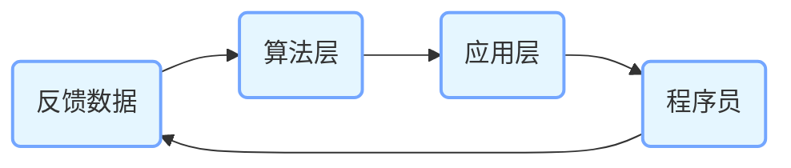

# AI技术在编程中的应用与挑战

> 关键词：AI技术、编程、应用、挑战、自动化编程、代码优化、智能辅助

> 摘要：本文深入探讨了AI技术在编程领域的应用与挑战。首先介绍了相关背景，包括目的范围、预期读者等内容。接着阐述了AI技术与编程相关的核心概念及联系，通过详细的算法原理、数学模型进行剖析。以实际案例展示了AI技术在编程中的具体应用，包括开发环境搭建、代码实现与解读。同时分析了AI技术在编程中的实际应用场景，推荐了相关的学习资源、开发工具和论文著作。最后总结了未来的发展趋势与挑战，并提供常见问题解答及参考资料，旨在全面呈现AI技术在编程领域的现状与前景。

## 1. 背景介绍 
### 1.1 目的和范围
本文章的目的在于全面且深入地研究AI技术在编程领域的应用与挑战。随着AI技术的迅猛发展，其在编程中的应用日益广泛，了解这些应用及其带来的挑战对于程序员、软件开发者、科研人员等相关群体具有重要意义。本文的范围涵盖了AI技术在编程中的多个方面，包括自动化编程、代码优化、智能辅助等应用，同时分析了在应用过程中面临的技术、伦理、法律等挑战。

### 1.2 预期读者
预期读者包括但不限于专业程序员、软件工程师、计算机科学专业的学生、科研人员以及对AI技术和编程感兴趣的爱好者。这些读者可能希望通过本文了解AI技术如何在编程中发挥作用，以及在实际应用中需要注意的问题，从而更好地将AI技术融入到编程工作中，提升编程效率和质量。

### 1.3 文档结构概述
本文将按照以下结构进行阐述：首先介绍背景信息，包括目的、预期读者和文档结构概述等；接着详细讲解AI技术与编程相关的核心概念及联系，并给出相应的示意图和流程图；然后深入探讨核心算法原理和具体操作步骤，通过Python源代码进行详细说明；之后介绍数学模型和公式，并举例说明；再通过实际案例展示AI技术在编程中的应用，包括开发环境搭建、源代码实现和代码解读；分析AI技术在编程中的实际应用场景；推荐相关的学习资源、开发工具和论文著作；最后总结未来发展趋势与挑战，提供常见问题解答和参考资料。

### 1.4 术语表
#### 1.4.1 核心术语定义
- **AI技术（Artificial Intelligence Technology）**：指让计算机模拟人类智能的一系列技术，包括机器学习、深度学习、自然语言处理等，旨在使计算机能够像人类一样感知、学习、推理和决策。
- **编程（Programming）**：是指使用特定的编程语言，按照一定的逻辑和规则，编写计算机程序的过程，以实现特定的功能和任务。
- **自动化编程（Automated Programming）**：利用AI技术自动生成代码的过程，通过对需求的理解和分析，自动生成满足要求的程序代码。
- **代码优化（Code Optimization）**：对已有的代码进行改进，以提高代码的性能、可读性、可维护性等方面的质量。
- **智能辅助（Intelligent Assistance）**：借助AI技术为程序员提供辅助功能，如代码自动补全、错误提示、代码推荐等，帮助程序员更高效地编写代码。

#### 1.4.2 相关概念解释
- **机器学习（Machine Learning）**：是AI技术的一个重要分支，它通过让计算机从数据中学习模式和规律，从而实现对未知数据的预测和决策。在编程中，机器学习可以用于代码分类、代码生成等任务。
- **深度学习（Deep Learning）**：是一种基于神经网络的机器学习方法，通过构建多层神经网络模型，自动学习数据的特征和表示。深度学习在图像识别、自然语言处理等领域取得了显著的成果，在编程中也可用于代码理解和生成。
- **自然语言处理（Natural Language Processing）**：是研究如何让计算机理解和处理人类语言的技术。在编程中，自然语言处理可以将自然语言描述的需求转化为代码，或者对代码进行自然语言解释。

#### 1.4.3 缩略词列表
- **AI**：Artificial Intelligence（人工智能）
- **ML**：Machine Learning（机器学习）
- **DL**：Deep Learning（深度学习）
- **NLP**：Natural Language Processing（自然语言处理）

## 2. 核心概念与联系 

### 核心概念原理
#### AI技术原理
AI技术的核心在于模拟人类的智能行为，通过数据和算法来实现学习、推理和决策。机器学习是AI技术的重要实现方式之一，它基于数据和模型进行训练，让计算机自动学习数据中的模式和规律。深度学习则是在机器学习的基础上，通过构建深层神经网络模型，自动提取数据的高级特征，从而实现更复杂的任务。自然语言处理则是让计算机理解和处理人类语言，包括文本分类、情感分析、机器翻译等任务。

#### 编程原理
编程是将人类的需求和逻辑转化为计算机能够理解和执行的指令的过程。程序员使用编程语言来编写代码，通过控制计算机的运算、存储和输入输出等操作，实现特定的功能和任务。编程语言具有严格的语法和语义规则，程序员需要按照这些规则来编写代码，以确保代码的正确性和可执行性。

### 架构的文本示意图
AI技术在编程中的应用架构可以分为以下几个层次：
- **数据层**：包括代码数据、需求文档、注释等各种与编程相关的数据，这些数据是AI技术进行学习和分析的基础。
- **算法层**：包括机器学习算法、深度学习算法、自然语言处理算法等，这些算法用于对数据进行处理和分析，实现代码生成、代码优化、智能辅助等功能。
- **应用层**：包括自动化编程工具、代码优化工具、智能编程助手等，这些工具是AI技术在编程中的具体应用，为程序员提供各种辅助和支持。

### Mermaid流程图


这个流程图展示了AI技术在编程中的应用架构，数据层为算法层提供数据支持，算法层通过对数据的处理和分析实现各种功能，应用层将这些功能呈现给程序员，程序员在使用过程中产生的反馈数据又回到数据层，形成一个闭环的反馈机制，不断优化AI技术在编程中的应用。

## 3. 核心算法原理 & 具体操作步骤 

### 自动化编程算法原理
自动化编程的核心思想是将自然语言描述的需求转化为代码。一种常见的方法是使用深度学习中的序列到序列（Sequence-to-Sequence）模型，如Transformer架构。

#### Python源代码实现
```python
import torch
import torch.nn as nn
import torch.optim as optim
from torch.utils.data import Dataset, DataLoader

# 定义数据集类
class CodeDataset(Dataset):
    def __init__(self, input_texts, target_texts):
        self.input_texts = input_texts
        self.target_texts = target_texts

    def __len__(self):
        return len(self.input_texts)

    def __getitem__(self, idx):
        input_text = self.input_texts[idx]
        target_text = self.target_texts[idx]
        return input_text, target_text

# 定义Transformer模型
class TransformerModel(nn.Module):
    def __init__(self, input_dim, output_dim, d_model, nhead, num_layers):
        super(TransformerModel, self).__init__()
        self.encoder = nn.Embedding(input_dim, d_model)
        self.decoder = nn.Embedding(output_dim, d_model)
        self.transformer = nn.Transformer(d_model, nhead, num_layers)
        self.fc = nn.Linear(d_model, output_dim)

    def forward(self, src, tgt):
        src = self.encoder(src)
        tgt = self.decoder(tgt)
        output = self.transformer(src, tgt)
        output = self.fc(output)
        return output

# 训练模型
def train_model(model, dataloader, criterion, optimizer, num_epochs):
    for epoch in range(num_epochs):
        total_loss = 0
        for input_text, target_text in dataloader:
            optimizer.zero_grad()
            output = model(input_text, target_text)
            loss = criterion(output, target_text)
            loss.backward()
            optimizer.step()
            total_loss += loss.item()
        print(f'Epoch {epoch+1}, Loss: {total_loss/len(dataloader)}')

# 示例数据
input_texts = ["create a function to add two numbers", "create a function to multiply two numbers"]
target_texts = ["def add_numbers(a, b): return a + b", "def multiply_numbers(a, b): return a * b"]

# 创建数据集和数据加载器
dataset = CodeDataset(input_texts, target_texts)
dataloader = DataLoader(dataset, batch_size=1, shuffle=True)

# 定义模型参数
input_dim = 100
output_dim = 100
d_model = 128
nhead = 4
num_layers = 2

# 创建模型、损失函数和优化器
model = TransformerModel(input_dim, output_dim, d_model, nhead, num_layers)
criterion = nn.CrossEntropyLoss()
optimizer = optim.Adam(model.parameters(), lr=0.001)

# 训练模型
train_model(model, dataloader, criterion, optimizer, num_epochs=10)
```

### 具体操作步骤
1. **数据准备**：收集和整理与编程相关的数据，包括需求描述和对应的代码。将数据进行预处理，如分词、编码等，使其适合模型输入。
2. **模型选择和设计**：选择合适的深度学习模型，如Transformer架构，并根据数据的特点和任务的需求设计模型的参数。
3. **模型训练**：使用准备好的数据对模型进行训练，通过不断调整模型的参数，使模型能够准确地将需求描述转化为代码。
4. **模型评估和优化**：使用测试数据对训练好的模型进行评估，根据评估结果对模型进行优化，如调整模型的参数、增加数据量等。
5. **模型应用**：将训练好的模型应用到实际的自动化编程任务中，输入需求描述，模型输出对应的代码。

## 4. 数学模型和公式 & 详细讲解 & 举例说明 

### 序列到序列模型的数学模型
序列到序列（Sequence-to-Sequence）模型的核心是编码器 - 解码器（Encoder - Decoder）结构。编码器将输入序列 $X = [x_1, x_2, ..., x_n]$ 编码为一个固定长度的向量 $c$，解码器根据这个向量 $c$ 生成输出序列 $Y = [y_1, y_2, ..., y_m]$。

#### 编码器
编码器通常使用循环神经网络（RNN）或Transformer等模型。以Transformer为例，编码器的输入是输入序列的嵌入表示 $X_{emb}$，经过多头自注意力机制（Multi-Head Self-Attention）和前馈神经网络（Feed-Forward Network）的多层处理，输出编码后的表示 $H_{enc}$。

多头自注意力机制的计算公式为：
$$
\text{MultiHead}(Q, K, V) = \text{Concat}(\text{head}_1, ..., \text{head}_h)W^O
$$
其中，$\text{head}_i = \text{Attention}(QW_i^Q, KW_i^K, VW_i^V)$，$\text{Attention}(Q, K, V) = \text{softmax}(\frac{QK^T}{\sqrt{d_k}})V$，$Q$、$K$、$V$ 分别是查询、键和值矩阵，$W_i^Q$、$W_i^K$、$W_i^V$ 和 $W^O$ 是可学习的权重矩阵，$d_k$ 是键的维度。

#### 解码器
解码器的输入是之前生成的输出序列的嵌入表示 $Y_{emb}$ 和编码器的输出 $H_{enc}$。解码器也使用多头自注意力机制和前馈神经网络，同时还使用编码器 - 解码器注意力机制（Encoder - Decoder Attention）来关注编码器的输出。

编码器 - 解码器注意力机制的计算公式与多头自注意力机制类似，只是查询矩阵 $Q$ 来自解码器，键和值矩阵 $K$、$V$ 来自编码器的输出。

最后，解码器的输出经过一个线性层和softmax函数，得到每个时间步的输出概率分布：
$$
P(y_t|y_{<t}, X) = \text{softmax}(W_{out}h_t + b_{out})
$$
其中，$h_t$ 是解码器在时间步 $t$ 的隐藏状态，$W_{out}$ 和 $b_{out}$ 是线性层的权重和偏置。

### 举例说明
假设输入序列 $X = ["create", "a", "function", "to", "add", "two", "numbers"]$，经过编码器处理后得到编码向量 $c$。解码器从初始状态开始，逐步生成输出序列 $Y$。在第一个时间步，解码器根据 $c$ 生成第一个单词 "def" 的概率分布，选择概率最大的单词作为输出。然后，将 "def" 作为输入，继续生成下一个单词，直到生成完整的代码序列。

## 5. 项目实战：代码实际案例和详细解释说明 

### 5.1  开发环境搭建
#### 安装Python
首先，确保你的系统中安装了Python 3.x版本。可以从Python官方网站（https://www.python.org/downloads/）下载并安装适合你操作系统的Python版本。

#### 安装必要的库
在项目中，我们使用了PyTorch库来实现深度学习模型。可以使用以下命令安装PyTorch：
```bash
pip install torch torchvision
```

### 5.2  源代码详细实现和代码解读
```python
import torch
import torch.nn as nn
import torch.optim as optim
from torch.utils.data import Dataset, DataLoader

# 定义数据集类
class CodeDataset(Dataset):
    def __init__(self, input_texts, target_texts):
        self.input_texts = input_texts
        self.target_texts = target_texts

    def __len__(self):
        return len(self.input_texts)

    def __getitem__(self, idx):
        input_text = self.input_texts[idx]
        target_text = self.target_texts[idx]
        return input_text, target_text

# 定义Transformer模型
class TransformerModel(nn.Module):
    def __init__(self, input_dim, output_dim, d_model, nhead, num_layers):
        super(TransformerModel, self).__init__()
        self.encoder = nn.Embedding(input_dim, d_model)
        self.decoder = nn.Embedding(output_dim, d_model)
        self.transformer = nn.Transformer(d_model, nhead, num_layers)
        self.fc = nn.Linear(d_model, output_dim)

    def forward(self, src, tgt):
        src = self.encoder(src)
        tgt = self.decoder(tgt)
        output = self.transformer(src, tgt)
        output = self.fc(output)
        return output

# 训练模型
def train_model(model, dataloader, criterion, optimizer, num_epochs):
    for epoch in range(num_epochs):
        total_loss = 0
        for input_text, target_text in dataloader:
            optimizer.zero_grad()
            output = model(input_text, target_text)
            loss = criterion(output, target_text)
            loss.backward()
            optimizer.step()
            total_loss += loss.item()
        print(f'Epoch {epoch+1}, Loss: {total_loss/len(dataloader)}')

# 示例数据
input_texts = ["create a function to add two numbers", "create a function to multiply two numbers"]
target_texts = ["def add_numbers(a, b): return a + b", "def multiply_numbers(a, b): return a * b"]

# 创建数据集和数据加载器
dataset = CodeDataset(input_texts, target_texts)
dataloader = DataLoader(dataset, batch_size=1, shuffle=True)

# 定义模型参数
input_dim = 100
output_dim = 100
d_model = 128
nhead = 4
num_layers = 2

# 创建模型、损失函数和优化器
model = TransformerModel(input_dim, output_dim, d_model, nhead, num_layers)
criterion = nn.CrossEntropyLoss()
optimizer = optim.Adam(model.parameters(), lr=0.001)

# 训练模型
train_model(model, dataloader, criterion, optimizer, num_epochs=10)
```

### 代码解读与分析
- **数据集类 `CodeDataset`**：用于存储和处理输入文本和目标文本。`__init__` 方法初始化数据集，`__len__` 方法返回数据集的长度，`__getitem__` 方法根据索引返回对应的输入文本和目标文本。
- **Transformer模型 `TransformerModel`**：定义了一个基于Transformer架构的序列到序列模型。`__init__` 方法初始化模型的各个层，包括编码器、解码器、Transformer层和全连接层。`forward` 方法定义了模型的前向传播过程，将输入序列和目标序列经过嵌入层、Transformer层和全连接层，输出预测结果。
- **训练函数 `train_model`**：用于训练模型。在每个epoch中，遍历数据集，计算损失并进行反向传播和参数更新。最后打印每个epoch的平均损失。
- **示例数据**：定义了两个简单的需求描述和对应的代码作为示例数据。
- **数据加载器**：使用 `DataLoader` 类将数据集封装成可迭代的数据加载器，方便批量处理数据。
- **模型训练**：创建模型、损失函数和优化器，调用 `train_model` 函数进行模型训练。

## 6. 实际应用场景 

### 自动化编程
AI技术可以根据自然语言描述的需求自动生成代码，大大提高编程效率。例如，在一些低代码开发平台中，用户可以通过简单的文本描述来创建应用程序，平台利用AI技术自动生成相应的代码。

### 代码优化
AI技术可以分析已有的代码，找出潜在的性能问题和优化点，并提供优化建议。例如，一些代码审查工具可以利用机器学习算法分析代码的复杂度、可读性和性能，为程序员提供改进建议。

### 智能辅助编程
智能编程助手可以为程序员提供代码自动补全、错误提示、代码推荐等功能。例如，集成开发环境（IDE）中的智能提示功能可以根据上下文和代码库中的信息，自动补全代码，减少程序员的输入工作量。

### 代码审查和质量保证
AI技术可以帮助进行代码审查，检查代码是否符合编码规范、是否存在安全漏洞等问题。例如，一些静态代码分析工具可以利用机器学习算法对代码进行分析，发现潜在的问题并提供修复建议。

### 软件测试
AI技术可以用于自动生成测试用例，提高软件测试的效率和覆盖率。例如，一些测试框架可以利用机器学习算法根据代码的结构和功能，自动生成测试用例，确保软件的质量。

## 7. 工具和资源推荐
### 7.1 学习资源推荐
#### 7.1.1 书籍推荐
- 《Python深度学习》（Francois Chollet著）：介绍了Python和深度学习的基础知识，以及如何使用Keras库进行深度学习模型的开发。
- 《机器学习》（周志华著）：全面介绍了机器学习的基本概念、算法和应用，是机器学习领域的经典教材。
- 《人工智能：一种现代的方法》（Stuart Russell和Peter Norvig著）：是人工智能领域的权威教材，涵盖了人工智能的各个方面，包括搜索、知识表示、推理、机器学习等。

#### 7.1.2 在线课程
- Coursera上的“深度学习专项课程”（Deep Learning Specialization）：由Andrew Ng教授主讲，包括深度学习的基础知识、卷积神经网络、循环神经网络等内容。
- edX上的“人工智能导论”（Introduction to Artificial Intelligence）：介绍了人工智能的基本概念、算法和应用，是学习人工智能的入门课程。
- 网易云课堂上的“Python编程基础”：适合初学者学习Python编程语言的基础知识和编程技巧。

#### 7.1.3 技术博客和网站
- Medium（https://medium.com/）：有很多关于AI技术和编程的优秀博客文章，涵盖了最新的技术动态和研究成果。
- Towards Data Science（https://towardsdatascience.com/）：专注于数据科学和机器学习领域的技术博客，提供了很多实用的教程和案例。
- Stack Overflow（https://stackoverflow.com/）：是程序员交流和解决问题的社区，有很多关于编程和AI技术的问题和答案。

### 7.2 开发工具框架推荐
#### 7.2.1 IDE和编辑器
- PyCharm：是一款专门为Python开发设计的集成开发环境，提供了丰富的功能和插件，方便程序员进行代码编写、调试和管理。
- Visual Studio Code：是一款轻量级的代码编辑器，支持多种编程语言和插件扩展，具有强大的代码编辑和调试功能。
- Jupyter Notebook：是一个交互式的开发环境，适合进行数据分析、机器学习和深度学习的实验和开发。

#### 7.2.2 调试和性能分析工具
- PDB：是Python自带的调试工具，可以帮助程序员调试代码，找出代码中的错误和问题。
- cProfile：是Python的性能分析工具，可以分析代码的性能瓶颈，找出耗时较长的代码段。
- TensorBoard：是TensorFlow的可视化工具，可以帮助用户可视化训练过程和模型结构，分析模型的性能。

#### 7.2.3 相关框架和库
- PyTorch：是一个开源的深度学习框架，提供了丰富的深度学习模型和工具，方便用户进行深度学习模型的开发和训练。
- TensorFlow：是Google开发的开源深度学习框架，具有强大的计算能力和广泛的应用场景。
- Scikit-learn：是一个用于机器学习的Python库，提供了各种机器学习算法和工具，方便用户进行机器学习模型的开发和训练。

### 7.3 相关论文著作推荐
#### 7.3.1 经典论文
- “Attention Is All You Need”（Ashish Vaswani等人著）：介绍了Transformer架构，是深度学习领域的经典论文，对自然语言处理和其他领域产生了深远的影响。
- “ImageNet Classification with Deep Convolutional Neural Networks”（Alex Krizhevsky等人著）：介绍了AlexNet模型，开创了深度学习在图像识别领域的先河。
- “Generative Adversarial Networks”（Ian J. Goodfellow等人著）：提出了生成对抗网络（GAN）的概念，是深度学习领域的重要突破。

#### 7.3.2 最新研究成果
- 关注顶级学术会议，如NeurIPS（神经信息处理系统大会）、ICML（国际机器学习会议）、ACL（计算语言学协会年会）等，这些会议上会发布很多关于AI技术和编程的最新研究成果。
- 关注知名学术期刊，如Journal of Artificial Intelligence Research（JAIR）、Artificial Intelligence等，这些期刊上会发表高质量的研究论文。

#### 7.3.3 应用案例分析
- 一些开源项目的文档和博客文章中会有关于AI技术在编程中应用的案例分析，例如GitHub上的一些知名项目。
- 一些技术公司的官方博客也会分享他们在实际项目中应用AI技术的经验和案例，例如Google、Facebook、Microsoft等公司的博客。

## 8. 总结：未来发展趋势与挑战

### 未来发展趋势
- **更强大的自动化编程能力**：随着AI技术的不断发展，自动化编程将变得更加智能和高效。未来的自动化编程工具将能够处理更复杂的需求，生成更高质量的代码。
- **融合多种AI技术**：AI技术在编程中的应用将不再局限于单一的技术，而是会融合机器学习、深度学习、自然语言处理、知识图谱等多种技术，实现更全面的编程辅助和支持。
- **个性化的编程助手**：根据程序员的编程习惯、技能水平和项目需求，提供个性化的编程建议和辅助功能。例如，智能编程助手可以根据程序员的历史代码和偏好，自动推荐合适的代码模板和库。
- **跨语言和跨平台的支持**：未来的AI编程工具将支持更多的编程语言和开发平台，方便程序员在不同的环境中进行开发。

### 挑战
- **技术挑战**：目前AI技术在编程中的应用还存在一些技术难题，例如代码理解的准确性、代码生成的质量和可维护性等。需要进一步研究和改进相关的算法和模型，提高AI技术在编程中的性能和效果。
- **伦理和法律挑战**：AI技术在编程中的应用可能会带来一些伦理和法律问题，例如代码的版权归属、数据隐私保护等。需要建立相应的法律法规和伦理准则，规范AI技术在编程中的应用。
- **教育和培训挑战**：随着AI技术在编程中的广泛应用，程序员需要具备相关的AI知识和技能。因此，需要加强对程序员的教育和培训，提高他们的AI素养和编程能力。
- **社会影响挑战**：AI技术的发展可能会对编程行业的就业结构产生影响，一些重复性的编程工作可能会被自动化工具所取代。需要关注这些社会影响，采取相应的措施，促进编程行业的健康发展。

## 9. 附录：常见问题与解答

### 问题1：AI技术在编程中的应用是否会取代程序员？
解答：不会。虽然AI技术可以在一定程度上提高编程效率和质量，但编程不仅仅是代码的生成，还涉及到需求分析、系统设计、架构规划、代码审查等多个环节，这些环节需要程序员的专业知识和经验。AI技术在编程中的应用更多的是作为一种辅助工具，帮助程序员更好地完成工作。

### 问题2：如何选择适合的AI技术和工具来应用于编程？
解答：选择适合的AI技术和工具需要考虑多个因素，例如项目的需求、数据的特点、技术的成熟度、开发成本等。首先，需要明确项目的目标和需求，确定需要解决的问题。然后，根据问题的类型和数据的特点，选择合适的AI技术和算法。最后，根据技术的成熟度和开发成本，选择合适的工具和框架。

### 问题3：AI技术在编程中的应用是否存在安全风险？
解答：存在。AI技术在编程中的应用可能会带来一些安全风险，例如代码漏洞、数据泄露、恶意攻击等。为了降低安全风险，需要采取一系列的安全措施，例如代码审查、数据加密、访问控制等。同时，需要不断关注和研究AI技术的安全问题，及时采取相应的防范措施。

### 问题4：如何提高AI技术在编程中的应用效果？
解答：提高AI技术在编程中的应用效果需要从多个方面入手。首先，需要收集和整理高质量的数据，为AI模型的训练提供充足的信息。其次，需要选择合适的AI算法和模型，并进行调优和优化，提高模型的性能和准确性。此外，还需要不断进行实验和验证，根据实际应用的反馈进行改进和调整。

## 10. 扩展阅读 & 参考资料

### 扩展阅读
- 《AI未来进行式》（李开复、王咏刚著）：探讨了AI技术对未来社会的影响和挑战，以及如何应对这些变化。
- 《人类简史：从动物到上帝》（尤瓦尔·赫拉利著）：从人类历史的角度探讨了人类的发展和未来的趋势，对理解AI技术的发展背景有一定的帮助。

### 参考资料
- 相关学术论文和研究报告，如NeurIPS、ICML、ACL等会议的论文集。
- 开源项目的文档和代码，如GitHub上的相关项目。
- 技术公司的官方博客和文档，如Google、Facebook、Microsoft等公司的博客。