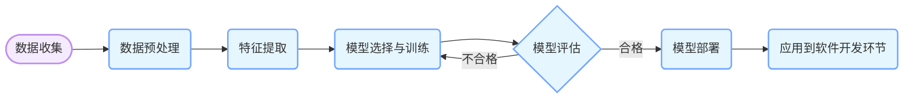

# AI技术在软件开发中的应用与挑战

> 关键词：AI技术、软件开发、应用、挑战、机器学习、深度学习、自动化

> 摘要：本文深入探讨了AI技术在软件开发领域的应用与挑战。首先介绍了研究的背景、目的、预期读者和文档结构等内容。接着阐述了AI相关的核心概念及其联系，详细讲解了核心算法原理并给出Python示例代码。通过数学模型和公式进一步剖析其原理，并结合实际案例进行说明。在项目实战部分，搭建开发环境，给出源代码并进行详细解读。同时探讨了AI技术在软件开发中的实际应用场景，推荐了相关的学习资源、开发工具框架和论文著作。最后总结了未来的发展趋势与挑战，提供常见问题解答和扩展阅读参考资料，旨在为软件开发人员和相关研究者全面了解AI技术在软件开发中的应用提供参考。

## 1. 背景介绍 
### 1.1 目的和范围
随着信息技术的飞速发展，AI技术逐渐成为推动各行业变革的关键力量。在软件开发领域，AI技术的应用为提高软件质量、提升开发效率、增强用户体验等方面带来了新的机遇。本文章的目的在于全面深入地探讨AI技术在软件开发中的应用场景、核心原理、实际案例以及面临的挑战，旨在为软件开发人员、研究者和相关从业者提供一个系统的参考，帮助他们更好地理解和应用AI技术，提升软件开发的水平和质量。文章的范围涵盖了AI技术在软件开发各个阶段的应用，包括需求分析、设计、编码、测试、维护等，同时也涉及到相关的算法原理、数学模型、实际案例和未来发展趋势等方面。

### 1.2 预期读者
本文的预期读者主要包括以下几类人群：
1. **软件开发人员**：希望了解如何将AI技术融入到软件开发过程中，提高开发效率和软件质量。
2. **软件架构师**：关注如何利用AI技术设计出更智能、更高效的软件架构。
3. **AI研究者**：对AI技术在软件开发领域的应用感兴趣，希望通过实际案例深入了解其应用场景和挑战。
4. **技术管理者**：需要了解AI技术对软件开发的影响，以便做出合理的技术决策和资源分配。
5. **计算机科学相关专业的学生**：作为学习参考资料，帮助他们拓宽知识面，了解AI技术在实际领域的应用。

### 1.3 文档结构概述
本文将按照以下结构进行组织：
1. **背景介绍**：阐述研究的目的、范围、预期读者和文档结构，以及相关术语的定义和解释。
2. **核心概念与联系**：介绍AI技术相关的核心概念，如机器学习、深度学习等，并说明它们之间的联系，同时给出相应的文本示意图和Mermaid流程图。
3. **核心算法原理 & 具体操作步骤**：详细讲解AI技术中常用的核心算法原理，并使用Python源代码进行具体实现和步骤说明。
4. **数学模型和公式 & 详细讲解 & 举例说明**：通过数学模型和公式深入剖析AI算法的原理，并结合实际例子进行说明。
5. **项目实战：代码实际案例和详细解释说明**：搭建开发环境，给出实际的代码案例，并对代码进行详细解读和分析。
6. **实际应用场景**：探讨AI技术在软件开发各个阶段的实际应用场景。
7. **工具和资源推荐**：推荐相关的学习资源、开发工具框架和论文著作。
8. **总结：未来发展趋势与挑战**：总结AI技术在软件开发中的未来发展趋势和面临的挑战。
9. **附录：常见问题与解答**：解答读者在学习和应用过程中可能遇到的常见问题。
10. **扩展阅读 & 参考资料**：提供相关的扩展阅读资料和参考书目，方便读者进一步深入学习。

### 1.4 术语表
#### 1.4.1 核心术语定义
1. **AI（Artificial Intelligence）**：人工智能，是研究、开发用于模拟、延伸和扩展人的智能的理论、方法、技术及应用系统的一门新的技术科学。
2. **机器学习（Machine Learning）**：是一门多领域交叉学科，涉及概率论、统计学、逼近论、凸分析、算法复杂度理论等多门学科。它专门研究计算机怎样模拟或实现人类的学习行为，以获取新的知识或技能，重新组织已有的知识结构使之不断改善自身的性能。
3. **深度学习（Deep Learning）**：是机器学习的一个分支领域，它是一种基于对数据进行表征学习的方法。深度学习通过构建具有很多层的神经网络模型，自动从大量数据中学习特征和模式。
4. **自动化测试（Automated Testing）**：是把以人为驱动的测试行为转化为机器执行的一种过程。通过使用测试工具和框架，自动执行测试用例，提高测试效率和准确性。
5. **自然语言处理（Natural Language Processing，NLP）**：是计算机科学、人工智能和语言学的交叉领域，主要研究如何让计算机理解和处理人类语言，包括文本分类、情感分析、机器翻译等任务。

#### 1.4.2 相关概念解释
1. **监督学习（Supervised Learning）**：是机器学习中的一种学习方式，在监督学习中，训练数据包含输入特征和对应的标签，模型通过学习输入特征和标签之间的关系，来对新的数据进行预测。
2. **无监督学习（Unsupervised Learning）**：训练数据只包含输入特征，没有对应的标签。模型通过对输入数据的分析和挖掘，发现数据中的内在结构和模式，如聚类分析和降维等。
3. **强化学习（Reinforcement Learning）**：智能体（Agent）通过与环境进行交互，根据环境反馈的奖励信号来学习最优的行为策略，以最大化长期累积奖励。
4. **神经网络（Neural Network）**：是一种模仿人类神经系统的计算模型，由大量的神经元组成。神经网络通过对输入数据的处理和变换，学习数据中的特征和模式，广泛应用于图像识别、语音识别等领域。

#### 1.4.3 缩略词列表
1. **AI**：Artificial Intelligence（人工智能）
2. **ML**：Machine Learning（机器学习）
3. **DL**：Deep Learning（深度学习）
4. **NLP**：Natural Language Processing（自然语言处理）
5. **API**：Application Programming Interface（应用程序编程接口）

## 2. 核心概念与联系 

### 核心概念原理
#### 机器学习
机器学习是AI技术的重要组成部分，其核心思想是让计算机通过数据学习模式和规律，从而实现对未知数据的预测和决策。机器学习主要分为监督学习、无监督学习和强化学习。

- **监督学习**：在监督学习中，我们有一组标记好的数据，即每个输入样本都有对应的输出标签。模型的目标是学习输入和输出之间的映射关系，以便对新的输入数据进行预测。常见的监督学习算法包括线性回归、逻辑回归、决策树、支持向量机等。
- **无监督学习**：无监督学习处理的是未标记的数据，模型的任务是发现数据中的内在结构和模式。例如，聚类算法将数据点划分为不同的簇，使得同一簇内的数据点具有较高的相似性；降维算法则用于减少数据的维度，同时保留数据的重要信息。
- **强化学习**：强化学习通过智能体与环境的交互来学习最优策略。智能体在环境中采取行动，环境会返回相应的奖励信号，智能体的目标是最大化长期累积奖励。强化学习在游戏、机器人控制等领域有广泛应用。

#### 深度学习
深度学习是机器学习的一个分支，它基于神经网络模型。神经网络由多个神经元组成，这些神经元按层次排列，包括输入层、隐藏层和输出层。深度学习通过构建深度神经网络，自动从大量数据中学习复杂的特征和模式。

深度学习的核心在于深度神经网络的训练，常用的神经网络架构包括卷积神经网络（Convolutional Neural Network，CNN）、循环神经网络（Recurrent Neural Network，RNN）及其变体（如长短期记忆网络，LSTM）等。CNN主要用于图像和视频处理，RNN则适用于处理序列数据，如自然语言和时间序列数据。

#### 自然语言处理
自然语言处理是AI技术在语言领域的应用，旨在让计算机理解和处理人类语言。NLP的任务包括文本分类、情感分析、命名实体识别、机器翻译等。

NLP的实现通常涉及到多个步骤，如文本预处理（包括分词、词性标注、词干提取等）、特征提取（如词向量表示）和模型训练（如使用深度学习模型进行分类或生成）。

### 架构的文本示意图
AI技术在软件开发中的应用架构可以分为数据层、模型层和应用层。

- **数据层**：负责收集、存储和管理软件开发过程中的各种数据，包括需求文档、代码、测试用例、用户反馈等。这些数据是AI模型训练的基础。
- **模型层**：基于数据层提供的数据，训练和优化各种AI模型，如机器学习模型、深度学习模型等。模型层是AI技术的核心，它决定了系统的智能水平。
- **应用层**：将训练好的AI模型应用到软件开发的各个环节，如需求分析、代码生成、测试自动化等，为软件开发提供智能支持。

### Mermaid流程图


## 3. 核心算法原理 & 具体操作步骤 

### 线性回归算法原理
线性回归是一种简单而常用的监督学习算法，用于预测连续数值。其基本原理是通过找到一条最佳拟合直线，使得所有数据点到该直线的误差平方和最小。

线性回归的数学模型可以表示为：
$$y = \theta_0 + \theta_1x_1 + \theta_2x_2 + \cdots + \theta_nx_n + \epsilon$$
其中，$y$ 是目标变量，$x_1, x_2, \cdots, x_n$ 是输入特征，$\theta_0, \theta_1, \cdots, \theta_n$ 是模型的参数，$\epsilon$ 是误差项。

### Python源代码实现
```python
import numpy as np
from sklearn.linear_model import LinearRegression
from sklearn.model_selection import train_test_split
from sklearn.metrics import mean_squared_error

# 生成一些示例数据
np.random.seed(42)
X = np.random.rand(100, 1)
y = 2 * X + 1 + 0.5 * np.random.randn(100, 1)

# 划分训练集和测试集
X_train, X_test, y_train, y_test = train_test_split(X, y, test_size=0.2, random_state=42)

# 创建线性回归模型
model = LinearRegression()

# 训练模型
model.fit(X_train, y_train)

# 预测
y_pred = model.predict(X_test)

# 计算均方误差
mse = mean_squared_error(y_test, y_pred)
print(f"均方误差: {mse}")

# 输出模型参数
print(f"截距: {model.intercept_}")
print(f"系数: {model.coef_}")
```

### 具体操作步骤
1. **数据生成**：使用 `numpy` 生成一些示例数据，其中 `X` 是输入特征，`y` 是目标变量。
2. **数据划分**：使用 `train_test_split` 函数将数据划分为训练集和测试集，其中测试集占总数据的20%。
3. **模型创建**：创建一个 `LinearRegression` 模型对象。
4. **模型训练**：使用训练集数据调用 `fit` 方法对模型进行训练。
5. **模型预测**：使用训练好的模型对测试集数据进行预测。
6. **模型评估**：使用 `mean_squared_error` 函数计算预测结果与真实值之间的均方误差。
7. **参数输出**：输出模型的截距和系数。

### 逻辑回归算法原理
逻辑回归是一种用于分类问题的监督学习算法，它通过逻辑函数将线性回归的输出映射到概率值。逻辑回归的核心是逻辑函数（也称为Sigmoid函数），其定义为：
$$\sigma(z) = \frac{1}{1 + e^{-z}}$$
其中，$z$ 是线性回归的输出。逻辑回归的目标是通过最大似然估计来估计模型的参数，使得模型对训练数据的预测概率最大。

### Python源代码实现
```python
from sklearn.datasets import make_classification
from sklearn.linear_model import LogisticRegression
from sklearn.model_selection import train_test_split
from sklearn.metrics import accuracy_score

# 生成一些示例分类数据
X, y = make_classification(n_samples=100, n_features=10, n_informative=5, n_redundant=0, random_state=42)

# 划分训练集和测试集
X_train, X_test, y_train, y_test = train_test_split(X, y, test_size=0.2, random_state=42)

# 创建逻辑回归模型
model = LogisticRegression()

# 训练模型
model.fit(X_train, y_train)

# 预测
y_pred = model.predict(X_test)

# 计算准确率
accuracy = accuracy_score(y_test, y_pred)
print(f"准确率: {accuracy}")

# 输出模型系数
print(f"系数: {model.coef_}")
```

### 具体操作步骤
1. **数据生成**：使用 `make_classification` 函数生成一些示例分类数据。
2. **数据划分**：使用 `train_test_split` 函数将数据划分为训练集和测试集，其中测试集占总数据的20%。
3. **模型创建**：创建一个 `LogisticRegression` 模型对象。
4. **模型训练**：使用训练集数据调用 `fit` 方法对模型进行训练。
5. **模型预测**：使用训练好的模型对测试集数据进行预测。
6. **模型评估**：使用 `accuracy_score` 函数计算预测结果的准确率。
7. **参数输出**：输出模型的系数。

## 4. 数学模型和公式 & 详细讲解 & 举例说明 

### 线性回归的数学模型和公式
线性回归的目标是找到一组参数 $\theta = [\theta_0, \theta_1, \cdots, \theta_n]$，使得预测值 $\hat{y}$ 与真实值 $y$ 之间的误差最小。通常使用均方误差（Mean Squared Error，MSE）作为损失函数，其定义为：
$$MSE(\theta) = \frac{1}{m} \sum_{i=1}^{m} (y^{(i)} - \hat{y}^{(i)})^2$$
其中，$m$ 是样本数量，$y^{(i)}$ 是第 $i$ 个样本的真实值，$\hat{y}^{(i)}$ 是第 $i$ 个样本的预测值。

为了最小化均方误差，我们可以使用梯度下降法来更新模型的参数。梯度下降法的更新公式为：
$$\theta_j := \theta_j - \alpha \frac{\partial MSE(\theta)}{\partial \theta_j}$$
其中，$\alpha$ 是学习率，控制每次参数更新的步长。

### 详细讲解
线性回归的核心思想是通过找到一条最佳拟合直线，使得所有数据点到该直线的误差平方和最小。均方误差是一种常用的损失函数，它衡量了预测值与真实值之间的平均误差。梯度下降法是一种迭代优化算法，通过不断更新模型的参数，使得损失函数逐渐减小，直到达到最小值。

### 举例说明
假设我们有一组数据 $(x_1, y_1), (x_2, y_2), \cdots, (x_m, y_m)$，我们的目标是找到一条直线 $y = \theta_0 + \theta_1x$ 来拟合这些数据。

首先，我们初始化参数 $\theta_0$ 和 $\theta_1$ 为随机值。然后，计算每个样本的预测值 $\hat{y}^{(i)} = \theta_0 + \theta_1x^{(i)}$，并计算均方误差 $MSE(\theta)$。接着，使用梯度下降法更新参数 $\theta_0$ 和 $\theta_1$：
$$\theta_0 := \theta_0 - \alpha \frac{1}{m} \sum_{i=1}^{m} (\theta_0 + \theta_1x^{(i)} - y^{(i)})$$
$$\theta_1 := \theta_1 - \alpha \frac{1}{m} \sum_{i=1}^{m} x^{(i)} (\theta_0 + \theta_1x^{(i)} - y^{(i)})$$
重复上述步骤，直到损失函数收敛或达到最大迭代次数。

### 逻辑回归的数学模型和公式
逻辑回归的目标是通过逻辑函数将线性回归的输出映射到概率值，用于分类问题。逻辑函数的定义为：
$$\sigma(z) = \frac{1}{1 + e^{-z}}$$
其中，$z = \theta_0 + \theta_1x_1 + \theta_2x_2 + \cdots + \theta_nx_n$ 是线性回归的输出。

逻辑回归的损失函数通常使用对数损失函数（也称为交叉熵损失函数），其定义为：
$$J(\theta) = -\frac{1}{m} \sum_{i=1}^{m} [y^{(i)} \log(\hat{y}^{(i)}) + (1 - y^{(i)}) \log(1 - \hat{y}^{(i)})]$$
其中，$\hat{y}^{(i)} = \sigma(z^{(i)})$ 是第 $i$ 个样本的预测概率。

为了最小化对数损失函数，我们同样可以使用梯度下降法来更新模型的参数。

### 详细讲解
逻辑回归通过逻辑函数将线性回归的输出映射到概率值，使得模型的输出范围在 $[0, 1]$ 之间，方便进行分类决策。对数损失函数是一种常用的损失函数，它衡量了预测概率与真实标签之间的差异。梯度下降法通过不断更新模型的参数，使得对数损失函数逐渐减小，直到达到最小值。

### 举例说明
假设我们有一个二分类问题，标签 $y$ 取值为 $0$ 或 $1$。我们的目标是通过逻辑回归模型预测样本属于正类的概率。

首先，我们初始化参数 $\theta$ 为随机值。然后，计算每个样本的线性组合 $z^{(i)} = \theta_0 + \theta_1x_1^{(i)} + \cdots + \theta_nx_n^{(i)}$，并通过逻辑函数计算预测概率 $\hat{y}^{(i)} = \sigma(z^{(i)})$。接着，计算对数损失函数 $J(\theta)$，并使用梯度下降法更新参数 $\theta$：
$$\theta_j := \theta_j - \alpha \frac{1}{m} \sum_{i=1}^{m} (\hat{y}^{(i)} - y^{(i)}) x_j^{(i)}$$
重复上述步骤，直到损失函数收敛或达到最大迭代次数。

## 5. 项目实战：代码实际案例和详细解释说明 

### 5.1  开发环境搭建
#### 安装Python
首先，确保你已经安装了Python 3.x版本。你可以从Python官方网站（https://www.python.org/downloads/） 下载并安装适合你操作系统的Python版本。

#### 安装必要的库
我们将使用一些常用的Python库，如 `numpy`、`pandas`、`scikit-learn`、`tensorflow` 或 `pytorch` 等。可以使用以下命令进行安装：
```sh
pip install numpy pandas scikit-learn tensorflow
```

#### 选择开发工具
你可以选择使用集成开发环境（IDE），如PyCharm、Jupyter Notebook等。PyCharm提供了强大的代码编辑、调试和项目管理功能，Jupyter Notebook则适合进行交互式的数据分析和模型训练。

### 5.2  源代码详细实现和代码解读
#### 手写数字识别项目
我们将使用 `tensorflow` 库实现一个简单的手写数字识别项目。

```python
import tensorflow as tf
from tensorflow.keras.datasets import mnist
from tensorflow.keras.models import Sequential
from tensorflow.keras.layers import Flatten, Dense
from tensorflow.keras.utils import to_categorical
import matplotlib.pyplot as plt

# 加载MNIST数据集
(train_images, train_labels), (test_images, test_labels) = mnist.load_data()

# 数据预处理
train_images = train_images / 255.0
test_images = test_images / 255.0

train_labels = to_categorical(train_labels)
test_labels = to_categorical(test_labels)

# 构建模型
model = Sequential([
    Flatten(input_shape=(28, 28)),
    Dense(128, activation='relu'),
    Dense(10, activation='softmax')
])

# 编译模型
model.compile(optimizer='adam',
              loss='categorical_crossentropy',
              metrics=['accuracy'])

# 训练模型
history = model.fit(train_images, train_labels, epochs=5, batch_size=64, validation_data=(test_images, test_labels))

# 评估模型
test_loss, test_acc = model.evaluate(test_images, test_labels)
print(f"测试准确率: {test_acc}")

# 绘制训练过程中的准确率和损失曲线
plt.plot(history.history['accuracy'], label='训练准确率')
plt.plot(history.history['val_accuracy'], label='验证准确率')
plt.plot(history.history['loss'], label='训练损失')
plt.plot(history.history['val_loss'], label='验证损失')
plt.xlabel('Epoch')
plt.ylabel('Accuracy/Loss')
plt.legend()
plt.show()
```

### 代码解读
1. **数据加载**：使用 `mnist.load_data()` 函数加载MNIST手写数字数据集，该数据集包含60000个训练样本和10000个测试样本。
2. **数据预处理**：将图像像素值归一化到 $[0, 1]$ 范围，同时将标签进行one-hot编码，方便进行分类训练。
3. **模型构建**：使用 `Sequential` 模型构建一个简单的神经网络，包含一个 `Flatten` 层将二维图像数据展平为一维向量，一个 `Dense` 层作为隐藏层，使用ReLU激活函数，最后一个 `Dense` 层作为输出层，使用Softmax激活函数输出每个类别的概率。
4. **模型编译**：使用 `adam` 优化器，`categorical_crossentropy` 作为损失函数，`accuracy` 作为评估指标。
5. **模型训练**：使用 `fit` 方法对模型进行训练，设置训练轮数为5，批次大小为64，并使用测试集作为验证数据。
6. **模型评估**：使用 `evaluate` 方法对模型在测试集上的性能进行评估，输出测试准确率。
7. **绘制曲线**：使用 `matplotlib` 库绘制训练过程中的准确率和损失曲线，方便观察模型的训练情况。

### 5.3  代码解读与分析
#### 模型结构分析
- **Flatten层**：将输入的二维图像数据（28x28像素）展平为一维向量（784个元素），方便后续的全连接层处理。
- **Dense层（隐藏层）**：包含128个神经元，使用ReLU激活函数引入非线性，增加模型的表达能力。
- **Dense层（输出层）**：包含10个神经元，对应0-9的10个数字类别，使用Softmax激活函数输出每个类别的概率。

#### 损失函数和优化器选择
- **损失函数**：使用 `categorical_crossentropy` 作为损失函数，适用于多分类问题，它衡量了预测概率与真实标签之间的差异。
- **优化器**：使用 `adam` 优化器，它结合了Adagrad和RMSProp的优点，能够自适应地调整学习率，加快模型的收敛速度。

#### 训练过程分析
通过观察训练过程中的准确率和损失曲线，我们可以了解模型的训练情况。如果训练准确率和验证准确率都不断提高，且两者之间的差距较小，说明模型训练效果较好；如果验证准确率出现下降或两者差距较大，可能存在过拟合问题。

## 6. 实际应用场景 
### 需求分析阶段
- **需求理解**：利用自然语言处理技术，对用户需求文档进行分析和理解。通过文本分类、命名实体识别等任务，提取关键信息，帮助开发团队更好地把握用户需求。
- **需求预测**：基于历史项目数据和用户反馈，使用机器学习算法预测未来可能的需求变化，提前做好技术储备和规划。

### 设计阶段
- **架构推荐**：根据项目的需求和约束条件，利用AI算法推荐合适的软件架构。通过对大量成功项目的分析和学习，找到最适合当前项目的架构模式。
- **设计优化**：使用深度学习模型对软件设计进行优化，如布局优化、交互设计优化等，提高软件的用户体验和性能。

### 编码阶段
- **代码生成**：利用深度学习技术，根据需求描述或设计文档自动生成部分代码。例如，使用代码生成器根据数据库表结构自动生成数据访问层代码。
- **代码补全和建议**：在开发过程中，提供智能代码补全和建议功能。通过学习大量的开源代码，为开发人员提供合适的代码片段和优化建议，提高编码效率。

### 测试阶段
- **自动化测试用例生成**：使用机器学习算法根据代码结构和功能需求自动生成测试用例，提高测试覆盖率和效率。
- **缺陷预测**：通过分析代码的复杂度、变更历史等信息，预测可能存在的缺陷位置，帮助测试人员有针对性地进行测试。

### 维护阶段
- **故障诊断**：利用AI技术对软件运行过程中的日志和监控数据进行分析，快速定位故障原因，缩短故障修复时间。
- **性能优化**：通过对系统性能数据的学习和分析，发现性能瓶颈，并提供优化建议，提高软件的性能和稳定性。

## 7. 工具和资源推荐
### 7.1 学习资源推荐
#### 7.1.1 书籍推荐
1. 《机器学习》（周志华）：全面介绍了机器学习的基本概念、算法和应用，是机器学习领域的经典教材。
2. 《深度学习》（Ian Goodfellow、Yoshua Bengio、Aaron Courville）：深度学习领域的权威著作，深入讲解了深度学习的原理、算法和实践。
3. 《Python机器学习实战》（Sebastian Raschka）：通过实际案例介绍了如何使用Python实现机器学习算法，适合初学者入门。

#### 7.1.2 在线课程
1. Coursera上的“机器学习”课程（Andrew Ng）：由机器学习领域的知名专家Andrew Ng教授授课，是学习机器学习的经典课程。
2. edX上的“深度学习”系列课程：由全球顶尖大学和机构提供，涵盖了深度学习的各个方面。
3. 哔哩哔哩（B 站）上的相关AI教程：有很多优秀的UP主分享了AI技术的学习视频，内容丰富多样，适合不同层次的学习者。

#### 7.1.3 技术博客和网站
1. Medium：有很多AI领域的专业人士分享最新的技术文章和研究成果。
2. Towards Data Science：专注于数据科学和机器学习领域，提供了大量的高质量文章和教程。
3. AI研习社：国内专注于AI技术的社区，有很多技术文章、案例分享和在线课程。

### 7.2 开发工具框架推荐
#### 7.2.1 IDE和编辑器
1. PyCharm：功能强大的Python集成开发环境，提供了代码编辑、调试、项目管理等功能。
2. Jupyter Notebook：交互式的数据分析和模型训练工具，适合快速验证想法和展示结果。
3. Visual Studio Code：轻量级的代码编辑器，支持多种编程语言和插件扩展。

#### 7.2.2 调试和性能分析工具
1. TensorBoard：TensorFlow提供的可视化工具，用于监控模型训练过程、查看模型结构和分析性能指标。
2. PyTorch Profiler：PyTorch提供的性能分析工具，帮助用户定位模型训练过程中的性能瓶颈。
3. cProfile：Python标准库中的性能分析工具，用于分析Python代码的执行时间和调用关系。

#### 7.2.3 相关框架和库
1. TensorFlow：Google开发的开源深度学习框架，广泛应用于图像识别、自然语言处理等领域。
2. PyTorch：Facebook开发的开源深度学习框架，具有动态图的优势，适合快速原型开发和研究。
3. Scikit-learn：Python中常用的机器学习库，提供了丰富的机器学习算法和工具，方便进行数据处理、模型训练和评估。

### 7.3 相关论文著作推荐
#### 7.3.1 经典论文
1. “Gradient-Based Learning Applied to Document Recognition”（Yann LeCun等）：介绍了卷积神经网络（CNN）的经典论文，为图像识别领域的发展奠定了基础。
2. “Long Short-Term Memory”（Sepp Hochreiter、Jürgen Schmidhuber）：提出了长短期记忆网络（LSTM）的经典论文，解决了循环神经网络（RNN）中的梯度消失问题。
3. “Attention Is All You Need”（Ashish Vaswani等）：提出了Transformer架构的论文，在自然语言处理领域取得了巨大成功。

#### 7.3.2 最新研究成果
- 关注顶级学术会议，如NeurIPS（神经信息处理系统大会）、ICML（国际机器学习会议）、CVPR（计算机视觉与模式识别会议）等，这些会议上的论文代表了AI领域的最新研究成果。

#### 7.3.3 应用案例分析
- 可以参考一些知名公司的技术博客和开源项目，了解AI技术在实际应用中的案例和经验，如Google AI Blog、Facebook AI Research等。

## 8. 总结：未来发展趋势与挑战
### 未来发展趋势
1. **自动化软件开发**：AI技术将进一步推动软件开发的自动化进程，实现从需求分析、设计、编码到测试和维护的全流程自动化，提高开发效率和质量。
2. **智能辅助开发**：开发工具将集成更多的AI功能，为开发人员提供智能辅助，如智能代码补全、自动修复代码错误、智能架构设计等，降低开发难度和成本。
3. **融合多种技术**：AI技术将与区块链、物联网、云计算等技术深度融合，创造出更具创新性的软件产品和服务，拓展软件开发的应用领域。
4. **个性化软件**：通过对用户行为和偏好的分析，利用AI技术开发个性化的软件，满足用户的个性化需求，提高用户满意度。

### 挑战
1. **数据隐私和安全**：AI技术依赖大量的数据进行训练，如何保护用户数据的隐私和安全是一个重要挑战。需要加强数据加密、访问控制等技术手段，防止数据泄露和滥用。
2. **模型可解释性**：深度学习模型通常是黑盒模型，难以解释其决策过程和结果。在一些关键领域，如医疗、金融等，模型的可解释性至关重要，需要研究和开发可解释的AI模型。
3. **人才短缺**：AI技术的快速发展导致相关人才短缺，特别是既懂AI技术又懂软件开发的复合型人才。需要加强教育和培训，培养更多的专业人才。
4. **伦理和法律问题**：AI技术的应用带来了一系列伦理和法律问题，如算法偏见、责任界定等。需要建立相应的伦理准则和法律制度，规范AI技术的发展和应用。

## 9. 附录：常见问题与解答
### 1. AI技术在软件开发中会完全取代人类开发人员吗？
不会。虽然AI技术可以自动化一些软件开发任务，但软件开发过程中还涉及到很多创造性、复杂性和需要人类判断力的工作，如需求理解、用户体验设计等。AI技术更多的是作为人类开发人员的辅助工具，帮助提高开发效率和质量。

### 2. 如何选择适合的AI算法和模型？
选择适合的AI算法和模型需要考虑多个因素，如问题类型（分类、回归、聚类等）、数据特点（数据量、特征维度、数据分布等）、计算资源和时间限制等。可以通过实验和比较不同算法和模型的性能，选择最适合的方案。

### 3. 如何解决AI模型的过拟合问题？
可以采取以下措施解决过拟合问题：
- **增加训练数据**：更多的数据可以帮助模型学习到更全面的特征和模式，减少过拟合的风险。
- **正则化**：在损失函数中添加正则化项，限制模型的复杂度，防止模型过度拟合训练数据。
- **早停策略**：在模型训练过程中，监控验证集的性能，当验证集性能不再提升时，提前停止训练。
- **模型融合**：将多个不同的模型进行融合，综合它们的预测结果，提高模型的泛化能力。

### 4. AI技术在软件开发中的应用需要具备哪些技术基础？
需要具备一定的数学基础，如线性代数、概率论、统计学等，以及编程基础，如Python语言。同时，还需要了解机器学习、深度学习等相关的理论和算法。

## 10. 扩展阅读 & 参考资料
### 扩展阅读
1. 《AI未来进行式》（李开复、王咏刚）：探讨了AI技术对未来社会和行业的影响，提供了很多有价值的思考和观点。
2. 《智能时代》（吴军）：介绍了AI技术的发展历程和应用场景，以及对未来社会的变革和挑战。
3. 《浪潮之巅》（吴军）：讲述了信息产业的发展历史和规律，对理解AI技术在信息产业中的地位和作用有很大帮助。

### 参考资料
1. 周志华. 机器学习. 清华大学出版社, 2016.
2. Ian Goodfellow, Yoshua Bengio, Aaron Courville. 深度学习. 人民邮电出版社, 2017.
3. Sebastian Raschka. Python机器学习实战. 机械工业出版社, 2018.
4. 相关学术论文和技术报告，如NeurIPS、ICML、CVPR等会议的论文。
5. 开源项目和技术博客，如GitHub上的相关项目、Medium、Towards Data Science等网站的文章。