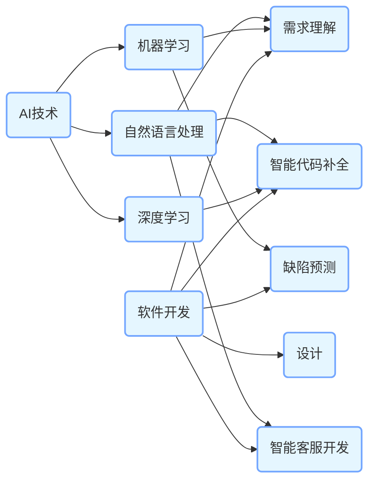

# AI技术在软件开发中的应用前景

> 关键词：AI技术、软件开发、应用前景、自动化、智能辅助

> 摘要：本文深入探讨了AI技术在软件开发领域的应用前景。随着AI技术的不断发展和成熟，其在软件开发的各个环节都展现出了巨大的潜力和价值。文章首先介绍了相关背景，包括目的范围、预期读者等内容；接着阐述了AI与软件开发的核心概念及联系；详细讲解了核心算法原理和具体操作步骤，并给出数学模型和公式；通过项目实战案例展示了AI技术在软件开发中的实际应用；分析了AI技术在不同场景下的应用；推荐了相关的学习资源、开发工具和论文著作；最后总结了未来的发展趋势与挑战，同时在附录中解答了常见问题。旨在全面呈现AI技术在软件开发中应用的现状、潜力和未来走向，为软件开发从业者和相关研究人员提供有价值的参考。

## 1. 背景介绍 
### 1.1 目的和范围
本文章的主要目的在于全面且深入地探讨AI技术在软件开发领域的应用前景。具体范围涵盖了AI技术在软件开发各个阶段的应用，包括但不限于需求分析、设计、编码、测试以及维护等环节。同时，还会研究AI技术对软件开发过程中效率、质量、成本等方面的影响，以及其在不同类型软件开发项目中的应用潜力和局限性。通过对这些内容的研究，旨在为软件开发从业者、研究者以及相关企业提供有价值的参考，帮助他们更好地理解和应用AI技术，推动软件开发行业的发展。

### 1.2 预期读者
本文预期读者主要包括以下几类人群：
1. **软件开发人员**：希望通过了解AI技术在软件开发中的应用，提升自己的编程技能和开发效率，探索新的开发思路和方法。
2. **软件架构师**：关注如何将AI技术融入软件架构设计中，以构建更智能、高效、灵活的软件系统。
3. **技术管理者**：需要了解AI技术对软件开发团队和项目管理的影响，以便做出合理的决策，优化资源配置，提高项目成功率。
4. **研究人员**：对AI技术和软件开发的交叉领域感兴趣，希望从理论和实践层面深入研究相关课题，推动该领域的学术发展。
5. **企业决策者**：关注AI技术在软件开发中的应用对企业竞争力和业务发展的影响，以便制定合适的技术战略和商业决策。

### 1.3 文档结构概述
本文将按照以下结构展开：
1. **背景介绍**：阐述文章的目的和范围、预期读者、文档结构概述以及相关术语表。
2. **核心概念与联系**：介绍AI技术和软件开发的核心概念，分析它们之间的联系，并通过文本示意图和Mermaid流程图进行展示。
3. **核心算法原理 & 具体操作步骤**：讲解AI技术在软件开发中常用的核心算法原理，并使用Python源代码详细阐述具体操作步骤。
4. **数学模型和公式 & 详细讲解 & 举例说明**：给出AI技术在软件开发中涉及的数学模型和公式，进行详细讲解并举例说明。
5. **项目实战：代码实际案例和详细解释说明**：通过具体的项目实战案例，介绍开发环境搭建、源代码详细实现和代码解读，以及对代码的分析。
6. **实际应用场景**：分析AI技术在软件开发中的各种实际应用场景。
7. **工具和资源推荐**：推荐相关的学习资源、开发工具框架以及论文著作。
8. **总结：未来发展趋势与挑战**：总结AI技术在软件开发中的未来发展趋势和面临的挑战。
9. **附录：常见问题与解答**：解答关于AI技术在软件开发中常见的问题。
10. **扩展阅读 & 参考资料**：提供相关的扩展阅读内容和参考资料。

### 1.4 术语表
#### 1.4.1 核心术语定义
1. **AI技术（Artificial Intelligence Technology）**：即人工智能技术，是指让计算机模拟人类智能的一系列技术和方法，包括机器学习、深度学习、自然语言处理、计算机视觉等。
2. **软件开发（Software Development）**：是指从软件需求分析、设计、编码、测试到维护等一系列过程，旨在开发出满足用户需求的软件产品。
3. **机器学习（Machine Learning）**：是AI技术的一个重要分支，它让计算机通过数据学习模式和规律，从而实现预测和决策等功能。
4. **深度学习（Deep Learning）**：是机器学习的一种特殊形式，它使用多层神经网络来学习数据的复杂特征和模式。
5. **自然语言处理（Natural Language Processing）**：是AI技术的一个领域，主要研究如何让计算机理解和处理人类语言。

#### 1.4.2 相关概念解释
1. **自动化测试**：利用AI技术自动生成测试用例、执行测试和分析测试结果，提高测试效率和准确性。
2. **智能代码补全**：根据开发者输入的代码片段，利用AI技术预测并推荐可能的代码，提高编码效率。
3. **需求智能分析**：通过AI技术对用户需求进行自动分析和理解，提取关键信息，为软件设计提供依据。

#### 1.4.3 缩略词列表
1. **AI**：Artificial Intelligence（人工智能）
2. **ML**：Machine Learning（机器学习）
3. **DL**：Deep Learning（深度学习）
4. **NLP**：Natural Language Processing（自然语言处理）

## 2. 核心概念与联系 

### 2.1 AI技术核心概念
AI技术是一个广泛的领域，旨在让计算机模拟人类的智能行为。其主要包括以下几个关键领域：
1. **机器学习（ML）**：通过让计算机从数据中学习模式和规律，从而实现预测和决策。例如，在图像识别中，机器学习算法可以学习大量的图像数据，从而识别出不同的物体。
2. **深度学习（DL）**：是机器学习的一种特殊形式，使用多层神经网络来学习数据的复杂特征和模式。深度学习在图像识别、语音识别和自然语言处理等领域取得了巨大的成功。
3. **自然语言处理（NLP）**：研究如何让计算机理解和处理人类语言。例如，智能客服、机器翻译等应用都依赖于自然语言处理技术。

### 2.2 软件开发核心概念
软件开发是一个复杂的过程，包括需求分析、设计、编码、测试和维护等多个阶段。
1. **需求分析**：确定软件系统的功能和性能需求，理解用户的业务流程和目标。
2. **设计**：根据需求分析的结果，设计软件的架构、模块和接口等。
3. **编码**：使用编程语言实现软件的功能。
4. **测试**：对软件进行测试，发现和修复其中的缺陷。
5. **维护**：在软件发布后，对其进行维护和更新，以满足用户的新需求和修复新发现的问题。

### 2.3 AI技术与软件开发的联系
AI技术可以在软件开发的各个阶段发挥重要作用：
1. **需求分析阶段**：AI技术可以帮助分析用户需求，通过自然语言处理技术理解用户的需求文档，提取关键信息，提高需求分析的效率和准确性。
2. **设计阶段**：AI技术可以辅助软件架构设计，根据历史项目数据和最佳实践，提供架构设计建议，优化软件的性能和可维护性。
3. **编码阶段**：智能代码补全工具利用AI技术，根据开发者输入的代码片段，预测并推荐可能的代码，提高编码效率。
4. **测试阶段**：AI技术可以自动生成测试用例，执行测试并分析测试结果，提高测试的覆盖率和效率。
5. **维护阶段**：AI技术可以帮助分析软件的运行日志，预测可能出现的问题，及时进行维护和修复。

### 2.4 文本示意图
AI技术与软件开发的联系可以用以下文本示意图表示：

AI技术
|
|-- 机器学习
|   |-- 应用于需求分析（数据挖掘需求模式）
|   |-- 应用于测试（缺陷预测）
|
|-- 深度学习
|   |-- 应用于图像识别相关软件功能开发
|   |-- 应用于语音识别相关软件功能开发
|
|-- 自然语言处理
|   |-- 应用于需求理解
|   |-- 应用于智能客服开发

软件开发
|
|-- 需求分析
|   |-- 借助AI技术理解用户需求
|
|-- 设计
|   |-- 利用AI辅助架构设计
|
|-- 编码
|   |-- 智能代码补全
|
|-- 测试
|   |-- 自动化测试用例生成
|
|-- 维护
|   |-- 问题预测与修复

### 2.5 Mermaid流程图


## 3. 核心算法原理 & 具体操作步骤 

### 3.1 机器学习算法 - 决策树算法原理
决策树是一种常用的机器学习算法，它通过对数据的特征进行划分，构建一棵决策树来进行分类或回归。决策树的每个内部节点表示一个特征上的测试，每个分支表示一个测试输出，每个叶节点表示一个类别或值。

#### 3.1.1 算法步骤
1. **特征选择**：选择一个最优的特征来划分数据集，常用的特征选择指标有信息增益、信息增益比、基尼指数等。
2. **数据集划分**：根据选择的特征对数据集进行划分，生成子数据集。
3. **递归构建决策树**：对每个子数据集重复步骤1和步骤2，直到满足终止条件，如数据集为空或所有样本属于同一类别。

#### 3.1.2 Python代码实现
```python
from sklearn.datasets import load_iris
from sklearn.model_selection import train_test_split
from sklearn.tree import DecisionTreeClassifier
from sklearn.metrics import accuracy_score

# 加载鸢尾花数据集
iris = load_iris()
X = iris.data
y = iris.target

# 划分训练集和测试集
X_train, X_test, y_train, y_test = train_test_split(X, y, test_size=0.3, random_state=42)

# 创建决策树分类器
clf = DecisionTreeClassifier()

# 训练模型
clf.fit(X_train, y_train)

# 预测
y_pred = clf.predict(X_test)

# 计算准确率
accuracy = accuracy_score(y_test, y_pred)
print(f"Accuracy: {accuracy}")
```

### 3.2 深度学习算法 - 卷积神经网络（CNN）原理
卷积神经网络是一种专门用于处理具有网格结构数据的深度学习模型，如图像和音频。CNN主要由卷积层、池化层和全连接层组成。

#### 3.2.1 算法步骤
1. **卷积层**：通过卷积核在输入数据上滑动，提取数据的特征。
2. **池化层**：对卷积层的输出进行下采样，减少数据的维度，同时保留重要的特征。
3. **全连接层**：将池化层的输出展平，连接到一个或多个全连接层，进行分类或回归。

#### 3.2.2 Python代码实现
```python
import tensorflow as tf
from tensorflow.keras import datasets, layers, models

# 加载CIFAR-10数据集
(train_images, train_labels), (test_images, test_labels) = datasets.cifar10.load_data()

# 数据预处理
train_images, test_images = train_images / 255.0, test_images / 255.0

# 构建CNN模型
model = models.Sequential()
model.add(layers.Conv2D(32, (3, 3), activation='relu', input_shape=(32, 32, 3)))
model.add(layers.MaxPooling2D((2, 2)))
model.add(layers.Conv2D(64, (3, 3), activation='relu'))
model.add(layers.MaxPooling2D((2, 2)))
model.add(layers.Conv2D(64, (3, 3), activation='relu'))
model.add(layers.Flatten())
model.add(layers.Dense(64, activation='relu'))
model.add(layers.Dense(10))

# 编译模型
model.compile(optimizer='adam',
              loss=tf.keras.losses.SparseCategoricalCrossentropy(from_logits=True),
              metrics=['accuracy'])

# 训练模型
history = model.fit(train_images, train_labels, epochs=10, 
                    validation_data=(test_images, test_labels))

# 评估模型
test_loss, test_acc = model.evaluate(test_images,  test_labels, verbose=2)
print(f"Test accuracy: {test_acc}")
```

### 3.3 自然语言处理算法 - 词嵌入（Word Embedding）原理
词嵌入是一种将文本中的词语表示为向量的技术，通过将词语映射到低维向量空间，使得语义相近的词语在向量空间中距离较近。

#### 3.3.1 算法步骤
1. **训练语料库准备**：收集大量的文本数据作为训练语料库。
2. **构建词表**：对训练语料库中的词语进行统计，构建词表。
3. **训练词嵌入模型**：使用训练语料库训练词嵌入模型，如Word2Vec、GloVe等。

#### 3.3.2 Python代码实现
```python
from gensim.models import Word2Vec
import nltk
from nltk.tokenize import word_tokenize
nltk.download('punkt')

# 示例文本
sentences = [
    "I love natural language processing",
    "Natural language processing is fascinating",
    "Machine learning and natural language processing go hand in hand"
]

# 分词
tokenized_sentences = [word_tokenize(sentence.lower()) for sentence in sentences]

# 训练Word2Vec模型
model = Word2Vec(sentences=tokenized_sentences, vector_size=100, window=5, min_count=1, workers=4)

# 获取词语的向量表示
vector = model.wv['natural']
print(f"Vector for 'natural': {vector}")
```

## 4. 数学模型和公式 & 详细讲解 & 举例说明 

### 4.1 决策树算法的数学模型和公式
#### 4.1.1 信息增益
信息增益是决策树中常用的特征选择指标，它衡量了使用某个特征划分数据集后，信息的减少量。信息增益的计算公式为：
$$
IG(D, A) = H(D) - H(D|A)
$$
其中，$IG(D, A)$ 表示使用特征 $A$ 划分数据集 $D$ 的信息增益，$H(D)$ 表示数据集 $D$ 的信息熵，$H(D|A)$ 表示在特征 $A$ 给定的条件下，数据集 $D$ 的条件熵。

信息熵的计算公式为：
$$
H(D) = -\sum_{k=1}^{K} p_k \log_2 p_k
$$
其中，$p_k$ 表示数据集 $D$ 中第 $k$ 类样本的比例，$K$ 表示类别数。

条件熵的计算公式为：
$$
H(D|A) = \sum_{i=1}^{V} \frac{|D_i|}{|D|} H(D_i)
$$
其中，$V$ 表示特征 $A$ 的取值个数，$D_i$ 表示特征 $A$ 取值为第 $i$ 个值的样本子集。

#### 4.1.2 举例说明
假设有一个数据集 $D$ 包含 10 个样本，分为 2 类，其中 6 个样本属于类别 1，4 个样本属于类别 2。则数据集 $D$ 的信息熵为：
$$
H(D) = -\frac{6}{10} \log_2 \frac{6}{10} - \frac{4}{10} \log_2 \frac{4}{10} \approx 0.971
$$

假设有一个特征 $A$，它有 2 个取值，$A_1$ 和 $A_2$。其中，$A_1$ 对应的样本子集 $D_1$ 包含 4 个样本，3 个属于类别 1，1 个属于类别 2；$A_2$ 对应的样本子集 $D_2$ 包含 6 个样本，3 个属于类别 1，3 个属于类别 2。则特征 $A$ 给定的条件下，数据集 $D$ 的条件熵为：
$$
H(D|A) = \frac{4}{10} \left(-\frac{3}{4} \log_2 \frac{3}{4} - \frac{1}{4} \log_2 \frac{1}{4}\right) + \frac{6}{10} \left(-\frac{3}{6} \log_2 \frac{3}{6} - \frac{3}{6} \log_2 \frac{3}{6}\right) \approx 0.871
$$

使用特征 $A$ 划分数据集 $D$ 的信息增益为：
$$
IG(D, A) = H(D) - H(D|A) \approx 0.971 - 0.871 = 0.1
$$

### 4.2 卷积神经网络的数学模型和公式
#### 4.2.1 卷积操作
卷积操作是卷积神经网络的核心操作，它通过卷积核在输入数据上滑动，进行元素相乘并求和。假设输入数据为 $X$，卷积核为 $W$，输出特征图为 $Y$，则卷积操作的计算公式为：
$$
Y_{i,j} = \sum_{m=0}^{M-1} \sum_{n=0}^{N-1} X_{i+m,j+n} W_{m,n} + b
$$
其中，$M$ 和 $N$ 分别表示卷积核的高度和宽度，$b$ 表示偏置。

#### 4.2.2 池化操作
池化操作通常用于对卷积层的输出进行下采样，常见的池化操作有最大池化和平均池化。以最大池化为例，假设输入特征图为 $X$，池化窗口大小为 $k \times k$，步长为 $s$，输出特征图为 $Y$，则最大池化操作的计算公式为：
$$
Y_{i,j} = \max_{m=0}^{k-1} \max_{n=0}^{k-1} X_{i \times s + m, j \times s + n}
$$

#### 4.2.3 举例说明
假设有一个输入特征图 $X$ 为：
$$
X = \begin{bmatrix}
1 & 2 & 3 \\
4 & 5 & 6 \\
7 & 8 & 9
\end{bmatrix}
$$

卷积核 $W$ 为：
$$
W = \begin{bmatrix}
1 & 0 \\
0 & 1
\end{bmatrix}
$$

偏置 $b = 0$，则卷积操作的输出特征图 $Y$ 为：
$$
Y = \begin{bmatrix}
1 \times 1 + 2 \times 0 + 4 \times 0 + 5 \times 1 & 2 \times 1 + 3 \times 0 + 5 \times 0 + 6 \times 1 \\
4 \times 1 + 5 \times 0 + 7 \times 0 + 8 \times 1 & 5 \times 1 + 6 \times 0 + 8 \times 0 + 9 \times 1
\end{bmatrix} = \begin{bmatrix}
6 & 8 \\
12 & 14
\end{bmatrix}
$$

假设池化窗口大小为 $2 \times 2$，步长为 2，则最大池化操作的输出特征图为：
$$
Y_{pool} = \begin{bmatrix}
\max(1, 2, 4, 5)
\end{bmatrix} = \begin{bmatrix}
5
\end{bmatrix}
$$

### 4.3 词嵌入的数学模型和公式
#### 4.3.1 Word2Vec模型
Word2Vec模型主要有两种架构：CBOW（Continuous Bag-of-Words）和Skip-gram。以Skip-gram为例，它的目标是根据中心词预测其上下文词。

假设输入的中心词为 $w_c$，其上下文词为 $w_{c-2}, w_{c-1}, w_{c+1}, w_{c+2}$（窗口大小为 2）。Skip-gram模型通过最大化以下概率来学习词向量：
$$
P(w_{c-2}, w_{c-1}, w_{c+1}, w_{c+2} | w_c) = \prod_{-2 \leq j \leq 2, j \neq 0} P(w_{c+j} | w_c)
$$

其中，$P(w_{c+j} | w_c)$ 可以通过softmax函数计算：
$$
P(w_{c+j} | w_c) = \frac{\exp(u_{w_{c+j}}^T v_{w_c})}{\sum_{w \in V} \exp(u_w^T v_{w_c})}
$$
其中，$v_{w_c}$ 表示中心词 $w_c$ 的输入向量，$u_{w_{c+j}}$ 表示上下文词 $w_{c+j}$ 的输出向量，$V$ 表示词表。

#### 4.3.2 举例说明
假设词表 $V$ 包含 3 个词语：$w_1, w_2, w_3$，中心词为 $w_1$，其上下文词为 $w_2$。输入向量 $v_{w_1}$ 和输出向量 $u_{w_2}$ 分别为：
$$
v_{w_1} = \begin{bmatrix}
0.1 \\
0.2
\end{bmatrix}, u_{w_2} = \begin{bmatrix}
0.3 \\
0.4
\end{bmatrix}
$$

则 $P(w_2 | w_1)$ 为：
$$
P(w_2 | w_1) = \frac{\exp(0.3 \times 0.1 + 0.4 \times 0.2)}{\exp(0.3 \times 0.1 + 0.4 \times 0.2) + \exp(u_{w_1}^T v_{w_1}) + \exp(u_{w_3}^T v_{w_1})}
$$

## 5. 项目实战：代码实际案例和详细解释说明 

### 5.1  开发环境搭建
#### 5.1.1 安装Python
首先，确保你已经安装了Python。可以从Python官方网站（https://www.python.org/downloads/）下载并安装适合你操作系统的Python版本。建议安装Python 3.6及以上版本。

#### 5.1.2 安装必要的库
使用以下命令安装项目所需的库：
```bash
pip install numpy pandas scikit-learn tensorflow gensim nltk
```
- **numpy**：用于数值计算。
- **pandas**：用于数据处理和分析。
- **scikit-learn**：提供了丰富的机器学习算法和工具。
- **tensorflow**：用于深度学习模型的开发和训练。
- **gensim**：用于自然语言处理中的词嵌入模型训练。
- **nltk**：用于自然语言处理的工具包。

### 5.2  源代码详细实现和代码解读
#### 5.2.1 需求智能分析案例
以下是一个简单的需求智能分析案例，使用自然语言处理技术对用户需求文本进行分类。

```python
import pandas as pd
from sklearn.feature_extraction.text import TfidfVectorizer
from sklearn.model_selection import train_test_split
from sklearn.naive_bayes import MultinomialNB
from sklearn.metrics import accuracy_score

# 加载数据集
data = pd.read_csv('requirements.csv')
X = data['requirement_text']
y = data['category']

# 文本特征提取
vectorizer = TfidfVectorizer()
X = vectorizer.fit_transform(X)

# 划分训练集和测试集
X_train, X_test, y_train, y_test = train_test_split(X, y, test_size=0.2, random_state=42)

# 创建分类器
clf = MultinomialNB()

# 训练模型
clf.fit(X_train, y_train)

# 预测
y_pred = clf.predict(X_test)

# 计算准确率
accuracy = accuracy_score(y_test, y_pred)
print(f"Accuracy: {accuracy}")
```

#### 代码解读
1. **数据加载**：使用`pandas`库加载包含用户需求文本和对应类别的数据集。
2. **文本特征提取**：使用`TfidfVectorizer`将文本转换为数值特征，TF-IDF（Term Frequency-Inverse Document Frequency）是一种常用的文本特征表示方法，它衡量了一个词语在文档中的重要性。
3. **数据集划分**：使用`train_test_split`将数据集划分为训练集和测试集，比例为 8:2。
4. **模型训练**：使用`MultinomialNB`（多项式朴素贝叶斯）分类器进行训练。
5. **预测和评估**：使用训练好的模型对测试集进行预测，并计算准确率。

#### 5.2.2 智能代码补全案例
以下是一个简单的智能代码补全案例，使用深度学习模型对代码片段进行预测。

```python
import tensorflow as tf
from tensorflow.keras.preprocessing.text import Tokenizer
from tensorflow.keras.preprocessing.sequence import pad_sequences
from tensorflow.keras.models import Sequential
from tensorflow.keras.layers import Embedding, LSTM, Dense

# 示例代码数据
code_samples = [
    "print('Hello, world!')",
    "for i in range(10):",
    "if x > 5:",
    "def add(a, b): return a + b"
]

# 分词
tokenizer = Tokenizer()
tokenizer.fit_on_texts(code_samples)
total_words = len(tokenizer.word_index) + 1

# 生成输入序列
input_sequences = []
for line in code_samples:
    token_list = tokenizer.texts_to_sequences([line])[0]
    for i in range(1, len(token_list)):
        n_gram_sequence = token_list[:i+1]
        input_sequences.append(n_gram_sequence)

# 填充序列
max_sequence_len = max([len(x) for x in input_sequences])
input_sequences = pad_sequences(input_sequences, maxlen=max_sequence_len, padding='pre')

# 划分输入和输出
xs, labels = input_sequences[:,:-1],input_sequences[:,-1]
ys = tf.keras.utils.to_categorical(labels, num_classes=total_words)

# 构建模型
model = Sequential()
model.add(Embedding(total_words, 10, input_length=max_sequence_len-1))
model.add(LSTM(50))
model.add(Dense(total_words, activation='softmax'))
model.compile(loss='categorical_crossentropy', optimizer='adam', metrics=['accuracy'])

# 训练模型
model.fit(xs, ys, epochs=100, verbose=1)

# 预测
seed_text = "print('"
next_words = 3
for _ in range(next_words):
    token_list = tokenizer.texts_to_sequences([seed_text])[0]
    token_list = pad_sequences([token_list], maxlen=max_sequence_len-1, padding='pre')
    predicted = model.predict_classes(token_list, verbose=0)
    output_word = ""
    for word, index in tokenizer.word_index.items():
        if index == predicted:
            output_word = word
            break
    seed_text += " " + output_word
print(seed_text)
```

#### 代码解读
1. **数据准备**：定义示例代码数据，并使用`Tokenizer`对代码进行分词。
2. **生成输入序列**：将代码转换为输入序列，每个序列包含一个代码片段的前缀和对应的下一个词语。
3. **填充序列**：使用`pad_sequences`对输入序列进行填充，使其长度一致。
4. **划分输入和输出**：将填充后的序列划分为输入和输出，输出使用`to_categorical`进行独热编码。
5. **构建模型**：使用`Sequential`模型构建一个包含嵌入层、LSTM层和全连接层的深度学习模型。
6. **训练模型**：使用训练数据对模型进行训练，训练 100 个 epoch。
7. **预测**：输入一个代码片段的前缀，使用训练好的模型预测下一个词语，并将其添加到前缀中，重复这个过程 3 次。

### 5.3  代码解读与分析
#### 5.3.1 需求智能分析案例分析
- **优点**：使用朴素贝叶斯分类器简单高效，对于文本分类任务有较好的效果。TF-IDF特征提取能够有效地表示文本的重要信息。
- **缺点**：朴素贝叶斯假设特征之间相互独立，在实际应用中可能不成立。对于复杂的文本分类任务，可能需要更复杂的模型。

#### 5.3.2 智能代码补全案例分析
- **优点**：使用深度学习模型能够学习到代码的上下文信息，对于代码补全有较好的效果。LSTM层能够处理序列数据，捕捉代码中的长距离依赖关系。
- **缺点**：训练时间较长，需要大量的代码数据进行训练。模型的可解释性较差，难以理解模型是如何做出预测的。

## 6. 实际应用场景 
### 6.1 需求分析阶段
1. **需求分类**：使用自然语言处理技术对用户需求进行分类，将需求分为功能需求、非功能需求等不同类别，帮助开发团队更好地理解和管理需求。
2. **需求提取**：从用户的自然语言描述中提取关键信息，如功能需求、性能需求、约束条件等，提高需求分析的效率和准确性。
3. **需求冲突检测**：通过分析需求之间的语义关系，检测需求之间的冲突和矛盾，及时发现和解决问题。

### 6.2 设计阶段
1. **架构推荐**：根据历史项目数据和最佳实践，使用机器学习算法为软件架构设计提供推荐，帮助架构师选择合适的架构模式和技术栈。
2. **组件复用**：通过分析已有的软件组件和模块，使用AI技术推荐可复用的组件，提高软件的可维护性和开发效率。
3. **性能优化**：使用AI技术对软件的性能进行预测和分析，为架构设计提供性能优化建议，提高软件的性能和响应速度。

### 6.3 编码阶段
1. **智能代码补全**：根据开发者输入的代码片段，使用深度学习模型预测并推荐可能的代码，减少开发者的输入工作量，提高编码效率。
2. **代码质量检查**：使用机器学习算法对代码进行静态分析，检测代码中的潜在缺陷和风格问题，提高代码的质量和可维护性。
3. **代码生成**：根据需求描述和设计文档，使用AI技术自动生成部分代码，加速软件开发过程。

### 6.4 测试阶段
1. **自动化测试用例生成**：使用AI技术自动生成测试用例，覆盖软件的各种功能和场景，提高测试的覆盖率和效率。
2. **缺陷预测**：通过分析代码的历史数据和运行日志，使用机器学习算法预测软件中可能存在的缺陷，帮助测试团队提前发现和解决问题。
3. **测试结果分析**：使用自然语言处理技术对测试结果进行分析，自动生成测试报告，提高测试结果分析的效率和准确性。

### 6.5 维护阶段
1. **问题预测**：通过分析软件的运行日志和用户反馈，使用AI技术预测软件可能出现的问题，及时进行维护和修复，减少系统故障的发生。
2. **智能客服**：使用自然语言处理技术实现智能客服，自动回答用户的问题，提供技术支持，提高用户满意度。
3. **软件更新推荐**：根据用户的使用习惯和软件的更新内容，使用AI技术为用户推荐合适的软件更新，提高软件的安全性和性能。

## 7. 工具和资源推荐
### 7.1 学习资源推荐
#### 7.1.1 书籍推荐
1. **《Python机器学习》**：由Sebastian Raschka和Vahid Mirjalili著，本书详细介绍了Python在机器学习中的应用，包括各种机器学习算法的原理和实现。
2. **《深度学习》**：由Ian Goodfellow、Yoshua Bengio和Aaron Courville著，这是深度学习领域的经典著作，全面介绍了深度学习的理论和实践。
3. **《自然语言处理入门》**：由何晗著，本书适合初学者，详细介绍了自然语言处理的基本概念和常用技术。

#### 7.1.2 在线课程
1. **Coursera上的《机器学习》课程**：由Andrew Ng教授授课，是机器学习领域的经典课程，讲解了机器学习的基本概念、算法和应用。
2. **Udemy上的《深度学习实战》课程**：该课程通过实际项目介绍了深度学习的应用，包括图像识别、语音识别等领域。
3. **edX上的《自然语言处理基础》课程**：系统介绍了自然语言处理的基础知识和技术。

#### 7.1.3 技术博客和网站
1. **Medium**：有许多AI和软件开发领域的优秀博客文章，涵盖了最新的技术和研究成果。
2. **Towards Data Science**：专注于数据科学和机器学习领域的技术分享和研究。
3. **AI Stack Exchange**：一个问答社区，用户可以在这里提问和交流AI技术相关的问题。

### 7.2 开发工具框架推荐
#### 7.2.1 IDE和编辑器
1. **PyCharm**：是一款专业的Python集成开发环境，提供了丰富的代码编辑、调试和分析功能。
2. **Visual Studio Code**：一款轻量级的代码编辑器，支持多种编程语言，有丰富的插件可以扩展功能。
3. **Jupyter Notebook**：交互式的开发环境，适合进行数据探索和模型训练。

#### 7.2.2 调试和性能分析工具
1. **TensorBoard**：TensorFlow的可视化工具，用于监控模型的训练过程和性能分析。
2. **Py-Spy**：一个性能分析工具，用于分析Python程序的性能瓶颈。
3. **pdb**：Python自带的调试器，用于调试Python代码。

#### 7.2.3 相关框架和库
1. **TensorFlow**：一个开源的深度学习框架，提供了丰富的工具和库，用于构建和训练深度学习模型。
2. **PyTorch**：另一个流行的深度学习框架，具有动态计算图的特点，易于使用和调试。
3. **Scikit-learn**：一个用于机器学习的Python库，提供了各种机器学习算法和工具。
4. **NLTK**：自然语言处理工具包，提供了丰富的语料库和处理工具。
5. **Gensim**：用于主题建模、文档索引和相似性检索的Python库，常用于自然语言处理中的词嵌入模型训练。

### 7.3 相关论文著作推荐
#### 7.3.1 经典论文
1. **《Gradient-Based Learning Applied to Document Recognition》**：Yann LeCun等人的论文，介绍了卷积神经网络在手写数字识别中的应用，是深度学习领域的经典论文。
2. **《Attention Is All You Need》**：提出了Transformer架构，在自然语言处理领域取得了巨大的成功。
3. **《Learning Representations by Back-propagating Errors》**：介绍了反向传播算法，是神经网络训练的基础。

#### 7.3.2 最新研究成果
1. **OpenAI的GPT系列论文**：介绍了生成式预训练模型的最新研究成果，在自然语言处理领域引起了广泛的关注。
2. **Google的BERT论文**：提出了双向编码器表示来自Transformer的预训练模型，在自然语言处理任务中取得了很好的效果。

#### 7.3.3 应用案例分析
1. **《AI in Software Engineering: A Systematic Mapping Study》**：对AI技术在软件工程中的应用进行了系统的研究和分析。
2. **《Automated Software Testing Using Machine Learning: A Systematic Literature Review》**：对使用机器学习进行自动化软件测试的研究进行了综述。

## 8. 总结：未来发展趋势与挑战
### 8.1 未来发展趋势
1. **自动化程度不断提高**：AI技术将在软件开发的各个环节实现更高程度的自动化，如自动需求分析、自动代码生成、自动测试等，大大提高软件开发的效率和质量。
2. **智能辅助开发**：AI将成为开发者的智能助手，提供实时的代码建议、错误提示、性能优化等功能，帮助开发者更好地完成开发任务。
3. **跨领域融合**：AI技术将与其他领域的技术，如物联网、区块链等深度融合，创造出更多创新的软件应用。
4. **个性化开发**：根据用户的需求和使用习惯，AI技术将实现个性化的软件开发，提供定制化的软件产品。

### 8.2 挑战
1. **数据质量和隐私问题**：AI技术的发展依赖于大量的数据，数据的质量和隐私问题是一个重要的挑战。如何确保数据的准确性、完整性和安全性，是需要解决的问题。
2. **模型可解释性**：许多AI模型，如深度学习模型，是黑盒模型，难以理解其决策过程和依据。在软件开发中，需要提高模型的可解释性，以便开发者和用户更好地理解和信任模型。
3. **技术人才短缺**：AI技术在软件开发中的应用需要既懂AI又懂软件开发的复合型人才，目前这类人才相对短缺，需要加强人才培养。
4. **伦理和法律问题**：AI技术的应用可能会带来一些伦理和法律问题，如算法歧视、知识产权保护等，需要建立相应的伦理和法律规范。

## 9. 附录：常见问题与解答
### 9.1 AI技术在软件开发中的应用是否会取代人类开发者？
不会。虽然AI技术可以在软件开发的某些环节实现自动化和辅助开发，但软件开发是一个创造性的过程，需要人类的智慧和经验。AI技术更多的是作为人类开发者的工具，帮助他们提高效率和质量。

### 9.2 如何选择适合的AI算法和模型？
选择适合的AI算法和模型需要考虑多个因素，如问题的类型（分类、回归、聚类等）、数据的特点（规模、维度、分布等）、计算资源和时间限制等。可以通过实验和比较不同的算法和模型，选择性能最优的方案。

### 9.3 AI技术在软件开发中的应用是否需要大量的数据？
一般来说，AI技术的性能和效果与数据的规模和质量密切相关。对于一些复杂的任务，如深度学习模型的训练，需要大量的数据来学习数据的模式和规律。但对于一些简单的任务，也可以使用少量的数据进行训练。

### 9.4 如何评估AI模型在软件开发中的性能？
可以使用多种指标来评估AI模型在软件开发中的性能，如准确率、召回率、F1值、均方误差等。具体选择哪些指标需要根据任务的类型和需求来确定。

### 9.5 AI技术在软件开发中的应用是否安全可靠？
AI技术在软件开发中的应用存在一定的安全风险，如模型被攻击、数据泄露等。为了确保安全可靠，需要采取一系列的措施，如数据加密、模型加固、安全审计等。

## 10. 扩展阅读 & 参考资料
### 10.1 扩展阅读
1. **《AI时代的软件开发革命》**：深入探讨了AI技术对软件开发行业的影响和变革。
2. **《智能软件开发实践》**：通过实际案例介绍了AI技术在软件开发中的应用实践。

### 10.2 参考资料
1. **Python官方文档**：https://docs.python.org/
2. **TensorFlow官方文档**：https://www.tensorflow.org/
3. **Scikit-learn官方文档**：https://scikit-learn.org/
4. **NLTK官方文档**：https://www.nltk.org/
5. **Gensim官方文档**：https://radimrehurek.com/gensim/