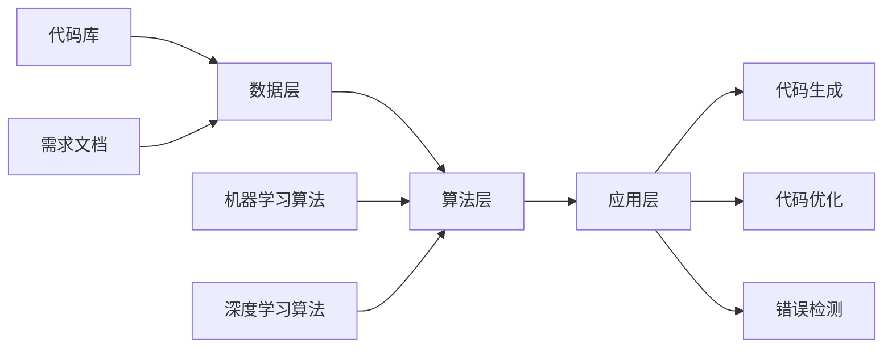

# AI技术驱动下的编程职业前景

> 关键词：AI技术、编程职业、职业前景、自动化编程、人机协作

> 摘要：本文深入探讨了AI技术驱动下编程职业的前景。首先介绍了研究的背景、目的、预期读者等内容。接着阐述了AI与编程相关的核心概念及其联系，分析了核心算法原理与操作步骤。通过数学模型和公式对相关原理进行了详细讲解并举例说明。在项目实战部分，给出实际案例及代码解读。探讨了编程职业在不同场景下的实际应用，推荐了学习资源、开发工具框架以及相关论文著作。最后总结了编程职业未来的发展趋势与挑战，并对常见问题进行了解答，提供了扩展阅读与参考资料，旨在为相关从业者和学习者全面了解AI技术驱动下的编程职业前景提供有价值的参考。

## 1. 背景介绍 
### 1.1 目的和范围
随着AI技术的飞速发展，其对编程领域产生了深远的影响。本文章的目的在于全面分析AI技术驱动下编程职业的前景，包括探讨编程职业在AI时代面临的机遇和挑战，研究AI技术如何改变编程的工作方式和职业需求。范围涵盖了从基础的AI与编程相关概念，到具体的算法原理、数学模型，再到实际项目案例和应用场景，以及对未来发展趋势的预测等多个方面。

### 1.2 预期读者
本文预期读者包括正在学习编程的学生，希望了解编程职业在AI时代发展方向的从业者，对AI与编程结合领域感兴趣的技术爱好者，以及相关企业的管理人员和决策者等。

### 1.3 文档结构概述
本文首先介绍背景信息，包括目的、预期读者和文档结构等内容。接着阐述AI与编程的核心概念及其联系，分析核心算法原理与操作步骤。通过数学模型和公式进行详细讲解并举例。在项目实战部分给出实际案例及代码解读。探讨实际应用场景，推荐学习资源、开发工具框架和相关论文著作。最后总结未来发展趋势与挑战，解答常见问题并提供扩展阅读与参考资料。

### 1.4 术语表
#### 1.4.1 核心术语定义
- **AI（Artificial Intelligence）**：即人工智能，是研究、开发用于模拟、延伸和扩展人的智能的理论、方法、技术及应用系统的一门新的技术科学。
- **编程（Programming）**：是指让计算机代为解决某个问题，对某个计算体系规定一定的运算方式，使计算体系按照该计算方式运行，并最终得到相应结果的过程。
- **自动化编程（Automated Programming）**：利用AI技术自动生成代码的过程，减少人工编写代码的工作量。
- **人机协作（Human - Machine Collaboration）**：人和机器在编程过程中相互配合，发挥各自优势，提高编程效率和质量。

#### 1.4.2 相关概念解释
- **机器学习（Machine Learning）**：是AI的一个重要分支，它致力于研究如何通过数据来改进计算机程序的性能。在编程中，机器学习可以用于代码分析、代码生成等任务。
- **深度学习（Deep Learning）**：是机器学习的一种特殊形式，通过构建深度神经网络来学习数据的复杂模式。在编程领域，深度学习可用于自然语言处理，辅助代码理解和生成。

#### 1.4.3 缩略词列表
- **AI**：Artificial Intelligence
- **ML**：Machine Learning
- **DL**：Deep Learning

## 2. 核心概念与联系 

### 核心概念原理
#### AI原理
AI的核心原理是模拟人类的智能行为，通过数据的输入、模型的训练和推理来实现各种任务。机器学习是AI实现的重要手段，它基于数据和算法构建模型，让模型从数据中学习模式和规律。例如，在图像识别中，通过大量的图像数据训练一个卷积神经网络（CNN）模型，该模型可以学习到不同图像的特征，从而实现对新图像的分类。

#### 编程原理
编程的基本原理是将人类的思维逻辑转化为计算机能够理解和执行的指令。程序员使用编程语言编写代码，代码按照一定的语法规则组织，经过编译或解释后，计算机可以执行相应的操作。例如，使用Python语言编写一个简单的加法程序：
```python
a = 5
b = 3
result = a + b
print(result)
```
这个程序将变量 `a` 和 `b` 的值相加，并将结果存储在 `result` 变量中，最后打印出结果。

### 架构的文本示意图
AI与编程的结合架构可以描述为：数据层提供各种编程相关的数据，如代码库、需求文档等；算法层包括机器学习、深度学习等AI算法，用于对数据进行处理和分析；应用层则是将AI技术应用到编程的各个环节，如代码生成、代码优化、错误检测等。

### Mermaid流程图


## 3. 核心算法原理 & 具体操作步骤 

### 核心算法原理
#### 代码生成算法
以基于深度学习的代码生成算法为例，常见的是使用Transformer架构。Transformer架构基于注意力机制，能够捕捉输入序列中的长距离依赖关系。在代码生成任务中，模型会学习大量的代码数据，将代码的语法和语义信息编码到模型中。当给定一个代码上下文或需求描述时，模型会根据学习到的模式生成相应的代码。

以下是一个简化的Python代码示例，使用 `transformers` 库进行代码生成：
```python
from transformers import AutoTokenizer, AutoModelForCausalLM

# 加载预训练的代码生成模型和分词器
tokenizer = AutoTokenizer.from_pretrained("microsoft/CodeGPT-small-py")
model = AutoModelForCausalLM.from_pretrained("microsoft/CodeGPT-small-py")

# 输入代码上下文
input_text = "def add_numbers("
input_ids = tokenizer.encode(input_text, return_tensors='pt')

# 生成代码
output = model.generate(input_ids, max_length=100, num_beams=5, no_repeat_ngram_size=2, early_stopping=True)

# 解码生成的代码
generated_code = tokenizer.decode(output[0], skip_special_tokens=True)
print(generated_code)
```
#### 错误检测算法
错误检测算法可以基于机器学习的分类算法，如支持向量机（SVM）。首先，收集大量的正确代码和错误代码作为训练数据，提取代码的特征，如代码的语法结构、变量使用情况等。然后使用SVM算法训练一个分类模型，该模型可以判断新的代码是否存在错误。

以下是一个简单的Python示例，使用 `sklearn` 库实现基于SVM的错误检测：
```python
from sklearn import svm
from sklearn.feature_extraction.text import TfidfVectorizer
import numpy as np

# 示例训练数据，0表示正确代码，1表示错误代码
train_data = ["def correct_function(): return 5", "def wrong_function(): retur 5"]
train_labels = [0, 1]

# 提取代码特征
vectorizer = TfidfVectorizer()
X_train = vectorizer.fit_transform(train_data)

# 训练SVM模型
clf = svm.SVC()
clf.fit(X_train, train_labels)

# 测试代码
test_data = ["def test_function(): return 10"]
X_test = vectorizer.transform(test_data)

# 预测结果
prediction = clf.predict(X_test)
print("预测结果:", prediction)
```

### 具体操作步骤
#### 代码生成操作步骤
1. **数据准备**：收集大量的代码数据，对数据进行清洗和预处理，如去除注释、格式化代码等。
2. **模型选择**：选择合适的预训练代码生成模型，如上述的 `CodeGPT` 模型。
3. **模型微调（可选）**：如果预训练模型不能满足特定需求，可以使用自己的代码数据对模型进行微调。
4. **输入准备**：准备好代码上下文或需求描述，将其转换为模型可以接受的输入格式。
5. **代码生成**：使用模型生成代码，并对生成的代码进行后处理，如格式化、语法检查等。

#### 错误检测操作步骤
1. **数据收集**：收集正确代码和错误代码作为训练数据。
2. **特征提取**：从代码中提取特征，如使用TF-IDF算法将代码文本转换为特征向量。
3. **模型训练**：选择合适的分类算法，如SVM，使用训练数据训练模型。
4. **模型评估**：使用测试数据评估模型的性能，如准确率、召回率等。
5. **错误检测**：将新的代码输入到训练好的模型中，进行错误检测。

## 4. 数学模型和公式 & 详细讲解 & 举例说明 

### 机器学习中的损失函数
在机器学习中，损失函数用于衡量模型预测结果与真实结果之间的差异。常见的损失函数有均方误差（MSE）和交叉熵损失（Cross - Entropy Loss）。

#### 均方误差（MSE）
均方误差的公式为：
$$MSE = \frac{1}{n}\sum_{i = 1}^{n}(y_i - \hat{y}_i)^2$$
其中，$n$ 是样本数量，$y_i$ 是真实值，$\hat{y}_i$ 是模型的预测值。

详细讲解：均方误差衡量的是预测值与真实值之间的平均平方误差。它对较大的误差惩罚较大，适用于回归问题，如预测房价、股票价格等。

举例说明：假设有一组真实值 $y = [1, 2, 3]$ 和预测值 $\hat{y} = [1.2, 1.8, 3.1]$，则均方误差为：
$$MSE=\frac{(1 - 1.2)^2+(2 - 1.8)^2+(3 - 3.1)^2}{3}=\frac{0.04 + 0.04+0.01}{3}=\frac{0.09}{3}=0.03$$

#### 交叉熵损失（Cross - Entropy Loss）
交叉熵损失的公式为：
$$H(p,q)=-\sum_{i = 1}^{n}p_i\log(q_i)$$
其中，$p$ 是真实概率分布，$q$ 是模型预测的概率分布。

详细讲解：交叉熵损失常用于分类问题，它衡量的是两个概率分布之间的差异。在分类问题中，真实标签通常用one - hot编码表示，即只有一个类别为1，其他类别为0。

举例说明：假设有一个二分类问题，真实标签 $p = [1, 0]$，模型预测的概率分布 $q = [0.8, 0.2]$，则交叉熵损失为：
$$H(p,q)=-(1\times\log(0.8)+0\times\log(0.2))=-\log(0.8)\approx0.223$$

### 深度学习中的梯度下降算法
梯度下降算法是深度学习中常用的优化算法，用于更新模型的参数以最小化损失函数。

梯度下降的更新公式为：
$$\theta_{t + 1}=\theta_t-\alpha\nabla J(\theta_t)$$
其中，$\theta$ 是模型的参数，$t$ 是迭代次数，$\alpha$ 是学习率，$\nabla J(\theta_t)$ 是损失函数 $J$ 关于参数 $\theta$ 在第 $t$ 次迭代时的梯度。

详细讲解：梯度下降算法的基本思想是沿着损失函数的负梯度方向更新参数，使得损失函数逐渐减小。学习率 $\alpha$ 控制了每次参数更新的步长，如果学习率过大，可能会导致算法无法收敛；如果学习率过小，算法收敛速度会很慢。

举例说明：假设有一个简单的线性回归模型 $y = wx + b$，损失函数为均方误差 $J(w,b)=\frac{1}{n}\sum_{i = 1}^{n}(y_i-(wx_i + b))^2$。则关于 $w$ 和 $b$ 的梯度分别为：
$$\frac{\partial J}{\partial w}=\frac{2}{n}\sum_{i = 1}^{n}(y_i-(wx_i + b))(-x_i)$$
$$\frac{\partial J}{\partial b}=\frac{2}{n}\sum_{i = 1}^{n}(y_i-(wx_i + b))(-1)$$
假设初始参数 $w = 0$，$b = 0$，学习率 $\alpha = 0.01$，经过一次迭代后，参数更新为：
$$w_1=w_0-\alpha\frac{\partial J}{\partial w}|_{w = w_0,b = b_0}$$
$$b_1=b_0-\alpha\frac{\partial J}{\partial b}|_{w = w_0,b = b_0}$$

## 5. 项目实战：代码实际案例和详细解释说明 

### 5.1  开发环境搭建
#### 安装Python
首先，需要安装Python环境。可以从Python官方网站（https://www.python.org/downloads/） 下载适合自己操作系统的Python安装包，并按照安装向导进行安装。

#### 安装必要的库
在项目中，需要安装一些必要的Python库，如 `transformers`、`sklearn` 等。可以使用 `pip` 命令进行安装：
```sh
pip install transformers scikit-learn
```

### 5.2  源代码详细实现和代码解读
#### 代码生成项目
以下是一个更完整的代码生成项目示例，使用 `transformers` 库生成Python代码：
```python
from transformers import AutoTokenizer, AutoModelForCausalLM

# 加载预训练的代码生成模型和分词器
tokenizer = AutoTokenizer.from_pretrained("microsoft/CodeGPT-small-py")
model = AutoModelForCausalLM.from_pretrained("microsoft/CodeGPT-small-py")

def generate_code(input_text, max_length=100, num_beams=5, no_repeat_ngram_size=2, early_stopping=True):
    """
    生成代码的函数
    :param input_text: 输入的代码上下文
    :param max_length: 生成代码的最大长度
    :param num_beams: 束搜索的束数
    :param no_repeat_ngram_size: 避免重复的n-gram大小
    :param early_stopping: 是否提前停止生成
    :return: 生成的代码
    """
    input_ids = tokenizer.encode(input_text, return_tensors='pt')
    output = model.generate(input_ids, max_length=max_length, num_beams=num_beams, no_repeat_ngram_size=no_repeat_ngram_size, early_stopping=early_stopping)
    generated_code = tokenizer.decode(output[0], skip_special_tokens=True)
    return generated_code

if __name__ == "__main__":
    input_text = "def calculate_area("
    code = generate_code(input_text)
    print("生成的代码:")
    print(code)
```
代码解读：
- 首先，使用 `AutoTokenizer` 和 `AutoModelForCausalLM` 从预训练模型库中加载代码生成模型和分词器。
- 定义了 `generate_code` 函数，该函数接受输入的代码上下文和一些生成参数，将输入文本编码为模型可以接受的输入格式，使用模型生成代码，最后将生成的代码解码并返回。
- 在 `if __name__ == "__main__":` 块中，定义了输入的代码上下文，调用 `generate_code` 函数生成代码并打印输出。

#### 错误检测项目
以下是一个更完整的错误检测项目示例，使用 `sklearn` 库实现基于SVM的错误检测：
```python
from sklearn import svm
from sklearn.feature_extraction.text import TfidfVectorizer
import numpy as np

# 示例训练数据，0表示正确代码，1表示错误代码
train_data = ["def correct_function(): return 5", "def wrong_function(): retur 5"]
train_labels = [0, 1]

# 提取代码特征
vectorizer = TfidfVectorizer()
X_train = vectorizer.fit_transform(train_data)

# 训练SVM模型
clf = svm.SVC()
clf.fit(X_train, train_labels)

def detect_error(code):
    """
    检测代码是否存在错误的函数
    :param code: 输入的代码
    :return: 预测结果，0表示正确，1表示错误
    """
    X_test = vectorizer.transform([code])
    prediction = clf.predict(X_test)
    return prediction[0]

if __name__ == "__main__":
    test_code = "def test_function(): return 10"
    result = detect_error(test_code)
    if result == 0:
        print("代码正确")
    else:
        print("代码存在错误")
```
代码解读：
- 首先，定义了示例训练数据和对应的标签。
- 使用 `TfidfVectorizer` 提取代码的特征，将代码文本转换为特征向量。
- 使用 `svm.SVC` 训练一个SVM分类模型。
- 定义了 `detect_error` 函数，该函数接受输入的代码，将其转换为特征向量，使用训练好的模型进行预测，并返回预测结果。
- 在 `if __name__ == "__main__":` 块中，定义了测试代码，调用 `detect_error` 函数进行错误检测，并根据预测结果输出相应的信息。

### 5.3  代码解读与分析
#### 代码生成项目分析
- **优点**：使用预训练的代码生成模型可以快速生成代码，减少人工编写代码的工作量。模型可以学习到大量代码的模式和语法，生成的代码具有一定的合理性。
- **缺点**：生成的代码可能存在逻辑错误或不符合具体需求的情况，需要人工进行检查和修改。模型的生成能力受到预训练数据和模型架构的限制。

#### 错误检测项目分析
- **优点**：基于机器学习的错误检测方法可以自动检测代码中的常见错误，提高代码质量。可以通过不断更新训练数据来提高检测的准确性。
- **缺点**：对于一些复杂的逻辑错误或语义错误，检测效果可能不佳。需要大量的训练数据来训练模型，以提高模型的泛化能力。

## 6. 实际应用场景 
### 软件开发
在软件开发过程中，AI技术可以帮助程序员提高开发效率。例如，使用代码生成工具可以快速生成基础代码框架，减少重复劳动。错误检测工具可以在代码编写过程中及时发现潜在的错误，提高代码质量。此外，AI还可以用于代码优化，通过分析代码的性能瓶颈，提供优化建议。

### 教育领域
在编程教育中，AI技术可以为学生提供个性化的学习体验。例如，智能辅导系统可以根据学生的学习进度和错误情况，提供针对性的学习建议和练习。代码自动批改系统可以快速批改学生的代码作业，减轻教师的工作量。

### 金融行业
在金融行业，编程用于开发交易系统、风险评估模型等。AI技术可以帮助程序员快速开发和优化这些系统。例如，使用AI算法进行数据挖掘和分析，为金融决策提供支持。同时，AI可以提高系统的安全性，检测潜在的安全漏洞。

### 医疗行业
在医疗行业，编程用于开发医疗信息系统、医学影像分析软件等。AI技术可以辅助程序员开发更智能的医疗软件。例如，使用深度学习算法进行医学影像分析，帮助医生更准确地诊断疾病。同时，AI可以提高医疗数据的安全性和隐私保护。

## 7. 工具和资源推荐
### 7.1 学习资源推荐
#### 7.1.1 书籍推荐
- 《Python深度学习》：介绍了Python在深度学习中的应用，包括深度学习的基本原理、模型构建和训练等内容。
- 《人工智能：一种现代的方法》：是人工智能领域的经典教材，全面介绍了人工智能的各个方面，包括搜索算法、机器学习、自然语言处理等。
- 《代码大全》：是软件开发的经典著作，涵盖了代码设计、编码规范、调试等软件开发的各个环节。

#### 7.1.2 在线课程
- Coursera上的“机器学习”课程：由斯坦福大学的Andrew Ng教授授课，是机器学习领域的经典课程，介绍了机器学习的基本算法和应用。
- edX上的“人工智能基础”课程：系统介绍了人工智能的基本概念、算法和应用。
- 中国大学MOOC上的“Python语言程序设计”课程：适合初学者学习Python语言，介绍了Python的基本语法和应用。

#### 7.1.3 技术博客和网站
- Medium：是一个技术博客平台，上面有很多关于AI和编程的优秀文章。
- Stack Overflow：是一个程序员社区，上面有很多关于编程问题的讨论和解决方案。
- 开源中国：是国内的开源技术社区，提供了很多关于AI和编程的技术文章和项目案例。

### 7.2 开发工具框架推荐
#### 7.2.1 IDE和编辑器
- PyCharm：是一款专门用于Python开发的集成开发环境，提供了代码编辑、调试、版本控制等功能。
- Visual Studio Code：是一款轻量级的代码编辑器，支持多种编程语言，有丰富的插件生态系统。
- Jupyter Notebook：是一个交互式的开发环境，适合进行数据探索和模型训练。

#### 7.2.2 调试和性能分析工具
- pdb：是Python的内置调试器，可以帮助程序员调试代码。
- cProfile：是Python的性能分析工具，可以分析代码的运行时间和函数调用次数。
- TensorBoard：是TensorFlow的可视化工具，可以用于可视化模型的训练过程和性能指标。

#### 7.2.3 相关框架和库
- TensorFlow：是一个开源的深度学习框架，提供了丰富的工具和函数，用于构建和训练深度学习模型。
- PyTorch：是另一个流行的深度学习框架，具有动态图的特点，适合快速开发和实验。
- Scikit - learn：是一个用于机器学习的Python库，提供了各种机器学习算法和工具，如分类、回归、聚类等。

### 7.3 相关论文著作推荐
#### 7.3.1 经典论文
- “Attention Is All You Need”：介绍了Transformer架构，是自然语言处理领域的经典论文。
- “ImageNet Classification with Deep Convolutional Neural Networks”：介绍了AlexNet模型，开启了深度学习在计算机视觉领域的革命。
- “Learning Representations by Back - Propagating Errors”：介绍了反向传播算法，是神经网络训练的基础。

#### 7.3.2 最新研究成果
- 关注顶级学术会议，如NeurIPS（神经信息处理系统大会）、ICML（国际机器学习会议）、CVPR（计算机视觉与模式识别会议）等，这些会议上会发表很多关于AI和编程的最新研究成果。
- 关注顶级学术期刊，如Journal of Artificial Intelligence Research（JAIR）、Artificial Intelligence等，这些期刊上会发表高质量的学术论文。

#### 7.3.3 应用案例分析
- 《AI in Practice: How 50 Successful Companies Used Artificial Intelligence to Solve Problems》：介绍了50家成功公司使用AI解决问题的案例，包括编程领域的应用案例。
- 《Machine Learning for Software Engineering》：介绍了机器学习在软件工程中的应用案例和实践经验。

## 8. 总结：未来发展趋势与挑战
### 未来发展趋势
#### 自动化编程的普及
随着AI技术的不断发展，自动化编程将越来越普及。未来，程序员可能只需要提供需求描述，AI系统就可以自动生成完整的代码。这将大大提高软件开发的效率，减少开发成本。

#### 人机协作的加强
人机协作将成为编程的主流模式。AI系统可以辅助程序员完成一些繁琐的任务，如代码生成、错误检测等，程序员则可以发挥自己的创造力和判断力，进行系统设计和架构规划。这种人机协作模式将提高编程的质量和效率。

#### 跨领域融合
编程将与其他领域，如生物学、物理学、社会学等进行更深入的融合。例如，在生物信息学中，编程可以用于分析基因数据；在物理学中，编程可以用于模拟物理现象。这种跨领域融合将为编程带来新的机遇和挑战。

### 挑战
#### 就业结构调整
自动化编程的发展可能会导致一些传统编程岗位的需求减少，程序员需要不断学习和提升自己的技能，以适应新的就业需求。例如，程序员需要掌握AI技术，具备数据分析和模型训练的能力。

#### 伦理和法律问题
AI生成的代码可能会涉及伦理和法律问题。例如，AI生成的代码可能存在知识产权纠纷，或者代码中存在歧视性内容。需要建立相应的伦理和法律框架来规范AI在编程中的应用。

#### 技术瓶颈
虽然AI技术在编程领域取得了很大的进展，但仍然存在一些技术瓶颈。例如，AI系统在理解复杂的业务需求和逻辑方面还存在不足，生成的代码质量还有待提高。需要进一步研究和开发新的AI算法和技术来解决这些问题。

## 9. 附录：常见问题与解答
### 问题1：AI会完全取代程序员吗？
答：不会。虽然AI技术可以自动生成代码和完成一些编程任务，但程序员的创造力、判断力和解决复杂问题的能力是AI无法替代的。未来，AI将与程序员进行协作，共同提高编程的效率和质量。

### 问题2：学习编程还需要学习AI技术吗？
答：需要。随着AI技术在编程领域的应用越来越广泛，掌握AI技术将成为程序员的必备技能。学习AI技术可以帮助程序员更好地利用AI工具和框架，提高编程效率和质量。

### 问题3：AI生成的代码安全吗？
答：不一定。AI生成的代码可能存在安全漏洞，需要进行安全审计和测试。同时，AI生成的代码可能会受到训练数据的影响，如果训练数据中存在安全隐患，生成的代码也可能存在问题。因此，对于AI生成的代码，需要进行严格的安全检查。

### 问题4：如何提高自己在AI技术驱动下的编程能力？
答：可以从以下几个方面提高自己的能力：学习AI和编程的基础知识，掌握相关的工具和框架；参加实践项目，积累经验；关注行业动态，学习最新的技术和方法；与同行交流，分享经验和心得。

## 10. 扩展阅读 & 参考资料
### 扩展阅读
- 《AI 3.0》：探讨了AI的发展历程、现状和未来趋势，对理解AI技术在编程领域的应用有很大的帮助。
- 《程序员的自我修养：链接、装载与库》：深入介绍了程序的编译、链接和运行过程，对于理解编程的底层原理很有帮助。

### 参考资料
- 相关学术论文和研究报告，如发表在IEEE、ACM等学术组织的论文。
- 开源项目的文档和代码，如TensorFlow、PyTorch等开源框架的官方文档。
- 技术博客和论坛上的优秀文章，如Medium、Stack Overflow等平台上的相关文章。