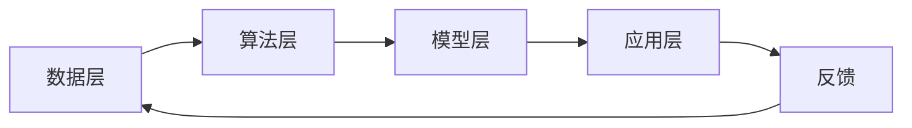

# AI时代的程序员：如何适应新挑战

> 关键词：AI时代、程序员、新挑战、适应策略、技术变革、职业发展、人工智能

> 摘要：随着人工智能时代的到来，程序员面临着前所未有的新挑战。本文旨在深入探讨AI时代给程序员带来的各种挑战，详细阐述核心概念、算法原理、数学模型等内容，并结合项目实战案例进行分析。同时，介绍相关的实际应用场景、工具和资源，为程序员提供全面的指导，帮助他们更好地适应新挑战，实现自身的职业发展。

## 1. 背景介绍 
### 1.1 目的和范围
在当今AI时代，科技发展日新月异，人工智能技术迅速崛起并广泛应用于各个领域。程序员作为技术的推动者和实践者，面临着诸多新的挑战和机遇。本文的目的在于全面剖析这些挑战，并为程序员提供切实可行的应对策略和发展方向。范围涵盖了从AI时代的技术变革对程序员的影响，到程序员在实际工作中需要掌握的核心技能、算法原理、数学模型等，还包括项目实战案例分析、实际应用场景探讨以及相关工具和资源的推荐。

### 1.2 预期读者
本文主要面向广大程序员群体，包括初级、中级和高级程序员。同时，也适合对AI技术和程序员职业发展感兴趣的技术爱好者、行业研究者以及相关领域的从业者阅读，帮助他们了解AI时代程序员所面临的挑战和应对方法。

### 1.3 文档结构概述
本文将按照以下结构进行阐述：首先介绍背景信息，包括目的、预期读者和文档结构概述等。接着深入探讨核心概念与联系，分析AI时代给程序员带来的新变化和挑战。然后详细讲解核心算法原理和具体操作步骤，并通过Python源代码进行说明。之后介绍数学模型和公式，结合实际例子进行详细讲解。再通过项目实战案例，包括开发环境搭建、源代码实现和代码解读等，帮助程序员更好地理解和应用相关知识。随后探讨实际应用场景，展示AI技术在不同领域的应用。接着推荐相关的工具和资源，包括学习资源、开发工具框架和相关论文著作等。最后总结未来发展趋势与挑战，并提供常见问题与解答以及扩展阅读和参考资料。

### 1.4 术语表
#### 1.4.1 核心术语定义
- **人工智能（Artificial Intelligence，AI）**：是一门研究如何使计算机能够模拟人类智能的学科和技术领域，包括机器学习、深度学习、自然语言处理、计算机视觉等多个子领域。
- **机器学习（Machine Learning，ML）**：是人工智能的一个重要分支，它让计算机通过数据学习模式和规律，从而实现预测、分类等任务，而无需明确的编程指令。
- **深度学习（Deep Learning，DL）**：是机器学习的一种特殊形式，基于人工神经网络，尤其是深度神经网络，通过多层的神经元结构来自动学习数据的特征和表示。
- **自然语言处理（Natural Language Processing，NLP）**：是研究如何让计算机理解、处理和生成人类语言的技术领域，包括文本分类、情感分析、机器翻译等任务。
- **计算机视觉（Computer Vision，CV）**：是研究如何让计算机从图像或视频中提取信息、理解场景和进行决策的技术领域，包括图像分类、目标检测、人脸识别等任务。

#### 1.4.2 相关概念解释
- **AI框架**：是为了方便开发者进行人工智能开发而提供的一系列工具和库，例如TensorFlow、PyTorch等，它们提供了高效的计算资源管理、模型构建和训练等功能。
- **数据标注**：是指为原始数据添加标签或注释的过程，例如在图像识别任务中，为图像中的目标对象标注类别信息，在自然语言处理任务中，为文本标注词性、实体等信息。
- **模型训练**：是指使用大量的数据对机器学习或深度学习模型进行优化的过程，通过不断调整模型的参数，使模型能够更好地拟合数据，提高预测的准确性。
- **模型部署**：是指将训练好的模型应用到实际生产环境中的过程，包括将模型部署到服务器、移动设备等不同的平台上，使其能够实时处理输入数据并输出预测结果。

#### 1.4.3 缩略词列表
- **AI**：Artificial Intelligence（人工智能）
- **ML**：Machine Learning（机器学习）
- **DL**：Deep Learning（深度学习）
- **NLP**：Natural Language Processing（自然语言处理）
- **CV**：Computer Vision（计算机视觉）
- **API**：Application Programming Interface（应用程序编程接口）
- **GPU**：Graphics Processing Unit（图形处理单元）

## 2. 核心概念与联系 

在AI时代，程序员需要理解的核心概念包括人工智能、机器学习、深度学习等，这些概念之间相互关联，共同构成了AI技术的基础。

### 核心概念原理
- **人工智能**：其原理是通过计算机模拟人类的智能行为，包括感知、学习、推理、决策等过程。人工智能系统可以根据输入的数据和预先设定的规则或模型，进行分析和处理，从而实现各种任务。
- **机器学习**：基于统计学和概率论的原理，通过对大量数据的学习，发现数据中的模式和规律。机器学习算法可以分为监督学习、无监督学习、半监督学习和强化学习等不同类型。监督学习是指在有标注数据的情况下进行学习，例如分类和回归任务；无监督学习是指在无标注数据的情况下进行学习，例如聚类和降维任务；半监督学习是结合了有标注数据和无标注数据的学习方法；强化学习是通过智能体与环境的交互，根据奖励信号来学习最优策略。
- **深度学习**：是基于人工神经网络的机器学习方法，通过构建多层的神经网络结构，自动学习数据的特征和表示。深度学习模型通常具有大量的参数，可以处理复杂的非线性关系，在图像识别、语音识别、自然语言处理等领域取得了显著的成果。

### 架构的文本示意图
AI时代的程序员需要掌握的技术架构可以分为以下几个层次：
- **数据层**：包括各种数据源，如传感器数据、文本数据、图像数据、视频数据等。数据的质量和多样性对AI模型的性能至关重要。
- **算法层**：包括机器学习算法、深度学习算法等，用于对数据进行处理和分析，提取有价值的信息和模式。
- **模型层**：是基于算法层构建的具体模型，例如卷积神经网络（CNN）用于图像识别，循环神经网络（RNN）及其变体（如LSTM、GRU）用于自然语言处理等。
- **应用层**：是将训练好的模型应用到实际场景中，例如智能安防、医疗诊断、智能交通等。

### Mermaid流程图

这个流程图展示了AI技术从数据获取到应用的整个过程，并且强调了反馈机制的重要性，通过反馈可以不断优化数据、算法和模型，提高系统的性能。

## 3. 核心算法原理 & 具体操作步骤 

### 核心算法原理
以监督学习中的线性回归算法为例，线性回归是一种简单而常用的机器学习算法，用于预测连续值的输出。其基本原理是通过找到一条直线（在多维空间中是一个超平面），使得数据点到该直线的距离之和最小。

### Python源代码详细阐述
```python
import numpy as np
import matplotlib.pyplot as plt

# 生成一些示例数据
np.random.seed(0)
X = 2 * np.random.rand(100, 1)
y = 4 + 3 * X + np.random.randn(100, 1)

# 计算线性回归的参数
X_b = np.c_[np.ones((100, 1)), X]  # 添加偏置项
theta_best = np.linalg.inv(X_b.T.dot(X_b)).dot(X_b.T).dot(y)

# 打印参数
print("theta0:", theta_best[0][0])
print("theta1:", theta_best[1][0])

# 进行预测
X_new = np.array([[0], [2]])
X_new_b = np.c_[np.ones((2, 1)), X_new]
y_predict = X_new_b.dot(theta_best)

# 绘制数据和拟合直线
plt.plot(X_new, y_predict, "r-")
plt.plot(X, y, "b.")
plt.axis([0, 2, 0, 15])
plt.show()
```
### 具体操作步骤
1. **数据准备**：生成或收集需要分析的数据，这里我们使用`np.random.rand`生成了100个随机的输入数据`X`，并根据线性关系`y = 4 + 3 * X + noise`生成对应的输出数据`y`。
2. **添加偏置项**：在输入数据`X`的基础上添加一个全为1的列，用于表示偏置项，得到`X_b`。
3. **计算参数**：使用正规方程`theta_best = np.linalg.inv(X_b.T.dot(X_b)).dot(X_b.T).dot(y)`计算线性回归的参数`theta0`和`theta1`。
4. **进行预测**：选择一些新的输入数据`X_new`，添加偏置项得到`X_new_b`，然后使用计算得到的参数进行预测，得到预测结果`y_predict`。
5. **可视化结果**：使用`matplotlib`库绘制数据点和拟合的直线，直观地展示线性回归的结果。

## 4. 数学模型和公式 & 详细讲解 & 举例说明 

### 线性回归的数学模型和公式
线性回归的数学模型可以表示为：
$$y = \theta_0 + \theta_1x_1 + \theta_2x_2 + \cdots + \theta_nx_n + \epsilon$$
其中，$y$ 是输出变量，$x_1, x_2, \cdots, x_n$ 是输入变量，$\theta_0, \theta_1, \cdots, \theta_n$ 是模型的参数，$\epsilon$ 是误差项，通常假设服从均值为0的正态分布。

在简单线性回归中，只有一个输入变量，即 $n = 1$，模型可以简化为：
$$y = \theta_0 + \theta_1x + \epsilon$$

线性回归的目标是找到一组参数 $\theta_0$ 和 $\theta_1$，使得预测值 $\hat{y}$ 与真实值 $y$ 之间的误差最小。通常使用均方误差（Mean Squared Error，MSE）作为损失函数：
$$MSE(\theta) = \frac{1}{m}\sum_{i = 1}^{m}(\hat{y}^{(i)} - y^{(i)})^2$$
其中，$m$ 是样本数量，$\hat{y}^{(i)}$ 是第 $i$ 个样本的预测值，$y^{(i)}$ 是第 $i$ 个样本的真实值。

通过最小化均方误差，可以得到参数的最优解。对于简单线性回归，参数的最优解可以通过正规方程求解：
$$\theta = (X^T X)^{-1} X^T y$$
其中，$X$ 是输入数据矩阵，$y$ 是输出数据向量。

### 详细讲解
均方误差是一种常用的损失函数，它衡量了预测值与真实值之间的平均平方误差。通过最小化均方误差，可以使得模型的预测结果尽可能接近真实值。正规方程是一种直接求解参数最优解的方法，它通过矩阵运算得到参数的解析解。

### 举例说明
假设我们有以下数据集：
| $x$ | $y$ |
| --- | --- |
| 1 | 3 |
| 2 | 5 |
| 3 | 7 |

我们可以将输入数据 $X$ 表示为：
$$X = \begin{bmatrix} 1 & 1 \\ 1 & 2 \\ 1 & 3 \end{bmatrix}$$
输出数据 $y$ 表示为：
$$y = \begin{bmatrix} 3 \\ 5 \\ 7 \end{bmatrix}$$

使用正规方程求解参数：
$$\theta = (X^T X)^{-1} X^T y$$
首先计算 $X^T X$：
$$X^T X = \begin{bmatrix} 1 & 1 & 1 \\ 1 & 2 & 3 \end{bmatrix} \begin{bmatrix} 1 & 1 \\ 1 & 2 \\ 1 & 3 \end{bmatrix} = \begin{bmatrix} 3 & 6 \\ 6 & 14 \end{bmatrix}$$
然后计算 $(X^T X)^{-1}$：
$$(X^T X)^{-1} = \frac{1}{3 \times 14 - 6 \times 6} \begin{bmatrix} 14 & -6 \\ -6 & 3 \end{bmatrix} = \begin{bmatrix} \frac{7}{3} & -1 \\ -1 & \frac{1}{2} \end{bmatrix}$$
接着计算 $X^T y$：
$$X^T y = \begin{bmatrix} 1 & 1 & 1 \\ 1 & 2 & 3 \end{bmatrix} \begin{bmatrix} 3 \\ 5 \\ 7 \end{bmatrix} = \begin{bmatrix} 15 \\ 34 \end{bmatrix}$$
最后计算 $\theta$：
$$\theta = (X^T X)^{-1} X^T y = \begin{bmatrix} \frac{7}{3} & -1 \\ -1 & \frac{1}{2} \end{bmatrix} \begin{bmatrix} 15 \\ 34 \end{bmatrix} = \begin{bmatrix} 1 \\ 2 \end{bmatrix}$$
因此，线性回归模型为 $y = 1 + 2x$。

## 5. 项目实战：代码实际案例和详细解释说明 

### 5.1  开发环境搭建
- **操作系统**：推荐使用Linux系统，如Ubuntu，也可以使用Windows或macOS系统。
- **Python环境**：安装Python 3.6及以上版本，可以使用Anaconda来管理Python环境。
- **开发工具**：推荐使用PyCharm作为集成开发环境（IDE），也可以使用VS Code等轻量级编辑器。
- **依赖库**：安装必要的Python库，如`numpy`、`pandas`、`matplotlib`、`scikit-learn`等。可以使用以下命令进行安装：
```sh
pip install numpy pandas matplotlib scikit-learn
```

### 5.2  源代码详细实现和代码解读
以下是一个使用`scikit-learn`库实现线性回归的示例代码：
```python
import numpy as np
from sklearn.linear_model import LinearRegression
from sklearn.model_selection import train_test_split
from sklearn.metrics import mean_squared_error
import matplotlib.pyplot as plt

# 生成一些示例数据
np.random.seed(0)
X = 2 * np.random.rand(100, 1)
y = 4 + 3 * X + np.random.randn(100, 1)

# 划分训练集和测试集
X_train, X_test, y_train, y_test = train_test_split(X, y, test_size=0.2, random_state=42)

# 创建线性回归模型
model = LinearRegression()

# 训练模型
model.fit(X_train, y_train)

# 进行预测
y_pred = model.predict(X_test)

# 计算均方误差
mse = mean_squared_error(y_test, y_pred)
print("Mean Squared Error:", mse)

# 绘制数据和拟合直线
plt.plot(X_test, y_pred, "r-")
plt.plot(X_test, y_test, "b.")
plt.axis([0, 2, 0, 15])
plt.show()
```
### 代码解读
1. **数据生成**：使用`np.random.rand`生成100个随机的输入数据`X`，并根据线性关系`y = 4 + 3 * X + noise`生成对应的输出数据`y`。
2. **数据划分**：使用`train_test_split`函数将数据划分为训练集和测试集，测试集占总数据的20%。
3. **模型创建**：使用`LinearRegression`类创建一个线性回归模型。
4. **模型训练**：使用`fit`方法对模型进行训练，传入训练集的输入数据`X_train`和输出数据`y_train`。
5. **模型预测**：使用`predict`方法对测试集的输入数据`X_test`进行预测，得到预测结果`y_pred`。
6. **误差计算**：使用`mean_squared_error`函数计算预测结果`y_pred`与真实值`y_test`之间的均方误差。
7. **可视化结果**：使用`matplotlib`库绘制测试集的数据点和拟合的直线，直观地展示线性回归的结果。

### 5.3  代码解读与分析
通过这个示例代码，我们可以看到使用`scikit-learn`库实现线性回归非常方便。`scikit-learn`提供了丰富的机器学习算法和工具，使得开发者可以快速地进行模型的创建、训练和评估。在实际应用中，我们可以根据具体的需求选择不同的算法和参数，对模型进行优化，提高模型的性能。

## 6. 实际应用场景 

### 金融领域
- **风险评估**：通过分析客户的信用历史、财务状况等数据，使用机器学习模型预测客户的违约风险，帮助金融机构做出合理的信贷决策。
- **股票价格预测**：利用历史股票价格数据、宏观经济数据等，构建时间序列模型或深度学习模型，预测股票价格的走势，为投资者提供参考。

### 医疗领域
- **疾病诊断**：通过分析患者的病历、影像数据等，使用深度学习模型辅助医生进行疾病的诊断，提高诊断的准确性和效率。
- **药物研发**：利用机器学习算法筛选潜在的药物分子，预测药物的疗效和副作用，加速药物研发的进程。

### 交通领域
- **智能交通系统**：通过分析交通流量、路况等数据，使用人工智能算法优化交通信号控制，缓解交通拥堵。
- **自动驾驶**：利用计算机视觉、传感器融合等技术，实现车辆的自主驾驶，提高交通安全和效率。

### 教育领域
- **个性化学习**：通过分析学生的学习行为、成绩等数据，使用机器学习算法为学生提供个性化的学习建议和资源推荐，提高学习效果。
- **智能教学评估**：利用自然语言处理技术对学生的作业、考试答案等进行自动评估，减轻教师的工作负担。

## 7. 工具和资源推荐
### 7.1 学习资源推荐
#### 7.1.1 书籍推荐
- 《机器学习》（周志华）：这本书全面介绍了机器学习的基本概念、算法和应用，是机器学习领域的经典教材。
- 《深度学习》（Ian Goodfellow、Yoshua Bengio、Aaron Courville）：这本书系统地介绍了深度学习的理论和实践，适合有一定机器学习基础的读者深入学习。
- 《Python机器学习实战》（Sebastian Raschka）：这本书通过实际案例介绍了如何使用Python实现机器学习算法，适合初学者快速上手。

#### 7.1.2 在线课程
- Coursera上的“机器学习”课程（Andrew Ng）：这是一门非常经典的机器学习课程，由斯坦福大学的Andrew Ng教授授课，讲解深入浅出，适合初学者学习。
- edX上的“深度学习微硕士项目”：这是一系列深度学习相关的课程，包括深度学习基础、卷积神经网络、循环神经网络等内容，适合有一定基础的读者深入学习。
- 中国大学MOOC上的“人工智能基础”课程：这门课程介绍了人工智能的基本概念、算法和应用，适合初学者了解人工智能领域。

#### 7.1.3 技术博客和网站
- Medium：这是一个技术博客平台，有很多关于人工智能、机器学习、深度学习等领域的优质文章。
- Towards Data Science：这是一个专注于数据科学和机器学习的博客网站，有很多实用的教程和案例分享。
- Kaggle：这是一个数据科学竞赛平台，上面有很多数据集和优秀的解决方案，可以学习到其他开发者的经验和技巧。

### 7.2 开发工具框架推荐
#### 7.2.1 IDE和编辑器
- PyCharm：这是一款专业的Python集成开发环境，提供了丰富的代码编辑、调试、版本控制等功能，适合大型项目的开发。
- VS Code：这是一款轻量级的代码编辑器，支持多种编程语言和插件扩展，适合快速开发和学习。
- Jupyter Notebook：这是一个交互式的编程环境，适合数据探索、模型训练和可视化等任务。

#### 7.2.2 调试和性能分析工具
- Py-Spy：这是一个Python性能分析工具，可以实时监控Python程序的CPU使用率、内存占用等信息，帮助开发者找出性能瓶颈。
- TensorBoard：这是TensorFlow提供的一个可视化工具，可以用于可视化模型的训练过程、损失函数曲线、模型结构等信息。
- cProfile：这是Python标准库中的一个性能分析模块，可以分析Python程序的函数调用时间和次数，帮助开发者优化代码性能。

#### 7.2.3 相关框架和库
- TensorFlow：这是一个开源的机器学习框架，由Google开发，提供了丰富的工具和库，支持分布式训练和模型部署。
- PyTorch：这是一个开源的深度学习框架，由Facebook开发，具有动态计算图的特点，适合快速原型开发和研究。
- scikit-learn：这是一个简单易用的机器学习库，提供了各种机器学习算法和工具，适合初学者快速上手。

### 7.3 相关论文著作推荐
#### 7.3.1 经典论文
- “Gradient-based learning applied to document recognition”（Yann LeCun、Léon Bottou、Yoshua Bengio、Patrick Haffner）：这篇论文介绍了卷积神经网络（CNN）的基本原理和应用，是计算机视觉领域的经典论文。
- “Long Short-Term Memory”（Sepp Hochreiter、Jürgen Schmidhuber）：这篇论文提出了长短期记忆网络（LSTM），解决了循环神经网络（RNN）中的梯度消失问题，是自然语言处理领域的经典论文。
- “Attention Is All You Need”（Ashish Vaswani、Noam Shazeer、Niki Parmar等）：这篇论文提出了Transformer架构，是自然语言处理领域的重大突破，推动了语言模型的发展。

#### 7.3.2 最新研究成果
- 关注顶级学术会议如NeurIPS（神经信息处理系统大会）、ICML（国际机器学习会议）、CVPR（计算机视觉与模式识别会议）等的最新研究成果，了解人工智能领域的前沿技术和发展趋势。
- 关注知名学术期刊如Journal of Artificial Intelligence Research（JAIR）、Artificial Intelligence等的最新论文，获取高质量的研究成果。

#### 7.3.3 应用案例分析
- 关注各大科技公司的技术博客，如Google AI Blog、Facebook AI Research等，了解他们在人工智能领域的应用案例和实践经验。
- 关注开源项目和竞赛平台，如Kaggle、GitHub等，学习其他开发者的优秀解决方案和应用案例。

## 8. 总结：未来发展趋势与挑战

### 未来发展趋势
- **融合发展**：人工智能将与物联网、大数据、区块链等技术深度融合，创造出更多的创新应用和商业模式。
- **智能化升级**：各个行业将加速智能化升级，实现生产自动化、管理智能化、服务个性化，提高生产效率和质量。
- **开源生态**：开源社区将继续发挥重要作用，推动人工智能技术的快速发展和普及，降低技术门槛，促进技术创新。
- **伦理与法律**：随着人工智能的广泛应用，伦理和法律问题将越来越受到关注，需要建立相应的规范和准则，保障人工智能的健康发展。

### 挑战
- **技术难题**：虽然人工智能技术取得了显著的进展，但仍然面临一些技术难题，如模型的可解释性、数据的隐私保护、对抗攻击等，需要进一步研究和解决。
- **人才短缺**：人工智能领域的发展需要大量的专业人才，但目前人才短缺的问题比较突出，需要加强人才培养和引进。
- **社会影响**：人工智能的发展可能会对就业市场、社会结构等产生影响，需要制定相应的政策和措施，应对这些挑战，促进社会的和谐发展。

## 9. 附录：常见问题与解答
### 问题1：AI时代程序员需要掌握哪些新技能？
答：AI时代程序员需要掌握机器学习、深度学习、自然语言处理、计算机视觉等相关技能，熟悉AI框架和工具，如TensorFlow、PyTorch等，同时还需要具备数据处理和分析的能力。

### 问题2：如何学习人工智能相关知识？
答：可以通过阅读相关书籍、参加在线课程、实践项目等方式学习人工智能相关知识。推荐阅读《机器学习》《深度学习》等书籍，参加Coursera上的“机器学习”课程等，同时可以在Kaggle等平台上实践项目，提高自己的能力。

### 问题3：AI技术对程序员的职业发展有哪些影响？
答：AI技术为程序员带来了新的机遇和挑战。一方面，掌握AI技术可以拓宽程序员的职业发展路径，如从事AI算法研发、模型部署等工作；另一方面，程序员需要不断学习和更新知识，以适应技术的发展变化。

### 问题4：如何解决AI模型的可解释性问题？
答：目前有一些方法可以提高AI模型的可解释性，如使用决策树、线性回归等可解释性较强的模型，或者使用模型解释工具，如LIME、SHAP等。此外，还可以从数据和特征的角度进行分析，提高模型的可解释性。

## 10. 扩展阅读 & 参考资料
- 《人工智能：现代方法》（Stuart Russell、Peter Norvig）
- 《数据挖掘：概念与技术》（Jiawei Han、Jian Pei、Jianwen Yin）
- https://www.tensorflow.org/
- https://pytorch.org/
- https://scikit-learn.org/
- https://www.kaggle.com/
- https://www.coursera.org/
- https://www.edx.org/
- https://www.medium.com/
- https://towardsdatascience.com/ 