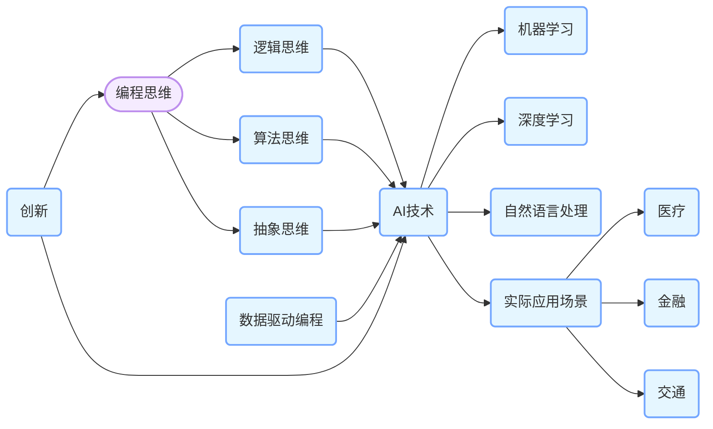

# AI时代的编程思维与创新

> 关键词：AI时代、编程思维、创新、人工智能、算法、数据驱动、智能编程

> 摘要：本文聚焦于AI时代的编程思维与创新这一核心主题。在AI技术迅猛发展的当下，编程领域正经历着深刻变革。文章旨在深入剖析AI时代编程思维的转变以及由此带来的创新机遇。通过介绍背景知识，阐述核心概念与联系，讲解核心算法原理及具体操作步骤，探讨数学模型和公式，结合项目实战案例，分析实际应用场景，推荐相关工具和资源等内容，全面展现AI时代编程的新特点和新趋势，同时对未来发展趋势与挑战进行总结，为编程从业者和相关爱好者提供有价值的参考，助力其在AI时代更好地进行编程实践和创新。

## 1. 背景介绍 
### 1.1 目的和范围
在当今科技飞速发展的时代，人工智能（AI）已经成为推动各个领域变革的关键力量。编程作为实现AI应用的基础手段，其思维方式和方法也在不断演进。本文的目的在于深入探讨AI时代编程思维的变化以及如何在这个时代实现编程的创新。范围涵盖了从AI时代编程思维的理论基础到实际应用案例，从核心算法原理到相关工具资源的推荐，旨在为读者提供一个全面且深入的关于AI时代编程思维与创新的知识体系。

### 1.2 预期读者
本文预期读者包括但不限于编程初学者、有一定经验的程序员、软件架构师、CTO等编程领域的专业人士，以及对AI和编程感兴趣的科研人员、学生等。无论您是希望了解AI时代编程新趋势的新手，还是寻求在编程领域进一步创新突破的资深从业者，都能从本文中获得有价值的信息和启发。

### 1.3 文档结构概述
本文将按照以下结构展开：首先介绍背景知识，包括目的、预期读者和文档结构概述等内容；接着阐述AI时代编程的核心概念与联系，通过文本示意图和Mermaid流程图展示其原理和架构；然后详细讲解核心算法原理及具体操作步骤，使用Python源代码进行阐述；再探讨相关的数学模型和公式，并举例说明；之后通过项目实战案例，介绍开发环境搭建、源代码实现和代码解读；分析实际应用场景；推荐相关的工具和资源；最后总结未来发展趋势与挑战，提供常见问题与解答以及扩展阅读和参考资料。

### 1.4 术语表
#### 1.4.1 核心术语定义
- **AI（Artificial Intelligence）**：即人工智能，是指计算机系统能够执行通常需要人类智能才能完成的任务，如学习、推理、解决问题等。
- **编程思维**：是指运用计算机科学的概念、方法和工具来解决问题的思维方式，包括逻辑思维、算法思维、抽象思维等。
- **创新编程**：在编程过程中引入新的理念、方法、技术或应用场景，以创造出更高效、更有价值的软件或系统。
- **数据驱动编程**：基于数据的分析和处理来驱动程序的设计和开发，通过对大量数据的挖掘和利用来实现更智能的功能。
- **机器学习（Machine Learning）**：是AI的一个重要分支，让计算机通过数据和经验来自动学习和改进性能，而无需明确的编程指令。

#### 1.4.2 相关概念解释
- **深度学习（Deep Learning）**：是机器学习的一种特殊形式，基于神经网络模型，通过多层神经元的组合来学习数据的复杂模式和特征。
- **自然语言处理（Natural Language Processing，NLP）**：研究如何让计算机理解、处理和生成人类语言，是AI在语言领域的重要应用。
- **计算机视觉（Computer Vision）**：旨在让计算机从图像或视频中提取信息，实现图像识别、目标检测等功能。

#### 1.4.3 缩略词列表
- **AI**：Artificial Intelligence（人工智能）
- **ML**：Machine Learning（机器学习）
- **DL**：Deep Learning（深度学习）
- **NLP**：Natural Language Processing（自然语言处理）
- **CV**：Computer Vision（计算机视觉）

## 2. 核心概念与联系 

### 2.1 编程思维在AI时代的转变
在传统编程时代，程序员主要依据明确的规则和逻辑来编写程序，程序的行为是确定性的。而在AI时代，编程思维发生了重大转变。由于AI系统通常需要处理复杂的、不确定的问题，编程不再仅仅是实现固定的算法，而是要构建能够学习和适应的系统。例如，在机器学习中，程序员需要设计模型结构和训练算法，让模型通过大量数据自动学习模式和规律，而不是手动编写所有的决策规则。

### 2.2 AI与编程的融合
AI为编程带来了新的能力和可能性。一方面，AI技术可以用于辅助编程，如智能代码补全、代码纠错等。另一方面，编程是实现AI算法和应用的基础，通过编写代码可以实现各种AI模型，如神经网络、决策树等。这种融合使得编程变得更加智能和高效，同时也拓展了编程的应用领域。

### 2.3 创新在AI时代编程中的重要性
在AI时代，技术发展迅速，市场竞争激烈。创新成为了编程领域保持竞争力的关键。创新编程可以体现在多个方面，如开发新的AI算法、应用新的编程范式、解决新的实际问题等。通过创新，程序员可以创造出更具价值的软件和系统，满足不断变化的市场需求。

### 2.4 核心概念原理和架构的文本示意图
AI时代的编程思维与创新涉及多个核心概念，它们之间相互关联，形成一个复杂的架构。以下是一个简单的文本示意图：

编程思维（逻辑思维、算法思维、抽象思维等）作为基础，支撑着AI技术（机器学习、深度学习、自然语言处理等）的实现。AI技术与数据驱动编程相结合，通过对大量数据的分析和处理，实现智能系统的开发。创新则贯穿于整个过程中，推动编程思维的不断进化和AI技术的不断发展，最终应用于各种实际场景（如医疗、金融、交通等）。

### 2.5 Mermaid流程图


## 3. 核心算法原理 & 具体操作步骤 

### 3.1 机器学习算法原理 - 以线性回归为例
线性回归是一种简单而常用的机器学习算法，用于预测连续数值。其基本原理是通过寻找一条最佳的直线来拟合数据点，使得数据点到直线的误差最小。

#### 3.1.1 数学原理
线性回归模型可以表示为：
$$y = \theta_0 + \theta_1x_1 + \theta_2x_2 + \cdots + \theta_nx_n + \epsilon$$
其中，$y$ 是预测值，$x_1, x_2, \cdots, x_n$ 是输入特征，$\theta_0, \theta_1, \cdots, \theta_n$ 是模型的参数，$\epsilon$ 是误差项。

为了找到最佳的参数 $\theta$，通常使用最小二乘法，即最小化预测值与真实值之间的均方误差（MSE）：
$$MSE = \frac{1}{m}\sum_{i=1}^{m}(y^{(i)} - \hat{y}^{(i)})^2$$
其中，$m$ 是样本数量，$y^{(i)}$ 是第 $i$ 个样本的真实值，$\hat{y}^{(i)}$ 是第 $i$ 个样本的预测值。

#### 3.1.2 Python代码实现
```python
import numpy as np

# 生成一些示例数据
X = 2 * np.random.rand(100, 1)
y = 4 + 3 * X + np.random.randn(100, 1)

# 添加偏置项
X_b = np.c_[np.ones((100, 1)), X]

# 使用正规方程求解参数
theta_best = np.linalg.inv(X_b.T.dot(X_b)).dot(X_b.T).dot(y)

print("模型参数：", theta_best)

# 进行预测
X_new = np.array([[0], [2]])
X_new_b = np.c_[np.ones((2, 1)), X_new]
y_predict = X_new_b.dot(theta_best)

print("预测值：", y_predict)
```

### 3.2 深度学习算法原理 - 以简单的神经网络为例
神经网络是深度学习的核心模型，由多个神经元组成。每个神经元接收输入，经过加权求和和激活函数处理后输出结果。

#### 3.2.1 数学原理
一个简单的神经网络包含输入层、隐藏层和输出层。假设输入层有 $n$ 个神经元，隐藏层有 $m$ 个神经元，输出层有 $k$ 个神经元。对于隐藏层的第 $j$ 个神经元，其输入为：
$$z_j = \sum_{i=1}^{n}w_{ij}x_i + b_j$$
其中，$w_{ij}$ 是输入层第 $i$ 个神经元到隐藏层第 $j$ 个神经元的权重，$x_i$ 是输入层第 $i$ 个神经元的输入，$b_j$ 是隐藏层第 $j$ 个神经元的偏置。

经过激活函数（如Sigmoid函数）处理后，隐藏层第 $j$ 个神经元的输出为：
$$a_j = \sigma(z_j) = \frac{1}{1 + e^{-z_j}}$$

输出层的计算方式类似，最终得到网络的输出。

#### 3.2.2 Python代码实现
```python
import numpy as np

# 定义Sigmoid激活函数
def sigmoid(x):
    return 1 / (1 + np.exp(-x))

# 定义神经网络类
class NeuralNetwork:
    def __init__(self, input_size, hidden_size, output_size):
        self.input_size = input_size
        self.hidden_size = hidden_size
        self.output_size = output_size
        
        # 初始化权重
        self.W1 = np.random.randn(self.input_size, self.hidden_size)
        self.b1 = np.zeros((1, self.hidden_size))
        self.W2 = np.random.randn(self.hidden_size, self.output_size)
        self.b2 = np.zeros((1, self.output_size))
        
    def forward(self, X):
        # 前向传播
        self.z1 = np.dot(X, self.W1) + self.b1
        self.a1 = sigmoid(self.z1)
        self.z2 = np.dot(self.a1, self.W2) + self.b2
        self.a2 = sigmoid(self.z2)
        return self.a2

# 创建一个神经网络实例
input_size = 2
hidden_size = 3
output_size = 1
nn = NeuralNetwork(input_size, hidden_size, output_size)

# 生成一些示例输入
X = np.array([[0.5, 0.3]])

# 进行前向传播
output = nn.forward(X)
print("神经网络输出：", output)
```

### 3.3 具体操作步骤
#### 3.3.1 数据准备
在使用机器学习或深度学习算法之前，需要准备好数据。这包括收集数据、清洗数据、划分训练集和测试集等步骤。

#### 3.3.2 模型选择和设计
根据问题的类型和数据的特点，选择合适的模型，如线性回归、神经网络等。并设计模型的结构，如神经网络的层数、神经元数量等。

#### 3.3.3 模型训练
使用训练数据对模型进行训练，通过优化算法（如梯度下降）调整模型的参数，使得模型的损失函数最小化。

#### 3.3.4 模型评估
使用测试数据对训练好的模型进行评估，计算模型的性能指标（如准确率、均方误差等），评估模型的泛化能力。

#### 3.3.5 模型优化和部署
根据评估结果，对模型进行优化，如调整模型参数、增加数据等。最后将优化后的模型部署到实际应用中。

## 4. 数学模型和公式 & 详细讲解 & 举例说明 

### 4.1 线性回归的数学模型和公式
#### 4.1.1 模型表示
如前面所述，线性回归模型可以表示为：
$$y = \theta_0 + \theta_1x_1 + \theta_2x_2 + \cdots + \theta_nx_n + \epsilon$$
其中，$\theta_0$ 是截距项，$\theta_1, \theta_2, \cdots, \theta_n$ 是斜率项，$x_1, x_2, \cdots, x_n$ 是输入特征，$\epsilon$ 是误差项，服从均值为 0 的正态分布。

#### 4.1.2 最小二乘法求解
最小二乘法的目标是最小化均方误差（MSE）：
$$MSE = \frac{1}{m}\sum_{i=1}^{m}(y^{(i)} - \hat{y}^{(i)})^2$$
其中，$y^{(i)}$ 是第 $i$ 个样本的真实值，$\hat{y}^{(i)}$ 是第 $i$ 个样本的预测值。

将线性回归模型代入 MSE 公式中，得到：
$$MSE = \frac{1}{m}\sum_{i=1}^{m}(y^{(i)} - (\theta_0 + \theta_1x_1^{(i)} + \theta_2x_2^{(i)} + \cdots + \theta_nx_n^{(i)}))^2$$

为了找到使 MSE 最小的参数 $\theta$，可以对 MSE 关于 $\theta$ 求偏导数，并令偏导数为 0。对于简单的一元线性回归（$n = 1$），可以得到正规方程：
$$\theta = (X^T X)^{-1} X^T y$$
其中，$X$ 是输入特征矩阵，$y$ 是真实值向量。

#### 4.1.3 举例说明
假设有以下数据：
| $x$ | $y$ |
| --- | --- |
| 1 | 3 |
| 2 | 5 |
| 3 | 7 |

我们可以使用线性回归模型来拟合这些数据。首先，将数据表示为矩阵形式：
$$X = \begin{bmatrix} 1 & 1 \\ 1 & 2 \\ 1 & 3 \end{bmatrix}, y = \begin{bmatrix} 3 \\ 5 \\ 7 \end{bmatrix}$$

然后，使用正规方程求解参数：
```python
import numpy as np

X = np.array([[1, 1], [1, 2], [1, 3]])
y = np.array([[3], [5], [7]])

theta = np.linalg.inv(X.T.dot(X)).dot(X.T).dot(y)
print("模型参数：", theta)
```

### 4.2 神经网络的数学模型和公式
#### 4.2.1 神经元模型
一个神经元可以看作是一个简单的计算单元，其输入为多个特征值，经过加权求和和激活函数处理后输出结果。其数学模型可以表示为：
$$z = \sum_{i=1}^{n}w_ix_i + b$$
$$a = \sigma(z)$$
其中，$w_i$ 是权重，$x_i$ 是输入特征，$b$ 是偏置，$\sigma$ 是激活函数。

#### 4.2.2 前向传播
在神经网络中，前向传播是指从输入层到输出层的计算过程。对于一个包含输入层、隐藏层和输出层的神经网络，其前向传播过程可以表示为：
$$Z^{[1]} = W^{[1]}X + b^{[1]}$$
$$A^{[1]} = \sigma(Z^{[1]})$$
$$Z^{[2]} = W^{[2]}A^{[1]} + b^{[2]}$$
$$A^{[2]} = \sigma(Z^{[2]})$$
其中，$W^{[l]}$ 是第 $l$ 层的权重矩阵，$b^{[l]}$ 是第 $l$ 层的偏置向量，$Z^{[l]}$ 是第 $l$ 层的输入，$A^{[l]}$ 是第 $l$ 层的输出。

#### 4.2.3 反向传播
反向传播是神经网络训练的关键步骤，用于计算梯度并更新权重。其基本思想是通过链式法则，从输出层开始，逐步计算每一层的梯度。

假设损失函数为 $L$，则对于第 $l$ 层的权重 $W^{[l]}$ 和偏置 $b^{[l]}$ 的梯度可以表示为：
$$\frac{\partial L}{\partial W^{[l]}} = \frac{\partial L}{\partial Z^{[l]}} (A^{[l-1]})^T$$
$$\frac{\partial L}{\partial b^{[l]}} = \sum_{i=1}^{m} \frac{\partial L}{\partial Z^{[l]}}^{(i)}$$

#### 4.2.4 举例说明
假设有一个简单的神经网络，输入层有 2 个神经元，隐藏层有 3 个神经元，输出层有 1 个神经元。输入数据为 $X = \begin{bmatrix} 0.5 \\ 0.3 \end{bmatrix}$，权重和偏置随机初始化。

```python
import numpy as np

# 定义Sigmoid激活函数
def sigmoid(x):
    return 1 / (1 + np.exp(-x))

# 初始化权重和偏置
W1 = np.random.randn(3, 2)
b1 = np.zeros((3, 1))
W2 = np.random.randn(1, 3)
b2 = np.zeros((1, 1))

# 输入数据
X = np.array([[0.5], [0.3]])

# 前向传播
Z1 = np.dot(W1, X) + b1
A1 = sigmoid(Z1)
Z2 = np.dot(W2, A1) + b2
A2 = sigmoid(Z2)

print("神经网络输出：", A2)
```

## 5. 项目实战：代码实际案例和详细解释说明 

### 5.1  开发环境搭建
#### 5.1.1 安装Python
首先需要安装Python解释器。可以从Python官方网站（https://www.python.org/downloads/） 下载适合自己操作系统的Python版本。建议安装Python 3.6及以上版本。

#### 5.1.2 安装必要的库
在AI编程中，常用的库包括NumPy、Pandas、Scikit-learn、TensorFlow、PyTorch等。可以使用pip或conda来安装这些库。例如，使用pip安装NumPy和Scikit-learn：
```sh
pip install numpy scikit-learn
```

#### 5.1.3 选择开发工具
可以选择适合自己的开发工具，如PyCharm、Jupyter Notebook等。PyCharm是一款功能强大的Python集成开发环境（IDE），提供了代码编辑、调试、自动补全等功能。Jupyter Notebook则是一个交互式的开发环境，适合进行数据探索和模型实验。

### 5.2  源代码详细实现和代码解读
#### 5.2.1 项目背景
假设我们要构建一个简单的手写数字识别系统，使用MNIST数据集。MNIST数据集包含 60000 个训练样本和 10000 个测试样本，每个样本是一个 28x28 的灰度图像，代表 0 - 9 中的一个数字。

#### 5.2.2 代码实现
```python
import numpy as np
from sklearn.datasets import fetch_openml
from sklearn.model_selection import train_test_split
from sklearn.neural_network import MLPClassifier
import matplotlib.pyplot as plt

# 加载MNIST数据集
mnist = fetch_openml('mnist_784', version=1)
X, y = mnist["data"], mnist["target"]

# 将标签转换为整数类型
y = y.astype(np.uint8)

# 划分训练集和测试集
X_train, X_test, y_train, y_test = train_test_split(X, y, test_size=0.2, random_state=42)

# 创建一个多层感知器分类器
mlp = MLPClassifier(hidden_layer_sizes=(100,), max_iter=10, alpha=1e-4,
                    solver='sgd', verbose=10, random_state=42,
                    learning_rate_init=.1)

# 训练模型
mlp.fit(X_train, y_train)

# 进行预测
y_pred = mlp.predict(X_test)

# 计算准确率
accuracy = np.mean(y_pred == y_test)
print("准确率：", accuracy)

# 可视化一些预测结果
fig, axes = plt.subplots(4, 4)
for i, ax in enumerate(axes.flat):
    ax.imshow(X_test.iloc[i].values.reshape(28, 28), cmap='gray')
    ax.set_title(f"预测值: {y_pred[i]}")
    ax.axis('off')

plt.show()
```

#### 5.2.3 代码解读
1. **数据加载**：使用 `fetch_openml` 函数从OpenML数据集平台加载MNIST数据集。
2. **数据预处理**：将标签转换为整数类型，并使用 `train_test_split` 函数将数据集划分为训练集和测试集。
3. **模型创建**：创建一个多层感知器分类器 `MLPClassifier`，设置隐藏层大小、迭代次数、学习率等参数。
4. **模型训练**：使用 `fit` 方法对模型进行训练。
5. **模型预测**：使用 `predict` 方法对测试集进行预测。
6. **准确率计算**：计算预测结果与真实标签的准确率。
7. **可视化**：使用 `matplotlib` 库可视化一些预测结果。

### 5.3  代码解读与分析
#### 5.3.1 模型选择
在这个项目中，我们选择了多层感知器分类器（MLPClassifier）作为模型。MLP是一种前馈神经网络，由输入层、隐藏层和输出层组成。它可以自动学习数据的特征和模式，适用于分类问题。

#### 5.3.2 超参数调整
模型的超参数（如隐藏层大小、迭代次数、学习率等）对模型的性能有重要影响。在实际应用中，需要通过实验和调优来选择合适的超参数。例如，增加隐藏层大小可以提高模型的复杂度，但也可能导致过拟合；增加迭代次数可以提高模型的训练效果，但也会增加训练时间。

#### 5.3.3 模型评估
在训练完成后，我们使用准确率作为评估指标来衡量模型的性能。准确率是分类问题中常用的评估指标，表示预测正确的样本数占总样本数的比例。但在实际应用中，还可以使用其他评估指标，如精确率、召回率、F1值等，以更全面地评估模型的性能。

## 6. 实际应用场景 
### 6.1 医疗领域
在医疗领域，AI编程可以用于疾病诊断、医学影像分析、药物研发等方面。例如，通过深度学习算法对X光、CT等医学影像进行分析，帮助医生更准确地检测疾病；利用机器学习模型对患者的病历数据进行分析，预测疾病的发生风险和治疗效果。

### 6.2 金融领域
在金融领域，AI编程可以用于风险评估、信用评分、投资决策等方面。例如，通过分析客户的信用历史、财务状况等数据，使用机器学习模型进行信用评分，帮助银行和金融机构评估客户的信用风险；利用深度学习算法对股票市场数据进行分析，预测股票价格的走势，为投资决策提供参考。

### 6.3 交通领域
在交通领域，AI编程可以用于自动驾驶、智能交通管理等方面。例如，通过计算机视觉技术和深度学习算法，实现自动驾驶汽车对道路、交通标志、行人等的识别和感知；利用大数据和机器学习技术，对交通流量进行实时监测和预测，优化交通信号控制，提高交通效率。

### 6.4 教育领域
在教育领域，AI编程可以用于个性化学习、智能辅导等方面。例如，通过分析学生的学习行为和成绩数据，使用机器学习模型为学生制定个性化的学习计划和推荐学习资源；利用自然语言处理技术开发智能辅导系统，帮助学生解答问题和提供学习指导。

### 6.5 娱乐领域
在娱乐领域，AI编程可以用于游戏开发、内容推荐等方面。例如，通过深度学习算法开发智能游戏对手，提高游戏的趣味性和挑战性；利用推荐系统算法，根据用户的兴趣和行为，为用户推荐个性化的音乐、电影、书籍等内容。

## 7. 工具和资源推荐
### 7.1 学习资源推荐
#### 7.1.1 书籍推荐
- 《Python机器学习》（Sebastian Raschka著）：这本书详细介绍了Python在机器学习中的应用，包括各种机器学习算法的原理和实现。
- 《深度学习》（Ian Goodfellow、Yoshua Bengio和Aaron Courville著）：被誉为深度学习领域的“圣经”，全面介绍了深度学习的理论和实践。
- 《人工智能：一种现代的方法》（Stuart Russell和Peter Norvig著）：是人工智能领域的经典教材，涵盖了人工智能的各个方面，包括搜索算法、知识表示、机器学习等。

#### 7.1.2 在线课程
- Coursera上的“机器学习”课程（Andrew Ng教授）：是一门非常经典的机器学习课程，讲解深入浅出，适合初学者。
- edX上的“深度学习专业课程”：由多位深度学习领域的专家授课，内容丰富，涵盖了深度学习的各个方面。
- 中国大学MOOC上的“人工智能基础”课程：适合国内学生学习，讲解详细，结合了大量的案例和实践。

#### 7.1.3 技术博客和网站
- Medium：是一个技术博客平台，上面有很多关于AI和编程的优质文章。
- Towards Data Science：专注于数据科学和机器学习领域，提供了很多实用的教程和案例。
- AI Stack Exchange：是一个问答社区，用户可以在这里提问和交流关于AI和编程的问题。

### 7.2 开发工具框架推荐
#### 7.2.1 IDE和编辑器
- PyCharm：是一款功能强大的Python集成开发环境，提供了代码编辑、调试、自动补全等功能。
- Jupyter Notebook：是一个交互式的开发环境，适合进行数据探索和模型实验。
- Visual Studio Code：是一款轻量级的代码编辑器，支持多种编程语言，并且有丰富的插件扩展。

#### 7.2.2 调试和性能分析工具
- PDB：是Python自带的调试工具，可以帮助开发者定位和解决代码中的问题。
- TensorBoard：是TensorFlow提供的可视化工具，可以用于查看模型的训练过程、性能指标等。
- Py-Spy：是一个性能分析工具，可以帮助开发者分析Python代码的性能瓶颈。

#### 7.2.3 相关框架和库
- NumPy：是Python中用于科学计算的基础库，提供了高效的数组操作和数学函数。
- Pandas：是Python中用于数据处理和分析的库，提供了灵活的数据结构和数据操作方法。
- Scikit-learn：是Python中用于机器学习的库，提供了各种机器学习算法和工具。
- TensorFlow：是Google开发的深度学习框架，广泛应用于各种深度学习任务。
- PyTorch：是Facebook开发的深度学习框架，具有动态图的优势，适合快速迭代和实验。

### 7.3 相关论文著作推荐
#### 7.3.1 经典论文
- “Gradient-Based Learning Applied to Document Recognition”（Yann LeCun等著）：介绍了卷积神经网络（CNN）在手写数字识别中的应用，是CNN领域的经典论文。
- “ImageNet Classification with Deep Convolutional Neural Networks”（Alex Krizhevsky等著）：介绍了AlexNet网络，开启了深度学习在计算机视觉领域的热潮。
- “Attention Is All You Need”（Ashish Vaswani等著）：提出了Transformer模型，在自然语言处理领域取得了巨大的成功。

#### 7.3.2 最新研究成果
- 在各大顶级学术会议（如NeurIPS、ICML、CVPR、ACL等）上发表的论文，反映了AI领域的最新研究成果。
- 各大科研机构（如OpenAI、DeepMind等）发布的研究报告和技术博客，也包含了很多前沿的研究成果。

#### 7.3.3 应用案例分析
- 《AI in Practice: How 50 Successful Companies Used Artificial Intelligence to Solve Problems》（Tom Davenport和Rajeev Ronanki著）：介绍了50家成功应用AI技术的公司案例，分析了AI在不同行业的应用场景和实践经验。
- 各大科技公司（如Google、Microsoft、Amazon等）发布的技术白皮书和案例研究，也提供了很多有价值的应用案例分析。

## 8. 总结：未来发展趋势与挑战
### 8.1 未来发展趋势
#### 8.1.1 智能化编程助手
未来，智能化编程助手将得到更广泛的应用。这些助手可以根据程序员的输入自动生成代码、提供代码建议、进行代码纠错等，大大提高编程效率。例如，GitHub Copilot就是一款基于AI技术的智能编程助手，可以根据上下文自动生成代码。

#### 8.1.2 融合更多领域知识
AI编程将与更多领域的知识相结合，如生物学、物理学、社会学等。通过跨领域的融合，可以解决更复杂的实际问题，推动各领域的发展。例如，在生物信息学中，AI编程可以用于基因序列分析、蛋白质结构预测等。

#### 8.1.3 强化学习的广泛应用
强化学习作为一种能够让智能体在环境中通过试错学习最优策略的算法，将在自动驾驶、机器人控制、游戏等领域得到更广泛的应用。例如，自动驾驶汽车可以通过强化学习不断优化驾驶策略，提高行驶安全性和效率。

#### 8.1.4 边缘AI的发展
随着物联网的发展，边缘设备（如智能手机、智能传感器等）的计算能力不断提高。边缘AI将在这些设备上实现，减少数据传输延迟，提高系统的实时性和隐私性。例如，在智能摄像头中实现实时的目标检测和识别功能。

### 8.2 挑战
#### 8.2.1 数据隐私和安全
AI编程依赖于大量的数据，而数据的隐私和安全问题是一个重要的挑战。如何在保护用户数据隐私的前提下，充分利用数据进行AI开发是一个亟待解决的问题。例如，在医疗领域，患者的病历数据包含大量的敏感信息，需要采取有效的措施来保护数据的安全。

#### 8.2.2 算法可解释性
很多AI算法（如深度学习）是黑盒模型，其决策过程难以解释。在一些关键领域（如医疗、金融等），算法的可解释性非常重要。如何提高AI算法的可解释性，让用户理解算法的决策依据是一个挑战。

#### 8.2.3 人才短缺
AI编程是一个新兴领域，需要具备跨学科知识和技能的人才。目前，AI编程领域的人才短缺问题比较严重，培养更多的高素质AI编程人才是推动该领域发展的关键。

#### 8.2.4 伦理和社会影响
AI技术的发展也带来了一些伦理和社会问题，如失业、偏见、歧视等。如何在发展AI技术的同时，解决这些伦理和社会问题，确保AI技术的健康发展是一个重要的挑战。

## 9. 附录：常见问题与解答
### 9.1 什么是AI时代的编程思维？
AI时代的编程思维强调从传统的确定性编程向不确定性编程转变，注重数据驱动、模型构建和学习能力。程序员需要学会利用AI技术来解决复杂的问题，同时具备创新思维，不断探索新的编程方法和应用场景。

### 9.2 如何学习AI编程？
学习AI编程可以从以下几个方面入手：首先，学习Python等编程语言和相关的库；然后，掌握机器学习、深度学习等AI算法的原理和实现；接着，通过实践项目来巩固所学知识；最后，关注最新的研究成果和技术趋势，不断学习和更新知识。

### 9.3 AI编程和传统编程有什么区别？
传统编程主要是根据明确的规则和逻辑来编写程序，程序的行为是确定性的。而AI编程更注重模型的学习和适应能力，通过对大量数据的分析和处理来实现智能功能，程序的行为具有一定的不确定性。

### 9.4 如何选择适合的AI算法？
选择适合的AI算法需要考虑问题的类型、数据的特点、计算资源等因素。例如，对于分类问题，可以选择逻辑回归、决策树、神经网络等算法；对于回归问题，可以选择线性回归、岭回归等算法。在实际应用中，通常需要通过实验和比较来选择最优的算法。

### 9.5 如何解决AI编程中的过拟合问题？
过拟合是指模型在训练集上表现很好，但在测试集上表现较差的问题。解决过拟合问题的方法包括增加数据量、正则化、减少模型复杂度、使用早停策略等。

## 10. 扩展阅读 & 参考资料
### 10.1 扩展阅读
- 《AI 3.0》（梅拉妮·米歇尔著）：探讨了人工智能的发展现状、挑战和未来趋势，对AI时代的编程思维和创新有一定的启发。
- 《智能时代》（吴军著）：介绍了智能时代的技术变革和社会影响，有助于读者理解AI技术在各个领域的应用。
- 《浪潮之巅》（吴军著）：讲述了科技行业的发展历程和规律，对AI编程领域的发展有一定的借鉴意义。

### 10.2 参考资料
- 各AI技术官方文档，如TensorFlow、PyTorch等的官方文档，是学习和使用这些技术的重要参考资料。
- 相关学术论文和研究报告，如在NeurIPS、ICML等会议上发表的论文，反映了AI领域的最新研究成果。
- 开源代码库，如GitHub上的相关项目，可以学习和参考他人的代码实现。