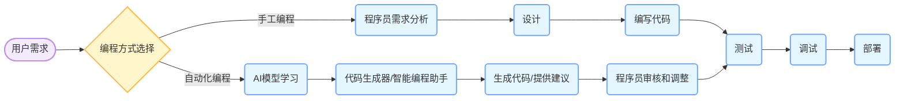

# AI时代的编程：从手工到自动化

> 关键词：AI时代、编程、手工编程、自动化编程、代码生成、智能编程助手、未来趋势

> 摘要：本文深入探讨了AI时代编程从手工到自动化的转变过程。首先介绍了这一转变的背景，包括目的、预期读者、文档结构和相关术语。接着阐述了核心概念，如手工编程和自动化编程的原理及联系，并通过流程图展示其架构。详细讲解了核心算法原理和具体操作步骤，结合Python代码进行说明。分析了相关数学模型和公式，并举例说明。通过项目实战给出代码实际案例并进行详细解释。探讨了实际应用场景，推荐了学习资源、开发工具框架和相关论文著作。最后总结了未来发展趋势与挑战，还包含常见问题解答和扩展阅读参考资料，旨在帮助读者全面了解AI时代编程的变革与发展。

## 1. 背景介绍 
### 1.1 目的和范围
在当今AI时代，编程领域正经历着巨大的变革，从传统的手工编程逐渐向自动化编程迈进。本文的目的在于全面、深入地探讨这一转变的过程、原理、应用及未来趋势。范围涵盖了手工编程和自动化编程的核心概念、相关算法原理、数学模型、实际应用场景，以及相关的工具和资源等方面，旨在为读者提供一个系统、完整的关于AI时代编程转变的知识体系。

### 1.2 预期读者
本文预期读者包括广大的程序员、软件开发者、软件架构师、计算机专业的学生以及对编程和AI技术发展感兴趣的技术爱好者。无论是希望深入了解自动化编程技术的专业人士，还是刚刚接触编程领域想要了解行业发展趋势的初学者，都能从本文中获得有价值的信息。

### 1.3 文档结构概述
本文共分为十个部分。第一部分是背景介绍，阐述目的、预期读者、文档结构和术语表；第二部分讲解核心概念与联系，通过文本示意图和Mermaid流程图展示手工编程和自动化编程的架构；第三部分详细说明核心算法原理和具体操作步骤，并使用Python代码进行阐述；第四部分分析数学模型和公式，并举例说明；第五部分进行项目实战，包括开发环境搭建、源代码实现和代码解读；第六部分探讨实际应用场景；第七部分推荐相关的工具和资源；第八部分总结未来发展趋势与挑战；第九部分是附录，包含常见问题与解答；第十部分提供扩展阅读和参考资料。

### 1.4 术语表
#### 1.4.1 核心术语定义
- **手工编程**：指程序员通过手动编写每一行代码来实现软件功能的编程方式，依赖程序员的专业知识、经验和技能。
- **自动化编程**：利用AI技术和相关工具，自动生成代码或辅助程序员进行编程的过程，减少人工编写代码的工作量。
- **代码生成器**：一种自动化工具，根据特定的规则和输入信息生成相应的代码。
- **智能编程助手**：基于AI技术，能够理解程序员的意图，提供代码建议、错误提示和优化方案的辅助编程工具。

#### 1.4.2 相关概念解释
- **机器学习**：是一门多领域交叉学科，涉及概率论、统计学、逼近论、凸分析、算法复杂度理论等多门学科。它专门研究计算机怎样模拟或实现人类的学习行为，以获取新的知识或技能，重新组织已有的知识结构使之不断改善自身的性能。在自动化编程中，机器学习算法可用于代码生成、代码优化等任务。
- **自然语言处理（NLP）**：是计算机科学、人工智能和语言学的交叉领域，主要研究如何让计算机理解和处理人类语言。在智能编程助手中，NLP技术可用于理解程序员用自然语言描述的需求，并将其转化为代码。

#### 1.4.3 缩略词列表
- **AI**：Artificial Intelligence，人工智能
- **NLP**：Natural Language Processing，自然语言处理
- **ML**：Machine Learning，机器学习

## 2. 核心概念与联系 
### 手工编程原理
手工编程是传统的编程方式，程序员根据需求分析和设计文档，使用编程语言的语法规则，逐行编写代码。程序员需要具备扎实的编程语言知识、算法设计能力和问题解决能力。在手工编程过程中，程序员需要自己处理各种细节，如变量声明、内存管理、错误处理等。

### 自动化编程原理
自动化编程则借助AI技术和相关工具，通过对大量代码数据的学习和分析，自动生成代码或辅助程序员编程。例如，代码生成器可以根据用户输入的需求描述或模板，生成相应的代码框架；智能编程助手可以根据程序员的输入，提供代码建议、自动补全和错误提示等功能。

### 核心概念架构的文本示意图
```plaintext
手工编程：程序员 -> 需求分析 -> 设计 -> 编写代码 -> 测试 -> 调试 -> 部署
自动化编程：用户需求 -> AI模型（机器学习、NLP等） -> 代码生成器/智能编程助手 -> 生成代码/提供建议 -> 程序员审核和调整 -> 测试 -> 调试 -> 部署
```

### Mermaid流程图


## 3. 核心算法原理 & 具体操作步骤 
### 代码生成算法原理
一种常见的代码生成算法是基于模板的代码生成。其基本思想是定义一系列的代码模板，根据用户输入的参数和需求，填充模板中的占位符，生成具体的代码。以下是一个简单的Python示例，用于生成一个简单的Python函数：

```python
def generate_function(name, parameters, return_type):
    # 定义函数模板
    template = """
def {name}({parameters}):
    # 函数体
    result = None
    return result
    """
    # 填充模板
    code = template.format(name=name, parameters=parameters)
    return code

# 示例使用
function_name = "add_numbers"
function_parameters = "a, b"
function_return_type = "int"
generated_code = generate_function(function_name, function_parameters, function_return_type)
print(generated_code)
```

### 智能编程助手算法原理
智能编程助手通常基于机器学习和自然语言处理技术。以基于深度学习的语言模型为例，其训练过程如下：
1. **数据收集**：收集大量的代码数据和自然语言描述数据。
2. **数据预处理**：对数据进行清洗、标注和分词等处理。
3. **模型训练**：使用深度学习模型（如Transformer）对预处理后的数据进行训练。
4. **模型推理**：在用户输入自然语言描述时，模型根据训练结果生成相应的代码建议。

以下是一个简单的基于规则的智能编程助手示例：

```python
# 定义规则字典
rules = {
    "创建一个列表": "my_list = []",
    "创建一个字典": "my_dict = {}",
    "打印一个字符串": "print('Hello, World!')"
}

def intelligent_programming_assistant(user_input):
    if user_input in rules:
        return rules[user_input]
    else:
        return "未找到相关建议"

# 示例使用
user_input = "创建一个列表"
suggestion = intelligent_programming_assistant(user_input)
print(suggestion)
```

### 具体操作步骤
1. **数据准备**：对于代码生成和智能编程助手，都需要准备相关的数据。对于代码生成，需要定义好代码模板；对于智能编程助手，需要收集和预处理大量的代码和自然语言数据。
2. **模型训练（如果适用）**：对于基于机器学习的智能编程助手，需要进行模型训练。选择合适的模型架构，设置训练参数，进行训练。
3. **用户交互**：用户输入需求，代码生成器或智能编程助手根据用户输入进行相应的处理。
4. **结果输出**：代码生成器输出生成的代码，智能编程助手输出代码建议。
5. **审核和调整**：程序员对生成的代码或建议进行审核和调整，确保其符合需求。

## 4. 数学模型和公式 & 详细讲解 & 举例说明 
### 机器学习中的损失函数
在机器学习中，损失函数用于衡量模型预测结果与真实结果之间的差异。常见的损失函数有均方误差（MSE）和交叉熵损失（Cross-Entropy Loss）。

#### 均方误差（MSE）
均方误差的公式为：
$$
MSE = \frac{1}{n} \sum_{i=1}^{n} (y_i - \hat{y}_i)^2
$$
其中，$n$ 是样本数量，$y_i$ 是真实值，$\hat{y}_i$ 是模型预测值。

**详细讲解**：均方误差通过计算每个样本的预测值与真实值之差的平方的平均值，来衡量模型的预测误差。平方的作用是放大误差，使得较大的误差得到更多的关注。

**举例说明**：假设有一个简单的线性回归模型，预测三个样本的结果分别为 $\hat{y}_1 = 2$，$\hat{y}_2 = 4$，$\hat{y}_3 = 6$，而真实值分别为 $y_1 = 1$，$y_2 = 3$，$y_3 = 5$。则均方误差为：
$$
MSE = \frac{(1 - 2)^2 + (3 - 4)^2 + (5 - 6)^2}{3} = \frac{1 + 1 + 1}{3} = 1
$$

#### 交叉熵损失（Cross-Entropy Loss）
交叉熵损失常用于分类问题，其公式为：
$$
H(p, q) = - \sum_{i=1}^{n} p_i \log(q_i)
$$
其中，$p$ 是真实概率分布，$q$ 是模型预测的概率分布。

**详细讲解**：交叉熵损失衡量的是两个概率分布之间的差异。在分类问题中，真实概率分布通常是一个one-hot向量，而模型预测的概率分布是每个类别的预测概率。

**举例说明**：假设有一个二分类问题，真实标签为 $[1, 0]$，模型预测的概率分布为 $[0.8, 0.2]$。则交叉熵损失为：
$$
H(p, q) = - (1 \times \log(0.8) + 0 \times \log(0.2)) \approx 0.223
$$

### 梯度下降算法
梯度下降算法是一种常用的优化算法，用于最小化损失函数。其基本思想是沿着损失函数的负梯度方向更新模型参数。

梯度下降算法的更新公式为：
$$
\theta_{t+1} = \theta_t - \alpha \nabla J(\theta_t)
$$
其中，$\theta_t$ 是第 $t$ 次迭代的模型参数，$\alpha$ 是学习率，$\nabla J(\theta_t)$ 是损失函数 $J$ 在 $\theta_t$ 处的梯度。

**详细讲解**：梯度表示损失函数在某一点的变化率，负梯度方向是损失函数下降最快的方向。学习率控制了每次更新的步长，过大的学习率可能导致模型无法收敛，过小的学习率会导致收敛速度过慢。

**举例说明**：假设有一个简单的线性回归模型 $y = \theta x + b$，损失函数为均方误差。则梯度下降算法的更新过程如下：
1. 初始化参数 $\theta$ 和 $b$。
2. 计算损失函数的梯度 $\nabla J(\theta, b)$。
3. 更新参数：
$$
\theta_{new} = \theta - \alpha \frac{\partial J}{\partial \theta}
$$
$$
b_{new} = b - \alpha \frac{\partial J}{\partial b}
$$
4. 重复步骤2和3，直到损失函数收敛。

## 5. 项目实战：代码实际案例和详细解释说明 
### 5.1  开发环境搭建
1. **安装Python**：从Python官方网站（https://www.python.org/downloads/）下载并安装Python 3.x版本。
2. **安装开发工具**：推荐使用PyCharm作为开发工具，它提供了丰富的功能，如代码编辑、调试、版本控制等。可以从JetBrains官方网站（https://www.jetbrains.com/pycharm/download/）下载并安装。
3. **安装相关库**：根据项目需求，安装必要的Python库，如`numpy`、`pandas`、`tensorflow`等。可以使用`pip`命令进行安装，例如：
```bash
pip install numpy pandas tensorflow
```

### 5.2  源代码详细实现和代码解读
以下是一个简单的基于Python和Flask框架的Web应用程序，使用自动化编程的思想生成简单的API接口。

```python
from flask import Flask, jsonify

# 创建Flask应用实例
app = Flask(__name__)

# 定义数据
data = [
    {"id": 1, "name": "Item 1"},
    {"id": 2, "name": "Item 2"},
    {"id": 3, "name": "Item 3"}
]

# 定义路由，获取所有数据
@app.route('/items', methods=['GET'])
def get_items():
    return jsonify(data)

# 定义路由，根据ID获取单个数据
@app.route('/items/<int:item_id>', methods=['GET'])
def get_item(item_id):
    for item in data:
        if item['id'] == item_id:
            return jsonify(item)
    return jsonify({"message": "Item not found"}), 404

if __name__ == '__main__':
    app.run(debug=True)
```

### 5.3  代码解读与分析
1. **导入必要的库**：`Flask`是一个轻量级的Web框架，`jsonify`用于将Python对象转换为JSON格式的响应。
2. **创建Flask应用实例**：`app = Flask(__name__)`创建了一个Flask应用实例。
3. **定义数据**：`data`是一个包含多个字典的列表，模拟了数据库中的数据。
4. **定义路由**：
    - `@app.route('/items', methods=['GET'])`定义了一个路由，用于获取所有数据。当用户访问`/items`时，会调用`get_items`函数，返回所有数据的JSON格式响应。
    - `@app.route('/items/<int:item_id>', methods=['GET'])`定义了一个路由，用于根据ID获取单个数据。当用户访问`/items/1`时，会调用`get_item`函数，查找ID为1的数据并返回JSON格式响应。如果未找到数据，返回404错误。
5. **运行应用**：`app.run(debug=True)`启动Flask应用，并开启调试模式。

## 6. 实际应用场景 
### 软件开发
在软件开发中，自动化编程可以大大提高开发效率。例如，使用代码生成器可以快速生成项目的基础框架，减少重复劳动。智能编程助手可以帮助程序员快速查找和解决问题，提高代码质量。

### 数据处理和分析
在数据处理和分析领域，自动化编程可以用于生成数据处理脚本、数据分析报告等。例如，根据用户输入的数据处理需求，自动生成Python代码，实现数据清洗、特征工程和模型训练等任务。

### 测试和调试
自动化编程可以用于生成测试用例和调试工具。例如，根据代码的结构和功能，自动生成单元测试用例，帮助程序员快速发现和修复代码中的错误。

### 教育和培训
在编程教育和培训中，自动化编程可以作为辅助工具，帮助学生更好地理解编程概念和语法。例如，智能编程助手可以根据学生的输入，提供代码建议和错误提示，引导学生逐步完成编程任务。

## 7. 工具和资源推荐
### 7.1 学习资源推荐
#### 7.1.1 书籍推荐
- 《Python编程：从入门到实践》：适合Python初学者，详细介绍了Python的基础语法和应用场景。
- 《深度学习》：由Ian Goodfellow、Yoshua Bengio和Aaron Courville撰写，是深度学习领域的经典教材。
- 《人工智能：一种现代的方法》：全面介绍了人工智能的基本概念、算法和应用，是人工智能领域的权威著作。

#### 7.1.2 在线课程
- Coursera上的“机器学习”课程：由Andrew Ng教授授课，是机器学习领域的经典课程。
- edX上的“深度学习”课程：由知名学者和专家授课，深入介绍了深度学习的原理和应用。
- 中国大学MOOC上的“Python语言程序设计”课程：适合Python初学者，讲解详细，易于理解。

#### 7.1.3 技术博客和网站
- Medium：有许多技术专家和开发者在上面分享编程和AI领域的最新技术和经验。
- Stack Overflow：是一个程序员社区，提供了大量的编程问题和解决方案。
- 开源中国：提供了丰富的开源项目和技术文章，是了解国内技术动态的重要平台。

### 7.2 开发工具框架推荐
#### 7.2.1 IDE和编辑器
- PyCharm：是Python开发的首选IDE，提供了丰富的功能和插件，提高开发效率。
- Visual Studio Code：是一款轻量级的代码编辑器，支持多种编程语言，具有丰富的扩展功能。
- IntelliJ IDEA：是一款功能强大的Java开发IDE，也支持多种其他编程语言。

#### 7.2.2 调试和性能分析工具
- pdb：是Python的内置调试工具，可用于调试Python代码。
- Py-Spy：是一个用于分析Python代码性能的工具，可帮助开发者找出性能瓶颈。
- VisualVM：是一个可视化的Java性能分析工具，可用于分析Java应用程序的性能。

#### 7.2.3 相关框架和库
- TensorFlow：是一个开源的机器学习框架，广泛应用于深度学习领域。
- PyTorch：是另一个流行的深度学习框架，具有动态图和易于使用的特点。
- Scikit-learn：是一个用于机器学习的Python库，提供了丰富的机器学习算法和工具。

### 7.3 相关论文著作推荐
#### 7.3.1 经典论文
- “Attention Is All You Need”：介绍了Transformer架构，是自然语言处理领域的重要突破。
- “ImageNet Classification with Deep Convolutional Neural Networks”：介绍了AlexNet，开启了深度学习在计算机视觉领域的应用。
- “Generative Adversarial Nets”：提出了生成对抗网络（GAN），在图像生成和数据增强等领域有广泛应用。

#### 7.3.2 最新研究成果
- 关注顶级学术会议（如NeurIPS、ICML、CVPR等）上的最新论文，了解AI和编程领域的最新研究进展。
- 关注知名学术期刊（如Journal of Artificial Intelligence Research、Artificial Intelligence等）上的研究成果。

#### 7.3.3 应用案例分析
- 许多科技公司会在其官方博客或技术论坛上分享AI和编程的应用案例，如Google AI Blog、Facebook Research等。
- 开源项目的文档和README文件中也包含了许多实际应用案例，可以从中学习和借鉴。

## 8. 总结：未来发展趋势与挑战
### 未来发展趋势
1. **更高级的自动化编程**：未来的自动化编程工具将更加智能，能够理解更复杂的需求，生成高质量的代码。例如，基于自然语言描述直接生成完整的应用程序。
2. **人机协作编程**：程序员和智能编程助手将更加紧密地协作，智能编程助手将成为程序员的得力助手，提供实时的代码建议和优化方案。
3. **跨领域融合**：自动化编程将与其他领域（如物联网、大数据、区块链等）深度融合，推动各领域的创新和发展。
4. **个性化编程体验**：根据程序员的习惯和偏好，提供个性化的编程辅助和代码生成服务。

### 挑战
1. **代码质量和安全性**：自动化生成的代码可能存在质量和安全问题，需要建立有效的代码审查和验证机制。
2. **数据隐私和知识产权**：自动化编程依赖大量的数据，如何保护数据隐私和知识产权是一个重要的问题。
3. **技术普及和人才培养**：需要加强对自动化编程技术的普及和推广，培养更多掌握相关技术的人才。
4. **伦理和社会问题**：自动化编程的发展可能会对就业市场产生影响，需要关注相关的伦理和社会问题。

## 9. 附录：常见问题与解答
### 1. 自动化编程会取代程序员吗？
不会。虽然自动化编程可以提高编程效率，但程序员的创造力、问题解决能力和对业务的理解是无法被取代的。自动化编程只是辅助程序员的工具，未来的编程将是人机协作的模式。

### 2. 自动化编程生成的代码质量可靠吗？
自动化编程生成的代码质量取决于多个因素，如算法的准确性、数据的质量等。目前，自动化编程生成的代码可能需要程序员进行审核和调整，以确保其质量和安全性。

### 3. 学习自动化编程需要具备哪些基础知识？
学习自动化编程需要具备一定的编程基础（如Python、Java等）、机器学习和自然语言处理的基础知识。同时，还需要了解相关的开发工具和框架。

### 4. 如何选择适合的自动化编程工具？
选择适合的自动化编程工具需要考虑项目需求、工具的功能和易用性等因素。可以根据自己的需求进行调研和试用，选择最适合的工具。

## 10. 扩展阅读 & 参考资料
### 扩展阅读
- 《代码大全》：全面介绍了软件开发的各个方面，包括代码设计、编程实践、项目管理等。
- 《重构：改善既有代码的设计》：介绍了重构的原则和方法，帮助开发者提高代码的可维护性和可读性。
- 《敏捷软件开发：原则、模式与实践》：介绍了敏捷软件开发的原则和方法，帮助团队提高开发效率和质量。

### 参考资料
- Python官方文档（https://docs.python.org/）
- TensorFlow官方文档（https://www.tensorflow.org/）
- PyTorch官方文档（https://pytorch.org/）
- 相关学术论文和研究报告