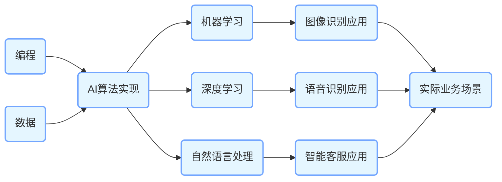

# AI时代的编程：程序员的未来展望

> 关键词：AI时代、编程、程序员、未来展望、人工智能、技术变革、职业发展

> 摘要：本文聚焦于AI时代下编程领域的发展变化以及程序员的未来走向。在AI技术迅猛发展的大背景下，编程行业正经历着深刻的变革。文章将深入探讨AI与编程的核心概念及联系，详细剖析相关算法原理和操作步骤，借助数学模型和公式加深理解。通过项目实战案例展示AI对编程的实际影响，分析AI时代编程的实际应用场景。同时，推荐相关的学习资源、开发工具和论文著作，为程序员提升自身能力提供指引。最后，总结程序员未来面临的发展趋势与挑战，解答常见问题并提供扩展阅读和参考资料，旨在为程序员全面了解AI时代的编程现状与未来提供有价值的参考。

## 1. 背景介绍 
### 1.1 目的和范围
在当今科技飞速发展的时代，人工智能（AI）已经成为推动各个行业变革的关键力量。编程作为科技发展的重要基石，也在AI时代面临着前所未有的机遇和挑战。本文的目的在于全面探讨AI时代编程领域的发展趋势，以及这些趋势对程序员职业发展的影响。范围涵盖了AI与编程的核心概念、算法原理、实际应用场景、工具资源等多个方面，旨在为程序员提供一个清晰的未来发展蓝图。

### 1.2 预期读者
本文预期读者主要包括程序员、编程爱好者、计算机专业学生以及对AI时代编程发展感兴趣的相关人士。通过阅读本文，读者可以了解到AI时代编程的最新动态和发展趋势，掌握应对未来变化的方法和策略，提升自身在编程领域的竞争力。

### 1.3 文档结构概述
本文将按照以下结构进行阐述：首先介绍AI与编程的背景知识，包括目的、预期读者和文档结构概述；接着深入探讨核心概念与联系，通过文本示意图和Mermaid流程图进行清晰展示；然后详细讲解核心算法原理和具体操作步骤，结合Python源代码进行说明；再介绍数学模型和公式，并举例说明；通过项目实战案例展示代码实现和详细解释；分析AI时代编程的实际应用场景；推荐相关的学习资源、开发工具和论文著作；总结未来发展趋势与挑战；解答常见问题并提供扩展阅读和参考资料。

### 1.4 术语表
#### 1.4.1 核心术语定义
- **人工智能（AI）**：是一门研究如何使计算机能够模拟人类智能的学科，包括机器学习、深度学习、自然语言处理等多个领域。
- **编程**：是指使用计算机语言编写指令，让计算机完成特定任务的过程。
- **机器学习（ML）**：是人工智能的一个分支，通过让计算机从数据中学习模式和规律，从而实现预测和决策。
- **深度学习（DL）**：是机器学习的一种，使用深度神经网络模型，能够处理复杂的模式和数据。
- **自然语言处理（NLP）**：是人工智能的一个领域，研究如何让计算机理解和处理人类语言。

#### 1.4.2 相关概念解释
- **AI编程**：结合人工智能技术进行编程，利用AI算法和模型解决编程中的问题，提高程序的智能性和效率。
- **自动化编程**：利用AI技术实现编程过程的自动化，减少人工编写代码的工作量。
- **智能编程助手**：基于AI技术的工具，能够为程序员提供代码提示、错误诊断、优化建议等帮助。

#### 1.4.3 缩略词列表
- **AI**：Artificial Intelligence（人工智能）
- **ML**：Machine Learning（机器学习）
- **DL**：Deep Learning（深度学习）
- **NLP**：Natural Language Processing（自然语言处理）

## 2. 核心概念与联系 

### 2.1 核心概念原理
在AI时代，编程与人工智能紧密相连。编程是实现人工智能的基础，通过编写代码可以构建各种AI模型和算法。而人工智能技术的发展也为编程带来了新的机遇和挑战。例如，机器学习算法可以用于数据分析和预测，深度学习模型可以用于图像识别和语音处理，自然语言处理技术可以用于智能客服和文本生成等。

人工智能的核心原理在于让计算机通过数据学习和模拟人类的智能行为。机器学习算法通过对大量数据的学习，发现数据中的模式和规律，并根据这些规律进行预测和决策。深度学习则是利用深度神经网络模型，通过多层神经元的计算和学习，处理更加复杂的模式和数据。自然语言处理技术则是通过对人类语言的理解和处理，实现人机交互和信息处理。

### 2.2 架构的文本示意图
```plaintext
编程与AI的架构关系

编程层
|-- 编程语言（Python、Java、C++等）
|-- 编程工具（IDE、代码编辑器等）
|-- 编程框架（TensorFlow、PyTorch等）

AI层
|-- 机器学习算法（决策树、支持向量机等）
|-- 深度学习模型（卷积神经网络、循环神经网络等）
|-- 自然语言处理技术（词法分析、句法分析等）

应用层
|-- 图像识别
|-- 语音识别
|-- 智能客服
|-- 自动驾驶等
```

### 2.3 Mermaid流程图


从流程图可以看出，编程是实现AI算法的基础，通过对数据的处理和分析，利用不同的AI技术实现各种应用，最终应用于实际业务场景。

## 3. 核心算法原理 & 具体操作步骤 

### 3.1 机器学习算法原理 - 决策树算法
决策树是一种常用的机器学习算法，用于分类和回归问题。其基本原理是根据数据的特征属性，构建一个树形结构的决策模型。每个内部节点表示一个特征属性的测试，每个分支表示一个测试输出，每个叶节点表示一个类别或值。

#### 3.1.1 算法步骤
1. **特征选择**：选择一个最优的特征作为当前节点的划分依据。常用的特征选择方法有信息增益、信息增益率、基尼指数等。
2. **划分数据集**：根据选择的特征，将数据集划分为不同的子集。
3. **递归构建决策树**：对每个子集重复步骤1和步骤2，直到满足停止条件（如子集为空或所有样本属于同一类别）。
4. **生成决策树**：将所有的节点和分支组合成一个完整的决策树。

#### 3.1.2 Python源代码实现
```python
import numpy as np

# 计算数据集的熵
def entropy(y):
    classes, counts = np.unique(y, return_counts=True)
    entropy = 0
    for count in counts:
        p = count / len(y)
        entropy -= p * np.log2(p)
    return entropy

# 划分数据集
def split_dataset(X, y, feature_index, value):
    left_indices = X[:, feature_index] == value
    right_indices = ~left_indices
    X_left, y_left = X[left_indices], y[left_indices]
    X_right, y_right = X[right_indices], y[right_indices]
    return X_left, y_left, X_right, y_right

# 选择最优特征
def best_feature(X, y):
    num_features = X.shape[1]
    base_entropy = entropy(y)
    best_info_gain = 0
    best_feature_index = -1
    for feature_index in range(num_features):
        feature_values = np.unique(X[:, feature_index])
        new_entropy = 0
        for value in feature_values:
            X_left, y_left, X_right, y_right = split_dataset(X, y, feature_index, value)
            p = len(y_left) / len(y)
            new_entropy += p * entropy(y_left) + (1 - p) * entropy(y_right)
        info_gain = base_entropy - new_entropy
        if info_gain > best_info_gain:
            best_info_gain = info_gain
            best_feature_index = feature_index
    return best_feature_index

# 构建决策树
def create_tree(X, y):
    if len(np.unique(y)) == 1:
        return np.unique(y)[0]
    if X.shape[1] == 0:
        return np.bincount(y).argmax()
    best_feature_index = best_feature(X, y)
    tree = {}
    feature_values = np.unique(X[:, best_feature_index])
    for value in feature_values:
        X_left, y_left, X_right, y_right = split_dataset(X, y, best_feature_index, value)
        subtree = create_tree(X_left, y_left)
        tree[value] = subtree
    return tree

# 示例数据
X = np.array([[1, 1], [1, 1], [1, 0], [0, 1], [0, 1]])
y = np.array([1, 1, 0, 0, 0])

# 构建决策树
tree = create_tree(X, y)
print(tree)
```

### 3.2 深度学习算法原理 - 卷积神经网络（CNN）
卷积神经网络是一种专门用于处理具有网格结构数据（如图像）的深度学习模型。其核心原理是通过卷积层、池化层和全连接层的组合，自动提取数据的特征并进行分类或回归。

#### 3.2.1 算法步骤
1. **卷积层**：使用卷积核在输入数据上滑动，进行卷积操作，提取数据的局部特征。
2. **激活函数**：对卷积层的输出应用激活函数（如ReLU），引入非线性因素。
3. **池化层**：对卷积层的输出进行下采样，减少数据的维度，提高计算效率。
4. **全连接层**：将池化层的输出展平，连接到全连接层，进行分类或回归。
5. **损失函数**：定义损失函数，衡量模型的预测结果与真实标签之间的差异。
6. **优化算法**：使用优化算法（如随机梯度下降）更新模型的参数，最小化损失函数。

#### 3.2.2 Python源代码实现
```python
import tensorflow as tf
from tensorflow.keras import layers, models

# 构建CNN模型
model = models.Sequential()
model.add(layers.Conv2D(32, (3, 3), activation='relu', input_shape=(32, 32, 3)))
model.add(layers.MaxPooling2D((2, 2)))
model.add(layers.Conv2D(64, (3, 3), activation='relu'))
model.add(layers.MaxPooling2D((2, 2)))
model.add(layers.Conv2D(64, (3, 3), activation='relu'))
model.add(layers.Flatten())
model.add(layers.Dense(64, activation='relu'))
model.add(layers.Dense(10))

# 编译模型
model.compile(optimizer='adam',
              loss=tf.keras.losses.SparseCategoricalCrossentropy(from_logits=True),
              metrics=['accuracy'])

# 加载数据集
(train_images, train_labels), (test_images, test_labels) = tf.keras.datasets.cifar10.load_data()

# 数据预处理
train_images, test_images = train_images / 255.0, test_images / 255.0

# 训练模型
history = model.fit(train_images, train_labels, epochs=10, 
                    validation_data=(test_images, test_labels))

# 评估模型
test_loss, test_acc = model.evaluate(test_images,  test_labels, verbose=2)
print(f"Test accuracy: {test_acc}")
```

## 4. 数学模型和公式 & 详细讲解 & 举例说明 

### 4.1 熵的数学模型和公式
在机器学习中，熵是衡量数据集不确定性的一个重要指标。其数学公式为：
$$
H(Y) = -\sum_{i=1}^{n} p(y_i) \log_2 p(y_i)
$$
其中，$H(Y)$ 表示数据集 $Y$ 的熵，$p(y_i)$ 表示类别 $y_i$ 在数据集中出现的概率，$n$ 表示类别总数。

#### 4.1.1 详细讲解
熵的值越大，说明数据集的不确定性越高；熵的值越小，说明数据集的不确定性越低。当数据集只有一个类别时，熵为0，表示数据集完全确定。

#### 4.1.2 举例说明
假设有一个数据集，包含10个样本，其中5个属于类别A，5个属于类别B。则类别A和类别B出现的概率均为 $p(A) = p(B) = 0.5$。根据熵的公式，可得：
$$
H(Y) = - (0.5 \log_2 0.5 + 0.5 \log_2 0.5) = 1
$$

### 4.2 信息增益的数学模型和公式
信息增益是决策树算法中用于选择最优特征的一个重要指标。其数学公式为：
$$
IG(Y, X) = H(Y) - \sum_{i=1}^{m} \frac{|S_i|}{|S|} H(S_i)
$$
其中，$IG(Y, X)$ 表示特征 $X$ 对数据集 $Y$ 的信息增益，$H(Y)$ 表示数据集 $Y$ 的熵，$|S|$ 表示数据集 $S$ 的样本总数，$|S_i|$ 表示特征 $X$ 取值为 $x_i$ 时的样本数，$H(S_i)$ 表示特征 $X$ 取值为 $x_i$ 时的子集的熵，$m$ 表示特征 $X$ 的取值个数。

#### 4.2.2 详细讲解
信息增益表示在使用特征 $X$ 对数据集进行划分后，数据集的不确定性减少的程度。信息增益越大，说明使用该特征进行划分后，数据集的不确定性减少得越多，该特征越适合作为划分依据。

#### 4.2.3 举例说明
假设有一个数据集，包含10个样本，其中5个属于类别A，5个属于类别B。特征 $X$ 有两个取值 $x_1$ 和 $x_2$，取值为 $x_1$ 的样本有6个，其中4个属于类别A，2个属于类别B；取值为 $x_2$ 的样本有4个，其中1个属于类别A，3个属于类别B。

首先计算数据集的熵：
$$
H(Y) = - (0.5 \log_2 0.5 + 0.5 \log_2 0.5) = 1
$$

然后计算特征 $X$ 取值为 $x_1$ 时的子集的熵：
$$
H(S_1) = - (\frac{4}{6} \log_2 \frac{4}{6} + \frac{2}{6} \log_2 \frac{2}{6}) \approx 0.918
$$

特征 $X$ 取值为 $x_2$ 时的子集的熵：
$$
H(S_2) = - (\frac{1}{4} \log_2 \frac{1}{4} + \frac{3}{4} \log_2 \frac{3}{4}) \approx 0.811
$$

最后计算信息增益：
$$
IG(Y, X) = 1 - (\frac{6}{10} \times 0.918 + \frac{4}{10} \times 0.811) \approx 0.141
$$

### 4.3 卷积操作的数学模型和公式
在卷积神经网络中，卷积操作是提取数据特征的核心步骤。其数学公式为：
$$
y[i, j] = \sum_{m=0}^{M-1} \sum_{n=0}^{N-1} x[i + m, j + n] w[m, n]
$$
其中，$y[i, j]$ 表示卷积层输出特征图中位置 $(i, j)$ 的值，$x[i + m, j + n]$ 表示输入数据中位置 $(i + m, j + n)$ 的值，$w[m, n]$ 表示卷积核中位置 $(m, n)$ 的值，$M$ 和 $N$ 分别表示卷积核的高度和宽度。

#### 4.3.1 详细讲解
卷积操作通过将卷积核在输入数据上滑动，进行元素相乘并求和的操作，得到输出特征图。卷积核的参数是可学习的，通过训练可以自动提取数据的特征。

#### 4.3.2 举例说明
假设有一个输入数据矩阵 $x$ 和一个卷积核矩阵 $w$：
$$
x = \begin{bmatrix}
1 & 2 & 3 \\
4 & 5 & 6 \\
7 & 8 & 9
\end{bmatrix}
$$
$$
w = \begin{bmatrix}
1 & 0 \\
0 & 1
\end{bmatrix}
$$

进行卷积操作时，卷积核在输入数据上滑动，计算每个位置的输出值。例如，当卷积核的左上角与输入数据的左上角对齐时：
$$
y[0, 0] = 1 \times 1 + 2 \times 0 + 4 \times 0 + 5 \times 1 = 6
$$

依次计算其他位置的值，最终得到输出特征图。

## 5. 项目实战：代码实际案例和详细解释说明 

### 5.1  开发环境搭建
#### 5.1.1 安装Python
首先需要安装Python编程语言。可以从Python官方网站（https://www.python.org/downloads/） 下载适合自己操作系统的Python安装包，按照安装向导进行安装。

#### 5.1.2 安装深度学习框架
如果要进行深度学习相关的项目实战，需要安装深度学习框架，如TensorFlow或PyTorch。可以使用以下命令安装TensorFlow：
```sh
pip install tensorflow
```
使用以下命令安装PyTorch：
```sh
pip install torch torchvision
```

#### 5.1.3 安装其他必要的库
根据项目需求，还需要安装其他必要的库，如NumPy、Pandas、Matplotlib等。可以使用以下命令安装：
```sh
pip install numpy pandas matplotlib
```

### 5.2  源代码详细实现和代码解读
#### 5.2.1 图像分类项目实战
以下是一个使用TensorFlow实现图像分类的项目实战代码：
```python
import tensorflow as tf
from tensorflow.keras import layers, models
import matplotlib.pyplot as plt

# 加载数据集
(train_images, train_labels), (test_images, test_labels) = tf.keras.datasets.cifar10.load_data()

# 数据预处理
train_images, test_images = train_images / 255.0, test_images / 255.0

# 定义类别名称
class_names = ['airplane', 'automobile', 'bird', 'cat', 'deer',
               'dog', 'frog', 'horse', 'ship', 'truck']

# 显示部分训练图像
plt.figure(figsize=(10,10))
for i in range(25):
    plt.subplot(5,5,i+1)
    plt.xticks([])
    plt.yticks([])
    plt.grid(False)
    plt.imshow(train_images[i])
    plt.xlabel(class_names[train_labels[i][0]])
plt.show()

# 构建CNN模型
model = models.Sequential()
model.add(layers.Conv2D(32, (3, 3), activation='relu', input_shape=(32, 32, 3)))
model.add(layers.MaxPooling2D((2, 2)))
model.add(layers.Conv2D(64, (3, 3), activation='relu'))
model.add(layers.MaxPooling2D((2, 2)))
model.add(layers.Conv2D(64, (3, 3), activation='relu'))
model.add(layers.Flatten())
model.add(layers.Dense(64, activation='relu'))
model.add(layers.Dense(10))

# 编译模型
model.compile(optimizer='adam',
              loss=tf.keras.losses.SparseCategoricalCrossentropy(from_logits=True),
              metrics=['accuracy'])

# 训练模型
history = model.fit(train_images, train_labels, epochs=10, 
                    validation_data=(test_images, test_labels))

# 评估模型
test_loss, test_acc = model.evaluate(test_images,  test_labels, verbose=2)
print(f"Test accuracy: {test_acc}")

# 绘制训练和验证准确率曲线
plt.plot(history.history['accuracy'], label='accuracy')
plt.plot(history.history['val_accuracy'], label = 'val_accuracy')
plt.xlabel('Epoch')
plt.ylabel('Accuracy')
plt.ylim([0, 1])
plt.legend(loc='lower right')
plt.show()
```

#### 5.2.2 代码解读
1. **数据加载和预处理**：使用 `tf.keras.datasets.cifar10.load_data()` 加载CIFAR-10数据集，并将图像数据归一化到0到1之间。
2. **数据可视化**：使用 `matplotlib` 库显示部分训练图像，帮助我们直观地了解数据集。
3. **模型构建**：使用 `Sequential` 模型构建一个简单的卷积神经网络，包括卷积层、池化层、全连接层等。
4. **模型编译**：使用 `adam` 优化器和 `SparseCategoricalCrossentropy` 损失函数编译模型，并指定评估指标为准确率。
5. **模型训练**：使用 `fit` 方法训练模型，指定训练数据、训练轮数和验证数据。
6. **模型评估**：使用 `evaluate` 方法评估模型在测试数据上的性能。
7. **绘制准确率曲线**：使用 `matplotlib` 库绘制训练和验证准确率曲线，帮助我们观察模型的训练过程。

### 5.3  代码解读与分析
#### 5.3.1 模型结构分析
该卷积神经网络模型包含三个卷积层和两个池化层，用于提取图像的特征。卷积层使用 `3x3` 的卷积核和ReLU激活函数，池化层使用 `2x2` 的最大池化操作。最后，通过全连接层将特征图展平并进行分类。

#### 5.3.2 训练过程分析
在训练过程中，模型的准确率逐渐提高，验证准确率也呈现出上升的趋势。但是，在训练后期，验证准确率可能会出现波动，这可能是由于过拟合导致的。可以通过增加训练数据、使用正则化方法等方式来缓解过拟合问题。

#### 5.3.3 性能评估分析
模型在测试数据上的准确率可以作为评估模型性能的一个重要指标。通过比较不同模型的准确率，可以选择性能最优的模型。同时，还可以分析模型在不同类别上的准确率，了解模型的优势和不足。

## 6. 实际应用场景 
### 6.1 智能安防
在智能安防领域，AI编程技术可以用于视频监控、人脸识别、行为分析等。通过编程实现的AI算法可以实时监测监控画面，识别出异常行为和人员，及时发出警报。例如，在公共场所安装智能监控摄像头，利用人脸识别技术可以快速识别出嫌疑人，提高安防效率。

### 6.2 医疗诊断
AI编程在医疗诊断领域也有广泛的应用。通过对医学影像（如X光、CT等）的分析，AI算法可以帮助医生更准确地诊断疾病。例如，利用深度学习模型对肺部CT图像进行分析，检测出肺部结节和肿瘤，辅助医生进行早期诊断。

### 6.3 金融风险预测
在金融领域，AI编程可以用于风险预测和信用评估。通过对大量金融数据的分析，AI算法可以预测市场趋势、评估客户信用风险等。例如，银行可以利用机器学习算法对客户的信用数据进行分析，预测客户的违约概率，从而制定合理的信贷政策。

### 6.4 智能交通
智能交通领域也是AI编程的重要应用场景之一。通过编程实现的AI算法可以用于交通流量预测、自动驾驶、智能交通信号控制等。例如，自动驾驶汽车利用传感器收集环境信息，通过AI算法进行决策和控制，实现自动驾驶功能。

### 6.5 教育领域
在教育领域，AI编程可以用于个性化学习、智能辅导等。通过对学生学习数据的分析，AI算法可以了解学生的学习习惯和能力，为学生提供个性化的学习方案。例如，智能辅导系统可以根据学生的答题情况，自动调整教学内容和难度，提高学习效果。

## 7. 工具和资源推荐
### 7.1 学习资源推荐
#### 7.1.1 书籍推荐
- 《Python机器学习》：这本书详细介绍了Python在机器学习领域的应用，包括各种机器学习算法的原理和实现。
- 《深度学习》：由深度学习领域的三位先驱Ian Goodfellow、Yoshua Bengio和Aaron Courville撰写，是深度学习领域的经典著作。
- 《人工智能：一种现代的方法》：全面介绍了人工智能的各个领域，包括搜索算法、知识表示、机器学习、自然语言处理等。

#### 7.1.2 在线课程
- Coursera上的《机器学习》课程：由斯坦福大学教授Andrew Ng主讲，是机器学习领域的经典课程。
- edX上的《深度学习微硕士项目》：提供了深度学习的系统学习课程，包括多个实践项目。
- 中国大学MOOC上的《人工智能基础》课程：适合初学者了解人工智能的基本概念和方法。

#### 7.1.3 技术博客和网站
- Medium：上面有很多关于AI和编程的技术博客文章，涵盖了最新的研究成果和实践经验。
- Towards Data Science：专注于数据科学和机器学习领域，提供了大量的优质文章和教程。
- AI开源社区：如GitHub、Gitee等，上面有很多开源的AI项目和代码，可以学习和参考。

### 7.2 开发工具框架推荐
#### 7.2.1 IDE和编辑器
- PyCharm：是一款专门用于Python开发的集成开发环境，提供了丰富的功能和插件。
- Visual Studio Code：是一款轻量级的代码编辑器，支持多种编程语言，有大量的扩展插件。
- Jupyter Notebook：是一种交互式的开发环境，适合进行数据分析和模型训练。

#### 7.2.2 调试和性能分析工具
- TensorBoard：是TensorFlow提供的可视化工具，可以用于查看模型的训练过程、性能指标等。
- PyTorch Profiler：是PyTorch提供的性能分析工具，可以帮助我们分析模型的性能瓶颈。
- cProfile：是Python内置的性能分析工具，可以用于分析Python代码的性能。

#### 7.2.3 相关框架和库
- TensorFlow：是一个开源的深度学习框架，由Google开发，广泛应用于各种深度学习任务。
- PyTorch：是另一个开源的深度学习框架，由Facebook开发，具有简洁易用的特点。
- Scikit-learn：是一个用于机器学习的Python库，提供了各种机器学习算法和工具。

### 7.3 相关论文著作推荐
#### 7.3.1 经典论文
- 《Gradient-Based Learning Applied to Document Recognition》：由Yann LeCun等人撰写，介绍了卷积神经网络的经典论文。
- 《ImageNet Classification with Deep Convolutional Neural Networks》：由Alex Krizhevsky等人撰写，介绍了AlexNet网络，开启了深度学习在图像分类领域的热潮。
- 《Attention Is All You Need》：介绍了Transformer模型，在自然语言处理领域取得了巨大的成功。

#### 7.3.2 最新研究成果
- 关注顶级学术会议（如NeurIPS、ICML、CVPR等）上的最新研究成果，了解AI领域的前沿技术。
- 阅读相关学术期刊（如Journal of Artificial Intelligence Research、Artificial Intelligence等）上的最新论文。

#### 7.3.3 应用案例分析
- 分析一些知名企业（如Google、Microsoft、Facebook等）在AI领域的应用案例，学习他们的实践经验和技术方案。
- 关注一些开源项目的应用案例，了解如何将AI技术应用到实际项目中。

## 8. 总结：未来发展趋势与挑战
### 8.1 未来发展趋势
#### 8.1.1 AI与编程的深度融合
未来，AI将与编程更加紧密地融合，编程过程将更加智能化和自动化。智能编程助手将成为程序员的重要工具，能够自动生成代码、优化代码、调试代码等。同时，AI技术也将被广泛应用于软件开发的各个环节，如需求分析、设计、测试等，提高软件开发的效率和质量。

#### 8.1.2 跨学科编程的兴起
随着科技的发展，各个领域之间的界限越来越模糊，跨学科编程将成为未来的发展趋势。程序员需要具备多学科的知识，能够将AI技术与其他领域的知识相结合，开发出更加创新的应用。例如，将AI技术与生物学、医学、物理学等领域相结合，开发出具有创新性的解决方案。

#### 8.1.3 低代码/无代码编程的普及
低代码/无代码编程平台将越来越普及，使得非专业程序员也能够参与到软件开发中来。这些平台提供了可视化的编程界面和丰富的组件库，用户可以通过拖拽和配置的方式快速开发应用。低代码/无代码编程将降低软件开发的门槛，提高软件开发的效率。

#### 8.1.4 量子编程的发展
量子计算技术的发展将为编程带来新的机遇和挑战。量子编程将成为未来的一个重要研究方向，程序员需要学习量子计算的基本原理和编程方法，开发出适用于量子计算机的算法和应用。

### 8.2 挑战
#### 8.2.1 技术更新换代快
AI和编程领域的技术更新换代非常快，程序员需要不断学习和更新自己的知识和技能，才能跟上技术的发展步伐。这对程序员的学习能力和适应能力提出了很高的要求。

#### 8.2.2 数据安全和隐私问题
随着AI技术的广泛应用，数据安全和隐私问题越来越受到关注。程序员在开发AI应用时，需要考虑如何保护用户的数据安全和隐私，避免数据泄露和滥用。

#### 8.2.3 伦理和法律问题
AI技术的发展也带来了一系列的伦理和法律问题，如算法歧视、人工智能的责任认定等。程序员需要了解相关的伦理和法律规范，确保开发的AI应用符合道德和法律要求。

#### 8.2.4 人才竞争激烈
由于AI和编程领域的发展前景广阔，吸引了大量的人才涌入。这导致了人才竞争非常激烈，程序员需要不断提升自己的竞争力，才能在就业市场中脱颖而出。

## 9. 附录：常见问题与解答
### 9.1 问题1：AI时代程序员是否会失业？
解答：AI时代并不会导致程序员失业，反而会为程序员带来更多的机遇。虽然一些重复性的编程工作可能会被自动化工具取代，但AI技术的发展也会创造出更多新的编程需求。例如，开发AI模型、优化算法、处理复杂的数据分析等工作都需要程序员的专业知识和技能。程序员需要不断学习和提升自己，适应AI时代的发展需求。

### 9.2 问题2：如何学习AI编程？
解答：学习AI编程可以从以下几个方面入手：
1. 学习编程语言：Python是AI编程中最常用的语言，建议先学习Python的基础知识。
2. 学习机器学习和深度学习理论：了解机器学习和深度学习的基本概念、算法和模型。
3. 实践项目：通过实践项目来巩固所学的知识和技能，可以从简单的项目开始，逐渐提高难度。
4. 阅读相关书籍和论文：阅读一些经典的AI书籍和最新的研究论文，了解AI领域的前沿技术。
5. 参加在线课程和培训：可以参加一些在线课程和培训，系统地学习AI编程。

### 9.3 问题3：AI编程需要哪些数学基础？
解答：AI编程需要一定的数学基础，主要包括以下几个方面：
1. 线性代数：用于处理向量、矩阵等数据结构，是深度学习中矩阵运算的基础。
2. 概率论与数理统计：用于处理数据的概率分布、期望、方差等，是机器学习中概率模型的基础。
3. 微积分：用于计算函数的导数和积分，是优化算法中梯度下降的基础。
4. 数值分析：用于解决数值计算中的问题，如矩阵求逆、解方程等。

### 9.4 问题4：如何选择适合自己的深度学习框架？
解答：选择适合自己的深度学习框架可以考虑以下几个因素：
1. 学习成本：不同的深度学习框架有不同的学习曲线，初学者可以选择学习成本较低的框架，如TensorFlow和PyTorch。
2. 应用场景：不同的深度学习框架适用于不同的应用场景，如TensorFlow适用于大规模分布式训练，PyTorch适用于快速原型开发。
3. 社区支持：选择社区支持较好的深度学习框架，可以更容易获取相关的文档、教程和开源代码。
4. 个人喜好：最终的选择还可以根据个人的喜好来决定。

## 10. 扩展阅读 & 参考资料
### 10.1 扩展阅读
- 《AI未来进行式》：由李开复和王咏刚所著，探讨了AI对未来社会和经济的影响。
- 《生命3.0：人工智能时代人类的进化与重生》：作者迈克斯·泰格马克，思考了人工智能对人类未来的挑战和机遇。
- 《算法之美：指导工作与生活的算法》：介绍了算法在生活中的应用，帮助我们用算法思维解决实际问题。

### 10.2 参考资料
- TensorFlow官方文档：https://www.tensorflow.org/
- PyTorch官方文档：https://pytorch.org/
- Scikit-learn官方文档：https://scikit-learn.org/
- 中国计算机学会（CCF）官网：https://www.ccf.org.cn/
- 国际人工智能联合会议（IJCAI）官网：https://ijcai.org/