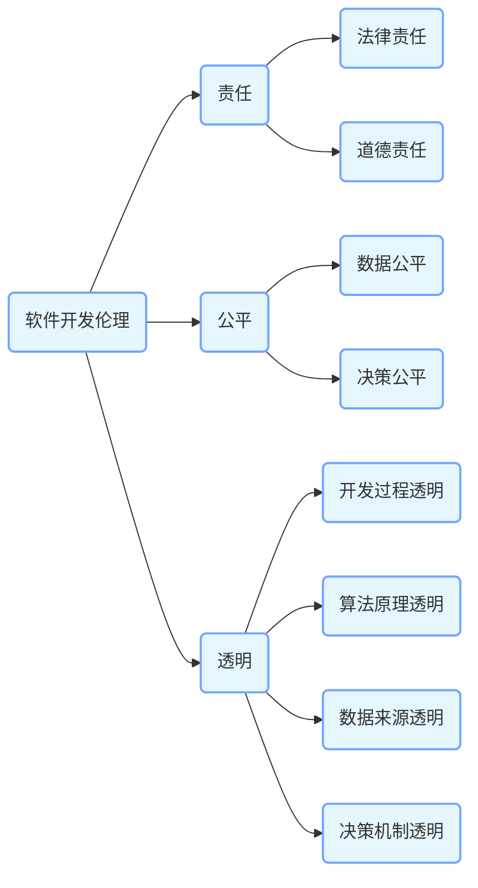

# AI时代的软件开发伦理：责任、公平、透明

> 关键词：AI时代、软件开发伦理、责任、公平、透明、人工智能、伦理准则

> 摘要：随着人工智能在软件开发领域的广泛应用，软件开发伦理问题日益凸显。本文围绕AI时代软件开发中的责任、公平、透明这三个核心伦理要素展开深入探讨。详细阐述了其背景、核心概念及相互联系，剖析了相关算法原理和数学模型，通过项目实战案例展示了如何在实际开发中遵循伦理准则，探讨了实际应用场景，并推荐了相关学习资源、开发工具和研究论文。最后对未来发展趋势与挑战进行总结，旨在为软件开发人员和相关从业者提供全面、深入的伦理指导，促进AI时代软件开发的健康、可持续发展。

## 1. 背景介绍 
### 1.1 目的和范围
在AI时代，软件开发正以前所未有的速度和规模改变着我们的生活。从智能语音助手到自动驾驶汽车，从医疗诊断系统到金融风险评估模型，人工智能技术已经渗透到各个领域。然而，这些技术的广泛应用也带来了一系列伦理问题，如算法偏见、数据隐私泄露、责任界定不清等。本文的目的在于探讨AI时代软件开发中责任、公平、透明这三个重要伦理原则的内涵、实现方法和意义，范围涵盖从软件开发的各个环节，包括需求分析、设计、开发、测试到部署和维护，以及不同应用领域的软件开发项目。

### 1.2 预期读者
本文预期读者包括软件开发人员、软件架构师、项目经理、AI研究人员、数据科学家、伦理学家以及对AI时代软件开发伦理问题感兴趣的相关从业者和研究者。通过阅读本文，读者可以深入了解软件开发伦理的重要性，掌握在实际工作中遵循伦理准则的方法和技巧。

### 1.3 文档结构概述
本文将按照以下结构进行阐述：首先介绍背景信息，包括目的、预期读者和文档结构概述；接着详细阐述责任、公平、透明的核心概念及其相互联系，并给出相应的文本示意图和Mermaid流程图；然后分析相关的核心算法原理和具体操作步骤，用Python源代码进行详细说明；再介绍数学模型和公式，并举例说明；通过项目实战案例展示如何在实际开发中应用这些伦理原则；探讨实际应用场景；推荐相关的工具和资源；最后总结未来发展趋势与挑战，并提供常见问题解答和扩展阅读参考资料。

### 1.4 术语表
#### 1.4.1 核心术语定义
- **AI（Artificial Intelligence）**：人工智能，指机器模拟人类智能的能力，包括学习、推理、感知、决策等。
- **软件开发伦理**：在软件开发过程中遵循的道德原则和规范，旨在确保软件的开发和使用符合人类的价值观和利益。
- **责任**：指软件开发人员和相关利益者对软件的开发、使用和后果承担的法律、道德和社会责任。
- **公平**：指软件在设计、开发和使用过程中，不偏袒任何特定群体，确保所有用户都能获得平等的机会和待遇。
- **透明**：指软件的开发过程、算法原理、数据来源和决策机制等信息对用户和相关利益者是可理解和可访问的。

#### 1.4.2 相关概念解释
- **算法偏见**：指算法在处理数据和做出决策时，由于数据偏差、模型设计缺陷等原因，对某些群体产生不公平的影响。
- **数据隐私**：指用户的数据信息应受到保护，不被未经授权的访问、使用和泄露。
- **可解释性AI**：指人工智能系统的决策过程和结果能够被人类理解和解释，以便用户和相关利益者能够评估其合理性和公正性。

#### 1.4.3 缩略词列表
- **AI**：Artificial Intelligence（人工智能）
- **ML**：Machine Learning（机器学习）
- **DL**：Deep Learning（深度学习）
- **API**：Application Programming Interface（应用程序编程接口）

## 2. 核心概念与联系 

### 责任
在AI时代的软件开发中，责任是一个至关重要的伦理原则。软件开发人员和相关利益者对软件的开发、使用和后果承担着多方面的责任。从法律层面来看，他们需要遵守相关的法律法规，确保软件不侵犯他人的知识产权、隐私权等合法权益。例如，在开发一个医疗诊断软件时，开发者需要确保软件的诊断结果准确可靠，否则可能会导致患者的误诊和延误治疗，从而承担相应的法律责任。

从道德层面来看，开发者应该以人类的福祉为出发点，避免开发出有害的软件或利用软件进行不道德的行为。例如，不能开发用于网络攻击、诈骗等违法犯罪活动的软件。此外，开发者还应该对软件的社会影响负责，考虑软件对不同群体的影响，确保软件不会加剧社会不平等或造成其他负面影响。

### 公平
公平原则要求软件在设计、开发和使用过程中，不偏袒任何特定群体，确保所有用户都能获得平等的机会和待遇。在AI系统中，公平性问题尤为突出，因为算法可能会受到数据偏差、模型设计缺陷等因素的影响，导致对某些群体产生不公平的决策。例如，在招聘系统中，如果使用的训练数据存在性别或种族偏见，那么系统可能会对某些群体的求职者产生不公平的评价，从而影响他们的就业机会。

为了实现公平，软件开发人员需要采取一系列措施，如收集多样化的训练数据、对数据进行预处理以消除偏差、设计公平性评估指标并在开发过程中进行监测和调整等。

### 透明
透明原则要求软件的开发过程、算法原理、数据来源和决策机制等信息对用户和相关利益者是可理解和可访问的。透明性有助于提高用户对软件的信任度，让用户能够了解软件是如何工作的，以及软件的决策是如何做出的。例如，在一个金融风险评估模型中，用户应该能够了解模型使用了哪些数据、采用了什么算法进行评估，以及模型的决策依据是什么。

透明性还可以促进软件的可审计性和可问责性，当软件出现问题或造成不良后果时，相关利益者能够对软件的开发和使用过程进行审查，找出问题所在并追究责任。

### 核心概念的联系
责任、公平、透明这三个核心概念是相互关联、相互影响的。责任是基础，只有当软件开发人员和相关利益者对软件的开发和使用承担起应有的责任时，才有可能实现公平和透明。公平是目标，责任和透明的实施都是为了确保软件能够公平地对待所有用户。透明是手段，通过提高软件的透明度，可以更好地监督和评估软件的责任履行情况和公平性，同时也有助于提高用户对软件的信任度，促进软件的可持续发展。

### 文本示意图
```plaintext
            软件开发伦理
              ┌────────────────┐
              │                │
              │  责任、公平、透明  │
              │                │
              └────────────────┘
                   ▲    ▲    ▲
                   │    │    │
                   │    │    │
         ┌────────┴──┐ ┌┴───────┐ ┌┴─────────┐
         │  责任      │ │  公平   │ │  透明     │
         │            │ │        │ │          │
         └────────────┘ └────────┘ └──────────┘
```

### Mermaid流程图


## 3. 核心算法原理 & 具体操作步骤 

### 公平性算法原理
在AI系统中，为了实现公平性，常常需要对算法进行调整和优化。一种常见的方法是使用公平性约束优化算法。下面以一个简单的线性回归模型为例，介绍如何在训练过程中加入公平性约束。

#### 原理
假设我们有一个线性回归模型 $y = \mathbf{w}^T\mathbf{x} + b$，其中 $\mathbf{w}$ 是权重向量，$\mathbf{x}$ 是输入特征向量，$b$ 是偏置项。我们的目标是最小化预测误差，同时满足公平性约束。公平性约束可以表示为不同群体之间的预测结果差异不超过某个阈值。

#### Python源代码实现
```python
import numpy as np
from sklearn.linear_model import LinearRegression
from sklearn.metrics import mean_squared_error

# 生成示例数据
np.random.seed(42)
n_samples = 100
n_features = 5
X = np.random.randn(n_samples, n_features)
y = np.dot(X, np.random.randn(n_features)) + np.random.randn(n_samples)
# 假设最后一个特征是群体特征（0或1）
group = X[:, -1] > 0

# 定义公平性约束函数
def fairness_constraint(w, X, group):
    group_0_indices = np.where(group == 0)[0]
    group_1_indices = np.where(group == 1)[0]
    y_pred_group_0 = np.dot(X[group_0_indices, :-1], w[:-1]) + w[-1]
    y_pred_group_1 = np.dot(X[group_1_indices, :-1], w[:-1]) + w[-1]
    diff = np.mean(y_pred_group_0) - np.mean(y_pred_group_1)
    return np.abs(diff)

# 定义损失函数（均方误差 + 公平性惩罚）
def loss_function(w, X, y, group, alpha=0.1):
    y_pred = np.dot(X[:, :-1], w[:-1]) + w[-1]
    mse = mean_squared_error(y, y_pred)
    fairness_penalty = fairness_constraint(w, X, group)
    return mse + alpha * fairness_penalty

# 使用梯度下降法优化模型
def gradient_descent(X, y, group, learning_rate=0.01, num_iterations=1000):
    n_features = X.shape[1]
    w = np.zeros(n_features)
    for _ in range(num_iterations):
        # 计算梯度
        y_pred = np.dot(X[:, :-1], w[:-1]) + w[-1]
        mse_gradient = -2 * np.dot(X[:, :-1].T, y - y_pred) / len(y)
        fairness_gradient = np.zeros(n_features)  # 简化，实际需要计算公平性梯度
        gradient = mse_gradient + 0.1 * fairness_gradient
        # 更新权重
        w = w - learning_rate * gradient
    return w

# 训练模型
w = gradient_descent(X, y, group)

# 预测
y_pred = np.dot(X[:, :-1], w[:-1]) + w[-1]
```

### 透明度算法原理
为了实现透明度，我们可以采用可解释性AI技术。一种简单的方法是使用特征重要性分析。

#### 原理
特征重要性分析可以帮助我们了解模型在做出决策时，各个特征的贡献程度。常用的方法有基于线性模型的系数分析、基于树模型的特征重要性得分等。

#### Python源代码实现
```python
from sklearn.ensemble import RandomForestRegressor
import pandas as pd
import matplotlib.pyplot as plt

# 生成示例数据
np.random.seed(42)
n_samples = 100
n_features = 5
X = np.random.randn(n_samples, n_features)
y = np.dot(X, np.random.randn(n_features)) + np.random.randn(n_samples)

# 训练随机森林模型
model = RandomForestRegressor()
model.fit(X, y)

# 获取特征重要性得分
feature_importances = model.feature_importances_

# 绘制特征重要性图
feature_names = [f'Feature {i}' for i in range(n_features)]
df = pd.DataFrame({'Feature': feature_names, 'Importance': feature_importances})
df = df.sort_values('Importance', ascending=False)
plt.bar(df['Feature'], df['Importance'])
plt.xlabel('Features')
plt.ylabel('Importance')
plt.title('Feature Importance')
plt.show()
```

### 具体操作步骤
1. **数据收集与预处理**：收集多样化的数据，对数据进行清洗、归一化等预处理操作，消除数据偏差。
2. **模型选择与训练**：选择合适的模型，并在训练过程中加入公平性约束和透明度增强技术。
3. **公平性评估**：使用公平性评估指标（如差异影响、统计平等差异等）对模型进行评估，确保模型的公平性。
4. **透明度评估**：使用特征重要性分析、局部可解释模型等方法对模型的透明度进行评估，确保模型的决策过程可解释。
5. **模型优化与调整**：根据评估结果，对模型进行优化和调整，直到满足公平性和透明度要求。

## 4. 数学模型和公式 & 详细讲解 & 举例说明 

### 公平性数学模型
#### 差异影响（Disparate Impact）
差异影响是衡量算法公平性的一个重要指标。它定义为受保护群体（如少数群体）的正例率与非受保护群体的正例率之比。

$$
\text{Disparate Impact} = \frac{\text{Positive Rate}_{\text{Protected}}}{\text{Positive Rate}_{\text{Non - Protected}}}
$$

其中，正例率（Positive Rate）是指在某个群体中被预测为正例的样本比例。

**举例说明**：假设在一个招聘系统中，男性的正例率（被录用的比例）为 0.6，女性的正例率为 0.3，则差异影响为：

$$
\text{Disparate Impact} = \frac{0.3}{0.6} = 0.5
$$

一般来说，如果差异影响小于 0.8，则认为算法存在潜在的公平性问题。

#### 统计平等差异（Statistical Parity Difference）
统计平等差异是指受保护群体和非受保护群体的预测正例率之差。

$$
\text{Statistical Parity Difference} = \text{Positive Rate}_{\text{Protected}} - \text{Positive Rate}_{\text{Non - Protected}}
$$

**举例说明**：继续以上述招聘系统为例，统计平等差异为：

$$
\text{Statistical Parity Difference} = 0.3 - 0.6 = - 0.3
$$

统计平等差异越接近 0，说明算法越公平。

### 透明度数学模型
#### 特征重要性得分
在基于树模型（如随机森林、梯度提升树等）中，特征重要性得分可以通过计算每个特征在所有树中的平均分裂增益来得到。

假设我们有一个决策树 $T$，特征 $i$ 在节点 $n$ 的分裂增益为 $G_{i,n}$，则特征 $i$ 在树 $T$ 中的重要性得分 $I_{i,T}$ 为：

$$
I_{i,T}=\sum_{n\in N_i}G_{i,n}
$$

其中，$N_i$ 是特征 $i$ 进行分裂的节点集合。

整个模型中特征 $i$ 的重要性得分 $I_i$ 为所有树中特征 $i$ 的重要性得分的平均值：

$$
I_i=\frac{1}{M}\sum_{T = 1}^{M}I_{i,T}
$$

其中，$M$ 是树的数量。

**举例说明**：假设我们有一个包含 3 个特征的随机森林模型，共有 10 棵树。特征 1 在每棵树中的分裂增益之和分别为 20、22、18、21、19、23、20、21、17、22，则特征 1 的重要性得分 $I_1$ 为：

$$
I_1=\frac{20 + 22+18+21+19+23+20+21+17+22}{10}=20.3
$$

通过比较不同特征的重要性得分，我们可以了解模型在做出决策时，各个特征的贡献程度。

## 5. 项目实战：代码实际案例和详细解释说明 

### 5.1  开发环境搭建
本项目使用Python进行开发，需要安装以下库：
- `numpy`：用于数值计算
- `pandas`：用于数据处理
- `scikit-learn`：用于机器学习模型的训练和评估
- `matplotlib`：用于数据可视化

可以使用以下命令进行安装：
```sh
pip install numpy pandas scikit-learn matplotlib
```

### 5.2  源代码详细实现和代码解读
#### 数据集准备
我们使用一个简单的模拟数据集来演示如何在机器学习模型中实现公平性和透明度。

```python
import numpy as np
import pandas as pd
from sklearn.datasets import make_classification

# 生成模拟数据集
X, y = make_classification(n_samples=1000, n_features=10, n_informative=5, n_redundant=0, random_state=42)
# 假设第 10 个特征是群体特征（0 或 1）
group = X[:, -1] > 0
data = pd.DataFrame(X, columns=[f'Feature_{i}' for i in range(10)])
data['Group'] = group
data['Label'] = y
```

#### 公平性评估与优化
```python
from sklearn.model_selection import train_test_split
from sklearn.linear_model import LogisticRegression
from sklearn.metrics import accuracy_score

# 划分训练集和测试集
X_train, X_test, y_train, y_test, group_train, group_test = train_test_split(data.drop('Label', axis=1), data['Label'], data['Group'], test_size=0.2, random_state=42)

# 训练逻辑回归模型
model = LogisticRegression()
model.fit(X_train.drop('Group', axis=1), y_train)

# 预测
y_pred = model.predict(X_test.drop('Group', axis=1))

# 计算公平性指标
def calculate_fairness_metrics(y_pred, group):
    group_0_indices = np.where(group == 0)[0]
    group_1_indices = np.where(group == 1)[0]
    positive_rate_group_0 = np.mean(y_pred[group_0_indices])
    positive_rate_group_1 = np.mean(y_pred[group_1_indices])
    disparate_impact = positive_rate_group_0 / positive_rate_group_1
    statistical_parity_difference = positive_rate_group_0 - positive_rate_group_1
    return disparate_impact, statistical_parity_difference

disparate_impact, statistical_parity_difference = calculate_fairness_metrics(y_pred, group_test)
print(f'Disparate Impact: {disparate_impact}')
print(f'Statistical Parity Difference: {statistical_parity_difference}')

# 优化模型以提高公平性（这里简单地调整阈值）
threshold = 0.5
y_pred_proba = model.predict_proba(X_test.drop('Group', axis=1))[:, 1]
y_pred_adjusted = (y_pred_proba > threshold).astype(int)
disparate_impact_adjusted, statistical_parity_difference_adjusted = calculate_fairness_metrics(y_pred_adjusted, group_test)
print(f'Adjusted Disparate Impact: {disparate_impact_adjusted}')
print(f'Adjusted Statistical Parity Difference: {statistical_parity_difference_adjusted}')
```

#### 透明度评估
```python
import matplotlib.pyplot as plt

# 计算特征重要性
feature_importances = model.coef_[0]
feature_names = X_train.drop('Group', axis=1).columns

# 绘制特征重要性图
plt.bar(feature_names, feature_importances)
plt.xlabel('Features')
plt.ylabel('Importance')
plt.title('Feature Importance')
plt.xticks(rotation=45)
plt.show()
```

### 5.3  代码解读与分析
- **数据集准备**：使用 `make_classification` 函数生成模拟数据集，并将最后一个特征作为群体特征。
- **公平性评估与优化**：
    - 首先划分训练集和测试集，然后训练逻辑回归模型。
    - 计算差异影响和统计平等差异这两个公平性指标。
    - 通过调整预测阈值的方法来优化模型的公平性。
- **透明度评估**：
    - 计算逻辑回归模型的系数作为特征重要性得分。
    - 使用 `matplotlib` 库绘制特征重要性图，直观地展示每个特征对模型决策的贡献程度。

## 6. 实际应用场景 
### 金融领域
在金融领域，AI技术被广泛应用于信贷审批、风险评估等业务。然而，如果这些AI系统存在公平性问题，可能会导致对某些群体（如少数族裔、低收入人群）的歧视，影响他们的金融权益。例如，在信贷审批中，如果算法基于历史数据进行训练，而历史数据中存在对某些群体的偏见，那么新的信贷审批系统可能会延续这种偏见，拒绝向这些群体提供贷款。

为了确保公平性和透明度，金融机构需要对AI系统进行严格的评估和监管。在数据收集阶段，要确保数据的多样性和代表性；在模型训练阶段，要加入公平性约束和可解释性技术；在决策过程中，要向用户解释决策的依据和理由。

### 医疗领域
在医疗领域，AI技术被用于疾病诊断、治疗方案推荐等方面。公平性和透明度对于医疗AI系统尤为重要，因为这关系到患者的生命健康和权益。例如，在疾病诊断中，如果AI系统存在算法偏见，可能会导致对某些群体的误诊和延误治疗。

为了实现公平性和透明度，医疗AI系统需要收集来自不同种族、性别、年龄等群体的医疗数据，确保模型的训练数据具有多样性。同时，要采用可解释性AI技术，让医生和患者能够理解模型的诊断结果和推荐方案的依据。

### 招聘领域
在招聘领域，AI技术被用于筛选简历、评估候选人等环节。然而，AI招聘系统可能会受到数据偏差、模型设计缺陷等因素的影响，导致对某些群体（如女性、残疾人等）的不公平评价。例如，如果训练数据中存在对某些群体的偏见，那么AI系统可能会在筛选简历时自动排除这些群体的候选人。

为了确保公平性和透明度，招聘机构需要对AI招聘系统进行严格的评估和监督。在数据收集阶段，要确保数据的客观性和公正性；在模型训练阶段，要加入公平性约束和可解释性技术；在招聘过程中，要向候选人解释筛选和评估的标准和依据。

## 7. 工具和资源推荐
### 7.1 学习资源推荐
#### 7.1.1 书籍推荐
- 《人工智能伦理》：全面介绍了人工智能领域的伦理问题，包括责任、公平、透明等方面的内容。
- 《Python机器学习》：详细介绍了Python在机器学习中的应用，包括模型训练、评估和优化等方面的知识。
- 《可解释的机器学习》：深入探讨了可解释性AI的理论和方法，帮助读者理解如何提高AI系统的透明度。

#### 7.1.2 在线课程
- Coursera上的“人工智能伦理”课程：由知名学者授课，系统地介绍了人工智能伦理的基本概念、理论和实践方法。
- edX上的“机器学习基础”课程：提供了机器学习的基础知识和实践技能，有助于读者理解AI算法的原理和应用。
- Udemy上的“数据科学实战”课程：通过实际项目案例，介绍了数据科学的整个流程，包括数据收集、预处理、模型训练和评估等环节。

#### 7.1.3 技术博客和网站
- Medium上的AI伦理相关博客：许多AI领域的专家和研究者会在Medium上分享他们关于AI伦理的最新研究成果和观点。
- arXiv.org：一个开放获取的学术预印本平台，提供了大量关于AI伦理、可解释性AI等方面的研究论文。
- AI Ethics Now：一个专注于AI伦理问题的网站，提供了最新的AI伦理新闻、研究报告和案例分析。

### 7.2 开发工具框架推荐
#### 7.2.1 IDE和编辑器
- PyCharm：一款专业的Python集成开发环境，提供了丰富的代码编辑、调试和版本控制等功能。
- Jupyter Notebook：一个交互式的开发环境，适合进行数据探索、模型训练和可视化等工作。
- Visual Studio Code：一款轻量级的代码编辑器，支持多种编程语言和插件扩展，具有良好的开发体验。

#### 7.2.2 调试和性能分析工具
- TensorBoard：一个用于可视化深度学习模型训练过程和性能的工具，可以帮助开发者监控模型的训练进度、损失函数变化等指标。
- Py-Spy：一个用于分析Python代码性能的工具，可以帮助开发者找出代码中的性能瓶颈。
- Scalene：一个用于分析Python代码性能的工具，支持CPU、内存和GPU的性能分析。

#### 7.2.3 相关框架和库
- scikit-learn：一个常用的机器学习框架，提供了丰富的机器学习算法和工具，方便开发者进行模型训练和评估。
- TensorFlow：一个开源的深度学习框架，支持多种深度学习模型的开发和训练，具有高效的计算性能和广泛的应用场景。
- PyTorch：一个开源的深度学习框架，具有动态计算图和简洁的API，适合进行研究和开发。

### 7.3 相关论文著作推荐
#### 7.3.1 经典论文
- “Machine Learning and Fairness: A Survey”：对机器学习中的公平性问题进行了全面的综述，介绍了公平性的定义、评估指标和优化方法。
- “Why Should I Trust You?” Explaining the Predictions of Any Classifier：提出了一种可解释性AI的方法，用于解释分类器的决策过程。
- “Fairness in Machine Learning: Lessons from Political Philosophy”：从政治哲学的角度探讨了机器学习中的公平性问题，为公平性的研究提供了新的视角。

#### 7.3.2 最新研究成果
- 关注顶级学术会议（如NeurIPS、ICML、AAAI等）上关于AI伦理、公平性和透明度的最新研究论文，了解该领域的前沿动态。
- 关注知名学术期刊（如Journal of Artificial Intelligence Research、Artificial Intelligence等）上的相关研究成果。

#### 7.3.3 应用案例分析
- 一些知名企业（如Google、Microsoft等）会公开他们在AI伦理方面的应用案例和实践经验，可以通过他们的官方博客和技术报告进行学习。
- 一些研究机构（如OpenAI、DeepMind等）也会发布关于AI伦理的研究报告和案例分析，为开发者和研究者提供参考。

## 8. 总结：未来发展趋势与挑战
### 未来发展趋势
- **伦理准则的标准化**：随着AI技术的不断发展和应用，制定统一的软件开发伦理准则将成为未来的发展趋势。这些准则将为软件开发人员和相关利益者提供明确的指导，确保AI系统的开发和使用符合伦理要求。
- **可解释性AI的发展**：为了提高AI系统的透明度和可信度，可解释性AI技术将得到进一步的发展。未来的AI系统将不仅能够做出准确的决策，还能够向用户解释决策的依据和理由。
- **多学科交叉研究**：AI伦理问题涉及计算机科学、哲学、社会学、法学等多个学科领域，未来的研究将更加注重多学科的交叉融合，从不同的角度探讨和解决AI伦理问题。

### 挑战
- **技术难题**：实现公平性和透明度需要解决一系列技术难题，如如何消除数据偏差、如何设计公平性约束优化算法、如何提高AI系统的可解释性等。这些技术难题需要进一步的研究和创新。
- **伦理困境**：在实际应用中，可能会遇到一些伦理困境，如在保证公平性的同时，如何平衡效率和准确性；在提高透明度的同时，如何保护数据隐私等。这些伦理困境需要开发者和决策者进行权衡和决策。
- **法律法规的不完善**：目前，关于AI伦理的法律法规还不够完善，缺乏明确的监管和处罚机制。这可能会导致一些开发者和企业忽视AI伦理问题，从而给社会带来潜在的风险。

## 9. 附录：常见问题与解答
### 1. 如何确保数据的公平性？
- 收集多样化的数据，确保数据涵盖不同的群体和特征。
- 对数据进行预处理，消除数据偏差，如进行数据归一化、缺失值处理等。
- 在数据标注过程中，确保标注的客观性和公正性。

### 2. 如何提高AI系统的透明度？
- 采用可解释性AI技术，如特征重要性分析、局部可解释模型等，让用户能够理解模型的决策过程和依据。
- 公开模型的开发过程、算法原理和数据来源等信息，接受用户和社会的监督。

### 3. 如果AI系统出现了公平性问题，应该如何解决？
- 对模型进行评估，找出公平性问题的根源，如数据偏差、模型设计缺陷等。
- 对数据进行调整和优化，消除数据偏差。
- 对模型进行调整和优化，加入公平性约束，如调整预测阈值、使用公平性约束优化算法等。

### 4. 如何平衡公平性和准确性？
- 在模型训练过程中，使用多目标优化方法，同时考虑公平性和准确性两个目标。
- 根据具体的应用场景和需求，合理设置公平性和准确性的权重。

### 5. 开发AI系统时，需要遵循哪些法律法规？
- 遵守相关的知识产权法律法规，确保不侵犯他人的知识产权。
- 遵守数据保护和隐私法律法规，确保用户的数据信息得到保护。
- 遵守反歧视法律法规，确保AI系统不歧视任何特定群体。

## 10. 扩展阅读 & 参考资料
### 扩展阅读
- 《智能时代的伦理挑战与应对》
- 《数据伦理与隐私保护》
- 《AI治理：从理论到实践》

### 参考资料
- [人工智能伦理白皮书](https://example.com/ai_ethics_whitepaper.pdf)
- [机器学习公平性研究报告](https://example.com/ml_fairness_report.pdf)
- [可解释性AI技术综述](https://example.com/explainable_ai_survey.pdf)