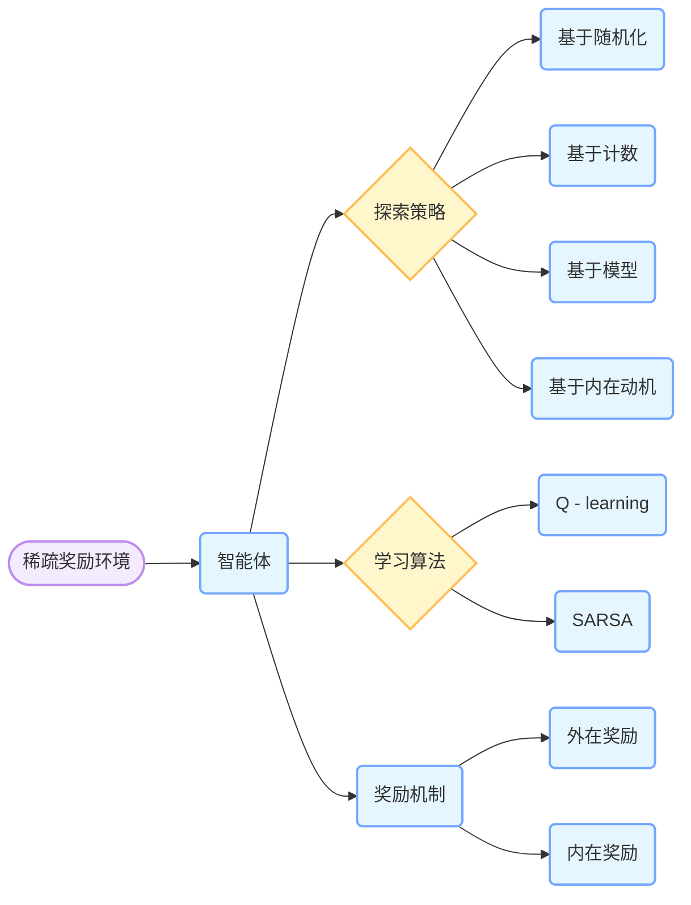

# AI系统在处理稀疏奖励环境时的探索策略

> 关键词：AI系统、稀疏奖励环境、探索策略、强化学习、智能体、奖励机制、策略优化

> 摘要：本文围绕AI系统在处理稀疏奖励环境时的探索策略展开深入探讨。稀疏奖励环境给AI系统的学习和决策带来了巨大挑战，传统的学习方法往往难以有效应对。文章首先介绍了相关背景知识，包括目的范围、预期读者等。接着详细阐述了核心概念与联系，通过文本示意图和Mermaid流程图进行清晰展示。深入分析了核心算法原理，并结合Python源代码进行详细说明。对涉及的数学模型和公式进行了详细讲解并举例。通过项目实战展示了代码的实际应用和详细解释。探讨了实际应用场景，推荐了相关的工具和资源。最后总结了未来发展趋势与挑战，还设置了附录解答常见问题，并提供了扩展阅读和参考资料，旨在为研究者和开发者提供全面且深入的技术指导，助力解决AI系统在稀疏奖励环境下的探索难题。

## 1. 背景介绍 
### 1.1 目的和范围
在人工智能领域，智能体的学习和决策通常依赖于环境反馈的奖励信号。然而，在许多实际应用场景中，奖励信号是稀疏的，即智能体在大部分时间内无法获得明确的奖励反馈。例如，在机器人探索未知环境、复杂游戏任务、自动驾驶等场景中，智能体可能需要经过大量的试错才能获得一次有效的奖励。这种稀疏奖励环境给AI系统的学习和决策带来了巨大挑战，传统的强化学习算法往往难以收敛或学习效率极低。

本文的目的在于深入研究AI系统在处理稀疏奖励环境时的探索策略，详细介绍各种探索策略的原理、算法和应用案例，分析其优缺点和适用场景，为研究者和开发者提供全面的技术参考和指导。

本文的范围涵盖了主流的探索策略，包括基于随机化的探索策略、基于计数的探索策略、基于模型的探索策略、基于内在动机的探索策略等，同时还会涉及到相关的数学模型、算法实现和实际应用场景。

### 1.2 预期读者
本文的预期读者包括但不限于以下几类人群：
- **人工智能研究者**：对强化学习、探索策略等领域感兴趣的研究人员，希望通过本文深入了解处理稀疏奖励环境的最新技术和研究成果。
- **开发者**：从事AI系统开发的工程师，如机器人开发者、游戏开发者、自动驾驶工程师等，希望借鉴本文中的探索策略来解决实际项目中遇到的稀疏奖励问题。
- **学生**：学习人工智能、机器学习等相关专业的学生，通过阅读本文可以加深对强化学习和探索策略的理解，拓宽知识面。
- **技术爱好者**：对人工智能技术有浓厚兴趣的爱好者，希望通过本文了解AI系统在复杂环境下的工作原理和挑战。

### 1.3 文档结构概述
本文的结构如下：
- **核心概念与联系**：介绍稀疏奖励环境、探索策略等核心概念，通过文本示意图和Mermaid流程图展示它们之间的联系。
- **核心算法原理 & 具体操作步骤**：详细阐述各种探索策略的核心算法原理，并结合Python源代码进行说明。
- **数学模型和公式 & 详细讲解 & 举例说明**：介绍与探索策略相关的数学模型和公式，并通过具体例子进行讲解。
- **项目实战：代码实际案例和详细解释说明**：通过一个实际的项目案例，展示如何在稀疏奖励环境中应用探索策略，包括开发环境搭建、源代码实现和代码解读。
- **实际应用场景**：探讨AI系统在处理稀疏奖励环境时的探索策略在不同领域的实际应用场景。
- **工具和资源推荐**：推荐学习探索策略的相关资源，包括书籍、在线课程、技术博客等，以及开发工具、框架和相关论文著作。
- **总结：未来发展趋势与挑战**：总结AI系统在处理稀疏奖励环境时的探索策略的发展趋势和面临的挑战。
- **附录：常见问题与解答**：解答读者在学习和应用探索策略过程中可能遇到的常见问题。
- **扩展阅读 & 参考资料**：提供与探索策略相关的扩展阅读材料和参考资料。

### 1.4 术语表
#### 1.4.1 核心术语定义
- **稀疏奖励环境**：指智能体在大部分时间内无法获得明确奖励反馈的环境，奖励信号在时间和空间上分布稀疏。
- **探索策略**：智能体在环境中进行探索以发现新的状态和动作，从而更好地学习和优化策略的方法。
- **强化学习**：一种机器学习范式，智能体通过与环境进行交互，根据环境反馈的奖励信号来学习最优策略。
- **智能体**：在环境中进行决策和行动的实体，通过与环境交互来学习和优化策略。
- **奖励机制**：环境向智能体提供反馈的方式，用于评估智能体的行为表现。

#### 1.4.2 相关概念解释
- **利用（Exploitation）**：智能体选择当前认为最优的动作，以获取最大的即时奖励。
- **探索（Exploration）**：智能体尝试不同的动作，以发现新的状态和动作，从而获取更多的信息。
- **策略（Policy）**：智能体在不同状态下选择动作的规则。
- **状态（State）**：环境的当前描述，智能体根据状态来做出决策。
- **动作（Action）**：智能体在某个状态下可以采取的行为。

#### 1.4.3 缩略词列表
- **RL**：Reinforcement Learning，强化学习
- **Q - learning**：一种基于值函数的强化学习算法
- **SARSA**：State - Action - Reward - State - Action，一种基于策略的强化学习算法
- **UCB**：Upper Confidence Bound，上置信界算法
- **ICM**：Intrinsic Curiosity Module，内在好奇心模块

## 2. 核心概念与联系 
### 核心概念原理
#### 稀疏奖励环境
在稀疏奖励环境中，智能体大部分时间接收到的奖励为零，只有在极少数情况下才能获得非零奖励。这使得智能体难以确定哪些动作是有效的，哪些动作是无效的，从而导致学习效率低下。例如，在一个迷宫探索任务中，智能体只有到达终点才能获得奖励，在到达终点之前，它在迷宫中四处探索都不会得到任何奖励。

#### 探索策略
探索策略的目的是让智能体在环境中进行有效的探索，以发现新的状态和动作，从而更好地学习和优化策略。常见的探索策略包括基于随机化的探索策略、基于计数的探索策略、基于模型的探索策略和基于内在动机的探索策略等。

基于随机化的探索策略通过在动作选择中引入随机性来鼓励智能体探索新的动作。例如，$\epsilon$-贪心策略在一定概率$\epsilon$下随机选择动作，而在$1 - \epsilon$的概率下选择当前认为最优的动作。

基于计数的探索策略通过记录智能体访问每个状态或状态 - 动作对的次数，为访问次数少的状态或状态 - 动作对提供额外的奖励，从而鼓励智能体探索未被充分访问的区域。

基于模型的探索策略通过学习环境的模型来预测未来的状态和奖励，智能体可以根据模型的不确定性来选择动作，优先探索模型不确定性高的区域。

基于内在动机的探索策略通过设计内在奖励函数，为智能体的探索行为提供额外的奖励，以鼓励智能体主动探索环境。例如，内在好奇心模块（ICM）通过预测智能体的动作对环境状态的影响，为预测误差大的动作提供额外的奖励。

### 架构的文本示意图
```plaintext
+------------------+
|  稀疏奖励环境   |
+------------------+
         |
         v
+------------------+
|  智能体          |
|  - 探索策略      |
|    - 基于随机化  |
|    - 基于计数    |
|    - 基于模型    |
|    - 基于内在动机|
|  - 学习算法      |
|    - Q - learning |
|    - SARSA       |
+------------------+
         |
         v
+------------------+
|  奖励机制        |
|  - 外在奖励      |
|  - 内在奖励      |
+------------------+
```

### Mermaid流程图


## 3. 核心算法原理 & 具体操作步骤 
### 基于随机化的探索策略：$\epsilon$-贪心策略
#### 算法原理
$\epsilon$-贪心策略是一种简单而常用的基于随机化的探索策略。在每个时间步，智能体以概率$\epsilon$随机选择一个动作，以概率$1 - \epsilon$选择当前认为最优的动作。随着学习的进行，$\epsilon$的值可以逐渐减小，以平衡探索和利用。

#### Python源代码实现
```python
import numpy as np

class EpsilonGreedyAgent:
    def __init__(self, num_actions, epsilon=0.1):
        self.num_actions = num_actions
        self.epsilon = epsilon
        self.q_values = np.zeros(num_actions)

    def choose_action(self):
        if np.random.uniform(0, 1) < self.epsilon:
            # 随机选择一个动作
            action = np.random.randint(0, self.num_actions)
        else:
            # 选择Q值最大的动作
            action = np.argmax(self.q_values)
        return action

    def update_q_values(self, action, reward, alpha=0.1, gamma=0.9):
        # 简单的Q值更新公式
        max_q_value = np.max(self.q_values)
        self.q_values[action] += alpha * (reward + gamma * max_q_value - self.q_values[action])
```

#### 具体操作步骤
1. 初始化智能体的Q值数组`q_values`为全零，设置$\epsilon$的值。
2. 在每个时间步，智能体根据$\epsilon$-贪心策略选择一个动作。
3. 执行选择的动作，观察环境反馈的奖励和下一个状态。
4. 根据奖励和下一个状态更新Q值数组。
5. 重复步骤2 - 4，直到达到终止条件。

### 基于计数的探索策略：计数奖励法
#### 算法原理
计数奖励法通过记录智能体访问每个状态 - 动作对的次数，为访问次数少的状态 - 动作对提供额外的奖励。额外奖励的计算公式为：
$r_{bonus}=\frac{k}{\sqrt{N(s,a)}}$
其中，$k$是一个常数，$N(s,a)$是智能体访问状态$s$并执行动作$a$的次数。

#### Python源代码实现
```python
import numpy as np

class CountBasedAgent:
    def __init__(self, num_states, num_actions, k=1.0):
        self.num_states = num_states
        self.num_actions = num_actions
        self.k = k
        self.q_values = np.zeros((num_states, num_actions))
        self.visit_counts = np.zeros((num_states, num_actions))

    def choose_action(self, state):
        # 选择Q值最大的动作
        action = np.argmax(self.q_values[state])
        return action

    def update_q_values(self, state, action, reward, alpha=0.1, gamma=0.9):
        # 更新访问次数
        self.visit_counts[state][action] += 1
        # 计算额外奖励
        bonus = self.k / np.sqrt(self.visit_counts[state][action])
        # 总奖励
        total_reward = reward + bonus
        # 更新Q值
        max_q_value = np.max(self.q_values[state])
        self.q_values[state][action] += alpha * (total_reward + gamma * max_q_value - self.q_values[state][action])
```

#### 具体操作步骤
1. 初始化智能体的Q值数组`q_values`和访问次数数组`visit_counts`为全零，设置常数$k$的值。
2. 在每个时间步，智能体根据当前状态选择Q值最大的动作。
3. 执行选择的动作，观察环境反馈的奖励和下一个状态。
4. 更新访问次数数组，并计算额外奖励。
5. 计算总奖励（外在奖励 + 额外奖励），并更新Q值数组。
6. 重复步骤2 - 5，直到达到终止条件。

### 基于模型的探索策略：基于不确定性的模型探索
#### 算法原理
基于不确定性的模型探索通过学习环境的模型来预测未来的状态和奖励，智能体可以根据模型的不确定性来选择动作，优先探索模型不确定性高的区域。常用的方法是使用高斯过程来建模环境的动态，高斯过程可以提供预测的均值和方差，方差表示模型的不确定性。

#### Python源代码实现（简化示例）
```python
import numpy as np
from sklearn.gaussian_process import GaussianProcessRegressor
from sklearn.gaussian_process.kernels import RBF

class ModelBasedAgent:
    def __init__(self, num_actions):
        self.num_actions = num_actions
        self.model = GaussianProcessRegressor(kernel=RBF())
        self.X = []
        self.y = []

    def choose_action(self, state):
        uncertainties = []
        for action in range(self.num_actions):
            input_data = np.array([state + [action]])
            _, std = self.model.predict(input_data, return_std=True)
            uncertainties.append(std[0])
        # 选择不确定性最大的动作
        action = np.argmax(uncertainties)
        return action

    def update_model(self, state, action, next_state, reward):
        input_data = state + [action]
        output_data = np.concatenate((next_state, [reward]))
        self.X.append(input_data)
        self.y.append(output_data)
        self.model.fit(self.X, self.y)
```

#### 具体操作步骤
1. 初始化智能体的高斯过程模型。
2. 在每个时间步，智能体根据当前状态计算每个动作的模型不确定性。
3. 选择模型不确定性最大的动作。
4. 执行选择的动作，观察环境反馈的下一个状态和奖励。
5. 将当前状态、动作、下一个状态和奖励作为训练数据更新高斯过程模型。
6. 重复步骤2 - 5，直到达到终止条件。

### 基于内在动机的探索策略：内在好奇心模块（ICM）
#### 算法原理
内在好奇心模块（ICM）通过预测智能体的动作对环境状态的影响，为预测误差大的动作提供额外的奖励。ICM主要由两个网络组成：一个是逆向模型，用于预测智能体执行的动作；另一个是正向模型，用于预测下一个状态。预测误差作为内在奖励，鼓励智能体探索环境。

#### Python源代码实现（简化示例）
```python
import torch
import torch.nn as nn
import torch.optim as optim

# 逆向模型
class InverseModel(nn.Module):
    def __init__(self, state_dim, action_dim):
        super(InverseModel, self).__init__()
        self.fc1 = nn.Linear(2 * state_dim, 128)
        self.fc2 = nn.Linear(128, action_dim)

    def forward(self, state, next_state):
        x = torch.cat((state, next_state), dim=1)
        x = torch.relu(self.fc1(x))
        x = self.fc2(x)
        return x

# 正向模型
class ForwardModel(nn.Module):
    def __init__(self, state_dim, action_dim):
        super(ForwardModel, self).__init__()
        self.fc1 = nn.Linear(state_dim + action_dim, 128)
        self.fc2 = nn.Linear(128, state_dim)

    def forward(self, state, action):
        x = torch.cat((state, action), dim=1)
        x = torch.relu(self.fc1(x))
        x = self.fc2(x)
        return x

class ICMAgent:
    def __init__(self, state_dim, action_dim, lr=0.001):
        self.state_dim = state_dim
        self.action_dim = action_dim
        self.inverse_model = InverseModel(state_dim, action_dim)
        self.forward_model = ForwardModel(state_dim, action_dim)
        self.inverse_optimizer = optim.Adam(self.inverse_model.parameters(), lr=lr)
        self.forward_optimizer = optim.Adam(self.forward_model.parameters(), lr=lr)
        self.mse_loss = nn.MSELoss()

    def compute_intrinsic_reward(self, state, action, next_state):
        state = torch.FloatTensor(state).unsqueeze(0)
        action = torch.FloatTensor(action).unsqueeze(0)
        next_state = torch.FloatTensor(next_state).unsqueeze(0)

        # 逆向模型预测动作
        predicted_action = self.inverse_model(state, next_state)
        inverse_loss = self.mse_loss(predicted_action, action)

        # 正向模型预测下一个状态
        predicted_next_state = self.forward_model(state, action)
        forward_loss = self.mse_loss(predicted_next_state, next_state)

        # 内在奖励
        intrinsic_reward = forward_loss.item()

        # 更新模型
        self.inverse_optimizer.zero_grad()
        inverse_loss.backward(retain_graph=True)
        self.inverse_optimizer.step()

        self.forward_optimizer.zero_grad()
        forward_loss.backward()
        self.forward_optimizer.step()

        return intrinsic_reward
```

#### 具体操作步骤
1. 初始化逆向模型、正向模型和优化器。
2. 在每个时间步，智能体执行一个动作，观察环境反馈的下一个状态和奖励。
3. 计算逆向模型和正向模型的预测误差，作为内在奖励。
4. 使用预测误差更新逆向模型和正向模型的参数。
5. 将内在奖励和外在奖励结合，作为总奖励用于策略更新。
6. 重复步骤2 - 5，直到达到终止条件。

## 4. 数学模型和公式 & 详细讲解 & 举例说明 
### 基于随机化的探索策略：$\epsilon$-贪心策略
#### 数学模型和公式
$\epsilon$-贪心策略的动作选择规则可以表示为：
$a = \begin{cases}
\text{随机选择一个动作}, & \text{with probability } \epsilon \\
\arg\max_{a'} Q(s, a'), & \text{with probability } 1 - \epsilon
\end{cases}$
其中，$Q(s, a)$是状态$s$下执行动作$a$的Q值。

Q值的更新公式为：
$Q(s, a) \leftarrow Q(s, a) + \alpha [r + \gamma \max_{a'} Q(s', a') - Q(s, a)]$
其中，$\alpha$是学习率，$r$是环境反馈的奖励，$\gamma$是折扣因子，$s'$是下一个状态。

#### 详细讲解
$\epsilon$-贪心策略通过引入随机性来平衡探索和利用。在开始阶段，$\epsilon$的值较大，智能体更多地进行探索；随着学习的进行，$\epsilon$的值逐渐减小，智能体更多地进行利用。Q值的更新公式基于贝尔曼方程，通过不断更新Q值，智能体可以逐渐学习到最优策略。

#### 举例说明
假设智能体在一个有3个动作的环境中，当前状态下的Q值分别为$Q(s, 0) = 0.2$，$Q(s, 1) = 0.5$，$Q(s, 2) = 0.3$，$\epsilon = 0.1$。
- 以概率$0.1$，智能体随机选择一个动作，可能选择动作0、1或2。
- 以概率$0.9$，智能体选择Q值最大的动作，即动作1。

### 基于计数的探索策略：计数奖励法
#### 数学模型和公式
额外奖励的计算公式为：
$r_{bonus}=\frac{k}{\sqrt{N(s,a)}}$
总奖励的计算公式为：
$r_{total}=r + r_{bonus}$
其中，$k$是一个常数，$N(s,a)$是智能体访问状态$s$并执行动作$a$的次数，$r$是环境反馈的外在奖励。

Q值的更新公式为：
$Q(s, a) \leftarrow Q(s, a) + \alpha [r_{total} + \gamma \max_{a'} Q(s', a') - Q(s, a)]$

#### 详细讲解
计数奖励法通过为访问次数少的状态 - 动作对提供额外奖励，鼓励智能体探索未被充分访问的区域。随着访问次数的增加，额外奖励逐渐减小，智能体逐渐倾向于利用已经探索过的区域。

#### 举例说明
假设$k = 1$，智能体访问状态$s$并执行动作$a$的次数$N(s,a) = 4$，环境反馈的外在奖励$r = 0.5$。
- 额外奖励$r_{bonus}=\frac{1}{\sqrt{4}} = 0.5$。
- 总奖励$r_{total}=0.5 + 0.5 = 1$。

### 基于模型的探索策略：基于不确定性的模型探索
#### 数学模型和公式
假设使用高斯过程来建模环境的动态，对于输入$x$，高斯过程的预测均值为$\mu(x)$，预测方差为$\sigma^2(x)$。智能体选择动作的规则为：
$a = \arg\max_{a'} \sigma^2(s, a')$
其中，$\sigma^2(s, a')$是在状态$s$下执行动作$a'$的预测方差。

#### 详细讲解
基于不确定性的模型探索通过学习环境的模型，利用模型的不确定性来指导智能体的探索。智能体优先选择模型不确定性高的动作，以获取更多的信息，降低模型的不确定性。

#### 举例说明
假设智能体在状态$s$下有3个动作$a_0$、$a_1$、$a_2$，对应的预测方差分别为$\sigma^2(s, a_0) = 0.2$，$\sigma^2(s, a_1) = 0.5$，$\sigma^2(s, a_2) = 0.3$。智能体将选择动作$a_1$，因为它的预测方差最大。

### 基于内在动机的探索策略：内在好奇心模块（ICM）
#### 数学模型和公式
逆向模型的损失函数为：
$L_{inv}=\frac{1}{2} \| \hat{a} - a \|^2$
其中，$\hat{a}$是逆向模型预测的动作，$a$是实际执行的动作。

正向模型的损失函数为：
$L_{for}=\frac{1}{2} \| \hat{s}' - s' \|^2$
其中，$\hat{s}'$是正向模型预测的下一个状态，$s'$是实际的下一个状态。

内在奖励的计算公式为：
$r_{int}=L_{for}$

#### 详细讲解
内在好奇心模块通过逆向模型和正向模型来预测智能体的动作和下一个状态，预测误差作为内在奖励。逆向模型的损失函数衡量预测动作与实际动作的差异，正向模型的损失函数衡量预测下一个状态与实际下一个状态的差异。内在奖励鼓励智能体探索环境，以减少预测误差。

#### 举例说明
假设逆向模型预测的动作$\hat{a} = [0.2, 0.3, 0.5]$，实际执行的动作$a = [0, 0, 1]$，正向模型预测的下一个状态$\hat{s}' = [0.1, 0.2]$，实际的下一个状态$s' = [0.3, 0.4]$。
- 逆向模型的损失$L_{inv}=\frac{1}{2} [(0.2 - 0)^2 + (0.3 - 0)^2 + (0.5 - 1)^2] = 0.17$。
- 正向模型的损失$L_{for}=\frac{1}{2} [(0.1 - 0.3)^2 + (0.2 - 0.4)^2] = 0.04$。
- 内在奖励$r_{int}=0.04$。

## 5. 项目实战：代码实际案例和详细解释说明 
### 5.1  开发环境搭建
本项目实战将使用Python语言和OpenAI Gym库来模拟稀疏奖励环境。以下是开发环境搭建的步骤：
1. **安装Python**：确保已经安装Python 3.6或更高版本。可以从Python官方网站（https://www.python.org/downloads/）下载并安装。
2. **安装OpenAI Gym**：使用以下命令安装OpenAI Gym库：
```sh
pip install gym
```
3. **安装其他依赖库**：根据具体的探索策略，可能需要安装其他依赖库，如`numpy`、`torch`等。可以使用以下命令安装：
```sh
pip install numpy torch
```

### 5.2  源代码详细实现和代码解读
我们以基于随机化的探索策略（$\epsilon$-贪心策略）为例，实现一个智能体在OpenAI Gym的`FrozenLake-v1`环境中进行探索和学习。

```python
import gym
import numpy as np

# 定义智能体类
class EpsilonGreedyAgent:
    def __init__(self, num_states, num_actions, epsilon=0.1, alpha=0.1, gamma=0.9):
        self.num_states = num_states
        self.num_actions = num_actions
        self.epsilon = epsilon
        self.alpha = alpha
        self.gamma = gamma
        self.q_values = np.zeros((num_states, num_actions))

    def choose_action(self, state):
        if np.random.uniform(0, 1) < self.epsilon:
            # 随机选择一个动作
            action = np.random.randint(0, self.num_actions)
        else:
            # 选择Q值最大的动作
            action = np.argmax(self.q_values[state])
        return action

    def update_q_values(self, state, action, reward, next_state):
        # Q值更新公式
        max_q_value = np.max(self.q_values[next_state])
        self.q_values[state][action] += self.alpha * (reward + self.gamma * max_q_value - self.q_values[state][action])

# 主函数
def main():
    # 创建FrozenLake-v1环境
    env = gym.make('FrozenLake-v1')
    num_states = env.observation_space.n
    num_actions = env.action_space.n

    # 初始化智能体
    agent = EpsilonGreedyAgent(num_states, num_actions)

    num_episodes = 1000
    for episode in range(num_episodes):
        state = env.reset()
        done = False
        total_reward = 0

        while not done:
            # 智能体选择动作
            action = agent.choose_action(state)
            # 执行动作，观察环境反馈
            next_state, reward, done, _ = env.step(action)
            # 更新Q值
            agent.update_q_values(state, action, reward, next_state)
            state = next_state
            total_reward += reward

        if episode % 100 == 0:
            print(f"Episode {episode}: Total Reward = {total_reward}")

    env.close()

if __name__ == "__main__":
    main()
```

### 5.3  代码解读与分析
#### 智能体类`EpsilonGreedyAgent`
- `__init__`方法：初始化智能体的参数，包括状态数、动作数、$\epsilon$值、学习率$\alpha$和折扣因子$\gamma$，并初始化Q值数组为全零。
- `choose_action`方法：根据$\epsilon$-贪心策略选择一个动作。以概率$\epsilon$随机选择一个动作，以概率$1 - \epsilon$选择Q值最大的动作。
- `update_q_values`方法：根据Q值更新公式更新Q值数组。

#### 主函数`main`
- 创建`FrozenLake-v1`环境，获取状态数和动作数。
- 初始化智能体。
- 进行1000个回合的训练，每个回合中智能体与环境进行交互，选择动作、执行动作、观察环境反馈，并更新Q值。
- 每100个回合打印一次总奖励。

#### 分析
通过运行上述代码，智能体可以在`FrozenLake-v1`环境中进行探索和学习。随着训练的进行，智能体的总奖励逐渐增加，说明智能体正在学习到更好的策略。$\epsilon$-贪心策略通过引入随机性，帮助智能体探索环境，发现新的状态和动作，从而提高学习效率。

## 6. 实际应用场景 
### 机器人探索未知环境
在机器人探索未知环境的任务中，机器人往往需要在没有先验知识的情况下进行探索，以构建环境地图或寻找特定目标。在这种情况下，奖励信号通常是稀疏的，例如，机器人只有到达目标位置才能获得奖励。基于随机化的探索策略可以帮助机器人在初始阶段随机探索环境，发现新的区域；基于计数的探索策略可以鼓励机器人探索未被充分访问的区域；基于模型的探索策略可以让机器人根据环境模型的不确定性来选择探索方向；基于内在动机的探索策略可以让机器人主动探索环境，以减少对环境的不确定性。

### 复杂游戏任务
在复杂游戏任务中，如角色扮演游戏、策略游戏等，玩家需要在游戏世界中进行探索和决策，以完成任务或提升角色能力。游戏中的奖励信号通常是稀疏的，例如，玩家只有完成特定任务或达到特定目标才能获得奖励。AI系统可以使用探索策略来帮助玩家或智能体在游戏中进行探索，发现隐藏的任务、道具和技能，提高游戏的趣味性和挑战性。

### 自动驾驶
在自动驾驶领域，车辆需要在复杂的交通环境中进行导航和决策，以确保安全和高效的行驶。在某些情况下，奖励信号是稀疏的，例如，车辆只有在成功到达目的地或避免碰撞时才能获得奖励。探索策略可以帮助自动驾驶车辆在未知或复杂的环境中进行探索，学习不同的驾驶策略和应对方法，提高自动驾驶的安全性和可靠性。

### 推荐系统
在推荐系统中，系统需要根据用户的历史行为和偏好来推荐合适的物品或内容。在新用户或新物品的情况下，奖励信号可能是稀疏的，因为系统缺乏足够的信息来准确预测用户的喜好。探索策略可以帮助推荐系统在初始阶段探索用户的兴趣，推荐不同类型的物品，以发现用户的潜在需求，提高推荐的准确性和多样性。

## 7. 工具和资源推荐
### 7.1 学习资源推荐
#### 7.1.1 书籍推荐
- 《Reinforcement Learning: An Introduction》（《强化学习：原理与Python实现》）：由Richard S. Sutton和Andrew G. Barto所著，是强化学习领域的经典教材，详细介绍了强化学习的基本概念、算法和应用。
- 《Deep Reinforcement Learning Hands-On》（《深度强化学习实战》）：由Max Lapan所著，通过大量的代码示例和实际案例，介绍了深度强化学习的原理和应用，包括探索策略等内容。

#### 7.1.2 在线课程
- Coursera上的“Reinforcement Learning Specialization”：由University of Alberta提供，系统地介绍了强化学习的理论和实践，包括探索策略、价值函数、策略梯度等内容。
- Udemy上的“Complete Reinforcement Learning Course - Beginner to Mastery”：由lazyprogrammer.me提供，通过实际项目和代码示例，帮助学习者从初学者成长为强化学习专家，涵盖了探索策略的相关知识。

#### 7.1.3 技术博客和网站
- OpenAI博客（https://openai.com/blog/）：OpenAI发布的最新研究成果和技术文章，包括强化学习、探索策略等方面的内容。
- DeepMind博客（https://deepmind.com/blog/）：DeepMind发布的关于人工智能和机器学习的研究成果和技术文章，对探索策略的研究有一定的参考价值。
- Medium上的“Towards Data Science”（https://towardsdatascience.com/）：一个专注于数据科学和机器学习的技术博客平台，有很多关于强化学习和探索策略的文章。

### 7.2 开发工具框架推荐
#### 7.2.1 IDE和编辑器
- PyCharm：一个功能强大的Python集成开发环境，提供了代码编辑、调试、版本控制等功能，适合开发基于Python的AI系统。
- Visual Studio Code：一个轻量级的代码编辑器，支持多种编程语言和插件，可通过安装Python插件来进行Python开发。

#### 7.2.2 调试和性能分析工具
- TensorBoard：一个用于可视化深度学习模型训练过程和性能的工具，可以帮助开发者分析模型的训练效果和性能瓶颈。
- cProfile：Python的内置性能分析工具，可以帮助开发者找出代码中的性能瓶颈，优化代码性能。

#### 7.2.3 相关框架和库
- OpenAI Gym：一个用于开发和比较强化学习算法的工具包，提供了多种环境和接口，方便开发者进行实验和测试。
- Stable Baselines3：一个基于PyTorch的强化学习库，提供了多种预训练的强化学习算法和模型，方便开发者快速实现和测试强化学习算法。
- PyTorch：一个开源的深度学习框架，提供了丰富的神经网络层和优化算法，可用于实现基于深度学习的探索策略。

### 7.3 相关论文著作推荐
#### 7.3.1 经典论文
- “Exploration in Reinforcement Learning with Deep Generative Models”：提出了一种基于深度生成模型的探索策略，通过生成模型来预测环境的未来状态，指导智能体的探索。
- “Curiosity-driven Exploration by Self-supervised Prediction”：介绍了内在好奇心模块（ICM）的原理和实现，通过预测智能体的动作对环境状态的影响，为预测误差大的动作提供额外的奖励，鼓励智能体探索环境。

#### 7.3.2 最新研究成果
- 关注NeurIPS、ICML、AAAI等顶级人工智能会议的最新研究成果，了解探索策略领域的最新进展和技术趋势。
- 查阅相关学术期刊，如Journal of Artificial Intelligence Research（JAIR）、Artificial Intelligence等，获取探索策略领域的前沿研究论文。

#### 7.3.3 应用案例分析
- 分析一些实际应用案例，如机器人探索、自动驾驶、游戏等领域中探索策略的应用，了解如何将探索策略应用到实际项目中，解决稀疏奖励问题。

## 8. 总结：未来发展趋势与挑战
### 未来发展趋势
#### 多策略融合
未来的探索策略可能会融合多种不同的策略，以充分发挥各种策略的优势。例如，将基于随机化的探索策略与基于内在动机的探索策略相结合，既可以在初始阶段快速探索环境，又可以在后续阶段通过内在动机驱动智能体进行有目的的探索。

#### 基于深度学习的探索策略
随着深度学习技术的不断发展，基于深度学习的探索策略将成为研究的热点。深度学习可以自动提取环境的特征和模式，帮助智能体更好地理解环境，从而设计出更有效的探索策略。例如，使用深度强化学习网络来学习环境模型和探索策略，提高智能体的学习效率和决策能力。

#### 自适应探索策略
未来的探索策略可能会具有自适应能力，能够根据环境的变化和智能体的学习状态自动调整探索行为。例如，在奖励信号稀疏的环境中，智能体可以增加探索的频率；在奖励信号丰富的环境中，智能体可以减少探索的频率，更多地进行利用。

### 挑战
#### 计算资源需求
基于深度学习的探索策略通常需要大量的计算资源来训练和运行，这对于一些资源受限的设备和场景来说是一个挑战。如何在有限的计算资源下实现高效的探索策略是未来需要解决的问题之一。

#### 探索与利用的平衡
在稀疏奖励环境中，如何平衡探索和利用是一个关键问题。过度的探索会导致智能体花费大量的时间和精力在无用的状态和动作上，而过度的利用会导致智能体陷入局部最优解，无法发现更好的策略。如何设计出一种能够动态平衡探索和利用的策略是未来研究的重点。

#### 环境不确定性
在实际应用场景中，环境往往是不确定的，智能体需要在不确定的环境中进行探索和决策。如何处理环境的不确定性，提高智能体在不确定环境中的探索能力和决策能力是未来需要解决的挑战之一。

## 9. 附录：常见问题与解答
### 1. 什么是稀疏奖励环境？
稀疏奖励环境指智能体在大部分时间内无法获得明确奖励反馈的环境，奖励信号在时间和空间上分布稀疏。例如，在机器人探索未知环境、复杂游戏任务、自动驾驶等场景中，智能体可能需要经过大量的试错才能获得一次有效的奖励。

### 2. 为什么在稀疏奖励环境中需要探索策略？
在稀疏奖励环境中，智能体大部分时间接收到的奖励为零，传统的强化学习算法往往难以收敛或学习效率极低。探索策略可以帮助智能体在环境中进行有效的探索，发现新的状态和动作，从而更好地学习和优化策略。

### 3. 常见的探索策略有哪些？
常见的探索策略包括基于随机化的探索策略（如$\epsilon$-贪心策略）、基于计数的探索策略（如计数奖励法）、基于模型的探索策略（如基于不确定性的模型探索）和基于内在动机的探索策略（如内在好奇心模块）等。

### 4. 如何选择合适的探索策略？
选择合适的探索策略需要考虑环境的特点、智能体的任务和资源限制等因素。例如，在环境简单、状态空间较小的情况下，可以选择基于随机化的探索策略；在环境复杂、状态空间较大的情况下，可以选择基于模型或基于内在动机的探索策略。

### 5. 探索策略会影响智能体的学习效率吗？
探索策略会影响智能体的学习效率。合理的探索策略可以帮助智能体快速发现新的状态和动作，提高学习效率；而不合理的探索策略可能会导致智能体花费大量的时间和精力在无用的状态和动作上，降低学习效率。

## 10. 扩展阅读 & 参考资料
### 扩展阅读
- 《Advanced Reinforcement Learning and Decision Making》：进一步深入探讨强化学习的高级理论和技术，包括探索策略的扩展和优化。
- 《Artificial Intelligence: A Modern Approach》：一本全面介绍人工智能领域的经典教材，涵盖了强化学习、探索策略等多个方面的内容。

### 参考资料
- OpenAI Gym官方文档（https://gym.openai.com/docs/）：提供了OpenAI Gym库的详细文档和使用示例，帮助开发者快速上手。
- PyTorch官方文档（https://pytorch.org/docs/stable/）：提供了PyTorch框架的详细文档和教程，帮助开发者学习和使用PyTorch。
- Stable Baselines3官方文档（https://stable-baselines3.readthedocs.io/en/master/）：提供了Stable Baselines3库的详细文档和示例代码，方便开发者使用预训练的强化学习算法。