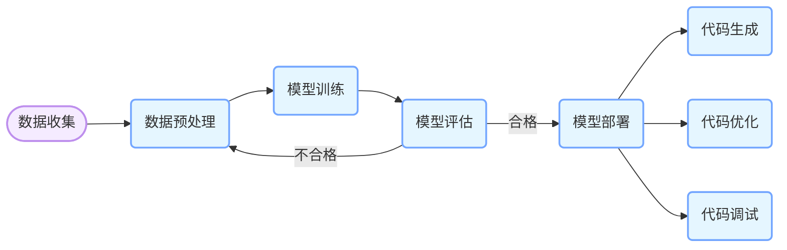

# AI编程的优势与劣势分析

> 关键词：AI编程、优势、劣势、自动化、数据依赖

> 摘要：本文旨在全面深入地分析AI编程的优势与劣势。AI编程作为当前科技领域的前沿技术，在提高开发效率、优化代码质量等方面展现出显著的优势，但同时也面临着数据依赖、安全风险等诸多挑战。通过对其核心概念、算法原理、实际应用场景等多方面的探讨，帮助读者全面了解AI编程，以便在实际应用中做出合理的决策。

## 1. 背景介绍 
### 1.1 目的和范围
随着人工智能技术的飞速发展，AI编程逐渐成为软件开发领域的热门话题。本文章的目的在于系统地分析AI编程的优势与劣势，为开发者、企业决策者以及对AI编程感兴趣的人士提供全面的参考。范围涵盖AI编程的各个方面，包括核心概念、算法原理、实际应用场景等。

### 1.2 预期读者
本文预期读者包括软件开发人员、软件架构师、CTO等技术领域专业人士，也适合对人工智能和编程技术感兴趣的普通读者，以及企业中负责技术决策的管理人员。

### 1.3 文档结构概述
本文首先介绍AI编程的背景知识，包括目的、预期读者和文档结构概述。接着阐述AI编程的核心概念与联系，通过文本示意图和Mermaid流程图进行直观展示。然后详细讲解核心算法原理及具体操作步骤，并结合Python源代码进行说明。之后介绍数学模型和公式，通过举例进行详细讲解。再通过项目实战展示代码实际案例并进行详细解释说明。随后探讨AI编程的实际应用场景，推荐相关的工具和资源。最后总结AI编程的未来发展趋势与挑战，提供常见问题与解答以及扩展阅读和参考资料。

### 1.4 术语表
#### 1.4.1 核心术语定义
- **AI编程**：利用人工智能技术辅助或自动完成编程任务的过程。
- **机器学习**：让计算机通过数据和算法自动学习模式和规律，以实现预测和决策的技术。
- **深度学习**：机器学习的一个分支，通过多层神经网络模型来学习数据的复杂表示。

#### 1.4.2 相关概念解释
- **自动化编程**：指利用工具和技术自动生成代码的过程，AI编程是自动化编程的一种高级形式。
- **代码生成器**：一种能够根据特定规则和输入生成代码的工具，AI编程可以利用代码生成器提高编程效率。

#### 1.4.3 缩略词列表
- **AI**：Artificial Intelligence（人工智能）
- **ML**：Machine Learning（机器学习）
- **DL**：Deep Learning（深度学习）

## 2. 核心概念与联系 

### 核心概念原理
AI编程的核心在于利用人工智能技术来辅助或自动完成编程任务。其主要基于机器学习和深度学习算法，通过对大量代码数据的学习，模型可以理解代码的结构、语法和语义，从而实现代码的生成、优化和调试等功能。

例如，在代码生成方面，AI模型可以根据用户提供的需求描述，生成相应的代码片段。这是因为模型在训练过程中学习了大量不同类型的代码，掌握了代码的模式和规律。

### 架构的文本示意图
AI编程系统通常由数据层、模型层和应用层组成。

- **数据层**：负责收集、整理和存储大量的代码数据，这些数据是AI模型训练的基础。数据可以来自开源代码库、项目代码等。
- **模型层**：包含各种机器学习和深度学习模型，如循环神经网络（RNN）、长短时记忆网络（LSTM）、Transformer等。这些模型通过对数据层的数据进行训练，学习代码的模式和规律。
- **应用层**：将训练好的模型应用到实际的编程任务中，如代码生成、代码优化、代码调试等。

### Mermaid流程图


## 3. 核心算法原理 & 具体操作步骤 

### 核心算法原理
在AI编程中，常用的算法包括循环神经网络（RNN）、长短时记忆网络（LSTM）和Transformer等。这里以Transformer为例进行讲解。

Transformer是一种基于注意力机制的深度学习模型，它通过自注意力机制来捕捉输入序列中不同位置之间的依赖关系。其核心结构包括编码器和解码器。

编码器负责将输入序列转换为一系列的特征表示，解码器则根据这些特征表示生成输出序列。注意力机制允许模型在生成输出时关注输入序列中的不同部分，从而提高模型的性能。

### 具体操作步骤及Python源代码
以下是一个使用Transformer进行代码生成的简单示例：

```python
import torch
import torch.nn as nn
import torch.optim as optim

# 定义Transformer模型
class TransformerModel(nn.Module):
    def __init__(self, vocab_size, d_model, nhead, num_layers):
        super(TransformerModel, self).__init__()
        self.embedding = nn.Embedding(vocab_size, d_model)
        self.transformer_encoder = nn.TransformerEncoder(
            nn.TransformerEncoderLayer(d_model, nhead), num_layers
        )
        self.decoder = nn.Linear(d_model, vocab_size)

    def forward(self, src):
        src = self.embedding(src)
        output = self.transformer_encoder(src)
        output = self.decoder(output)
        return output

# 数据准备
vocab_size = 1000
d_model = 128
nhead = 4
num_layers = 2
model = TransformerModel(vocab_size, d_model, nhead, num_layers)

# 定义损失函数和优化器
criterion = nn.CrossEntropyLoss()
optimizer = optim.Adam(model.parameters(), lr=0.001)

# 训练模型
num_epochs = 10
for epoch in range(num_epochs):
    # 假设这里有输入数据和目标数据
    input_data = torch.randint(0, vocab_size, (10, 20))
    target_data = torch.randint(0, vocab_size, (10, 20))

    optimizer.zero_grad()
    output = model(input_data)
    loss = criterion(output.view(-1, vocab_size), target_data.view(-1))
    loss.backward()
    optimizer.step()

    print(f'Epoch {epoch+1}/{num_epochs}, Loss: {loss.item()}')
```

### 代码解释
1. **模型定义**：`TransformerModel`类定义了一个简单的Transformer模型，包括嵌入层、Transformer编码器和解码器。
2. **数据准备**：定义了词汇表大小、模型维度、头数和层数等参数，并初始化模型。
3. **损失函数和优化器**：使用交叉熵损失函数和Adam优化器进行模型训练。
4. **训练过程**：在每个epoch中，前向传播计算输出，计算损失，反向传播更新模型参数。

## 4. 数学模型和公式 & 详细讲解 & 举例说明 

### 自注意力机制公式
自注意力机制是Transformer的核心，其数学公式如下：

$$
\text{Attention}(Q, K, V) = \text{softmax}\left(\frac{QK^T}{\sqrt{d_k}}\right)V
$$

其中，$Q$ 是查询矩阵，$K$ 是键矩阵，$V$ 是值矩阵，$d_k$ 是键向量的维度。

### 详细讲解
- **查询、键和值矩阵**：在自注意力机制中，输入序列首先通过线性变换得到查询、键和值矩阵。查询矩阵用于计算输入序列中每个位置与其他位置的相关性，键矩阵用于提供相关性的参考，值矩阵用于根据相关性进行加权求和。
- **缩放点积注意力**：通过计算查询矩阵和键矩阵的点积，得到每个位置与其他位置的相关性得分。为了防止点积结果过大，需要除以 $\sqrt{d_k}$ 进行缩放。然后使用softmax函数将得分转换为概率分布。
- **加权求和**：根据概率分布对值矩阵进行加权求和，得到每个位置的输出。

### 举例说明
假设输入序列为 $[x_1, x_2, x_3]$，经过线性变换得到查询矩阵 $Q = [q_1, q_2, q_3]$，键矩阵 $K = [k_1, k_2, k_3]$，值矩阵 $V = [v_1, v_2, v_3]$。

计算相关性得分：

$$
\text{scores} = \frac{QK^T}{\sqrt{d_k}} = 
\begin{bmatrix}
q_1 \cdot k_1 & q_1 \cdot k_2 & q_1 \cdot k_3 \\
q_2 \cdot k_1 & q_2 \cdot k_2 & q_2 \cdot k_3 \\
q_3 \cdot k_1 & q_3 \cdot k_2 & q_3 \cdot k_3
\end{bmatrix}
$$

使用softmax函数得到概率分布：

$$
\text{probabilities} = \text{softmax}(\text{scores})
$$

最后进行加权求和得到输出：

$$
\text{output} = \text{probabilities} \cdot V
$$

## 5. 项目实战：代码实际案例和详细解释说明 

### 5.1  开发环境搭建
- **操作系统**：推荐使用Linux或macOS，也可以使用Windows。
- **编程语言**：Python 3.7及以上版本。
- **深度学习框架**：PyTorch，可通过以下命令安装：
```sh
pip install torch torchvision
```
- **其他依赖库**：根据具体项目需求安装，如`numpy`、`pandas`等。

### 5.2  源代码详细实现和代码解读
以下是一个使用AI编程进行简单代码生成的项目示例：

```python
import torch
import torch.nn as nn
import torch.optim as optim
import numpy as np

# 定义简单的循环神经网络模型
class SimpleRNN(nn.Module):
    def __init__(self, input_size, hidden_size, output_size):
        super(SimpleRNN, self).__init__()
        self.hidden_size = hidden_size
        self.rnn = nn.RNN(input_size, hidden_size, batch_first=True)
        self.fc = nn.Linear(hidden_size, output_size)

    def forward(self, x):
        h0 = torch.zeros(1, x.size(0), self.hidden_size).to(x.device)
        out, _ = self.rnn(x, h0)
        out = self.fc(out[:, -1, :])
        return out

# 数据准备
input_size = 10
hidden_size = 20
output_size = 10
model = SimpleRNN(input_size, hidden_size, output_size)

# 定义损失函数和优化器
criterion = nn.CrossEntropyLoss()
optimizer = optim.Adam(model.parameters(), lr=0.001)

# 训练数据
num_samples = 100
input_data = torch.randn(num_samples, 5, input_size)
target_data = torch.randint(0, output_size, (num_samples,))

# 训练模型
num_epochs = 10
for epoch in range(num_epochs):
    optimizer.zero_grad()
    output = model(input_data)
    loss = criterion(output, target_data)
    loss.backward()
    optimizer.step()

    print(f'Epoch {epoch+1}/{num_epochs}, Loss: {loss.item()}')

# 代码生成示例
test_input = torch.randn(1, 5, input_size)
with torch.no_grad():
    output = model(test_input)
    predicted_code = torch.argmax(output, dim=1).item()
    print(f'Predicted code: {predicted_code}')
```

### 5.3  代码解读与分析
1. **模型定义**：`SimpleRNN`类定义了一个简单的循环神经网络模型，包括一个RNN层和一个全连接层。
2. **数据准备**：定义了输入大小、隐藏大小和输出大小等参数，并初始化模型。生成训练数据和目标数据。
3. **损失函数和优化器**：使用交叉熵损失函数和Adam优化器进行模型训练。
4. **训练过程**：在每个epoch中，前向传播计算输出，计算损失，反向传播更新模型参数。
5. **代码生成**：使用训练好的模型对测试输入进行预测，得到预测的代码。

## 6. 实际应用场景 
### 代码生成
AI编程可以根据用户的需求描述自动生成代码。例如，在开发一个简单的Web应用时，用户只需要提供功能需求，AI编程工具可以生成相应的前端和后端代码，大大提高开发效率。

### 代码优化
AI编程可以分析现有代码，找出代码中的性能瓶颈和潜在问题，并提供优化建议。例如，通过分析代码的复杂度和执行时间，AI编程工具可以建议使用更高效的算法或数据结构。

### 代码调试
AI编程可以帮助开发者快速定位代码中的错误。通过对代码的语法和语义分析，AI编程工具可以指出代码中的错误位置，并提供可能的修复方案。

### 智能编程助手
AI编程可以作为智能编程助手，为开发者提供实时的帮助和建议。例如，当开发者在编写代码时遇到问题，AI编程助手可以提供相关的文档、示例代码和解决方案。

## 7. 工具和资源推荐
### 7.1 学习资源推荐
#### 7.1.1 书籍推荐
- 《深度学习》（Deep Learning）：由Ian Goodfellow、Yoshua Bengio和Aaron Courville合著，是深度学习领域的经典教材。
- 《Python深度学习》（Deep Learning with Python）：由Francois Chollet编写，适合初学者学习使用Python进行深度学习开发。
- 《机器学习》（Machine Learning）：由Tom M. Mitchell编写，是机器学习领域的经典教材。

#### 7.1.2 在线课程
- Coursera上的“深度学习专项课程”（Deep Learning Specialization）：由Andrew Ng教授授课，涵盖深度学习的各个方面。
- edX上的“人工智能基础”（Introduction to Artificial Intelligence）：介绍人工智能的基本概念和技术。
- 哔哩哔哩上的“Python机器学习实战”：由一些技术博主分享的Python机器学习实战教程，适合初学者。

#### 7.1.3 技术博客和网站
- Medium：有许多关于AI编程的技术文章和经验分享。
- Towards Data Science：专注于数据科学和机器学习领域的技术博客。
- 开源中国：提供丰富的开源项目和技术文章，包括AI编程相关内容。

### 7.2 开发工具框架推荐
#### 7.2.1 IDE和编辑器
- PyCharm：专业的Python集成开发环境，提供代码编辑、调试、版本控制等功能。
- Visual Studio Code：轻量级的代码编辑器，支持多种编程语言，有丰富的插件扩展功能。
- Jupyter Notebook：交互式的开发环境，适合进行数据分析和模型训练。

#### 7.2.2 调试和性能分析工具
- PyTorch Profiler：PyTorch自带的性能分析工具，可用于分析模型的训练和推理性能。
- TensorBoard：TensorFlow的可视化工具，也可用于PyTorch，用于可视化模型的训练过程和性能指标。
- cProfile：Python的内置性能分析工具，可用于分析Python代码的执行时间和调用关系。

#### 7.2.3 相关框架和库
- PyTorch：开源的深度学习框架，提供丰富的深度学习模型和工具。
- TensorFlow：Google开发的深度学习框架，广泛应用于工业界和学术界。
- Scikit-learn：用于机器学习的Python库，提供各种机器学习算法和工具。

### 7.3 相关论文著作推荐
#### 7.3.1 经典论文
- “Attention Is All You Need”：介绍了Transformer模型的原理和应用。
- “ImageNet Classification with Deep Convolutional Neural Networks”：开创了深度学习在图像分类领域的先河。
- “Long Short-Term Memory”：介绍了长短时记忆网络（LSTM）的原理和应用。

#### 7.3.2 最新研究成果
- 关注顶级学术会议如NeurIPS、ICML、CVPR等的最新研究成果，了解AI编程领域的前沿技术。
- 阅读相关的学术期刊如Journal of Artificial Intelligence Research（JAIR）、Artificial Intelligence等。

#### 7.3.3 应用案例分析
- 研究一些知名公司如Google、Microsoft、Facebook等在AI编程领域的应用案例，了解实际应用中的技术和经验。
- 分析开源项目如OpenAI的GPT系列、Hugging Face的Transformers库等的应用案例。

## 8. 总结：未来发展趋势与挑战
### 未来发展趋势
- **更智能的代码生成**：未来AI编程将能够生成更加复杂和高质量的代码，满足各种不同的应用需求。
- **跨语言和跨领域编程**：AI编程将能够支持多种编程语言和不同领域的编程任务，实现更广泛的应用。
- **与人类开发者的深度协作**：AI编程将与人类开发者形成深度协作的关系，人类开发者提供创意和需求，AI编程工具提供技术支持和优化建议。

### 挑战
- **数据隐私和安全**：AI编程依赖大量的数据，如何保护数据的隐私和安全是一个重要的挑战。
- **模型可解释性**：AI编程模型通常是黑盒模型，如何解释模型的决策过程和结果是一个亟待解决的问题。
- **伦理和法律问题**：AI编程的发展可能会带来一些伦理和法律问题，如代码版权、算法偏见等，需要建立相应的规范和法律制度。

## 9. 附录：常见问题与解答
### 问题1：AI编程会取代人类开发者吗？
解答：不会。AI编程虽然可以提高开发效率和代码质量，但人类开发者的创意、判断力和问题解决能力是不可替代的。AI编程将与人类开发者形成协作关系，共同推动软件开发的发展。

### 问题2：AI编程需要大量的数据，这些数据从哪里来？
解答：数据可以来自开源代码库、项目代码、代码托管平台等。此外，还可以通过数据标注和合成等方式生成数据。

### 问题3：AI编程模型的训练需要很长时间吗？
解答：这取决于模型的复杂度和数据的规模。一般来说，复杂的模型和大规模的数据需要较长的训练时间。但随着硬件技术的发展和优化算法的改进，训练时间正在逐渐缩短。

## 10. 扩展阅读 & 参考资料
- Goodfellow, I., Bengio, Y., & Courville, A. (2016). Deep Learning. MIT Press.
- Chollet, F. (2018). Deep Learning with Python. Manning Publications.
- Mitchell, T. M. (1997). Machine Learning. McGraw-Hill.
- Vaswani, A., Shazeer, N., Parmar, N., et al. (2017). Attention Is All You Need. Advances in Neural Information Processing Systems.
- Krizhevsky, A., Sutskever, I., & Hinton, G. E. (2012). ImageNet Classification with Deep Convolutional Neural Networks. Advances in Neural Information Processing Systems.
- Hochreiter, S., & Schmidhuber, J. (1997). Long Short-Term Memory. Neural Computation.
- 相关技术博客和网站：Medium、Towards Data Science、开源中国等。
- 相关开源项目：OpenAI的GPT系列、Hugging Face的Transformers库等。