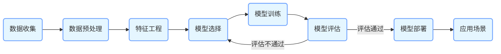

# AI编程的崛起：程序员的机遇与挑战

> 关键词：AI编程、程序员、机遇、挑战、人工智能、机器学习、深度学习

> 摘要：本文深入探讨了AI编程崛起背景下程序员所面临的机遇与挑战。首先介绍了AI编程相关的背景知识，包括目的范围、预期读者等内容。接着阐述了AI编程的核心概念、算法原理、数学模型等基础理论。通过项目实战案例详细展示了AI编程的具体实现过程。分析了AI编程在不同领域的实际应用场景。推荐了学习AI编程的工具和资源。最后总结了AI编程未来的发展趋势与挑战，并提供常见问题解答和扩展阅读参考资料，旨在帮助程序员全面了解AI编程，把握机遇，应对挑战。

## 1. 背景介绍 
### 1.1 目的和范围
随着人工智能技术的飞速发展，AI编程逐渐成为编程领域的重要组成部分。本文的目的在于全面分析AI编程崛起给程序员带来的机遇与挑战，帮助程序员更好地理解和应对这一技术变革。范围涵盖AI编程的基本概念、核心算法、数学模型、实际应用等多个方面，旨在为程序员提供一个系统、全面的知识体系。

### 1.2 预期读者
本文主要面向广大程序员群体，包括有一定编程基础但对AI编程了解较少的初学者，以及希望深入研究AI编程的中高级程序员。同时，对人工智能技术感兴趣的相关从业者和研究人员也可以从本文中获取有价值的信息。

### 1.3 文档结构概述
本文将按照以下结构进行阐述：首先介绍AI编程的背景知识，包括目的、预期读者等；接着讲解AI编程的核心概念和联系，通过文本示意图和Mermaid流程图进行展示；然后深入探讨核心算法原理和具体操作步骤，并使用Python源代码进行详细阐述；再介绍数学模型和公式，结合具体例子进行讲解；通过项目实战案例展示代码的实际实现和详细解释；分析AI编程的实际应用场景；推荐学习AI编程的工具和资源；最后总结未来发展趋势与挑战，提供常见问题解答和扩展阅读参考资料。

### 1.4 术语表
#### 1.4.1 核心术语定义
- **AI编程**：即人工智能编程，是指使用计算机编程语言来实现人工智能相关算法和模型的过程。
- **机器学习**：是一门多领域交叉学科，涉及概率论、统计学、逼近论、凸分析、算法复杂度理论等多门学科。它专门研究计算机怎样模拟或实现人类的学习行为，以获取新的知识或技能，重新组织已有的知识结构使之不断改善自身的性能。
- **深度学习**：是机器学习的一个分支领域，它是一种基于对数据进行表征学习的方法。深度学习通过构建具有很多层的神经网络模型，自动从大量数据中学习到复杂的模式和特征。
- **神经网络**：是一种模仿人类神经系统的计算模型，由大量的神经元组成，通过神经元之间的连接和权重来实现信息的传递和处理。
- **算法**：是指解题方案的准确而完整的描述，是一系列解决问题的清晰指令，算法代表着用系统的方法描述解决问题的策略机制。

#### 1.4.2 相关概念解释
- **监督学习**：是机器学习中的一种学习方式，在监督学习中，训练数据包含输入特征和对应的标签，模型通过学习输入特征和标签之间的关系来进行预测。
- **无监督学习**：与监督学习不同，无监督学习的训练数据只包含输入特征，没有对应的标签，模型的任务是从数据中发现潜在的结构和模式。
- **强化学习**：是一种通过智能体与环境进行交互，根据环境反馈的奖励信号来学习最优行为策略的学习方式。

#### 1.4.3 缩略词列表
- **AI**：Artificial Intelligence（人工智能）
- **ML**：Machine Learning（机器学习）
- **DL**：Deep Learning（深度学习）
- **NN**：Neural Network（神经网络）

## 2. 核心概念与联系 
### 2.1 核心概念原理
AI编程的核心概念主要包括机器学习、深度学习、神经网络等。机器学习是AI编程的基础，它通过对数据的学习和分析，让计算机自动发现数据中的规律和模式。深度学习是机器学习的一个高级分支，它通过构建深度神经网络，能够处理更加复杂的数据和任务。神经网络是深度学习的核心模型，它由输入层、隐藏层和输出层组成，通过神经元之间的连接和权重来实现信息的传递和处理。

### 2.2 架构的文本示意图
AI编程的架构可以分为数据层、模型层和应用层。数据层负责收集、存储和预处理数据，为模型训练提供高质量的数据。模型层包括各种机器学习和深度学习模型，如决策树、支持向量机、神经网络等，这些模型通过对数据的学习和训练来实现特定的任务。应用层将训练好的模型应用到实际场景中，如图像识别、自然语言处理、语音识别等。

### 2.3 Mermaid流程图


这个流程图展示了AI编程的一般流程，从数据收集开始，经过预处理、特征工程等步骤，选择合适的模型进行训练和评估，评估通过后进行模型部署，最终应用到实际场景中。如果评估不通过，则需要重新选择模型进行训练。

## 3. 核心算法原理 & 具体操作步骤 
### 3.1 线性回归算法原理
线性回归是一种简单而常用的机器学习算法，用于预测连续数值的输出。其基本原理是通过找到一条直线或超平面，使得所有数据点到该直线或超平面的距离之和最小。线性回归的数学模型可以表示为：

$$y = \theta_0 + \theta_1x_1 + \theta_2x_2 + \cdots + \theta_nx_n + \epsilon$$

其中，$y$ 是输出变量，$x_1, x_2, \cdots, x_n$ 是输入变量，$\theta_0, \theta_1, \theta_2, \cdots, \theta_n$ 是模型的参数，$\epsilon$ 是误差项。

### 3.2 具体操作步骤
1. **数据准备**：收集和整理相关的数据，将其分为训练集和测试集。
2. **模型初始化**：初始化模型的参数 $\theta_0, \theta_1, \theta_2, \cdots, \theta_n$。
3. **定义损失函数**：常用的损失函数是均方误差（MSE），其计算公式为：

$$MSE = \frac{1}{m} \sum_{i=1}^{m} (y_i - \hat{y}_i)^2$$

其中，$m$ 是样本数量，$y_i$ 是真实值，$\hat{y}_i$ 是预测值。

4. **训练模型**：使用梯度下降算法来更新模型的参数，使得损失函数的值最小。梯度下降算法的更新公式为：

$$\theta_j := \theta_j - \alpha \frac{\partial MSE}{\partial \theta_j}$$

其中，$\alpha$ 是学习率，$\frac{\partial MSE}{\partial \theta_j}$ 是损失函数关于参数 $\theta_j$ 的偏导数。

5. **模型评估**：使用测试集来评估模型的性能，常用的评估指标包括均方误差（MSE）、均方根误差（RMSE）、平均绝对误差（MAE）等。

### 3.3 Python源代码实现
```python
import numpy as np

# 数据准备
X = np.array([[1], [2], [3], [4], [5]])
y = np.array([2, 4, 6, 8, 10])

# 模型初始化
theta = np.zeros((2, 1))
X_b = np.c_[np.ones((X.shape[0], 1)), X]  # 添加偏置项

# 定义损失函数
def mse_loss(X, y, theta):
    m = len(y)
    y_pred = X.dot(theta)
    return (1/m) * np.sum((y_pred - y.reshape(-1, 1))**2)

# 训练模型
learning_rate = 0.01
n_iterations = 1000
m = len(y)

for iteration in range(n_iterations):
    gradients = (2/m) * X_b.T.dot(X_b.dot(theta) - y.reshape(-1, 1))
    theta = theta - learning_rate * gradients

# 模型评估
y_pred = X_b.dot(theta)
mse = mse_loss(X_b, y, theta)
print("均方误差 (MSE):", mse)
```

在这个代码中，我们首先准备了数据，然后初始化了模型的参数。接着定义了均方误差损失函数，使用梯度下降算法来训练模型，最后评估了模型的性能。

## 4. 数学模型和公式 & 详细讲解 & 举例说明 
### 4.1 逻辑回归数学模型
逻辑回归是一种用于分类问题的机器学习算法，它通过逻辑函数将线性回归的输出映射到一个概率值。逻辑回归的数学模型可以表示为：

$$P(y=1|x) = \frac{1}{1 + e^{-z}}$$

其中，$P(y=1|x)$ 是样本 $x$ 属于正类的概率，$z$ 是线性回归的输出，其计算公式为：

$$z = \theta_0 + \theta_1x_1 + \theta_2x_2 + \cdots + \theta_nx_n$$

### 4.2 损失函数
逻辑回归常用的损失函数是对数损失函数，其计算公式为：

$$J(\theta) = -\frac{1}{m} \sum_{i=1}^{m} [y_i \log(P(y_i=1|x_i)) + (1 - y_i) \log(1 - P(y_i=1|x_i))]$$

其中，$m$ 是样本数量，$y_i$ 是真实标签，$P(y_i=1|x_i)$ 是样本 $x_i$ 属于正类的概率。

### 4.3 举例说明
假设我们有一个二分类问题，样本的特征向量为 $x = [x_1, x_2]$，真实标签为 $y$。我们可以使用逻辑回归模型来预测样本属于正类的概率。

```python
import numpy as np

# 数据准备
X = np.array([[1, 2], [2, 3], [3, 4], [4, 5]])
y = np.array([0, 0, 1, 1])

# 模型初始化
theta = np.zeros((X.shape[1] + 1, 1))
X_b = np.c_[np.ones((X.shape[0], 1)), X]  # 添加偏置项

# 定义逻辑函数
def sigmoid(z):
    return 1 / (1 + np.exp(-z))

# 定义损失函数
def log_loss(X, y, theta):
    m = len(y)
    z = X.dot(theta)
    y_pred = sigmoid(z)
    return -(1/m) * np.sum(y * np.log(y_pred) + (1 - y) * np.log(1 - y_pred))

# 训练模型
learning_rate = 0.01
n_iterations = 1000
m = len(y)

for iteration in range(n_iterations):
    z = X_b.dot(theta)
    y_pred = sigmoid(z)
    gradients = (1/m) * X_b.T.dot(y_pred - y.reshape(-1, 1))
    theta = theta - learning_rate * gradients

# 模型评估
z = X_b.dot(theta)
y_pred = sigmoid(z)
y_pred_class = (y_pred >= 0.5).astype(int)
accuracy = np.mean(y_pred_class.flatten() == y)
print("准确率:", accuracy)
```

在这个例子中，我们使用逻辑回归模型对样本进行分类，通过计算准确率来评估模型的性能。

## 5. 项目实战：代码实际案例和详细解释说明 
### 5.1  开发环境搭建
在进行AI编程项目实战之前，需要搭建相应的开发环境。以下是一些常用的开发环境和工具：
- **Python**：AI编程中最常用的编程语言，具有丰富的库和工具。
- **Anaconda**：一个开源的Python发行版本，包含了Python解释器、常用的科学计算库和工具。
- **Jupyter Notebook**：一个交互式的开发环境，适合进行数据探索、模型训练和可视化。
- **PyCharm**：一个专业的Python集成开发环境（IDE），提供了丰富的功能和工具。

### 5.2  源代码详细实现和代码解读
#### 5.2.1 项目概述
本项目是一个简单的图像分类任务，使用卷积神经网络（CNN）对MNIST手写数字数据集进行分类。

#### 5.2.2 代码实现
```python
import tensorflow as tf
from tensorflow.keras.datasets import mnist
from tensorflow.keras.models import Sequential
from tensorflow.keras.layers import Conv2D, MaxPooling2D, Flatten, Dense
from tensorflow.keras.utils import to_categorical

# 数据加载和预处理
(train_images, train_labels), (test_images, test_labels) = mnist.load_data()

train_images = train_images.reshape((60000, 28, 28, 1)).astype('float32') / 255
test_images = test_images.reshape((10000, 28, 28, 1)).astype('float32') / 255

train_labels = to_categorical(train_labels)
test_labels = to_categorical(test_labels)

# 模型构建
model = Sequential([
    Conv2D(32, (3, 3), activation='relu', input_shape=(28, 28, 1)),
    MaxPooling2D((2, 2)),
    Conv2D(64, (3, 3), activation='relu'),
    MaxPooling2D((2, 2)),
    Flatten(),
    Dense(64, activation='relu'),
    Dense(10, activation='softmax')
])

# 模型编译
model.compile(optimizer='adam',
              loss='categorical_crossentropy',
              metrics=['accuracy'])

# 模型训练
model.fit(train_images, train_labels, epochs=5, batch_size=64)

# 模型评估
test_loss, test_acc = model.evaluate(test_images, test_labels)
print('测试准确率:', test_acc)
```

#### 5.2.3 代码解读
1. **数据加载和预处理**：使用 `mnist.load_data()` 函数加载MNIST手写数字数据集，将图像数据进行归一化处理，并将标签进行one-hot编码。
2. **模型构建**：使用 `Sequential` 模型构建一个简单的卷积神经网络，包括卷积层、池化层、全连接层等。
3. **模型编译**：使用 `compile` 方法编译模型，指定优化器、损失函数和评估指标。
4. **模型训练**：使用 `fit` 方法对模型进行训练，指定训练数据、训练轮数和批次大小。
5. **模型评估**：使用 `evaluate` 方法对模型进行评估，计算测试集的损失和准确率。

### 5.3  代码解读与分析
#### 5.3.1 卷积层
卷积层是卷积神经网络的核心层，它通过卷积核在输入图像上滑动，提取图像的特征。卷积层的主要作用是自动学习图像的局部特征，如边缘、纹理等。

#### 5.3.2 池化层
池化层的主要作用是降低特征图的维度，减少计算量，同时增强模型的鲁棒性。常用的池化操作有最大池化和平均池化。

#### 5.3.3 全连接层
全连接层将卷积层和池化层提取的特征进行整合，输出最终的分类结果。全连接层的神经元与上一层的所有神经元都有连接。

#### 5.3.4 激活函数
在卷积层和全连接层中，通常会使用激活函数来引入非线性因素，增强模型的表达能力。常用的激活函数有ReLU、Sigmoid、Tanh等。

## 6. 实际应用场景 
### 6.1 图像识别
AI编程在图像识别领域有着广泛的应用，如人脸识别、物体检测、图像分类等。通过卷积神经网络等深度学习模型，可以实现对图像的高精度识别和分类。

### 6.2 自然语言处理
自然语言处理是AI编程的另一个重要应用领域，包括文本分类、情感分析、机器翻译、语音识别等。通过循环神经网络（RNN）、长短时记忆网络（LSTM）等模型，可以实现对自然语言的理解和处理。

### 6.3 推荐系统
推荐系统是电商、社交等平台常用的应用，通过AI编程可以根据用户的历史行为和偏好，为用户推荐个性化的商品、内容等。常用的推荐算法包括协同过滤、深度学习推荐模型等。

### 6.4 自动驾驶
自动驾驶是AI编程在交通领域的重要应用，通过传感器获取车辆周围的环境信息，使用深度学习模型对这些信息进行处理和分析，实现车辆的自主驾驶。

### 6.5 医疗领域
AI编程在医疗领域也有着广泛的应用，如疾病诊断、医学影像分析、药物研发等。通过对大量的医疗数据进行分析和学习，可以辅助医生进行诊断和治疗。

## 7. 工具和资源推荐
### 7.1 学习资源推荐
#### 7.1.1 书籍推荐
- 《Python机器学习》：本书全面介绍了Python在机器学习领域的应用，包括数据预处理、模型选择、模型评估等内容。
- 《深度学习》：由深度学习领域的三位顶尖专家Ian Goodfellow、Yoshua Bengio和Aaron Courville合著，是深度学习领域的经典教材。
- 《统计学习方法》：李航老师的经典著作，系统介绍了统计学习的基本概念、方法和算法。

#### 7.1.2 在线课程
- Coursera上的《机器学习》课程：由Andrew Ng教授主讲，是机器学习领域的经典课程。
- edX上的《深度学习》课程：由深度学习领域的知名学者授课，深入讲解深度学习的原理和应用。
- 中国大学MOOC上的《人工智能》课程：由国内知名高校的教授授课，介绍人工智能的基本概念、方法和应用。

#### 7.1.3 技术博客和网站
- Medium：一个优秀的技术博客平台，有很多关于AI编程的优质文章。
- Towards Data Science：专注于数据科学和机器学习领域的技术博客，提供了很多实用的教程和案例。
- Kaggle：一个数据科学竞赛平台，提供了大量的数据集和优秀的代码示例，可以学习到很多实际应用中的技巧和方法。

### 7.2 开发工具框架推荐
#### 7.2.1 IDE和编辑器
- PyCharm：一个专业的Python集成开发环境，提供了丰富的功能和工具，如代码自动补全、调试、版本控制等。
- Jupyter Notebook：一个交互式的开发环境，适合进行数据探索、模型训练和可视化。
- Visual Studio Code：一个轻量级的代码编辑器，支持多种编程语言，具有丰富的插件扩展功能。

#### 7.2.2 调试和性能分析工具
- TensorBoard：TensorFlow提供的可视化工具，可以用于查看模型的训练过程、损失曲线、准确率等信息。
- PyTorch Profiler：PyTorch提供的性能分析工具，可以帮助用户分析模型的性能瓶颈，优化代码。
- cProfile：Python自带的性能分析工具，可以统计代码的执行时间和函数调用次数。

#### 7.2.3 相关框架和库
- TensorFlow：一个开源的机器学习框架，由Google开发，提供了丰富的工具和接口，支持多种深度学习模型的开发和训练。
- PyTorch：一个开源的深度学习框架，由Facebook开发，具有动态图的特点，易于使用和调试。
- Scikit-learn：一个简单而高效的机器学习库，提供了各种机器学习算法和工具，如分类、回归、聚类等。

### 7.3 相关论文著作推荐
#### 7.3.1 经典论文
- 《Gradient-based learning applied to document recognition》：LeCun等人的经典论文，提出了卷积神经网络（CNN）的基本架构，为图像识别领域的发展奠定了基础。
- 《Long Short-Term Memory》：Hochreiter和Schmidhuber的经典论文，提出了长短时记忆网络（LSTM），解决了循环神经网络（RNN）中的梯度消失问题。
- 《Attention Is All You Need》：Vaswani等人的经典论文，提出了Transformer模型，为自然语言处理领域带来了革命性的变化。

#### 7.3.2 最新研究成果
- arXiv：一个预印本平台，提供了大量的最新研究成果和论文，可以及时了解AI编程领域的最新动态。
- NeurIPS、ICML、CVPR等顶级学术会议：这些会议是AI编程领域的重要学术交流平台，发表了很多最新的研究成果和技术。

#### 7.3.3 应用案例分析
- Google AI Blog：Google官方的AI博客，分享了很多Google在AI编程领域的应用案例和技术实践。
- Facebook AI Research：Facebook官方的AI研究博客，展示了Facebook在AI编程领域的最新研究成果和应用案例。

## 8. 总结：未来发展趋势与挑战
### 8.1 未来发展趋势
- **模型的不断创新**：随着研究的不断深入，未来将会出现更多更先进的AI模型，如强化学习与深度学习的结合、图神经网络等，这些模型将能够处理更加复杂的任务和数据。
- **应用场景的不断拓展**：AI编程将在更多的领域得到应用，如金融、教育、农业等，为这些领域带来新的发展机遇和变革。
- **与其他技术的融合**：AI编程将与物联网、大数据、云计算等技术深度融合，形成更加智能、高效的系统和解决方案。

### 8.2 挑战
- **数据隐私和安全**：AI编程需要大量的数据来进行训练和学习，如何保护数据的隐私和安全是一个重要的挑战。
- **模型的可解释性**：很多深度学习模型是黑盒模型，难以解释其决策过程和结果，这在一些关键领域，如医疗、金融等，可能会带来风险。
- **人才短缺**：AI编程是一个新兴的领域，目前相关的专业人才短缺，如何培养和吸引更多的AI编程人才是一个亟待解决的问题。

## 9. 附录：常见问题与解答
### 9.1 学习AI编程需要具备哪些基础知识？
学习AI编程需要具备一定的数学基础，如线性代数、概率论、统计学等，同时还需要掌握一门编程语言，如Python。此外，了解机器学习和深度学习的基本概念和算法也是很有必要的。

### 9.2 如何选择合适的AI模型？
选择合适的AI模型需要考虑多个因素，如数据的特点、任务的类型、模型的复杂度等。一般来说，可以先尝试一些简单的模型，如线性回归、逻辑回归等，然后根据模型的性能和需求逐步选择更复杂的模型。

### 9.3 如何解决模型过拟合和欠拟合的问题？
过拟合是指模型在训练集上表现很好，但在测试集上表现很差的情况。解决过拟合的方法包括增加数据量、正则化、早停等。欠拟合是指模型在训练集和测试集上的表现都很差的情况。解决欠拟合的方法包括增加模型的复杂度、调整模型的参数等。

### 9.4 如何优化模型的性能？
优化模型的性能可以从多个方面入手，如数据预处理、特征工程、模型选择、参数调优等。可以使用交叉验证、网格搜索等方法来选择最优的模型和参数。

## 10. 扩展阅读 & 参考资料
- 《人工智能：一种现代的方法》
- 《Python深度学习》
- 官方文档：TensorFlow、PyTorch等框架的官方文档是学习AI编程的重要参考资料。
- 学术论文：可以通过IEEE Xplore、ACM Digital Library等学术数据库查找相关的学术论文，深入了解AI编程的理论和技术。

通过以上内容，我们全面探讨了AI编程崛起背景下程序员所面临的机遇与挑战，希望能够帮助程序员更好地把握这一技术变革，实现自身的发展和提升。