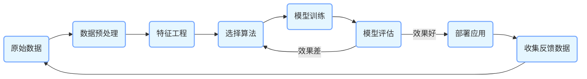

# AI编程的未来：程序员的角色转变

> 关键词：AI编程、程序员角色转变、未来趋势、人工智能、软件开发、技术变革、职业发展

> 摘要：本文深入探讨了AI编程的未来发展以及在此背景下程序员角色的转变。随着人工智能技术的迅猛发展，AI编程正逐渐改变软件开发的格局。文章从背景介绍入手，阐述了相关概念和联系，详细讲解了核心算法原理与操作步骤，通过数学模型和公式加深理解，结合项目实战案例进行分析，探讨了实际应用场景，推荐了相关工具和资源，最后总结了未来发展趋势与挑战，并对常见问题进行解答，旨在帮助程序员更好地适应AI编程带来的角色转变，把握未来职业发展方向。

## 1. 背景介绍 
### 1.1 目的和范围
本文章的目的在于全面分析AI编程的发展趋势以及由此引发的程序员角色转变。通过深入探讨相关技术原理、实际应用案例等，为程序员和相关从业者提供全面且深入的了解，帮助他们更好地适应未来的技术变革。范围涵盖了AI编程的核心概念、算法原理、数学模型、实际应用场景等多个方面，以及程序员在这些变化中所面临的机遇和挑战。

### 1.2 预期读者
预期读者主要包括程序员、软件开发者、技术爱好者、软件架构师、CTO等从事软件开发和技术管理的人员，以及对人工智能和编程未来发展感兴趣的研究人员和学生。

### 1.3 文档结构概述
本文首先介绍背景信息，包括目的、预期读者和文档结构。接着阐述核心概念与联系，展示相关的原理和架构示意图及流程图。然后详细讲解核心算法原理和具体操作步骤，给出Python源代码示例。之后介绍数学模型和公式，并举例说明。通过项目实战案例展示代码实现和解读。探讨实际应用场景，推荐相关工具和资源。最后总结未来发展趋势与挑战，解答常见问题并提供扩展阅读和参考资料。

### 1.4 术语表
#### 1.4.1 核心术语定义
- **AI编程**：利用人工智能技术进行软件开发的过程，涉及机器学习、深度学习、自然语言处理等多种AI技术的应用。
- **程序员**：从事程序设计和开发的专业人员，负责编写、测试和维护软件代码。
- **角色转变**：指在技术发展和市场需求变化的背景下，程序员的工作职责、技能要求和职业定位发生的改变。
- **人工智能**：研究、开发用于模拟、延伸和扩展人的智能的理论、方法、技术及应用系统的一门新的技术科学。
- **机器学习**：一门多领域交叉学科，涉及概率论、统计学、逼近论、凸分析、算法复杂度理论等多门学科。它专门研究计算机怎样模拟或实现人类的学习行为，以获取新的知识或技能，重新组织已有的知识结构使之不断改善自身的性能。
- **深度学习**：机器学习的一个分支领域，它是一种基于对数据进行表征学习的方法。深度学习通过构建具有很多层的神经网络模型，自动从大量数据中学习复杂的模式和特征。

#### 1.4.2 相关概念解释
- **AI编程与传统编程的区别**：传统编程通常是程序员根据明确的规则和逻辑编写代码来实现特定的功能，而AI编程更侧重于让计算机从数据中自动学习模式和规律，通过训练模型来完成任务。
- **程序员角色转变的原因**：主要是由于人工智能技术的快速发展和广泛应用，使得软件开发的需求和方式发生了变化。AI技术能够自动化一些重复性的编程任务，提高开发效率，同时也对程序员的技能和知识提出了更高的要求。

#### 1.4.3 缩略词列表
- **AI**：Artificial Intelligence（人工智能）
- **ML**：Machine Learning（机器学习）
- **DL**：Deep Learning（深度学习）
- **NLP**：Natural Language Processing（自然语言处理）

## 2. 核心概念与联系 

### 核心概念原理
AI编程的核心在于利用人工智能技术来辅助或自动化软件开发过程。其中，机器学习和深度学习是AI编程中最为重要的技术。

机器学习通过对大量数据的学习，发现数据中的模式和规律，从而实现预测、分类、聚类等任务。例如，在图像识别中，机器学习算法可以通过对大量图像数据的学习，识别出不同的物体。

深度学习是机器学习的一个高级分支，它通过构建深度神经网络来学习数据的复杂特征。深度神经网络由多个层次的神经元组成，每个层次都对输入数据进行不同程度的抽象和处理。例如，在语音识别中，深度学习模型可以学习语音信号的特征，将其转换为文本。

程序员在AI编程中的角色转变主要体现在从传统的代码编写者向数据科学家、算法工程师和模型开发者的转变。程序员需要具备更多的数据处理、算法设计和模型训练的能力。

### 架构的文本示意图
```plaintext
AI编程生态系统
|-- 数据
|   |-- 原始数据
|   |-- 预处理后的数据
|-- 算法与模型
|   |-- 机器学习算法
|   |-- 深度学习模型
|   |-- 模型训练
|   |-- 模型评估
|-- 编程实现
|   |-- 代码编写
|   |-- 软件框架
|   |-- 自动化工具
|-- 应用场景
|   |-- 图像识别
|   |-- 自然语言处理
|   |-- 智能推荐
```

### Mermaid流程图


## 3. 核心算法原理 & 具体操作步骤 

### 核心算法原理
在AI编程中，常见的核心算法包括线性回归、逻辑回归、决策树、支持向量机、神经网络等。下面以线性回归为例进行详细讲解。

线性回归是一种用于预测连续数值的机器学习算法。它的基本思想是通过找到一条直线（在多维空间中是一个超平面），使得所有数据点到这条直线的距离之和最小。

线性回归的数学模型可以表示为：

$$y = \theta_0 + \theta_1x_1 + \theta_2x_2 + \cdots + \theta_nx_n + \epsilon$$

其中，$y$ 是预测值，$x_1, x_2, \cdots, x_n$ 是输入特征，$\theta_0, \theta_1, \cdots, \theta_n$ 是模型的参数，$\epsilon$ 是误差项。

### 具体操作步骤
1. **数据准备**：收集和整理用于训练和测试的数据。
2. **数据预处理**：对数据进行清洗、归一化等处理，以提高模型的性能。
3. **特征选择**：选择与目标变量相关的特征。
4. **模型训练**：使用训练数据来估计模型的参数。
5. **模型评估**：使用测试数据来评估模型的性能。
6. **模型优化**：根据评估结果对模型进行优化。

### Python源代码示例
```python
import numpy as np
from sklearn.model_selection import train_test_split
from sklearn.linear_model import LinearRegression
from sklearn.metrics import mean_squared_error

# 生成示例数据
np.random.seed(0)
X = 2 * np.random.rand(100, 1)
y = 4 + 3 * X + np.random.randn(100, 1)

# 划分训练集和测试集
X_train, X_test, y_train, y_test = train_test_split(X, y, test_size=0.2, random_state=42)

# 创建线性回归模型
model = LinearRegression()

# 模型训练
model.fit(X_train, y_train)

# 模型预测
y_pred = model.predict(X_test)

# 模型评估
mse = mean_squared_error(y_test, y_pred)
print(f"Mean Squared Error: {mse}")
```

### 代码解释
1. **数据生成**：使用 `np.random.rand` 生成随机的输入特征 $X$，并根据线性关系生成目标变量 $y$，同时添加了一些随机噪声。
2. **数据划分**：使用 `train_test_split` 函数将数据划分为训练集和测试集，测试集占比为 20%。
3. **模型创建**：使用 `LinearRegression` 类创建线性回归模型。
4. **模型训练**：使用 `fit` 方法对模型进行训练，即估计模型的参数。
5. **模型预测**：使用 `predict` 方法对测试集进行预测。
6. **模型评估**：使用 `mean_squared_error` 函数计算预测值和真实值之间的均方误差。

## 4. 数学模型和公式 & 详细讲解 & 举例说明 

### 线性回归的数学模型和公式
线性回归的目标是找到一组参数 $\theta = [\theta_0, \theta_1, \cdots, \theta_n]$，使得预测值 $\hat{y}$ 与真实值 $y$ 之间的误差最小。通常使用均方误差（Mean Squared Error，MSE）作为损失函数：

$$MSE(\theta) = \frac{1}{m} \sum_{i=1}^{m} (\hat{y}^{(i)} - y^{(i)})^2$$

其中，$m$ 是样本数量，$\hat{y}^{(i)}$ 是第 $i$ 个样本的预测值，$y^{(i)}$ 是第 $i$ 个样本的真实值。

为了最小化均方误差，我们可以使用梯度下降法来更新模型的参数。梯度下降法的更新公式为：

$$\theta_j := \theta_j - \alpha \frac{\partial MSE(\theta)}{\partial \theta_j}$$

其中，$\alpha$ 是学习率，控制每次更新的步长。

### 详细讲解
梯度下降法的基本思想是沿着损失函数的负梯度方向更新模型的参数，直到损失函数达到最小值。具体步骤如下：
1. 初始化模型的参数 $\theta$。
2. 计算损失函数的梯度 $\frac{\partial MSE(\theta)}{\partial \theta_j}$。
3. 根据梯度下降公式更新模型的参数 $\theta_j$。
4. 重复步骤 2 和 3，直到损失函数收敛或达到最大迭代次数。

### 举例说明
假设我们有一个简单的线性回归问题，输入特征 $x$ 只有一个维度，目标变量 $y$ 与 $x$ 之间的关系为 $y = 2x + 1$。我们收集了一些样本数据：

| $x$ | $y$ |
|---|---|
| 1 | 3 |
| 2 | 5 |
| 3 | 7 |
| 4 | 9 |

我们的目标是通过这些样本数据来估计模型的参数 $\theta_0$ 和 $\theta_1$。

首先，我们初始化模型的参数 $\theta_0 = 0$，$\theta_1 = 0$。

然后，计算损失函数的梯度：

$$\frac{\partial MSE(\theta)}{\partial \theta_0} = \frac{2}{m} \sum_{i=1}^{m} (\hat{y}^{(i)} - y^{(i)})$$

$$\frac{\partial MSE(\theta)}{\partial \theta_1} = \frac{2}{m} \sum_{i=1}^{m} (\hat{y}^{(i)} - y^{(i)})x^{(i)}$$

假设学习率 $\alpha = 0.1$，我们可以根据梯度下降公式更新模型的参数：

$$\theta_0 := \theta_0 - \alpha \frac{\partial MSE(\theta)}{\partial \theta_0}$$

$$\theta_1 := \theta_1 - \alpha \frac{\partial MSE(\theta)}{\partial \theta_1}$$

经过多次迭代，模型的参数会逐渐收敛到真实值 $\theta_0 = 1$，$\theta_1 = 2$。

## 5. 项目实战：代码实际案例和详细解释说明 

### 5.1  开发环境搭建
1. **安装Python**：从Python官方网站（https://www.python.org/downloads/）下载并安装Python 3.x 版本。
2. **安装开发工具**：推荐使用PyCharm或Jupyter Notebook作为开发工具。
3. **安装必要的库**：使用 `pip` 命令安装 `numpy`、`pandas`、`scikit-learn`、`matplotlib` 等库。

```bash
pip install numpy pandas scikit-learn matplotlib
```

### 5.2  源代码详细实现和代码解读
#### 项目背景
我们要构建一个简单的房价预测模型，使用波士顿房价数据集。该数据集包含了波士顿地区的房屋特征和对应的房价信息。

#### 源代码实现
```python
import numpy as np
import pandas as pd
from sklearn.datasets import load_boston
from sklearn.model_selection import train_test_split
from sklearn.linear_model import LinearRegression
from sklearn.metrics import mean_squared_error, r2_score
import matplotlib.pyplot as plt

# 加载数据集
boston = load_boston()
X = pd.DataFrame(boston.data, columns=boston.feature_names)
y = pd.Series(boston.target)

# 划分训练集和测试集
X_train, X_test, y_train, y_test = train_test_split(X, y, test_size=0.2, random_state=42)

# 创建线性回归模型
model = LinearRegression()

# 模型训练
model.fit(X_train, y_train)

# 模型预测
y_pred = model.predict(X_test)

# 模型评估
mse = mean_squared_error(y_test, y_pred)
r2 = r2_score(y_test, y_pred)
print(f"Mean Squared Error: {mse}")
print(f"R-squared: {r2}")

# 可视化预测结果
plt.scatter(y_test, y_pred)
plt.xlabel("Actual Prices")
plt.ylabel("Predicted Prices")
plt.title("Actual vs Predicted Prices")
plt.show()
```

#### 代码解读
1. **数据加载**：使用 `load_boston` 函数加载波士顿房价数据集，并将其转换为 `pandas` 的 `DataFrame` 和 `Series` 格式。
2. **数据划分**：使用 `train_test_split` 函数将数据集划分为训练集和测试集，测试集占比为 20%。
3. **模型创建**：使用 `LinearRegression` 类创建线性回归模型。
4. **模型训练**：使用 `fit` 方法对模型进行训练，即估计模型的参数。
5. **模型预测**：使用 `predict` 方法对测试集进行预测。
6. **模型评估**：使用 `mean_squared_error` 函数计算均方误差，使用 `r2_score` 函数计算决定系数（$R^2$）。
7. **可视化**：使用 `matplotlib` 库绘制实际房价和预测房价的散点图，直观地展示模型的预测效果。

### 5.3  代码解读与分析
#### 均方误差（MSE）
均方误差是预测值与真实值之间误差的平方的平均值。它反映了模型预测的平均误差程度。MSE 值越小，说明模型的预测效果越好。

#### 决定系数（$R^2$）
决定系数是用来衡量回归模型拟合优度的指标，取值范围在 $[0, 1]$ 之间。$R^2$ 值越接近 1，说明模型对数据的拟合效果越好。

#### 散点图分析
通过观察实际房价和预测房价的散点图，我们可以直观地了解模型的预测效果。如果散点图中的点大致分布在一条直线上，说明模型的预测效果较好；如果点比较分散，说明模型的预测效果较差。

## 6. 实际应用场景 
### 智能客服
AI编程在智能客服领域有着广泛的应用。通过自然语言处理技术，智能客服可以理解用户的问题，并自动生成回答。程序员需要开发和优化对话管理模型、意图识别模型等，以提高智能客服的准确性和效率。

### 金融风险评估
在金融领域，AI编程可以用于风险评估。通过对大量的金融数据进行分析和建模，程序员可以开发风险预测模型，帮助金融机构评估客户的信用风险、市场风险等。

### 医疗诊断
AI编程在医疗诊断领域也有着重要的应用。通过对医学影像数据（如X光、CT等）进行分析，程序员可以开发疾病诊断模型，辅助医生进行诊断。

### 自动驾驶
自动驾驶是AI编程的一个重要应用场景。程序员需要开发和优化感知、决策、控制等多个模块的算法和模型，以实现车辆的自动驾驶。

### 智能推荐系统
智能推荐系统是互联网应用中常见的功能。通过对用户的行为数据进行分析，程序员可以开发推荐算法，为用户推荐个性化的内容和产品。

## 7. 工具和资源推荐
### 7.1 学习资源推荐
#### 7.1.1 书籍推荐
- 《Python机器学习》：介绍了Python在机器学习领域的应用，包括各种机器学习算法的原理和实现。
- 《深度学习》：由深度学习领域的三位权威专家编写，全面介绍了深度学习的理论和实践。
- 《人工智能：一种现代的方法》：是人工智能领域的经典教材，涵盖了人工智能的各个方面。

#### 7.1.2 在线课程
- Coursera上的《机器学习》课程：由Andrew Ng教授主讲，是机器学习领域的经典课程。
- edX上的《深度学习》课程：由深度学习领域的专家授课，深入介绍了深度学习的原理和应用。
- 中国大学MOOC上的《人工智能基础》课程：适合初学者了解人工智能的基本概念和方法。

#### 7.1.3 技术博客和网站
- Medium：上面有很多关于AI编程的技术文章和案例分享。
- Towards Data Science：专注于数据科学和机器学习领域的技术博客。
- 开源中国：提供了丰富的技术资讯和开源项目。

### 7.2 开发工具框架推荐
#### 7.2.1 IDE和编辑器
- PyCharm：是一款专门为Python开发设计的集成开发环境，提供了丰富的功能和插件。
- Jupyter Notebook：是一个交互式的开发环境，适合进行数据探索和模型开发。
- Visual Studio Code：是一款轻量级的代码编辑器，支持多种编程语言和插件。

#### 7.2.2 调试和性能分析工具
- PySnooper：可以在不修改代码的情况下，方便地调试Python代码。
- cProfile：是Python自带的性能分析工具，可以帮助开发者找出代码中的性能瓶颈。
- TensorBoard：是TensorFlow提供的可视化工具，用于可视化模型的训练过程和性能指标。

#### 7.2.3 相关框架和库
- TensorFlow：是Google开发的深度学习框架，提供了丰富的工具和接口。
- PyTorch：是Facebook开发的深度学习框架，具有简洁易用的特点。
- Scikit-learn：是Python中常用的机器学习库，提供了各种机器学习算法和工具。

### 7.3 相关论文著作推荐
#### 7.3.1 经典论文
- 《Gradient-based learning applied to document recognition》：介绍了卷积神经网络在手写字符识别中的应用，是深度学习领域的经典论文。
- 《Attention Is All You Need》：提出了Transformer架构，为自然语言处理领域带来了革命性的变化。
- 《ImageNet Classification with Deep Convolutional Neural Networks》：介绍了AlexNet在ImageNet图像分类竞赛中的应用，标志着深度学习在计算机视觉领域的崛起。

#### 7.3.2 最新研究成果
- arXiv：是一个预印本平台，上面有很多最新的AI研究成果。
- NeurIPS、ICML、CVPR等学术会议的论文：这些会议是人工智能领域的顶级学术会议，收录了很多最新的研究成果。

#### 7.3.3 应用案例分析
- 《AI in Practice: How 50 Successful Companies Used Artificial Intelligence to Solve Problems》：介绍了50家成功应用人工智能解决问题的公司案例。
- 各大科技公司的技术博客：如Google、Facebook、Microsoft等公司的技术博客，会分享他们在AI领域的应用案例和实践经验。

## 8. 总结：未来发展趋势与挑战
### 未来发展趋势
1. **AI与编程的深度融合**：未来，AI将更加深入地融入到编程过程中，实现自动化代码生成、智能调试、自动优化等功能。
2. **跨领域应用**：AI编程将在更多的领域得到应用，如医疗、教育、交通等，为这些领域带来创新和变革。
3. **强化学习的发展**：强化学习作为一种能够让智能体在环境中自主学习和决策的技术，将在机器人控制、游戏等领域得到更广泛的应用。
4. **AI编程的普及化**：随着AI技术的不断发展和普及，AI编程将不再是少数专业人员的专利，更多的开发者和非技术人员将能够使用AI编程工具来解决实际问题。

### 挑战
1. **数据隐私和安全问题**：AI编程需要大量的数据支持，但数据的隐私和安全问题也日益突出。如何在保证数据安全的前提下，充分利用数据进行AI编程是一个亟待解决的问题。
2. **算法的可解释性**：很多AI算法，尤其是深度学习算法，是一个“黑盒”模型，难以解释其决策过程和结果。这在一些对安全性和可靠性要求较高的领域，如医疗、金融等，是一个重要的挑战。
3. **人才短缺**：AI编程需要具备多学科知识的复合型人才，包括计算机科学、数学、统计学等。目前，这类人才的短缺是制约AI编程发展的一个重要因素。
4. **伦理和法律问题**：AI技术的发展也带来了一系列伦理和法律问题，如AI的责任认定、AI对就业的影响等。如何制定相应的伦理和法律规范，引导AI技术的健康发展，是一个重要的挑战。

## 9. 附录：常见问题与解答
### 问题1：AI编程需要具备哪些基础知识？
答：AI编程需要具备一定的计算机科学、数学和统计学基础知识。具体包括编程语言（如Python）、数据结构和算法、线性代数、概率论、数理统计等。

### 问题2：如何选择适合的AI算法？
答：选择适合的AI算法需要考虑多个因素，如数据类型、问题类型、数据规模等。例如，如果是分类问题，可以考虑逻辑回归、决策树、支持向量机等算法；如果是回归问题，可以考虑线性回归、岭回归、Lasso回归等算法。

### 问题3：AI编程的未来发展前景如何？
答：AI编程的未来发展前景非常广阔。随着人工智能技术的不断发展和应用，AI编程将在各个领域发挥重要作用，为社会带来巨大的价值。同时，AI编程也将为程序员带来更多的机遇和挑战。

### 问题4：如何提高AI编程的能力？
答：提高AI编程的能力需要不断学习和实践。可以通过阅读相关的书籍和论文、参加在线课程、参与开源项目等方式来学习AI编程的知识和技能。同时，要多进行实践，通过实际项目来提高自己的编程能力。

## 10. 扩展阅读 & 参考资料
- 《人工智能时代的编程革命》
- 《AI编程实战指南》
- https://www.ai.org/
- https://www.deeplearning.ai/
- https://arxiv.org/