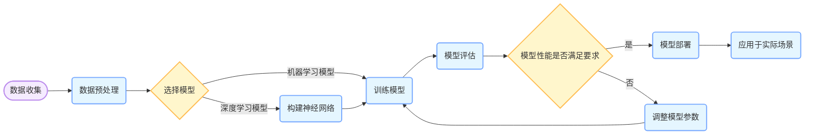

# AI编程：从基础到应用

> 关键词：AI编程、基础概念、算法原理、数学模型、项目实战、应用场景、发展趋势

> 摘要：本文旨在全面且深入地介绍AI编程，从基础概念入手，逐步剖析核心算法原理、数学模型等关键知识点。通过详细的Python代码示例和项目实战，帮助读者理解AI编程在实际中的应用。同时，探讨AI编程的实际应用场景、推荐相关工具和资源，最后总结其未来发展趋势与挑战，为读者提供一个系统的AI编程学习和实践指南。

## 1. 背景介绍 
### 1.1 目的和范围
AI编程在当今科技领域占据着至关重要的地位，其应用范围涵盖了图像识别、自然语言处理、自动驾驶等多个领域。本文的目的在于为初学者提供一个全面且深入的AI编程学习路径，从基础概念开始，逐步引导读者了解AI编程的核心算法、数学模型，并通过实际项目案例展示其应用。范围包括AI编程的基本概念、常见算法原理、相关数学知识、实际项目实现以及未来发展趋势等方面。

### 1.2 预期读者
本文预期读者主要包括对AI编程感兴趣的初学者、计算机科学相关专业的学生、想要涉足AI领域的开发者以及对科技发展趋势关注的技术爱好者。无论你是没有编程基础的新手，还是有一定编程经验但对AI编程了解较少的开发者，都能从本文中获得有价值的信息。

### 1.3 文档结构概述
本文将按照以下结构进行组织：首先介绍AI编程的背景知识，包括目的、预期读者和文档结构等；接着阐述AI编程的核心概念与联系，通过文本示意图和Mermaid流程图进行详细说明；然后深入讲解核心算法原理和具体操作步骤，结合Python源代码进行阐述；之后介绍数学模型和公式，并通过举例说明其应用；再通过项目实战展示代码的实际案例和详细解释；探讨AI编程的实际应用场景；推荐相关的工具和资源；最后总结AI编程的未来发展趋势与挑战，并提供常见问题与解答以及扩展阅读和参考资料。

### 1.4 术语表
#### 1.4.1 核心术语定义
- **人工智能（Artificial Intelligence，AI）**：指计算机系统能够执行通常需要人类智能才能完成的任务，如学习、推理、解决问题等。
- **机器学习（Machine Learning，ML）**：是人工智能的一个子集，专注于让计算机通过数据学习模式和规律，而无需明确的编程指令。
- **深度学习（Deep Learning，DL）**：是机器学习的一个分支，基于人工神经网络，特别是深度神经网络，能够自动从大量数据中学习复杂的模式和特征。
- **神经网络（Neural Network，NN）**：是一种模仿人类神经系统的计算模型，由大量的神经元组成，用于处理和分析数据。
- **训练数据（Training Data）**：用于训练机器学习模型的数据，模型通过学习训练数据中的模式和规律来调整自身的参数。
- **测试数据（Test Data）**：用于评估训练好的机器学习模型性能的数据，与训练数据相互独立。

#### 1.4.2 相关概念解释
- **监督学习（Supervised Learning）**：在监督学习中，训练数据包含输入特征和对应的标签。模型的目标是学习输入特征和标签之间的映射关系，以便对新的输入数据进行预测。
- **无监督学习（Unsupervised Learning）**：无监督学习中，训练数据只包含输入特征，没有对应的标签。模型的任务是发现数据中的模式、结构或规律，如聚类分析、降维等。
- **强化学习（Reinforcement Learning）**：强化学习通过智能体与环境进行交互，根据环境反馈的奖励信号来学习最优的行为策略。
- **过拟合（Overfitting）**：指模型在训练数据上表现良好，但在测试数据或新数据上表现不佳的现象，通常是由于模型过于复杂，学习了训练数据中的噪声和异常值。
- **欠拟合（Underfitting）**：与过拟合相反，欠拟合指模型在训练数据和测试数据上的表现都不理想，通常是由于模型过于简单，无法捕捉数据中的复杂模式。

#### 1.4.3 缩略词列表
- **AI**：Artificial Intelligence（人工智能）
- **ML**：Machine Learning（机器学习）
- **DL**：Deep Learning（深度学习）
- **NN**：Neural Network（神经网络）
- **CNN**：Convolutional Neural Network（卷积神经网络）
- **RNN**：Recurrent Neural Network（循环神经网络）
- **LSTM**：Long Short-Term Memory（长短期记忆网络）
- **API**：Application Programming Interface（应用程序编程接口）

## 2. 核心概念与联系 

### 2.1 核心概念原理
AI编程涉及多个核心概念，其中人工智能是一个广泛的领域，旨在让计算机模拟人类的智能行为。机器学习是实现人工智能的一种重要方法，它通过让计算机从数据中学习模式和规律来进行预测和决策。深度学习则是机器学习的一个高级分支，通过构建深度神经网络来自动学习数据中的复杂特征。

神经网络是深度学习的核心模型，它由多个神经元组成，这些神经元按照层次结构排列，包括输入层、隐藏层和输出层。神经元之间通过权重连接，权重决定了神经元之间信号传递的强度。在训练过程中，神经网络通过调整权重来最小化预测结果与真实标签之间的误差。

### 2.2 架构的文本示意图
AI编程的整体架构可以看作是一个层次化的结构。最底层是数据层，包括各种类型的数据，如文本、图像、音频等。数据经过预处理后，进入模型层，模型层包含各种机器学习和深度学习模型，如神经网络、决策树、支持向量机等。模型通过训练数据进行训练，调整模型的参数以提高性能。训练好的模型可以用于预测和决策，输出结果可以应用于各种实际场景中。

### 2.3 Mermaid流程图


## 3. 核心算法原理 & 具体操作步骤 

### 3.1 线性回归算法原理
线性回归是一种简单而常用的机器学习算法，用于预测连续数值的输出。其基本原理是通过寻找一条直线或超平面，使得所有数据点到该直线或超平面的距离之和最小。

线性回归的数学模型可以表示为：
$$y = \theta_0 + \theta_1x_1 + \theta_2x_2 + \cdots + \theta_nx_n$$
其中，$y$ 是预测值，$x_1, x_2, \cdots, x_n$ 是输入特征，$\theta_0, \theta_1, \cdots, \theta_n$ 是模型的参数。

### 3.2 线性回归的具体操作步骤
1. **数据准备**：收集和整理包含输入特征和对应输出值的数据集。
2. **数据预处理**：对数据进行清洗、归一化等操作，以提高模型的性能。
3. **模型初始化**：随机初始化模型的参数 $\theta_0, \theta_1, \cdots, \theta_n$。
4. **定义损失函数**：常用的损失函数是均方误差（Mean Squared Error，MSE），其计算公式为：
$$MSE = \frac{1}{m} \sum_{i=1}^{m} (y^{(i)} - \hat{y}^{(i)})^2$$
其中，$m$ 是数据集中样本的数量，$y^{(i)}$ 是第 $i$ 个样本的真实值，$\hat{y}^{(i)}$ 是第 $i$ 个样本的预测值。
5. **优化算法**：使用梯度下降算法来最小化损失函数，更新模型的参数。梯度下降算法的更新公式为：
$$\theta_j := \theta_j - \alpha \frac{\partial}{\partial \theta_j} MSE(\theta)$$
其中，$\alpha$ 是学习率，控制每次参数更新的步长。
6. **训练模型**：重复步骤 4 和 5，直到损失函数收敛或达到最大迭代次数。
7. **模型评估**：使用测试数据评估模型的性能，常用的评估指标包括均方误差、均方根误差（Root Mean Squared Error，RMSE）、决定系数（Coefficient of Determination，$R^2$）等。

### 3.3 Python代码实现
```python
import numpy as np

class LinearRegression:
    def __init__(self, learning_rate=0.01, num_iterations=1000):
        self.learning_rate = learning_rate
        self.num_iterations = num_iterations
        self.weights = None
        self.bias = None

    def fit(self, X, y):
        num_samples, num_features = X.shape
        self.weights = np.zeros(num_features)
        self.bias = 0

        for _ in range(self.num_iterations):
            y_pred = np.dot(X, self.weights) + self.bias

            dw = (1 / num_samples) * np.dot(X.T, (y_pred - y))
            db = (1 / num_samples) * np.sum(y_pred - y)

            self.weights -= self.learning_rate * dw
            self.bias -= self.learning_rate * db

    def predict(self, X):
        return np.dot(X, self.weights) + self.bias
```

### 3.4 代码解释
- `__init__` 方法：初始化模型的学习率和迭代次数，同时将权重和偏置初始化为 None。
- `fit` 方法：用于训练模型，通过梯度下降算法更新权重和偏置。
- `predict` 方法：根据训练好的模型进行预测，返回预测结果。

## 4. 数学模型和公式 & 详细讲解 & 举例说明 

### 4.1 逻辑回归的数学模型
逻辑回归是一种用于分类问题的机器学习算法，其数学模型基于逻辑函数（也称为 sigmoid 函数）。逻辑函数的定义为：
$$\sigma(z) = \frac{1}{1 + e^{-z}}$$
其中，$z$ 是线性组合：
$$z = \theta_0 + \theta_1x_1 + \theta_2x_2 + \cdots + \theta_nx_n$$

逻辑回归的预测概率可以表示为：
$$P(y = 1 | x) = \sigma(z) = \frac{1}{1 + e^{-(\theta_0 + \theta_1x_1 + \theta_2x_2 + \cdots + \theta_nx_n)}}$$

### 4.2 损失函数
逻辑回归使用对数损失函数（也称为交叉熵损失函数）来衡量模型的预测结果与真实标签之间的差异。对数损失函数的定义为：
$$J(\theta) = -\frac{1}{m} \sum_{i=1}^{m} [y^{(i)} \log(P(y^{(i)} = 1 | x^{(i)})) + (1 - y^{(i)}) \log(1 - P(y^{(i)} = 1 | x^{(i)}))]$$
其中，$m$ 是数据集中样本的数量，$y^{(i)}$ 是第 $i$ 个样本的真实标签，$P(y^{(i)} = 1 | x^{(i)})$ 是第 $i$ 个样本的预测概率。

### 4.3 梯度下降算法
为了最小化损失函数，逻辑回归通常使用梯度下降算法来更新模型的参数。梯度下降算法的更新公式为：
$$\theta_j := \theta_j - \alpha \frac{\partial}{\partial \theta_j} J(\theta)$$
其中，$\alpha$ 是学习率，控制每次参数更新的步长。

### 4.4 举例说明
假设我们有一个二分类问题，数据集包含两个特征 $x_1$ 和 $x_2$，以及对应的标签 $y$。我们可以使用逻辑回归模型来预测样本属于正类（$y = 1$）的概率。

```python
import numpy as np

def sigmoid(z):
    return 1 / (1 + np.exp(-z))

def log_loss(y_true, y_pred):
    epsilon = 1e-15
    y_pred = np.clip(y_pred, epsilon, 1 - epsilon)
    return -np.mean(y_true * np.log(y_pred) + (1 - y_true) * np.log(1 - y_pred))

def gradient_descent(X, y, learning_rate=0.01, num_iterations=1000):
    num_samples, num_features = X.shape
    weights = np.zeros(num_features)
    bias = 0

    for _ in range(num_iterations):
        z = np.dot(X, weights) + bias
        y_pred = sigmoid(z)

        dw = (1 / num_samples) * np.dot(X.T, (y_pred - y))
        db = (1 / num_samples) * np.sum(y_pred - y)

        weights -= learning_rate * dw
        bias -= learning_rate * db

    return weights, bias

# 示例数据
X = np.array([[1, 2], [2, 3], [3, 4], [4, 5]])
y = np.array([0, 0, 1, 1])

# 训练模型
weights, bias = gradient_descent(X, y)

# 预测
new_X = np.array([[5, 6]])
z = np.dot(new_X, weights) + bias
y_pred = sigmoid(z)
print("预测概率:", y_pred)
```

### 4.5 代码解释
- `sigmoid` 函数：实现逻辑函数，将线性组合 $z$ 转换为概率值。
- `log_loss` 函数：计算对数损失函数，衡量模型的预测结果与真实标签之间的差异。
- `gradient_descent` 函数：使用梯度下降算法更新模型的参数，最小化损失函数。
- 示例数据：定义了一个包含两个特征的数据集和对应的标签。
- 训练模型：调用 `gradient_descent` 函数训练逻辑回归模型。
- 预测：使用训练好的模型对新的样本进行预测，输出预测概率。

## 5. 项目实战：代码实际案例和详细解释说明 

### 5.1  开发环境搭建
#### 5.1.1 安装Python
首先，需要安装Python编程语言。可以从Python官方网站（https://www.python.org/downloads/）下载适合自己操作系统的Python版本，并按照安装向导进行安装。

#### 5.1.2 安装开发环境
推荐使用Anaconda作为Python的开发环境，它包含了许多常用的科学计算库和工具。可以从Anaconda官方网站（https://www.anaconda.com/products/individual）下载并安装Anaconda。

#### 5.1.3 安装必要的库
在Anaconda环境中，可以使用以下命令安装必要的库：
```sh
pip install numpy pandas matplotlib scikit-learn tensorflow keras
```

### 5.2  源代码详细实现和代码解读
#### 5.2.1 项目概述
本项目将使用Python和相关库实现一个简单的手写数字识别系统，使用的数据集是MNIST手写数字数据集。

#### 5.2.2 代码实现
```python
import numpy as np
import matplotlib.pyplot as plt
from tensorflow.keras.datasets import mnist
from tensorflow.keras.models import Sequential
from tensorflow.keras.layers import Dense, Flatten
from tensorflow.keras.utils import to_categorical

# 加载MNIST数据集
(train_images, train_labels), (test_images, test_labels) = mnist.load_data()

# 数据预处理
train_images = train_images / 255.0
test_images = test_images / 255.0

train_labels = to_categorical(train_labels)
test_labels = to_categorical(test_labels)

# 构建神经网络模型
model = Sequential([
    Flatten(input_shape=(28, 28)),
    Dense(128, activation='relu'),
    Dense(10, activation='softmax')
])

# 编译模型
model.compile(optimizer='adam',
              loss='categorical_crossentropy',
              metrics=['accuracy'])

# 训练模型
model.fit(train_images, train_labels, epochs=5, batch_size=32)

# 评估模型
test_loss, test_acc = model.evaluate(test_images, test_labels)
print(f"测试集损失: {test_loss}, 测试集准确率: {test_acc}")

# 预测示例
predictions = model.predict(test_images[:5])
for i in range(5):
    plt.imshow(test_images[i], cmap='gray')
    plt.title(f"预测结果: {np.argmax(predictions[i])}")
    plt.show()
```

#### 5.2.3 代码解读
1. **数据加载**：使用 `mnist.load_data()` 函数加载MNIST数据集，将数据集分为训练集和测试集。
2. **数据预处理**：将图像像素值归一化到0-1之间，同时将标签进行one-hot编码。
3. **模型构建**：使用 `Sequential` 模型构建一个简单的神经网络，包含一个Flatten层、一个全连接层和一个输出层。
4. **模型编译**：使用 `adam` 优化器和 `categorical_crossentropy` 损失函数编译模型，并指定评估指标为准确率。
5. **模型训练**：使用 `fit` 方法训练模型，指定训练的轮数和批次大小。
6. **模型评估**：使用 `evaluate` 方法评估模型在测试集上的性能，输出测试集的损失和准确率。
7. **预测示例**：使用 `predict` 方法对测试集的前5个样本进行预测，并显示预测结果和对应的图像。

### 5.3  代码解读与分析
#### 5.3.1 数据预处理的重要性
数据预处理是机器学习和深度学习中非常重要的一步，它可以提高模型的性能和稳定性。在本项目中，将图像像素值归一化到0-1之间可以加快模型的收敛速度，同时避免梯度爆炸或梯度消失的问题。

#### 5.3.2 模型结构的选择
本项目使用的是一个简单的全连接神经网络，包含一个Flatten层、一个全连接层和一个输出层。Flatten层用于将二维的图像数据转换为一维的向量，全连接层用于学习图像的特征，输出层使用 `softmax` 激活函数输出每个类别的概率。

#### 5.3.3 优化器和损失函数的选择
优化器的选择直接影响模型的训练速度和性能，`adam` 优化器是一种自适应的优化器，它结合了Adagrad和RMSProp的优点，能够自适应地调整学习率。损失函数的选择取决于问题的类型，对于多分类问题，通常使用 `categorical_crossentropy` 损失函数。

#### 5.3.4 模型评估和预测
模型评估是衡量模型性能的重要步骤，通过在测试集上评估模型的损失和准确率，可以了解模型的泛化能力。预测是模型的最终应用，通过预测新的数据，可以验证模型的有效性。

## 6. 实际应用场景 
### 6.1 图像识别
图像识别是AI编程的一个重要应用场景，包括人脸识别、物体检测、图像分类等。例如，人脸识别技术可以用于门禁系统、安防监控等领域；物体检测技术可以用于自动驾驶、智能交通等领域；图像分类技术可以用于医学图像分析、农业病虫害检测等领域。

### 6.2 自然语言处理
自然语言处理是AI编程的另一个重要应用场景，包括文本分类、情感分析、机器翻译、问答系统等。例如，文本分类技术可以用于新闻分类、垃圾邮件过滤等领域；情感分析技术可以用于社交媒体分析、客户反馈分析等领域；机器翻译技术可以用于跨语言交流、国际商务等领域；问答系统可以用于智能客服、智能助手等领域。

### 6.3 推荐系统
推荐系统是AI编程在电子商务、社交媒体等领域的重要应用，它可以根据用户的历史行为和偏好，为用户推荐个性化的商品、内容或服务。例如，电商平台的商品推荐、音乐平台的歌曲推荐、视频平台的视频推荐等。

### 6.4 自动驾驶
自动驾驶是AI编程在交通领域的重要应用，它可以通过传感器获取车辆周围的环境信息，使用AI算法进行决策和控制，实现车辆的自主行驶。自动驾驶技术可以提高交通安全、减少交通拥堵、提高出行效率。

### 6.5 医疗保健
AI编程在医疗保健领域也有广泛的应用，包括疾病诊断、医学影像分析、药物研发等。例如，AI算法可以通过分析患者的病历、症状和检查结果，辅助医生进行疾病诊断；医学影像分析技术可以帮助医生更准确地检测和诊断疾病；药物研发领域可以使用AI算法筛选药物靶点、设计新的药物分子。

## 7. 工具和资源推荐
### 7.1 学习资源推荐
#### 7.1.1 书籍推荐
- 《Python机器学习》（Sebastian Raschka著）：这本书详细介绍了Python在机器学习中的应用，包括数据预处理、模型选择、评估和优化等方面的内容。
- 《深度学习》（Ian Goodfellow、Yoshua Bengio和Aaron Courville著）：这是深度学习领域的经典教材，全面介绍了深度学习的基本原理、算法和应用。
- 《人工智能：一种现代的方法》（Stuart Russell和Peter Norvig著）：这本书是人工智能领域的权威教材，涵盖了人工智能的各个方面，包括搜索算法、知识表示、推理、机器学习等。

#### 7.1.2 在线课程
- Coursera上的“机器学习”课程（Andrew Ng教授）：这是一门非常经典的机器学习课程，适合初学者入门。
- edX上的“深度学习微硕士项目”：该项目包含多个深度学习相关的课程，由知名教授授课，内容丰富。
- 哔哩哔哩（Bilibili）上的一些AI编程教学视频：有很多UP主分享了AI编程的教学视频，内容生动有趣，适合初学者学习。

#### 7.1.3 技术博客和网站
- Medium：这是一个技术博客平台，有很多AI领域的专家和爱好者分享自己的经验和见解。
- Towards Data Science：专注于数据科学和AI领域的博客网站，提供了大量的技术文章和案例分析。
- AI开源社区：如GitHub、GitLab等，上面有很多开源的AI项目和代码，可以学习和参考。

### 7.2 开发工具框架推荐
#### 7.2.1 IDE和编辑器
- PyCharm：一款功能强大的Python集成开发环境，提供了代码编辑、调试、版本控制等功能。
- Jupyter Notebook：一个交互式的开发环境，适合进行数据探索、模型训练和可视化等工作。
- Visual Studio Code：一款轻量级的代码编辑器，支持多种编程语言和插件，可用于AI编程开发。

#### 7.2.2 调试和性能分析工具
- TensorBoard：TensorFlow提供的可视化工具，可以用于监控模型的训练过程、查看模型的结构和性能指标等。
- PyTorch Profiler：PyTorch提供的性能分析工具，可以帮助开发者找出模型训练过程中的性能瓶颈。
- cProfile：Python标准库中的性能分析工具，可以分析Python代码的执行时间和调用关系。

#### 7.2.3 相关框架和库
- TensorFlow：Google开发的开源深度学习框架，提供了丰富的工具和库，支持多种深度学习模型的开发和训练。
- PyTorch：Facebook开发的开源深度学习框架，具有动态图的特点，适合快速原型开发和研究。
- Scikit-learn：一个简单而高效的机器学习库，提供了多种机器学习算法和工具，适合初学者入门。
- Keras：一个高级神经网络API，基于TensorFlow、Theano等后端，简单易用，适合快速搭建深度学习模型。

### 7.3 相关论文著作推荐
#### 7.3.1 经典论文
- “ImageNet Classification with Deep Convolutional Neural Networks”（Alex Krizhevsky、Ilya Sutskever和Geoffrey E. Hinton著）：这篇论文介绍了AlexNet卷积神经网络，开创了深度学习在图像识别领域的先河。
- “Long Short-Term Memory”（Sepp Hochreiter和Jürgen Schmidhuber著）：这篇论文提出了长短期记忆网络（LSTM），解决了循环神经网络中的梯度消失问题。
- “Attention Is All You Need”（Ashish Vaswani等著）：这篇论文提出了Transformer架构，在自然语言处理领域取得了巨大的成功。

#### 7.3.2 最新研究成果
- 可以关注顶级学术会议如NeurIPS（神经信息处理系统大会）、ICML（国际机器学习会议）、CVPR（计算机视觉与模式识别会议）等的最新研究成果，了解AI领域的前沿技术和发展趋势。
- 一些知名的学术期刊如Journal of Artificial Intelligence Research（JAIR）、Artificial Intelligence等也会发表AI领域的高质量研究论文。

#### 7.3.3 应用案例分析
- 《AI未来进行式》（李开复、王咏刚著）：这本书通过大量的实际案例，介绍了AI在各个领域的应用和发展趋势。
- 一些企业的技术博客和官方文档也会分享AI应用的实际案例，如Google AI Blog、Microsoft AI等。

## 8. 总结：未来发展趋势与挑战
### 8.1 未来发展趋势
#### 8.1.1 多模态融合
未来的AI系统将更加注重多模态信息的融合，如将图像、文本、语音等多种信息结合起来，以提高模型的理解和决策能力。例如，在智能客服系统中，结合语音识别、自然语言处理和图像识别技术，可以更好地理解用户的需求。

#### 8.1.2 强化学习的应用拓展
强化学习将在更多领域得到应用，如机器人控制、自动驾驶、游戏等。通过与环境的交互和反馈，强化学习可以学习到最优的行为策略，实现更加智能的决策和控制。

#### 8.1.3 边缘AI
随着物联网设备的普及，边缘AI将成为一个重要的发展趋势。边缘AI将AI算法部署在边缘设备上，如智能手机、智能摄像头等，实现实时的数据分析和决策，减少数据传输延迟和隐私风险。

#### 8.1.4 可解释性AI
随着AI系统在关键领域的应用越来越广泛，可解释性AI将变得越来越重要。可解释性AI可以帮助人们理解AI模型的决策过程和依据，提高AI系统的可信度和安全性。

### 8.2 挑战
#### 8.2.1 数据隐私和安全
AI系统通常需要大量的数据进行训练，这些数据可能包含用户的敏感信息。因此，数据隐私和安全是AI发展面临的重要挑战之一。需要采取有效的措施来保护用户的数据隐私，防止数据泄露和滥用。

#### 8.2.2 算法偏见
AI算法可能存在偏见，导致不公平的决策结果。例如，人脸识别算法在某些肤色的人群中可能存在识别准确率较低的问题。需要在算法设计和训练过程中采取措施来减少算法偏见，确保AI系统的公平性。

#### 8.2.3 计算资源需求
深度学习模型通常需要大量的计算资源进行训练和推理，这对硬件设备和计算资源提出了很高的要求。如何提高计算效率、降低计算成本是AI发展面临的另一个挑战。

#### 8.2.4 伦理和法律问题
AI的发展也带来了一系列伦理和法律问题，如AI系统的责任归属、AI对就业的影响等。需要建立相应的伦理和法律框架，规范AI的发展和应用。

## 9. 附录：常见问题与解答
### 9.1 什么是AI编程？
AI编程是指使用计算机编程语言和相关工具来实现人工智能算法和模型的过程。它涉及到数据处理、模型训练、模型评估和预测等多个环节。

### 9.2 AI编程需要哪些基础知识？
AI编程需要掌握一定的数学知识，如线性代数、概率论、统计学等；还需要掌握一门编程语言，如Python；此外，了解机器学习和深度学习的基本概念和算法也是必要的。

### 9.3 如何选择适合的AI框架？
选择适合的AI框架需要考虑多个因素，如项目需求、个人偏好、框架的易用性、性能等。对于初学者来说，Keras是一个简单易用的选择；对于研究人员和开发者来说，TensorFlow和PyTorch提供了更多的灵活性和功能。

### 9.4 如何处理AI模型的过拟合和欠拟合问题？
处理过拟合问题可以采取以下措施：增加训练数据、正则化、提前停止训练等。处理欠拟合问题可以采取以下措施：增加模型的复杂度、调整模型的参数、选择更合适的模型等。

### 9.5 AI编程有哪些应用场景？
AI编程的应用场景非常广泛，包括图像识别、自然语言处理、推荐系统、自动驾驶、医疗保健等领域。

## 10. 扩展阅读 & 参考资料
### 10.1 扩展阅读
- 《AI 3.0》（梅拉妮·米歇尔著）：这本书深入探讨了AI的发展历程、现状和未来挑战，对AI的本质和局限性进行了深刻的思考。
- 《生命3.0：人工智能时代人类的进化与重生》（迈克斯·泰格马克著）：从宇宙学、物理学、计算机科学等多个角度探讨了AI对人类未来的影响。

### 10.2 参考资料
- Python官方文档（https://docs.python.org/）
- TensorFlow官方文档（https://www.tensorflow.org/）
- PyTorch官方文档（https://pytorch.org/）
- Scikit-learn官方文档（https://scikit-learn.org/）
- Keras官方文档（https://keras.io/）