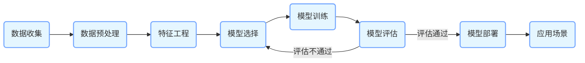

# AI编程：从理论到实践

> 关键词：AI编程、理论基础、实践应用、机器学习、深度学习、算法原理、代码实现

> 摘要：本文旨在全面介绍AI编程从理论到实践的全过程。首先阐述AI编程的背景知识，包括目的、预期读者、文档结构和相关术语。接着深入探讨AI编程的核心概念与联系，通过文本示意图和Mermaid流程图进行清晰展示。详细讲解核心算法原理，并结合Python源代码阐述具体操作步骤。对AI编程涉及的数学模型和公式进行详细讲解并举例说明。通过项目实战，展示代码实际案例并进行详细解释。分析AI编程的实际应用场景，推荐相关的学习资源、开发工具框架和论文著作。最后总结AI编程的未来发展趋势与挑战，提供常见问题解答和扩展阅读参考资料，帮助读者全面掌握AI编程的理论与实践。

## 1. 背景介绍 
### 1.1 目的和范围
AI编程在当今科技领域具有至关重要的地位，其应用范围涵盖了各个行业，如医疗、金融、交通等。本文的目的在于系统地介绍AI编程从理论到实践的整个过程，帮助读者建立起对AI编程的全面理解。范围包括AI编程的核心概念、算法原理、数学模型、实际应用以及项目实战等方面，旨在为读者提供一个完整的学习和实践路径。

### 1.2 预期读者
本文预期读者包括对AI编程有兴趣的初学者、希望深入了解AI技术的程序员、软件架构师以及相关领域的研究人员。无论你是刚刚接触AI编程，还是已经有一定基础想要进一步提升的人员，都能从本文中获得有价值的信息。

### 1.3 文档结构概述
本文将按照以下结构进行组织：首先介绍背景知识，包括目的、预期读者等；接着阐述AI编程的核心概念与联系，通过直观的示意图和流程图展示；然后详细讲解核心算法原理和具体操作步骤，结合Python代码进行说明；再介绍数学模型和公式，并举例说明；通过项目实战展示代码实现和详细解读；分析实际应用场景；推荐相关的学习资源、开发工具框架和论文著作；最后总结未来发展趋势与挑战，提供常见问题解答和扩展阅读参考资料。

### 1.4 术语表
#### 1.4.1 核心术语定义
- **AI（Artificial Intelligence）**：即人工智能，是指让计算机模拟人类智能的技术和方法，包括学习、推理、决策等能力。
- **机器学习（Machine Learning）**：是AI的一个重要分支，通过算法让计算机从数据中自动学习模式和规律，而无需明确的编程指令。
- **深度学习（Deep Learning）**：是机器学习的一个子领域，基于人工神经网络，通过多层神经网络对数据进行特征提取和模式识别。
- **算法（Algorithm）**：是解决特定问题的一系列步骤和规则，在AI编程中用于实现各种功能。
- **模型（Model）**：是对数据和问题的一种抽象表示，通过训练得到，用于进行预测和决策。

#### 1.4.2 相关概念解释
- **数据集（Dataset）**：是用于训练和测试模型的数据集合，通常包含输入数据和对应的标签。
- **特征（Feature）**：是数据集中用于描述样本的属性或变量，是模型进行学习和预测的依据。
- **训练（Training）**：是指使用数据集对模型进行优化的过程，通过调整模型的参数，使其能够更好地拟合数据。
- **测试（Testing）**：是指使用未参与训练的数据对训练好的模型进行评估的过程，以检验模型的泛化能力。

#### 1.4.3 缩略词列表
- **ANN（Artificial Neural Network）**：人工神经网络
- **CNN（Convolutional Neural Network）**：卷积神经网络
- **RNN（Recurrent Neural Network）**：循环神经网络
- **GPU（Graphics Processing Unit）**：图形处理单元
- **API（Application Programming Interface）**：应用程序编程接口

## 2. 核心概念与联系 
### 核心概念原理
AI编程的核心概念主要围绕着机器学习和深度学习展开。机器学习是AI的基础，它通过让计算机从数据中学习模式和规律，从而实现对未知数据的预测和分类。深度学习则是机器学习的一种高级形式，它通过构建多层神经网络，自动提取数据中的复杂特征，从而在图像识别、自然语言处理等领域取得了巨大的成功。

机器学习的基本原理是通过定义一个目标函数，然后使用优化算法来最小化这个目标函数，从而得到最优的模型参数。例如，在分类问题中，目标函数可以是分类误差，通过调整模型的参数，使得分类误差最小化。

深度学习的核心是人工神经网络，它由多个神经元组成，每个神经元接收输入信号，经过激活函数处理后输出信号。多层神经网络通过层层传递信号，自动提取数据中的特征。例如，在图像识别中，卷积神经网络（CNN）通过卷积层、池化层等结构，自动提取图像中的边缘、纹理等特征，从而实现对图像的分类。

### 架构的文本示意图
AI编程的架构可以分为数据层、模型层和应用层。数据层负责收集、整理和预处理数据，为模型训练提供高质量的数据。模型层包括各种机器学习和深度学习模型，通过训练这些模型来学习数据中的模式和规律。应用层则将训练好的模型应用到实际场景中，实现各种功能，如预测、分类、推荐等。

### Mermaid流程图


## 3. 核心算法原理 & 具体操作步骤 
### 线性回归算法原理
线性回归是一种基本的机器学习算法，用于预测连续值的输出。其基本原理是通过找到一条直线（或超平面），使得所有数据点到该直线（或超平面）的距离之和最小。

假设我们有一个数据集 $\{(x_1, y_1), (x_2, y_2), \cdots, (x_n, y_n)\}$，其中 $x_i$ 是输入特征，$y_i$ 是对应的输出值。线性回归模型可以表示为：

$$y = \theta_0 + \theta_1x_1 + \theta_2x_2 + \cdots + \theta_mx_m$$

其中 $\theta_0, \theta_1, \cdots, \theta_m$ 是模型的参数。我们的目标是找到一组最优的参数 $\theta$，使得预测值 $\hat{y}$ 与真实值 $y$ 之间的误差最小。常用的误差度量方法是均方误差（Mean Squared Error，MSE）：

$$MSE = \frac{1}{n}\sum_{i=1}^{n}(y_i - \hat{y}_i)^2$$

### Python源代码实现
```python
import numpy as np
from sklearn.linear_model import LinearRegression
from sklearn.metrics import mean_squared_error
from sklearn.model_selection import train_test_split

# 生成一些示例数据
np.random.seed(0)
X = np.random.rand(100, 1)
y = 2 * X + 1 + 0.5 * np.random.randn(100, 1)

# 划分训练集和测试集
X_train, X_test, y_train, y_test = train_test_split(X, y, test_size=0.2, random_state=42)

# 创建线性回归模型
model = LinearRegression()

# 训练模型
model.fit(X_train, y_train)

# 进行预测
y_pred = model.predict(X_test)

# 计算均方误差
mse = mean_squared_error(y_test, y_pred)
print(f"均方误差: {mse}")
```
### 具体操作步骤
1. **数据生成**：使用 `np.random.rand` 生成随机输入特征 $X$，并根据线性关系生成对应的输出值 $y$，同时添加一些噪声。
2. **数据划分**：使用 `train_test_split` 函数将数据集划分为训练集和测试集，其中测试集占比为 20%。
3. **模型创建**：创建 `LinearRegression` 类的实例，即线性回归模型。
4. **模型训练**：使用 `fit` 方法对模型进行训练，传入训练集的输入特征和对应的输出值。
5. **模型预测**：使用 `predict` 方法对测试集的输入特征进行预测，得到预测值。
6. **误差计算**：使用 `mean_squared_error` 函数计算预测值与真实值之间的均方误差。

## 4. 数学模型和公式 & 详细讲解 & 举例说明 
### 线性回归的数学模型和公式
线性回归的数学模型可以表示为：

$$y = \theta^T x + \epsilon$$

其中 $y$ 是输出值，$x$ 是输入特征向量，$\theta$ 是模型的参数向量，$\epsilon$ 是误差项，通常假设 $\epsilon$ 服从均值为 0，方差为 $\sigma^2$ 的正态分布。

我们的目标是找到一组最优的参数 $\theta$，使得误差项的平方和最小。即最小化损失函数：

$$J(\theta) = \frac{1}{2m}\sum_{i=1}^{m}(h_{\theta}(x^{(i)}) - y^{(i)})^2$$

其中 $m$ 是样本数量，$h_{\theta}(x^{(i)})$ 是模型对第 $i$ 个样本的预测值，$y^{(i)}$ 是第 $i$ 个样本的真实值。

### 详细讲解
为了最小化损失函数 $J(\theta)$，我们可以使用梯度下降算法。梯度下降算法的基本思想是沿着损失函数的负梯度方向更新参数 $\theta$，直到损失函数收敛。

梯度下降算法的更新公式为：

$$\theta_j := \theta_j - \alpha\frac{\partial}{\partial\theta_j}J(\theta)$$

其中 $\alpha$ 是学习率，控制每次更新的步长。

对于线性回归，损失函数 $J(\theta)$ 对 $\theta_j$ 的偏导数为：

$$\frac{\partial}{\partial\theta_j}J(\theta) = \frac{1}{m}\sum_{i=1}^{m}(h_{\theta}(x^{(i)}) - y^{(i)})x_j^{(i)}$$

### 举例说明
假设我们有一个简单的线性回归问题，数据集为 $\{(1, 3), (2, 5), (3, 7)\}$。我们的目标是找到一条直线 $y = \theta_0 + \theta_1x$，使得所有数据点到该直线的距离之和最小。

首先，我们可以将损失函数表示为：

$$J(\theta_0, \theta_1) = \frac{1}{2\times3}[( \theta_0 + \theta_1\times1 - 3)^2 + (\theta_0 + \theta_1\times2 - 5)^2 + (\theta_0 + \theta_1\times3 - 7)^2]$$

然后，我们可以使用梯度下降算法来更新参数 $\theta_0$ 和 $\theta_1$。假设学习率 $\alpha = 0.1$，初始参数 $\theta_0 = 0$，$\theta_1 = 0$。

第一次迭代：

$$\frac{\partial}{\partial\theta_0}J(\theta_0, \theta_1) = \frac{1}{3}[( \theta_0 + \theta_1\times1 - 3) + (\theta_0 + \theta_1\times2 - 5) + (\theta_0 + \theta_1\times3 - 7)]$$

$$\frac{\partial}{\partial\theta_1}J(\theta_0, \theta_1) = \frac{1}{3}[( \theta_0 + \theta_1\times1 - 3)\times1 + (\theta_0 + \theta_1\times2 - 5)\times2 + (\theta_0 + \theta_1\times3 - 7)\times3]$$

将 $\theta_0 = 0$，$\theta_1 = 0$ 代入上式，得到：

$$\frac{\partial}{\partial\theta_0}J(0, 0) = \frac{1}{3}[(0 + 0\times1 - 3) + (0 + 0\times2 - 5) + (0 + 0\times3 - 7)] = -5$$

$$\frac{\partial}{\partial\theta_1}J(0, 0) = \frac{1}{3}[(0 + 0\times1 - 3)\times1 + (0 + 0\times2 - 5)\times2 + (0 + 0\times3 - 7)\times3] = -11.33$$

更新参数：

$$\theta_0 := 0 - 0.1\times(-5) = 0.5$$

$$\theta_1 := 0 - 0.1\times(-11.33) = 1.133$$

重复上述步骤，直到损失函数收敛。

## 5. 项目实战：代码实际案例和详细解释说明 
### 5.1  开发环境搭建
#### 安装Python
首先，我们需要安装Python环境。可以从Python官方网站（https://www.python.org/downloads/） 下载适合自己操作系统的Python安装包，然后按照安装向导进行安装。

#### 安装依赖库
在AI编程中，我们通常会使用一些常用的Python库，如 `numpy`、`pandas`、`scikit-learn`、`tensorflow` 等。可以使用 `pip` 命令来安装这些库：

```bash
pip install numpy pandas scikit-learn tensorflow
```

### 5.2  源代码详细实现和代码解读
#### 项目背景
我们将实现一个简单的手写数字识别项目，使用MNIST数据集。MNIST数据集是一个包含60000个训练样本和10000个测试样本的手写数字图像数据集，每个图像的大小为28x28像素。

#### 代码实现
```python
import tensorflow as tf
from tensorflow.keras.datasets import mnist
from tensorflow.keras.models import Sequential
from tensorflow.keras.layers import Flatten, Dense
from tensorflow.keras.utils import to_categorical
import matplotlib.pyplot as plt

# 加载MNIST数据集
(train_images, train_labels), (test_images, test_labels) = mnist.load_data()

# 数据预处理
train_images = train_images / 255.0
test_images = test_images / 255.0

train_labels = to_categorical(train_labels)
test_labels = to_categorical(test_labels)

# 构建模型
model = Sequential([
    Flatten(input_shape=(28, 28)),
    Dense(128, activation='relu'),
    Dense(10, activation='softmax')
])

# 编译模型
model.compile(optimizer='adam',
              loss='categorical_crossentropy',
              metrics=['accuracy'])

# 训练模型
history = model.fit(train_images, train_labels, epochs=5, batch_size=64, validation_data=(test_images, test_labels))

# 评估模型
test_loss, test_acc = model.evaluate(test_images, test_labels)
print(f"测试集损失: {test_loss}, 测试集准确率: {test_acc}")

# 绘制训练过程中的损失和准确率曲线
plt.plot(history.history['accuracy'])
plt.plot(history.history['val_accuracy'])
plt.title('Model accuracy')
plt.ylabel('Accuracy')
plt.xlabel('Epoch')
plt.legend(['Train', 'Test'], loc='upper left')
plt.show()

plt.plot(history.history['loss'])
plt.plot(history.history['val_loss'])
plt.title('Model loss')
plt.ylabel('Loss')
plt.xlabel('Epoch')
plt.legend(['Train', 'Test'], loc='upper left')
plt.show()
```
#### 代码解读
1. **数据加载**：使用 `mnist.load_data()` 函数加载MNIST数据集，将其分为训练集和测试集。
2. **数据预处理**：将图像像素值归一化到0-1之间，将标签进行one-hot编码。
3. **模型构建**：使用 `Sequential` 模型构建一个简单的神经网络，包括一个 `Flatten` 层将图像展平为一维向量，一个 `Dense` 层作为隐藏层，使用 `relu` 激活函数，一个 `Dense` 层作为输出层，使用 `softmax` 激活函数。
4. **模型编译**：使用 `adam` 优化器，`categorical_crossentropy` 损失函数，`accuracy` 作为评估指标。
5. **模型训练**：使用 `fit` 方法对模型进行训练，指定训练集、训练轮数、批次大小和验证集。
6. **模型评估**：使用 `evaluate` 方法对模型在测试集上进行评估，得到测试集的损失和准确率。
7. **结果可视化**：使用 `matplotlib` 库绘制训练过程中的损失和准确率曲线，以便观察模型的训练情况。

### 5.3  代码解读与分析
#### 数据预处理的重要性
数据预处理是AI编程中非常重要的一步，它可以提高模型的训练效果和泛化能力。在本项目中，我们将图像像素值归一化到0-1之间，这可以使得模型更快地收敛，避免梯度消失或梯度爆炸的问题。同时，我们将标签进行one-hot编码，这是因为在多分类问题中，使用one-hot编码可以更方便地计算损失函数。

#### 模型架构的选择
在本项目中，我们选择了一个简单的神经网络架构，包括一个隐藏层和一个输出层。隐藏层使用 `relu` 激活函数，它可以引入非线性因素，使得模型能够学习到更复杂的模式。输出层使用 `softmax` 激活函数，它可以将模型的输出转换为概率分布，方便进行分类。

#### 训练过程的分析
通过观察训练过程中的损失和准确率曲线，我们可以判断模型是否过拟合或欠拟合。如果训练集的准确率很高，而测试集的准确率很低，说明模型可能过拟合；如果训练集和测试集的准确率都很低，说明模型可能欠拟合。在本项目中，我们可以通过调整模型的架构、训练轮数、批次大小等参数来优化模型的性能。

## 6. 实际应用场景 
### 图像识别
AI编程在图像识别领域有着广泛的应用，如人脸识别、物体检测、图像分类等。例如，在安防领域，人脸识别技术可以用于门禁系统、监控系统等，提高安全性；在医疗领域，图像识别技术可以用于医学影像分析，辅助医生进行疾病诊断。

### 自然语言处理
自然语言处理是AI编程的另一个重要应用领域，包括文本分类、情感分析、机器翻译、问答系统等。例如，在智能客服领域，问答系统可以自动回答用户的问题，提高客户服务效率；在信息检索领域，文本分类技术可以对大量的文本数据进行分类，方便用户查找信息。

### 推荐系统
推荐系统是AI编程在电商、社交、娱乐等领域的重要应用，它可以根据用户的历史行为和偏好，为用户推荐个性化的商品、内容等。例如，在电商平台上，推荐系统可以根据用户的浏览记录、购买记录等，为用户推荐相关的商品，提高用户的购买转化率；在音乐、视频平台上，推荐系统可以根据用户的收听、观看记录，为用户推荐喜欢的音乐、视频。

### 自动驾驶
自动驾驶是AI编程在交通领域的重要应用，它可以实现车辆的自主行驶，提高交通安全和效率。自动驾驶系统通常包括感知、决策、控制等模块，其中感知模块使用图像识别、激光雷达等技术来获取车辆周围的环境信息，决策模块使用机器学习和深度学习算法来进行路径规划和决策，控制模块根据决策结果来控制车辆的行驶。

## 7. 工具和资源推荐
### 7.1 学习资源推荐
#### 7.1.1 书籍推荐
- 《机器学习》（周志华）：这本书是机器学习领域的经典教材，全面介绍了机器学习的基本概念、算法和应用。
- 《深度学习》（Ian Goodfellow、Yoshua Bengio、Aaron Courville）：这本书是深度学习领域的权威著作，深入介绍了深度学习的原理、模型和应用。
- 《Python机器学习实战》（Sebastian Raschka、Vahid Mirjalili）：这本书结合Python代码，详细介绍了机器学习的算法和实践，适合初学者。

#### 7.1.2 在线课程
- Coursera上的《机器学习》（Andrew Ng）：这是一门非常经典的机器学习课程，由斯坦福大学的Andrew Ng教授授课，内容全面，讲解详细。
- edX上的《深度学习》（MIT）：这是一门由麻省理工学院开设的深度学习课程，深入介绍了深度学习的原理和应用。
- 哔哩哔哩上的《动手学深度学习》：这是一门由李沐老师讲解的深度学习课程，结合代码实践，非常适合初学者。

#### 7.1.3 技术博客和网站
- Medium：这是一个技术博客平台，上面有很多关于AI编程的优秀文章和教程。
- Towards Data Science：这是一个专注于数据科学和AI编程的网站，提供了大量的技术文章和案例分析。
- 开源中国：这是一个国内的技术社区，上面有很多关于AI编程的技术文章和讨论。

### 7.2 开发工具框架推荐
#### 7.2.1 IDE和编辑器
- PyCharm：这是一款专门为Python开发设计的集成开发环境，功能强大，支持代码调试、自动补全、版本控制等功能。
- Jupyter Notebook：这是一个交互式的开发环境，适合进行数据分析和模型训练，支持代码、文本、图像等多种格式的展示。
- Visual Studio Code：这是一款轻量级的代码编辑器，支持多种编程语言，通过安装插件可以实现AI编程的开发。

#### 7.2.2 调试和性能分析工具
- TensorBoard：这是TensorFlow提供的一个可视化工具，可以用于查看模型的训练过程、损失曲线、准确率曲线等信息。
- PyTorch Profiler：这是PyTorch提供的一个性能分析工具，可以用于分析模型的运行时间、内存使用等情况。
- cProfile：这是Python内置的一个性能分析工具，可以用于分析Python代码的运行时间和函数调用情况。

#### 7.2.3 相关框架和库
- TensorFlow：这是一个由Google开发的开源深度学习框架，功能强大，支持多种深度学习模型的开发和训练。
- PyTorch：这是一个由Facebook开发的开源深度学习框架，易于使用，适合快速原型开发和研究。
- Scikit-learn：这是一个简单易用的机器学习库，提供了各种机器学习算法和工具，适合初学者。

### 7.3 相关论文著作推荐
#### 7.3.1 经典论文
- 《Gradient-Based Learning Applied to Document Recognition》（Yann LeCun、Léon Bottou、Yoshua Bengio、Patrick Haffner）：这篇论文介绍了卷积神经网络（CNN）的基本原理和应用，是图像识别领域的经典论文。
- 《Long Short-Term Memory》（Sepp Hochreiter、Jürgen Schmidhuber）：这篇论文介绍了长短期记忆网络（LSTM）的基本原理和应用，是自然语言处理领域的经典论文。
- 《Attention Is All You Need》（Ashish Vaswani、Noam Shazeer、Niki Parmar等）：这篇论文介绍了Transformer模型的基本原理和应用，是自然语言处理领域的重要突破。

#### 7.3.2 最新研究成果
- 可以关注顶级学术会议如NeurIPS、ICML、CVPR等的最新研究成果，了解AI编程领域的最新技术和发展趋势。
- 可以关注顶级学术期刊如Journal of Artificial Intelligence Research（JAIR）、Artificial Intelligence等的最新研究论文。

#### 7.3.3 应用案例分析
- 《AI in Healthcare: Transforming Medicine through Artificial Intelligence》：这本书介绍了AI编程在医疗领域的应用案例和实践经验。
- 《AI in Finance: Transforming Financial Services through Artificial Intelligence》：这本书介绍了AI编程在金融领域的应用案例和实践经验。

## 8. 总结：未来发展趋势与挑战
### 未来发展趋势
- **多模态融合**：未来的AI系统将不再局限于单一的模态，如图像、文本、语音等，而是会将多种模态的信息进行融合，实现更加智能的交互和决策。例如，在智能客服领域，将语音识别、自然语言处理和图像识别技术相结合，可以实现更加自然和高效的人机交互。
- **强化学习与自主智能**：强化学习将在AI编程中发挥越来越重要的作用，通过智能体与环境的交互，不断学习和优化策略，实现自主智能。例如，在自动驾驶、机器人控制等领域，强化学习可以帮助智能体在复杂环境中做出最优决策。
- **边缘计算与AI的结合**：随着物联网的发展，边缘设备的数量不断增加。将AI技术与边缘计算相结合，可以实现数据的本地处理和分析，减少数据传输延迟，提高系统的实时性和安全性。例如，在智能安防领域，将图像识别算法部署在边缘设备上，可以实时对监控视频进行分析和处理。
- **AI伦理与可解释性**：随着AI技术的广泛应用，AI伦理和可解释性问题越来越受到关注。未来的AI系统需要更加透明和可解释，以便用户能够理解和信任AI的决策。例如，在医疗诊断、金融风险评估等领域，可解释的AI模型可以帮助医生和金融从业者更好地理解模型的决策过程，提高决策的可靠性。

### 挑战
- **数据隐私和安全**：AI编程需要大量的数据来训练模型，而这些数据往往包含用户的个人信息和敏感数据。如何保护数据的隐私和安全，防止数据泄露和滥用，是AI编程面临的重要挑战之一。
- **计算资源和能耗**：深度学习模型通常需要大量的计算资源和能耗来进行训练和推理。如何提高计算效率，降低能耗，是AI编程需要解决的问题之一。
- **算法的可扩展性和泛化能力**：随着数据量和模型复杂度的增加，算法的可扩展性和泛化能力成为了关键问题。如何设计出具有良好可扩展性和泛化能力的算法，是AI编程面临的挑战之一。
- **人才短缺**：AI编程是一个交叉学科领域，需要具备数学、计算机科学、统计学等多方面知识的专业人才。目前，AI领域的人才短缺问题比较严重，如何培养和吸引更多的AI人才，是推动AI编程发展的关键。

## 9. 附录：常见问题与解答
### 1. 什么是AI编程？
AI编程是指使用计算机编程语言和相关技术来实现人工智能系统的过程。它包括机器学习、深度学习、自然语言处理等多个领域，通过编写代码来实现各种AI算法和模型。

### 2. 学习AI编程需要具备哪些基础知识？
学习AI编程需要具备一定的数学基础，如线性代数、概率论、统计学等，以及计算机科学基础，如编程语言（Python）、数据结构、算法等。

### 3. 如何选择适合自己的AI编程框架？
选择适合自己的AI编程框架需要考虑多个因素，如学习成本、功能需求、性能要求等。对于初学者来说，可以选择简单易用的框架，如Scikit-learn、PyTorch等；对于有一定经验的开发者来说，可以选择功能强大的框架，如TensorFlow等。

### 4. 如何解决AI模型过拟合的问题？
解决AI模型过拟合的问题可以采用以下方法：增加训练数据、正则化（如L1、L2正则化）、早停法、Dropout等。

### 5. 如何评估AI模型的性能？
评估AI模型的性能可以使用不同的指标，如准确率、召回率、F1值、均方误差等，具体选择取决于问题的类型和需求。

## 10. 扩展阅读 & 参考资料
### 扩展阅读
- 《AI未来进行式》（李开复、王咏刚）：这本书介绍了AI技术的发展现状和未来趋势，以及AI对各个行业的影响。
- 《生命3.0》（迈克斯·泰格马克）：这本书探讨了AI与人类未来的关系，提出了生命3.0的概念。

### 参考资料
- 《Python官方文档》（https://docs.python.org/）
- 《TensorFlow官方文档》（https://www.tensorflow.org/）
- 《PyTorch官方文档》（https://pytorch.org/）
- 《Scikit-learn官方文档》（https://scikit-learn.org/）