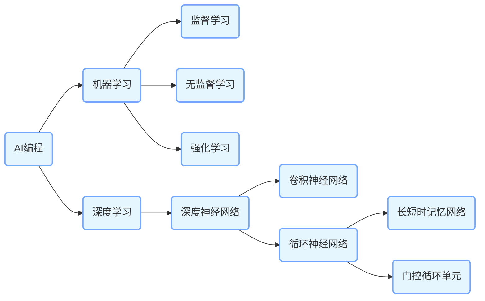

# AI编程：未来的技术挑战

> 关键词：AI编程、技术挑战、人工智能、机器学习、深度学习、算法优化、伦理道德

> 摘要：本文围绕AI编程未来面临的技术挑战展开深入探讨。首先介绍了AI编程的背景信息，包括目的范围、预期读者等内容。接着阐述了AI编程的核心概念与联系，详细讲解核心算法原理和具体操作步骤，通过数学模型和公式进行理论支撑并举例说明。结合项目实战，呈现代码实际案例并深入解读。分析了AI编程的实际应用场景，推荐了相关的学习资源、开发工具框架以及论文著作。最后总结了AI编程未来的发展趋势与挑战，还设有附录解答常见问题，并提供扩展阅读和参考资料，旨在为读者全面剖析AI编程未来面临的多方面挑战，助力其更好地理解和应对这一领域的发展。

## 1. 背景介绍 
### 1.1 目的和范围
AI编程作为当今科技领域最为热门和前沿的方向之一，正以前所未有的速度改变着我们的生活和工作方式。本文章的目的在于全面且深入地探讨AI编程在未来发展过程中所面临的各种技术挑战。范围涵盖从基础的AI核心概念、算法原理，到实际的项目实战、应用场景，以及与之相关的学习资源、工具框架和伦理道德等多个层面。通过对这些内容的分析，帮助读者清晰地认识到AI编程未来发展的阻碍和机遇，为从事AI编程相关工作的人员提供有价值的参考和指导。

### 1.2 预期读者
本文预期读者主要包括以下几类人群：首先是从事AI编程的专业程序员和软件工程师，他们可以从本文中获取关于最新技术挑战的信息，以便在实际工作中更好地应对和解决问题；其次是对AI编程有兴趣的技术爱好者，通过阅读本文可以系统地了解AI编程领域的复杂性和未来发展方向，激发他们进一步学习和探索的热情；再者是相关领域的研究人员和学者，本文的内容可以为他们的学术研究提供一定的理论支持和研究思路；最后是企业的技术管理者和决策者，他们能够根据本文的分析，制定合理的技术发展战略和决策，推动企业在AI编程领域的发展。

### 1.3 文档结构概述
本文共分为十个部分。第一部分为背景介绍，阐述了文章的目的和范围、预期读者、文档结构概述以及相关术语表；第二部分介绍AI编程的核心概念与联系，通过文本示意图和Mermaid流程图进行详细说明；第三部分讲解核心算法原理和具体操作步骤，结合Python源代码进行阐述；第四部分介绍数学模型和公式，并详细讲解和举例说明；第五部分通过项目实战，展示代码实际案例并进行详细解释；第六部分分析AI编程的实际应用场景；第七部分推荐相关的学习资源、开发工具框架和论文著作；第八部分总结AI编程未来的发展趋势与挑战；第九部分为附录，解答常见问题；第十部分提供扩展阅读和参考资料。

### 1.4 术语表
#### 1.4.1 核心术语定义
- **AI编程（Artificial Intelligence Programming）**：指利用计算机编程语言来实现人工智能相关功能和算法的过程，旨在让计算机模拟人类的智能行为，如学习、推理、决策等。
- **机器学习（Machine Learning）**：是一门多领域交叉学科，涉及概率论、统计学、逼近论、凸分析、算法复杂度理论等多门学科。它专门研究计算机怎样模拟或实现人类的学习行为，以获取新的知识或技能，重新组织已有的知识结构使之不断改善自身的性能。
- **深度学习（Deep Learning）**：是机器学习的一个分支领域，它是一种基于对数据进行表征学习的方法。深度学习通过构建具有很多层的神经网络模型，自动从大量数据中学习复杂的模式和特征。
- **算法优化（Algorithm Optimization）**：指对已有的算法进行改进和调整，以提高算法的效率、准确性和性能，减少计算资源的消耗。
- **伦理道德（Ethics and Morality）**：在AI编程领域，伦理道德涉及到如何确保AI系统的设计、开发和应用符合人类的价值观和道德准则，避免对人类造成伤害和不良影响。

#### 1.4.2 相关概念解释
- **神经网络（Neural Network）**：是一种模仿人类神经系统的计算模型，由大量的神经元组成。这些神经元通过连接权重相互传递信息，经过训练可以学习到数据中的模式和规律。
- **数据标注（Data Annotation）**：是指对原始数据进行标记和注释的过程，以便机器学习模型能够理解和处理这些数据。常见的数据标注类型包括图像标注、文本标注等。
- **过拟合（Overfitting）**：指模型在训练数据上表现良好，但在测试数据或新数据上表现不佳的现象。这是由于模型过于复杂，学习到了训练数据中的噪声和异常值。
- **欠拟合（Underfitting）**：与过拟合相反，欠拟合是指模型在训练数据和测试数据上的表现都不佳，无法学习到数据中的有效模式和规律。

#### 1.4.3 缩略词列表
- **AI（Artificial Intelligence）**：人工智能
- **ML（Machine Learning）**：机器学习
- **DL（Deep Learning）**：深度学习
- **CNN（Convolutional Neural Network）**：卷积神经网络
- **RNN（Recurrent Neural Network）**：循环神经网络
- **GPU（Graphics Processing Unit）**：图形处理器

## 2. 核心概念与联系 

### 2.1 AI编程核心概念原理
AI编程的核心在于模拟人类的智能行为，让计算机能够自动地处理和分析数据，做出决策和预测。其主要基于机器学习和深度学习技术，通过构建模型并使用大量的数据进行训练，使模型能够学习到数据中的模式和规律。

机器学习是AI编程的基础，它主要包括监督学习、无监督学习和强化学习三种类型。监督学习是指在训练过程中，模型的输入数据都有对应的标签，模型的目标是学习到输入数据和标签之间的映射关系；无监督学习则是在没有标签的情况下，让模型自动发现数据中的结构和模式；强化学习是通过智能体与环境进行交互，根据环境反馈的奖励信号来学习最优的行为策略。

深度学习是机器学习的一个高级分支，它通过构建深度神经网络来实现更强大的学习能力。深度神经网络由多个隐藏层组成，每个隐藏层包含大量的神经元，这些神经元通过连接权重相互传递信息。深度学习在图像识别、语音识别、自然语言处理等领域取得了巨大的成功。

### 2.2 核心概念架构示意图
以下是AI编程核心概念的文本示意图：

AI编程
|-- 机器学习
|   |-- 监督学习
|   |-- 无监督学习
|   |-- 强化学习
|-- 深度学习
|   |-- 深度神经网络
|       |-- 卷积神经网络（CNN）
|       |-- 循环神经网络（RNN）
|       |-- 长短时记忆网络（LSTM）
|       |-- 门控循环单元（GRU）

### 2.3 Mermaid流程图


## 3. 核心算法原理 & 具体操作步骤 

### 3.1 监督学习算法原理 - 线性回归
线性回归是一种简单而常用的监督学习算法，用于预测连续数值的输出。其基本原理是通过找到一条最佳的直线（在二维空间中）或超平面（在多维空间中），使得所有数据点到该直线或超平面的距离之和最小。

线性回归的数学模型可以表示为：

$$y = \theta_0 + \theta_1x_1 + \theta_2x_2 + \cdots + \theta_nx_n$$

其中，$y$ 是预测值，$x_1, x_2, \cdots, x_n$ 是输入特征，$\theta_0, \theta_1, \cdots, \theta_n$ 是模型的参数。

为了找到最佳的参数 $\theta$，通常使用最小二乘法来最小化误差平方和。误差平方和的计算公式为：

$$J(\theta) = \frac{1}{2m}\sum_{i = 1}^{m}(h_{\theta}(x^{(i)}) - y^{(i)})^2$$

其中，$m$ 是样本数量，$h_{\theta}(x^{(i)})$ 是模型对第 $i$ 个样本的预测值，$y^{(i)}$ 是第 $i$ 个样本的真实值。

### 3.2 线性回归算法的Python实现
```python
import numpy as np

class LinearRegression:
    def __init__(self):
        self.theta = None

    def fit(self, X, y):
        # 在 X 矩阵前添加一列全为 1 的列，用于表示截距项
        X_b = np.c_[np.ones((X.shape[0], 1)), X]
        # 使用正规方程求解参数 theta
        self.theta = np.linalg.inv(X_b.T.dot(X_b)).dot(X_b.T).dot(y)

    def predict(self, X):
        X_b = np.c_[np.ones((X.shape[0], 1)), X]
        return X_b.dot(self.theta)
```

### 3.3 具体操作步骤
1. **数据准备**：收集和整理训练数据，将其分为输入特征 $X$ 和目标值 $y$。
2. **模型训练**：创建线性回归模型对象，调用 `fit` 方法，将输入特征 $X$ 和目标值 $y$ 作为参数传入，训练模型得到参数 $\theta$。
3. **模型预测**：准备测试数据，调用 `predict` 方法，将测试数据的输入特征作为参数传入，得到预测结果。

以下是一个简单的示例代码：
```python
# 生成一些示例数据
X = np.array([[1], [2], [3], [4], [5]])
y = np.array([2, 4, 6, 8, 10])

# 创建线性回归模型对象
model = LinearRegression()

# 训练模型
model.fit(X, y)

# 进行预测
test_X = np.array([[6], [7]])
predictions = model.predict(test_X)

print("预测结果:", predictions)
```

### 3.4 无监督学习算法原理 - K 均值聚类
K 均值聚类是一种常用的无监督学习算法，用于将数据点划分为 $K$ 个不同的簇。其基本原理是通过迭代的方式，不断更新簇的中心，使得每个数据点到其所属簇中心的距离之和最小。

K 均值聚类的具体步骤如下：
1. **初始化**：随机选择 $K$ 个数据点作为初始的簇中心。
2. **分配数据点**：计算每个数据点到各个簇中心的距离，将其分配到距离最近的簇中。
3. **更新簇中心**：计算每个簇中所有数据点的平均值，将其作为新的簇中心。
4. **重复步骤 2 和 3**：直到簇中心不再发生变化或达到最大迭代次数。

### 3.5 K 均值聚类算法的 Python 实现
```python
import numpy as np

class KMeans:
    def __init__(self, n_clusters=3, max_iter=300):
        self.n_clusters = n_clusters
        self.max_iter = max_iter
        self.centroids = None

    def fit(self, X):
        # 随机初始化簇中心
        self.centroids = X[np.random.choice(X.shape[0], self.n_clusters, replace=False)]

        for _ in range(self.max_iter):
            # 分配数据点到最近的簇
            labels = self._assign_labels(X)
            # 更新簇中心
            new_centroids = self._update_centroids(X, labels)

            # 判断簇中心是否不再变化
            if np.allclose(new_centroids, self.centroids):
                break

            self.centroids = new_centroids

    def _assign_labels(self, X):
        distances = np.array([np.linalg.norm(X - centroid, axis=1) for centroid in self.centroids])
        return np.argmin(distances, axis=0)

    def _update_centroids(self, X, labels):
        centroids = np.zeros((self.n_clusters, X.shape[1]))
        for i in range(self.n_clusters):
            cluster_points = X[labels == i]
            if len(cluster_points) > 0:
                centroids[i] = np.mean(cluster_points, axis=0)
        return centroids

    def predict(self, X):
        distances = np.array([np.linalg.norm(X - centroid, axis=1) for centroid in self.centroids])
        return np.argmin(distances, axis=0)
```

### 3.6 具体操作步骤
1. **数据准备**：收集和整理数据，将其作为输入特征 $X$。
2. **模型训练**：创建 K 均值聚类模型对象，调用 `fit` 方法，将输入特征 $X$ 作为参数传入，训练模型得到簇中心。
3. **模型预测**：准备测试数据，调用 `predict` 方法，将测试数据的输入特征作为参数传入，得到每个数据点所属的簇标签。

以下是一个简单的示例代码：
```python
# 生成一些示例数据
X = np.array([[1, 2], [2, 3], [4, 5], [5, 6], [7, 8], [8, 9]])

# 创建 K 均值聚类模型对象
model = KMeans(n_clusters=2)

# 训练模型
model.fit(X)

# 进行预测
test_X = np.array([[3, 4], [6, 7]])
predictions = model.predict(test_X)

print("预测结果:", predictions)
```

## 4. 数学模型和公式 & 详细讲解 & 举例说明 

### 4.1 线性回归数学模型和公式详细讲解
线性回归的数学模型为：

$$y = \theta_0 + \theta_1x_1 + \theta_2x_2 + \cdots + \theta_nx_n$$

其中，$y$ 是预测值，$x_1, x_2, \cdots, x_n$ 是输入特征，$\theta_0, \theta_1, \cdots, \theta_n$ 是模型的参数。$\theta_0$ 称为截距项，$\theta_1, \cdots, \theta_n$ 称为斜率项。

误差平方和的计算公式为：

$$J(\theta) = \frac{1}{2m}\sum_{i = 1}^{m}(h_{\theta}(x^{(i)}) - y^{(i)})^2$$

其中，$m$ 是样本数量，$h_{\theta}(x^{(i)})$ 是模型对第 $i$ 个样本的预测值，$y^{(i)}$ 是第 $i$ 个样本的真实值。

为了找到最佳的参数 $\theta$，需要对误差平方和 $J(\theta)$ 求偏导数，并令其等于 0。对于简单的线性回归（只有一个输入特征），可以得到正规方程：

$$\theta = (X^T X)^{-1} X^T y$$

其中，$X$ 是输入特征矩阵，$y$ 是目标值向量。

### 4.2 线性回归举例说明
假设有一组数据：

| $x$ | $y$ |
| --- | --- |
| 1 | 2 |
| 2 | 4 |
| 3 | 6 |
| 4 | 8 |
| 5 | 10 |

我们可以使用线性回归来拟合这些数据。首先，将输入特征 $x$ 表示为矩阵 $X$，目标值 $y$ 表示为向量：

$$X = \begin{bmatrix} 1 & 1 \\ 1 & 2 \\ 1 & 3 \\ 1 & 4 \\ 1 & 5 \end{bmatrix}, y = \begin{bmatrix} 2 \\ 4 \\ 6 \\ 8 \\ 10 \end{bmatrix}$$

然后，根据正规方程计算参数 $\theta$：

$$\theta = (X^T X)^{-1} X^T y = \begin{bmatrix} 0 \\ 2 \end{bmatrix}$$

因此，线性回归模型的方程为 $y = 0 + 2x$，这与我们观察到的数据规律是一致的。

### 4.3 K 均值聚类数学模型和公式详细讲解
K 均值聚类的目标是最小化每个数据点到其所属簇中心的距离之和。距离通常使用欧几里得距离来计算，欧几里得距离的计算公式为：

$$d(x, y) = \sqrt{\sum_{i = 1}^{n}(x_i - y_i)^2}$$

其中，$x$ 和 $y$ 是两个数据点，$n$ 是数据点的维度。

在 K 均值聚类中，需要不断更新簇中心，使得每个簇中所有数据点到簇中心的距离之和最小。簇中心的更新公式为：

$$c_j = \frac{1}{|C_j|}\sum_{x \in C_j}x$$

其中，$c_j$ 是第 $j$ 个簇的中心，$C_j$ 是第 $j$ 个簇中的所有数据点，$|C_j|$ 是第 $j$ 个簇中数据点的数量。

### 4.4 K 均值聚类举例说明
假设有一组二维数据点：

$$X = \begin{bmatrix} 1 & 2 \\ 2 & 3 \\ 4 & 5 \\ 5 & 6 \\ 7 & 8 \\ 8 & 9 \end{bmatrix}$$

我们要将这些数据点划分为 2 个簇。首先，随机初始化两个簇中心：

$$c_1 = \begin{bmatrix} 1 \\ 2 \end{bmatrix}, c_2 = \begin{bmatrix} 7 \\ 8 \end{bmatrix}$$

然后，计算每个数据点到两个簇中心的距离，将其分配到距离最近的簇中。接着，更新簇中心，重复这个过程直到簇中心不再发生变化。

经过多次迭代后，最终的簇中心可能为：

$$c_1 = \begin{bmatrix} 2 \\ 3 \end{bmatrix}, c_2 = \begin{bmatrix} 7 \\ 8 \end{bmatrix}$$

这样，数据点就被划分为了两个簇。

## 5. 项目实战：代码实际案例和详细解释说明 

### 5.1  开发环境搭建
在进行 AI 编程项目实战之前，需要搭建相应的开发环境。以下是具体的步骤：

#### 5.1.1 安装 Python
Python 是 AI 编程中最常用的编程语言，建议安装 Python 3.7 及以上版本。可以从 Python 官方网站（https://www.python.org/downloads/） 下载并安装适合自己操作系统的 Python 版本。

#### 5.1.2 安装必要的库
在 AI 编程中，常用的库包括 NumPy、Pandas、Scikit-learn、TensorFlow、PyTorch 等。可以使用 `pip` 命令来安装这些库：

```bash
pip install numpy pandas scikit-learn tensorflow torch
```

#### 5.1.3 选择开发工具
可以选择 PyCharm、Jupyter Notebook 等开发工具。PyCharm 是一款功能强大的 Python 集成开发环境，适合进行大型项目的开发；Jupyter Notebook 则是一种交互式的开发环境，适合进行数据分析和模型实验。

### 5.2  源代码详细实现和代码解读

#### 5.2.1 手写数字识别项目
手写数字识别是一个经典的 AI 项目，我们可以使用深度学习中的卷积神经网络（CNN）来实现。以下是使用 TensorFlow 和 Keras 实现手写数字识别的代码：

```python
import tensorflow as tf
from tensorflow.keras.datasets import mnist
from tensorflow.keras.models import Sequential
from tensorflow.keras.layers import Conv2D, MaxPooling2D, Flatten, Dense
from tensorflow.keras.utils import to_categorical

# 加载数据集
(train_images, train_labels), (test_images, test_labels) = mnist.load_data()

# 数据预处理
train_images = train_images.reshape((60000, 28, 28, 1)).astype('float32') / 255
test_images = test_images.reshape((10000, 28, 28, 1)).astype('float32') / 255

train_labels = to_categorical(train_labels)
test_labels = to_categorical(test_labels)

# 构建模型
model = Sequential()
model.add(Conv2D(32, (3, 3), activation='relu', input_shape=(28, 28, 1)))
model.add(MaxPooling2D((2, 2)))
model.add(Conv2D(64, (3, 3), activation='relu'))
model.add(MaxPooling2D((2, 2)))
model.add(Flatten())
model.add(Dense(64, activation='relu'))
model.add(Dense(10, activation='softmax'))

# 编译模型
model.compile(optimizer='adam',
              loss='categorical_crossentropy',
              metrics=['accuracy'])

# 训练模型
model.fit(train_images, train_labels, epochs=5, batch_size=64)

# 评估模型
test_loss, test_acc = model.evaluate(test_images, test_labels)
print('Test accuracy:', test_acc)
```

#### 5.2.2 代码解读
1. **数据加载**：使用 `mnist.load_data()` 函数加载手写数字数据集，该数据集包含 60000 个训练样本和 10000 个测试样本。
2. **数据预处理**：将图像数据的形状调整为 `(样本数量, 高度, 宽度, 通道数)`，并将像素值归一化到 0 到 1 之间。同时，将标签进行 one-hot 编码。
3. **模型构建**：使用 `Sequential` 模型构建卷积神经网络。模型包括两个卷积层、两个池化层、一个全连接层和一个输出层。
4. **模型编译**：使用 `adam` 优化器、`categorical_crossentropy` 损失函数和 `accuracy` 评估指标来编译模型。
5. **模型训练**：使用 `fit` 方法对模型进行训练，指定训练数据、训练轮数和批量大小。
6. **模型评估**：使用 `evaluate` 方法对模型在测试数据上的性能进行评估，输出测试损失和测试准确率。

### 5.3  代码解读与分析
#### 5.3.1 卷积层的作用
卷积层是卷积神经网络的核心层，它通过卷积核在输入图像上滑动，提取图像的特征。卷积核可以学习到不同的特征，如边缘、纹理等。在手写数字识别项目中，第一个卷积层使用 32 个卷积核，每个卷积核的大小为 3x3，激活函数为 `relu`，可以提取图像的低级特征。

#### 5.3.2 池化层的作用
池化层的作用是对卷积层的输出进行下采样，减少数据的维度，同时保留重要的特征。在手写数字识别项目中，使用的是最大池化层，池化窗口的大小为 2x2。最大池化层会选择池化窗口中的最大值作为输出，这样可以保留图像的主要特征，同时减少计算量。

#### 5.3.3 全连接层的作用
全连接层将卷积层和池化层提取的特征进行整合，并将其映射到一个固定大小的向量中。在手写数字识别项目中，全连接层的神经元数量为 64，激活函数为 `relu`，可以进一步提取和组合特征。

#### 5.3.4 输出层的作用
输出层的神经元数量为 10，对应手写数字的 10 个类别（0 到 9）。激活函数为 `softmax`，可以将输出转换为概率分布，表示输入图像属于每个类别的概率。

#### 5.3.5 损失函数和优化器的选择
在手写数字识别项目中，使用的损失函数是 `categorical_crossentropy`，它适用于多分类问题。优化器选择 `adam`，它是一种自适应学习率的优化算法，可以在训练过程中自动调整学习率，提高训练效率。

## 6. 实际应用场景 
### 6.1 医疗领域
AI 编程在医疗领域有着广泛的应用。例如，在疾病诊断方面，通过对大量的医学影像（如 X 光、CT 等）进行分析，AI 模型可以帮助医生更准确地检测疾病，如肺癌、乳腺癌等。在药物研发方面，AI 可以通过分析大量的生物数据和化学数据，预测药物的疗效和副作用，加速药物研发的进程。此外，AI 还可以用于智能健康监测，通过可穿戴设备收集人体的生理数据，实时监测健康状况，及时发现潜在的健康问题。

### 6.2 金融领域
在金融领域，AI 编程可以用于风险评估、欺诈检测和投资决策等方面。例如，银行可以使用 AI 模型对客户的信用风险进行评估，根据客户的历史数据和行为模式，预测客户的违约概率。在欺诈检测方面，AI 可以通过分析大量的交易数据，识别出异常的交易行为，及时防范金融欺诈。在投资决策方面，AI 可以通过对市场数据的分析和预测，为投资者提供决策支持，帮助他们制定更合理的投资策略。

### 6.3 交通领域
AI 编程在交通领域的应用主要包括自动驾驶和智能交通管理。在自动驾驶方面，AI 模型可以通过对传感器数据（如摄像头、雷达等）的分析，实现车辆的自主导航和决策。在智能交通管理方面，AI 可以通过对交通流量、路况等数据的分析，优化交通信号灯的控制，提高交通效率，减少拥堵。

### 6.4 教育领域
在教育领域，AI 编程可以用于个性化学习和智能教学。例如，通过对学生的学习数据进行分析，AI 模型可以了解学生的学习进度、学习习惯和学习能力，为学生提供个性化的学习方案。在智能教学方面，AI 可以作为虚拟教师，为学生提供答疑解惑、辅导学习等服务，提高教学质量和效率。

### 6.5 娱乐领域
AI 编程在娱乐领域的应用包括游戏开发、内容创作和推荐系统等。在游戏开发方面，AI 可以用于实现游戏角色的智能行为，提高游戏的趣味性和挑战性。在内容创作方面，AI 可以生成音乐、绘画、文学作品等，为创作者提供灵感和辅助。在推荐系统方面，AI 可以根据用户的兴趣和行为，为用户推荐个性化的娱乐内容，如电影、音乐、书籍等。

## 7. 工具和资源推荐
### 7.1 学习资源推荐
#### 7.1.1 书籍推荐
- 《机器学习》（周志华著）：这本书是机器学习领域的经典教材，全面系统地介绍了机器学习的基本概念、算法和应用。
- 《深度学习》（Ian Goodfellow、Yoshua Bengio 和 Aaron Courville 著）：深度学习领域的权威著作，深入讲解了深度学习的理论和实践。
- 《Python 机器学习》（Sebastian Raschka 著）：以 Python 为工具，详细介绍了机器学习的各种算法和应用，适合初学者入门。

#### 7.1.2 在线课程
- Coursera 上的《机器学习》课程（Andrew Ng 教授）：这是一门非常经典的机器学习课程，由斯坦福大学的 Andrew Ng 教授授课，课程内容丰富，讲解详细。
- edX 上的《深度学习微硕士学位》课程：由多所知名高校联合推出的深度学习课程，涵盖了深度学习的各个方面，适合有一定基础的学习者深入学习。
- 哔哩哔哩（B 站）上的相关 AI 编程教程：B 站上有很多优秀的 AI 编程教程，由不同的博主分享，内容生动有趣，适合初学者快速入门。

#### 7.1.3 技术博客和网站
- Medium：这是一个技术博客平台，有很多 AI 编程领域的专家和爱好者分享自己的经验和见解。
- Towards Data Science：专注于数据科学和 AI 领域的博客网站，提供了大量的技术文章和案例分析。
- AI 研习社：国内专注于 AI 领域的社区，提供了丰富的学习资源、技术文章和竞赛信息。

### 7.2 开发工具框架推荐
#### 7.2.1 IDE和编辑器
- PyCharm：一款功能强大的 Python 集成开发环境，具有代码自动补全、调试、版本控制等功能，适合进行大型项目的开发。
- Jupyter Notebook：一种交互式的开发环境，支持多种编程语言，适合进行数据分析、模型实验和文档编写。
- Visual Studio Code：一款轻量级的代码编辑器，具有丰富的插件生态系统，支持 Python 开发，适合快速开发和调试。

#### 7.2.2 调试和性能分析工具
- TensorBoard：TensorFlow 提供的可视化工具，可以用于查看模型的训练过程、网络结构、性能指标等信息。
- PyTorch Profiler：PyTorch 提供的性能分析工具，可以帮助用户分析模型的性能瓶颈，优化代码。
- cProfile：Python 内置的性能分析工具，可以统计代码的执行时间和函数调用次数，帮助用户找出性能问题。

#### 7.2.3 相关框架和库
- TensorFlow：一个开源的机器学习框架，由 Google 开发，提供了丰富的工具和接口，支持各种深度学习任务。
- PyTorch：一个开源的深度学习框架，由 Facebook 开发，具有动态图的优势，适合进行研究和快速迭代。
- Scikit-learn：一个简单易用的机器学习库，提供了各种机器学习算法和工具，适合初学者入门和快速实现机器学习任务。

### 7.3 相关论文著作推荐
#### 7.3.1 经典论文
- 《Gradient-Based Learning Applied to Document Recognition》（Yann LeCun 等著）：这篇论文提出了卷积神经网络（CNN）的经典模型 LeNet，为图像识别领域的发展奠定了基础。
- 《ImageNet Classification with Deep Convolutional Neural Networks》（Alex Krizhevsky 等著）：这篇论文提出了 AlexNet 模型，在 ImageNet 图像分类竞赛中取得了巨大成功，推动了深度学习在图像领域的发展。
- 《Attention Is All You Need》（Ashish Vaswani 等著）：这篇论文提出了 Transformer 模型，在自然语言处理领域取得了革命性的进展。

#### 7.3.2 最新研究成果
- 关注顶级学术会议（如 NeurIPS、ICML、CVPR 等）的论文，这些会议汇集了 AI 编程领域的最新研究成果和前沿技术。
- 关注知名学术期刊（如 Journal of Artificial Intelligence Research、Artificial Intelligence 等）的论文，这些期刊发表了很多高质量的 AI 编程研究论文。

#### 7.3.3 应用案例分析
- 《AI in Practice: How 50 Successful Companies Used Artificial Intelligence to Solve Problems》（Thomas H. Davenport 和 Rajeev Ronanki 著）：这本书介绍了 50 个成功的 AI 应用案例，涵盖了各个行业，通过分析这些案例，可以了解 AI 在实际应用中的方法和经验。
- 各大科技公司的技术博客和案例分享，如 Google、Facebook、Microsoft 等公司的官方博客，会分享他们在 AI 编程领域的应用案例和技术实践。

## 8. 总结：未来发展趋势与挑战
### 8.1 未来发展趋势
#### 8.1.1 算法创新
未来，AI 编程领域将不断涌现出更加先进和高效的算法。例如，强化学习算法将不断优化，使其在复杂环境中的决策能力更强；生成对抗网络（GAN）将不断发展，用于生成更加逼真的图像、视频和音频等内容。同时，新的算法思想和模型架构也将不断被提出，推动 AI 技术的发展。

#### 8.1.2 跨领域融合
AI 编程将与其他领域进行更加深入的融合，如生物医学、量子计算、能源等。例如，在生物医学领域，AI 可以与基因测序技术相结合，加速基因研究和药物研发；在量子计算领域，AI 可以用于优化量子算法和量子系统的控制。跨领域融合将为 AI 编程带来新的机遇和挑战。

#### 8.1.3 边缘计算与物联网
随着物联网的发展，大量的设备将产生海量的数据。边缘计算将成为处理这些数据的重要方式，AI 编程也将在边缘设备上得到更广泛的应用。例如，智能摄像头可以在本地进行图像识别和分析，减少数据传输和云端计算的压力。边缘计算与物联网的结合将使 AI 更加智能化和实时化。

#### 8.1.4 自动化与智能化
未来，AI 编程将越来越自动化和智能化。例如，自动机器学习（AutoML）技术将不断发展，使得非专业人员也能够轻松地构建和训练机器学习模型。同时，智能编程助手将不断完善，能够自动生成代码、调试程序和优化算法，提高编程效率。

### 8.2 挑战
#### 8.2.1 数据隐私和安全
随着 AI 技术的发展，数据的重要性越来越凸显。然而，数据隐私和安全问题也日益严重。例如，AI 模型在训练过程中需要大量的数据，如果这些数据被泄露或滥用，将对个人和社会造成严重的影响。因此，如何保护数据的隐私和安全，是 AI 编程未来面临的重要挑战之一。

#### 8.2.2 算法可解释性
AI 模型，尤其是深度学习模型，往往是一个黑盒，其决策过程难以解释。在一些关键领域，如医疗、金融等，算法的可解释性至关重要。例如，在医疗诊断中，医生需要了解 AI 模型的决策依据，才能信任其诊断结果。因此，如何提高算法的可解释性，是 AI 编程未来需要解决的问题之一。

#### 8.2.3 伦理道德问题
AI 技术的发展也带来了一系列的伦理道德问题。例如，AI 系统可能会产生偏见和歧视，对某些群体造成不公平的影响；AI 系统的自主性和决策能力也可能会引发责任归属的问题。因此，如何确保 AI 技术的发展符合人类的伦理道德准则，是 AI 编程未来需要面对的重要挑战。

#### 8.2.4 人才短缺
AI 编程是一个高度专业化的领域，需要具备扎实的数学基础、编程技能和领域知识。然而，目前全球范围内 AI 编程人才短缺的问题较为严重。如何培养和吸引更多的 AI 编程人才，是推动 AI 技术发展的关键。

## 9. 附录：常见问题与解答
### 9.1 AI 编程难学吗？
AI 编程具有一定的难度，需要具备扎实的数学基础（如线性代数、概率论、统计学等）和编程技能（如 Python 编程）。同时，还需要了解 AI 领域的相关概念和算法。但是，只要有足够的兴趣和耐心，通过系统的学习和实践，是可以掌握 AI 编程的。

### 9.2 学习 AI 编程需要哪些硬件设备？
学习 AI 编程对硬件设备的要求不是很高。一般来说，一台配置中等的笔记本电脑或台式机就可以满足基本的学习需求。如果要进行大规模的深度学习训练，建议使用具有 GPU 的计算机，以提高训练速度。

### 9.3 如何选择适合自己的 AI 编程框架？
选择适合自己的 AI 编程框架需要考虑多个因素，如个人的编程经验、项目需求、框架的易用性和性能等。对于初学者来说，Scikit-learn 是一个不错的选择，它简单易用，适合快速实现机器学习任务；对于深度学习领域，TensorFlow 和 PyTorch 是两个比较流行的框架，TensorFlow 功能强大，适合工业应用，PyTorch 动态图优势明显，适合研究和快速迭代。

### 9.4 AI 编程在实际应用中会遇到哪些问题？
AI 编程在实际应用中可能会遇到数据质量问题、模型过拟合或欠拟合问题、算法可解释性问题、计算资源不足问题等。在实际应用中，需要根据具体情况采取相应的措施来解决这些问题，如数据预处理、模型调优、使用可解释的算法、优化计算资源等。

## 10. 扩展阅读 & 参考资料
### 10.1 扩展阅读
- 《AI 未来进行式》（李开复、王咏刚著）：这本书以通俗易懂的语言介绍了 AI 技术的发展现状和未来趋势，以及 AI 对社会和人类的影响。
- 《人类简史：从动物到上帝》（尤瓦尔·赫拉利著）：虽然这本书不是专门关于 AI 编程的，但它从人类历史的角度探讨了技术对人类社会的影响，有助于读者从更宏观的角度理解 AI 技术的发展。
- 《奇点临近》（雷·库兹韦尔著）：这本书探讨了技术加速发展的趋势，以及未来人类与技术的融合，对 AI 编程的未来发展有一定的启示作用。

### 10.2 参考资料
- 各 AI 编程框架的官方文档，如 TensorFlow 官方文档（https://www.tensorflow.org/）、PyTorch 官方文档（https://pytorch.org/）等。
- 相关的学术论文和研究报告，可以通过学术数据库（如 IEEE Xplore、ACM Digital Library 等）进行查找。
- 各大科技公司的技术博客和开源项目，如 Google AI Blog（https://ai.googleblog.com/）、Facebook AI Research（https://ai.facebook.com/）等。