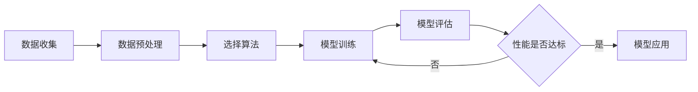

# AI编程：程序员的职业新方向

> 关键词：AI编程、程序员、职业方向、人工智能、机器学习、深度学习、技术转型

> 摘要：本文围绕AI编程作为程序员职业新方向展开深入探讨。首先介绍了相关背景，包括目的、预期读者等内容。接着阐述AI编程的核心概念与联系，通过文本示意图和Mermaid流程图直观呈现其架构。详细讲解核心算法原理和具体操作步骤，并使用Python源代码进行阐述。深入分析数学模型和公式，结合举例说明。通过项目实战展示代码实际案例并详细解释。探讨了AI编程的实际应用场景，推荐了相关工具和资源。最后总结未来发展趋势与挑战，解答常见问题并提供扩展阅读与参考资料，旨在为程序员了解和投身AI编程领域提供全面的指导和参考。

## 1. 背景介绍 
### 1.1 目的和范围
在当今数字化快速发展的时代，人工智能（AI）技术已经成为推动各个行业变革的关键力量。AI编程作为实现人工智能的重要手段，正逐渐成为程序员职业发展的新方向。本文的目的在于全面介绍AI编程相关知识，帮助程序员了解AI编程的核心概念、算法原理、实际应用等内容，为他们向AI编程领域转型提供理论支持和实践指导。范围涵盖AI编程的基础知识、核心算法、数学模型、项目实战、应用场景以及相关的工具和资源等方面。

### 1.2 预期读者
本文预期读者主要是广大程序员群体，包括有一定编程基础但对AI编程领域还不太熟悉，希望拓展职业方向的程序员；也适合正在学习编程，对AI编程有兴趣，想要提前了解相关知识的学生群体。同时，对于关注技术发展趋势，想要了解AI编程对程序员职业影响的行业从业者和研究者也具有一定的参考价值。

### 1.3 文档结构概述
本文将按照以下结构进行阐述：首先介绍AI编程的背景信息，包括目的、预期读者和文档结构概述等。接着深入讲解AI编程的核心概念与联系，通过示意图和流程图帮助读者理解其架构。然后详细介绍核心算法原理和具体操作步骤，使用Python代码进行演示。随后分析数学模型和公式，并举例说明。通过项目实战展示代码实现和解读。探讨AI编程的实际应用场景，推荐相关的工具和资源。最后总结未来发展趋势与挑战，解答常见问题并提供扩展阅读与参考资料。

### 1.4 术语表
#### 1.4.1 核心术语定义
- **人工智能（AI）**：是一门研究如何使计算机能够模拟人类智能的学科，包括学习、推理、感知、决策等能力。
- **机器学习（ML）**：是人工智能的一个重要分支，它通过让计算机从数据中自动学习模式和规律，从而实现预测和决策等任务。
- **深度学习（DL）**：是机器学习的一种特殊形式，它基于神经网络模型，通过多层神经元的组合来学习数据的复杂特征。
- **神经网络（NN）**：是一种模仿人类神经系统的计算模型，由大量的神经元组成，用于处理和分析数据。
- **训练集**：用于训练机器学习或深度学习模型的数据集合。
- **测试集**：用于评估训练好的模型性能的数据集合。

#### 1.4.2 相关概念解释
- **监督学习**：是一种机器学习方法，在这种方法中，训练数据包含输入数据和对应的目标输出数据，模型通过学习输入和输出之间的关系来进行预测。
- **无监督学习**：训练数据只包含输入数据，模型需要自行发现数据中的模式和结构，例如聚类分析。
- **强化学习**：智能体通过与环境进行交互，根据环境反馈的奖励信号来学习最优的行为策略。

#### 1.4.3 缩略词列表
- **AI**：Artificial Intelligence（人工智能）
- **ML**：Machine Learning（机器学习）
- **DL**：Deep Learning（深度学习）
- **NN**：Neural Network（神经网络）

## 2. 核心概念与联系 

### 核心概念原理
AI编程的核心概念主要围绕人工智能、机器学习和深度学习展开。人工智能是一个广泛的领域，旨在使计算机能够表现出智能行为。机器学习是实现人工智能的一种重要途径，它通过让计算机从数据中学习模式和规律，从而实现预测和决策等任务。深度学习则是机器学习的一个分支，它基于神经网络模型，通过多层神经元的组合来学习数据的复杂特征。

神经网络是深度学习的核心模型，它由输入层、隐藏层和输出层组成。输入层接收原始数据，隐藏层对数据进行特征提取和转换，输出层给出最终的预测结果。神经元是神经网络的基本组成单元，它接收输入信号，经过加权求和和非线性变换后输出结果。

### 架构的文本示意图
AI编程的整体架构可以描述为：数据是基础，通过数据收集和预处理得到可用的数据。然后选择合适的机器学习或深度学习算法，使用训练集对模型进行训练。训练过程中不断调整模型的参数，以优化模型的性能。训练好的模型可以用于预测和决策等任务，同时使用测试集对模型进行评估，根据评估结果对模型进行进一步的优化。

### Mermaid流程图


## 3. 核心算法原理 & 具体操作步骤 

### 线性回归算法原理
线性回归是一种简单而常用的机器学习算法，用于预测连续数值。其基本原理是通过寻找一条直线（在多维空间中是一个超平面），使得数据点到该直线的距离之和最小。假设我们有一个数据集 $\{(x_1, y_1), (x_2, y_2), \cdots, (x_n, y_n)\}$，其中 $x_i$ 是输入特征，$y_i$ 是对应的目标值。线性回归模型可以表示为 $y = \theta_0 + \theta_1x_1 + \theta_2x_2 + \cdots + \theta_mx_m$，其中 $\theta_i$ 是模型的参数。

### 具体操作步骤
1. **数据准备**：收集和整理数据集，将其分为训练集和测试集。
2. **初始化参数**：随机初始化模型的参数 $\theta_i$。
3. **计算损失函数**：使用均方误差（MSE）作为损失函数，公式为 $J(\theta) = \frac{1}{2n}\sum_{i = 1}^{n}(h_{\theta}(x^{(i)}) - y^{(i)})^2$，其中 $h_{\theta}(x^{(i)})$ 是模型的预测值。
4. **更新参数**：使用梯度下降算法更新参数，公式为 $\theta_j := \theta_j - \alpha\frac{\partial J(\theta)}{\partial \theta_j}$，其中 $\alpha$ 是学习率。
5. **重复步骤3和4**：直到损失函数收敛或达到最大迭代次数。
6. **模型评估**：使用测试集评估模型的性能，计算均方误差等指标。

### Python源代码实现
```python
import numpy as np

class LinearRegression:
    def __init__(self, learning_rate=0.01, num_iterations=1000):
        self.learning_rate = learning_rate
        self.num_iterations = num_iterations
        self.weights = None
        self.bias = None

    def fit(self, X, y):
        num_samples, num_features = X.shape
        self.weights = np.zeros(num_features)
        self.bias = 0

        for _ in range(self.num_iterations):
            y_predicted = np.dot(X, self.weights) + self.bias

            dw = (1 / num_samples) * np.dot(X.T, (y_predicted - y))
            db = (1 / num_samples) * np.sum(y_predicted - y)

            self.weights -= self.learning_rate * dw
            self.bias -= self.learning_rate * db

    def predict(self, X):
        return np.dot(X, self.weights) + self.bias
```

### 代码解释
- `__init__` 方法：初始化模型的学习率和迭代次数，以及权重和偏置。
- `fit` 方法：使用梯度下降算法训练模型，计算损失函数的梯度并更新权重和偏置。
- `predict` 方法：根据训练好的模型进行预测。

## 4. 数学模型和公式 & 详细讲解 & 举例说明 

### 线性回归的数学模型
线性回归的数学模型可以表示为 $y = \theta_0 + \theta_1x_1 + \theta_2x_2 + \cdots + \theta_mx_m$，其中 $y$ 是目标值，$x_i$ 是输入特征，$\theta_i$ 是模型的参数。在矩阵形式下，可以表示为 $y = X\theta$，其中 $X$ 是输入特征矩阵，$\theta$ 是参数向量。

### 损失函数
均方误差（MSE）是线性回归中常用的损失函数，公式为 $$J(\theta) = \frac{1}{2n}\sum_{i = 1}^{n}(h_{\theta}(x^{(i)}) - y^{(i)})^2$$ 其中 $n$ 是样本数量，$h_{\theta}(x^{(i)})$ 是模型的预测值，$y^{(i)}$ 是真实值。

### 梯度下降算法
梯度下降算法是一种优化算法，用于最小化损失函数。其基本思想是沿着损失函数的负梯度方向更新参数，直到达到局部最小值。参数更新公式为 $$\theta_j := \theta_j - \alpha\frac{\partial J(\theta)}{\partial \theta_j}$$ 其中 $\alpha$ 是学习率，$\frac{\partial J(\theta)}{\partial \theta_j}$ 是损失函数关于参数 $\theta_j$ 的偏导数。

### 举例说明
假设我们有一个简单的数据集 $\{(1, 3), (2, 5), (3, 7)\}$，我们可以使用线性回归模型来拟合这些数据。首先，我们将数据集表示为矩阵形式：
$$X = \begin{bmatrix}1\\2\\3\end{bmatrix}, y = \begin{bmatrix}3\\5\\7\end{bmatrix}$$
然后，我们初始化参数 $\theta_0 = 0$，$\theta_1 = 0$，并使用梯度下降算法更新参数。经过多次迭代后，我们可以得到最优的参数 $\theta_0 = 1$，$\theta_1 = 2$，此时模型的预测值与真实值非常接近。

## 5. 项目实战：代码实际案例和详细解释说明 

### 5.1  开发环境搭建
- **安装Python**：从Python官方网站（https://www.python.org/downloads/）下载并安装Python 3.x版本。
- **安装必要的库**：使用pip命令安装numpy、pandas、matplotlib、scikit-learn等库。例如：
```sh
pip install numpy pandas matplotlib scikit-learn
```

### 5.2  源代码详细实现和代码解读
我们以一个简单的房价预测项目为例，使用线性回归算法进行房价预测。

```python
import numpy as np
import pandas as pd
import matplotlib.pyplot as plt
from sklearn.model_selection import train_test_split
from sklearn.linear_model import LinearRegression
from sklearn.metrics import mean_squared_error

# 加载数据集
data = pd.read_csv('housing.csv')

# 提取特征和目标值
X = data[['RM']].values
y = data['MEDV'].values

# 划分训练集和测试集
X_train, X_test, y_train, y_test = train_test_split(X, y, test_size=0.2, random_state=42)

# 创建线性回归模型
model = LinearRegression()

# 训练模型
model.fit(X_train, y_train)

# 进行预测
y_pred = model.predict(X_test)

# 计算均方误差
mse = mean_squared_error(y_test, y_pred)
print(f"均方误差: {mse}")

# 可视化结果
plt.scatter(X_test, y_test, color='blue')
plt.plot(X_test, y_pred, color='red', linewidth=2)
plt.xlabel('平均房间数')
plt.ylabel('房价')
plt.title('房价预测')
plt.show()
```

### 5.3  代码解读与分析
- **数据加载**：使用pandas库的`read_csv`函数加载数据集。
- **特征提取**：提取平均房间数（`RM`）作为特征，房价（`MEDV`）作为目标值。
- **数据集划分**：使用`train_test_split`函数将数据集划分为训练集和测试集，测试集占比20%。
- **模型创建**：使用`LinearRegression`类创建线性回归模型。
- **模型训练**：使用`fit`方法训练模型。
- **预测**：使用`predict`方法进行预测。
- **模型评估**：使用`mean_squared_error`函数计算均方误差。
- **可视化**：使用matplotlib库绘制散点图和拟合直线，直观展示模型的预测结果。

## 6. 实际应用场景 
### 自然语言处理
AI编程在自然语言处理领域有广泛的应用，例如机器翻译、语音识别、文本分类、情感分析等。通过深度学习模型，如循环神经网络（RNN）、长短时记忆网络（LSTM）和Transformer等，可以实现对自然语言的理解和生成。

### 计算机视觉
在计算机视觉领域，AI编程可以用于图像分类、目标检测、语义分割、人脸识别等任务。卷积神经网络（CNN）是计算机视觉中常用的模型，它可以自动提取图像的特征，从而实现高效的图像分析。

### 推荐系统
推荐系统是电商、社交、视频等平台常用的功能，AI编程可以通过分析用户的历史行为和偏好，使用协同过滤、深度学习等算法为用户推荐个性化的内容和商品。

### 医疗保健
在医疗保健领域，AI编程可以用于疾病诊断、医学影像分析、药物研发等任务。通过对大量的医疗数据进行分析和学习，AI模型可以辅助医生做出更准确的诊断和治疗决策。

### 金融服务
金融服务领域也广泛应用AI编程，例如风险评估、欺诈检测、股票价格预测等。通过对金融数据的分析和建模，AI模型可以帮助金融机构更好地管理风险和做出决策。

## 7. 工具和资源推荐
### 7.1 学习资源推荐
#### 7.1.1 书籍推荐
- 《机器学习》（周志华）：全面介绍了机器学习的基本概念、算法和应用，是机器学习领域的经典教材。
- 《深度学习》（Ian Goodfellow、Yoshua Bengio、Aaron Courville）：由深度学习领域的三位顶级专家撰写，深入讲解了深度学习的理论和实践。
- 《Python机器学习》（Sebastian Raschka、Vahid Mirjalili）：结合Python语言介绍机器学习的算法和实现，适合初学者学习。

#### 7.1.2 在线课程
- Coursera上的“机器学习”课程（Andrew Ng教授）：是机器学习领域的经典在线课程，由斯坦福大学的Andrew Ng教授授课，内容全面，讲解清晰。
- edX上的“深度学习”课程：由多位知名学者和专家授课，深入介绍深度学习的理论和实践。
- 吴恩达的“机器学习专项课程”：在Coursera平台上，提供了系统的机器学习学习路径。

#### 7.1.3 技术博客和网站
- Medium：有很多AI和机器学习领域的优秀博客文章，涵盖了最新的技术和研究成果。
- Towards Data Science：专注于数据科学和机器学习领域，提供了丰富的技术文章和案例分析。
- Kaggle：是一个数据科学和机器学习竞赛平台，上面有很多优秀的开源代码和解决方案。

### 7.2 开发工具框架推荐
#### 7.2.1 IDE和编辑器
- PyCharm：是一款专业的Python集成开发环境，提供了丰富的功能和插件，适合Python开发。
- Jupyter Notebook：是一个交互式的开发环境，适合进行数据分析和模型训练的实验。
- Visual Studio Code：是一款轻量级的代码编辑器，支持多种编程语言，有丰富的插件扩展。

#### 7.2.2 调试和性能分析工具
- TensorBoard：是TensorFlow提供的可视化工具，可以用于监控模型训练过程、查看模型结构和分析性能指标。
- PyTorch Profiler：是PyTorch提供的性能分析工具，可以帮助开发者找出代码中的性能瓶颈。
- cProfile：是Python内置的性能分析工具，可以分析函数的调用时间和次数。

#### 7.2.3 相关框架和库
- TensorFlow：是Google开发的开源深度学习框架，提供了丰富的工具和库，支持多种深度学习模型的开发和训练。
- PyTorch：是Facebook开发的开源深度学习框架，具有动态图的优势，适合快速开发和研究。
- Scikit-learn：是一个简单而高效的机器学习库，提供了多种机器学习算法和工具，适合初学者和快速开发。

### 7.3 相关论文著作推荐
#### 7.3.1 经典论文
- “Gradient-based learning applied to document recognition”（Yann LeCun等）：介绍了卷积神经网络（CNN）的经典论文，奠定了计算机视觉领域的基础。
- “Long Short-Term Memory”（Sepp Hochreiter、Jürgen Schmidhuber）：提出了长短时记忆网络（LSTM）的论文，解决了循环神经网络（RNN）中的梯度消失问题。
- “Attention Is All You Need”（Ashish Vaswani等）：提出了Transformer模型的论文，在自然语言处理领域取得了巨大的成功。

#### 7.3.2 最新研究成果
- 关注顶级学术会议，如NeurIPS（神经信息处理系统大会）、ICML（国际机器学习会议）、CVPR（计算机视觉与模式识别会议）等，这些会议上会发表最新的研究成果。
- 关注知名学术期刊，如Journal of Artificial Intelligence Research（JAIR）、Artificial Intelligence等，这些期刊会刊登高质量的学术论文。

#### 7.3.3 应用案例分析
- 关注行业报告和白皮书，如麦肯锡、波士顿咨询等机构发布的关于AI应用的报告，了解AI在不同行业的应用案例和趋势。
- 关注科技公司的博客和技术分享，如Google、Facebook、Microsoft等公司会分享他们在AI领域的应用案例和技术经验。

## 8. 总结：未来发展趋势与挑战
### 未来发展趋势
- **智能化升级**：AI编程将推动各个行业的智能化升级，从传统的生产制造到金融、医疗、教育等领域，都将广泛应用AI技术，实现自动化、智能化的决策和运营。
- **融合发展**：AI将与其他技术，如物联网、大数据、云计算等深度融合，形成更加复杂和强大的智能系统。例如，物联网设备产生的大量数据可以为AI模型提供丰富的训练资源，而AI模型可以对这些数据进行分析和处理，实现智能控制和优化。
- **边缘计算与AI**：随着物联网设备的普及，边缘计算与AI的结合将成为未来的发展趋势。边缘计算可以在设备端进行数据处理和分析，减少数据传输延迟，提高系统的实时性和安全性。

### 挑战
- **数据隐私和安全**：AI编程依赖大量的数据进行训练，而这些数据往往包含用户的敏感信息。因此，如何保护数据的隐私和安全是一个重要的挑战。需要加强数据加密、访问控制等技术，建立健全的数据安全法律法规。
- **算法偏见**：AI模型的训练结果可能受到数据偏差和算法设计的影响，导致算法偏见。例如，在人脸识别、招聘筛选等应用中，可能存在对某些群体的不公平对待。需要在数据收集、算法设计和模型评估等环节采取措施，减少算法偏见。
- **人才短缺**：AI编程是一个新兴领域，需要具备多学科知识的专业人才。目前，市场上对AI编程人才的需求远远大于供给，人才短缺是制约AI技术发展的一个重要因素。需要加强教育和培训，培养更多的AI编程人才。

## 9. 附录：常见问题与解答
### 问题1：AI编程需要具备哪些基础知识？
答：AI编程需要具备一定的数学基础，包括线性代数、概率论、统计学等，这些知识对于理解AI算法的原理和推导非常重要。同时，需要掌握一门编程语言，如Python，以及相关的机器学习和深度学习库。此外，还需要了解数据处理和分析的基本方法。

### 问题2：如何选择合适的AI算法？
答：选择合适的AI算法需要考虑多个因素，如数据类型、问题类型、数据集大小等。例如，如果是分类问题，可以选择逻辑回归、决策树、支持向量机等算法；如果是回归问题，可以选择线性回归、岭回归、Lasso回归等算法。对于复杂的问题，可以尝试使用深度学习算法，如神经网络、卷积神经网络、循环神经网络等。

### 问题3：AI模型的训练时间过长怎么办？
答：如果AI模型的训练时间过长，可以考虑以下方法：
- **优化算法**：选择更高效的优化算法，如随机梯度下降（SGD）的变种，如Adagrad、Adadelta、Adam等。
- **减少数据集大小**：可以通过采样的方法减少训练数据集的大小，但要注意保持数据的代表性。
- **使用GPU加速**：使用GPU可以显著提高模型的训练速度，很多深度学习框架都支持GPU加速。

### 问题4：如何评估AI模型的性能？
答：评估AI模型的性能需要根据问题类型选择合适的评估指标。例如，对于分类问题，可以使用准确率、召回率、F1值等指标；对于回归问题，可以使用均方误差（MSE）、均方根误差（RMSE）、平均绝对误差（MAE）等指标。此外，还可以使用交叉验证等方法来评估模型的泛化能力。

## 10. 扩展阅读 & 参考资料
### 扩展阅读
- 《人工智能时代》（李开复、王咏刚）：介绍了人工智能的发展历程、应用场景和未来趋势，以及对社会和人类的影响。
- 《智能时代》（吴军）：探讨了大数据和人工智能对各个行业的变革和影响，以及如何在智能时代中把握机遇。

### 参考资料
- 相关学术论文和研究报告，如IEEE、ACM等学术组织发布的论文。
- 开源代码库，如GitHub上的AI相关项目。
- 各大科技公司的官方文档和技术博客，如Google、Facebook、Microsoft等公司的官方网站。