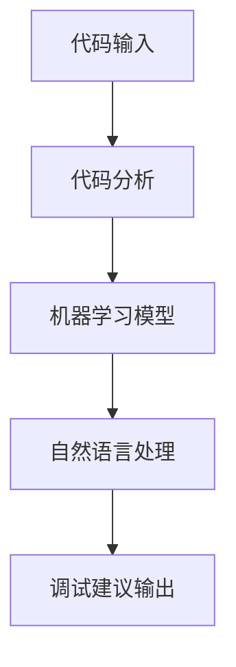

# AI辅助代码调试:快速定位与修复bug

> 关键词：AI辅助调试、代码调试、bug定位、bug修复、智能编程

> 摘要：本文围绕AI辅助代码调试展开，深入探讨其背景、核心概念、算法原理、数学模型等内容。详细阐述了如何利用AI技术快速定位和修复代码中的bug，通过项目实战案例展示具体操作过程，分析其实际应用场景。同时，推荐了相关的学习资源、开发工具框架以及论文著作，最后总结了该领域的未来发展趋势与挑战，并提供常见问题解答和参考资料，旨在为开发者在代码调试过程中利用AI技术提供全面且深入的指导。

## 1. 背景介绍 
### 1.1 目的和范围
随着软件系统的日益复杂，代码量不断增加，代码中出现bug的概率也随之上升。传统的代码调试方法往往效率低下，需要开发者花费大量的时间和精力去定位和修复bug。AI辅助代码调试技术的出现，为解决这一问题提供了新的思路和方法。本文的目的在于全面介绍AI辅助代码调试技术，包括其核心概念、算法原理、实际应用等方面，帮助开发者了解和掌握如何利用AI技术快速定位和修复代码中的bug。范围涵盖了常见的编程语言和开发环境，旨在为广大开发者提供实用的指导。

### 1.2 预期读者
本文预期读者主要包括软件开发者、程序员、软件测试人员、软件架构师等从事软件开发相关工作的人员。同时，对AI技术在软件开发领域应用感兴趣的研究人员和学生也可以从本文中获取有价值的信息。

### 1.3 文档结构概述
本文将按照以下结构进行阐述：首先介绍AI辅助代码调试的背景信息，包括目的、预期读者和文档结构概述等；接着讲解核心概念与联系，通过文本示意图和Mermaid流程图展示其原理和架构；然后详细阐述核心算法原理和具体操作步骤，并用Python源代码进行说明；再介绍数学模型和公式，并举例说明；之后通过项目实战展示代码实际案例和详细解释说明；分析实际应用场景；推荐相关的工具和资源；总结未来发展趋势与挑战；提供常见问题与解答；最后列出扩展阅读和参考资料。

### 1.4 术语表
#### 1.4.1 核心术语定义
- **AI辅助代码调试**：利用人工智能技术，如机器学习、自然语言处理等，辅助开发者进行代码调试的过程，包括定位代码中的bug和提供修复建议。
- **bug**：代码中存在的错误或缺陷，会导致程序运行出现异常或产生不符合预期的结果。
- **调试**：查找和修复代码中bug的过程。
- **代码分析**：对代码进行静态或动态的分析，以发现潜在的问题和缺陷。

#### 1.4.2 相关概念解释
- **机器学习**：一门多领域交叉学科，涉及概率论、统计学、逼近论、凸分析、算法复杂度理论等多门学科。它专门研究计算机怎样模拟或实现人类的学习行为，以获取新的知识或技能，重新组织已有的知识结构使之不断改善自身的性能。在AI辅助代码调试中，机器学习可以用于分析代码模式，预测bug的可能位置。
- **自然语言处理**：计算机科学领域与人工智能领域中的一个重要方向。它研究能实现人与计算机之间用自然语言进行有效通信的各种理论和方法。在AI辅助代码调试中，自然语言处理可以用于理解开发者的问题描述，生成自然语言形式的调试建议。

#### 1.4.3 缩略词列表
- **IDE**：Integrated Development Environment，集成开发环境。
- **ML**：Machine Learning，机器学习。
- **NLP**：Natural Language Processing，自然语言处理。

## 2. 核心概念与联系 

### 核心概念原理
AI辅助代码调试的核心原理是利用人工智能技术对代码进行分析和理解，从而快速定位和修复bug。主要涉及以下几个方面：

- **代码分析**：通过静态分析和动态分析技术，对代码的结构、语法、语义等进行深入分析，发现潜在的问题和缺陷。静态分析不执行代码，而是通过对代码的文本进行分析来发现问题；动态分析则在代码运行过程中进行分析，观察程序的行为和状态。
- **机器学习模型**：利用机器学习算法对大量的代码数据和bug数据进行训练，建立模型来预测bug的可能位置和类型。常见的机器学习算法包括决策树、支持向量机、神经网络等。
- **自然语言处理**：将开发者的问题描述转化为计算机可以理解的形式，同时生成自然语言形式的调试建议，方便开发者理解和操作。

### 架构的文本示意图
AI辅助代码调试系统主要由以下几个部分组成：

- **代码输入模块**：接收开发者输入的代码。
- **代码分析模块**：对输入的代码进行静态和动态分析，提取代码的特征和信息。
- **机器学习模型模块**：利用训练好的机器学习模型对代码进行预测，判断是否存在bug以及bug的可能位置和类型。
- **自然语言处理模块**：将开发者的问题描述进行处理，同时生成自然语言形式的调试建议。
- **调试建议输出模块**：将调试建议输出给开发者。

### Mermaid流程图


## 3. 核心算法原理 & 具体操作步骤 

### 核心算法原理
在AI辅助代码调试中，常用的核心算法包括机器学习算法和自然语言处理算法。下面以决策树算法为例，介绍其原理和在代码调试中的应用。

决策树是一种基于树结构进行决策的算法，每个内部节点是一个属性上的测试，每个分支是一个测试输出，每个叶节点是一个类别或值。在代码调试中，决策树可以根据代码的特征（如变量类型、函数调用次数等）来预测bug的可能位置和类型。

### Python源代码实现
```python
import numpy as np
from sklearn.tree import DecisionTreeClassifier
from sklearn.model_selection import train_test_split
from sklearn.metrics import accuracy_score

# 示例代码特征数据
X = np.array([[1, 2, 3], [4, 5, 6], [7, 8, 9], [10, 11, 12]])
# 示例bug标签数据
y = np.array([0, 1, 0, 1])

# 划分训练集和测试集
X_train, X_test, y_train, y_test = train_test_split(X, y, test_size=0.2, random_state=42)

# 创建决策树分类器
clf = DecisionTreeClassifier()

# 训练模型
clf.fit(X_train, y_train)

# 预测
y_pred = clf.predict(X_test)

# 计算准确率
accuracy = accuracy_score(y_test, y_pred)
print(f"Accuracy: {accuracy}")
```

### 具体操作步骤
1. **数据收集**：收集大量的代码数据和对应的bug数据，作为训练模型的样本。
2. **特征提取**：从代码数据中提取有用的特征，如变量类型、函数调用次数、代码行数等。
3. **数据预处理**：对提取的特征数据进行预处理，如归一化、编码等，以便于模型训练。
4. **模型训练**：使用机器学习算法对预处理后的数据进行训练，建立模型。
5. **模型评估**：使用测试数据对训练好的模型进行评估，计算模型的准确率、召回率等指标。
6. **调试应用**：将训练好的模型应用到实际的代码调试中，根据模型的预测结果快速定位和修复bug。

## 4. 数学模型和公式 & 详细讲解 & 举例说明 

### 决策树算法的数学模型
决策树算法的核心是通过计算信息增益来选择最优的划分属性。信息增益的计算公式如下：

$$
Gain(D, a) = Ent(D) - \sum_{v=1}^{V} \frac{|D^v|}{|D|} Ent(D^v)
$$

其中，$D$ 表示数据集，$a$ 表示属性，$V$ 表示属性 $a$ 的取值个数，$D^v$ 表示属性 $a$ 取值为 $v$ 的样本子集，$Ent(D)$ 表示数据集 $D$ 的信息熵，计算公式如下：

$$
Ent(D) = - \sum_{k=1}^{K} p_k \log_2 p_k
$$

其中，$K$ 表示数据集 $D$ 中类别个数，$p_k$ 表示第 $k$ 个类别的样本占总样本的比例。

### 详细讲解
信息熵 $Ent(D)$ 表示数据集 $D$ 的不确定性，信息熵越大，数据集的不确定性越高。信息增益 $Gain(D, a)$ 表示使用属性 $a$ 对数据集 $D$ 进行划分后，数据集的不确定性减少的程度。在决策树算法中，选择信息增益最大的属性作为当前节点的划分属性，这样可以使得划分后的子集的不确定性最小。

### 举例说明
假设有一个数据集 $D$ 包含 10 个样本，其中 6 个样本属于类别 0，4 个样本属于类别 1。则数据集 $D$ 的信息熵为：

$$
Ent(D) = - \frac{6}{10} \log_2 \frac{6}{10} - \frac{4}{10} \log_2 \frac{4}{10} \approx 0.971
$$

假设有一个属性 $a$，它有两个取值 $v_1$ 和 $v_2$，其中 $D^{v_1}$ 包含 4 个样本，3 个属于类别 0，1 个属于类别 1；$D^{v_2}$ 包含 6 个样本，3 个属于类别 0，3 个属于类别 1。则 $D^{v_1}$ 和 $D^{v_2}$ 的信息熵分别为：

$$
Ent(D^{v_1}) = - \frac{3}{4} \log_2 \frac{3}{4} - \frac{1}{4} \log_2 \frac{1}{4} \approx 0.811
$$

$$
Ent(D^{v_2}) = - \frac{3}{6} \log_2 \frac{3}{6} - \frac{3}{6} \log_2 \frac{3}{6} = 1
$$

使用属性 $a$ 对数据集 $D$ 进行划分后的信息增益为：

$$
Gain(D, a) = Ent(D) - \frac{4}{10} Ent(D^{v_1}) - \frac{6}{10} Ent(D^{v_2}) \approx 0.971 - \frac{4}{10} \times 0.811 - \frac{6}{10} \times 1 \approx 0.146
$$

## 5. 项目实战：代码实际案例和详细解释说明 

### 5.1  开发环境搭建
本次项目实战使用Python语言进行开发，开发环境搭建步骤如下：

1. **安装Python**：从Python官方网站（https://www.python.org/downloads/）下载并安装Python 3.x版本。
2. **安装必要的库**：使用pip命令安装必要的库，如numpy、pandas、scikit-learn等。
```bash
pip install numpy pandas scikit-learn
```

### 5.2  源代码详细实现和代码解读
下面以一个简单的Python代码调试为例，展示AI辅助代码调试的具体实现过程。

```python
import numpy as np
from sklearn.tree import DecisionTreeClassifier
from sklearn.model_selection import train_test_split
from sklearn.metrics import accuracy_score

# 示例代码特征数据
X = np.array([[1, 2, 3], [4, 5, 6], [7, 8, 9], [10, 11, 12], [13, 14, 15], [16, 17, 18]])
# 示例bug标签数据
y = np.array([0, 1, 0, 1, 0, 1])

# 划分训练集和测试集
X_train, X_test, y_train, y_test = train_test_split(X, y, test_size=0.2, random_state=42)

# 创建决策树分类器
clf = DecisionTreeClassifier()

# 训练模型
clf.fit(X_train, y_train)

# 预测
y_pred = clf.predict(X_test)

# 计算准确率
accuracy = accuracy_score(y_test, y_pred)
print(f"Accuracy: {accuracy}")

# 模拟调试过程，假设输入新的代码特征数据
new_X = np.array([[19, 20, 21]])
new_pred = clf.predict(new_X)
print(f"Predicted bug label for new data: {new_pred[0]}")
```

### 代码解读与分析
1. **数据准备**：定义示例代码特征数据 $X$ 和对应的bug标签数据 $y$。
2. **数据划分**：使用 `train_test_split` 函数将数据划分为训练集和测试集。
3. **模型创建**：创建决策树分类器 `DecisionTreeClassifier`。
4. **模型训练**：使用训练集数据对模型进行训练，调用 `fit` 方法。
5. **模型预测**：使用测试集数据对模型进行预测，调用 `predict` 方法。
6. **模型评估**：计算模型的准确率，使用 `accuracy_score` 函数。
7. **模拟调试**：输入新的代码特征数据，使用训练好的模型进行预测，得到预测的bug标签。

## 6. 实际应用场景 
AI辅助代码调试技术在以下实际应用场景中具有重要的作用：

- **软件开发团队**：在软件开发过程中，团队成员可能会引入各种bug。AI辅助代码调试可以帮助团队成员快速定位和修复bug，提高开发效率，减少开发周期。
- **开源项目**：开源项目通常有大量的贡献者，代码的质量和一致性难以保证。AI辅助代码调试可以帮助开源项目的维护者快速发现和解决问题，提高项目的稳定性和可靠性。
- **教育领域**：在编程教学中，学生可能会遇到各种编程错误。AI辅助代码调试可以帮助学生快速定位和解决问题，提高学习效率，增强学习信心。
- **自动化测试**：在自动化测试过程中，AI辅助代码调试可以帮助测试人员快速定位和修复测试中发现的bug，提高测试效率和质量。

## 7. 工具和资源推荐
### 7.1 学习资源推荐
#### 7.1.1 书籍推荐
- 《Python机器学习》：介绍了Python语言在机器学习领域的应用，包括各种机器学习算法的原理和实现。
- 《自然语言处理入门》：系统地介绍了自然语言处理的基本概念、方法和技术。
- 《代码大全》：一本关于软件开发的经典书籍，涵盖了代码编写、调试、测试等方面的内容。

#### 7.1.2 在线课程
- Coursera上的“机器学习”课程：由斯坦福大学教授Andrew Ng主讲，是机器学习领域的经典课程。
- edX上的“自然语言处理”课程：介绍了自然语言处理的基本概念和技术。
- 中国大学MOOC上的“Python编程基础”课程：适合初学者学习Python语言。

#### 7.1.3 技术博客和网站
- 博客园：一个技术博客平台，有很多开发者分享的技术文章。
- 开源中国：提供了丰富的开源项目和技术资讯。
- Stack Overflow：一个技术问答社区，开发者可以在这里提问和交流。

### 7.2 开发工具框架推荐
#### 7.2.1 IDE和编辑器
- PyCharm：一款专门为Python开发设计的集成开发环境，具有强大的代码编辑、调试、分析等功能。
- Visual Studio Code：一款轻量级的代码编辑器，支持多种编程语言，有丰富的插件扩展功能。
- Jupyter Notebook：一个交互式的开发环境，适合进行数据分析和机器学习实验。

#### 7.2.2 调试和性能分析工具
- pdb：Python自带的调试器，可以帮助开发者进行代码调试。
- cProfile：Python的性能分析工具，可以分析代码的性能瓶颈。
- Py-Spy：一个用于Python代码的性能分析工具，可以实时查看代码的运行状态。

#### 7.2.3 相关框架和库
- scikit-learn：一个简单易用的机器学习库，提供了各种机器学习算法的实现。
- NLTK：一个自然语言处理库，提供了丰富的自然语言处理工具和数据集。
- TensorFlow：一个开源的机器学习框架，广泛应用于深度学习领域。

### 7.3 相关论文著作推荐
#### 7.3.1 经典论文
- “A Survey on Software Debugging”：对软件调试技术进行了全面的综述。
- “Machine Learning for Software Defect Prediction: A Systematic Literature Review”：对机器学习在软件缺陷预测中的应用进行了系统的文献综述。
- “Natural Language Processing for Software Engineering: A Survey”：对自然语言处理在软件工程中的应用进行了综述。

#### 7.3.2 最新研究成果
- 关注顶级学术会议如ICSE（International Conference on Software Engineering）、FSE（Foundations of Software Engineering）等上的最新研究成果。
- 关注顶级学术期刊如ACM Transactions on Software Engineering and Methodology（TOSEM）、IEEE Transactions on Software Engineering（TSE）等上的最新研究论文。

#### 7.3.3 应用案例分析
- 一些开源项目的官方文档和技术博客中会分享其在代码调试过程中使用AI技术的应用案例，可以从中学习和借鉴。

## 8. 总结：未来发展趋势与挑战
### 未来发展趋势
- **更智能的调试建议**：随着AI技术的不断发展，AI辅助代码调试系统将能够提供更智能、更准确的调试建议，帮助开发者更快地定位和修复bug。
- **与开发工具的深度集成**：AI辅助代码调试功能将与各种开发工具（如IDE、版本控制系统等）深度集成，提供无缝的调试体验。
- **跨语言和跨平台支持**：未来的AI辅助代码调试系统将支持更多的编程语言和开发平台，满足不同开发者的需求。
- **自动化修复**：除了提供调试建议，AI辅助代码调试系统还将具备自动化修复代码bug的能力，进一步提高开发效率。

### 挑战
- **数据质量和标注问题**：AI模型的训练需要大量高质量的数据，而代码数据的标注是一个耗时耗力的过程，如何保证数据的质量和标注的准确性是一个挑战。
- **模型的可解释性**：一些复杂的AI模型（如深度学习模型）的决策过程往往难以解释，开发者难以理解模型为什么会给出这样的调试建议，这影响了开发者对AI辅助代码调试系统的信任。
- **适应性和泛化能力**：不同的软件开发项目和代码风格可能存在很大差异，如何提高AI辅助代码调试系统的适应性和泛化能力，使其能够在不同的场景下都能有效工作，是一个需要解决的问题。

## 9. 附录：常见问题与解答
### 1. AI辅助代码调试系统的准确率有多高？
AI辅助代码调试系统的准确率受到多种因素的影响，如数据质量、模型选择、特征提取等。一般来说，在经过充分训练和优化的情况下，准确率可以达到较高的水平，但具体的准确率会因不同的应用场景和数据集而有所差异。

### 2. AI辅助代码调试系统能否完全替代开发者进行代码调试？
目前的AI辅助代码调试系统还不能完全替代开发者进行代码调试。虽然AI技术可以提供一些有用的调试建议和帮助，但代码调试过程中还需要开发者的经验、判断力和创造力。AI辅助代码调试系统更多的是作为开发者的辅助工具，提高调试效率。

### 3. 使用AI辅助代码调试系统需要具备哪些技术基础？
使用AI辅助代码调试系统需要具备一定的编程基础，熟悉至少一种编程语言（如Python）。同时，了解一些机器学习和自然语言处理的基本概念和方法会有助于更好地理解和使用该系统。

### 4. 如何选择适合的AI辅助代码调试工具？
选择适合的AI辅助代码调试工具需要考虑多个因素，如工具的功能、易用性、与现有开发环境的兼容性、社区支持等。可以根据自己的需求和实际情况进行选择，并参考其他开发者的使用经验和评价。

## 10. 扩展阅读 & 参考资料
### 扩展阅读
- 《人工智能：一种现代的方法》：全面介绍了人工智能的基本概念、方法和技术。
- 《Python数据科学手册》：介绍了Python在数据科学领域的应用，包括数据处理、数据分析、机器学习等方面。
- 《软件调试的艺术》：深入探讨了软件调试的方法和技巧。

### 参考资料
- 各开源项目的官方文档和技术博客。
- 相关学术会议和期刊上的研究论文。
- 在线技术论坛和社区上的讨论和分享。