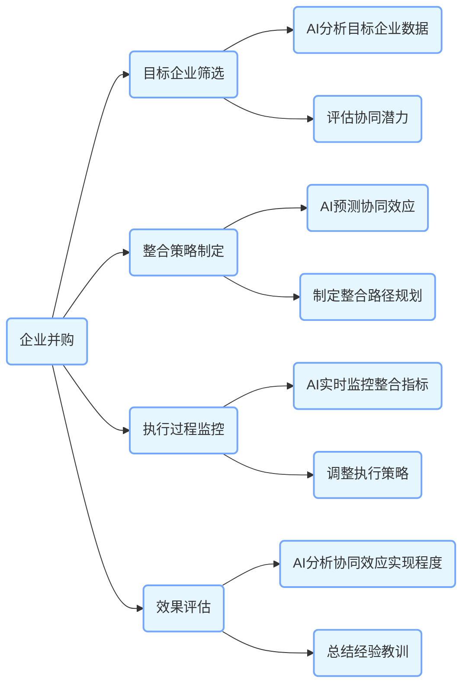

# AI辅助企业并购协同效应实现：整合路径规划与执行

> 关键词：AI、企业并购、协同效应、整合路径规划、执行策略

> 摘要：本文聚焦于AI在辅助企业并购协同效应实现过程中的重要作用，深入探讨整合路径规划与执行策略。随着企业并购活动的日益频繁，协同效应的实现成为关键挑战。AI凭借其强大的数据处理、分析和预测能力，为企业在并购整合中提供了全新的思路和方法。文章首先介绍了企业并购协同效应及AI应用的背景，阐述核心概念与联系，详细讲解相关算法原理与操作步骤，通过数学模型和公式进行理论支持，并结合实际项目案例进行代码实现与分析。同时，探讨了AI在企业并购整合中的实际应用场景，推荐了相关学习资源、开发工具和论文著作。最后，总结了未来发展趋势与挑战，为企业利用AI实现并购协同效应提供全面的参考和指导。

## 1. 背景介绍 
### 1.1 目的和范围
企业并购作为一种重要的资本运作方式，旨在通过整合资源、扩大市场份额、实现规模经济等途径提升企业的竞争力和价值。然而，并购过程中协同效应的实现并非易事，涉及到战略、财务、人力资源、文化等多个方面的整合。本文章的目的在于探讨如何利用AI技术辅助企业更好地规划和执行并购整合路径，以实现协同效应的最大化。

范围涵盖了AI在企业并购整合各个阶段的应用，包括目标企业筛选、整合策略制定、执行过程监控以及效果评估等环节。通过对相关理论和实践的研究，为企业提供具有可操作性的方法和建议。

### 1.2 预期读者
本文预期读者包括企业高管、并购从业者、投资银行家、管理咨询顾问、研究学者以及对AI和企业并购领域感兴趣的专业人士。对于企业管理者，本文可提供实用的决策参考，帮助他们更好地规划和执行并购整合战略；对于研究人员，可作为进一步深入研究的基础；对于从业者，可提供实践操作的指导和借鉴。

### 1.3 文档结构概述
本文共分为十个部分。第一部分介绍背景，包括目的、范围、预期读者和文档结构概述，以及相关术语的定义和解释。第二部分阐述核心概念与联系，通过文本示意图和Mermaid流程图展示AI、企业并购协同效应、整合路径规划与执行之间的关系。第三部分详细讲解核心算法原理，并给出Python源代码示例。第四部分介绍数学模型和公式，通过具体例子进行详细说明。第五部分是项目实战，包括开发环境搭建、源代码实现与解读以及代码分析。第六部分探讨实际应用场景。第七部分推荐相关的学习资源、开发工具和论文著作。第八部分总结未来发展趋势与挑战。第九部分为附录，解答常见问题。第十部分提供扩展阅读和参考资料。

### 1.4 术语表
#### 1.4.1 核心术语定义
- **企业并购**：指企业通过收购、合并等方式取得其他企业的控制权或全部资产，实现企业规模扩张和战略目标的行为。
- **协同效应**：指企业并购后，通过整合资源、优化流程等方式，使企业整体价值大于并购前各企业价值之和的效应。协同效应包括经营协同、财务协同、管理协同等多个方面。
- **整合路径规划**：指在企业并购后，为实现协同效应，对并购双方的业务、资产、人员、文化等进行整合的具体步骤和方法的规划。
- **AI（人工智能）**：指计算机系统能够执行通常需要人类智能才能完成的任务，如学习、推理、决策、感知等。在本文中，主要指利用机器学习、深度学习、自然语言处理等技术辅助企业并购整合。

#### 1.4.2 相关概念解释
- **机器学习**：是AI的一个重要分支，通过让计算机从数据中学习模式和规律，从而实现预测、分类、聚类等任务。在企业并购中，可用于分析历史并购数据，预测协同效应的实现程度。
- **深度学习**：是一种基于人工神经网络的机器学习方法，能够自动从大量数据中提取复杂的特征和模式。在企业并购整合中，可用于处理非结构化数据，如文本、图像等，帮助企业更好地理解目标企业的文化、市场声誉等信息。
- **自然语言处理**：是AI的一个领域，主要研究如何让计算机理解和处理人类语言。在企业并购中，可用于分析新闻报道、社交媒体评论等文本信息，了解市场对并购的反应和目标企业的公众形象。

#### 1.4.3 缩略词列表
- **AI**：Artificial Intelligence（人工智能）
- **ML**：Machine Learning（机器学习）
- **DL**：Deep Learning（深度学习）
- **NLP**：Natural Language Processing（自然语言处理）

## 2. 核心概念与联系 

### 核心概念原理
企业并购协同效应的实现是一个复杂的过程，涉及到多个因素的相互作用。AI在其中的作用主要体现在以下几个方面：

- **数据驱动决策**：AI可以处理和分析大量的结构化和非结构化数据，包括财务报表、市场数据、行业报告、新闻资讯等，为企业提供全面、准确的信息支持，帮助企业做出更明智的并购决策。
- **预测和规划**：通过机器学习和深度学习算法，AI可以对并购后的协同效应进行预测，为整合路径规划提供依据。同时，AI还可以根据预测结果，制定最优的整合策略和执行计划。
- **过程监控和优化**：在整合执行过程中，AI可以实时监控各项指标的变化，及时发现问题并提供解决方案，确保整合过程按计划进行，实现协同效应的最大化。

### 架构的文本示意图
```plaintext
企业并购
|
|-- 目标企业筛选
|   |-- AI分析目标企业数据（财务、市场、技术等）
|   |-- 评估目标企业与并购方的协同潜力
|
|-- 整合策略制定
|   |-- AI预测协同效应（经营、财务、管理等）
|   |-- 基于预测结果制定整合路径规划
|
|-- 执行过程监控
|   |-- AI实时监控整合指标（绩效、文化融合、员工满意度等）
|   |-- 根据监控结果调整执行策略
|
|-- 效果评估
|   |-- AI分析协同效应实现程度
|   |-- 总结经验教训，为未来并购提供参考
```

### Mermaid流程图


## 3. 核心算法原理 & 具体操作步骤 

### 核心算法原理
在企业并购协同效应预测和整合路径规划中，常用的AI算法包括线性回归、逻辑回归、决策树、随机森林、神经网络等。下面以线性回归为例，详细介绍其原理和应用。

线性回归是一种用于建立自变量和因变量之间线性关系的统计模型。假设我们有一组自变量 $X = [x_1, x_2, ..., x_n]$ 和一个因变量 $y$，线性回归模型可以表示为：

$y = \beta_0 + \beta_1x_1 + \beta_2x_2 + ... + \beta_nx_n + \epsilon$

其中，$\beta_0$ 是截距，$\beta_1, \beta_2, ..., \beta_n$ 是回归系数，$\epsilon$ 是误差项。线性回归的目标是通过最小化误差项的平方和来估计回归系数，即：

$min \sum_{i=1}^{m}(y_i - (\beta_0 + \beta_1x_{i1} + \beta_2x_{i2} + ... + \beta_nx_{in}))^2$

### 具体操作步骤
1. **数据收集**：收集与企业并购协同效应相关的数据，包括财务数据、市场数据、行业数据等。
2. **数据预处理**：对收集到的数据进行清洗、转换和标准化处理，以提高模型的准确性和稳定性。
3. **特征选择**：从预处理后的数据中选择与协同效应相关性较高的特征作为自变量。
4. **模型训练**：使用训练数据对线性回归模型进行训练，估计回归系数。
5. **模型评估**：使用测试数据对训练好的模型进行评估，计算模型的准确率、均方误差等指标。
6. **预测和决策**：使用训练好的模型对新的企业并购案例进行协同效应预测，并根据预测结果制定整合路径规划和决策。

### Python源代码示例
```python
import numpy as np
from sklearn.linear_model import LinearRegression
from sklearn.model_selection import train_test_split
from sklearn.metrics import mean_squared_error

# 生成示例数据
np.random.seed(0)
X = np.random.rand(100, 3)  # 自变量
y = 2 * X[:, 0] + 3 * X[:, 1] + 4 * X[:, 2] + np.random.randn(100)  # 因变量

# 划分训练集和测试集
X_train, X_test, y_train, y_test = train_test_split(X, y, test_size=0.2, random_state=42)

# 创建线性回归模型
model = LinearRegression()

# 模型训练
model.fit(X_train, y_train)

# 模型预测
y_pred = model.predict(X_test)

# 模型评估
mse = mean_squared_error(y_test, y_pred)
print(f"均方误差: {mse}")

# 输出回归系数
print(f"截距: {model.intercept_}")
print(f"回归系数: {model.coef_}")
```

## 4. 数学模型和公式 & 详细讲解 & 举例说明 

### 数学模型和公式
在企业并购协同效应预测中，除了线性回归模型，还可以使用其他数学模型，如逻辑回归模型、决策树模型等。下面以逻辑回归模型为例，介绍其数学原理和应用。

逻辑回归是一种用于二分类问题的统计模型，其基本原理是通过逻辑函数将线性回归的输出转换为概率值。逻辑函数的表达式为：

$\sigma(z) = \frac{1}{1 + e^{-z}}$

其中，$z$ 是线性回归的输出，$\sigma(z)$ 是概率值，取值范围在 $[0, 1]$ 之间。逻辑回归模型的表达式为：

$P(y = 1|X) = \sigma(\beta_0 + \beta_1x_1 + \beta_2x_2 + ... + \beta_nx_n)$

其中，$P(y = 1|X)$ 表示在给定自变量 $X$ 的情况下，因变量 $y$ 取值为 1 的概率。逻辑回归的目标是通过最大化似然函数来估计回归系数，即：

$max \prod_{i=1}^{m}P(y_i|X_i)^{y_i}(1 - P(y_i|X_i))^{1 - y_i}$

### 详细讲解
逻辑回归模型适用于预测企业并购后是否能够实现协同效应的问题。在实际应用中，我们可以将协同效应的实现情况定义为二分类变量，如“实现协同效应”（$y = 1$）和“未实现协同效应”（$y = 0$）。通过收集历史企业并购数据，我们可以使用逻辑回归模型来预测新的企业并购案例是否能够实现协同效应。

### 举例说明
假设我们有一组企业并购数据，包括企业规模、行业相关性、财务状况等自变量，以及是否实现协同效应的因变量。我们可以使用逻辑回归模型来预测新的企业并购案例是否能够实现协同效应。

```python
import numpy as np
from sklearn.linear_model import LogisticRegression
from sklearn.model_selection import train_test_split
from sklearn.metrics import accuracy_score

# 生成示例数据
np.random.seed(0)
X = np.random.rand(100, 3)  # 自变量
y = (2 * X[:, 0] + 3 * X[:, 1] + 4 * X[:, 2] > 3).astype(int)  # 因变量

# 划分训练集和测试集
X_train, X_test, y_train, y_test = train_test_split(X, y, test_size=0.2, random_state=42)

# 创建逻辑回归模型
model = LogisticRegression()

# 模型训练
model.fit(X_train, y_train)

# 模型预测
y_pred = model.predict(X_test)

# 模型评估
accuracy = accuracy_score(y_test, y_pred)
print(f"准确率: {accuracy}")

# 输出回归系数
print(f"截距: {model.intercept_}")
print(f"回归系数: {model.coef_}")
```

## 5. 项目实战：代码实际案例和详细解释说明 

### 5.1  开发环境搭建
为了实现AI辅助企业并购协同效应的整合路径规划与执行，我们需要搭建相应的开发环境。以下是具体步骤：

1. **安装Python**：Python是一种广泛使用的编程语言，具有丰富的科学计算和机器学习库。可以从Python官方网站（https://www.python.org/downloads/）下载并安装Python 3.x版本。
2. **安装开发工具**：推荐使用Anaconda作为Python的开发环境，它集成了许多常用的科学计算和机器学习库，方便我们进行开发和调试。可以从Anaconda官方网站（https://www.anaconda.com/products/individual）下载并安装Anaconda。
3. **安装必要的库**：在Anaconda环境中，使用以下命令安装必要的库：
```bash
pip install numpy pandas scikit-learn matplotlib seaborn
```

### 5.2  源代码详细实现和代码解读
以下是一个完整的项目实战案例，使用逻辑回归模型预测企业并购后是否能够实现协同效应，并根据预测结果制定整合路径规划。

```python
import numpy as np
import pandas as pd
from sklearn.linear_model import LogisticRegression
from sklearn.model_selection import train_test_split
from sklearn.metrics import accuracy_score

# 加载数据
data = pd.read_csv('merger_data.csv')

# 数据预处理
X = data.drop('synergy_achieved', axis=1)  # 自变量
y = data['synergy_achieved']  # 因变量

# 划分训练集和测试集
X_train, X_test, y_train, y_test = train_test_split(X, y, test_size=0.2, random_state=42)

# 创建逻辑回归模型
model = LogisticRegression()

# 模型训练
model.fit(X_train, y_train)

# 模型预测
y_pred = model.predict(X_test)

# 模型评估
accuracy = accuracy_score(y_test, y_pred)
print(f"准确率: {accuracy}")

# 根据预测结果制定整合路径规划
if accuracy > 0.8:
    print("协同效应实现概率较高，可采取激进的整合策略，如快速整合业务、优化资源配置等。")
elif accuracy > 0.6:
    print("协同效应实现概率中等，可采取稳健的整合策略，如逐步整合业务、加强沟通协调等。")
else:
    print("协同效应实现概率较低，需谨慎考虑整合策略，如重新评估目标企业、调整整合计划等。")
```

### 代码解读与分析
1. **数据加载**：使用 `pandas` 库的 `read_csv` 函数加载企业并购数据。
2. **数据预处理**：将数据分为自变量 `X` 和因变量 `y`，其中 `synergy_achieved` 表示是否实现协同效应。
3. **划分训练集和测试集**：使用 `train_test_split` 函数将数据划分为训练集和测试集，测试集占比为 20%。
4. **创建逻辑回归模型**：使用 `LogisticRegression` 类创建逻辑回归模型。
5. **模型训练**：使用 `fit` 方法对模型进行训练。
6. **模型预测**：使用 `predict` 方法对测试集进行预测。
7. **模型评估**：使用 `accuracy_score` 函数计算模型的准确率。
8. **制定整合路径规划**：根据模型的准确率，制定不同的整合策略。

## 6. 实际应用场景 
### 目标企业筛选
在企业并购的前期阶段，AI可以帮助企业筛选潜在的目标企业。通过分析大量的公开数据，如财务报表、行业报告、新闻资讯等，AI可以评估目标企业的财务状况、市场竞争力、技术实力等因素，预测目标企业与并购方的协同潜力。例如，AI可以通过分析目标企业的产品线和市场份额，预测并购后是否能够实现经营协同效应，如扩大市场份额、降低成本等。

### 整合策略制定
在确定目标企业后，AI可以帮助企业制定整合策略。通过对历史并购数据的分析和机器学习算法的应用，AI可以预测并购后可能出现的问题和挑战，并提供相应的解决方案。例如，AI可以预测并购后文化融合的难度，并提供文化整合的策略和建议；可以预测财务协同效应的实现程度，并提供财务整合的方案和措施。

### 执行过程监控
在整合执行过程中，AI可以实时监控各项指标的变化，及时发现问题并提供解决方案。例如，AI可以通过分析企业的财务数据、运营数据、员工满意度等指标，监控整合的进度和效果；可以通过分析社交媒体评论、新闻报道等信息，了解市场对并购的反应和公众形象。如果发现问题，AI可以及时提醒企业管理者，并提供相应的调整策略和建议。

### 效果评估
在整合完成后，AI可以对协同效应的实现程度进行评估。通过对比并购前后的财务指标、市场份额、客户满意度等数据，AI可以分析协同效应的实现情况，并总结经验教训，为未来的并购提供参考。例如，AI可以分析并购后企业的盈利能力、资产回报率等指标，评估财务协同效应的实现程度；可以分析市场份额的变化、客户满意度的提升等情况，评估经营协同效应的实现程度。

## 7. 工具和资源推荐
### 7.1 学习资源推荐
#### 7.1.1 书籍推荐
- 《机器学习》（周志华著）：全面介绍了机器学习的基本概念、算法和应用，是机器学习领域的经典教材。
- 《深度学习》（Ian Goodfellow、Yoshua Bengio、Aaron Courville著）：深入介绍了深度学习的原理、算法和应用，是深度学习领域的权威著作。
- 《Python数据分析实战》（作者：[美] Wes McKinney）：详细介绍了Python在数据分析领域的应用，包括数据处理、数据可视化、机器学习等方面的内容。

#### 7.1.2 在线课程
- Coursera平台上的“机器学习”课程（Andrew Ng教授主讲）：该课程是机器学习领域的经典课程，全面介绍了机器学习的基本概念、算法和应用。
- edX平台上的“深度学习”课程（由多位知名学者和专家主讲）：该课程深入介绍了深度学习的原理、算法和应用，适合有一定机器学习基础的学习者。
- 阿里云天池平台上的“AI实战营”：该课程提供了丰富的AI实战项目和案例，帮助学习者提高AI应用能力。

#### 7.1.3 技术博客和网站
- Medium（https://medium.com/）：是一个技术博客平台，上面有许多关于AI、机器学习、深度学习等领域的优秀文章和技术分享。
- Kaggle（https://www.kaggle.com/）：是一个数据科学和机器学习竞赛平台，上面有许多优秀的数据集和竞赛项目，可以帮助学习者提高数据分析和机器学习能力。
- 机器之心（https://www.alldatasheet.com/）：是一个专注于AI领域的媒体平台，提供了最新的AI技术动态、研究成果和应用案例。

### 7.2 开发工具框架推荐
#### 7.2.1 IDE和编辑器
- PyCharm：是一款专业的Python集成开发环境，具有代码编辑、调试、自动补全、版本控制等功能，适合Python开发人员使用。
- Jupyter Notebook：是一个交互式的笔记本环境，支持Python、R等多种编程语言，适合数据科学家和机器学习工程师进行数据分析和模型开发。
- Visual Studio Code：是一款轻量级的代码编辑器，具有丰富的插件和扩展功能，支持多种编程语言，适合快速开发和调试。

#### 7.2.2 调试和性能分析工具
- PDB：是Python自带的调试工具，可以帮助开发人员在代码中设置断点、单步执行、查看变量值等，方便调试代码。
- cProfile：是Python自带的性能分析工具，可以帮助开发人员分析代码的性能瓶颈，找出耗时较长的函数和代码段。
- TensorBoard：是TensorFlow框架提供的可视化工具，可以帮助开发人员可视化模型的训练过程、参数变化等信息，方便调试和优化模型。

#### 7.2.3 相关框架和库
- Scikit-learn：是一个简单易用的机器学习库，提供了丰富的机器学习算法和工具，适合初学者和快速开发。
- TensorFlow：是一个开源的深度学习框架，由Google开发，具有强大的计算能力和灵活性，适合大规模深度学习模型的开发和训练。
- PyTorch：是一个开源的深度学习框架，由Facebook开发，具有简洁易用的API和动态计算图的特点，适合快速迭代和研究。

### 7.3 相关论文著作推荐
#### 7.3.1 经典论文
- “Gradient-Based Learning Applied to Document Recognition”（Yann LeCun、Léon Bottou、Yoshua Bengio、Patrick Haffner著）：该论文介绍了卷积神经网络（CNN）在手写字符识别中的应用，是深度学习领域的经典论文之一。
- “Long Short-Term Memory”（Sepp Hochreiter、Jürgen Schmidhuber著）：该论文介绍了长短期记忆网络（LSTM）的原理和应用，是循环神经网络（RNN）领域的经典论文之一。
- “Attention Is All You Need”（Ashish Vaswani、Noam Shazeer、Niki Parmar等著）：该论文介绍了Transformer模型的原理和应用，是自然语言处理领域的重要突破。

#### 7.3.2 最新研究成果
- 可以关注顶级学术会议和期刊的最新研究成果，如NeurIPS（神经信息处理系统大会）、ICML（国际机器学习会议）、CVPR（计算机视觉与模式识别会议）、JMLR（机器学习研究杂志）等。
- 可以关注知名研究机构和学者的最新研究动态，如Google Brain、OpenAI、李开复、周志华等。

#### 7.3.3 应用案例分析
- 可以参考一些企业的实际应用案例，了解AI在企业并购协同效应实现中的具体应用和效果。例如，IBM在企业并购中使用AI技术进行目标企业筛选和整合策略制定；谷歌在并购中使用AI技术进行文化融合和员工满意度提升。

## 8. 总结：未来发展趋势与挑战
### 未来发展趋势
- **AI技术的不断创新**：随着AI技术的不断发展，新的算法和模型将不断涌现，如强化学习、生成对抗网络等，这些技术将为企业并购协同效应的实现提供更强大的支持。
- **多技术融合**：AI将与物联网、大数据、区块链等技术深度融合，实现数据的实时采集、分析和共享，提高企业并购整合的效率和效果。
- **行业应用的拓展**：AI在企业并购领域的应用将不断拓展，不仅应用于传统的制造业、金融业等行业，还将应用于新兴的科技、医疗、教育等行业。
- **智能化决策**：AI将帮助企业实现智能化决策，通过对大量数据的分析和预测，为企业提供更准确、更科学的决策依据。

### 挑战
- **数据质量和安全问题**：AI的应用依赖于大量的数据，数据的质量和安全直接影响到AI模型的准确性和可靠性。因此，如何保证数据的质量和安全是企业面临的重要挑战之一。
- **人才短缺**：AI技术的应用需要专业的人才，包括数据科学家、机器学习工程师、AI专家等。目前，AI领域的人才短缺问题较为严重，企业需要加强人才培养和引进。
- **伦理和法律问题**：AI的应用涉及到伦理和法律问题，如数据隐私、算法偏见、责任认定等。企业需要遵守相关的伦理和法律规定，确保AI的应用合法、合规、合理。
- **文化整合难度**：企业并购后的文化整合是一个复杂的过程，AI虽然可以提供一些辅助手段，但无法完全解决文化差异和冲突问题。因此，如何实现文化的有效整合是企业面临的另一个重要挑战。

## 9. 附录：常见问题与解答
### 问题1：AI在企业并购中的应用是否会取代人类决策？
答：不会。AI在企业并购中的应用主要是提供数据支持和决策建议，帮助人类做出更明智的决策。但最终的决策仍然需要人类根据实际情况进行综合判断和权衡。

### 问题2：如何保证AI模型的准确性和可靠性？
答：可以从以下几个方面保证AI模型的准确性和可靠性：
- **数据质量**：确保数据的准确性、完整性和一致性，对数据进行清洗和预处理。
- **模型选择**：根据问题的特点和数据的类型选择合适的模型，如线性回归、逻辑回归、决策树等。
- **模型评估**：使用多种评估指标对模型进行评估，如准确率、均方误差、召回率等。
- **模型优化**：对模型进行优化，如调整模型参数、增加数据量、特征工程等。

### 问题3：AI在企业并购中的应用需要哪些技术和工具？
答：AI在企业并购中的应用需要以下技术和工具：
- **编程语言**：Python是最常用的编程语言，具有丰富的科学计算和机器学习库。
- **机器学习库**：Scikit-learn、TensorFlow、PyTorch等。
- **数据分析工具**：Pandas、NumPy、Matplotlib等。
- **开发环境**：PyCharm、Jupyter Notebook、Visual Studio Code等。

### 问题4：如何解决AI应用中的伦理和法律问题？
答：可以从以下几个方面解决AI应用中的伦理和法律问题：
- **制定伦理准则**：企业应制定AI应用的伦理准则，明确AI应用的边界和原则。
- **遵守法律法规**：企业应遵守相关的法律法规，如数据保护法、隐私法等。
- **加强监管和审计**：政府和监管机构应加强对AI应用的监管和审计，确保AI应用合法、合规、合理。
- **提高公众意识**：通过宣传和教育，提高公众对AI应用的认识和理解，增强公众的参与和监督意识。

## 10. 扩展阅读 & 参考资料
### 扩展阅读
- 《智能时代》（吴军著）：介绍了AI技术的发展历程、应用场景和未来趋势，对理解AI在企业并购中的应用具有重要的参考价值。
- 《未来简史：从智人到神人》（尤瓦尔·赫拉利著）：探讨了AI技术对人类社会和未来发展的影响，引发读者对AI应用的深入思考。
- 《创新者的窘境》（克莱顿·克里斯坦森著）：介绍了企业创新和变革的理论和实践，对企业在并购中如何实现协同效应和创新发展具有重要的启示作用。

### 参考资料
- 相关学术论文和研究报告，如IEEE Transactions on Neural Networks and Learning Systems、ACM Transactions on Intelligent Systems and Technology等期刊上的论文。
- 企业的年报、公告和新闻报道，如上市公司的年报、并购公告等。
- 行业协会和研究机构的研究报告，如麦肯锡、波士顿咨询等机构发布的关于企业并购和AI应用的研究报告。