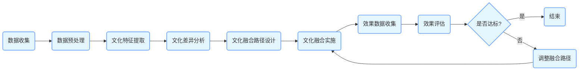

# AI辅助企业并购整合规划：文化融合路径设计与效果监测

> 关键词：AI、企业并购、整合规划、文化融合、效果监测

> 摘要：本文聚焦于AI在企业并购整合规划中对文化融合路径设计与效果监测的应用。首先介绍了企业并购文化融合的背景及相关概念，阐述了AI在其中的核心作用原理与架构。详细讲解了用于文化融合路径设计和效果监测的核心算法原理，包括Python代码实现。通过数学模型和公式深入分析了文化融合的量化关系。结合项目实战，展示了AI辅助下的文化融合路径设计与效果监测的代码案例及解读。探讨了实际应用场景，推荐了相关的学习资源、开发工具和论文著作。最后总结了未来发展趋势与挑战，解答常见问题并提供扩展阅读和参考资料，旨在为企业借助AI实现高效文化融合提供全面的技术与理论支持。

## 1. 背景介绍 
### 1.1 目的和范围
企业并购作为一种重要的资本运作方式，在全球经济发展中发挥着关键作用。然而，并购后的整合尤其是文化融合一直是企业面临的重大挑战。据相关研究表明，超过一半的并购失败案例都与文化融合不畅有关。本文章的目的在于探讨如何利用AI技术辅助企业进行并购整合规划中的文化融合路径设计与效果监测，以提高企业并购的成功率。范围涵盖了AI技术在文化融合中的应用原理、算法实现、实际案例分析以及未来发展趋势等方面。

### 1.2 预期读者
本文预期读者包括企业高管、并购项目负责人、企业战略规划师、AI技术研发人员、管理咨询顾问以及对企业并购和AI应用感兴趣的研究人员。

### 1.3 文档结构概述
本文首先介绍背景信息，包括目的、预期读者和文档结构。接着阐述核心概念与联系，展示AI在文化融合中的原理和架构。然后详细讲解核心算法原理和具体操作步骤，结合Python代码说明。通过数学模型和公式深入分析文化融合的量化关系。通过项目实战展示实际代码案例及解读。探讨实际应用场景，推荐相关学习资源、开发工具和论文著作。最后总结未来发展趋势与挑战，解答常见问题并提供扩展阅读和参考资料。

### 1.4 术语表
#### 1.4.1 核心术语定义
- **企业并购**：指企业之间的合并与收购行为，是企业通过产权交易获得其他企业的控制权，以实现自身战略目标的一种经济活动。
- **文化融合**：在企业并购过程中，将不同企业的文化相互吸收、相互渗透，形成一种既保留各自文化特色又具有新的共同价值观和行为准则的新文化的过程。
- **AI（人工智能）**：是研究、开发用于模拟、延伸和扩展人的智能的理论、方法、技术及应用系统的一门新的技术科学。

#### 1.4.2 相关概念解释
- **文化冲突**：在企业并购中，由于不同企业文化的差异而导致的价值观、行为方式、管理理念等方面的矛盾和冲突。
- **效果监测**：对企业并购文化融合过程中的各项指标进行跟踪、评估和分析，以判断文化融合的效果和进度。

#### 1.4.3 缩略词列表
- **AI**：Artificial Intelligence（人工智能）
- **NLP**：Natural Language Processing（自然语言处理）
- **ML**：Machine Learning（机器学习）

## 2. 核心概念与联系 

### 核心概念原理
AI辅助企业并购文化融合路径设计与效果监测的核心原理在于利用AI的数据分析、模式识别和预测能力，深入了解并购双方的企业文化，设计合理的文化融合路径，并实时监测融合效果。

AI通过收集企业内部的各种数据，如员工调查问卷、社交媒体言论、企业文档等，运用自然语言处理（NLP）技术对文本数据进行分析，提取文化相关的信息。机器学习（ML）算法则可以对这些信息进行分类、聚类和建模，识别出不同企业文化的特点和差异。

基于这些分析结果，AI可以为企业设计出个性化的文化融合路径。例如，根据文化差异的程度和类型，选择不同的融合模式，如吸纳式、渗透式或分离式。

在效果监测方面，AI可以建立实时监测模型，通过对企业绩效指标、员工满意度、团队协作效率等数据的持续分析，及时发现文化融合过程中出现的问题，并提供相应的改进建议。

### 架构示意图


这个架构图展示了AI辅助企业并购文化融合路径设计与效果监测的整个流程。从数据收集开始，经过一系列的分析和处理，设计出文化融合路径并实施。在实施过程中，持续收集效果数据进行评估，如果未达到预期效果，则调整融合路径，形成一个闭环的反馈机制。

## 3. 核心算法原理 & 具体操作步骤 

### 核心算法原理
#### 自然语言处理（NLP）用于文化特征提取
自然语言处理技术可以对企业内部的文本数据进行处理，提取与文化相关的关键词和主题。例如，使用词袋模型（Bag of Words）将文本转换为向量表示，然后通过TF-IDF（Term Frequency-Inverse Document Frequency）算法计算每个词的重要性。

以下是一个简单的Python代码示例，演示如何使用Python的`sklearn`库进行词袋模型和TF-IDF计算：
```python
from sklearn.feature_extraction.text import CountVectorizer, TfidfTransformer
import numpy as np

# 示例文本数据
documents = [
    "Our company values innovation and teamwork.",
    "We believe in customer satisfaction and quality.",
    "Teamwork is the key to our success."
]

# 词袋模型
count_vectorizer = CountVectorizer()
X_counts = count_vectorizer.fit_transform(documents)

# TF-IDF转换
tfidf_transformer = TfidfTransformer()
X_tfidf = tfidf_transformer.fit_transform(X_counts)

# 输出结果
feature_names = count_vectorizer.get_feature_names_out()
for doc_index in range(len(documents)):
    feature_index = X_tfidf[doc_index, :].nonzero()[1]
    tfidf_scores = zip(feature_index, [X_tfidf[doc_index, x] for x in feature_index])
    for w, s in [(feature_names[i], s) for (i, s) in tfidf_scores]:
        print(f"Document {doc_index}: {w} - TF-IDF score: {s}")
```
在这个代码中，首先使用`CountVectorizer`将文本数据转换为词袋模型的向量表示，然后使用`TfidfTransformer`计算每个词的TF-IDF分数。最后输出每个文档中每个词的TF-IDF分数，分数越高表示该词在该文档中越重要。

#### 机器学习算法用于文化差异分析
可以使用聚类算法（如K-Means）对不同企业的文化特征进行聚类分析，识别出不同的文化群体。以下是一个使用Python的`scikit-learn`库实现K-Means聚类的示例代码：
```python
from sklearn.cluster import KMeans
from sklearn.datasets import make_blobs
import matplotlib.pyplot as plt

# 生成示例数据
X, _ = make_blobs(n_samples=300, centers=4, cluster_std=0.60, random_state=0)

# K-Means聚类
kmeans = KMeans(n_clusters=4, random_state=0)
kmeans.fit(X)

# 绘制聚类结果
plt.scatter(X[:, 0], X[:, 1], c=kmeans.labels_, cmap='viridis')
plt.scatter(kmeans.cluster_centers_[:, 0], kmeans.cluster_centers_[:, 1], marker='x', s=200, linewidths=3, color='r')
plt.show()
```
在这个代码中，首先使用`make_blobs`生成示例数据，然后使用`KMeans`算法进行聚类分析。最后使用`matplotlib`库绘制聚类结果，不同颜色的点表示不同的聚类。

### 具体操作步骤
1. **数据收集**：收集企业内部的各种文本数据，如员工调查问卷、企业文档、社交媒体言论等。
2. **数据预处理**：对收集到的数据进行清洗、分词、去除停用词等预处理操作。
3. **文化特征提取**：使用NLP技术提取与文化相关的关键词和主题。
4. **文化差异分析**：使用机器学习算法对不同企业的文化特征进行聚类分析，识别出文化差异。
5. **文化融合路径设计**：根据文化差异的程度和类型，选择合适的融合模式，设计文化融合路径。
6. **文化融合实施**：按照设计好的文化融合路径进行实施。
7. **效果数据收集**：持续收集企业绩效指标、员工满意度、团队协作效率等效果数据。
8. **效果评估**：使用AI算法对效果数据进行分析和评估，判断文化融合的效果。
9. **调整融合路径**：如果效果未达到预期，根据评估结果调整文化融合路径。

## 4. 数学模型和公式 & 详细讲解 & 举例说明 

### 文化差异度量模型
可以使用余弦相似度来度量不同企业文化特征向量之间的差异。余弦相似度的计算公式为：
$$
\cos(\theta) = \frac{\mathbf{A} \cdot \mathbf{B}}{\|\mathbf{A}\| \|\mathbf{B}\|}
$$
其中，$\mathbf{A}$ 和 $\mathbf{B}$ 分别表示两个企业文化特征向量，$\cdot$ 表示向量的点积，$\|\mathbf{A}\|$ 和 $\|\mathbf{B}\|$ 分别表示向量的模。

余弦相似度的值介于 -1 到 1 之间，值越接近 1 表示两个向量越相似，即文化差异越小；值越接近 -1 表示两个向量越不相似，即文化差异越大。

### 详细讲解
假设有两个企业文化特征向量 $\mathbf{A} = [a_1, a_2, \cdots, a_n]$ 和 $\mathbf{B} = [b_1, b_2, \cdots, b_n]$，则它们的点积为：
$$
\mathbf{A} \cdot \mathbf{B} = a_1b_1 + a_2b_2 + \cdots + a_nb_n
$$
向量 $\mathbf{A}$ 的模为：
$$
\|\mathbf{A}\| = \sqrt{a_1^2 + a_2^2 + \cdots + a_n^2}
$$
向量 $\mathbf{B}$ 的模为：
$$
\|\mathbf{B}\| = \sqrt{b_1^2 + b_2^2 + \cdots + b_n^2}
$$
将这些值代入余弦相似度公式，即可计算出两个企业文化特征向量之间的相似度。

### 举例说明
假设企业 A 的文化特征向量为 $\mathbf{A} = [0.2, 0.3, 0.5]$，企业 B 的文化特征向量为 $\mathbf{B} = [0.4, 0.3, 0.3]$。

首先计算点积：
$$
\mathbf{A} \cdot \mathbf{B} = 0.2 \times 0.4 + 0.3 \times 0.3 + 0.5 \times 0.3 = 0.08 + 0.09 + 0.15 = 0.32
$$
然后计算向量的模：
$$
\|\mathbf{A}\| = \sqrt{0.2^2 + 0.3^2 + 0.5^2} = \sqrt{0.04 + 0.09 + 0.25} = \sqrt{0.38} \approx 0.62
$$
$$
\|\mathbf{B}\| = \sqrt{0.4^2 + 0.3^2 + 0.3^2} = \sqrt{0.16 + 0.09 + 0.09} = \sqrt{0.34} \approx 0.58
$$
最后计算余弦相似度：
$$
\cos(\theta) = \frac{0.32}{0.62 \times 0.58} \approx \frac{0.32}{0.36} \approx 0.89
$$
由于余弦相似度的值接近 1，说明企业 A 和企业 B 的文化差异较小。

## 5. 项目实战：代码实际案例和详细解释说明 

### 5.1  开发环境搭建
#### 安装Python
首先需要安装Python，建议使用Python 3.7及以上版本。可以从Python官方网站（https://www.python.org/downloads/）下载安装包进行安装。

#### 安装必要的库
使用`pip`命令安装必要的库，包括`scikit-learn`、`pandas`、`matplotlib`等。以下是安装命令：
```sh
pip install scikit-learn pandas matplotlib
```

### 5.2  源代码详细实现和代码解读
以下是一个完整的Python代码示例，演示如何使用AI技术进行企业并购文化融合路径设计与效果监测：
```python
import pandas as pd
from sklearn.feature_extraction.text import CountVectorizer, TfidfTransformer
from sklearn.cluster import KMeans
from sklearn.metrics.pairwise import cosine_similarity
import matplotlib.pyplot as plt

# 数据收集
data = {
    'company_a': [
        "Our company values innovation and teamwork.",
        "We encourage creativity and risk-taking.",
        "Teamwork is the key to our success."
    ],
    'company_b': [
        "We focus on customer satisfaction and quality.",
        "Stability and reliability are our core values.",
        "Customer first is our motto."
    ]
}

# 数据预处理
def preprocess_text(texts):
    vectorizer = CountVectorizer()
    X_counts = vectorizer.fit_transform(texts)
    tfidf_transformer = TfidfTransformer()
    X_tfidf = tfidf_transformer.fit_transform(X_counts)
    return X_tfidf

# 文化特征提取
company_a_features = preprocess_text(data['company_a'])
company_b_features = preprocess_text(data['company_b'])

# 文化差异分析
similarity_matrix = cosine_similarity(company_a_features, company_b_features)
print("文化相似度矩阵:")
print(similarity_matrix)

# 文化融合路径设计
if similarity_matrix.mean() > 0.7:
    print("文化差异较小，采用渗透式融合模式。")
elif similarity_matrix.mean() < 0.3:
    print("文化差异较大，采用分离式融合模式。")
else:
    print("文化差异适中，采用吸纳式融合模式。")

# 效果监测模拟
# 假设收集到的效果数据
effect_data = {
    'time': [1, 2, 3, 4, 5],
    'employee_satisfaction': [0.6, 0.65, 0.7, 0.75, 0.8],
    'team_collaboration': [0.5, 0.55, 0.6, 0.65, 0.7]
}
df = pd.DataFrame(effect_data)

# 绘制效果数据曲线
plt.plot(df['time'], df['employee_satisfaction'], label='Employee Satisfaction')
plt.plot(df['time'], df['team_collaboration'], label='Team Collaboration')
plt.xlabel('Time')
plt.ylabel('Score')
plt.title('Cultural Integration Effect Monitoring')
plt.legend()
plt.show()
```

### 5.3  代码解读与分析
1. **数据收集**：使用字典`data`模拟收集到的企业 A 和企业 B 的文化相关文本数据。
2. **数据预处理**：定义`preprocess_text`函数，使用`CountVectorizer`和`TfidfTransformer`对文本数据进行预处理，提取文化特征。
3. **文化特征提取**：分别对企业 A 和企业 B 的文本数据进行预处理，得到文化特征向量。
4. **文化差异分析**：使用`cosine_similarity`函数计算企业 A 和企业 B 文化特征向量之间的余弦相似度矩阵，通过矩阵的均值判断文化差异程度。
5. **文化融合路径设计**：根据文化差异程度，选择不同的融合模式（渗透式、分离式或吸纳式）。
6. **效果监测模拟**：使用字典`effect_data`模拟收集到的效果数据，包括员工满意度和团队协作效率。使用`pandas`库将数据转换为DataFrame，然后使用`matplotlib`库绘制效果数据曲线，直观展示文化融合的效果。

## 6. 实际应用场景 
### 跨国企业并购
在跨国企业并购中，不同国家和地区的企业文化差异较大，文化融合难度较高。AI可以通过分析不同国家和地区的文化特点、企业的管理模式和员工的行为习惯等数据，设计出适合跨国企业的文化融合路径。例如，AI可以识别出不同文化背景下员工对工作的期望和价值观的差异，从而制定出针对性的培训和沟通计划，促进文化融合。

### 行业整合并购
在行业整合并购中，不同企业的业务模式、技术水平和市场定位可能存在差异，这些差异也会反映在企业文化中。AI可以通过对行业数据和企业内部数据的分析，找出企业文化的优势和劣势，设计出合理的文化融合路径。例如，在互联网行业的并购中，AI可以分析不同企业的创新文化和用户体验文化，促进双方在创新和用户体验方面的融合。

### 国有企业并购
国有企业在并购过程中，不仅要考虑企业文化的融合，还要考虑国有资产的保值增值和社会责任的履行。AI可以通过对国有企业的政策环境、管理体制和文化传统等数据的分析，设计出符合国有企业特点的文化融合路径。例如，AI可以帮助国有企业识别出在党建文化、社会责任文化等方面的共同点和差异，促进双方在这些方面的融合。

## 7. 工具和资源推荐
### 7.1 学习资源推荐
#### 7.1.1 书籍推荐
- 《人工智能：一种现代的方法》（Artificial Intelligence: A Modern Approach）：这是一本经典的人工智能教材，全面介绍了人工智能的各个领域，包括搜索算法、机器学习、自然语言处理等。
- 《Python机器学习》（Python Machine Learning）：详细介绍了使用Python进行机器学习的方法和技巧，包括数据预处理、模型选择、评估和优化等。
- 《自然语言处理入门》（Natural Language Processing in Action）：适合初学者学习自然语言处理的基本概念和技术，包括分词、词性标注、命名实体识别等。

#### 7.1.2 在线课程
- Coursera平台上的“机器学习”（Machine Learning）课程：由斯坦福大学教授Andrew Ng主讲，是学习机器学习的经典课程。
- edX平台上的“人工智能基础”（Fundamentals of Artificial Intelligence）课程：系统介绍了人工智能的基本概念、算法和应用。
- 中国大学MOOC平台上的“自然语言处理”课程：由国内高校的专家授课，讲解自然语言处理的理论和实践。

#### 7.1.3 技术博客和网站
- 机器之心（https://www.alienxyz.cn/）：专注于人工智能领域的资讯和技术分享，提供最新的AI研究成果和应用案例。
- 开源中国（https://www.oschina.net/）：国内知名的开源技术社区，有丰富的AI相关资源和技术文章。
- 博客园（https://www.cnblogs.com/）：有很多AI开发者分享自己的技术经验和项目实践。

### 7.2 开发工具框架推荐
#### 7.2.1 IDE和编辑器
- PyCharm：一款专门为Python开发设计的集成开发环境，具有强大的代码编辑、调试和项目管理功能。
- Jupyter Notebook：一个交互式的开发环境，适合进行数据探索、模型训练和可视化等工作。
- Visual Studio Code：一款轻量级的代码编辑器，支持多种编程语言，有丰富的插件可以扩展功能。

#### 7.2.2 调试和性能分析工具
- PySnooper：一个简单易用的Python调试工具，可以自动记录函数的执行过程和变量的值。
- cProfile：Python标准库中的性能分析工具，可以分析程序的运行时间和函数调用次数。
- TensorBoard：一个用于可视化深度学习模型训练过程的工具，可以查看模型的损失曲线、准确率等指标。

#### 7.2.3 相关框架和库
- scikit-learn：一个简单易用的机器学习库，提供了各种机器学习算法和工具，如分类、回归、聚类等。
- TensorFlow：一个开源的深度学习框架，广泛应用于图像识别、自然语言处理等领域。
- PyTorch：另一个流行的深度学习框架，具有动态图的优势，适合快速迭代和实验。

### 7.3 相关论文著作推荐
#### 7.3.1 经典论文
- “A Logical Calculus of the Ideas Immanent in Nervous Activity”：由Warren S. McCulloch和Walter Pitts发表，提出了人工神经元模型，是神经网络领域的经典论文。
- “Learning Representations by Back-propagating Errors”：由David E. Rumelhart、Geoffrey E. Hinton和Ronald J. Williams发表，介绍了反向传播算法，是深度学习发展的重要里程碑。

#### 7.3.2 最新研究成果
- 可以关注顶级学术会议如NeurIPS（神经信息处理系统大会）、ICML（国际机器学习会议）、ACL（计算语言学协会年会）等的论文，了解AI在文化融合等领域的最新研究成果。

#### 7.3.3 应用案例分析
- 可以参考一些商业杂志和咨询公司的报告，如麦肯锡、波士顿咨询等发布的关于企业并购和文化融合的案例分析，了解AI在实际应用中的效果和经验。

## 8. 总结：未来发展趋势与挑战
### 未来发展趋势
- **更智能化的文化融合路径设计**：随着AI技术的不断发展，未来AI将能够更深入地理解企业文化的内涵和特点，设计出更加个性化、智能化的文化融合路径。例如，结合知识图谱技术，AI可以构建企业文化的知识体系，更好地分析文化之间的关系和影响。
- **实时、全面的效果监测**：未来AI将能够实现对企业并购文化融合效果的实时、全面监测。通过整合更多的数据源，如物联网设备数据、员工行为数据等，AI可以更准确地评估文化融合的效果，并及时发现潜在的问题。
- **与其他技术的融合应用**：AI将与区块链、大数据、云计算等技术深度融合，为企业并购文化融合提供更强大的技术支持。例如，区块链技术可以保证文化融合数据的安全性和可信度，大数据技术可以提供更丰富的数据资源，云计算技术可以提供强大的计算能力。

### 挑战
- **数据隐私和安全问题**：在AI辅助企业并购文化融合的过程中，需要收集和处理大量的企业内部数据，包括员工的个人信息、企业的商业机密等。如何保证这些数据的隐私和安全是一个重要的挑战。
- **文化的复杂性和多样性**：企业文化是一个复杂的概念，受到历史、地域、行业等多种因素的影响。不同企业的文化差异很大，如何准确地理解和分析这些文化差异，并设计出合适的融合路径是一个挑战。
- **AI技术的可解释性**：目前很多AI算法，如深度学习算法，具有很强的黑盒性，难以解释其决策过程和结果。在企业并购文化融合这样的重要决策中，需要AI技术具有更好的可解释性，以便企业管理者能够理解和信任AI的建议。

## 9. 附录：常见问题与解答
### 问题1：AI在企业并购文化融合中能替代人的决策吗？
答：不能。AI可以为企业提供数据分析和决策建议，但最终的决策还需要企业管理者根据实际情况进行综合考虑。企业文化融合涉及到人的价值观、情感等复杂因素，人的经验和判断力在这个过程中仍然起着重要的作用。

### 问题2：如何保证AI分析结果的准确性？
答：保证AI分析结果的准确性需要从多个方面入手。首先，要确保数据的质量，包括数据的准确性、完整性和一致性。其次，要选择合适的AI算法和模型，并进行充分的训练和优化。最后，要对AI分析结果进行验证和评估，结合实际情况进行调整和改进。

### 问题3：AI技术在文化融合中的应用成本高吗？
答：AI技术在文化融合中的应用成本因具体情况而异。如果企业自己开发和部署AI系统，需要投入大量的人力、物力和财力。但现在也有很多云服务提供商提供AI相关的服务，企业可以根据自己的需求选择合适的服务，降低应用成本。

## 10. 扩展阅读 & 参考资料
### 扩展阅读
- 《企业文化与企业绩效》（Corporate Culture and Performance）：探讨了企业文化与企业绩效之间的关系，对理解企业文化的重要性有很大帮助。
- 《并购的艺术》（The Art of M&A）：介绍了企业并购的各个环节和技巧，包括文化融合等方面的内容。

### 参考资料
- 相关学术论文和研究报告，如ACM、IEEE等学术期刊上发表的关于AI和企业管理的论文。
- 行业标准和规范，如国际标准化组织（ISO）发布的相关标准。
- 企业的实际案例和经验分享，如一些知名企业的并购文化融合案例。