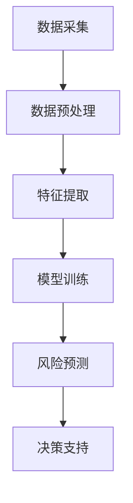

# AI辅助地震后建筑损伤评估：从图像分析到风险预测

> 关键词：AI、地震后建筑损伤评估、图像分析、风险预测、计算机视觉、机器学习

> 摘要：本文聚焦于AI在地震后建筑损伤评估中的应用，从图像分析入手，逐步深入到风险预测。详细阐述了相关核心概念、算法原理、数学模型，通过项目实战展示了具体实现过程，探讨了实际应用场景，并推荐了相关工具和资源。最后对未来发展趋势与挑战进行了总结，旨在为该领域的研究和实践提供全面且深入的参考。

## 1. 背景介绍 
### 1.1 目的和范围
地震是一种极具破坏力的自然灾害，常常导致大量建筑受损。准确、快速地评估地震后建筑的损伤情况对于救援行动、灾后重建等至关重要。传统的建筑损伤评估方法往往依赖人工现场勘查，效率低、成本高且存在一定的安全风险。本文章的目的在于探讨如何利用AI技术，特别是图像分析和风险预测技术，实现更高效、准确的地震后建筑损伤评估。范围涵盖从图像数据的获取、处理和分析，到基于分析结果进行风险预测的整个流程。

### 1.2 预期读者
本文预期读者包括从事人工智能、计算机视觉、土木工程等领域的研究人员和学者，对地震灾害管理和建筑安全评估感兴趣的专业人士，以及相关领域的学生。希望通过本文的介绍，能为他们在该领域的研究和实践提供有益的参考。

### 1.3 文档结构概述
本文首先介绍相关背景知识，包括目的、预期读者和文档结构概述等。接着阐述核心概念与联系，包括图像分析、机器学习等在建筑损伤评估中的原理和架构。然后详细讲解核心算法原理和具体操作步骤，并给出相应的Python源代码。随后介绍数学模型和公式，并举例说明。通过项目实战展示代码实际案例和详细解释。接着探讨实际应用场景，推荐相关工具和资源。最后总结未来发展趋势与挑战，提供常见问题与解答以及扩展阅读和参考资料。

### 1.4 术语表
#### 1.4.1 核心术语定义
- **AI（Artificial Intelligence）**：人工智能，是一门研究如何使计算机能够模拟人类智能的学科。
- **计算机视觉（Computer Vision）**：让计算机从图像或视频中获取信息的技术。
- **机器学习（Machine Learning）**：一门多领域交叉学科，涉及概率论、统计学、逼近论、凸分析、算法复杂度理论等多门学科。它专门研究计算机怎样模拟或实现人类的学习行为，以获取新的知识或技能，重新组织已有的知识结构使之不断改善自身的性能。
- **深度学习（Deep Learning）**：机器学习的一个分支领域，它是一种基于对数据进行表征学习的方法。深度学习通过构建具有很多层的神经网络模型来学习数据的复杂模式和特征。
- **建筑损伤评估（Building Damage Assessment）**：对地震等灾害后建筑的受损情况进行评估和判断的过程。

#### 1.4.2 相关概念解释
- **图像分析**：对图像进行处理、分析和理解的过程，目的是提取有用的信息。在地震后建筑损伤评估中，图像分析可用于识别建筑的损伤类型和程度。
- **风险预测**：基于各种数据和模型，对未来可能发生的风险进行预测和评估。在建筑损伤评估中，风险预测可帮助判断建筑是否存在倒塌等危险，为救援和重建提供决策依据。

#### 1.4.3 缩略词列表
- **CNN（Convolutional Neural Network）**：卷积神经网络，是一种专门为处理具有网格结构数据（如图像）而设计的深度学习模型。
- **RNN（Recurrent Neural Network）**：循环神经网络，是一种用于处理序列数据的神经网络模型。
- **LSTM（Long Short-Term Memory）**：长短期记忆网络，是一种特殊的RNN，能够处理长序列数据并解决梯度消失问题。

## 2. 核心概念与联系 

### 核心概念原理
在AI辅助地震后建筑损伤评估中，主要涉及到计算机视觉和机器学习这两个核心概念。

#### 计算机视觉原理
计算机视觉的主要任务是让计算机理解图像中的内容。其基本原理包括图像预处理、特征提取和目标检测等步骤。图像预处理是对原始图像进行去噪、增强等操作，以提高图像的质量。特征提取是从图像中提取出具有代表性的特征，如边缘、纹理等。目标检测则是在图像中识别出特定的目标，如建筑的损伤部位。

#### 机器学习原理
机器学习是通过对大量数据的学习来建立模型，从而实现对未知数据的预测和分类。在建筑损伤评估中，常用的机器学习算法包括支持向量机（SVM）、决策树、神经网络等。这些算法可以根据图像的特征对建筑的损伤程度进行分类和预测。

### 架构的文本示意图
整个AI辅助地震后建筑损伤评估系统的架构可以分为数据采集层、数据处理层、模型训练层和应用层。

- **数据采集层**：通过无人机、卫星等设备采集地震后建筑的图像数据。
- **数据处理层**：对采集到的图像数据进行预处理，包括裁剪、缩放、归一化等操作，并提取图像的特征。
- **模型训练层**：使用机器学习或深度学习算法对处理后的数据进行训练，建立建筑损伤评估模型。
- **应用层**：将训练好的模型应用到实际的建筑损伤评估中，进行风险预测和决策支持。

### Mermaid流程图


## 3. 核心算法原理 & 具体操作步骤 

### 卷积神经网络（CNN）原理
卷积神经网络是一种专门用于处理图像数据的深度学习模型。它通过卷积层、池化层和全连接层等组件来自动提取图像的特征。

#### 卷积层
卷积层是CNN的核心组件，它通过卷积核在图像上滑动来提取图像的局部特征。卷积核是一个小的矩阵，它与图像的局部区域进行卷积运算，得到一个特征图。

#### 池化层
池化层用于减少特征图的尺寸，从而减少模型的参数数量，提高计算效率。常用的池化操作包括最大池化和平均池化。

#### 全连接层
全连接层将卷积层和池化层提取的特征进行整合，输出最终的分类结果。

### Python源代码实现
```python
import tensorflow as tf
from tensorflow.keras import layers, models

# 构建CNN模型
def build_cnn_model(input_shape, num_classes):
    model = models.Sequential()
    # 第一个卷积层
    model.add(layers.Conv2D(32, (3, 3), activation='relu', input_shape=input_shape))
    model.add(layers.MaxPooling2D((2, 2)))
    # 第二个卷积层
    model.add(layers.Conv2D(64, (3, 3), activation='relu'))
    model.add(layers.MaxPooling2D((2, 2)))
    # 第三个卷积层
    model.add(layers.Conv2D(64, (3, 3), activation='relu'))
    # 展平层
    model.add(layers.Flatten())
    # 全连接层
    model.add(layers.Dense(64, activation='relu'))
    # 输出层
    model.add(layers.Dense(num_classes, activation='softmax'))

    # 编译模型
    model.compile(optimizer='adam',
                  loss='sparse_categorical_crossentropy',
                  metrics=['accuracy'])

    return model

# 示例使用
input_shape = (100, 100, 3)  # 输入图像的形状
num_classes = 3  # 分类的类别数
model = build_cnn_model(input_shape, num_classes)
model.summary()
```

### 具体操作步骤
1. **数据准备**：收集地震后建筑的图像数据，并进行标注，将其分为不同的损伤类别。
2. **数据预处理**：对图像数据进行裁剪、缩放、归一化等操作，以提高模型的训练效果。
3. **模型构建**：使用上述的CNN模型构建代码构建模型。
4. **模型训练**：将预处理后的数据输入到模型中进行训练，调整模型的参数，以提高模型的准确性。
5. **模型评估**：使用测试数据对训练好的模型进行评估，计算模型的准确率、召回率等指标。
6. **风险预测**：将训练好的模型应用到新的图像数据中，进行建筑损伤的分类和风险预测。

## 4. 数学模型和公式 & 详细讲解 & 举例说明 

### 损失函数
在机器学习中，损失函数用于衡量模型的预测结果与真实标签之间的差异。在建筑损伤评估中，常用的损失函数包括交叉熵损失函数。

交叉熵损失函数的公式为：
$$L(y, \hat{y}) = -\sum_{i=1}^{C} y_i \log(\hat{y}_i)$$
其中，$y$ 是真实标签，$\hat{y}$ 是模型的预测结果，$C$ 是分类的类别数。

### 详细讲解
交叉熵损失函数的作用是惩罚模型预测错误的样本。当模型的预测结果与真实标签越接近时，损失函数的值越小；当模型的预测结果与真实标签越远时，损失函数的值越大。通过最小化损失函数，模型可以不断调整自身的参数，提高预测的准确性。

### 举例说明
假设我们有一个二分类问题，真实标签 $y = [1, 0]$，模型的预测结果 $\hat{y} = [0.8, 0.2]$。则交叉熵损失函数的值为：
$$L(y, \hat{y}) = -(1 \times \log(0.8) + 0 \times \log(0.2)) \approx 0.223$$

### 优化算法
在训练模型时，我们需要使用优化算法来最小化损失函数。常用的优化算法包括随机梯度下降（SGD）、Adam等。

#### 随机梯度下降（SGD）
随机梯度下降的更新公式为：
$$\theta_{t+1} = \theta_t - \eta \nabla L(\theta_t)$$
其中，$\theta$ 是模型的参数，$\eta$ 是学习率，$\nabla L(\theta_t)$ 是损失函数关于参数 $\theta$ 的梯度。

#### Adam
Adam是一种自适应学习率的优化算法，它结合了动量和自适应学习率的思想。其更新公式较为复杂，这里不再详细列出。

## 5. 项目实战：代码实际案例和详细解释说明 

### 5.1  开发环境搭建
1. **安装Python**：建议使用Python 3.7及以上版本。
2. **安装深度学习框架**：本文使用TensorFlow作为深度学习框架，可以使用以下命令进行安装：
```sh
pip install tensorflow
```
3. **安装其他依赖库**：还需要安装一些其他的依赖库，如NumPy、Matplotlib等，可以使用以下命令进行安装：
```sh
pip install numpy matplotlib
```

### 5.2  源代码详细实现和代码解读
```python
import tensorflow as tf
from tensorflow.keras import layers, models
import numpy as np
import matplotlib.pyplot as plt
from sklearn.model_selection import train_test_split

# 模拟数据生成
def generate_synthetic_data(num_samples, image_size, num_classes):
    images = np.random.rand(num_samples, image_size, image_size, 3)
    labels = np.random.randint(0, num_classes, num_samples)
    return images, labels

# 数据准备
num_samples = 1000
image_size = 100
num_classes = 3
images, labels = generate_synthetic_data(num_samples, image_size, num_classes)

# 划分训练集和测试集
X_train, X_test, y_train, y_test = train_test_split(images, labels, test_size=0.2, random_state=42)

# 构建CNN模型
def build_cnn_model(input_shape, num_classes):
    model = models.Sequential()
    model.add(layers.Conv2D(32, (3, 3), activation='relu', input_shape=input_shape))
    model.add(layers.MaxPooling2D((2, 2)))
    model.add(layers.Conv2D(64, (3, 3), activation='relu'))
    model.add(layers.MaxPooling2D((2, 2)))
    model.add(layers.Conv2D(64, (3, 3), activation='relu'))
    model.add(layers.Flatten())
    model.add(layers.Dense(64, activation='relu'))
    model.add(layers.Dense(num_classes, activation='softmax'))

    model.compile(optimizer='adam',
                  loss='sparse_categorical_crossentropy',
                  metrics=['accuracy'])

    return model

# 训练模型
input_shape = (image_size, image_size, 3)
model = build_cnn_model(input_shape, num_classes)
history = model.fit(X_train, y_train, epochs=10, validation_data=(X_test, y_test))

# 绘制训练和验证损失曲线
plt.plot(history.history['loss'], label='Training Loss')
plt.plot(history.history['val_loss'], label='Validation Loss')
plt.xlabel('Epoch')
plt.ylabel('Loss')
plt.legend()
plt.show()

# 绘制训练和验证准确率曲线
plt.plot(history.history['accuracy'], label='Training Accuracy')
plt.plot(history.history['val_accuracy'], label='Validation Accuracy')
plt.xlabel('Epoch')
plt.ylabel('Accuracy')
plt.legend()
plt.show()

# 模型评估
test_loss, test_acc = model.evaluate(X_test, y_test)
print(f'Test accuracy: {test_acc}')
```

### 5.3  代码解读与分析
1. **数据生成**：使用 `generate_synthetic_data` 函数生成模拟的图像数据和标签。
2. **数据划分**：使用 `train_test_split` 函数将数据划分为训练集和测试集。
3. **模型构建**：使用 `build_cnn_model` 函数构建CNN模型，并编译模型。
4. **模型训练**：使用 `fit` 方法对模型进行训练，并记录训练过程中的损失和准确率。
5. **可视化**：使用 `matplotlib` 库绘制训练和验证损失曲线、训练和验证准确率曲线。
6. **模型评估**：使用 `evaluate` 方法对训练好的模型进行评估，计算测试集的损失和准确率。

## 6. 实际应用场景 
### 救援行动
在地震发生后，快速准确地评估建筑的损伤情况可以帮助救援人员确定救援的优先级和路线。通过AI辅助的建筑损伤评估系统，可以及时发现存在倒塌危险的建筑，避免救援人员进入危险区域，提高救援效率和安全性。

### 灾后重建
在灾后重建阶段，对建筑的损伤评估结果可以为重建方案的制定提供依据。通过分析建筑的损伤类型和程度，可以确定哪些建筑可以修复，哪些建筑需要拆除重建，从而合理分配资源，提高重建效率。

### 保险理赔
保险公司可以利用AI辅助的建筑损伤评估系统来评估保险标的的损失情况，确定理赔金额。这样可以提高理赔的准确性和效率，减少人为因素的干扰。

### 城市规划
通过对地震后建筑损伤情况的长期监测和分析，可以为城市规划提供参考。例如，在城市规划中可以考虑建筑的抗震性能，避免在地震高发区域建设重要的公共设施。

## 7. 工具和资源推荐
### 7.1 学习资源推荐
#### 7.1.1 书籍推荐
- 《深度学习》（Deep Learning）：由Ian Goodfellow、Yoshua Bengio和Aaron Courville所著，是深度学习领域的经典教材。
- 《Python深度学习》（Deep Learning with Python）：由Francois Chollet所著，介绍了如何使用Python和Keras进行深度学习的开发。
- 《计算机视觉：算法与应用》（Computer Vision: Algorithms and Applications）：由Richard Szeliski所著，全面介绍了计算机视觉的基本算法和应用。

#### 7.1.2 在线课程
- Coursera上的“深度学习专项课程”（Deep Learning Specialization）：由Andrew Ng教授授课，是深度学习领域的经典在线课程。
- edX上的“计算机视觉基础”（Foundations of Computer Vision）：介绍了计算机视觉的基本概念和算法。
- Udemy上的“Python数据科学和机器学习-bootcamp”（Python for Data Science and Machine Learning Bootcamp）：介绍了Python在数据科学和机器学习中的应用。

#### 7.1.3 技术博客和网站
- Medium：上面有很多关于AI、计算机视觉和机器学习的技术文章和教程。
- arXiv：是一个预印本服务器，上面有很多最新的AI和计算机视觉研究论文。
- Kaggle：是一个数据科学和机器学习竞赛平台，上面有很多关于图像分析和分类的数据集和竞赛。

### 7.2 开发工具框架推荐
#### 7.2.1 IDE和编辑器
- PyCharm：是一款专门为Python开发设计的集成开发环境，具有强大的代码编辑、调试和自动补全功能。
- Jupyter Notebook：是一个交互式的开发环境，适合进行数据探索和模型实验。
- Visual Studio Code：是一款轻量级的代码编辑器，支持多种编程语言和插件。

#### 7.2.2 调试和性能分析工具
- TensorBoard：是TensorFlow提供的一个可视化工具，可以用于查看模型的训练过程、损失曲线和准确率曲线等。
- PyTorch Profiler：是PyTorch提供的一个性能分析工具，可以用于分析模型的运行时间和内存使用情况。
- cProfile：是Python标准库中的一个性能分析工具，可以用于分析Python代码的运行时间。

#### 7.2.3 相关框架和库
- TensorFlow：是一个开源的深度学习框架，由Google开发，广泛应用于图像识别、自然语言处理等领域。
- PyTorch：是一个开源的深度学习框架，由Facebook开发，具有动态图和易于使用的特点。
- OpenCV：是一个开源的计算机视觉库，提供了丰富的图像处理和计算机视觉算法。

### 7.3 相关论文著作推荐
#### 7.3.1 经典论文
- LeCun, Y., Bottou, L., Bengio, Y., & Haffner, P. (1998). Gradient-based learning applied to document recognition. Proceedings of the IEEE, 86(11), 2278-2324. （介绍了卷积神经网络的经典论文）
- Krizhevsky, A., Sutskever, I., & Hinton, G. E. (2012). ImageNet classification with deep convolutional neural networks. Advances in neural information processing systems, 25. （介绍了AlexNet的经典论文）

#### 7.3.2 最新研究成果
- 可以关注CVPR、ICCV、ECCV等计算机视觉领域的顶级会议，以及相关的学术期刊，了解最新的研究成果。

#### 7.3.3 应用案例分析
- 可以查阅相关的学术论文和行业报告，了解AI在地震后建筑损伤评估中的实际应用案例和效果分析。

## 8. 总结：未来发展趋势与挑战
### 未来发展趋势
- **多模态数据融合**：未来的AI辅助建筑损伤评估系统将不仅仅依赖于图像数据，还会融合其他类型的数据，如激光雷达数据、传感器数据等，以提高评估的准确性和可靠性。
- **实时评估**：随着技术的不断发展，实现地震后建筑损伤的实时评估将成为可能。这将有助于及时采取救援和重建措施，减少灾害损失。
- **智能化决策支持**：AI系统将不仅仅提供建筑损伤的评估结果，还会提供智能化的决策支持，如制定最优的救援方案、重建计划等。
- **与物联网结合**：将AI技术与物联网技术相结合，可以实现对建筑的实时监测和预警，提前发现潜在的安全隐患。

### 挑战
- **数据质量和标注问题**：高质量的数据是训练准确的AI模型的基础。然而，地震后建筑的图像数据往往存在噪声、遮挡等问题，而且数据标注的成本较高，标注的准确性也难以保证。
- **模型的泛化能力**：不同地区的建筑风格、结构和地震环境可能存在差异，如何提高模型的泛化能力，使其能够在不同的场景下都能准确地评估建筑的损伤情况，是一个挑战。
- **计算资源和效率**：深度学习模型通常需要大量的计算资源和时间来训练和推理。如何在有限的计算资源下提高模型的训练和推理效率，是一个需要解决的问题。
- **伦理和法律问题**：AI辅助建筑损伤评估系统的应用可能会涉及到伦理和法律问题，如数据隐私、责任认定等。如何解决这些问题，确保系统的合法、合规和安全使用，是一个重要的挑战。

## 9. 附录：常见问题与解答
### 问题1：如何提高AI模型在建筑损伤评估中的准确性？
解答：可以从以下几个方面入手：1. 收集更多高质量的数据，并进行准确的标注；2. 选择合适的模型架构，并进行适当的调优；3. 采用数据增强技术，增加数据的多样性；4. 结合多模态数据，提高模型的信息获取能力。

### 问题2：AI模型在不同地区的建筑损伤评估中表现如何？
解答：AI模型在不同地区的表现可能会受到建筑风格、结构和地震环境等因素的影响。为了提高模型的泛化能力，可以在训练数据中包含不同地区的样本，或者采用迁移学习等技术。

### 问题3：如何解决AI模型训练过程中的过拟合问题？
解答：可以采用以下方法来解决过拟合问题：1. 增加训练数据；2. 采用正则化方法，如L1和L2正则化；3. 采用Dropout技术，随机丢弃一些神经元；4. 提前停止训练，避免模型过度拟合训练数据。

### 问题4：AI辅助建筑损伤评估系统的成本高吗？
解答：AI辅助建筑损伤评估系统的成本包括数据采集、模型训练、硬件设备等方面的成本。随着技术的不断发展和普及，成本会逐渐降低。同时，该系统可以提高评估的效率和准确性，减少人工成本和灾害损失，从长远来看，具有较高的性价比。

## 10. 扩展阅读 & 参考资料
- Goodfellow, I., Bengio, Y., & Courville, A. (2016). Deep Learning. MIT Press.
- Chollet, F. (2017). Deep Learning with Python. Manning Publications.
- Szeliski, R. (2010). Computer Vision: Algorithms and Applications. Springer.
- LeCun, Y., Bottou, L., Bengio, Y., & Haffner, P. (1998). Gradient-based learning applied to document recognition. Proceedings of the IEEE, 86(11), 2278-2324.
- Krizhevsky, A., Sutskever, I., & Hinton, G. E. (2012). ImageNet classification with deep convolutional neural networks. Advances in neural information processing systems, 25.
- 相关的学术论文、行业报告和技术博客等。