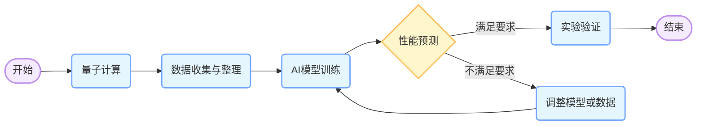

# AI辅助新型纳米材料设计：从量子计算到实验验证

> 关键词：AI、新型纳米材料设计、量子计算、实验验证、材料科学

> 摘要：本文聚焦于AI辅助新型纳米材料设计这一前沿领域，详细阐述了从量子计算获取材料微观信息，到利用AI技术进行高效筛选和设计，再到通过实验验证设计结果的全过程。深入探讨了其中的核心概念、算法原理、数学模型，并结合项目实战案例进行分析。同时介绍了该领域的实际应用场景、相关工具和资源，最后对未来发展趋势与挑战进行总结，旨在为该领域的研究和实践提供全面的技术参考。

## 1. 背景介绍 
### 1.1 目的和范围
随着科技的不断进步，新型纳米材料在能源、电子、生物医学等众多领域展现出巨大的应用潜力。然而，传统的材料研发方法存在周期长、成本高、效率低等问题。本文章的目的在于探讨如何利用AI技术结合量子计算加速新型纳米材料的设计过程，提高设计的准确性和效率。范围涵盖了从理论计算到实验验证的整个新型纳米材料设计流程，包括核心概念、算法原理、实际应用等方面。

### 1.2 预期读者
本文预期读者包括材料科学领域的研究人员、AI和量子计算领域的专业人士、相关专业的学生以及对新型纳米材料设计感兴趣的技术爱好者。希望通过本文的阐述，能够为不同背景的读者提供有价值的技术信息和研究思路。

### 1.3 文档结构概述
本文首先介绍背景信息，包括目的、预期读者和文档结构。接着阐述核心概念与联系，包括量子计算、AI和纳米材料设计之间的关系，并通过示意图和流程图进行展示。然后详细讲解核心算法原理和具体操作步骤，结合Python源代码进行说明。随后介绍数学模型和公式，并举例说明。再通过项目实战案例，包括开发环境搭建、源代码实现和代码解读，深入分析实际应用。之后介绍该领域的实际应用场景和相关工具资源。最后总结未来发展趋势与挑战，提供常见问题解答和扩展阅读参考资料。

### 1.4 术语表
#### 1.4.1 核心术语定义
- **AI（Artificial Intelligence）**：人工智能，是研究、开发用于模拟、延伸和扩展人的智能的理论、方法、技术及应用系统的一门新的技术科学。
- **量子计算（Quantum Computing）**：基于量子力学原理的计算方式，利用量子比特的叠加和纠缠等特性进行信息处理，具有强大的计算能力。
- **纳米材料（Nanomaterials）**：指在三维空间中至少有一维处于纳米尺寸（1 - 100nm）或由它们作为基本单元构成的材料。
- **机器学习（Machine Learning）**：人工智能的一个分支，致力于让计算机通过数据学习模式和规律，从而进行预测和决策。
- **密度泛函理论（Density Functional Theory, DFT）**：一种研究多电子体系电子结构的量子力学方法，在材料科学中广泛用于计算材料的电子性质。

#### 1.4.2 相关概念解释
- **材料基因组计划（Materials Genome Initiative, MGI）**：旨在通过集成计算、实验和数据等手段，加速材料研发过程，实现“在一半的时间内，以一半的成本，开发出性能更好的材料”的目标。
- **高通量计算（High - Throughput Computing）**：利用大量的计算资源，快速、高效地进行大规模的计算任务，在材料设计中可用于筛选大量的材料结构。
- **实验验证（Experimental Validation）**：通过实际的实验操作，对理论计算和设计的结果进行验证和评估，确保设计的材料具有预期的性能。

#### 1.4.3 缩略词列表
- **AI**：Artificial Intelligence
- **DFT**：Density Functional Theory
- **MGI**：Materials Genome Initiative
- **HT - DFT**：High - Throughput Density Functional Theory

## 2. 核心概念与联系 

### 核心概念原理
- **量子计算在纳米材料设计中的作用**：量子计算能够精确地计算纳米材料的电子结构、能量等微观性质。基于量子力学原理，通过求解薛定谔方程，可以得到材料中电子的波函数和能量本征值。例如，在研究纳米材料的催化性能时，量子计算可以计算出催化剂表面的电子分布，从而预测其对反应物分子的吸附和反应活性。
- **AI在纳米材料设计中的应用**：AI技术可以处理大量的材料数据，包括量子计算得到的数据、实验数据等。通过机器学习算法，如神经网络、决策树等，可以建立材料结构与性能之间的关系模型。利用这些模型，可以对未知材料的性能进行预测，从而实现高效的材料筛选和设计。例如，通过训练一个神经网络模型，可以根据纳米材料的原子组成、晶体结构等信息预测其电学性能。
- **纳米材料设计的目标**：纳米材料设计的目标是根据特定的应用需求，设计出具有优异性能的新型纳米材料。这些性能包括但不限于力学性能、电学性能、光学性能、催化性能等。通过结合量子计算和AI技术，可以从微观层面理解材料的性能来源，从而有针对性地进行材料设计。

### 架构的文本示意图
纳米材料设计的整体架构可以描述为一个循环过程。首先，通过量子计算获取纳米材料的微观信息，如电子结构、能量等。这些信息被整理成数据集，作为AI模型的输入。AI模型通过学习数据集中的规律，建立材料结构与性能之间的关系。根据设计目标，AI模型可以预测出潜在的新型纳米材料结构。然后，对这些预测的结构进行量子计算验证，评估其性能是否满足要求。如果不满足，调整AI模型的参数或重新进行数据采集，继续优化设计。如果满足要求，则进行实验验证，通过实际的实验操作制备和测试材料，进一步确认其性能。

### Mermaid流程图


## 3. 核心算法原理 & 具体操作步骤 

### 核心算法原理
在AI辅助新型纳米材料设计中，常用的机器学习算法包括神经网络、支持向量机、决策树等。这里以神经网络为例进行详细阐述。

神经网络是一种模仿人类神经系统的计算模型，由输入层、隐藏层和输出层组成。输入层接收材料的特征信息，如原子组成、晶体结构等。隐藏层对输入信息进行非线性变换，提取特征之间的复杂关系。输出层输出预测的材料性能，如电学性能、力学性能等。

神经网络的训练过程是通过反向传播算法来调整网络的权重和偏置，使得网络的输出与真实值之间的误差最小化。误差函数通常采用均方误差（Mean Squared Error, MSE），定义为：

$$MSE = \frac{1}{n}\sum_{i = 1}^{n}(y_i - \hat{y}_i)^2$$

其中，$n$ 是样本数量，$y_i$ 是真实值，$\hat{y}_i$ 是预测值。

### 具体操作步骤
1. **数据收集与预处理**：收集量子计算得到的材料数据和实验数据，包括材料的结构信息、性能信息等。对数据进行清洗，去除噪声和异常值。然后进行特征提取和归一化处理，将数据转换为适合神经网络输入的格式。
2. **神经网络模型构建**：使用深度学习框架，如TensorFlow或PyTorch，构建神经网络模型。确定输入层、隐藏层和输出层的神经元数量，选择合适的激活函数，如ReLU（Rectified Linear Unit）。
3. **模型训练**：将预处理后的数据分为训练集和验证集。使用训练集对神经网络模型进行训练，通过反向传播算法调整模型的权重和偏置。在训练过程中，使用验证集监控模型的性能，防止过拟合。
4. **模型评估与优化**：使用测试集对训练好的模型进行评估，计算误差指标，如均方误差、平均绝对误差等。如果模型性能不理想，可以调整模型的结构、超参数，或者增加数据量，进行优化。
5. **材料性能预测**：使用训练好的模型对未知材料的性能进行预测，根据预测结果筛选出潜在的新型纳米材料结构。

### Python源代码实现
```python
import numpy as np
import tensorflow as tf
from tensorflow.keras.models import Sequential
from tensorflow.keras.layers import Dense
from sklearn.model_selection import train_test_split
from sklearn.preprocessing import StandardScaler

# 生成示例数据
# 假设X是材料的特征矩阵，y是材料的性能标签
np.random.seed(42)
X = np.random.rand(1000, 10)  # 1000个样本，每个样本有10个特征
y = np.random.rand(1000, 1)   # 1000个样本的性能标签

# 数据预处理
scaler = StandardScaler()
X = scaler.fit_transform(X)

# 划分训练集和测试集
X_train, X_test, y_train, y_test = train_test_split(X, y, test_size=0.2, random_state=42)

# 构建神经网络模型
model = Sequential([
    Dense(64, activation='relu', input_shape=(10,)),
    Dense(32, activation='relu'),
    Dense(1)
])

# 编译模型
model.compile(optimizer='adam', loss='mse')

# 训练模型
model.fit(X_train, y_train, epochs=50, batch_size=32, validation_split=0.1)

# 评估模型
loss = model.evaluate(X_test, y_test)
print(f"Test loss: {loss}")

# 进行预测
predictions = model.predict(X_test)
print(predictions[:5])
```

## 4. 数学模型和公式 & 详细讲解 & 举例说明 

### 量子计算中的数学模型
在量子计算中，最基本的数学模型是薛定谔方程。对于一个多电子体系，其定态薛定谔方程可以表示为：

$$\hat{H}\Psi = E\Psi$$

其中，$\hat{H}$ 是哈密顿算符，$\Psi$ 是波函数，$E$ 是能量本征值。哈密顿算符包含了体系的动能和势能项，对于一个由 $N$ 个电子和 $M$ 个原子核组成的体系，其哈密顿算符可以表示为：

$$\hat{H} = -\sum_{i = 1}^{N}\frac{\hbar^2}{2m_e}\nabla_i^2-\sum_{I = 1}^{M}\frac{\hbar^2}{2M_I}\nabla_I^2+\sum_{i = 1}^{N}\sum_{I = 1}^{M}\frac{Z_Ie^2}{|\mathbf{r}_i - \mathbf{R}_I|}+\sum_{i = 1}^{N}\sum_{j>i}^{N}\frac{e^2}{|\mathbf{r}_i - \mathbf{r}_j|}+\sum_{I = 1}^{M}\sum_{J>I}^{M}\frac{Z_IZ_Je^2}{|\mathbf{R}_I - \mathbf{R}_J|}$$

其中，$m_e$ 是电子质量，$M_I$ 是原子核质量，$Z_I$ 是原子核电荷数，$\mathbf{r}_i$ 是电子坐标，$\mathbf{R}_I$ 是原子核坐标。

### 详细讲解
薛定谔方程描述了量子体系的状态随时间的演化。通过求解薛定谔方程，可以得到体系的能量本征值和波函数。在材料科学中，波函数可以用来计算材料的电子密度，进而得到材料的各种物理性质，如能量、电荷分布、化学键等。

### 举例说明
以氢分子（$H_2$）为例，其哈密顿算符可以简化为只考虑两个电子和两个原子核的情况。通过数值方法求解薛定谔方程，可以得到氢分子的能量和电子分布。例如，在基态下，氢分子的能量最低，电子云主要分布在两个原子核之间，形成共价键。

### AI中的数学模型
在AI中，以神经网络为例，其前向传播过程可以用数学公式表示。假设输入层有 $n$ 个神经元，隐藏层有 $m$ 个神经元，输出层有 $k$ 个神经元。输入向量为 $\mathbf{x}=(x_1,x_2,\cdots,x_n)^T$，隐藏层的权重矩阵为 $\mathbf{W}_{1}$，偏置向量为 $\mathbf{b}_{1}$，输出层的权重矩阵为 $\mathbf{W}_{2}$，偏置向量为 $\mathbf{b}_{2}$。

隐藏层的输入为：

$$\mathbf{z}_{1}=\mathbf{W}_{1}\mathbf{x}+\mathbf{b}_{1}$$

隐藏层的输出为：

$$\mathbf{a}_{1}=f(\mathbf{z}_{1})$$

其中，$f$ 是激活函数，如ReLU函数：

$$f(x)=\max(0,x)$$

输出层的输入为：

$$\mathbf{z}_{2}=\mathbf{W}_{2}\mathbf{a}_{1}+\mathbf{b}_{2}$$

输出层的输出为：

$$\mathbf{a}_{2}=\mathbf{z}_{2}$$

### 详细讲解
前向传播过程是将输入数据通过神经网络的各层进行计算，最终得到输出结果。权重矩阵和偏置向量是神经网络的参数，需要通过训练来优化。激活函数的作用是引入非线性因素，使得神经网络能够学习到复杂的函数关系。

### 举例说明
假设有一个简单的神经网络，输入层有2个神经元，隐藏层有3个神经元，输出层有1个神经元。输入向量为 $\mathbf{x}=(1,2)^T$，隐藏层的权重矩阵为：

$$\mathbf{W}_{1}=\begin{bmatrix}0.1 & 0.2\\0.3 & 0.4\\0.5 & 0.6\end{bmatrix}$$

偏置向量为 $\mathbf{b}_{1}=(0.1,0.2,0.3)^T$，输出层的权重矩阵为 $\mathbf{W}_{2}=(0.7,0.8,0.9)$，偏置向量为 $\mathbf{b}_{2}=0.1$。

首先计算隐藏层的输入：

$$\mathbf{z}_{1}=\mathbf{W}_{1}\mathbf{x}+\mathbf{b}_{1}=\begin{bmatrix}0.1 & 0.2\\0.3 & 0.4\\0.5 & 0.6\end{bmatrix}\begin{bmatrix}1\\2\end{bmatrix}+\begin{bmatrix}0.1\\0.2\\0.3\end{bmatrix}=\begin{bmatrix}0.1\times1 + 0.2\times2+0.1\\0.3\times1 + 0.4\times2+0.2\\0.5\times1 + 0.6\times2+0.3\end{bmatrix}=\begin{bmatrix}0.6\\1.3\\2\end{bmatrix}$$

然后计算隐藏层的输出，使用ReLU激活函数：

$$\mathbf{a}_{1}=f(\mathbf{z}_{1})=\begin{bmatrix}\max(0,0.6)\\\max(0,1.3)\\\max(0,2)\end{bmatrix}=\begin{bmatrix}0.6\\1.3\\2\end{bmatrix}$$

接着计算输出层的输入：

$$\mathbf{z}_{2}=\mathbf{W}_{2}\mathbf{a}_{1}+\mathbf{b}_{2}=(0.7,0.8,0.9)\begin{bmatrix}0.6\\1.3\\2\end{bmatrix}+0.1=0.7\times0.6 + 0.8\times1.3+0.9\times2+0.1=3.44$$

输出层的输出为 $\mathbf{a}_{2}=\mathbf{z}_{2}=3.44$。

## 5. 项目实战：代码实际案例和详细解释说明 

### 5.1  开发环境搭建
1. **操作系统**：推荐使用Linux系统，如Ubuntu 18.04及以上版本，也可以使用Windows 10或macOS。
2. **Python环境**：安装Python 3.7及以上版本。可以使用Anaconda来管理Python环境，它提供了方便的包管理和虚拟环境功能。
3. **深度学习框架**：安装TensorFlow或PyTorch。以TensorFlow为例，可以使用以下命令安装：
```bash
pip install tensorflow
```
4. **其他依赖库**：安装NumPy、Pandas、Scikit - learn等常用的数据处理和机器学习库。
```bash
pip install numpy pandas scikit-learn
```

### 5.2  源代码详细实现和代码解读
以下是一个更完整的项目实战代码示例，用于预测纳米材料的电学性能。

```python
import numpy as np
import pandas as pd
from sklearn.model_selection import train_test_split
from sklearn.preprocessing import StandardScaler
from tensorflow.keras.models import Sequential
from tensorflow.keras.layers import Dense
from tensorflow.keras.callbacks import EarlyStopping

# 加载数据
data = pd.read_csv('nanomaterial_data.csv')

# 分离特征和标签
X = data.drop('electrical_property', axis=1).values
y = data['electrical_property'].values

# 数据预处理
scaler = StandardScaler()
X = scaler.fit_transform(X)

# 划分训练集、验证集和测试集
X_train, X_temp, y_train, y_temp = train_test_split(X, y, test_size=0.3, random_state=42)
X_val, X_test, y_val, y_test = train_test_split(X_temp, y_temp, test_size=0.5, random_state=42)

# 构建神经网络模型
model = Sequential([
    Dense(128, activation='relu', input_shape=(X_train.shape[1],)),
    Dense(64, activation='relu'),
    Dense(32, activation='relu'),
    Dense(1)
])

# 编译模型
model.compile(optimizer='adam', loss='mse')

# 定义早停回调
early_stopping = EarlyStopping(monitor='val_loss', patience=10, restore_best_weights=True)

# 训练模型
history = model.fit(X_train, y_train, epochs=100, batch_size=32, validation_data=(X_val, y_val), callbacks=[early_stopping])

# 评估模型
test_loss = model.evaluate(X_test, y_test)
print(f"Test loss: {test_loss}")

# 进行预测
predictions = model.predict(X_test)
print(predictions[:5])
```

### 5.3  代码解读与分析
1. **数据加载**：使用Pandas库的`read_csv`函数加载存储纳米材料数据的CSV文件。
2. **特征和标签分离**：将数据集中的特征和目标标签（电学性能）分离。
3. **数据预处理**：使用`StandardScaler`对特征数据进行归一化处理，使得数据具有零均值和单位方差，有助于提高神经网络的训练效率。
4. **数据集划分**：将数据集划分为训练集、验证集和测试集，比例分别为70%、15%和15%。验证集用于在训练过程中监控模型的性能，防止过拟合。
5. **神经网络模型构建**：构建一个包含多个隐藏层的神经网络模型，使用ReLU激活函数引入非线性因素。
6. **模型编译**：使用Adam优化器和均方误差损失函数编译模型。
7. **早停回调**：定义早停回调，当验证集的损失在连续10个epoch中没有改善时，停止训练，并恢复最佳权重。
8. **模型训练**：使用训练集对模型进行训练，同时使用验证集监控模型性能。
9. **模型评估**：使用测试集评估模型的性能，计算测试集的均方误差。
10. **预测**：使用训练好的模型对测试集进行预测，输出前5个预测结果。

## 6. 实际应用场景 
### 能源领域
- **电池材料设计**：AI辅助新型纳米材料设计可用于开发高性能的电池电极材料。通过量子计算和AI技术，可以预测纳米材料的锂离子扩散系数、比容量等性能指标，从而筛选出具有高能量密度和长循环寿命的电极材料。例如，设计具有特殊纳米结构的过渡金属氧化物作为锂离子电池的正极材料。
- **太阳能电池材料**：在太阳能电池领域，寻找高效的光吸收和电荷传输材料是关键。AI可以结合量子计算，设计出具有合适带隙和高载流子迁移率的纳米材料，提高太阳能电池的光电转换效率。例如，设计钙钛矿纳米材料用于太阳能电池。

### 电子领域
- **半导体材料**：随着集成电路的不断发展，对高性能半导体材料的需求日益增加。AI辅助设计可以优化半导体纳米材料的晶体结构和电子性质，提高其载流子迁移率和开关速度。例如，设计二维过渡金属硫族化合物作为新型半导体材料。
- **传感器材料**：纳米材料在传感器领域具有广泛的应用。通过AI和量子计算，可以设计出对特定气体、生物分子等具有高灵敏度和选择性的纳米传感器材料。例如，设计金属氧化物纳米材料用于气体传感器。

### 生物医学领域
- **药物载体材料**：设计具有良好生物相容性和靶向性的纳米药物载体材料是生物医学领域的研究热点。AI可以结合量子计算，预测纳米材料与生物分子的相互作用，优化材料的表面性质和尺寸，提高药物的递送效率和治疗效果。例如，设计脂质体纳米材料作为药物载体。
- **生物成像材料**：寻找具有高对比度和低毒性的生物成像纳米材料对于疾病的早期诊断具有重要意义。AI辅助设计可以筛选出具有特殊光学性质的纳米材料，如荧光量子点、上转换纳米粒子等，用于生物成像。

## 7. 工具和资源推荐
### 7.1 学习资源推荐
#### 7.1.1 书籍推荐
- 《Materials Informatics》：介绍了材料信息学的基本概念、方法和应用，包括AI在材料设计中的应用。
- 《Quantum Computing for Computer Scientists》：从计算机科学的角度介绍量子计算的原理和算法，适合对量子计算感兴趣的读者。
- 《Hands - On Machine Learning with Scikit - Learn, Keras, and TensorFlow》：详细介绍了机器学习和深度学习的基本原理和实践，通过大量的案例和代码示例帮助读者掌握相关技术。

#### 7.1.2 在线课程
- Coursera上的“Machine Learning”课程：由Andrew Ng教授主讲，是机器学习领域的经典课程，涵盖了机器学习的基本算法和应用。
- edX上的“Quantum Computing Fundamentals”课程：介绍量子计算的基本概念和原理，适合初学者。
- Udemy上的“Deep Learning A-Z™: Hands - On Artificial Neural Networks”课程：通过实际项目介绍深度学习的应用，包括神经网络的构建和训练。

#### 7.1.3 技术博客和网站
- arXiv：一个预印本服务器，提供了大量的学术论文，包括材料科学、AI和量子计算等领域的最新研究成果。
- Nature Materials：《自然 - 材料》杂志的官方网站，发表材料科学领域的前沿研究论文。
- Towards Data Science：一个专注于数据科学和机器学习的技术博客，提供了许多实用的技术文章和案例分析。

### 7.2 开发工具框架推荐
#### 7.2.1 IDE和编辑器
- PyCharm：一个功能强大的Python集成开发环境，提供了代码编辑、调试、版本控制等功能，适合Python项目的开发。
- Jupyter Notebook：一个交互式的开发环境，支持Python、R等多种编程语言，适合数据探索和模型实验。
- Visual Studio Code：一个轻量级的代码编辑器，支持多种编程语言和插件，具有丰富的扩展功能。

#### 7.2.2 调试和性能分析工具
- TensorBoard：TensorFlow的可视化工具，可以监控模型的训练过程，如损失曲线、准确率曲线等，还可以查看模型的结构和参数分布。
- PyTorch Profiler：PyTorch的性能分析工具，可以分析模型的运行时间、内存使用等性能指标，帮助优化模型。
- cProfile：Python的内置性能分析工具，可以分析Python代码的执行时间和函数调用次数，找出性能瓶颈。

#### 7.2.3 相关框架和库
- TensorFlow：一个开源的深度学习框架，提供了丰富的神经网络模型和工具，支持CPU、GPU和TPU等多种计算设备。
- PyTorch：另一个流行的深度学习框架，具有动态图和简洁的API，适合快速开发和研究。
- ASE（Atomic Simulation Environment）：一个Python库，用于原子尺度的模拟和计算，支持量子力学计算和分子动力学模拟。

### 7.3 相关论文著作推荐
#### 7.3.1 经典论文
- “Density - functional thermochemistry. III. The role of exact exchange” by A. D. Becke：介绍了密度泛函理论中的B3LYP泛函，是材料科学中常用的量子计算方法。
- “Gradient based learning applied to document recognition” by Y. LeCun et al.：介绍了卷积神经网络（CNN）的基本原理和应用，是深度学习领域的经典论文。
- “A fast learning algorithm for deep belief nets” by G. E. Hinton et al.：提出了深度信念网络（DBN）的快速学习算法，推动了深度学习的发展。

#### 7.3.2 最新研究成果
- 关注《Nature》、《Science》、《Advanced Materials》等顶级学术期刊上发表的关于AI辅助新型纳米材料设计的研究论文，了解最新的研究进展和技术突破。
- 参加相关的学术会议，如Materials Research Society（MRS）会议、Neural Information Processing Systems（NeurIPS）会议等，获取最新的研究成果和前沿信息。

#### 7.3.3 应用案例分析
- 参考一些实际应用案例的研究论文，如某公司使用AI和量子计算设计出新型电池材料的案例，了解技术在实际应用中的流程和效果。
- 关注行业报告和技术博客，获取更多的应用案例和实践经验。

## 8. 总结：未来发展趋势与挑战
### 未来发展趋势
- **多学科融合**：AI辅助新型纳米材料设计将更加注重多学科的融合，包括材料科学、物理学、化学、计算机科学等。通过跨学科的研究，可以充分发挥各学科的优势，推动该领域的快速发展。
- **高通量计算与实验自动化**：随着计算能力的不断提升和实验设备的自动化发展，高通量计算和实验将成为主流。可以快速筛选大量的材料结构，加速新型纳米材料的研发过程。
- **AI技术的创新应用**：未来将不断涌现新的AI技术和算法，如强化学习、生成对抗网络等，这些技术将在纳米材料设计中得到更广泛的应用，提高设计的效率和准确性。
- **材料基因组计划的深入推进**：材料基因组计划将继续深入推进，建立更加完善的材料数据库和计算平台，实现材料设计、计算、实验和数据的一体化，促进新型纳米材料的快速发展。

### 挑战
- **数据质量和数量**：目前，材料数据存在质量参差不齐、数量不足等问题。高质量的数据是AI模型训练的基础，如何获取和整理大量准确的材料数据是一个挑战。
- **量子计算的局限性**：虽然量子计算具有强大的计算能力，但目前量子计算机的稳定性和可扩展性还存在问题。在实际应用中，如何利用有限的量子计算资源进行高效的材料计算是一个挑战。
- **模型的可解释性**：AI模型，尤其是深度学习模型，通常是一个黑盒模型，难以解释其决策过程和结果。在材料设计中，需要理解模型的预测依据，以便进行合理的材料设计和优化。
- **实验验证的复杂性**：纳米材料的实验验证需要高精度的实验设备和技术，实验过程复杂且成本高。如何提高实验验证的效率和准确性，降低成本，是一个需要解决的问题。

## 9. 附录：常见问题与解答
### 1. 为什么要结合量子计算和AI进行新型纳米材料设计？
量子计算可以精确地计算纳米材料的微观性质，为材料设计提供理论基础。但量子计算的计算量非常大，对于大规模的材料筛选效率较低。AI技术可以处理大量的数据，通过学习数据中的规律，快速预测材料的性能，实现高效的材料筛选和设计。结合两者的优势，可以加速新型纳米材料的研发过程。

### 2. 如何选择合适的AI算法进行纳米材料设计？
选择合适的AI算法需要考虑数据的特点、问题的类型和计算资源等因素。如果数据量较大且具有复杂的非线性关系，可以选择神经网络等深度学习算法。如果数据量较小或问题相对简单，可以选择支持向量机、决策树等传统机器学习算法。

### 3. 量子计算在纳米材料设计中的准确性如何保证？
量子计算的准确性主要取决于所采用的理论方法和计算参数。在实际应用中，通常采用经过验证的理论方法，如密度泛函理论，并选择合适的基组和泛函。同时，需要进行收敛性测试，确保计算结果的准确性。

### 4. 实验验证的结果与理论预测不一致怎么办？
实验验证结果与理论预测不一致可能是由于多种原因引起的，如理论模型的简化、实验误差等。此时，需要对理论模型进行重新评估和改进，检查实验过程是否存在误差。可以通过增加实验次数、改进实验方法等方式提高实验的准确性，同时调整理论模型的参数，使其更好地符合实验结果。

### 5. 如何评估AI模型在纳米材料设计中的性能？
可以使用多种指标来评估AI模型的性能，如均方误差、平均绝对误差、决定系数等。这些指标可以衡量模型的预测结果与真实值之间的差异。此外，还可以通过交叉验证、留一法等方法评估模型的泛化能力，确保模型在未知数据上也能有较好的表现。

## 10. 扩展阅读 & 参考资料
### 扩展阅读
- 《The Second Machine Age: Work, Progress, and Prosperity in a Time of Brilliant Technologies》：探讨了科技发展对社会和经济的影响，包括AI和量子计算等新兴技术。
- 《The Quantum Age: How Quantum Physics Changed Everything》：介绍了量子物理的发展历程和应用，包括量子计算在各个领域的潜在应用。
- 《Materials Science and Engineering: An Introduction》：系统地介绍了材料科学与工程的基本概念、原理和方法，是材料科学领域的经典教材。

### 参考资料
- 相关学术论文：在arXiv、IEEE Xplore、ACM Digital Library等学术数据库中搜索关于AI辅助新型纳米材料设计、量子计算、机器学习等方面的论文。
- 行业报告：关注市场研究机构发布的关于材料科学、AI、量子计算等领域的行业报告，了解行业动态和发展趋势。
- 开源代码库：在GitHub等开源代码库中搜索相关的开源项目和代码示例，学习和参考他人的实现方法。