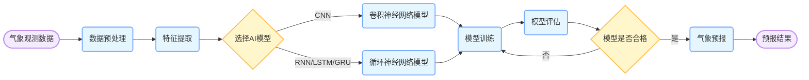

# AI辅助气象预报：精确度与可靠性的提升

> 关键词：AI、气象预报、精确度、可靠性、机器学习、深度学习、数值预报

> 摘要：本文聚焦于AI在气象预报领域的应用，深入探讨其如何提升气象预报的精确度与可靠性。首先介绍了气象预报的背景知识以及AI参与其中的目的和范围，阐述了预期读者和文档结构。接着详细讲解了AI相关的核心概念、算法原理、数学模型，并通过Python代码进行说明。然后给出了项目实战案例，包括开发环境搭建、源代码实现与解读。还探讨了AI在气象预报中的实际应用场景，推荐了相关的学习资源、开发工具框架和论文著作。最后总结了未来发展趋势与挑战，解答了常见问题并提供扩展阅读与参考资料，旨在全面展示AI辅助气象预报的技术全貌和发展前景。

## 1. 背景介绍 
### 1.1 目的和范围
气象预报对于人类的生产生活有着至关重要的影响，从农业生产、航空航海到能源管理等各个领域，都依赖准确可靠的气象信息。然而，传统的气象预报方法在面对复杂多变的气象系统时，存在一定的局限性。本文章的目的在于探讨如何利用AI技术来辅助气象预报，提升其精确度与可靠性。范围涵盖了AI在气象预报中的核心概念、算法原理、数学模型、实际应用案例以及未来发展趋势等方面。

### 1.2 预期读者
本文预期读者包括气象领域的科研人员、工程师，对AI技术在气象领域应用感兴趣的程序员、数据科学家，以及相关专业的学生和研究爱好者。希望通过本文，能为不同层次的读者提供有价值的信息和参考。

### 1.3 文档结构概述
本文将按照以下结构进行阐述：首先介绍背景知识，包括目的、预期读者和术语表；接着讲解AI在气象预报中的核心概念与联系，包括原理和架构；然后详细阐述核心算法原理和具体操作步骤，并给出Python代码示例；之后介绍相关的数学模型和公式，并举例说明；再通过项目实战案例展示AI在气象预报中的具体应用；探讨实际应用场景；推荐相关的工具和资源；最后总结未来发展趋势与挑战，解答常见问题并提供扩展阅读与参考资料。

### 1.4 术语表
#### 1.4.1 核心术语定义
- **AI（Artificial Intelligence）**：人工智能，是指通过计算机技术模拟人类智能的理论、方法、技术及应用系统。
- **气象预报**：根据气象观测资料，应用天气学、动力气象学、统计学的原理和方法，对某区域或某地点未来一定时段的天气状况作出定性或定量的预测。
- **精确度**：指预报结果与实际天气情况的接近程度。
- **可靠性**：指预报结果的可信度和稳定性。
- **机器学习（Machine Learning）**：一门多领域交叉学科，涉及概率论、统计学、逼近论、凸分析、算法复杂度理论等多门学科。它专门研究计算机怎样模拟或实现人类的学习行为，以获取新的知识或技能，重新组织已有的知识结构使之不断改善自身的性能。
- **深度学习（Deep Learning）**：机器学习的一个分支领域，它是一种基于对数据进行表征学习的方法。深度学习通过构建具有很多层的神经网络模型，自动从大量数据中学习特征和模式。

#### 1.4.2 相关概念解释
- **数值预报**：以大气动力学和热力学为基础，通过计算机求解描写天气演变过程的流体力学和热力学方程组，来预测未来一定时段的大气运动状态和天气现象的方法。
- **数据同化**：将各种来源的观测数据与数值预报模式的预报结果相结合，以获得更准确的初始场，从而提高数值预报的准确性。

#### 1.4.3 缩略词列表
- **CNN（Convolutional Neural Network）**：卷积神经网络
- **RNN（Recurrent Neural Network）**：循环神经网络
- **LSTM（Long Short - Term Memory）**：长短期记忆网络
- **GRU（Gated Recurrent Unit）**：门控循环单元

## 2. 核心概念与联系 
### 2.1 AI与气象预报的结合原理
AI在气象预报中的应用主要基于数据驱动的思想。气象观测数据包含了大量的信息，如温度、湿度、气压、风速等，这些数据反映了大气的状态和变化。传统的气象预报方法往往难以充分挖掘这些数据中的潜在信息。而AI技术，尤其是机器学习和深度学习算法，具有强大的模式识别和数据拟合能力，可以从海量的气象数据中学习到复杂的气象变化模式和规律，从而对未来的天气情况进行预测。

例如，深度学习中的卷积神经网络（CNN）可以自动提取气象数据中的空间特征，循环神经网络（RNN）及其变体（如LSTM、GRU）可以处理序列数据，捕捉气象数据的时间依赖性。通过将这些AI算法与气象数据相结合，可以构建出更加准确和可靠的气象预报模型。

### 2.2 核心架构示意图
下面是一个简单的AI辅助气象预报的架构示意图：



该架构的主要步骤包括：
1. **气象观测数据**：收集各种气象观测设备获取的数据，如气象站、卫星、雷达等。
2. **数据预处理**：对原始数据进行清洗、归一化、缺失值处理等操作，以提高数据的质量。
3. **特征提取**：从预处理后的数据中提取与气象预报相关的特征。
4. **选择AI模型**：根据数据的特点和预报任务的需求，选择合适的AI模型，如CNN、RNN等。
5. **模型训练**：使用历史气象数据对选择的模型进行训练，调整模型的参数。
6. **模型评估**：使用测试数据对训练好的模型进行评估，计算模型的性能指标。
7. **模型是否合格**：根据评估结果判断模型是否满足要求，如果不满足则返回模型训练步骤进行改进。
8. **气象预报**：使用训练好的合格模型对未来的气象情况进行预报。
9. **预报结果**：输出最终的气象预报结果。

## 3. 核心算法原理 & 具体操作步骤 
### 3.1 卷积神经网络（CNN）原理与Python实现
#### 3.1.1 原理
卷积神经网络（CNN）是一种专门为处理具有网格结构数据（如图像、音频等）而设计的神经网络。在气象预报中，CNN可以用于提取气象数据中的空间特征。CNN的主要组成部分包括卷积层、池化层和全连接层。

- **卷积层**：通过卷积核在输入数据上滑动，进行卷积运算，提取数据的局部特征。卷积运算可以表示为：
  $$y_{ij}=\sum_{m=0}^{M - 1}\sum_{n=0}^{N - 1}x_{i + m,j + n}w_{mn}+b$$
  其中，$x$ 是输入数据，$w$ 是卷积核，$b$ 是偏置，$y$ 是卷积结果。

- **池化层**：对卷积层的输出进行下采样，减少数据的维度，同时保留重要的特征信息。常见的池化操作有最大池化和平均池化。

- **全连接层**：将池化层的输出展平为一维向量，然后通过全连接的方式连接到输出层，进行最终的预测。

#### 3.1.2 Python实现
以下是一个使用PyTorch实现的简单CNN模型用于气象数据预测的示例代码：

```python
import torch
import torch.nn as nn
import torch.optim as optim

# 定义CNN模型
class WeatherCNN(nn.Module):
    def __init__(self):
        super(WeatherCNN, self).__init__()
        self.conv1 = nn.Conv2d(in_channels=3, out_channels=16, kernel_size=3, padding=1)
        self.relu1 = nn.ReLU()
        self.pool1 = nn.MaxPool2d(kernel_size=2, stride=2)
        self.conv2 = nn.Conv2d(in_channels=16, out_channels=32, kernel_size=3, padding=1)
        self.relu2 = nn.ReLU()
        self.pool2 = nn.MaxPool2d(kernel_size=2, stride=2)
        self.fc1 = nn.Linear(32 * 8 * 8, 128)
        self.relu3 = nn.ReLU()
        self.fc2 = nn.Linear(128, 1)

    def forward(self, x):
        x = self.pool1(self.relu1(self.conv1(x)))
        x = self.pool2(self.relu2(self.conv2(x)))
        x = x.view(-1, 32 * 8 * 8)
        x = self.relu3(self.fc1(x))
        x = self.fc2(x)
        return x

# 初始化模型、损失函数和优化器
model = WeatherCNN()
criterion = nn.MSELoss()
optimizer = optim.Adam(model.parameters(), lr=0.001)

# 模拟训练数据
train_data = torch.randn(100, 3, 32, 32)
train_labels = torch.randn(100, 1)

# 训练模型
num_epochs = 10
for epoch in range(num_epochs):
    optimizer.zero_grad()
    outputs = model(train_data)
    loss = criterion(outputs, train_labels)
    loss.backward()
    optimizer.step()
    print(f'Epoch {epoch + 1}/{num_epochs}, Loss: {loss.item()}')
```

### 3.2 循环神经网络（RNN）原理与Python实现
#### 3.2.1 原理
循环神经网络（RNN）是一种专门处理序列数据的神经网络。在气象预报中，RNN可以用于捕捉气象数据的时间依赖性。RNN的核心思想是在网络中引入循环结构，使得网络可以保存之前的状态信息。

RNN的基本单元可以表示为：
$$h_t=\tanh(W_{hh}h_{t - 1}+W_{xh}x_t + b_h)$$
$$y_t = W_{hy}h_t + b_y$$
其中，$x_t$ 是当前时刻的输入，$h_t$ 是当前时刻的隐藏状态，$y_t$ 是当前时刻的输出，$W_{hh}$、$W_{xh}$、$W_{hy}$ 是权重矩阵，$b_h$、$b_y$ 是偏置。

#### 3.2.2 Python实现
以下是一个使用PyTorch实现的简单RNN模型用于气象数据预测的示例代码：

```python
import torch
import torch.nn as nn
import torch.optim as optim

# 定义RNN模型
class WeatherRNN(nn.Module):
    def __init__(self, input_size, hidden_size, output_size):
        super(WeatherRNN, self).__init__()
        self.hidden_size = hidden_size
        self.rnn = nn.RNN(input_size, hidden_size, batch_first=True)
        self.fc = nn.Linear(hidden_size, output_size)

    def forward(self, x):
        h0 = torch.zeros(1, x.size(0), self.hidden_size).to(x.device)
        out, _ = self.rnn(x, h0)
        out = self.fc(out[:, -1, :])
        return out

# 初始化模型、损失函数和优化器
input_size = 10
hidden_size = 20
output_size = 1
model = WeatherRNN(input_size, hidden_size, output_size)
criterion = nn.MSELoss()
optimizer = optim.Adam(model.parameters(), lr=0.001)

# 模拟训练数据
train_data = torch.randn(100, 5, input_size)
train_labels = torch.randn(100, output_size)

# 训练模型
num_epochs = 10
for epoch in range(num_epochs):
    optimizer.zero_grad()
    outputs = model(train_data)
    loss = criterion(outputs, train_labels)
    loss.backward()
    optimizer.step()
    print(f'Epoch {epoch + 1}/{num_epochs}, Loss: {loss.item()}')
```

## 4. 数学模型和公式 & 详细讲解 & 举例说明 
### 4.1 损失函数
在AI辅助气象预报中，常用的损失函数有均方误差（MSE）、平均绝对误差（MAE）等。

#### 4.1.1 均方误差（MSE）
均方误差是预测值与真实值之间误差的平方的平均值，其数学公式为：
$$MSE=\frac{1}{n}\sum_{i = 1}^{n}(y_i-\hat{y}_i)^2$$
其中，$y_i$ 是真实值，$\hat{y}_i$ 是预测值，$n$ 是样本数量。

MSE对较大的误差比较敏感，因为误差是平方的，所以会放大较大误差的影响。例如，在气象预报中，如果预测的温度与实际温度相差较大，MSE会给予较大的惩罚。

#### 4.1.2 平均绝对误差（MAE）
平均绝对误差是预测值与真实值之间误差的绝对值的平均值，其数学公式为：
$$MAE=\frac{1}{n}\sum_{i = 1}^{n}|y_i-\hat{y}_i|$$
MAE对所有误差同等对待，不会像MSE那样放大较大误差的影响。例如，在一些对误差大小不太敏感的气象预报场景中，MAE可能是一个更合适的损失函数。

### 4.2 优化算法
在训练AI模型时，需要使用优化算法来调整模型的参数，使得损失函数最小化。常见的优化算法有随机梯度下降（SGD）、Adam等。

#### 4.2.1 随机梯度下降（SGD）
随机梯度下降的更新公式为：
$$\theta_{t + 1}=\theta_t-\eta\nabla L(\theta_t;x_i,y_i)$$
其中，$\theta$ 是模型的参数，$\eta$ 是学习率，$\nabla L(\theta_t;x_i,y_i)$ 是损失函数关于参数 $\theta$ 在样本 $(x_i,y_i)$ 上的梯度。

SGD每次只使用一个样本或一小批样本进行参数更新，计算效率较高，但可能会导致训练过程不稳定。

#### 4.2.2 Adam
Adam是一种自适应学习率的优化算法，它结合了动量和自适应学习率的思想。Adam的更新公式为：
$$m_{t + 1}=\beta_1m_t+(1 - \beta_1)\nabla L(\theta_t)$$
$$v_{t + 1}=\beta_2v_t+(1 - \beta_2)(\nabla L(\theta_t))^2$$
$$\hat{m}_{t + 1}=\frac{m_{t + 1}}{1-\beta_1^{t + 1}}$$
$$\hat{v}_{t + 1}=\frac{v_{t + 1}}{1-\beta_2^{t + 1}}$$
$$\theta_{t + 1}=\theta_t-\eta\frac{\hat{m}_{t + 1}}{\sqrt{\hat{v}_{t + 1}}+\epsilon}$$
其中，$m_t$ 和 $v_t$ 分别是梯度的一阶矩估计和二阶矩估计，$\beta_1$ 和 $\beta_2$ 是衰减率，$\epsilon$ 是一个很小的常数，用于避免分母为零。

Adam在大多数情况下都能取得较好的效果，具有较快的收敛速度和较好的稳定性。

### 4.3 举例说明
假设我们有以下气象数据预测任务：预测某地区未来一天的最高温度。我们使用一个简单的线性回归模型进行预测，模型的参数为 $w$ 和 $b$，预测公式为 $\hat{y}=wx + b$，其中 $x$ 是输入特征（如前一天的温度、湿度等），$\hat{y}$ 是预测的最高温度。

我们使用均方误差作为损失函数，随机梯度下降作为优化算法。假设我们有以下样本数据：

| 输入特征 $x$ | 真实最高温度 $y$ |
|---|---|
| 20 | 25 |
| 22 | 27 |
| 24 | 29 |

首先，我们初始化模型参数 $w = 0$，$b = 0$，学习率 $\eta = 0.01$。

对于第一个样本 $(x_1 = 20, y_1 = 25)$：
- 预测值 $\hat{y}_1=w x_1 + b=0\times20 + 0 = 0$
- 误差 $e_1=y_1-\hat{y}_1=25 - 0 = 25$
- 损失 $L_1=(y_1-\hat{y}_1)^2=25^2 = 625$
- 梯度 $\nabla_w L_1=-2x_1(y_1-\hat{y}_1)=-2\times20\times25=-1000$，$\nabla_b L_1=-2(y_1-\hat{y}_1)=-2\times25=-50$
- 参数更新：$w = w-\eta\nabla_w L_1=0 - 0.01\times(-1000)=10$，$b = b-\eta\nabla_b L_1=0 - 0.01\times(-50)=0.5$

按照同样的方法，依次处理其他样本，不断更新模型参数，直到损失函数收敛。

## 5. 项目实战：代码实际案例和详细解释说明 
### 5.1  开发环境搭建
#### 5.1.1 操作系统
推荐使用Linux系统（如Ubuntu）或Windows 10系统，因为这些系统对Python开发环境的支持较好。

#### 5.1.2 Python环境
安装Python 3.7及以上版本。可以从Python官方网站（https://www.python.org/downloads/）下载安装包进行安装。

#### 5.1.3 依赖库安装
使用pip命令安装以下必要的依赖库：
```bash
pip install torch torchvision numpy pandas matplotlib scikit-learn
```
其中，`torch` 和 `torchvision` 是PyTorch深度学习框架，`numpy` 用于数值计算，`pandas` 用于数据处理，`matplotlib` 用于数据可视化，`scikit-learn` 用于数据预处理和模型评估。

### 5.2  源代码详细实现和代码解读
以下是一个使用LSTM模型进行气象数据预测的完整项目示例：

```python
import torch
import torch.nn as nn
import torch.optim as optim
import numpy as np
import pandas as pd
from sklearn.preprocessing import MinMaxScaler
import matplotlib.pyplot as plt

# 数据加载和预处理
def load_and_preprocess_data(file_path):
    data = pd.read_csv(file_path)
    # 选择需要的特征列，这里假设选择温度列
    data = data[['Temperature']].values
    scaler = MinMaxScaler()
    data = scaler.fit_transform(data)
    return data, scaler

# 划分训练集和测试集
def split_data(data, train_ratio=0.8):
    train_size = int(len(data) * train_ratio)
    train_data = data[:train_size]
    test_data = data[train_size:]
    return train_data, test_data

# 准备训练数据
def prepare_data(data, seq_length):
    inputs = []
    targets = []
    for i in range(len(data) - seq_length):
        inputs.append(data[i:i + seq_length])
        targets.append(data[i + seq_length])
    inputs = np.array(inputs)
    targets = np.array(targets)
    inputs = torch.from_numpy(inputs).float()
    targets = torch.from_numpy(targets).float()
    return inputs, targets

# 定义LSTM模型
class WeatherLSTM(nn.Module):
    def __init__(self, input_size, hidden_size, num_layers, output_size):
        super(WeatherLSTM, self).__init__()
        self.hidden_size = hidden_size
        self.num_layers = num_layers
        self.lstm = nn.LSTM(input_size, hidden_size, num_layers, batch_first=True)
        self.fc = nn.Linear(hidden_size, output_size)

    def forward(self, x):
        h0 = torch.zeros(self.num_layers, x.size(0), self.hidden_size).to(x.device)
        c0 = torch.zeros(self.num_layers, x.size(0), self.hidden_size).to(x.device)
        out, _ = self.lstm(x, (h0, c0))
        out = self.fc(out[:, -1, :])
        return out

# 训练模型
def train_model(model, train_inputs, train_targets, num_epochs, learning_rate):
    criterion = nn.MSELoss()
    optimizer = optim.Adam(model.parameters(), lr=learning_rate)
    for epoch in range(num_epochs):
        optimizer.zero_grad()
        outputs = model(train_inputs)
        loss = criterion(outputs, train_targets)
        loss.backward()
        optimizer.step()
        if (epoch + 1) % 100 == 0:
            print(f'Epoch {epoch + 1}/{num_epochs}, Loss: {loss.item()}')
    return model

# 测试模型
def test_model(model, test_inputs, test_targets, scaler):
    model.eval()
    with torch.no_grad():
        predictions = model(test_inputs)
        predictions = scaler.inverse_transform(predictions.numpy())
        test_targets = scaler.inverse_transform(test_targets.numpy())
    return predictions, test_targets

# 主函数
def main():
    file_path = 'weather_data.csv'
    seq_length = 10
    input_size = 1
    hidden_size = 32
    num_layers = 2
    output_size = 1
    num_epochs = 500
    learning_rate = 0.001

    data, scaler = load_and_preprocess_data(file_path)
    train_data, test_data = split_data(data)
    train_inputs, train_targets = prepare_data(train_data, seq_length)
    test_inputs, test_targets = prepare_data(test_data, seq_length)

    model = WeatherLSTM(input_size, hidden_size, num_layers, output_size)
    model = train_model(model, train_inputs, train_targets, num_epochs, learning_rate)
    predictions, test_targets = test_model(model, test_inputs, test_targets, scaler)

    # 可视化结果
    plt.plot(test_targets, label='Actual')
    plt.plot(predictions, label='Predicted')
    plt.xlabel('Time')
    plt.ylabel('Temperature')
    plt.legend()
    plt.show()

if __name__ == '__main__':
    main()
```

### 5.3  代码解读与分析
#### 5.3.1 数据加载和预处理
`load_and_preprocess_data` 函数用于加载气象数据文件，并使用 `MinMaxScaler` 对数据进行归一化处理，将数据缩放到0到1的范围内。

#### 5.3.2 划分训练集和测试集
`split_data` 函数将数据集按照一定的比例划分为训练集和测试集，方便后续的模型训练和评估。

#### 5.3.3 准备训练数据
`prepare_data` 函数将数据转换为适合LSTM模型输入的格式，即输入序列和对应的目标值。

#### 5.3.4 定义LSTM模型
`WeatherLSTM` 类定义了一个LSTM模型，包含一个LSTM层和一个全连接层。

#### 5.3.5 训练模型
`train_model` 函数使用均方误差损失函数和Adam优化算法对模型进行训练，不断调整模型的参数，使得损失函数最小化。

#### 5.3.6 测试模型
`test_model` 函数使用训练好的模型对测试数据进行预测，并将预测结果和真实值进行反归一化处理，以便进行可视化和评估。

#### 5.3.7 主函数
`main` 函数将上述各个步骤组合起来，完成整个气象数据预测的流程，并将预测结果进行可视化展示。

## 6. 实际应用场景 
### 6.1 农业领域
AI辅助气象预报在农业领域有着重要的应用。准确的气象预报可以帮助农民合理安排农事活动，如播种、施肥、灌溉、收获等。例如，通过提前了解未来的降水情况，农民可以决定是否需要进行灌溉，避免水资源的浪费；根据气温预报，农民可以选择合适的作物品种和种植时间，提高农作物的产量和质量。

### 6.2 航空航海领域
在航空航海领域，气象条件对飞行和航行安全有着至关重要的影响。AI辅助气象预报可以提供更准确的气象信息，帮助飞行员和船员提前做好应对措施。例如，在飞行前，飞行员可以根据气象预报选择最佳的航线，避开恶劣天气区域；在航行中，船员可以根据海浪、风向等气象信息调整船舶的航向和速度，确保航行安全。

### 6.3 能源管理领域
能源管理领域也离不开准确的气象预报。例如，对于太阳能和风能发电来说，气象条件直接影响着发电效率。通过AI辅助气象预报，可以提前预测太阳能和风能的发电量，合理安排能源的存储和调配，提高能源的利用效率。同时，对于电力系统的负荷预测，气象条件也是一个重要的影响因素，准确的气象预报可以帮助电力公司更好地规划电力供应，避免电力短缺或浪费。

### 6.4 城市规划与建设领域
在城市规划与建设过程中，气象条件也是需要考虑的重要因素。例如，在城市排水系统的设计中，需要根据当地的降水情况来确定排水管道的管径和坡度；在建筑物的设计中，需要考虑当地的风向、日照等气象因素，以提高建筑物的舒适度和节能效果。AI辅助气象预报可以提供更准确的气象数据，为城市规划与建设提供科学依据。

## 7. 工具和资源推荐
### 7.1 学习资源推荐
#### 7.1.1 书籍推荐
- 《深度学习》（Deep Learning）：由Ian Goodfellow、Yoshua Bengio和Aaron Courville三位深度学习领域的先驱共同撰写，是深度学习领域的经典教材，系统地介绍了深度学习的基本概念、算法和应用。
- 《Python机器学习》（Python Machine Learning）：由Sebastian Raschka和Vahid Mirjalili编写，详细介绍了Python在机器学习中的应用，包括各种机器学习算法的原理和实现。
- 《气象学与气候学导论》（Introduction to Meteorology and Climatology）：是一本全面介绍气象学和气候学基础知识的书籍，对于理解气象预报的原理和方法有很大的帮助。

#### 7.1.2 在线课程
- Coursera上的“深度学习专项课程”（Deep Learning Specialization）：由Andrew Ng教授主讲，包括五门课程，全面覆盖了深度学习的各个方面，是学习深度学习的优质课程。
- edX上的“气象学原理”（Principles of Meteorology）：该课程介绍了气象学的基本原理和方法，适合对气象学感兴趣的初学者。
- 中国大学MOOC上的“机器学习基础”：由国内知名高校的教授授课，系统地介绍了机器学习的基本概念、算法和应用。

#### 7.1.3 技术博客和网站
- Medium：是一个技术博客平台，上面有很多关于AI和气象预报的优秀文章，可以帮助读者了解最新的技术动态和研究成果。
- arXiv：是一个预印本数据库，上面有很多关于AI和气象学的研究论文，读者可以在这里获取最新的学术研究成果。
- 中国气象数据网：提供了丰富的气象数据资源和气象预报产品，是了解气象领域信息的重要网站。

### 7.2 开发工具框架推荐
#### 7.2.1 IDE和编辑器
- PyCharm：是一款专门为Python开发设计的集成开发环境（IDE），具有强大的代码编辑、调试和版本控制功能，适合开发大型的Python项目。
- Jupyter Notebook：是一个交互式的开发环境，支持多种编程语言，尤其适合数据科学和机器学习的开发和实验。
- Visual Studio Code：是一款轻量级的代码编辑器，支持多种编程语言和插件扩展，具有丰富的功能和良好的用户体验。

#### 7.2.2 调试和性能分析工具
- PyTorch Profiler：是PyTorch框架自带的性能分析工具，可以帮助开发者分析模型的性能瓶颈，优化模型的训练和推理过程。
- TensorBoard：是TensorFlow框架的可视化工具，也可以与PyTorch结合使用，用于可视化模型的训练过程和性能指标。
- cProfile：是Python的内置性能分析工具，可以帮助开发者分析Python代码的性能瓶颈，找出耗时较长的函数和代码段。

#### 7.2.3 相关框架和库
- PyTorch：是一个开源的深度学习框架，具有动态计算图、丰富的模型库和高效的计算性能，广泛应用于AI领域。
- TensorFlow：是另一个著名的开源深度学习框架，具有强大的分布式计算能力和丰富的工具集，适合大规模的深度学习开发。
- scikit-learn：是一个简单易用的机器学习库，提供了各种机器学习算法和工具，适合初学者快速上手。

### 7.3 相关论文著作推荐
#### 7.3.1 经典论文
- “Long Short-Term Memory”：由Sepp Hochreiter和Jürgen Schmidhuber于1997年发表，提出了长短期记忆网络（LSTM），解决了传统RNN在处理长序列数据时的梯度消失问题。
- “ImageNet Classification with Deep Convolutional Neural Networks”：由Alex Krizhevsky、Ilya Sutskever和Geoffrey E. Hinton于2012年发表，提出了AlexNet卷积神经网络，开启了深度学习在计算机视觉领域的热潮。
- “Deep Learning for Precipitation Nowcasting: A Benchmark and A New Model”：该论文介绍了一种基于深度学习的降水临近预报模型，展示了AI在气象预报中的应用潜力。

#### 7.3.2 最新研究成果
- 近年来，关于AI辅助气象预报的研究不断涌现，许多研究机构和学者在这方面取得了重要的成果。可以通过查阅相关的学术期刊（如《Journal of Atmospheric Sciences》、《Weather and Forecasting》等）和会议论文集（如NeurIPS、ICML等）来了解最新的研究动态。

#### 7.3.3 应用案例分析
- 一些气象部门和科研机构会发布AI辅助气象预报的应用案例，通过分析这些案例可以了解AI技术在实际气象预报中的应用效果和经验教训。例如，中国气象局的相关报告和研究成果可以为我们提供宝贵的参考。

## 8. 总结：未来发展趋势与挑战
### 8.1 未来发展趋势
#### 8.1.1 多模态数据融合
未来的AI辅助气象预报将越来越多地融合多种类型的数据，如卫星遥感数据、地面气象观测数据、雷达数据等。通过多模态数据融合，可以获取更全面、更准确的气象信息，提高气象预报的精确度和可靠性。

#### 8.1.2 强化学习的应用
强化学习是一种通过智能体与环境进行交互来学习最优策略的机器学习方法。在气象预报中，强化学习可以用于优化气象模型的参数和预报策略，根据不同的气象条件和预报需求，动态调整预报方法，提高预报的适应性和准确性。

#### 8.1.3 跨学科融合
AI辅助气象预报将与其他学科进行更深入的融合，如物理学、数学、统计学等。通过跨学科的研究和合作，可以更好地理解气象系统的物理机制，结合AI技术的优势，开发出更先进、更有效的气象预报模型。

#### 8.1.4 实时预报和个性化服务
随着技术的不断发展，未来的气象预报将更加注重实时性和个性化服务。通过实时收集和处理气象数据，结合用户的需求和偏好，提供更加精准、个性化的气象预报信息，满足不同用户的需求。

### 8.2 挑战
#### 8.2.1 数据质量和隐私问题
气象数据的质量直接影响到AI模型的训练和预报效果。目前，气象数据存在着数据缺失、误差较大等问题，需要进一步提高数据的质量。同时，随着数据的大量收集和使用，数据隐私和安全问题也日益突出，需要采取有效的措施来保护用户的隐私和数据安全。

#### 8.2.2 模型可解释性
AI模型，尤其是深度学习模型，往往是一个黑箱模型，其决策过程和结果难以解释。在气象预报中，模型的可解释性非常重要，因为气象预报结果直接影响到人们的生产生活决策。如何提高AI模型的可解释性，是未来需要解决的一个重要问题。

#### 8.2.3 计算资源和成本
AI模型的训练和推理需要大量的计算资源，尤其是对于大规模的气象数据和复杂的深度学习模型。计算资源的限制和成本的增加是AI辅助气象预报面临的一个挑战。需要开发更加高效的算法和优化技术，降低计算成本，提高计算效率。

#### 8.2.4 气象系统的复杂性
气象系统是一个非常复杂的非线性系统，受到多种因素的影响，如地形、海洋、大气环流等。目前的AI模型还难以完全捕捉气象系统的复杂性，需要进一步深入研究气象系统的物理机制，结合AI技术的优势，开发出更准确、更可靠的气象预报模型。

## 9. 附录：常见问题与解答
### 9.1 AI辅助气象预报的准确性如何保证？
AI辅助气象预报的准确性可以通过以下几个方面来保证：
- **数据质量**：确保气象数据的准确性、完整性和一致性，对数据进行严格的预处理和质量控制。
- **模型选择和优化**：根据气象数据的特点和预报任务的需求，选择合适的AI模型，并对模型进行优化和调参，提高模型的性能。
- **多模型融合**：将多个不同的AI模型进行融合，综合利用各个模型的优势，提高预报的准确性。
- **实时更新和反馈**：及时更新模型的参数和数据，根据实际预报结果进行反馈和调整，不断提高模型的准确性。

### 9.2 AI模型在气象预报中与传统数值预报模型相比有哪些优势和劣势？
#### 9.2.1 优势
- **数据驱动**：AI模型可以从海量的气象数据中自动学习到复杂的气象变化模式和规律，不需要像传统数值预报模型那样依赖于物理方程的求解。
- **适应性强**：AI模型可以根据不同的气象条件和预报需求，动态调整预报策略，具有较强的适应性。
- **处理复杂关系**：AI模型可以处理气象数据中的复杂非线性关系，捕捉到传统数值预报模型难以发现的气象特征。

#### 9.2.2 劣势
- **可解释性差**：AI模型，尤其是深度学习模型，往往是一个黑箱模型，其决策过程和结果难以解释，而传统数值预报模型具有明确的物理意义。
- **依赖数据**：AI模型的性能高度依赖于数据的质量和数量，如果数据存在偏差或不足，可能会影响模型的预报效果。
- **物理机制理解不足**：AI模型主要是基于数据驱动的方法，对气象系统的物理机制理解相对不足，而传统数值预报模型可以更好地反映气象系统的物理过程。

### 9.3 如何选择适合气象预报的AI模型？
选择适合气象预报的AI模型需要考虑以下几个因素：
- **数据特点**：根据气象数据的类型（如时间序列数据、空间数据等）和特点（如数据的维度、分布等）选择合适的模型。例如，对于时间序列数据，可以选择RNN、LSTM等模型；对于空间数据，可以选择CNN模型。
- **预报任务**：根据预报任务的需求（如短期预报、长期预报、降水预报、温度预报等）选择合适的模型。不同的预报任务可能需要不同的模型结构和参数。
- **模型性能**：比较不同模型的性能指标（如准确率、召回率、均方误差等），选择性能较好的模型。可以通过交叉验证等方法对模型进行评估和比较。
- **计算资源**：考虑模型的计算复杂度和所需的计算资源，选择在计算资源允许范围内的模型。

### 9.4 AI辅助气象预报在实际应用中还存在哪些问题？
AI辅助气象预报在实际应用中还存在以下问题：
- **预报误差**：尽管AI技术可以提高气象预报的准确性，但仍然存在一定的预报误差，尤其是在极端天气情况下，预报的准确性还需要进一步提高。
- **业务化应用困难**：将AI模型从实验室研究转化为实际业务应用还存在一定的困难，需要解决模型的稳定性、可靠性、实时性等问题。
- **与现有业务系统的集成**：如何将AI辅助气象预报系统与现有的气象业务系统进行集成，实现数据的共享和业务流程的优化，是一个需要解决的问题。
- **人才短缺**：AI辅助气象预报需要既懂AI技术又懂气象学的复合型人才，目前这类人才相对短缺，制约了该技术的推广和应用。

## 10. 扩展阅读 & 参考资料
### 10.1 扩展阅读
- 《AI时代的气象预报：机遇与挑战》：深入探讨了AI技术在气象预报领域的应用现状和未来发展趋势，以及面临的机遇和挑战。
- 《气象大数据与人工智能》：介绍了气象大数据的特点和应用，以及如何利用人工智能技术对气象大数据进行分析和处理。
- 《深度学习在气象领域的应用研究进展》：综述了深度学习在气象领域的应用研究现状，包括降水预报、温度预报、台风路径预报等方面的研究成果。

### 10.2 参考资料
- 中国气象局官方网站：提供了丰富的气象数据和预报产品，以及相关的研究报告和技术文档。
- 国际知名气象研究机构的网站，如美国国家海洋和大气管理局（NOAA）、欧洲中期天气预报中心（ECMWF）等，提供了大量的气象研究成果和数据资源。
- 学术期刊数据库，如IEEE Xplore、ACM Digital Library等，收录了许多关于AI和气象学的学术论文，可以作为深入研究的参考资料。