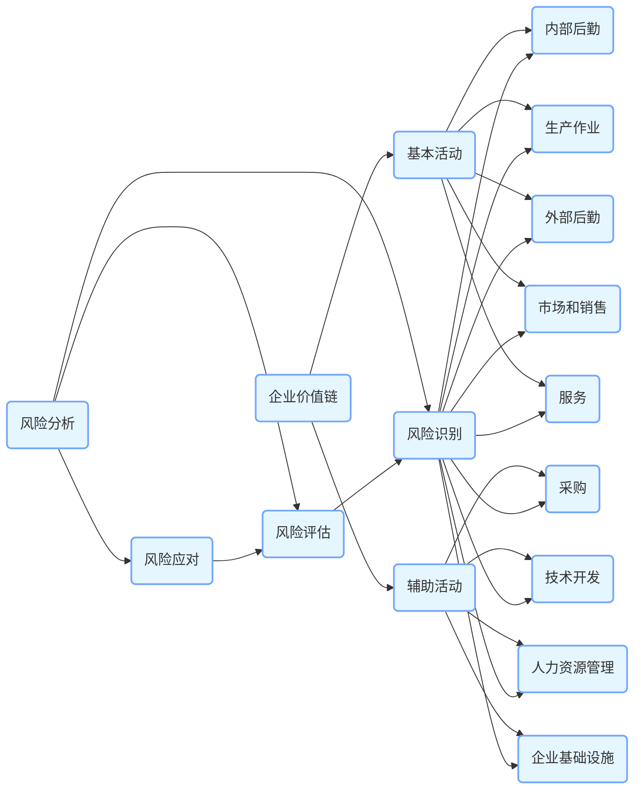

# AI辅助的企业价值链风险分析

> 关键词：AI、企业价值链、风险分析、机器学习、数据分析

> 摘要：本文聚焦于AI辅助的企业价值链风险分析。首先介绍了企业价值链风险分析的背景与重要性，阐述了AI在其中的关键作用。接着详细讲解了相关核心概念，包括企业价值链和风险分析的原理及联系，并通过Mermaid流程图展示。深入探讨了核心算法原理，结合Python代码进行说明，同时给出数学模型和公式。通过项目实战展示了如何运用AI进行企业价值链风险分析，包括开发环境搭建、源代码实现与解读。分析了AI辅助风险分析在不同场景下的实际应用，推荐了相关学习资源、开发工具框架及论文著作。最后总结了未来发展趋势与挑战，解答常见问题并提供扩展阅读和参考资料，旨在为企业有效利用AI进行价值链风险分析提供全面的指导和参考。

## 1. 背景介绍 
### 1.1 目的和范围
在当今竞争激烈且复杂多变的商业环境中，企业面临着来自内部和外部的各种风险。企业价值链涵盖了从原材料采购、生产制造、销售到售后服务等一系列活动，任何一个环节出现问题都可能影响企业的整体运营和竞争力。本研究的目的在于探讨如何利用AI技术辅助企业进行价值链风险分析，提高风险识别的准确性和及时性，为企业制定有效的风险应对策略提供支持。

本研究的范围包括对企业价值链各个环节风险的分析，以及AI技术在风险识别、评估和预警中的应用。重点关注机器学习、深度学习等AI算法在处理复杂数据和挖掘潜在风险方面的能力，同时考虑不同行业企业的特点和需求。

### 1.2 预期读者
本文的预期读者包括企业管理人员、风险管理专家、数据分析师、AI技术开发者以及对企业风险管理和AI应用感兴趣的研究人员。对于企业管理人员，本文可以帮助他们了解如何利用AI技术提升企业价值链的风险管理水平；对于技术人员，本文提供了具体的算法原理和代码实现，可作为技术实践的参考。

### 1.3 文档结构概述
本文将按照以下结构进行组织：首先介绍相关背景知识，包括目的、范围、预期读者等；接着阐述企业价值链和风险分析的核心概念及其联系，并通过流程图展示；然后深入讲解核心算法原理和具体操作步骤，结合Python代码进行说明；给出数学模型和公式，并进行详细讲解和举例；通过项目实战展示AI辅助企业价值链风险分析的具体实现过程；分析AI在不同实际应用场景中的作用；推荐相关的学习资源、开发工具框架和论文著作；最后总结未来发展趋势与挑战，解答常见问题并提供扩展阅读和参考资料。

### 1.4 术语表
#### 1.4.1 核心术语定义
- **企业价值链**：由美国学者迈克尔·波特提出，是指企业为了满足客户需求，创造价值而进行的一系列相互关联的活动，包括基本活动（如内部后勤、生产作业、外部后勤、市场和销售、服务）和辅助活动（如采购、技术开发、人力资源管理、企业基础设施）。
- **风险分析**：对可能影响企业目标实现的各种不确定性因素进行识别、评估和应对的过程。
- **AI（人工智能）**：研究如何使计算机系统能够模拟人类智能的学科和技术，包括机器学习、深度学习、自然语言处理等多个领域。
- **机器学习**：AI的一个分支，通过让计算机从数据中学习模式和规律，从而实现预测和决策的技术。
- **深度学习**：一种基于人工神经网络的机器学习技术，能够自动从大量数据中提取复杂的特征和模式。

#### 1.4.2 相关概念解释
- **数据挖掘**：从大量数据中发现有价值信息和知识的过程，常用于风险分析中挖掘潜在的风险因素。
- **预测分析**：利用历史数据和统计模型对未来事件进行预测的方法，在企业价值链风险分析中可用于预测风险发生的可能性和影响程度。
- **风险评估**：对识别出的风险进行量化和评价，确定风险的等级和优先级，以便企业采取相应的应对措施。

#### 1.4.3 缩略词列表
- **AI**：Artificial Intelligence（人工智能）
- **ML**：Machine Learning（机器学习）
- **DL**：Deep Learning（深度学习）
- **PCA**：Principal Component Analysis（主成分分析）
- **SVM**：Support Vector Machine（支持向量机）

## 2. 核心概念与联系 

### 企业价值链原理
企业价值链是企业创造价值的一系列活动的集合。基本活动直接参与产品或服务的生产和交付，辅助活动则为基本活动提供支持和保障。这些活动相互关联、相互影响，共同构成了企业的价值创造过程。例如，生产作业环节的效率和质量直接影响产品的成本和竞争力，而技术开发活动则可以为企业提供创新的产品和生产工艺，提升企业的核心竞争力。

### 风险分析原理
风险分析是一个系统性的过程，包括风险识别、风险评估和风险应对。风险识别是通过各种方法和手段，找出可能影响企业目标实现的风险因素；风险评估是对识别出的风险进行量化和评价，确定风险的可能性和影响程度；风险应对则是根据风险评估的结果，采取相应的措施来降低风险的影响。

### 企业价值链与风险分析的联系
企业价值链的各个环节都可能面临不同类型的风险，如市场风险、技术风险、运营风险等。风险分析可以帮助企业识别价值链中潜在的风险点，评估风险对企业价值创造的影响，从而采取针对性的措施来降低风险。例如，在采购环节，原材料价格波动、供应商违约等风险可能会影响企业的生产成本和生产进度；通过风险分析，企业可以提前制定应对策略，如与供应商签订长期合同、寻找替代供应商等。

### 文本示意图
企业价值链包括基本活动和辅助活动，基本活动从原材料采购开始，经过生产制造、销售，最终到售后服务；辅助活动贯穿整个价值链，为基本活动提供支持。风险分析则在价值链的各个环节进行，识别潜在风险，评估风险影响，并采取相应的应对措施。

### Mermaid流程图


## 3. 核心算法原理 & 具体操作步骤 

### 核心算法原理
在AI辅助的企业价值链风险分析中，常用的算法包括机器学习算法和深度学习算法。以下以支持向量机（SVM）和深度学习中的多层感知机（MLP）为例进行讲解。

#### 支持向量机（SVM）
支持向量机是一种二分类模型，其基本思想是在特征空间中找到一个最优的超平面，使得不同类别的样本能够被最大程度地分开。对于线性可分的数据集，SVM可以找到一个唯一的最优超平面；对于线性不可分的数据集，SVM可以通过核函数将数据映射到高维空间，使得数据在高维空间中线性可分。

#### 多层感知机（MLP）
多层感知机是一种前馈神经网络，由输入层、隐藏层和输出层组成。隐藏层可以有多个，每个神经元与上一层的所有神经元相连。MLP通过反向传播算法来调整神经元之间的权重，使得网络的输出与期望输出之间的误差最小。

### 具体操作步骤

#### 数据收集与预处理
首先，需要收集企业价值链相关的数据，包括生产数据、销售数据、财务数据等。然后对数据进行预处理，包括数据清洗、数据归一化、特征选择等操作。数据清洗是去除数据中的噪声和缺失值；数据归一化是将数据转换到相同的尺度上，以提高算法的性能；特征选择是从原始特征中选择出对风险分析有重要影响的特征。

#### 模型训练
将预处理后的数据分为训练集和测试集，使用训练集对模型进行训练。对于SVM模型，可以使用Python中的`sklearn`库进行训练；对于MLP模型，可以使用`Keras`或`PyTorch`等深度学习框架进行训练。

#### 模型评估
使用测试集对训练好的模型进行评估，常用的评估指标包括准确率、召回率、F1值等。根据评估结果，可以对模型进行调整和优化。

#### 风险预测
使用训练好的模型对新的数据进行风险预测，根据预测结果制定相应的风险应对策略。

### Python源代码实现

```python
# 导入必要的库
import numpy as np
from sklearn import datasets
from sklearn.model_selection import train_test_split
from sklearn.svm import SVC
from sklearn.metrics import accuracy_score
from keras.models import Sequential
from keras.layers import Dense

# 数据收集与预处理
# 以鸢尾花数据集为例
iris = datasets.load_iris()
X = iris.data
y = iris.target

# 划分训练集和测试集
X_train, X_test, y_train, y_test = train_test_split(X, y, test_size=0.3, random_state=42)

# 支持向量机模型训练
svm_model = SVC(kernel='linear')
svm_model.fit(X_train, y_train)

# 支持向量机模型预测
svm_pred = svm_model.predict(X_test)
svm_accuracy = accuracy_score(y_test, svm_pred)
print(f"SVM模型准确率: {svm_accuracy}")

# 多层感知机模型训练
mlp_model = Sequential()
mlp_model.add(Dense(10, input_dim=4, activation='relu'))
mlp_model.add(Dense(3, activation='softmax'))
mlp_model.compile(loss='sparse_categorical_crossentropy', optimizer='adam', metrics=['accuracy'])
mlp_model.fit(X_train, y_train, epochs=100, batch_size=10, verbose=0)

# 多层感知机模型预测
mlp_pred = np.argmax(mlp_model.predict(X_test), axis=1)
mlp_accuracy = accuracy_score(y_test, mlp_pred)
print(f"MLP模型准确率: {mlp_accuracy}")
```

## 4. 数学模型和公式 & 详细讲解 & 举例说明 

### 支持向量机数学模型和公式

#### 线性可分情况
对于线性可分的数据集，支持向量机的目标是找到一个最优的超平面 $w^T x + b = 0$，使得不同类别的样本能够被最大程度地分开。超平面的间隔可以表示为 $\frac{2}{\|w\|}$，支持向量机的优化问题可以表示为：

$$
\begin{aligned}
\min_{w, b} &\quad \frac{1}{2} \|w\|^2 \\
\text{s.t.} &\quad y_i (w^T x_i + b) \geq 1, \quad i = 1, 2, \cdots, n
\end{aligned}
$$

其中，$w$ 是超平面的法向量，$b$ 是偏置，$x_i$ 是第 $i$ 个样本，$y_i$ 是第 $i$ 个样本的标签（$y_i \in \{-1, 1\}$），$n$ 是样本数量。

#### 线性不可分情况
对于线性不可分的数据集，支持向量机引入了松弛变量 $\xi_i \geq 0$，允许部分样本被错误分类。优化问题变为：

$$
\begin{aligned}
\min_{w, b, \xi} &\quad \frac{1}{2} \|w\|^2 + C \sum_{i=1}^{n} \xi_i \\
\text{s.t.} &\quad y_i (w^T x_i + b) \geq 1 - \xi_i, \quad i = 1, 2, \cdots, n \\
&\quad \xi_i \geq 0, \quad i = 1, 2, \cdots, n
\end{aligned}
$$

其中，$C$ 是惩罚参数，用于控制错误分类的惩罚程度。

### 多层感知机数学模型和公式

#### 前向传播
多层感知机的前向传播过程可以表示为：

$$
\begin{aligned}
z^{(l)} &= W^{(l)} a^{(l-1)} + b^{(l)} \\
a^{(l)} &= f(z^{(l)})
\end{aligned}
$$

其中，$W^{(l)}$ 是第 $l$ 层的权重矩阵，$b^{(l)}$ 是第 $l$ 层的偏置向量，$a^{(l)}$ 是第 $l$ 层的输出，$z^{(l)}$ 是第 $l$ 层的输入，$f$ 是激活函数。

#### 反向传播
多层感知机的反向传播过程是通过计算误差的梯度来更新权重和偏置。误差的梯度可以表示为：

$$
\begin{aligned}
\delta^{(L)} &= \nabla_{z^{(L)}} J(a^{(L)}, y) \odot f'(z^{(L)}) \\
\delta^{(l)} &= (W^{(l+1)})^T \delta^{(l+1)} \odot f'(z^{(l)}) \\
\nabla_{W^{(l)}} J &= \delta^{(l)} (a^{(l-1)})^T \\
\nabla_{b^{(l)}} J &= \delta^{(l)}
\end{aligned}
$$

其中，$J$ 是损失函数，$L$ 是网络的层数，$\delta^{(l)}$ 是第 $l$ 层的误差梯度，$\odot$ 表示逐元素相乘。

### 举例说明
假设我们有一个简单的二分类问题，数据集包含两个特征 $x_1$ 和 $x_2$，标签 $y \in \{-1, 1\}$。对于支持向量机，我们可以通过求解上述优化问题找到一个最优的超平面，将不同类别的样本分开。对于多层感知机，我们可以通过前向传播和反向传播算法来训练网络，使得网络能够对新的样本进行分类。

## 5. 项目实战：代码实际案例和详细解释说明 

### 5.1  开发环境搭建
在进行AI辅助的企业价值链风险分析项目实战之前，需要搭建相应的开发环境。以下是具体的步骤：

#### 安装Python
首先，需要安装Python解释器。可以从Python官方网站（https://www.python.org/downloads/）下载适合自己操作系统的Python版本，并按照安装向导进行安装。

#### 安装必要的库
安装以下必要的Python库：
- `numpy`：用于数值计算。
- `pandas`：用于数据处理和分析。
- `sklearn`：用于机器学习算法的实现。
- `keras` 或 `PyTorch`：用于深度学习算法的实现。

可以使用以下命令进行安装：
```sh
pip install numpy pandas scikit-learn keras torch
```

#### 安装开发工具
可以选择使用集成开发环境（IDE）如PyCharm或Jupyter Notebook进行开发。PyCharm提供了丰富的代码编辑和调试功能，Jupyter Notebook则适合进行交互式的数据分析和模型训练。

### 5.2  源代码详细实现和代码解读

#### 数据收集与预处理
```python
import pandas as pd
from sklearn.preprocessing import StandardScaler
from sklearn.feature_selection import SelectKBest
from sklearn.feature_selection import f_classif

# 读取数据
data = pd.read_csv('enterprise_value_chain_data.csv')

# 分离特征和标签
X = data.drop('risk_label', axis=1)
y = data['risk_label']

# 数据清洗
X = X.dropna()

# 数据归一化
scaler = StandardScaler()
X_scaled = scaler.fit_transform(X)

# 特征选择
selector = SelectKBest(score_func=f_classif, k=10)
X_selected = selector.fit_transform(X_scaled, y)
```
代码解读：
- 首先使用`pandas`库读取企业价值链相关的数据。
- 分离特征和标签，将`risk_label`列作为标签，其余列作为特征。
- 进行数据清洗，去除包含缺失值的行。
- 使用`StandardScaler`对特征数据进行归一化处理，使得数据具有相同的尺度。
- 使用`SelectKBest`进行特征选择，选择得分最高的10个特征。

#### 模型训练
```python
from sklearn.model_selection import train_test_split
from sklearn.svm import SVC
from keras.models import Sequential
from keras.layers import Dense

# 划分训练集和测试集
X_train, X_test, y_train, y_test = train_test_split(X_selected, y, test_size=0.3, random_state=42)

# 支持向量机模型训练
svm_model = SVC(kernel='rbf')
svm_model.fit(X_train, y_train)

# 多层感知机模型训练
mlp_model = Sequential()
mlp_model.add(Dense(10, input_dim=10, activation='relu'))
mlp_model.add(Dense(1, activation='sigmoid'))
mlp_model.compile(loss='binary_crossentropy', optimizer='adam', metrics=['accuracy'])
mlp_model.fit(X_train, y_train, epochs=100, batch_size=10, verbose=0)
```
代码解读：
- 使用`train_test_split`将数据划分为训练集和测试集，测试集占比为30%。
- 训练支持向量机模型，使用径向基核函数（RBF）。
- 构建多层感知机模型，包含一个输入层、一个隐藏层和一个输出层，使用二元交叉熵损失函数和Adam优化器进行训练。

#### 模型评估
```python
from sklearn.metrics import accuracy_score, recall_score, f1_score

# 支持向量机模型评估
svm_pred = svm_model.predict(X_test)
svm_accuracy = accuracy_score(y_test, svm_pred)
svm_recall = recall_score(y_test, svm_pred)
svm_f1 = f1_score(y_test, svm_pred)
print(f"SVM模型准确率: {svm_accuracy}")
print(f"SVM模型召回率: {svm_recall}")
print(f"SVM模型F1值: {svm_f1}")

# 多层感知机模型评估
mlp_pred = (mlp_model.predict(X_test) > 0.5).astype(int)
mlp_accuracy = accuracy_score(y_test, mlp_pred)
mlp_recall = recall_score(y_test, mlp_pred)
mlp_f1 = f1_score(y_test, mlp_pred)
print(f"MLP模型准确率: {mlp_accuracy}")
print(f"MLP模型召回率: {mlp_recall}")
print(f"MLP模型F1值: {mlp_f1}")
```
代码解读：
- 使用`accuracy_score`、`recall_score`和`f1_score`对支持向量机和多层感知机模型进行评估，分别计算准确率、召回率和F1值。

### 5.3  代码解读与分析
通过上述代码，我们实现了一个完整的AI辅助企业价值链风险分析项目。首先对数据进行收集和预处理，包括数据清洗、归一化和特征选择，以提高数据的质量和模型的性能。然后使用支持向量机和多层感知机模型进行训练和预测，最后对模型进行评估。

在实际应用中，可以根据具体的需求和数据特点选择合适的算法和模型参数。例如，如果数据量较小，可以选择支持向量机模型；如果数据量较大且特征复杂，可以选择多层感知机等深度学习模型。同时，还可以使用交叉验证等技术来进一步优化模型的性能。

## 6. 实际应用场景 
### 制造业
在制造业中，企业价值链涵盖了原材料采购、生产制造、产品销售等多个环节。AI辅助的风险分析可以帮助企业识别原材料价格波动、供应商违约、生产设备故障等风险。例如，通过对历史采购数据和市场价格数据的分析，预测原材料价格的走势，提前制定采购策略；通过对生产设备的运行数据进行监测和分析，及时发现设备故障的隐患，减少停机时间。

### 零售业
零售业的价值链包括商品采购、库存管理、销售和客户服务等环节。AI可以帮助企业分析消费者行为和市场趋势，预测销售需求，优化库存管理。例如，通过对消费者的购买历史、浏览记录等数据的分析，推荐个性化的商品，提高客户满意度和销售额；通过对销售数据和库存数据的实时监测，及时调整库存水平，减少库存积压和缺货现象。

### 金融服务业
金融服务业的价值链涉及风险管理、信贷审批、投资决策等多个方面。AI可以用于风险评估和预警，帮助金融机构识别信用风险、市场风险和操作风险。例如，通过对客户的信用历史、财务状况等数据的分析，评估客户的信用风险，为信贷审批提供决策支持；通过对市场数据的实时监测和分析，预警市场风险，及时调整投资组合。

### 医疗保健业
医疗保健业的价值链包括医疗服务提供、药品研发、医疗器械生产等环节。AI可以辅助医疗风险分析，提高医疗质量和安全性。例如，通过对患者的病历数据、基因数据等的分析，预测疾病的发生风险，制定个性化的治疗方案；通过对医疗器械的使用数据进行监测和分析，及时发现设备故障和安全隐患。

## 7. 工具和资源推荐
### 7.1 学习资源推荐
#### 7.1.1 书籍推荐
- 《机器学习》（周志华）：全面介绍了机器学习的基本概念、算法和应用，是机器学习领域的经典教材。
- 《深度学习》（Ian Goodfellow、Yoshua Bengio和Aaron Courville）：深入讲解了深度学习的原理和技术，是深度学习领域的权威著作。
- 《Python数据分析实战》（韦斯·麦金尼）：介绍了使用Python进行数据分析的方法和技巧，包括数据处理、可视化和机器学习等方面。

#### 7.1.2 在线课程
- Coursera上的“机器学习”课程（Andrew Ng教授）：是机器学习领域的经典在线课程，涵盖了机器学习的基本概念、算法和应用。
- edX上的“深度学习”课程：由深度学习领域的知名学者授课，深入讲解了深度学习的原理和技术。
- 中国大学MOOC上的“人工智能基础”课程：介绍了人工智能的基本概念、技术和应用，适合初学者学习。

#### 7.1.3 技术博客和网站
- Medium：是一个技术博客平台，有很多关于AI、机器学习和数据分析的优质文章。
- Kaggle：是一个数据科学竞赛平台，提供了丰富的数据集和竞赛项目，可以学习到其他数据科学家的经验和技巧。
- 机器之心：是一个专注于人工智能领域的媒体平台，提供了最新的技术资讯和行业动态。

### 7.2 开发工具框架推荐
#### 7.2.1 IDE和编辑器
- PyCharm：是一款功能强大的Python集成开发环境，提供了代码编辑、调试、版本控制等功能。
- Jupyter Notebook：是一个交互式的数据分析和模型训练工具，适合快速验证想法和进行数据可视化。
- Visual Studio Code：是一款轻量级的代码编辑器，支持多种编程语言和插件扩展，可用于Python开发。

#### 7.2.2 调试和性能分析工具
- PySnooper：是一个简单易用的Python调试工具，可以自动记录函数的执行过程和变量的值。
- TensorBoard：是TensorFlow提供的可视化工具，可用于可视化模型的训练过程、性能指标等。
- cProfile：是Python标准库中的性能分析工具，可以分析代码的执行时间和函数调用情况。

#### 7.2.3 相关框架和库
- Scikit-learn：是一个简单易用的机器学习库，提供了多种机器学习算法和工具，适合初学者使用。
- Keras：是一个高级神经网络API，基于TensorFlow、Theano等后端，可快速搭建和训练深度学习模型。
- PyTorch：是一个开源的深度学习框架，具有动态计算图、易于调试等特点，广泛应用于学术界和工业界。

### 7.3 相关论文著作推荐
#### 7.3.1 经典论文
- “Support-Vector Networks”（Cortes和Vapnik）：介绍了支持向量机的基本原理和算法，是支持向量机领域的经典论文。
- “Gradient-Based Learning Applied to Document Recognition”（LeCun等）：介绍了卷积神经网络（CNN）的基本原理和应用，是深度学习领域的经典论文。
- “Long Short-Term Memory”（Hochreiter和Schmidhuber）：介绍了长短期记忆网络（LSTM）的基本原理和算法，是处理序列数据的经典论文。

#### 7.3.2 最新研究成果
- 关注顶级学术会议如NeurIPS、ICML、CVPR等的最新论文，了解AI领域的最新研究动态和技术进展。
- 查阅顶级学术期刊如Journal of Artificial Intelligence Research（JAIR）、Artificial Intelligence等的相关论文，获取高质量的研究成果。

#### 7.3.3 应用案例分析
- 分析一些知名企业的AI应用案例，如谷歌、亚马逊、阿里巴巴等，了解AI在不同行业的实际应用和效果。
- 参考一些专业的咨询报告和行业研究报告，获取AI在企业价值链风险分析等领域的应用案例和经验分享。

## 8. 总结：未来发展趋势与挑战
### 未来发展趋势
#### 更强大的AI技术应用
随着AI技术的不断发展，未来将有更强大的算法和模型应用于企业价值链风险分析。例如，强化学习可以用于动态优化企业的风险管理策略，对抗生成网络（GAN）可以用于数据增强和风险模拟。

#### 与其他技术的融合
AI将与物联网、区块链等技术深度融合，实现企业价值链数据的实时采集、传输和共享，提高风险分析的准确性和及时性。例如，物联网设备可以实时监测企业生产设备的运行状态，区块链技术可以保证数据的安全性和可信度。

#### 行业定制化解决方案
不同行业的企业价值链和风险特点存在差异，未来将出现更多针对特定行业的AI辅助风险分析解决方案。例如，针对制造业的智能工厂风险分析方案，针对金融服务业的智能风控方案等。

### 挑战
#### 数据质量和安全问题
AI辅助的风险分析依赖于大量的数据，数据的质量和安全直接影响模型的性能和企业的利益。如何保证数据的准确性、完整性和安全性是一个重要的挑战。

#### 模型解释性问题
许多AI模型如深度学习模型是黑盒模型，难以解释其决策过程和结果。在企业风险管理中，需要对风险分析结果进行解释和说明，以便企业管理人员做出决策。如何提高模型的解释性是一个亟待解决的问题。

#### 人才短缺问题
AI技术的应用需要具备专业知识和技能的人才，目前市场上AI人才短缺，企业难以招聘到合适的人才。如何培养和吸引AI人才是企业面临的一个挑战。

## 9. 附录：常见问题与解答
### 问题1：AI辅助的企业价值链风险分析需要多少数据？
解答：所需的数据量取决于具体的应用场景和算法模型。一般来说，数据量越大，模型的性能越好。但在实际应用中，需要根据数据的质量和特征进行合理的选择和处理。

### 问题2：如何选择合适的AI算法进行风险分析？
解答：选择合适的AI算法需要考虑数据的特点、问题的复杂度和应用场景等因素。例如，如果数据量较小，可以选择支持向量机、决策树等简单的算法；如果数据量较大且特征复杂，可以选择深度学习算法。

### 问题3：AI辅助的风险分析结果是否可靠？
解答：AI辅助的风险分析结果的可靠性取决于数据的质量、算法的选择和模型的训练等因素。在实际应用中，需要对模型进行评估和验证，结合专家经验和业务知识进行综合判断。

### 问题4：如何保证AI模型的安全性？
解答：保证AI模型的安全性需要从数据安全、模型安全和应用安全等多个方面入手。例如，对数据进行加密处理，采用安全的算法和框架，对模型进行定期的安全审计等。

## 10. 扩展阅读 & 参考资料
### 扩展阅读
- 《人工智能时代的企业转型》：介绍了AI技术对企业的影响和企业转型的策略。
- 《大数据与企业风险管理》：探讨了大数据技术在企业风险管理中的应用和挑战。

### 参考资料
- 迈克尔·波特. 《竞争优势》. 华夏出版社.
- 李开复. 《人工智能》. 文化发展出版社.
- 相关学术论文和研究报告，如IEEE、ACM等学术组织的论文。