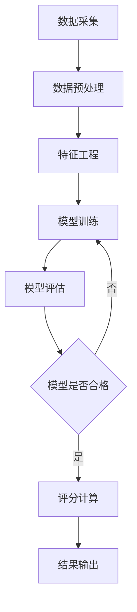

# AI辅助的公司治理评分系统

> 关键词：AI、公司治理、评分系统、机器学习、数据分析、企业评估、决策支持

> 摘要：本文围绕AI辅助的公司治理评分系统展开深入探讨。在当今复杂多变的商业环境下，公司治理的有效性对于企业的可持续发展至关重要。传统的公司治理评估方法往往存在主观性强、效率低下等问题。而借助AI技术构建的公司治理评分系统，能够利用大数据和先进的算法，客观、高效地对公司治理水平进行量化评估。文章详细介绍了该系统的背景、核心概念、算法原理、数学模型，通过项目实战展示了系统的实现过程，并探讨了其实际应用场景、推荐了相关工具和资源，最后对其未来发展趋势与挑战进行了总结，旨在为企业和相关从业者提供全面且深入的技术参考。

## 1. 背景介绍 

### 1.1 目的和范围
公司治理是现代企业制度的核心，它涉及到公司的战略决策、风险管理、利益相关者关系等多个方面。一个有效的公司治理结构能够提升企业的竞争力，保障股东和其他利益相关者的权益。然而，目前对于公司治理水平的评估缺乏统一、客观、高效的方法。本AI辅助的公司治理评分系统的目的在于开发一个基于先进AI技术的自动化评分系统，能够综合考虑多个维度的因素，对公司的治理水平进行量化评分。其范围涵盖了各类企业，包括上市公司、非上市公司、国有企业和民营企业等，旨在为投资者、监管机构、企业管理层等提供准确、可靠的公司治理评估信息。

### 1.2 预期读者
本文的预期读者包括但不限于以下几类人群：
- **企业管理者**：希望通过该系统了解自身公司的治理水平，发现潜在问题，优化公司治理结构，提升企业的运营效率和竞争力。
- **投资者**：在进行投资决策时，借助该系统的评分结果，评估目标企业的治理风险，做出更明智的投资选择。
- **监管机构**：利用系统的评分数据，对企业进行更有效的监管，维护市场秩序和投资者权益。
- **学术研究人员**：关注公司治理和AI技术的结合，对相关理论和实践进行深入研究。
- **技术开发者**：对开发类似的AI应用系统感兴趣，希望从本文中获取技术实现的思路和方法。

### 1.3 文档结构概述
本文将按照以下结构进行详细阐述：
- **核心概念与联系**：介绍公司治理评分系统的核心概念，包括公司治理的定义、评分系统的架构和工作原理，并通过文本示意图和Mermaid流程图进行直观展示。
- **核心算法原理 & 具体操作步骤**：深入讲解系统所采用的核心算法，如机器学习算法，并使用Python源代码详细阐述算法的实现过程和具体操作步骤。
- **数学模型和公式 & 详细讲解 & 举例说明**：给出系统所涉及的数学模型和公式，对其进行详细讲解，并通过具体的例子说明其应用。
- **项目实战：代码实际案例和详细解释说明**：通过一个实际的项目案例，展示系统的开发环境搭建、源代码实现和代码解读，帮助读者更好地理解系统的开发过程。
- **实际应用场景**：探讨AI辅助的公司治理评分系统在不同场景下的应用，如投资决策、企业内部管理、监管等。
- **工具和资源推荐**：推荐学习相关知识的资源，包括书籍、在线课程、技术博客和网站，以及开发过程中可以使用的工具、框架和相关论文著作。
- **总结：未来发展趋势与挑战**：对AI辅助的公司治理评分系统的未来发展趋势进行展望，并分析其面临的挑战。
- **附录：常见问题与解答**：解答读者在阅读和理解过程中可能遇到的常见问题。
- **扩展阅读 & 参考资料**：提供相关的扩展阅读材料和参考资料，方便读者进一步深入研究。

### 1.4 术语表

#### 1.4.1 核心术语定义
- **公司治理**：指通过一套包括正式或非正式的、内部或外部的制度或机制来协调公司与所有利益相关者之间的利益关系，以保证公司决策的科学性，从而最终维护公司各方面的利益。
- **AI（人工智能）**：是研究、开发用于模拟、延伸和扩展人的智能的理论、方法、技术及应用系统的一门新的技术科学。
- **评分系统**：是一种根据特定的规则和算法，对某个对象或事件进行量化评估并给出相应分数的系统。
- **机器学习**：是一门多领域交叉学科，涉及概率论、统计学、逼近论、凸分析、算法复杂度理论等多门学科。它专门研究计算机怎样模拟或实现人类的学习行为，以获取新的知识或技能，重新组织已有的知识结构使之不断改善自身的性能。

#### 1.4.2 相关概念解释
- **大数据**：指无法在一定时间范围内用常规软件工具进行捕捉、管理和处理的数据集合，是需要新处理模式才能具有更强的决策力、洞察发现力和流程优化能力的海量、高增长率和多样化的信息资产。在公司治理评分系统中，大数据可以提供丰富的企业信息，如财务数据、经营数据、市场数据等，为评分提供更全面的依据。
- **数据挖掘**：是指从大量的数据中通过算法搜索隐藏于其中信息的过程。在公司治理评分系统中，数据挖掘可以用于发现数据中的潜在模式和关系，为评分模型的构建提供支持。
- **模型训练**：是指使用已知的数据集对机器学习模型进行训练，使其学习数据中的规律和模式，从而能够对未知数据进行预测和分类的过程。在公司治理评分系统中，模型训练是构建评分模型的关键步骤。

#### 1.4.3 缩略词列表
- **AI**：Artificial Intelligence（人工智能）
- **ML**：Machine Learning（机器学习）
- **DL**：Deep Learning（深度学习）
- **PCA**：Principal Component Analysis（主成分分析）

## 2. 核心概念与联系 

### 核心概念原理
公司治理评分系统的核心原理是利用AI技术对公司治理相关的数据进行收集、整理、分析和挖掘，构建评分模型，从而对公司的治理水平进行量化评估。其主要步骤包括数据采集、数据预处理、特征工程、模型训练和评估、评分计算等。

- **数据采集**：从多个数据源收集与公司治理相关的数据，如财务报表、年报、公告、新闻资讯等。这些数据可以反映公司的股权结构、董事会组成、管理层行为、信息披露等方面的情况。
- **数据预处理**：对采集到的数据进行清洗、转换和归一化等处理，以去除噪声和异常值，提高数据的质量和可用性。
- **特征工程**：从预处理后的数据中提取有价值的特征，如财务指标、治理结构指标、市场表现指标等。这些特征将作为评分模型的输入。
- **模型训练和评估**：选择合适的机器学习算法，如决策树、随机森林、神经网络等，对提取的特征进行训练，构建评分模型。并使用测试数据集对模型进行评估，调整模型参数，提高模型的准确性和稳定性。
- **评分计算**：将待评估公司的特征数据输入到训练好的评分模型中，计算出该公司的治理评分。

### 架构的文本示意图
AI辅助的公司治理评分系统主要由以下几个部分组成：
- **数据层**：负责数据的采集和存储，包括公司内部数据、外部公开数据、社交媒体数据等。数据存储可以采用关系型数据库、非关系型数据库或数据仓库等。
- **处理层**：对采集到的数据进行预处理和特征工程，包括数据清洗、转换、归一化、特征提取和选择等。处理层可以使用数据挖掘工具和机器学习库来实现。
- **模型层**：选择合适的机器学习算法，对处理后的数据进行训练，构建评分模型。模型层可以使用开源的机器学习框架，如Scikit-learn、TensorFlow、PyTorch等。
- **应用层**：将训练好的评分模型应用到实际的公司治理评估中，为用户提供评分结果和相关的分析报告。应用层可以通过Web界面、移动应用或API等方式提供服务。

### Mermaid流程图


## 3. 核心算法原理 & 具体操作步骤 

### 核心算法原理
在AI辅助的公司治理评分系统中，我们可以使用多种机器学习算法，如决策树、随机森林、神经网络等。这里以随机森林算法为例进行详细讲解。

随机森林是一种集成学习算法，它通过组合多个决策树来提高模型的准确性和稳定性。随机森林的基本思想是：在训练过程中，从原始数据集中有放回地随机抽取多个子集，每个子集用于训练一棵决策树。在预测过程中，将待预测样本输入到每棵决策树中，得到多个预测结果，最后通过投票或平均的方式得到最终的预测结果。

### Python源代码详细阐述
以下是使用Python和Scikit-learn库实现随机森林算法的示例代码：

```python
import pandas as pd
from sklearn.ensemble import RandomForestRegressor
from sklearn.model_selection import train_test_split
from sklearn.metrics import mean_squared_error

# 加载数据
data = pd.read_csv('company_governance_data.csv')

# 分离特征和标签
X = data.drop('governance_score', axis=1)
y = data['governance_score']

# 划分训练集和测试集
X_train, X_test, y_train, y_test = train_test_split(X, y, test_size=0.2, random_state=42)

# 创建随机森林回归模型
rf_model = RandomForestRegressor(n_estimators=100, random_state=42)

# 训练模型
rf_model.fit(X_train, y_train)

# 预测
y_pred = rf_model.predict(X_test)

# 评估模型
mse = mean_squared_error(y_test, y_pred)
print(f"Mean Squared Error: {mse}")
```

### 具体操作步骤
1. **数据加载**：使用`pandas`库读取包含公司治理数据的CSV文件。
2. **特征和标签分离**：将数据集中的特征和标签分离，特征是用于训练模型的输入变量，标签是模型要预测的目标变量。
3. **数据集划分**：使用`train_test_split`函数将数据集划分为训练集和测试集，训练集用于模型的训练，测试集用于模型的评估。
4. **模型创建**：创建一个随机森林回归模型，设置`n_estimators`参数为100，表示使用100棵决策树。
5. **模型训练**：使用训练集对模型进行训练，调用`fit`方法。
6. **模型预测**：使用训练好的模型对测试集进行预测，调用`predict`方法。
7. **模型评估**：使用均方误差（MSE）评估模型的性能，调用`mean_squared_error`函数。

## 4. 数学模型和公式 & 详细讲解 & 举例说明 

### 随机森林的数学模型
随机森林的数学模型可以表示为：

$$\hat{y}(x) = \frac{1}{K}\sum_{k=1}^{K}f_k(x)$$

其中，$\hat{y}(x)$ 是随机森林对输入样本 $x$ 的预测结果，$K$ 是随机森林中决策树的数量，$f_k(x)$ 是第 $k$ 棵决策树对输入样本 $x$ 的预测结果。

### 详细讲解
随机森林通过集成多个决策树来提高模型的准确性和稳定性。每棵决策树都是在一个随机抽样的子集上进行训练的，并且在每个节点上随机选择一部分特征进行分裂。这样可以减少决策树之间的相关性，提高模型的泛化能力。

在预测过程中，将输入样本 $x$ 输入到每棵决策树中，得到 $K$ 个预测结果 $f_k(x)$。然后将这 $K$ 个预测结果进行平均，得到最终的预测结果 $\hat{y}(x)$。

### 举例说明
假设我们有一个随机森林模型，其中包含3棵决策树。对于一个输入样本 $x$，3棵决策树的预测结果分别为 $f_1(x) = 70$，$f_2(x) = 75$，$f_3(x) = 80$。则随机森林对该样本的预测结果为：

$$\hat{y}(x) = \frac{1}{3}(70 + 75 + 80) = 75$$

## 5. 项目实战：代码实际案例和详细解释说明 

### 5.1 开发环境搭建
在进行项目开发之前，需要搭建相应的开发环境。以下是具体的步骤：

1. **安装Python**：从Python官方网站（https://www.python.org/downloads/）下载并安装Python 3.x版本。
2. **安装必要的库**：使用`pip`命令安装所需的库，如`pandas`、`scikit-learn`、`numpy`等。

```bash
pip install pandas scikit-learn numpy
```

3. **选择开发工具**：可以选择使用集成开发环境（IDE），如PyCharm、Jupyter Notebook等。

### 5.2 源代码详细实现和代码解读
以下是一个完整的AI辅助的公司治理评分系统的实现代码：

```python
import pandas as pd
from sklearn.ensemble import RandomForestRegressor
from sklearn.model_selection import train_test_split
from sklearn.metrics import mean_squared_error
import matplotlib.pyplot as plt

# 加载数据
data = pd.read_csv('company_governance_data.csv')

# 数据预处理
# 处理缺失值
data = data.dropna()

# 分离特征和标签
X = data.drop('governance_score', axis=1)
y = data['governance_score']

# 划分训练集和测试集
X_train, X_test, y_train, y_test = train_test_split(X, y, test_size=0.2, random_state=42)

# 创建随机森林回归模型
rf_model = RandomForestRegressor(n_estimators=100, random_state=42)

# 训练模型
rf_model.fit(X_train, y_train)

# 预测
y_pred = rf_model.predict(X_test)

# 评估模型
mse = mean_squared_error(y_test, y_pred)
print(f"Mean Squared Error: {mse}")

# 可视化预测结果
plt.scatter(y_test, y_pred)
plt.xlabel('Actual Governance Score')
plt.ylabel('Predicted Governance Score')
plt.title('Actual vs Predicted Governance Score')
plt.show()
```

### 代码解读与分析
1. **数据加载**：使用`pandas`库的`read_csv`函数读取包含公司治理数据的CSV文件。
2. **数据预处理**：使用`dropna`函数处理数据中的缺失值，确保数据的完整性。
3. **特征和标签分离**：将数据集中的特征和标签分离，方便后续的模型训练和预测。
4. **数据集划分**：使用`train_test_split`函数将数据集划分为训练集和测试集，比例为8:2。
5. **模型创建**：创建一个随机森林回归模型，设置`n_estimators`参数为100。
6. **模型训练**：使用训练集对模型进行训练，调用`fit`方法。
7. **模型预测**：使用训练好的模型对测试集进行预测，调用`predict`方法。
8. **模型评估**：使用均方误差（MSE）评估模型的性能，调用`mean_squared_error`函数。
9. **可视化**：使用`matplotlib`库绘制实际治理评分和预测治理评分的散点图，直观地展示模型的预测效果。

## 6. 实际应用场景 

### 投资决策
投资者在进行投资决策时，需要评估目标企业的治理水平。AI辅助的公司治理评分系统可以为投资者提供客观、准确的公司治理评分，帮助投资者识别潜在的风险和机会。投资者可以根据评分结果，选择治理水平较高的企业进行投资，降低投资风险。

### 企业内部管理
企业管理层可以利用该系统对公司的治理水平进行自我评估，发现公司治理中存在的问题和不足。根据评分结果，企业可以制定相应的改进措施，优化公司治理结构，提高企业的运营效率和竞争力。

### 监管机构监管
监管机构可以使用该系统对企业进行全面、客观的评估，加强对企业的监管力度。通过对公司治理评分的监测，监管机构可以及时发现企业存在的违规行为和潜在风险，采取相应的监管措施，维护市场秩序和投资者权益。

### 学术研究
学术研究人员可以利用该系统提供的数据和评分结果，进行公司治理相关的学术研究。通过对大量企业的治理评分进行分析，研究人员可以深入了解公司治理的影响因素和作用机制，为公司治理理论的发展提供实证支持。

## 7. 工具和资源推荐

### 7.1 学习资源推荐

#### 7.1.1 书籍推荐
- 《Python机器学习》：本书全面介绍了Python在机器学习领域的应用，包括数据预处理、模型选择、算法实现等方面的内容，适合初学者和有一定基础的开发者阅读。
- 《机器学习实战》：通过实际案例详细讲解了机器学习的算法和应用，包括分类、回归、聚类等算法，让读者能够快速上手并应用到实际项目中。
- 《公司治理理论与实务》：系统地介绍了公司治理的基本理论、制度和实践，为读者提供了全面的公司治理知识体系。

#### 7.1.2 在线课程
- Coursera上的“机器学习”课程：由斯坦福大学教授Andrew Ng主讲，是机器学习领域的经典课程，内容涵盖了机器学习的基本概念、算法和应用。
- edX上的“数据科学与人工智能”课程：该课程结合了数据科学和人工智能的知识，通过实际案例和项目实践，帮助学习者掌握相关的技术和方法。
- 中国大学MOOC上的“公司治理”课程：由国内知名高校的教授授课，介绍了公司治理的理论和实践，适合对公司治理感兴趣的学习者。

#### 7.1.3 技术博客和网站
- Medium：是一个知名的技术博客平台，上面有很多关于AI、机器学习和公司治理的优秀文章，读者可以从中获取最新的技术动态和研究成果。
- Kaggle：是一个数据科学和机器学习竞赛平台，上面有很多公开的数据集和优秀的解决方案，读者可以通过参与竞赛和学习他人的经验，提高自己的技术水平。
- 中国知网：是国内最大的学术文献数据库，上面有很多关于公司治理和AI应用的学术论文，读者可以从中获取深入的学术研究成果。

### 7.2 开发工具框架推荐

#### 7.2.1 IDE和编辑器
- PyCharm：是一款专门为Python开发设计的集成开发环境，具有强大的代码编辑、调试和智能提示功能，适合专业的Python开发者使用。
- Jupyter Notebook：是一个基于Web的交互式开发环境，支持多种编程语言，如Python、R等。它可以方便地进行数据探索、模型训练和可视化，适合数据科学家和研究者使用。
- Visual Studio Code：是一款轻量级的代码编辑器，支持多种编程语言和插件扩展。它具有丰富的功能和良好的用户体验，适合初学者和快速开发场景。

#### 7.2.2 调试和性能分析工具
- PDB：是Python自带的调试工具，可以帮助开发者在代码中设置断点、单步执行、查看变量值等，方便调试代码。
- cProfile：是Python的性能分析工具，可以分析代码的执行时间和函数调用次数，帮助开发者找出代码中的性能瓶颈。
- TensorBoard：是TensorFlow的可视化工具，可以帮助开发者可视化模型的训练过程、参数分布和性能指标，方便进行模型调优。

#### 7.2.3 相关框架和库
- Scikit-learn：是一个简单易用的机器学习库，提供了丰富的机器学习算法和工具，如分类、回归、聚类等算法，以及数据预处理、模型选择等工具。
- TensorFlow：是一个开源的深度学习框架，由Google开发和维护。它提供了强大的计算能力和丰富的工具，适合开发大规模的深度学习模型。
- PyTorch：是一个基于Python的深度学习框架，具有动态计算图的特点，易于使用和调试。它在学术界和工业界都有广泛的应用。

### 7.3 相关论文著作推荐

#### 7.3.1 经典论文
- Jensen, M. C., & Meckling, W. H. (1976). Theory of the firm: Managerial behavior, agency costs and ownership structure. Journal of Financial Economics, 3(4), 305-360. 该论文提出了代理理论，阐述了公司治理中委托代理关系的问题和解决方法，是公司治理领域的经典文献。
- Fama, E. F., & Jensen, M. C. (1983). Separation of ownership and control. Journal of Law and Economics, 26(2), 301-325. 该论文探讨了公司所有权和控制权分离的问题，对公司治理结构的设计具有重要的指导意义。

#### 7.3.2 最新研究成果
- 可以关注顶级学术期刊，如《Journal of Financial Economics》、《Review of Financial Studies》、《Management Science》等，上面会发表关于公司治理和AI应用的最新研究成果。

#### 7.3.3 应用案例分析
- 可以参考一些商业案例书籍和报告，如《哈佛商业评论》、《麦肯锡季刊》等，上面会有关于公司治理和AI应用的实际案例分析，帮助读者了解如何将技术应用到实际业务中。

## 8. 总结：未来发展趋势与挑战

### 未来发展趋势
- **智能化程度不断提高**：随着AI技术的不断发展，公司治理评分系统将越来越智能化。系统将能够自动识别和处理复杂的公司治理问题，提供更加准确和个性化的评分结果和建议。
- **与其他技术融合**：公司治理评分系统将与区块链、物联网等技术融合，实现数据的安全共享和实时监测。例如，利用区块链技术可以确保数据的不可篡改和可追溯性，提高评分系统的可信度。
- **应用场景不断拓展**：除了投资决策、企业内部管理和监管等传统应用场景外，公司治理评分系统还将在社会责任评估、供应链管理等领域得到应用，为企业的可持续发展提供支持。

### 挑战
- **数据质量和隐私问题**：公司治理评分系统需要大量的高质量数据来支持模型的训练和评估。然而，数据的质量和隐私问题是一个挑战。数据可能存在不准确、不完整、不一致等问题，同时数据的隐私保护也需要得到重视。
- **模型可解释性问题**：AI模型，尤其是深度学习模型，往往具有较高的复杂度和黑盒性，模型的可解释性较差。在公司治理评分系统中，用户需要了解评分结果的依据和原因，因此模型的可解释性是一个亟待解决的问题。
- **技术更新换代快**：AI技术发展迅速，新的算法和模型不断涌现。公司治理评分系统需要不断更新和优化，以跟上技术的发展步伐。这对系统的开发和维护人员提出了更高的要求。

## 9. 附录：常见问题与解答

### 1. 如何确保数据的质量？
可以通过以下方法确保数据的质量：
- **数据清洗**：去除数据中的噪声、异常值和重复值。
- **数据验证**：对数据进行验证，确保数据的准确性和一致性。
- **数据补充**：对于缺失的数据，可以采用插值、填充等方法进行补充。
- **数据监控**：建立数据监控机制，及时发现和处理数据质量问题。

### 2. 如何提高模型的可解释性？
可以采用以下方法提高模型的可解释性：
- **选择可解释的模型**：如决策树、线性回归等模型，这些模型具有较高的可解释性。
- **特征重要性分析**：分析模型中各个特征的重要性，了解哪些特征对评分结果影响较大。
- **局部解释方法**：如LIME、SHAP等方法，可以对模型的预测结果进行局部解释，了解模型在某个样本上的决策依据。

### 3. 系统的性能如何优化？
可以从以下几个方面优化系统的性能：
- **数据优化**：选择合适的特征，减少数据的维度，提高数据的质量。
- **模型优化**：选择合适的算法和模型，调整模型的参数，提高模型的准确性和稳定性。
- **硬件优化**：使用高性能的硬件设备，如GPU、服务器等，提高系统的计算能力。
- **算法优化**：采用并行计算、分布式计算等技术，提高算法的执行效率。

## 10. 扩展阅读 & 参考资料

### 扩展阅读
- 《人工智能时代的公司治理变革》：探讨了AI技术对公司治理的影响和变革，为读者提供了新的思考视角。
- 《数据驱动的企业决策》：介绍了如何利用数据和AI技术进行企业决策，对公司治理评分系统的应用具有一定的参考价值。

### 参考资料
- 相关的学术论文、研究报告和书籍，如上文提到的经典论文和推荐书籍。
- 官方文档和技术博客，如Scikit-learn、TensorFlow、PyTorch等库的官方文档和相关技术博客。
- 行业标准和规范，如公司治理相关的法律法规和行业准则。