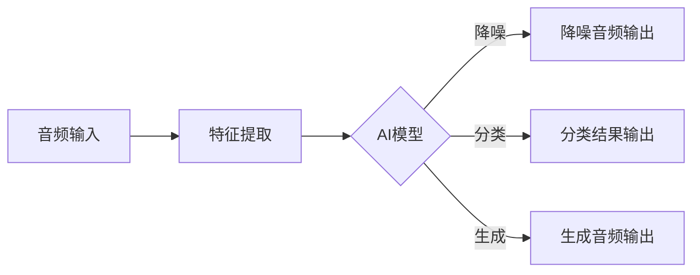

# AI辅助音频处理：从降噪到音乐生成

> 关键词：AI、音频处理、降噪、音乐生成、深度学习、信号处理、音频合成

> 摘要：本文深入探讨了AI在音频处理领域的应用，从基础的降噪技术到复杂的音乐生成过程。首先介绍了相关背景知识，包括音频处理的目的、预期读者和文档结构。接着详细阐述了核心概念、算法原理、数学模型等内容。通过实际项目案例展示了AI辅助音频处理的具体实现过程，并分析了其在不同场景下的应用。最后推荐了相关的学习资源、开发工具和论文著作，总结了未来发展趋势与挑战，为读者全面了解AI辅助音频处理提供了丰富且深入的知识体系。

## 1. 背景介绍 
### 1.1 目的和范围
音频处理在现代社会中有着广泛的应用，如通信、娱乐、安防等领域。随着AI技术的不断发展，其在音频处理中的作用日益重要。本文的目的在于全面介绍AI辅助音频处理的相关技术，涵盖从简单的降噪到复杂的音乐生成等多个方面。范围包括核心概念、算法原理、数学模型、实际应用案例以及相关工具和资源等内容，旨在为读者提供一个系统的学习和参考资料。

### 1.2 预期读者
本文预期读者包括对音频处理和AI技术感兴趣的科研人员、工程师、学生以及相关领域的从业者。无论是想要深入了解音频处理原理的初学者，还是希望在实际项目中应用AI技术进行音频处理的专业人士，都能从本文中获取有价值的信息。

### 1.3 文档结构概述
本文共分为十个部分。第一部分介绍背景信息，包括目的、预期读者和文档结构等。第二部分阐述核心概念与联系，通过文本示意图和Mermaid流程图展示相关原理和架构。第三部分讲解核心算法原理和具体操作步骤，结合Python源代码进行详细说明。第四部分介绍数学模型和公式，并举例说明。第五部分通过项目实战展示代码实际案例和详细解释。第六部分探讨实际应用场景。第七部分推荐相关的工具和资源。第八部分总结未来发展趋势与挑战。第九部分是附录，解答常见问题。第十部分提供扩展阅读和参考资料。

### 1.4 术语表
#### 1.4.1 核心术语定义
- **音频处理**：对音频信号进行采集、编辑、转换、增强等操作，以满足不同应用场景的需求。
- **降噪**：去除音频信号中不需要的噪声，提高音频质量。
- **音乐生成**：利用算法自动生成音乐作品，包括旋律、和声、节奏等元素。
- **深度学习**：一种基于人工神经网络的机器学习方法，在音频处理中具有强大的建模能力。
- **音频合成**：将不同的音频元素组合成新的音频信号的过程。

#### 1.4.2 相关概念解释
- **音频特征提取**：从音频信号中提取出具有代表性的特征，如频谱特征、时域特征等，用于后续的处理和分析。
- **卷积神经网络（CNN）**：一种常用的深度学习模型，在图像和音频处理中具有广泛的应用，通过卷积操作提取数据的局部特征。
- **循环神经网络（RNN）**：适用于处理序列数据，如音频信号，能够捕捉序列中的时间依赖关系。
- **生成对抗网络（GAN）**：由生成器和判别器组成的对抗性网络，在图像和音频生成领域取得了显著的成果。

#### 1.4.3 缩略词列表
- **AI**：Artificial Intelligence（人工智能）
- **CNN**：Convolutional Neural Network（卷积神经网络）
- **RNN**：Recurrent Neural Network（循环神经网络）
- **GAN**：Generative Adversarial Network（生成对抗网络）
- **STFT**：Short-Time Fourier Transform（短时傅里叶变换）

## 2. 核心概念与联系 
### 2.1 音频处理基础
音频信号本质上是随时间变化的连续波形，通常用数字信号表示。在数字音频处理中，音频信号被采样、量化和编码，转换为计算机能够处理的数字形式。音频处理的主要任务包括音频增强、音频编辑、音频分析等。

### 2.2 AI在音频处理中的应用
AI技术在音频处理中的应用主要基于机器学习和深度学习算法。通过对大量音频数据的学习，AI模型可以自动提取音频特征，进行分类、识别、降噪和生成等任务。例如，在降噪任务中，深度学习模型可以学习噪声的特征，从而将其从原始音频信号中分离出来；在音乐生成任务中，模型可以学习音乐的结构和规律，生成具有一定创意的音乐作品。

### 2.3 核心概念原理和架构的文本示意图
```plaintext
音频输入 --> 特征提取 --> AI模型（降噪、分类、生成等） --> 音频输出
```

### 2.4 Mermaid流程图


## 3. 核心算法原理 & 具体操作步骤 
### 3.1 音频降噪算法原理
音频降噪的目标是从含噪音频信号中恢复出原始的干净音频信号。一种常用的方法是基于深度学习的降噪算法，如深度神经网络（DNN）、卷积神经网络（CNN）等。这些模型通过学习大量的含噪音频和对应的干净音频对，来建立噪声和干净音频之间的映射关系。

#### 3.1.1 特征提取
在进行降噪处理之前，需要对音频信号进行特征提取。常用的特征包括频谱特征，如短时傅里叶变换（STFT）得到的幅度谱和相位谱。

```python
import librosa
import numpy as np

def extract_features(audio_path):
    audio, sr = librosa.load(audio_path)
    stft = librosa.stft(audio)
    magnitude = np.abs(stft)
    phase = np.angle(stft)
    return magnitude, phase, sr
```

#### 3.1.2 构建深度学习模型
以卷积神经网络为例，构建一个简单的降噪模型。

```python
import tensorflow as tf
from tensorflow.keras import layers

def build_denoising_model(input_shape):
    model = tf.keras.Sequential([
        layers.Conv2D(32, (3, 3), activation='relu', input_shape=input_shape),
        layers.MaxPooling2D((2, 2)),
        layers.Conv2D(64, (3, 3), activation='relu'),
        layers.MaxPooling2D((2, 2)),
        layers.Flatten(),
        layers.Dense(64, activation='relu'),
        layers.Dense(np.prod(input_shape), activation='sigmoid'),
        layers.Reshape(input_shape)
    ])
    model.compile(optimizer='adam', loss='mse')
    return model
```

#### 3.1.3 训练模型
使用准备好的训练数据对模型进行训练。

```python
# 假设已经有训练数据 X_train（含噪特征）和 y_train（干净特征）
input_shape = X_train[0].shape
model = build_denoising_model(input_shape)
model.fit(X_train, y_train, epochs=10, batch_size=32)
```

#### 3.1.4 降噪处理
使用训练好的模型对新的含噪音频进行降噪处理。

```python
def denoise_audio(model, magnitude, phase, sr):
    magnitude = np.expand_dims(magnitude, axis=0)
    magnitude = np.expand_dims(magnitude, axis=-1)
    denoised_magnitude = model.predict(magnitude)
    denoised_magnitude = np.squeeze(denoised_magnitude, axis=0)
    denoised_magnitude = np.squeeze(denoised_magnitude, axis=-1)
    denoised_stft = denoised_magnitude * np.exp(1j * phase)
    denoised_audio = librosa.istft(denoised_stft)
    return denoised_audio
```

### 3.2 音乐生成算法原理
音乐生成的目标是自动生成具有一定音乐性的音频序列。一种常用的方法是基于循环神经网络（RNN）或其变体，如长短期记忆网络（LSTM）。这些模型可以学习音乐的序列模式，生成新的音乐片段。

#### 3.2.1 数据预处理
将音乐数据转换为适合模型输入的格式，通常是将音乐表示为音符序列。

```python
import music21

def preprocess_music(music_path):
    score = music21.converter.parse(music_path)
    notes = []
    for element in score.flat.notes:
        if isinstance(element, music21.note.Note):
            notes.append(str(element.pitch))
        elif isinstance(element, music21.chord.Chord):
            notes.append('.'.join(str(n) for n in element.normalOrder))
    return notes
```

#### 3.2.2 构建RNN模型
```python
from tensorflow.keras.models import Sequential
from tensorflow.keras.layers import LSTM, Dense

def build_music_generation_model(input_shape, num_classes):
    model = Sequential()
    model.add(LSTM(256, input_shape=input_shape, return_sequences=True))
    model.add(LSTM(256))
    model.add(Dense(256, activation='relu'))
    model.add(Dense(num_classes, activation='softmax'))
    model.compile(loss='categorical_crossentropy', optimizer='adam')
    return model
```

#### 3.2.3 训练模型
```python
# 假设已经有训练数据 X_train（音符序列）和 y_train（对应的标签）
input_shape = X_train[0].shape
num_classes = len(set(notes))
model = build_music_generation_model(input_shape, num_classes)
model.fit(X_train, y_train, epochs=50, batch_size=64)
```

#### 3.2.4 音乐生成
```python
def generate_music(model, start_sequence, length):
    prediction_output = []
    for note_index in range(length):
        input_sequence = np.reshape(start_sequence, (1, len(start_sequence), 1))
        input_sequence = input_sequence / float(num_classes)
        prediction = model.predict(input_sequence, verbose=0)
        index = np.argmax(prediction)
        result = int_to_note[index]
        prediction_output.append(result)
        start_sequence.append(index)
        start_sequence = start_sequence[1:len(start_sequence)]
    return prediction_output
```

## 4. 数学模型和公式 & 详细讲解 & 举例说明 
### 4.1 短时傅里叶变换（STFT）
短时傅里叶变换是一种常用的音频特征提取方法，它将音频信号在时间上进行分段，对每一段信号进行傅里叶变换，从而得到信号的时频表示。

#### 4.1.1 数学公式
$$
X(m, k) = \sum_{n = 0}^{N - 1} x(n) w(n - mR) e^{-j \frac{2\pi}{N} k n}
$$
其中，$x(n)$ 是音频信号，$w(n)$ 是窗函数，$R$ 是帧移，$N$ 是窗口长度，$m$ 是帧索引，$k$ 是频率索引。

#### 4.1.2 详细讲解
STFT将音频信号 $x(n)$ 乘以一个窗函数 $w(n - mR)$ 进行加窗处理，然后对加窗后的信号进行离散傅里叶变换（DFT）。窗函数的作用是限制信号的长度，使得信号在局部范围内近似平稳，从而可以进行有效的频域分析。

#### 4.1.3 举例说明
假设我们有一个音频信号 $x(n)$，长度为 $1000$ 个采样点，窗函数 $w(n)$ 为汉宁窗，长度为 $256$ 个采样点，帧移 $R = 128$。我们可以计算 $m = 0$ 时的STFT系数 $X(0, k)$：

```python
import numpy as np
from scipy.signal import hanning

# 生成一个示例音频信号
x = np.random.randn(1000)
N = 256
R = 128
w = hanning(N)

# 计算m = 0时的STFT系数
windowed_signal = x[:N] * w
X_0 = np.fft.fft(windowed_signal)
```

### 4.2 均方误差（MSE）损失函数
在音频降噪任务中，常用均方误差（MSE）作为损失函数，用于衡量模型预测的干净音频特征与真实干净音频特征之间的差异。

#### 4.2.1 数学公式
$$
MSE = \frac{1}{n} \sum_{i = 1}^{n} (y_i - \hat{y}_i)^2
$$
其中，$y_i$ 是真实值，$\hat{y}_i$ 是预测值，$n$ 是样本数量。

#### 4.2.2 详细讲解
MSE损失函数通过计算预测值与真实值之间的平方误差的平均值来衡量模型的性能。平方误差的作用是放大预测值与真实值之间的差异，使得模型更加关注误差较大的样本。

#### 4.2.3 举例说明
假设我们有一组真实值 $y = [1, 2, 3]$ 和对应的预测值 $\hat{y} = [1.2, 1.8, 3.1]$，可以计算MSE：

```python
import numpy as np

y = np.array([1, 2, 3])
y_hat = np.array([1.2, 1.8, 3.1])
mse = np.mean((y - y_hat) ** 2)
print(mse)
```

### 4.3 交叉熵损失函数
在音乐生成任务中，常用交叉熵损失函数来衡量模型预测的音符概率分布与真实音符标签之间的差异。

#### 4.3.1 数学公式
对于多分类问题，交叉熵损失函数的公式为：
$$
H(p, q) = - \sum_{i = 1}^{C} p(i) \log(q(i))
$$
其中，$p(i)$ 是真实标签的概率分布，$q(i)$ 是模型预测的概率分布，$C$ 是类别数量。

#### 4.3.2 详细讲解
交叉熵损失函数通过计算真实标签的概率分布与模型预测的概率分布之间的差异来衡量模型的性能。当模型预测的概率分布与真实标签的概率分布越接近时，交叉熵损失越小。

#### 4.3.3 举例说明
假设我们有一个三分类问题，真实标签的概率分布 $p = [1, 0, 0]$，模型预测的概率分布 $q = [0.8, 0.1, 0.1]$，可以计算交叉熵损失：

```python
import numpy as np

p = np.array([1, 0, 0])
q = np.array([0.8, 0.1, 0.1])
cross_entropy = -np.sum(p * np.log(q))
print(cross_entropy)
```

## 5. 项目实战：代码实际案例和详细解释说明 
### 5.1  开发环境搭建
#### 5.1.1 安装Python
首先，确保你已经安装了Python 3.x版本。可以从Python官方网站（https://www.python.org/downloads/）下载并安装。

#### 5.1.2 安装必要的库
使用pip命令安装所需的库，包括librosa、tensorflow、music21等。

```sh
pip install librosa tensorflow music21
```

### 5.2  源代码详细实现和代码解读
#### 5.2.1 音频降噪项目
```python
import librosa
import numpy as np
import tensorflow as tf
from tensorflow.keras import layers

# 提取音频特征
def extract_features(audio_path):
    audio, sr = librosa.load(audio_path)
    stft = librosa.stft(audio)
    magnitude = np.abs(stft)
    phase = np.angle(stft)
    return magnitude, phase, sr

# 构建降噪模型
def build_denoising_model(input_shape):
    model = tf.keras.Sequential([
        layers.Conv2D(32, (3, 3), activation='relu', input_shape=input_shape),
        layers.MaxPooling2D((2, 2)),
        layers.Conv2D(64, (3, 3), activation='relu'),
        layers.MaxPooling2D((2, 2)),
        layers.Flatten(),
        layers.Dense(64, activation='relu'),
        layers.Dense(np.prod(input_shape), activation='sigmoid'),
        layers.Reshape(input_shape)
    ])
    model.compile(optimizer='adam', loss='mse')
    return model

# 降噪处理
def denoise_audio(model, magnitude, phase, sr):
    magnitude = np.expand_dims(magnitude, axis=0)
    magnitude = np.expand_dims(magnitude, axis=-1)
    denoised_magnitude = model.predict(magnitude)
    denoised_magnitude = np.squeeze(denoised_magnitude, axis=0)
    denoised_magnitude = np.squeeze(denoised_magnitude, axis=-1)
    denoised_stft = denoised_magnitude * np.exp(1j * phase)
    denoised_audio = librosa.istft(denoised_stft)
    return denoised_audio

# 主函数
if __name__ == "__main__":
    audio_path = "noisy_audio.wav"
    magnitude, phase, sr = extract_features(audio_path)
    input_shape = magnitude.shape + (1,)
    model = build_denoising_model(input_shape)
    # 假设已经有训练好的模型权重
    model.load_weights("denoising_model_weights.h5")
    denoised_audio = denoise_audio(model, magnitude, phase, sr)
    librosa.output.write_wav("denoised_audio.wav", denoised_audio, sr)
```

#### 代码解读
- `extract_features` 函数：使用librosa库读取音频文件，并计算其STFT的幅度谱和相位谱。
- `build_denoising_model` 函数：构建一个简单的卷积神经网络模型，用于音频降噪。
- `denoise_audio` 函数：使用训练好的模型对含噪音频的幅度谱进行预测，然后结合相位谱重构降噪后的音频信号。
- 主函数：读取含噪音频文件，提取特征，加载训练好的模型权重，进行降噪处理，并将降噪后的音频保存为文件。

#### 5.2.2 音乐生成项目
```python
import music21
import numpy as np
from tensorflow.keras.models import Sequential
from tensorflow.keras.layers import LSTM, Dense

# 预处理音乐数据
def preprocess_music(music_path):
    score = music21.converter.parse(music_path)
    notes = []
    for element in score.flat.notes:
        if isinstance(element, music21.note.Note):
            notes.append(str(element.pitch))
        elif isinstance(element, music21.chord.Chord):
            notes.append('.'.join(str(n) for n in element.normalOrder))
    return notes

# 构建音乐生成模型
def build_music_generation_model(input_shape, num_classes):
    model = Sequential()
    model.add(LSTM(256, input_shape=input_shape, return_sequences=True))
    model.add(LSTM(256))
    model.add(Dense(256, activation='relu'))
    model.add(Dense(num_classes, activation='softmax'))
    model.compile(loss='categorical_crossentropy', optimizer='adam')
    return model

# 生成音乐
def generate_music(model, start_sequence, length, int_to_note, num_classes):
    prediction_output = []
    for note_index in range(length):
        input_sequence = np.reshape(start_sequence, (1, len(start_sequence), 1))
        input_sequence = input_sequence / float(num_classes)
        prediction = model.predict(input_sequence, verbose=0)
        index = np.argmax(prediction)
        result = int_to_note[index]
        prediction_output.append(result)
        start_sequence.append(index)
        start_sequence = start_sequence[1:len(start_sequence)]
    return prediction_output

# 主函数
if __name__ == "__main__":
    music_path = "music.mid"
    notes = preprocess_music(music_path)
    pitchnames = sorted(set(item for item in notes))
    note_to_int = dict((note, number) for number, note in enumerate(pitchnames))
    int_to_note = dict((number, note) for number, note in enumerate(pitchnames))
    num_classes = len(set(notes))
    sequence_length = 100
    network_input = []
    for i in range(0, len(notes) - sequence_length, 1):
        sequence_in = notes[i:i + sequence_length]
        network_input.append([note_to_int[char] for char in sequence_in])
    network_input = np.array(network_input)
    input_shape = (network_input.shape[1], 1)
    model = build_music_generation_model(input_shape, num_classes)
    # 假设已经有训练好的模型权重
    model.load_weights("music_generation_model_weights.h5")
    start_sequence = network_input[0].tolist()
    generated_notes = generate_music(model, start_sequence, 500, int_to_note, num_classes)
    # 将生成的音符转换为音乐文件
    offset = 0
    output_notes = []
    for pattern in generated_notes:
        if ('.' in pattern) or pattern.isdigit():
            notes_in_chord = pattern.split('.')
            notes = []
            for current_note in notes_in_chord:
                new_note = music21.note.Note(int(current_note))
                new_note.storedInstrument = music21.instrument.Piano()
                notes.append(new_note)
            new_chord = music21.chord.Chord(notes)
            new_chord.offset = offset
            output_notes.append(new_chord)
        else:
            new_note = music21.note.Note(pattern)
            new_note.offset = offset
            new_note.storedInstrument = music21.instrument.Piano()
            output_notes.append(new_note)
        offset += 0.5
    midi_stream = music21.stream.Stream(output_notes)
    midi_stream.write('midi', fp='generated_music.mid')
```

#### 代码解读
- `preprocess_music` 函数：使用music21库读取音乐文件，将音乐表示为音符序列。
- `build_music_generation_model` 函数：构建一个基于LSTM的音乐生成模型。
- `generate_music` 函数：使用训练好的模型生成新的音乐音符序列。
- 主函数：读取音乐文件，预处理数据，构建模型，加载训练好的模型权重，生成音乐音符序列，并将其转换为音乐文件。

### 5.3  代码解读与分析
#### 5.3.1 音频降噪代码分析
- **特征提取**：通过STFT将音频信号转换为时频表示，便于模型处理。
- **模型构建**：使用卷积神经网络提取音频特征，通过多层卷积和池化操作学习音频的局部特征。
- **降噪处理**：模型预测含噪音频的幅度谱，结合原始相位谱重构降噪后的音频信号。

#### 5.3.2 音乐生成代码分析
- **数据预处理**：将音乐数据转换为音符序列，便于模型学习音乐的序列模式。
- **模型构建**：使用LSTM模型捕捉音乐序列中的时间依赖关系，通过多层LSTM和全连接层生成新的音乐音符。
- **音乐生成**：从一个起始音符序列开始，不断预测下一个音符，生成新的音乐片段。

## 6. 实际应用场景 
### 6.1 通信领域
在语音通信中，AI辅助音频处理的降噪技术可以有效去除背景噪声，提高语音的清晰度和可懂度，从而提升通信质量。例如，在电话会议、视频通话等场景中，降噪技术可以使参与者更加清晰地听到对方的声音，减少噪声干扰。

### 6.2 娱乐领域
- **音乐制作**：音乐生成技术可以为音乐创作者提供灵感和创意，辅助他们快速生成音乐草稿。例如，通过输入一些音乐风格和主题信息，AI模型可以生成相应的旋律、和声和节奏，创作者可以在此基础上进行进一步的创作和修改。
- **游戏音频**：AI可以根据游戏场景和玩家行为实时生成音频，增强游戏的沉浸感。例如，在冒险游戏中，当玩家进入不同的环境时，AI可以生成相应的背景音乐和环境音效，使游戏更加生动有趣。

### 6.3 安防领域
音频处理技术可以用于安防监控中的声音分析和识别。例如，通过对监控区域的音频信号进行处理和分析，可以检测到异常声音，如枪声、尖叫声等，并及时发出警报，提高安防监控的效率和准确性。

### 6.4 教育领域
- **语言学习**：AI辅助音频处理可以提供更加真实和自然的语音练习材料，帮助学习者提高听力和口语能力。例如，通过对语音进行合成和转换，可以生成不同口音和语速的语音，让学习者更好地适应各种语言环境。
- **音乐教育**：音乐生成技术可以为音乐教育提供新的教学工具和方法。例如，学生可以通过与AI音乐生成系统互动，学习音乐理论和创作技巧，提高音乐素养。

## 7. 工具和资源推荐
### 7.1 学习资源推荐
#### 7.1.1 书籍推荐
- 《深度学习》（Deep Learning）：由Ian Goodfellow、Yoshua Bengio和Aaron Courville所著，是深度学习领域的经典教材，涵盖了深度学习的基本概念、算法和应用。
- 《音频处理与分析》（Audio Processing and Analysis）：详细介绍了音频处理的基本原理和方法，包括音频特征提取、滤波、降噪等内容。
- 《音乐信息检索》（Music Information Retrieval）：介绍了音乐信息检索的相关技术和方法，包括音乐分类、检索、生成等内容。

#### 7.1.2 在线课程
- Coursera上的“深度学习专项课程”（Deep Learning Specialization）：由Andrew Ng教授授课，系统地介绍了深度学习的基本概念、算法和应用。
- edX上的“音频信号处理与分析”（Audio Signal Processing and Analysis）：介绍了音频信号处理的基本原理和方法，包括音频特征提取、滤波、降噪等内容。
- Udemy上的“音乐生成与AI”（Music Generation with AI）：详细介绍了使用AI技术进行音乐生成的方法和实践。

#### 7.1.3 技术博客和网站
- Medium：有许多关于AI和音频处理的技术博客，如Towards Data Science、The AI Blog等。
- arXiv：提供了大量的学术论文，包括AI和音频处理领域的最新研究成果。
- Kaggle：是一个数据科学竞赛平台，有许多关于音频处理的竞赛和数据集，可以帮助学习者提高实践能力。

### 7.2 开发工具框架推荐
#### 7.2.1 IDE和编辑器
- PyCharm：是一款专门为Python开发设计的集成开发环境，具有强大的代码编辑、调试和版本控制功能。
- Jupyter Notebook：是一个交互式的开发环境，适合进行数据探索、模型训练和可视化等工作。
- Visual Studio Code：是一款轻量级的代码编辑器，支持多种编程语言和插件，具有丰富的扩展功能。

#### 7.2.2 调试和性能分析工具
- TensorBoard：是TensorFlow提供的可视化工具，可以帮助开发者监控模型训练过程，分析模型性能。
- PyTorch Profiler：是PyTorch提供的性能分析工具，可以帮助开发者找出模型中的性能瓶颈，优化模型性能。
- Wireshark：是一款网络协议分析工具，可以用于分析音频通信中的网络流量，排查网络问题。

#### 7.2.3 相关框架和库
- TensorFlow：是一个开源的深度学习框架，提供了丰富的深度学习模型和工具，适用于音频处理中的各种任务。
- PyTorch：是另一个开源的深度学习框架，具有动态图和易于使用的特点，在音频处理领域也有广泛的应用。
- Librosa：是一个用于音频分析和处理的Python库，提供了丰富的音频特征提取和处理功能。
- Music21：是一个用于音乐分析和生成的Python库，提供了丰富的音乐理论和工具，适用于音乐生成和分析任务。

### 7.3 相关论文著作推荐
#### 7.3.1 经典论文
- “Generative Adversarial Nets”：由Ian Goodfellow等人发表，介绍了生成对抗网络（GAN）的基本原理和应用，在音频生成领域有重要的影响。
- “Long Short-Term Memory”：由Sepp Hochreiter和Jürgen Schmidhuber发表，介绍了长短期记忆网络（LSTM）的基本原理和应用，在处理序列数据方面具有重要的作用。
- “A Neural Algorithm of Artistic Style”：由Leon A. Gatys等人发表，介绍了一种基于神经网络的风格迁移算法，在音频风格迁移领域有一定的借鉴意义。

#### 7.3.2 最新研究成果
- 关注arXiv和顶级学术会议（如ICASSP、ISMIR等）上的最新研究成果，了解AI辅助音频处理领域的最新技术和方法。

#### 7.3.3 应用案例分析
- 分析一些实际应用案例，如Google的WaveNet、OpenAI的Jukebox等，了解AI在音频处理中的具体应用和实现方法。

## 8. 总结：未来发展趋势与挑战
### 8.1 未来发展趋势
#### 8.1.1 更强大的生成能力
未来的AI音乐生成技术将能够生成更加复杂、多样化和高质量的音乐作品，具有更强的创意和表现力。例如，能够生成具有独特风格和情感的音乐，满足不同用户的需求。

#### 8.1.2 跨模态融合
AI将与视觉、文本等其他模态的技术进行更深入的融合，实现多模态的音频处理和生成。例如，根据图像内容生成相应的音频描述或音乐，或者根据文本内容生成语音和音乐。

#### 8.1.3 个性化定制
AI将能够根据用户的个性化需求和偏好，生成定制化的音频内容。例如，根据用户的音乐口味生成个性化的音乐推荐和创作，或者根据用户的语音特征和需求生成定制化的语音助手。

#### 8.1.4 实时交互
AI音频处理技术将实现更加实时和高效的交互。例如，在游戏、虚拟现实等场景中，能够根据用户的实时行为和操作实时生成相应的音频，提供更加沉浸式的体验。

### 8.2 挑战
#### 8.2.1 数据质量和数量
AI模型的性能很大程度上依赖于数据的质量和数量。在音频处理领域，获取大规模、高质量的音频数据是一个挑战，尤其是对于一些特定领域和风格的音频数据。

#### 8.2.2 计算资源需求
深度学习模型通常需要大量的计算资源进行训练和推理。在处理大规模音频数据和复杂模型时，计算资源的需求会进一步增加，这对硬件设备和计算成本提出了更高的要求。

#### 8.2.3 伦理和法律问题
AI生成的音频内容可能会涉及到版权、隐私、虚假信息等伦理和法律问题。例如，AI生成的音乐可能会侵犯他人的版权，AI生成的语音可能会被用于虚假信息传播等。

#### 8.2.4 模型可解释性
深度学习模型通常是黑盒模型，其决策过程和内部机制难以理解和解释。在音频处理领域，模型的可解释性对于保证音频处理结果的可靠性和安全性至关重要。

## 9. 附录：常见问题与解答
### 9.1 音频降噪模型的训练数据如何获取？
可以通过以下几种方式获取音频降噪模型的训练数据：
- **公开数据集**：一些公开的音频数据集包含了含噪音频和对应的干净音频对，可以直接用于模型训练。
- **模拟数据**：通过在干净音频中添加不同类型和强度的噪声来生成模拟的含噪音频数据。
- **实际采集**：在实际场景中采集含噪音频和对应的干净音频数据。

### 9.2 音乐生成模型生成的音乐质量不高怎么办？
可以尝试以下几种方法提高音乐生成模型的质量：
- **增加训练数据**：使用更多的音乐数据进行模型训练，让模型学习更多的音乐模式和规律。
- **调整模型结构**：尝试不同的模型结构和参数，如增加LSTM层的层数、调整神经元数量等。
- **优化训练过程**：调整训练参数，如学习率、批次大小、训练轮数等，以提高模型的收敛速度和性能。
- **引入先验知识**：在模型中引入音乐理论和规则等先验知识，指导模型生成更符合音乐规律的音乐。

### 9.3 AI生成的音乐是否具有版权？
目前关于AI生成的音乐版权问题还存在争议。一般来说，如果AI生成的音乐是在人类的指导和参与下完成的，版权可能归属于人类创作者；如果AI完全自主生成音乐，版权归属则需要进一步的法律界定。

### 9.4 如何评估音频处理模型的性能？
可以使用以下几种指标评估音频处理模型的性能：
- **信噪比（SNR）**：用于衡量降噪模型的性能，SNR越高表示降噪效果越好。
- **均方误差（MSE）**：用于衡量模型预测值与真实值之间的差异，MSE越小表示模型性能越好。
- **主观评价**：通过人工试听的方式对音频处理结果进行主观评价，如清晰度、自然度等。

## 10. 扩展阅读 & 参考资料
### 10.1 扩展阅读
- 《人工智能：现代方法》（Artificial Intelligence: A Modern Approach）：全面介绍了人工智能的基本概念、算法和应用，是人工智能领域的经典教材。
- 《数字信号处理》（Digital Signal Processing）：详细介绍了数字信号处理的基本原理和方法，包括滤波、变换、频谱分析等内容。
- 《音乐理论基础》（Fundamentals of Music Theory）：介绍了音乐理论的基本概念和知识，包括音符、节拍、和弦、调式等内容。

### 10.2 参考资料
- Goodfellow, I., Bengio, Y., & Courville, A. (2016). Deep Learning. MIT Press.
- O'Shaugnessy, J. (1987). Speech Communication: Human and Machine. Addison-Wesley.
- Tzanetakis, G., & Cook, P. (2002). Musical genre classification of audio signals. IEEE Transactions on Speech and Audio Processing, 10(5), 293-302.