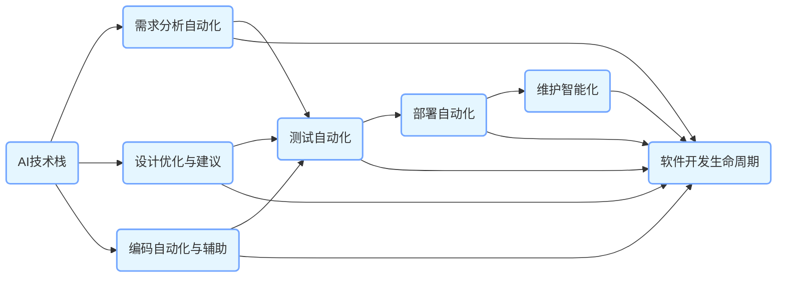

# AI驱动下的软件开发生命周期变革

> 关键词：AI、软件开发生命周期、变革、自动化、智能辅助、质量提升、效率优化

> 摘要：本文深入探讨了AI驱动下软件开发生命周期所发生的变革。在当今数字化时代，AI技术的飞速发展为软件开发生命周期的各个阶段带来了全新的机遇和挑战。文章首先介绍了软件开发生命周期变革的背景，包括目的、预期读者等内容。接着阐述了相关的核心概念与联系，详细讲解了核心算法原理及具体操作步骤，并通过数学模型和公式进行了理论支持。通过项目实战案例展示了AI在软件开发生命周期中的具体应用和效果。分析了AI在软件开发生命周期中的实际应用场景，推荐了相关的学习资源、开发工具框架和论文著作。最后对未来发展趋势与挑战进行了总结，同时给出了常见问题与解答以及扩展阅读和参考资料，旨在全面呈现AI对软件开发生命周期的深刻影响和变革。

## 1. 背景介绍 
### 1.1 目的和范围
随着人工智能技术的不断发展和成熟，其在各个领域的应用越来越广泛，软件开发生命周期也不例外。本文章的目的在于深入探讨AI技术如何驱动软件开发生命周期的变革，分析这种变革所带来的影响和机遇，以及面临的挑战。范围涵盖了软件开发生命周期的各个阶段，包括需求分析、设计、编码、测试、部署和维护等，旨在全面展示AI在整个软件开发生命周期中的作用和价值。

### 1.2 预期读者
本文预期读者包括软件开发者、软件架构师、项目经理、质量保证人员、人工智能研究人员以及对软件开发生命周期和人工智能技术感兴趣的相关人员。这些读者可以从文章中获取关于AI驱动下软件开发生命周期变革的全面信息，了解最新的技术趋势和应用实践，为自身的工作和研究提供参考和借鉴。

### 1.3 文档结构概述
本文将按照以下结构进行阐述：首先介绍背景信息，包括目的、预期读者和文档结构概述等；接着讲解核心概念与联系，通过文本示意图和Mermaid流程图展示相关概念的原理和架构；然后详细阐述核心算法原理和具体操作步骤，结合Python源代码进行说明；再通过数学模型和公式进行理论支持，并举例说明；之后通过项目实战案例展示AI在软件开发生命周期中的具体应用和效果；分析实际应用场景；推荐相关的学习资源、开发工具框架和论文著作；最后对未来发展趋势与挑战进行总结，同时给出常见问题与解答以及扩展阅读和参考资料。

### 1.4 术语表
#### 1.4.1 核心术语定义
- **AI（Artificial Intelligence）**：即人工智能，是指计算机系统能够执行通常需要人类智能才能完成的任务，如学习、推理、解决问题等。
- **软件开发生命周期（Software Development Life Cycle，SDLC）**：是指从软件项目的构思开始，经过需求分析、设计、编码、测试、部署和维护等阶段，直到软件项目结束的整个过程。
- **自动化（Automation）**：是指利用计算机技术和工具，自动执行软件开发生命周期中的某些任务，减少人工干预，提高效率和质量。
- **智能辅助（Intelligent Assistance）**：是指利用AI技术为软件开发者提供智能提示、建议和指导，帮助他们更好地完成软件开发任务。

#### 1.4.2 相关概念解释
- **机器学习（Machine Learning）**：是AI的一个重要分支，通过让计算机从数据中学习模式和规律，从而实现预测和决策等功能。在软件开发生命周期中，机器学习可以用于需求分析、缺陷预测、代码优化等方面。
- **自然语言处理（Natural Language Processing，NLP）**：是AI的另一个重要分支，主要研究如何让计算机理解和处理人类语言。在软件开发生命周期中，NLP可以用于需求文档分析、用户反馈处理等方面。
- **深度学习（Deep Learning）**：是机器学习的一种特殊形式，通过构建深度神经网络来学习数据的特征和模式。在软件开发生命周期中，深度学习可以用于图像识别、语音识别、代码生成等方面。

#### 1.4.3 缩略词列表
- **SDLC**：Software Development Life Cycle（软件开发生命周期）
- **AI**：Artificial Intelligence（人工智能）
- **ML**：Machine Learning（机器学习）
- **NLP**：Natural Language Processing（自然语言处理）
- **DL**：Deep Learning（深度学习）

## 2. 核心概念与联系 
### 核心概念原理

在AI驱动下的软件开发生命周期变革中，涉及到多个核心概念，它们相互关联，共同推动着软件开发生命周期的变革。

#### AI与自动化
AI技术为软件开发生命周期中的自动化提供了强大的支持。通过机器学习和深度学习算法，计算机可以自动学习软件开发生命周期中的各种模式和规律，从而实现对需求分析、设计、编码、测试等任务的自动化处理。例如，利用机器学习算法可以自动分析需求文档，提取关键信息，生成需求规格说明书；利用深度学习算法可以自动生成代码，提高编码效率。

#### AI与智能辅助
AI技术还可以为软件开发者提供智能辅助。通过自然语言处理技术，计算机可以理解开发者的问题和需求，提供智能提示、建议和指导。例如，当开发者在编写代码时遇到问题，智能辅助系统可以根据开发者输入的问题，提供相关的代码示例、解决方案和最佳实践。

#### 软件开发生命周期的各个阶段与AI
软件开发生命周期的各个阶段都可以受益于AI技术。在需求分析阶段，AI可以帮助分析用户需求，发现潜在的需求和问题；在设计阶段，AI可以提供设计建议，优化设计方案；在编码阶段，AI可以自动生成代码，提高编码效率和质量；在测试阶段，AI可以自动生成测试用例，发现软件中的缺陷；在部署和维护阶段，AI可以帮助监控软件的运行状态，及时发现和解决问题。

### 架构的文本示意图

```plaintext
AI驱动下的软件开发生命周期变革架构

                            +----------------+
                            |   AI技术栈     |
                            | (ML、DL、NLP等)|
                            +----------------+
                                  |
                                  v
+-------------------+     +-------------------+     +-------------------+
| 需求分析自动化    |     | 设计优化与建议    |     | 编码自动化与辅助  |
| (需求文档分析、    |     | (设计方案生成、    |     | (代码生成、智能    |
| 需求挖掘等)       |     | 设计模式推荐等)    |     | 提示等)          |
+-------------------+     +-------------------+     +-------------------+
                                  |
                                  v
+-------------------+     +-------------------+     +-------------------+
| 测试自动化        |     | 部署自动化        |     | 维护智能化        |
| (测试用例生成、    |     | (自动化部署脚本    |     | (故障预测、性能    |
| 缺陷预测等)       |     | 生成等)           |     | 优化等)          |
+-------------------+     +-------------------+     +-------------------+
                                  |
                                  v
                            +----------------+
                            | 软件开发生命周期 |
                            +----------------+
```

### Mermaid流程图



## 3. 核心算法原理 & 具体操作步骤 

### 核心算法原理

#### 机器学习算法在需求分析中的应用 - 文本分类算法
在需求分析阶段，我们可以使用文本分类算法对需求文档进行分类，以便更好地理解和管理需求。以朴素贝叶斯算法为例，它是一种基于贝叶斯定理的简单概率分类器，假设特征之间相互独立。

朴素贝叶斯算法的基本原理是通过计算每个类别的先验概率和每个特征在每个类别下的条件概率，然后根据贝叶斯定理计算后验概率，选择后验概率最大的类别作为预测结果。

贝叶斯定理的公式为：

$P(c|x)=\frac{P(x|c)P(c)}{P(x)}$

其中，$P(c|x)$ 是在给定特征 $x$ 的情况下，类别 $c$ 的后验概率；$P(x|c)$ 是在类别 $c$ 下，特征 $x$ 的条件概率；$P(c)$ 是类别 $c$ 的先验概率；$P(x)$ 是特征 $x$ 的先验概率。

#### 深度学习算法在代码生成中的应用 - 循环神经网络（RNN）
在编码阶段，我们可以使用循环神经网络（RNN）来生成代码。RNN是一种具有记忆功能的神经网络，它可以处理序列数据。

RNN的基本原理是通过在每个时间步上，将当前输入和上一个时间步的隐藏状态作为输入，计算当前时间步的隐藏状态和输出。RNN的隐藏状态可以保留之前时间步的信息，从而实现对序列数据的处理。

RNN的计算公式为：

$h_t = \tanh(W_{hh}h_{t-1} + W_{xh}x_t + b_h)$

$y_t = W_{hy}h_t + b_y$

其中，$h_t$ 是第 $t$ 个时间步的隐藏状态；$x_t$ 是第 $t$ 个时间步的输入；$W_{hh}$、$W_{xh}$、$W_{hy}$ 是权重矩阵；$b_h$、$b_y$ 是偏置向量；$\tanh$ 是激活函数。

### 具体操作步骤

#### 需求分析中的文本分类算法实现步骤
1. **数据收集和预处理**：收集需求文档数据，并进行预处理，包括去除停用词、词干提取等。
2. **特征提取**：将预处理后的文本数据转换为特征向量，例如使用词袋模型或TF-IDF算法。
3. **模型训练**：使用训练数据对朴素贝叶斯分类器进行训练。
4. **模型评估**：使用测试数据对训练好的模型进行评估，计算准确率、召回率等指标。
5. **模型应用**：使用训练好的模型对新的需求文档进行分类。

以下是使用Python实现朴素贝叶斯文本分类的示例代码：

```python
from sklearn.feature_extraction.text import TfidfVectorizer
from sklearn.naive_bayes import MultinomialNB
from sklearn.model_selection import train_test_split
from sklearn.metrics import accuracy_score

# 示例数据
documents = ["需求1：实现用户登录功能", "需求2：实现商品展示功能", "需求3：实现订单管理功能"]
labels = ["登录功能", "商品展示功能", "订单管理功能"]

# 数据预处理和特征提取
vectorizer = TfidfVectorizer()
X = vectorizer.fit_transform(documents)

# 划分训练集和测试集
X_train, X_test, y_train, y_test = train_test_split(X, labels, test_size=0.2, random_state=42)

# 模型训练
clf = MultinomialNB()
clf.fit(X_train, y_train)

# 模型评估
y_pred = clf.predict(X_test)
accuracy = accuracy_score(y_test, y_pred)
print(f"Accuracy: {accuracy}")

# 模型应用
new_document = ["需求4：实现用户注册功能"]
new_X = vectorizer.transform(new_document)
predicted_label = clf.predict(new_X)
print(f"Predicted label: {predicted_label[0]}")
```

#### 代码生成中的RNN实现步骤
1. **数据收集和预处理**：收集代码数据，并进行预处理，包括分词、构建词表等。
2. **序列构建**：将代码数据转换为序列数据，例如将代码按行分割成序列。
3. **模型构建**：构建RNN模型，包括定义模型的层数、神经元数量等。
4. **模型训练**：使用训练数据对RNN模型进行训练。
5. **模型评估**：使用测试数据对训练好的模型进行评估，计算损失值等指标。
6. **代码生成**：使用训练好的模型生成代码。

以下是使用Python和Keras实现简单RNN代码生成的示例代码：

```python
from keras.models import Sequential
from keras.layers import SimpleRNN, Dense
import numpy as np

# 示例数据
text = "abcdefghijklmnopqrstuvwxyz"
chars = sorted(list(set(text)))
char_indices = dict((c, i) for i, c in enumerate(chars))
indices_char = dict((i, c) for i, c in enumerate(chars))

maxlen = 3
step = 1
sentences = []
next_chars = []
for i in range(0, len(text) - maxlen, step):
    sentences.append(text[i: i + maxlen])
    next_chars.append(text[i + maxlen])

X = np.zeros((len(sentences), maxlen, len(chars)), dtype=np.bool)
y = np.zeros((len(sentences), len(chars)), dtype=np.bool)
for i, sentence in enumerate(sentences):
    for t, char in enumerate(sentence):
        X[i, t, char_indices[char]] = 1
    y[i, char_indices[next_chars[i]]] = 1

# 模型构建
model = Sequential()
model.add(SimpleRNN(128, input_shape=(maxlen, len(chars))))
model.add(Dense(len(chars), activation='softmax'))

model.compile(loss='categorical_crossentropy', optimizer='adam')

# 模型训练
model.fit(X, y, batch_size=128, epochs=100)

# 代码生成
def sample(preds, temperature=1.0):
    preds = np.asarray(preds).astype('float64')
    preds = np.log(preds) / temperature
    exp_preds = np.exp(preds)
    preds = exp_preds / np.sum(exp_preds)
    probas = np.random.multinomial(1, preds, 1)
    return np.argmax(probas)

start_index = np.random.randint(0, len(text) - maxlen)
generated = ''
sentence = text[start_index: start_index + maxlen]
generated += sentence
print('----- Generating with seed: "' + sentence + '"')

for i in range(400):
    x_pred = np.zeros((1, maxlen, len(chars)))
    for t, char in enumerate(sentence):
        x_pred[0, t, char_indices[char]] = 1.

    preds = model.predict(x_pred, verbose=0)[0]
    next_index = sample(preds, 0.2)
    next_char = indices_char[next_index]

    generated += next_char
    sentence = sentence[1:] + next_char

print(generated)
```

## 4. 数学模型和公式 & 详细讲解 & 举例说明 

### 朴素贝叶斯算法的数学模型和公式

#### 详细讲解
朴素贝叶斯算法基于贝叶斯定理，假设特征之间相互独立。在文本分类中，我们将文本看作是由一系列特征（词语）组成的，每个特征的出现是相互独立的。

贝叶斯定理的公式为：

$P(c|x)=\frac{P(x|c)P(c)}{P(x)}$

其中，$P(c|x)$ 是在给定特征 $x$ 的情况下，类别 $c$ 的后验概率；$P(x|c)$ 是在类别 $c$ 下，特征 $x$ 的条件概率；$P(c)$ 是类别 $c$ 的先验概率；$P(x)$ 是特征 $x$ 的先验概率。

在实际应用中，由于 $P(x)$ 对于所有类别都是相同的，因此我们可以忽略 $P(x)$，只需要比较 $P(x|c)P(c)$ 的大小，选择最大的类别作为预测结果。

#### 举例说明
假设我们有一个文本分类问题，要将文本分为“体育”和“科技”两个类别。我们有以下训练数据：

| 文本 | 类别 |
| --- | --- |
| 篮球比赛很精彩 | 体育 |
| 手机性能很强 | 科技 |
| 足球比赛很激烈 | 体育 |
| 电脑软件很实用 | 科技 |

我们可以计算每个类别的先验概率：

$P(体育)=\frac{2}{4}=0.5$

$P(科技)=\frac{2}{4}=0.5$

然后计算每个特征在每个类别下的条件概率：

对于“篮球”这个特征：

$P(篮球|体育)=\frac{1}{2}=0.5$

$P(篮球|科技)=0$

对于“手机”这个特征：

$P(手机|体育)=0$

$P(手机|科技)=\frac{1}{2}=0.5$

现在我们有一个新的文本“篮球手机”，我们可以计算它属于每个类别的概率：

$P(体育|篮球手机)=P(篮球|体育)P(手机|体育)P(体育)=0.5\times0\times0.5=0$

$P(科技|篮球手机)=P(篮球|科技)P(手机|科技)P(科技)=0\times0.5\times0.5=0$

由于两个概率都为0，我们可以根据其他特征或者调整算法来进行分类。

### 循环神经网络（RNN）的数学模型和公式

#### 详细讲解
循环神经网络（RNN）是一种具有记忆功能的神经网络，它可以处理序列数据。RNN的基本结构包括输入层、隐藏层和输出层。

RNN的计算公式为：

$h_t = \tanh(W_{hh}h_{t-1} + W_{xh}x_t + b_h)$

$y_t = W_{hy}h_t + b_y$

其中，$h_t$ 是第 $t$ 个时间步的隐藏状态；$x_t$ 是第 $t$ 个时间步的输入；$W_{hh}$、$W_{xh}$、$W_{hy}$ 是权重矩阵；$b_h$、$b_y$ 是偏置向量；$\tanh$ 是激活函数。

#### 举例说明
假设我们有一个简单的RNN，输入层有2个神经元，隐藏层有3个神经元，输出层有1个神经元。我们有一个输入序列 $x = [x_1, x_2, x_3]$，初始隐藏状态 $h_0 = [0, 0, 0]$。

首先，计算第一个时间步的隐藏状态 $h_1$：

$h_1 = \tanh(W_{hh}h_0 + W_{xh}x_1 + b_h)$

假设 $W_{hh}=\begin{bmatrix}0.1 & 0.2 & 0.3\\0.4 & 0.5 & 0.6\\0.7 & 0.8 & 0.9\end{bmatrix}$，$W_{xh}=\begin{bmatrix}0.1 & 0.2\\0.3 & 0.4\\0.5 & 0.6\end{bmatrix}$，$b_h = [0.1, 0.2, 0.3]$，$x_1 = [1, 2]$，$h_0 = [0, 0, 0]$。

$W_{hh}h_0=\begin{bmatrix}0.1 & 0.2 & 0.3\\0.4 & 0.5 & 0.6\\0.7 & 0.8 & 0.9\end{bmatrix}\begin{bmatrix}0\\0\\0\end{bmatrix}=\begin{bmatrix}0\\0\\0\end{bmatrix}$

$W_{xh}x_1=\begin{bmatrix}0.1 & 0.2\\0.3 & 0.4\\0.5 & 0.6\end{bmatrix}\begin{bmatrix}1\\2\end{bmatrix}=\begin{bmatrix}0.1\times1 + 0.2\times2\\0.3\times1 + 0.4\times2\\0.5\times1 + 0.6\times2\end{bmatrix}=\begin{bmatrix}0.5\\1.1\\1.7\end{bmatrix}$

$W_{hh}h_0 + W_{xh}x_1 + b_h=\begin{bmatrix}0\\0\\0\end{bmatrix}+\begin{bmatrix}0.5\\1.1\\1.7\end{bmatrix}+\begin{bmatrix}0.1\\0.2\\0.3\end{bmatrix}=\begin{bmatrix}0.6\\1.3\\2\end{bmatrix}$

$h_1 = \tanh\begin{bmatrix}0.6\\1.3\\2\end{bmatrix}=\begin{bmatrix}\tanh(0.6)\\\tanh(1.3)\\\tanh(2)\end{bmatrix}\approx\begin{bmatrix}0.537\\0.862\\0.964\end{bmatrix}$

然后，计算第一个时间步的输出 $y_1$：

$y_1 = W_{hy}h_1 + b_y$

假设 $W_{hy} = [0.1, 0.2, 0.3]$，$b_y = 0.1$。

$W_{hy}h_1 = [0.1, 0.2, 0.3]\begin{bmatrix}0.537\\0.862\\0.964\end{bmatrix}=0.1\times0.537 + 0.2\times0.862 + 0.3\times0.964 = 0.525$

$y_1 = 0.525 + 0.1 = 0.625$

以此类推，我们可以计算出后续时间步的隐藏状态和输出。

## 5. 项目实战：代码实际案例和详细解释说明 

### 5.1  开发环境搭建
#### 操作系统
我们可以选择Windows、Linux或macOS作为开发操作系统。这里以Ubuntu 20.04为例进行说明。

#### 编程语言和环境
我们使用Python作为开发语言，建议使用Python 3.7及以上版本。可以通过以下命令安装Python：

```bash
sudo apt update
sudo apt install python3 python3-pip
```

#### 开发工具
我们可以使用PyCharm或VS Code作为开发工具。这里以VS Code为例，安装VS Code并安装Python扩展。

#### 相关库和框架
我们需要安装一些相关的库和框架，如Scikit-learn、Keras、TensorFlow等。可以使用以下命令进行安装：

```bash
pip install scikit-learn keras tensorflow
```

### 5.2  源代码详细实现和代码解读
#### 需求分析自动化 - 文本分类
以下是一个完整的需求分析自动化文本分类的代码示例：

```python
from sklearn.feature_extraction.text import TfidfVectorizer
from sklearn.naive_bayes import MultinomialNB
from sklearn.model_selection import train_test_split
from sklearn.metrics import accuracy_score

# 示例数据
documents = ["需求1：实现用户登录功能", "需求2：实现商品展示功能", "需求3：实现订单管理功能", "需求4：实现用户注册功能"]
labels = ["登录功能", "商品展示功能", "订单管理功能", "注册功能"]

# 数据预处理和特征提取
vectorizer = TfidfVectorizer()
X = vectorizer.fit_transform(documents)

# 划分训练集和测试集
X_train, X_test, y_train, y_test = train_test_split(X, labels, test_size=0.2, random_state=42)

# 模型训练
clf = MultinomialNB()
clf.fit(X_train, y_train)

# 模型评估
y_pred = clf.predict(X_test)
accuracy = accuracy_score(y_test, y_pred)
print(f"Accuracy: {accuracy}")

# 模型应用
new_document = ["需求5：实现用户信息修改功能"]
new_X = vectorizer.transform(new_document)
predicted_label = clf.predict(new_X)
print(f"Predicted label: {predicted_label[0]}")
```

#### 代码解读
1. **数据准备**：定义了示例需求文档和对应的标签。
2. **特征提取**：使用TfidfVectorizer将文本数据转换为TF-IDF特征向量。
3. **数据划分**：使用train_test_split将数据划分为训练集和测试集。
4. **模型训练**：使用MultinomialNB训练朴素贝叶斯分类器。
5. **模型评估**：使用accuracy_score计算模型的准确率。
6. **模型应用**：使用训练好的模型对新的需求文档进行分类。

#### 代码生成 - RNN
以下是一个完整的代码生成RNN的代码示例：

```python
from keras.models import Sequential
from keras.layers import SimpleRNN, Dense
import numpy as np

# 示例数据
text = "abcdefghijklmnopqrstuvwxyz"
chars = sorted(list(set(text)))
char_indices = dict((c, i) for i, c in enumerate(chars))
indices_char = dict((i, c) for i, c in enumerate(chars))

maxlen = 3
step = 1
sentences = []
next_chars = []
for i in range(0, len(text) - maxlen, step):
    sentences.append(text[i: i + maxlen])
    next_chars.append(text[i + maxlen])

X = np.zeros((len(sentences), maxlen, len(chars)), dtype=np.bool)
y = np.zeros((len(sentences), len(chars)), dtype=np.bool)
for i, sentence in enumerate(sentences):
    for t, char in enumerate(sentence):
        X[i, t, char_indices[char]] = 1
    y[i, char_indices[next_chars[i]]] = 1

# 模型构建
model = Sequential()
model.add(SimpleRNN(128, input_shape=(maxlen, len(chars))))
model.add(Dense(len(chars), activation='softmax'))

model.compile(loss='categorical_crossentropy', optimizer='adam')

# 模型训练
model.fit(X, y, batch_size=128, epochs=100)

# 代码生成
def sample(preds, temperature=1.0):
    preds = np.asarray(preds).astype('float64')
    preds = np.log(preds) / temperature
    exp_preds = np.exp(preds)
    preds = exp_preds / np.sum(exp_preds)
    probas = np.random.multinomial(1, preds, 1)
    return np.argmax(probas)

start_index = np.random.randint(0, len(text) - maxlen)
generated = ''
sentence = text[start_index: start_index + maxlen]
generated += sentence
print('----- Generating with seed: "' + sentence + '"')

for i in range(400):
    x_pred = np.zeros((1, maxlen, len(chars)))
    for t, char in enumerate(sentence):
        x_pred[0, t, char_indices[char]] = 1.

    preds = model.predict(x_pred, verbose=0)[0]
    next_index = sample(preds, 0.2)
    next_char = indices_char[next_index]

    generated += next_char
    sentence = sentence[1:] + next_char

print(generated)
```

#### 代码解读
1. **数据准备**：定义了示例文本数据，并将其转换为序列数据。
2. **数据预处理**：将文本数据转换为独热编码的特征向量。
3. **模型构建**：使用Keras构建一个简单的RNN模型。
4. **模型编译**：使用categorical_crossentropy作为损失函数，adam作为优化器。
5. **模型训练**：使用fit方法训练模型。
6. **代码生成**：定义了一个sample函数来采样下一个字符，并使用训练好的模型生成代码。

### 5.3  代码解读与分析
#### 需求分析自动化 - 文本分类
- **优点**：使用朴素贝叶斯算法进行文本分类简单高效，对于小规模数据有较好的效果。TF-IDF特征提取可以有效地表示文本的特征。
- **缺点**：朴素贝叶斯算法假设特征之间相互独立，在实际应用中可能不成立。对于大规模数据，可能需要更复杂的模型。
- **改进方向**：可以尝试使用更复杂的模型，如深度学习模型，来提高分类准确率。可以进行更复杂的数据预处理，如去除停用词、词干提取等。

#### 代码生成 - RNN
- **优点**：RNN可以处理序列数据，能够学习到序列中的模式和规律，适合代码生成任务。
- **缺点**：RNN存在梯度消失和梯度爆炸问题，对于长序列数据的处理效果可能不佳。
- **改进方向**：可以使用更高级的RNN变体，如LSTM或GRU，来解决梯度问题。可以增加训练数据和训练时间，提高模型的性能。

## 6. 实际应用场景 
### 需求分析阶段
- **需求挖掘**：AI可以通过分析用户的历史数据、行为日志等，挖掘潜在的用户需求。例如，通过分析用户在电商平台上的浏览记录和购买记录，挖掘用户对新产品的需求。
- **需求文档分析**：AI可以自动分析需求文档，提取关键信息，生成需求规格说明书。例如，使用自然语言处理技术分析需求文档中的文本内容，提取需求的功能描述、性能要求等信息。

### 设计阶段
- **设计方案生成**：AI可以根据需求分析的结果，生成多种设计方案供开发者选择。例如，使用机器学习算法分析类似项目的设计方案，生成适合当前项目的设计方案。
- **设计模式推荐**：AI可以根据项目的特点和需求，推荐合适的设计模式。例如，使用深度学习算法学习各种设计模式的应用场景，为开发者推荐合适的设计模式。

### 编码阶段
- **代码生成**：AI可以根据需求和设计，自动生成代码。例如，使用深度学习算法学习大量的代码样本，生成符合需求的代码。
- **智能提示**：AI可以为开发者提供智能提示，帮助他们更快地编写代码。例如，当开发者在编写代码时，智能提示系统可以根据上下文提供相关的代码建议和补全。

### 测试阶段
- **测试用例生成**：AI可以根据软件的功能和结构，自动生成测试用例。例如，使用机器学习算法分析软件的代码结构和功能需求，生成覆盖各种情况的测试用例。
- **缺陷预测**：AI可以通过分析软件的历史数据和代码特征，预测软件中可能存在的缺陷。例如，使用深度学习算法学习软件缺陷的模式和规律，预测软件中可能出现缺陷的位置和类型。

### 部署和维护阶段
- **自动化部署**：AI可以自动生成部署脚本，实现软件的自动化部署。例如，使用机器学习算法分析软件的部署环境和配置要求，生成适合当前环境的部署脚本。
- **故障预测和性能优化**：AI可以实时监控软件的运行状态，预测可能出现的故障，并提供性能优化建议。例如，使用深度学习算法学习软件的性能指标和故障模式，预测软件可能出现的故障，并提供相应的解决方案。

## 7. 工具和资源推荐
### 7.1 学习资源推荐
#### 7.1.1 书籍推荐
- 《人工智能：一种现代的方法》：全面介绍了人工智能的基本概念、算法和应用，是人工智能领域的经典教材。
- 《Python机器学习》：详细介绍了Python在机器学习中的应用，包括各种机器学习算法的原理和实现。
- 《深度学习》：由深度学习领域的三位权威专家编写，系统地介绍了深度学习的基本原理、算法和应用。

#### 7.1.2 在线课程
- Coursera上的“机器学习”课程：由斯坦福大学教授Andrew Ng主讲，是机器学习领域的经典课程。
- edX上的“深度学习”课程：由百度首席科学家吴恩达等专家授课，深入介绍了深度学习的理论和实践。
- 网易云课堂上的“Python人工智能实战”课程：结合实际案例，介绍了Python在人工智能中的应用。

#### 7.1.3 技术博客和网站
- Medium：是一个技术博客平台，有很多关于人工智能和软件开发的优质文章。
- Towards Data Science：专注于数据科学和人工智能领域，提供了很多实用的技术文章和教程。
- GitHub：是一个开源代码托管平台，可以找到很多关于人工智能和软件开发的开源项目和代码。

### 7.2 开发工具框架推荐
#### 7.2.1 IDE和编辑器
- PyCharm：是一款专门为Python开发设计的集成开发环境，提供了丰富的功能和插件，方便开发者进行代码编写、调试和管理。
- VS Code：是一款轻量级的代码编辑器，支持多种编程语言，有丰富的扩展插件，可以满足不同的开发需求。
- Jupyter Notebook：是一个交互式的开发环境，适合进行数据探索、模型训练和可视化等工作。

#### 7.2.2 调试和性能分析工具
- PyCharm的调试功能：可以帮助开发者快速定位和解决代码中的问题。
- TensorBoard：是TensorFlow的可视化工具，可以帮助开发者分析模型的训练过程和性能。
- cProfile：是Python的性能分析工具，可以帮助开发者找出代码中的性能瓶颈。

#### 7.2.3 相关框架和库
- Scikit-learn：是一个简单易用的机器学习库，提供了各种机器学习算法和工具，适合初学者和快速开发。
- Keras：是一个高级神经网络API，简单易用，适合快速搭建和训练深度学习模型。
- TensorFlow：是一个强大的深度学习框架，提供了丰富的工具和库，适合大规模的深度学习开发。

### 7.3 相关论文著作推荐
#### 7.3.1 经典论文
- “A Logical Calculus of the Ideas Immanent in Nervous Activity”：由Warren S. McCulloch和Walter Pitts发表，是神经网络领域的经典论文，提出了神经元模型。
- “Learning Representations by Back-propagating Errors”：由David E. Rumelhart、Geoffrey E. Hinton和Ronald J. Williams发表，是深度学习领域的经典论文，提出了反向传播算法。
- “ImageNet Classification with Deep Convolutional Neural Networks”：由Alex Krizhevsky、Ilya Sutskever和Geoffrey E. Hinton发表，是深度学习在计算机视觉领域的经典论文，提出了AlexNet模型。

#### 7.3.2 最新研究成果
- 关注顶级学术会议，如NeurIPS（神经信息处理系统大会）、ICML（国际机器学习会议）、CVPR（计算机视觉与模式识别会议）等，了解人工智能领域的最新研究成果。
- 关注知名学术期刊，如Journal of Artificial Intelligence Research（JAIR）、Artificial Intelligence等，获取最新的学术论文。

#### 7.3.3 应用案例分析
- 可以参考一些实际的应用案例分析，如Google的AlphaGo、OpenAI的GPT系列等，了解AI在不同领域的应用和实践。

## 8. 总结：未来发展趋势与挑战
### 未来发展趋势
#### 更深度的自动化
未来，AI将在软件开发生命周期中实现更深度的自动化。例如，在需求分析阶段，AI可以自动与用户进行交互，挖掘用户的潜在需求，生成完整的需求文档；在编码阶段，AI可以根据需求自动生成高质量的代码，并且能够自动进行代码优化和重构。

#### 智能协作开发
AI将促进软件开发者之间的智能协作开发。例如，AI可以根据开发者的技能和经验，自动分配开发任务；在开发过程中，AI可以实时监控开发者的工作状态，提供智能提示和建议，促进团队成员之间的沟通和协作。

#### 融合更多技术
AI将与更多的技术进行融合，如区块链、物联网等。例如，在软件安全方面，AI可以结合区块链技术，实现更安全的软件认证和授权；在物联网领域，AI可以结合物联网设备产生的数据，实现智能的数据分析和决策。

### 挑战
#### 数据隐私和安全问题
AI在软件开发生命周期中的应用需要大量的数据支持，这些数据可能包含用户的隐私信息。因此，如何保护数据的隐私和安全是一个重要的挑战。需要建立完善的数据保护机制，加强数据的加密和访问控制。

#### 算法可解释性问题
许多AI算法，如深度学习算法，是黑盒模型，难以解释其决策过程和结果。在软件开发生命周期中，开发者需要了解AI算法的决策依据，以便进行代码审查和质量保证。因此，如何提高AI算法的可解释性是一个亟待解决的问题。

#### 人才短缺问题
AI驱动下的软件开发生命周期变革需要既懂AI技术又懂软件开发的复合型人才。目前，这样的人才相对短缺，需要加强相关的教育和培训，培养更多的复合型人才。

## 9. 附录：常见问题与解答
### 1. AI在软件开发生命周期中的应用是否会取代人类开发者？
不会。虽然AI可以自动化一些软件开发生命周期中的任务，但人类开发者的创造力、判断力和经验是不可替代的。AI更多的是作为人类开发者的辅助工具，帮助他们提高效率和质量。

### 2. 如何确保AI生成的代码的质量？
可以通过以下方法确保AI生成的代码的质量：
- 进行代码审查：人工对AI生成的代码进行审查，检查代码的逻辑和结构是否正确。
- 进行单元测试和集成测试：对AI生成的代码进行单元测试和集成测试，确保代码的功能正常。
- 使用代码质量工具：使用代码质量工具，如Pylint、Flake8等，检查代码的规范性和可读性。

### 3. AI在软件开发生命周期中的应用需要多少数据？
这取决于具体的应用场景和算法。一般来说，数据越多，AI模型的性能越好。但也需要注意数据的质量和多样性，确保数据能够代表实际的应用场景。

### 4. 如何选择适合的AI算法和工具？
可以根据以下因素选择适合的AI算法和工具：
- 应用场景：不同的应用场景需要不同的AI算法和工具。例如，在文本分类任务中，可以选择朴素贝叶斯算法；在图像识别任务中，可以选择深度学习算法。
- 数据特点：数据的特点也会影响AI算法和工具的选择。例如，如果数据是结构化的，可以选择传统的机器学习算法；如果数据是非结构化的，可以选择深度学习算法。
- 性能要求：根据性能要求选择合适的AI算法和工具。例如，如果对实时性要求较高，可以选择轻量级的算法和工具。

## 10. 扩展阅读 & 参考资料
### 扩展阅读
- 《AI未来进行式》：由李开复和王咏刚所著，探讨了AI在各个领域的应用和未来发展趋势。
- 《智能时代》：由吴军所著，介绍了AI对人类社会的影响和变革。

### 参考资料
- 相关的学术论文和研究报告，如IEEE、ACM等学术组织发表的论文。
- 各大科技公司的技术博客和官方文档，如Google、Microsoft、Facebook等公司的技术博客。
- 开源项目的文档和代码，如GitHub上的开源项目。