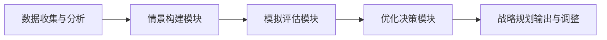

# AI驱动的企业战略规划：情景模拟与优化

> 关键词：AI、企业战略规划、情景模拟、优化、决策支持

> 摘要：本文聚焦于AI驱动的企业战略规划中情景模拟与优化这一核心议题。首先介绍了相关背景，包括目的、预期读者等内容。接着阐述了核心概念及联系，通过文本示意图和Mermaid流程图清晰展现其架构。详细讲解了核心算法原理和具体操作步骤，以Python代码进行说明。同时给出了相关数学模型和公式，并举例解释。通过项目实战，展示了代码实际案例及详细解读。探讨了实际应用场景，推荐了学习、开发相关的工具和资源。最后总结未来发展趋势与挑战，解答常见问题并提供扩展阅读和参考资料，旨在为企业利用AI进行战略规划的情景模拟与优化提供全面且深入的指导。

## 1. 背景介绍 
### 1.1 目的和范围
在当今复杂多变的商业环境中，企业面临着众多不确定性因素，如市场需求的波动、竞争对手的策略调整、政策法规的变化等。传统的企业战略规划方法往往难以应对这些复杂的情况，因为它们基于静态的假设和预测，缺乏对各种可能情景的全面考虑。

AI驱动的企业战略规划中的情景模拟与优化旨在利用人工智能技术，模拟各种可能的商业情景，并通过优化算法找到在不同情景下的最优战略决策。本文章的范围涵盖了从核心概念的阐述、算法原理的讲解、数学模型的建立，到实际项目的案例分析以及应用场景的探讨等多个方面，旨在为企业管理者、战略规划师、AI技术开发者等提供一个全面的参考框架。

### 1.2 预期读者
- **企业管理者**：希望借助AI技术提升企业战略规划的科学性和灵活性，以更好地应对市场变化和竞争挑战。
- **战略规划师**：寻求创新的方法和工具来丰富战略规划的流程和手段，提高战略规划的质量和效果。
- **AI技术开发者**：对将AI技术应用于企业战略规划领域感兴趣，希望了解相关的技术原理和应用场景，开发出更有针对性的AI解决方案。
- **研究人员**：关注AI在商业领域的应用研究，希望通过本文获取相关的理论和实践案例，推动该领域的学术研究。

### 1.3 文档结构概述
本文将按照以下结构进行阐述：
- 核心概念与联系：介绍AI驱动的企业战略规划中情景模拟与优化的核心概念，通过文本示意图和Mermaid流程图展示其架构和内在联系。
- 核心算法原理 & 具体操作步骤：详细讲解实现情景模拟与优化的核心算法原理，并给出Python源代码进行说明。
- 数学模型和公式 & 详细讲解 & 举例说明：建立相关的数学模型和公式，对其进行详细讲解，并通过实际例子进行解释。
- 项目实战：代码实际案例和详细解释说明：通过一个实际的项目案例，展示如何进行开发环境搭建、源代码实现以及代码解读和分析。
- 实际应用场景：探讨AI驱动的企业战略规划中情景模拟与优化在不同行业和领域的实际应用场景。
- 工具和资源推荐：推荐学习、开发相关的工具和资源，包括书籍、在线课程、技术博客、IDE和编辑器、调试和性能分析工具、相关框架和库以及相关论文著作等。
- 总结：未来发展趋势与挑战：总结AI驱动的企业战略规划中情景模拟与优化的未来发展趋势，并分析可能面临的挑战。
- 附录：常见问题与解答：解答读者在阅读和实践过程中可能遇到的常见问题。
- 扩展阅读 & 参考资料：提供相关的扩展阅读材料和参考资料，方便读者进一步深入学习和研究。

### 1.4 术语表
#### 1.4.1 核心术语定义
- **AI（Artificial Intelligence）**：人工智能，是研究、开发用于模拟、延伸和扩展人的智能的理论、方法、技术及应用系统的一门新的技术科学。
- **企业战略规划**：企业根据其外部环境和内部资源条件，为求得企业生存和长期稳定的发展，对企业发展目标、达到目标的途径和手段的总体谋划。
- **情景模拟**：通过构建不同的假设情景，模拟各种可能的市场环境、竞争态势、政策法规等因素的变化，以评估企业战略在不同情景下的可行性和效果。
- **优化**：在给定的约束条件下，寻找使目标函数达到最优值的决策变量取值。在企业战略规划中，优化的目标通常是最大化企业的利润、市场份额、股东价值等。

#### 1.4.2 相关概念解释
- **机器学习**：是人工智能的一个分支，它致力于研究如何通过数据和算法让计算机自动学习和改进，从而实现对未知数据的预测和决策。
- **深度学习**：是机器学习的一个子领域，它通过构建深度神经网络模型，自动从大量数据中提取特征和模式，具有强大的学习和表达能力。
- **决策树**：是一种常用的机器学习算法，它通过构建树状结构的模型，对数据进行分类和预测，能够直观地展示决策过程和规则。
- **遗传算法**：是一种模拟自然选择和遗传机制的优化算法，它通过不断地迭代和进化，寻找最优解。

#### 1.4.3 缩略词列表
- **AI**：Artificial Intelligence（人工智能）
- **ML**：Machine Learning（机器学习）
- **DL**：Deep Learning（深度学习）
- **GA**：Genetic Algorithm（遗传算法）

## 2. 核心概念与联系 
### 核心概念原理
AI驱动的企业战略规划中的情景模拟与优化主要基于以下核心概念：

#### 数据驱动
通过收集和分析大量的内外部数据，包括市场数据、竞争数据、企业运营数据等，了解企业所处的环境和自身的状况，为情景模拟和优化提供数据支持。

#### 情景构建
根据对数据的分析和对未来趋势的预测，构建各种可能的情景，每个情景代表一种不同的市场环境、竞争态势、政策法规等因素的组合。

#### 模拟评估
利用AI技术，如机器学习、深度学习等，对每个情景下企业战略的实施效果进行模拟评估，计算各种绩效指标，如利润、市场份额、客户满意度等。

#### 优化决策
根据模拟评估的结果，使用优化算法，如遗传算法、线性规划等，寻找在不同情景下的最优战略决策，以最大化企业的绩效目标。

### 架构的文本示意图
```plaintext
               数据收集与分析
                     |
                     v
              情景构建模块
                     |
                     v
              模拟评估模块
                     |
                     v
              优化决策模块
                     |
                     v
            战略规划输出与调整
```

### Mermaid流程图


## 3. 核心算法原理 & 具体操作步骤 
### 核心算法原理
在AI驱动的企业战略规划中，情景模拟与优化涉及到多个核心算法，以下以决策树和遗传算法为例进行详细讲解。

#### 决策树算法原理
决策树是一种基于树结构进行决策的算法，它通过对数据的划分和特征选择，构建一棵决策树模型。在情景模拟中，决策树可以用于预测不同情景下企业的绩效指标。

决策树的构建过程主要包括以下几个步骤：
1. **选择根节点**：从所有特征中选择一个最优特征作为根节点。
2. **划分数据集**：根据根节点的特征值，将数据集划分为不同的子集。
3. **递归构建子树**：对每个子集重复步骤1和步骤2，直到满足终止条件。

#### 遗传算法原理
遗传算法是一种模拟自然选择和遗传机制的优化算法，它通过不断地迭代和进化，寻找最优解。在企业战略规划中，遗传算法可以用于寻找在不同情景下的最优战略决策。

遗传算法的基本操作包括以下几个步骤：
1. **初始化种群**：随机生成一组初始解，作为种群的第一代。
2. **评估适应度**：计算每个个体的适应度值，适应度值表示个体的优劣程度。
3. **选择操作**：根据个体的适应度值，选择一部分个体作为父代。
4. **交叉操作**：对父代个体进行交叉操作，生成子代个体。
5. **变异操作**：对子代个体进行变异操作，引入新的基因。
6. **更新种群**：用子代个体替换父代个体，更新种群。
7. **终止条件判断**：判断是否满足终止条件，如果满足则输出最优解，否则返回步骤2。

### 具体操作步骤及Python源代码
#### 决策树算法实现
```python
from sklearn.datasets import load_iris
from sklearn.model_selection import train_test_split
from sklearn.tree import DecisionTreeClassifier
from sklearn.metrics import accuracy_score

# 加载数据集
iris = load_iris()
X = iris.data
y = iris.target

# 划分训练集和测试集
X_train, X_test, y_train, y_test = train_test_split(X, y, test_size=0.3, random_state=42)

# 创建决策树分类器
clf = DecisionTreeClassifier()

# 训练模型
clf.fit(X_train, y_train)

# 预测
y_pred = clf.predict(X_test)

# 评估模型
accuracy = accuracy_score(y_test, y_pred)
print(f"Accuracy: {accuracy}")
```
#### 遗传算法实现
```python
import random

# 定义目标函数
def objective_function(x):
    return -((x - 2) ** 2)

# 初始化种群
def initialize_population(population_size, gene_length):
    population = []
    for _ in range(population_size):
        individual = [random.randint(0, 1) for _ in range(gene_length)]
        population.append(individual)
    return population

# 解码个体
def decode(individual):
    binary_str = ''.join(map(str, individual))
    decimal = int(binary_str, 2)
    return decimal

# 评估适应度
def evaluate_fitness(population):
    fitness_values = []
    for individual in population:
        x = decode(individual)
        fitness = objective_function(x)
        fitness_values.append(fitness)
    return fitness_values

# 选择操作
def selection(population, fitness_values):
    total_fitness = sum(fitness_values)
    probabilities = [fitness / total_fitness for fitness in fitness_values]
    selected_indices = random.choices(range(len(population)), weights=probabilities, k=len(population))
    selected_population = [population[i] for i in selected_indices]
    return selected_population

# 交叉操作
def crossover(parent1, parent2):
    crossover_point = random.randint(1, len(parent1) - 1)
    child1 = parent1[:crossover_point] + parent2[crossover_point:]
    child2 = parent2[:crossover_point] + parent1[crossover_point:]
    return child1, child2

# 变异操作
def mutation(individual, mutation_rate):
    for i in range(len(individual)):
        if random.random() < mutation_rate:
            individual[i] = 1 - individual[i]
    return individual

# 遗传算法主函数
def genetic_algorithm(population_size, gene_length, generations, mutation_rate):
    population = initialize_population(population_size, gene_length)
    for _ in range(generations):
        fitness_values = evaluate_fitness(population)
        selected_population = selection(population, fitness_values)
        new_population = []
        for i in range(0, population_size, 2):
            parent1 = selected_population[i]
            parent2 = selected_population[i + 1]
            child1, child2 = crossover(parent1, parent2)
            child1 = mutation(child1, mutation_rate)
            child2 = mutation(child2, mutation_rate)
            new_population.extend([child1, child2])
        population = new_population
    best_individual = max(population, key=lambda x: objective_function(decode(x)))
    best_solution = decode(best_individual)
    best_fitness = objective_function(best_solution)
    return best_solution, best_fitness

# 运行遗传算法
population_size = 50
gene_length = 10
generations = 100
mutation_rate = 0.01
best_solution, best_fitness = genetic_algorithm(population_size, gene_length, generations, mutation_rate)
print(f"Best solution: {best_solution}")
print(f"Best fitness: {best_fitness}")
```

## 4. 数学模型和公式 & 详细讲解 & 举例说明 
### 决策树数学模型和公式
#### 信息熵
信息熵是衡量数据不确定性的指标，其计算公式为：
$$H(X) = -\sum_{i=1}^{n}p(x_i)\log_2p(x_i)$$
其中，$X$ 是一个随机变量，$p(x_i)$ 是 $X$ 取值为 $x_i$ 的概率。

#### 信息增益
信息增益是在划分数据集前后信息熵的减少量，其计算公式为：
$$Gain(D, A) = H(D) - \sum_{v\in Values(A)}\frac{|D^v|}{|D|}H(D^v)$$
其中，$D$ 是数据集，$A$ 是特征，$Values(A)$ 是特征 $A$ 的取值集合，$D^v$ 是特征 $A$ 取值为 $v$ 的子集。

#### 举例说明
假设有一个数据集 $D$ 包含 10 个样本，其中正类样本有 6 个，负类样本有 4 个。则数据集 $D$ 的信息熵为：
$$H(D) = -\frac{6}{10}\log_2\frac{6}{10} - \frac{4}{10}\log_2\frac{4}{10} \approx 0.971$$
假设有一个特征 $A$，其取值为 $a_1$ 和 $a_2$，$D^{a_1}$ 包含 4 个正类样本和 1 个负类样本，$D^{a_2}$ 包含 2 个正类样本和 3 个负类样本。则 $D^{a_1}$ 和 $D^{a_2}$ 的信息熵分别为：
$$H(D^{a_1}) = -\frac{4}{5}\log_2\frac{4}{5} - \frac{1}{5}\log_2\frac{1}{5} \approx 0.722$$
$$H(D^{a_2}) = -\frac{2}{5}\log_2\frac{2}{5} - \frac{3}{5}\log_2\frac{3}{5} \approx 0.971$$
特征 $A$ 的信息增益为：
$$Gain(D, A) = 0.971 - (\frac{5}{10} \times 0.722 + \frac{5}{10} \times 0.971) \approx 0.125$$

### 遗传算法数学模型和公式
#### 适应度函数
适应度函数是衡量个体优劣程度的指标，通常根据具体的优化问题来定义。例如，在前面的遗传算法示例中，适应度函数为：
$$f(x) = -((x - 2) ^ 2)$$

#### 选择概率
选择概率是根据个体的适应度值来确定的，其计算公式为：
$$p_i = \frac{f(x_i)}{\sum_{j=1}^{N}f(x_j)}$$
其中，$p_i$ 是个体 $i$ 的选择概率，$f(x_i)$ 是个体 $i$ 的适应度值，$N$ 是种群的大小。

#### 举例说明
假设有一个种群包含 3 个个体，其适应度值分别为 5、3、2。则它们的选择概率分别为：
$$p_1 = \frac{5}{5 + 3 + 2} = 0.5$$
$$p_2 = \frac{3}{5 + 3 + 2} = 0.3$$
$$p_3 = \frac{2}{5 + 3 + 2} = 0.2$$

## 5. 项目实战：代码实际案例和详细解释说明 
### 5.1  开发环境搭建
#### 安装Python
首先，需要安装Python环境。可以从Python官方网站（https://www.python.org/downloads/） 下载适合自己操作系统的Python安装包，并按照安装向导进行安装。

#### 安装必要的库
在命令行中使用以下命令安装必要的库：
```sh
pip install numpy pandas scikit-learn matplotlib
```
- `numpy`：用于数值计算。
- `pandas`：用于数据处理和分析。
- `scikit-learn`：用于机器学习算法的实现。
- `matplotlib`：用于数据可视化。

### 5.2  源代码详细实现和代码解读
#### 数据准备
```python
import pandas as pd
from sklearn.model_selection import train_test_split

# 加载数据集
data = pd.read_csv('data.csv')

# 划分特征和标签
X = data.drop('target', axis=1)
y = data['target']

# 划分训练集和测试集
X_train, X_test, y_train, y_test = train_test_split(X, y, test_size=0.3, random_state=42)
```
**代码解读**：
- 首先使用 `pandas` 库的 `read_csv` 函数加载数据集。
- 然后将数据集划分为特征 `X` 和标签 `y`。
- 最后使用 `sklearn` 库的 `train_test_split` 函数将数据集划分为训练集和测试集。

#### 决策树模型训练和评估
```python
from sklearn.tree import DecisionTreeClassifier
from sklearn.metrics import accuracy_score

# 创建决策树分类器
clf = DecisionTreeClassifier()

# 训练模型
clf.fit(X_train, y_train)

# 预测
y_pred = clf.predict(X_test)

# 评估模型
accuracy = accuracy_score(y_test, y_pred)
print(f"Accuracy: {accuracy}")
```
**代码解读**：
- 使用 `sklearn` 库的 `DecisionTreeClassifier` 类创建决策树分类器。
- 使用 `fit` 方法对模型进行训练。
- 使用 `predict` 方法对测试集进行预测。
- 使用 `accuracy_score` 函数计算模型的准确率。

#### 遗传算法优化决策树模型
```python
from sklearn.model_selection import GridSearchCV
from sklearn.tree import DecisionTreeClassifier

# 定义参数网格
param_grid = {
    'max_depth': [3, 5, 7, 9],
    'min_samples_split': [2, 5, 10],
    'min_samples_leaf': [1, 2, 4]
}

# 创建决策树分类器
clf = DecisionTreeClassifier()

# 使用GridSearchCV进行参数优化
grid_search = GridSearchCV(clf, param_grid, cv=5)
grid_search.fit(X_train, y_train)

# 输出最优参数和最优得分
print(f"Best parameters: {grid_search.best_params_}")
print(f"Best score: {grid_search.best_score_}")
```
**代码解读**：
- 定义了一个参数网格 `param_grid`，包含了决策树模型的一些重要参数。
- 使用 `sklearn` 库的 `GridSearchCV` 类进行参数优化，`cv=5` 表示使用 5 折交叉验证。
- 使用 `fit` 方法进行训练，找到最优参数。
- 输出最优参数和最优得分。

### 5.3  代码解读与分析
#### 数据准备阶段
数据准备是机器学习项目的重要基础，通过合理地划分训练集和测试集，可以避免过拟合问题，提高模型的泛化能力。

#### 决策树模型训练和评估阶段
决策树模型是一种简单而有效的分类模型，通过计算信息增益等指标来选择最优特征，构建决策树。在评估模型时，准确率是一个常用的指标，但在实际应用中，还需要考虑其他指标，如召回率、F1 值等。

#### 遗传算法优化决策树模型阶段
遗传算法可以帮助我们在参数空间中搜索最优参数，提高模型的性能。`GridSearchCV` 是一种常用的参数优化方法，它通过穷举所有可能的参数组合，找到最优参数。

## 6. 实际应用场景 
### 金融行业
在金融行业，AI驱动的企业战略规划中的情景模拟与优化可以用于风险评估和投资决策。例如，银行可以通过情景模拟，预测不同经济环境下的贷款违约率，从而调整信贷政策和风险控制策略。投资机构可以利用优化算法，在不同的市场情景下，寻找最优的投资组合，以最大化投资收益。

### 制造业
在制造业，情景模拟与优化可以用于生产计划和供应链管理。例如，企业可以通过模拟不同的市场需求情景，优化生产计划，合理安排生产资源，降低生产成本。同时，通过对供应链的情景模拟，企业可以评估不同供应商的可靠性和风险，优化供应链结构，提高供应链的稳定性和效率。

### 零售业
在零售业，情景模拟与优化可以用于商品定价和库存管理。例如，零售商可以通过模拟不同的市场竞争情景和消费者需求情景，优化商品定价策略，提高销售额和利润。同时，通过对库存的情景模拟，企业可以合理控制库存水平，减少库存积压和缺货现象，提高库存周转率。

### 医疗行业
在医疗行业，情景模拟与优化可以用于医疗资源分配和疾病防控策略制定。例如，医院可以通过模拟不同的疾病流行情景，优化医疗资源的分配，确保在疾病高发期能够满足患者的需求。政府部门可以利用情景模拟和优化算法，制定科学有效的疾病防控策略，降低疾病的传播风险。

## 7. 工具和资源推荐
### 7.1 学习资源推荐
#### 7.1.1 书籍推荐
- 《人工智能：一种现代的方法》：全面介绍了人工智能的基本概念、算法和应用，是人工智能领域的经典教材。
- 《机器学习》：由周志华教授编写，系统地介绍了机器学习的基本理论和算法，内容丰富，讲解详细。
- 《Python机器学习实战》：通过实际案例，介绍了如何使用Python实现机器学习算法，适合初学者学习。

#### 7.1.2 在线课程
- Coursera上的“机器学习”课程：由斯坦福大学的Andrew Ng教授授课，是机器学习领域的经典课程。
- edX上的“人工智能基础”课程：介绍了人工智能的基本概念、算法和应用，适合初学者入门。
- 中国大学MOOC上的“Python数据分析与挖掘实战”课程：通过实际案例，介绍了如何使用Python进行数据分析和挖掘，对企业战略规划中的数据处理有很大帮助。

#### 7.1.3 技术博客和网站
- Medium：是一个汇聚了众多技术专家和开发者的博客平台，上面有很多关于AI和企业战略规划的优质文章。
- Towards Data Science：专注于数据科学和机器学习领域的技术博客，提供了很多实用的技术文章和案例分析。
- AI研习社：是一个专注于人工智能领域的社区，提供了丰富的学习资源和技术交流平台。

### 7.2 开发工具框架推荐
#### 7.2.1 IDE和编辑器
- PyCharm：是一款专门为Python开发设计的集成开发环境，功能强大，提供了代码编辑、调试、版本控制等多种功能。
- Jupyter Notebook：是一个交互式的开发环境，适合进行数据分析和机器学习实验，支持多种编程语言。
- Visual Studio Code：是一款轻量级的代码编辑器，支持多种编程语言和插件，具有丰富的扩展功能。

#### 7.2.2 调试和性能分析工具
- PDB：是Python自带的调试工具，可以帮助开发者进行代码调试和问题排查。
- cProfile：是Python的性能分析工具，可以帮助开发者分析代码的性能瓶颈，优化代码性能。
- TensorBoard：是TensorFlow的可视化工具，可以帮助开发者可视化模型的训练过程和性能指标。

#### 7.2.3 相关框架和库
- TensorFlow：是一个开源的机器学习框架，提供了丰富的深度学习模型和工具，广泛应用于AI领域。
- PyTorch：是另一个开源的机器学习框架，具有简洁易用的特点，受到很多研究者和开发者的喜爱。
- Scikit-learn：是一个简单而有效的机器学习库，提供了多种机器学习算法和工具，适合初学者学习和使用。

### 7.3 相关论文著作推荐
#### 7.3.1 经典论文
- “A Machine Learning Approach to Strategic Planning”：介绍了如何使用机器学习技术进行企业战略规划，是该领域的经典论文之一。
- “Scenario Planning: A Tool for Strategic Thinking”：阐述了情景规划的基本原理和方法，对企业战略规划中的情景模拟有重要的指导意义。

#### 7.3.2 最新研究成果
- 关注顶级学术会议，如NeurIPS、ICML、AAAI等，这些会议上的最新研究成果反映了AI和企业战略规划领域的前沿动态。
- 查阅相关学术期刊，如Journal of Artificial Intelligence Research、Management Science等，这些期刊上发表了很多高质量的研究论文。

#### 7.3.3 应用案例分析
- 一些知名企业的案例分析报告，如亚马逊、谷歌等公司的战略规划案例，这些案例可以为我们提供实际应用的参考和借鉴。
- 行业研究机构发布的报告，如麦肯锡、波士顿咨询等公司的研究报告，这些报告对行业趋势和企业战略有深入的分析和研究。

## 8. 总结：未来发展趋势与挑战
### 未来发展趋势
#### 多技术融合
未来，AI驱动的企业战略规划将与物联网、大数据、区块链等技术深度融合。例如，物联网可以提供实时的设备运行数据，大数据可以提供更全面的市场和用户数据，区块链可以保证数据的安全性和可信度，这些技术的融合将为企业战略规划提供更丰富、更准确的数据支持。

#### 智能化决策
随着AI技术的不断发展，企业战略规划将越来越智能化。AI系统可以自动分析数据、构建情景、模拟评估和优化决策，为企业管理者提供更科学、更合理的决策建议。同时，AI系统还可以根据市场变化和企业实际情况，实时调整战略规划，提高企业的应变能力。

#### 个性化定制
不同企业的业务模式、市场环境和战略目标各不相同，未来的企业战略规划将更加注重个性化定制。AI技术可以根据企业的具体需求和特点，为企业量身定制战略规划方案，提高战略规划的针对性和有效性。

### 挑战
#### 数据质量和安全
AI驱动的企业战略规划依赖于大量的数据，但数据质量和安全是一个重要的挑战。数据可能存在缺失、错误、不一致等问题，这些问题会影响模型的准确性和可靠性。同时，数据的安全和隐私也是一个不容忽视的问题，企业需要采取有效的措施保护数据的安全和隐私。

#### 技术人才短缺
AI技术是一个新兴的领域，相关的技术人才短缺是一个普遍的问题。企业需要培养和吸引大量的AI技术人才，以支持企业战略规划的智能化转型。同时，企业管理者也需要提高自身的AI素养，以便更好地理解和应用AI技术。

#### 伦理和法律问题
AI技术的应用也带来了一系列的伦理和法律问题。例如，AI系统的决策过程可能不透明，导致决策的公正性和可解释性受到质疑。同时，AI技术的应用也可能涉及到隐私保护、知识产权等法律问题，企业需要遵守相关的伦理和法律规定。

## 9. 附录：常见问题与解答
### 1. 如何选择合适的情景进行模拟？
选择合适的情景需要综合考虑多个因素，包括市场趋势、竞争态势、政策法规、技术发展等。可以通过对历史数据的分析、专家意见的收集和对未来趋势的预测，确定可能的情景范围。然后，根据情景的重要性、可能性和影响程度，选择一些关键的情景进行模拟。

### 2. 遗传算法的参数如何设置？
遗传算法的参数设置需要根据具体的问题进行调整。一般来说，种群大小、迭代次数、交叉率和变异率是几个重要的参数。种群大小可以根据问题的复杂度和搜索空间的大小来确定，一般在几十到几百之间。迭代次数可以根据算法的收敛情况来确定，一般需要进行多次实验来找到合适的值。交叉率和变异率的取值范围一般在 0.6 - 0.9 和 0.01 - 0.1 之间。

### 3. 如何评估情景模拟与优化的效果？
可以从多个方面评估情景模拟与优化的效果，包括战略的可行性、绩效指标的提升、风险的降低等。可以通过比较优化前后的战略方案和绩效指标，评估优化的效果。同时，还可以进行敏感性分析，评估不同情景下战略方案的稳定性和适应性。

### 4. AI技术在企业战略规划中的应用是否会取代人类决策？
AI技术在企业战略规划中的应用不会取代人类决策，而是辅助人类决策。AI系统可以提供更全面、更准确的信息和决策建议，但最终的决策还需要人类管理者根据自己的经验、判断力和价值观来做出。人类管理者在决策过程中可以考虑更多的非量化因素，如企业文化、社会责任等，这些因素是AI系统难以考虑到的。

## 10. 扩展阅读 & 参考资料
### 扩展阅读
- 《创新者的窘境》：探讨了企业在面对技术创新和市场变化时的战略选择问题，对企业战略规划有重要的启示。
- 《竞争战略》：由迈克尔·波特教授编写，系统地介绍了企业竞争战略的基本理论和方法，是企业战略管理领域的经典著作。
- 《数据驱动的决策》：介绍了如何利用数据进行科学决策，对AI驱动的企业战略规划有一定的参考价值。

### 参考资料
- 相关学术论文和研究报告，如IEEE、ACM等学术组织发表的论文，以及麦肯锡、波士顿咨询等公司发布的研究报告。
- 相关技术文档和开源项目，如TensorFlow、PyTorch等框架的官方文档，以及GitHub上的相关开源项目。
- 企业官方网站和新闻报道，如亚马逊、谷歌等公司的官方网站，以及相关的新闻报道和行业分析文章。