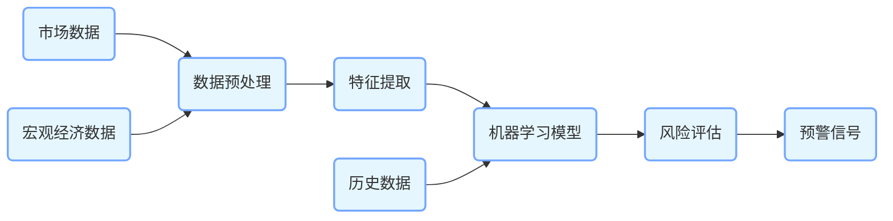

# AI驱动的市场流动性风险预警系统

> 关键词：AI、市场流动性风险、预警系统、机器学习、金融科技

> 摘要：本文聚焦于AI驱动的市场流动性风险预警系统，旨在深入探讨该系统的原理、实现方法及应用。首先介绍了市场流动性风险预警的背景和重要性，接着阐述了系统涉及的核心概念与联系，包括相关的金融和AI概念。详细讲解了核心算法原理，通过Python代码示例进行了说明，同时给出了数学模型和公式。通过项目实战，展示了系统的具体实现和代码解读。分析了系统的实际应用场景，推荐了相关的学习资源、开发工具和论文著作。最后总结了系统的未来发展趋势与挑战，并提供了常见问题解答和参考资料，为相关领域的研究和实践提供全面的参考。

## 1. 背景介绍 
### 1.1 目的和范围
市场流动性风险是金融市场中一个至关重要的问题。当市场流动性不足时，资产难以迅速变现，可能导致价格大幅波动，甚至引发系统性金融风险。本预警系统的目的在于利用人工智能技术，对市场流动性风险进行实时监测和预警，帮助投资者、金融机构和监管部门及时采取措施，降低风险损失。

本系统的范围涵盖了股票市场、债券市场、外汇市场等主要金融市场，通过对市场交易数据、宏观经济数据等多源数据的分析，实现对市场流动性风险的全面评估和预警。

### 1.2 预期读者
本文的预期读者包括金融领域的从业者，如投资者、基金经理、风险管理人员等，他们可以借助该系统更好地管理投资组合，降低风险。同时，也适用于金融科技领域的开发者和研究人员，为他们提供技术思路和实践参考。此外，监管部门的工作人员也可以通过该系统加强对市场的监管，维护金融市场的稳定。

### 1.3 文档结构概述
本文将按照以下结构进行阐述：首先介绍相关背景知识，包括目的、预期读者和文档结构等。接着讲解系统的核心概念与联系，包括市场流动性风险、人工智能技术等相关概念的原理和架构。然后详细介绍核心算法原理和具体操作步骤，通过Python代码进行说明。随后给出数学模型和公式，并进行详细讲解和举例。通过项目实战展示系统的具体实现和代码解读。分析系统的实际应用场景。推荐相关的工具和资源，包括学习资源、开发工具和论文著作。最后总结系统的未来发展趋势与挑战，提供常见问题解答和参考资料。

### 1.4 术语表
#### 1.4.1 核心术语定义
- **市场流动性风险**：指由于市场交易不活跃、买卖价差过大等原因，导致资产难以在合理价格下迅速变现的风险。
- **人工智能（AI）**：是一门研究如何使计算机系统能够模拟人类智能的学科，包括机器学习、深度学习、自然语言处理等技术。
- **预警系统**：通过对相关数据的监测和分析，在风险发生前发出警报的系统。
- **机器学习**：是人工智能的一个分支，通过让计算机从数据中学习模式和规律，从而实现预测和决策的功能。
- **深度学习**：是机器学习的一种，基于人工神经网络，能够自动从大量数据中提取特征和模式。

#### 1.4.2 相关概念解释
- **流动性指标**：用于衡量市场流动性的各种指标，如交易量、买卖价差、换手率等。
- **数据挖掘**：从大量数据中发现有价值信息和知识的过程。
- **模型训练**：使用历史数据对机器学习模型进行训练，使其能够学习到数据中的模式和规律。
- **模型评估**：使用测试数据对训练好的模型进行评估，衡量模型的性能和准确性。

#### 1.4.3 缩略词列表
- **AI**：Artificial Intelligence（人工智能）
- **ML**：Machine Learning（机器学习）
- **DL**：Deep Learning（深度学习）
- **API**：Application Programming Interface（应用程序编程接口）

## 2. 核心概念与联系 

### 市场流动性风险的概念与度量
市场流动性风险是金融市场中一个复杂的概念，它受到多种因素的影响。从微观层面来看，交易成本、市场深度和弹性等因素都会影响资产的流动性。交易成本包括佣金、买卖价差等，较高的交易成本会降低投资者的交易意愿，从而影响市场流动性。市场深度指的是市场在不影响价格的情况下能够吸收的交易量，市场深度越大，说明市场能够容纳更多的交易而不引起价格大幅波动。弹性则反映了市场价格在受到交易冲击后恢复到均衡水平的速度。

从宏观层面来看，宏观经济环境、政策法规等因素也会对市场流动性产生重要影响。例如，经济衰退时期，投资者的风险偏好下降，市场交易活跃度降低，流动性风险增加。政策法规的变化，如监管加强或放松，也会对市场流动性产生直接或间接的影响。

为了度量市场流动性风险，通常会使用一些流动性指标。常见的流动性指标包括：
- **交易量**：反映了市场的交易活跃程度，交易量越大，说明市场越活跃，流动性越好。
- **买卖价差**：指的是买入价和卖出价之间的差值，买卖价差越小，说明市场的流动性越好。
- **换手率**：是指在一定时间内市场中股票转手买卖的频率，换手率越高，说明市场的流动性越好。

### 人工智能技术在风险预警中的应用
人工智能技术在市场流动性风险预警中具有重要的应用价值。通过机器学习和深度学习算法，可以对大量的市场数据进行分析和挖掘，发现数据中的模式和规律，从而实现对市场流动性风险的预测和预警。

机器学习算法可以分为监督学习、无监督学习和强化学习等类型。在市场流动性风险预警中，监督学习算法应用较为广泛。监督学习算法通过使用历史数据进行训练，学习到输入数据（如市场交易数据、宏观经济数据等）和输出数据（如流动性风险等级）之间的关系，从而实现对未来流动性风险的预测。

深度学习算法是机器学习的一种，基于人工神经网络，能够自动从大量数据中提取特征和模式。深度学习算法在处理复杂的非线性数据时具有优势，能够更好地捕捉市场流动性风险的变化规律。

### 核心概念的架构示意图



该架构示意图展示了AI驱动的市场流动性风险预警系统的主要流程。首先，收集市场数据和宏观经济数据，对这些数据进行预处理，包括数据清洗、缺失值处理等。然后进行特征提取，从预处理后的数据中提取出与市场流动性风险相关的特征。接着使用机器学习模型对特征数据进行训练和预测，得到风险评估结果。最后根据风险评估结果发出预警信号。

## 3. 核心算法原理 & 具体操作步骤 

### 核心算法原理
在市场流动性风险预警系统中，我们可以使用多种机器学习算法，如逻辑回归、决策树、随机森林和深度学习中的神经网络等。这里以逻辑回归算法为例进行详细讲解。

逻辑回归是一种常用的分类算法，它通过对输入数据进行线性组合，然后使用逻辑函数将线性组合的结果映射到0到1之间的概率值，从而实现对样本的分类。逻辑回归的基本模型可以表示为：

$$P(y = 1|x) = \frac{1}{1 + e^{-(w_0 + w_1x_1 + w_2x_2 + \cdots + w_nx_n)}}$$

其中，$P(y = 1|x)$ 表示在输入特征 $x$ 下样本属于正类（即存在流动性风险）的概率，$w_0, w_1, \cdots, w_n$ 是模型的参数，$x_1, x_2, \cdots, x_n$ 是输入特征。

逻辑回归的目标是通过最大化似然函数来估计模型的参数。似然函数可以表示为：

$$L(w) = \prod_{i=1}^{m} P(y^{(i)}|x^{(i)})$$

其中，$m$ 是样本数量，$y^{(i)}$ 是第 $i$ 个样本的标签，$x^{(i)}$ 是第 $i$ 个样本的特征向量。

为了方便计算，通常会对似然函数取对数，得到对数似然函数：

$$\log L(w) = \sum_{i=1}^{m} [y^{(i)}\log P(y^{(i)}|x^{(i)}) + (1 - y^{(i)})\log(1 - P(y^{(i)}|x^{(i)}))]$$

通过最大化对数似然函数，可以得到最优的模型参数 $w$。

### 具体操作步骤

#### 1. 数据收集
收集市场交易数据和宏观经济数据，包括股票价格、交易量、利率、GDP等数据。

#### 2. 数据预处理
- **数据清洗**：去除数据中的噪声、重复值和异常值。
- **缺失值处理**：使用均值、中位数或插值等方法填充缺失值。
- **数据标准化**：将数据进行标准化处理，使数据具有相同的尺度，便于模型训练。

#### 3. 特征提取
从预处理后的数据中提取与市场流动性风险相关的特征，如交易量变化率、买卖价差变化率等。

#### 4. 模型训练
将提取的特征数据分为训练集和测试集，使用训练集对逻辑回归模型进行训练。

#### 5. 模型评估
使用测试集对训练好的模型进行评估，计算模型的准确率、召回率、F1值等指标，评估模型的性能。

#### 6. 风险预警
根据模型的预测结果，设定风险阈值，当预测概率超过阈值时，发出预警信号。

### Python源代码实现

```python
import pandas as pd
from sklearn.model_selection import train_test_split
from sklearn.linear_model import LogisticRegression
from sklearn.preprocessing import StandardScaler
from sklearn.metrics import accuracy_score, recall_score, f1_score

# 1. 数据收集（假设数据已经存储在CSV文件中）
data = pd.read_csv('market_data.csv')

# 2. 数据预处理
# 分离特征和标签
X = data.drop('risk_label', axis=1)
y = data['risk_label']

# 数据标准化
scaler = StandardScaler()
X_scaled = scaler.fit_transform(X)

# 3. 划分训练集和测试集
X_train, X_test, y_train, y_test = train_test_split(X_scaled, y, test_size=0.2, random_state=42)

# 4. 模型训练
model = LogisticRegression()
model.fit(X_train, y_train)

# 5. 模型评估
y_pred = model.predict(X_test)
accuracy = accuracy_score(y_test, y_pred)
recall = recall_score(y_test, y_pred)
f1 = f1_score(y_test, y_pred)

print(f"Accuracy: {accuracy}")
print(f"Recall: {recall}")
print(f"F1 Score: {f1}")

# 6. 风险预警
# 设定风险阈值
threshold = 0.5
new_data = pd.read_csv('new_market_data.csv')
new_data_scaled = scaler.transform(new_data)
probabilities = model.predict_proba(new_data_scaled)[:, 1]
alerts = probabilities > threshold

for i, alert in enumerate(alerts):
    if alert:
        print(f"Alert: Market liquidity risk detected for sample {i}")
```

## 4. 数学模型和公式 & 详细讲解 & 举例说明 

### 逻辑回归的数学模型和公式
逻辑回归的数学模型基于逻辑函数（也称为Sigmoid函数），其定义为：

$$\sigma(z) = \frac{1}{1 + e^{-z}}$$

其中，$z$ 是线性组合的结果，即 $z = w_0 + w_1x_1 + w_2x_2 + \cdots + w_nx_n$。逻辑函数的取值范围在0到1之间，可以将其解释为概率值。

在逻辑回归中，我们假设样本属于正类的概率为 $P(y = 1|x) = \sigma(z)$，属于负类的概率为 $P(y = 0|x) = 1 - \sigma(z)$。

为了估计模型的参数 $w$，我们使用最大似然估计法。最大似然估计的目标是找到一组参数 $w$，使得训练数据出现的概率最大。

对于一个二分类问题，假设训练数据中有 $m$ 个样本，每个样本的特征向量为 $x^{(i)}$，标签为 $y^{(i)}$（$y^{(i)} \in \{0, 1\}$）。似然函数可以表示为：

$$L(w) = \prod_{i=1}^{m} [P(y^{(i)} = 1|x^{(i)})^{y^{(i)}} (1 - P(y^{(i)} = 1|x^{(i)}))^{1 - y^{(i)}}]$$

为了方便计算，我们对似然函数取对数，得到对数似然函数：

$$\log L(w) = \sum_{i=1}^{m} [y^{(i)}\log P(y^{(i)} = 1|x^{(i)}) + (1 - y^{(i)})\log(1 - P(y^{(i)} = 1|x^{(i)}))]$$

最大化对数似然函数等价于最小化负对数似然函数，负对数似然函数也称为损失函数（或代价函数），在逻辑回归中通常称为对数损失函数：

$$J(w) = -\frac{1}{m} \sum_{i=1}^{m} [y^{(i)}\log P(y^{(i)} = 1|x^{(i)}) + (1 - y^{(i)})\log(1 - P(y^{(i)} = 1|x^{(i)}))]$$

为了求解最小化损失函数的问题，我们可以使用梯度下降法。梯度下降法是一种迭代优化算法，通过不断更新参数 $w$ 来最小化损失函数。

梯度下降法的更新公式为：

$$w_j := w_j - \alpha \frac{\partial J(w)}{\partial w_j}$$

其中，$\alpha$ 是学习率，控制每次更新的步长，$\frac{\partial J(w)}{\partial w_j}$ 是损失函数关于参数 $w_j$ 的偏导数。

### 详细讲解
逻辑回归的核心思想是通过对输入特征进行线性组合，然后使用逻辑函数将线性组合的结果映射到0到1之间的概率值，从而实现对样本的分类。逻辑函数的形状类似于S形曲线，当输入值趋近于正无穷时，逻辑函数的值趋近于1；当输入值趋近于负无穷时，逻辑函数的值趋近于0。

最大似然估计法是一种常用的参数估计方法，其基本思想是找到一组参数，使得训练数据出现的概率最大。在逻辑回归中，我们通过最大化对数似然函数来估计模型的参数。

梯度下降法是一种迭代优化算法，通过不断更新参数来最小化损失函数。在每次迭代中，我们计算损失函数关于参数的梯度，然后沿着梯度的反方向更新参数，直到损失函数收敛到最小值。

### 举例说明
假设我们有一个简单的二分类问题，有两个特征 $x_1$ 和 $x_2$，标签 $y$ 取值为0或1。我们收集了一些训练数据，如下所示：

| $x_1$ | $x_2$ | $y$ |
|---|---|---|
| 1 | 2 | 0 |
| 2 | 3 | 0 |
| 3 | 4 | 1 |
| 4 | 5 | 1 |

我们使用逻辑回归模型对这些数据进行训练。首先，我们需要初始化模型的参数 $w_0, w_1, w_2$，假设初始值都为0。

然后，我们计算损失函数 $J(w)$ 关于参数 $w_0, w_1, w_2$ 的偏导数，使用梯度下降法更新参数。

经过多次迭代后，我们得到最优的参数 $w_0, w_1, w_2$，使得损失函数最小。

最后，我们可以使用训练好的模型对新的样本进行预测，计算样本属于正类的概率，根据概率值进行分类。

## 5. 项目实战：代码实际案例和详细解释说明 

### 5.1  开发环境搭建
为了实现AI驱动的市场流动性风险预警系统，我们需要搭建相应的开发环境。以下是具体的步骤：

#### 1. 安装Python
首先，我们需要安装Python编程语言。建议安装Python 3.7及以上版本，可以从Python官方网站（https://www.python.org/downloads/） 下载并安装。

#### 2. 安装必要的库
我们需要安装一些必要的Python库，包括：
- **pandas**：用于数据处理和分析。
- **numpy**：用于数值计算。
- **scikit-learn**：用于机器学习模型的训练和评估。
- **matplotlib**：用于数据可视化。

可以使用以下命令安装这些库：

```sh
pip install pandas numpy scikit-learn matplotlib
```

#### 3. 准备数据
收集市场交易数据和宏观经济数据，并将其存储在CSV文件中。确保数据的格式正确，并且包含必要的特征和标签。

### 5.2  源代码详细实现和代码解读

```python
import pandas as pd
import numpy as np
from sklearn.model_selection import train_test_split
from sklearn.linear_model import LogisticRegression
from sklearn.preprocessing import StandardScaler
from sklearn.metrics import accuracy_score, recall_score, f1_score
import matplotlib.pyplot as plt

# 1. 数据收集
data = pd.read_csv('market_data.csv')

# 2. 数据预处理
# 分离特征和标签
X = data.drop('risk_label', axis=1)
y = data['risk_label']

# 数据标准化
scaler = StandardScaler()
X_scaled = scaler.fit_transform(X)

# 3. 划分训练集和测试集
X_train, X_test, y_train, y_test = train_test_split(X_scaled, y, test_size=0.2, random_state=42)

# 4. 模型训练
model = LogisticRegression()
model.fit(X_train, y_train)

# 5. 模型评估
y_pred = model.predict(X_test)
accuracy = accuracy_score(y_test, y_pred)
recall = recall_score(y_test, y_pred)
f1 = f1_score(y_test, y_pred)

print(f"Accuracy: {accuracy}")
print(f"Recall: {recall}")
print(f"F1 Score: {f1}")

# 6. 风险预警
# 设定风险阈值
threshold = 0.5
new_data = pd.read_csv('new_market_data.csv')
new_data_scaled = scaler.transform(new_data)
probabilities = model.predict_proba(new_data_scaled)[:, 1]
alerts = probabilities > threshold

for i, alert in enumerate(alerts):
    if alert:
        print(f"Alert: Market liquidity risk detected for sample {i}")

# 7. 数据可视化
# 绘制特征重要性图
feature_importance = model.coef_[0]
feature_names = X.columns
plt.figure(figsize=(10, 6))
plt.bar(feature_names, feature_importance)
plt.xlabel('Features')
plt.ylabel('Importance')
plt.title('Feature Importance in Logistic Regression Model')
plt.xticks(rotation=45)
plt.show()
```

### 代码解读与分析
1. **数据收集**：使用 `pandas` 库的 `read_csv` 函数从CSV文件中读取市场数据。
2. **数据预处理**：
    - 分离特征和标签：使用 `drop` 函数从数据中分离出特征和标签。
    - 数据标准化：使用 `StandardScaler` 类对特征数据进行标准化处理，使数据具有相同的尺度。
3. **划分训练集和测试集**：使用 `train_test_split` 函数将数据划分为训练集和测试集，测试集占总数据的20%。
4. **模型训练**：使用 `LogisticRegression` 类创建逻辑回归模型，并使用训练集对模型进行训练。
5. **模型评估**：使用测试集对训练好的模型进行评估，计算模型的准确率、召回率和F1值。
6. **风险预警**：
    - 设定风险阈值：将风险阈值设定为0.5。
    - 预测概率：使用 `predict_proba` 函数计算新数据属于正类的概率。
    - 发出预警：当预测概率超过阈值时，发出预警信号。
7. **数据可视化**：使用 `matplotlib` 库绘制特征重要性图，展示每个特征在逻辑回归模型中的重要性。

## 6. 实际应用场景 
### 投资者决策支持
对于投资者来说，市场流动性风险预警系统可以帮助他们更好地管理投资组合，降低风险。当系统发出流动性风险预警时，投资者可以及时调整投资策略，减少对流动性较差资产的持有，增加对流动性较好资产的配置。例如，在股票市场中，当某只股票的流动性风险增加时，投资者可以考虑卖出该股票，避免因无法及时变现而造成损失。

### 金融机构风险管理
金融机构如银行、证券公司等需要对市场流动性风险进行有效的管理。预警系统可以帮助金融机构实时监测市场流动性状况，及时发现潜在的风险。金融机构可以根据预警信号调整自身的资产负债结构，增加流动性储备，以应对可能出现的流动性危机。例如，银行可以在流动性风险增加时，减少对高风险资产的投资，增加现金储备，提高自身的流动性水平。

### 监管部门市场监测
监管部门可以利用市场流动性风险预警系统加强对金融市场的监管。通过对市场流动性风险的实时监测，监管部门可以及时发现市场异常波动，采取相应的监管措施，维护金融市场的稳定。例如，当市场流动性风险急剧增加时，监管部门可以出台相关政策，如调整利率、增加市场流动性等，以缓解市场压力。

## 7. 工具和资源推荐
### 7.1 学习资源推荐
#### 7.1.1 书籍推荐
- 《Python机器学习》：本书详细介绍了Python在机器学习领域的应用，包括各种机器学习算法的原理和实现。
- 《深度学习》：由深度学习领域的三位权威专家所著，系统地介绍了深度学习的理论和实践。
- 《金融风险管理》：涵盖了金融风险的各种类型和管理方法，对市场流动性风险的管理有深入的讲解。

#### 7.1.2 在线课程
- Coursera上的“机器学习”课程：由斯坦福大学教授Andrew Ng讲授，是机器学习领域的经典课程。
- edX上的“深度学习”课程：提供了深度学习的系统学习内容，包括理论和实践。
- 中国大学MOOC上的“金融风险管理”课程：由国内知名高校的教授授课，结合了中国金融市场的实际情况。

#### 7.1.3 技术博客和网站
- Medium：上面有很多关于人工智能和金融科技的技术博客文章，提供了最新的技术动态和实践经验。
- Towards Data Science：专注于数据科学和机器学习领域，有很多高质量的技术文章。
- 金融界网站：提供了丰富的金融市场数据和分析报告，对了解市场流动性风险有很大帮助。

### 7.2 开发工具框架推荐
#### 7.2.1 IDE和编辑器
- PyCharm：是一款专门为Python开发设计的集成开发环境，具有强大的代码编辑、调试和项目管理功能。
- Jupyter Notebook：是一个交互式的开发环境，适合进行数据探索和模型实验。
- Visual Studio Code：是一款轻量级的代码编辑器，支持多种编程语言，并且有丰富的插件扩展功能。

#### 7.2.2 调试和性能分析工具
- PDB：Python自带的调试工具，可以帮助开发者定位和解决代码中的问题。
- cProfile：Python的性能分析工具，可以分析代码的执行时间和函数调用关系。
- TensorBoard：是TensorFlow的可视化工具，可以帮助开发者可视化模型的训练过程和性能指标。

#### 7.2.3 相关框架和库
- Scikit-learn：是Python中常用的机器学习库，提供了丰富的机器学习算法和工具。
- TensorFlow：是一个开源的深度学习框架，被广泛应用于各种深度学习任务中。
- PyTorch：是另一个流行的深度学习框架，具有简洁的API和动态计算图的特点。

### 7.3 相关论文著作推荐
#### 7.3.1 经典论文
- “On the Pricing of Corporate Debt: The Risk Structure of Interest Rates”：由Merton提出的经典论文，为信用风险和流动性风险的研究奠定了基础。
- “A Simple Model of Capital Market Equilibrium with Incomplete Information”：提出了一种基于不完全信息的资本市场均衡模型，对市场流动性风险的研究有重要影响。

#### 7.3.2 最新研究成果
- 关注顶级金融和计算机科学期刊，如《Journal of Finance》、《Journal of Financial Economics》、《Artificial Intelligence》等，这些期刊上发表了很多关于市场流动性风险和人工智能应用的最新研究成果。

#### 7.3.3 应用案例分析
- 一些金融机构和研究机构会发布关于市场流动性风险预警系统的应用案例分析报告，可以通过这些报告了解实际应用中的经验和教训。

## 8. 总结：未来发展趋势与挑战
### 未来发展趋势
- **多源数据融合**：未来的市场流动性风险预警系统将融合更多类型的数据，如社交媒体数据、新闻数据等，以更全面地了解市场情况。
- **深度学习的广泛应用**：深度学习算法将在预警系统中得到更广泛的应用，以更好地处理复杂的非线性数据，提高预警的准确性。
- **实时监测和动态调整**：系统将实现实时监测市场流动性风险，并根据市场变化动态调整预警策略。
- **与区块链技术结合**：区块链技术的去中心化、不可篡改等特点，将为市场流动性风险预警系统提供更安全、可靠的数据支持。

### 挑战
- **数据质量和隐私问题**：多源数据的融合带来了数据质量和隐私保护的挑战，需要确保数据的准确性和安全性。
- **模型解释性**：深度学习模型的黑盒性质使得模型的解释性较差，需要开发更加可解释的模型，以便用户理解预警结果。
- **技术更新换代快**：人工智能技术发展迅速，需要不断学习和更新技术，以跟上技术发展的步伐。
- **市场复杂性**：金融市场的复杂性和不确定性增加了市场流动性风险预警的难度，需要不断优化模型和算法，提高预警的准确性和可靠性。

## 9. 附录：常见问题与解答
### 1. 如何选择合适的机器学习算法？
选择合适的机器学习算法需要考虑多个因素，如数据的特点、问题的类型、模型的可解释性等。对于市场流动性风险预警问题，如果数据量较小且特征较少，可以选择逻辑回归、决策树等简单的算法；如果数据量较大且特征复杂，可以考虑使用深度学习算法。同时，还需要根据模型的性能指标（如准确率、召回率、F1值等）进行评估和选择。

### 2. 如何处理数据中的缺失值？
处理数据中的缺失值有多种方法，常见的方法包括：
- **删除缺失值**：如果缺失值的比例较小，可以直接删除包含缺失值的样本。
- **填充缺失值**：可以使用均值、中位数、众数等统计量填充缺失值，也可以使用插值方法进行填充。
- **使用模型预测缺失值**：可以使用机器学习模型根据其他特征预测缺失值。

### 3. 如何提高模型的性能？
提高模型的性能可以从以下几个方面入手：
- **数据预处理**：对数据进行清洗、标准化、特征工程等处理，提高数据的质量。
- **模型选择和调优**：选择合适的机器学习算法，并对模型的参数进行调优。
- **集成学习**：使用集成学习方法，如随机森林、梯度提升等，提高模型的准确性和稳定性。
- **增加数据量**：如果数据量较小，可以尝试增加数据量，以提高模型的泛化能力。

### 4. 如何评估预警系统的效果？
评估预警系统的效果可以使用多种指标，如准确率、召回率、F1值、ROC曲线、AUC值等。准确率反映了模型预测正确的样本比例；召回率反映了模型正确预测出正类样本的比例；F1值是准确率和召回率的调和平均数；ROC曲线和AUC值可以直观地展示模型的性能。此外，还可以通过实际应用中的反馈和验证来评估预警系统的效果。

## 10. 扩展阅读 & 参考资料
### 扩展阅读
- 《智能金融：人工智能在金融领域的应用与创新》
- 《金融科技前沿：技术驱动的金融创新》
- 《大数据与金融风险管理》

### 参考资料
- [Scikit-learn官方文档](https://scikit-learn.org/stable/)
- [TensorFlow官方文档](https://www.tensorflow.org/)
- [PyTorch官方文档](https://pytorch.org/)
- [中国金融统计年鉴](http://www.pbc.gov.cn/tiaofasi/144941/index.html)
- [国际货币基金组织（IMF）报告](https://www.imf.org/en/Publications)