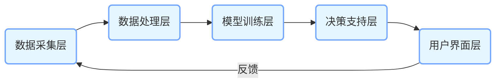

# AI驱动的软件项目智能决策支持

> 关键词：AI、软件项目、智能决策支持、机器学习、数据分析、项目管理、决策算法

> 摘要：本文聚焦于AI驱动的软件项目智能决策支持这一前沿领域。首先介绍相关背景，明确目的、预期读者等内容。接着深入探讨核心概念与联系，包括AI与软件项目决策的关系架构。详细阐述核心算法原理，结合Python代码进行说明，同时给出相关数学模型和公式并举例。通过项目实战，展示代码实现与解读。分析实际应用场景，推荐相关工具和资源，包括学习资料、开发工具框架及论文著作。最后总结未来发展趋势与挑战，提供常见问题解答和扩展阅读参考资料，旨在全面且深入地剖析AI在软件项目智能决策支持方面的原理、应用和发展前景。

## 1. 背景介绍 
### 1.1 目的和范围
随着软件项目的规模和复杂度不断增加，传统的项目决策方式面临着诸多挑战，如决策效率低下、依赖经验和直觉等。本文章的目的在于探讨如何利用AI技术为软件项目提供智能决策支持，提高决策的准确性、效率和科学性。范围涵盖AI在软件项目的各个阶段，包括需求分析、设计、开发、测试和维护等，如何辅助项目管理者做出更优的决策。

### 1.2 预期读者
本文预期读者包括软件项目管理者、AI研究人员、软件开发人员、对AI和软件项目管理交叉领域感兴趣的学者和从业者等。通过阅读本文，读者能够深入了解AI在软件项目智能决策支持中的应用原理、方法和实践案例，为其在实际工作和研究中提供参考和借鉴。

### 1.3 文档结构概述
本文将按照以下结构展开：首先介绍背景信息，包括目的、预期读者和文档结构概述等；接着阐述核心概念与联系，明确相关概念的原理和架构；然后详细讲解核心算法原理及具体操作步骤，结合Python代码进行说明；再给出数学模型和公式，并举例说明；通过项目实战展示代码实现和解读；分析实际应用场景；推荐相关工具和资源；最后总结未来发展趋势与挑战，提供常见问题解答和扩展阅读参考资料。

### 1.4 术语表
#### 1.4.1 核心术语定义
- **AI（Artificial Intelligence）**：即人工智能，是研究、开发用于模拟、延伸和扩展人的智能的理论、方法、技术及应用系统的一门新的技术科学。
- **软件项目**：是为了创造出满足用户需求的软件产品而进行的一系列活动的集合，包括需求分析、设计、开发、测试和维护等阶段。
- **智能决策支持**：是利用人工智能技术，通过对大量数据的分析和处理，为决策者提供智能化的决策建议和支持。

#### 1.4.2 相关概念解释
- **机器学习**：是AI的一个重要分支，它致力于研究如何通过算法让计算机从数据中学习模式和规律，从而实现预测和决策等功能。
- **数据分析**：是指用适当的统计分析方法对收集来的大量数据进行分析，提取有用信息和形成结论而对数据加以详细研究和概括总结的过程。

#### 1.4.3 缩略词列表
- **AI**：Artificial Intelligence（人工智能）
- **ML**：Machine Learning（机器学习）
- **DSS**：Decision Support System（决策支持系统）

## 2. 核心概念与联系 

### 核心概念原理
AI驱动的软件项目智能决策支持的核心原理在于利用AI技术对软件项目中的各种数据进行收集、分析和处理，挖掘数据中的潜在模式和规律，从而为项目决策提供科学依据。具体来说，AI通过机器学习算法对历史项目数据进行训练，学习项目的特征和规律，然后根据当前项目的状态和数据，预测项目的发展趋势和可能出现的问题，为决策者提供相应的决策建议。

### 架构的文本示意图
AI驱动的软件项目智能决策支持系统主要由数据采集层、数据处理层、模型训练层、决策支持层和用户界面层组成。
- **数据采集层**：负责收集软件项目中的各种数据，包括项目进度、成本、质量、人员等方面的数据。
- **数据处理层**：对采集到的数据进行清洗、预处理和特征提取，将数据转换为适合机器学习算法处理的格式。
- **模型训练层**：利用机器学习算法对处理后的数据进行训练，建立项目预测和决策模型。
- **决策支持层**：根据当前项目的状态和数据，利用训练好的模型进行预测和决策分析，为决策者提供决策建议。
- **用户界面层**：为用户提供友好的交互界面，方便用户查看决策结果和输入相关信息。

### Mermaid流程图


## 3. 核心算法原理 & 具体操作步骤 

### 核心算法原理
在AI驱动的软件项目智能决策支持中，常用的机器学习算法包括决策树、神经网络、支持向量机等。下面以决策树算法为例进行详细阐述。

决策树是一种基于树结构进行决策的机器学习算法，它通过对数据的属性进行划分，构建一棵决策树，每个内部节点表示一个属性上的测试，每个分支表示一个测试输出，每个叶节点表示一个类别或值。决策树的构建过程就是不断选择最优属性进行划分的过程，直到满足停止条件为止。

### 具体操作步骤
1. **数据准备**：收集软件项目的历史数据，并进行清洗和预处理，将数据转换为适合决策树算法处理的格式。
2. **特征选择**：选择对项目决策有重要影响的特征作为决策树的属性。
3. **决策树构建**：使用决策树算法对数据进行训练，构建决策树模型。
4. **模型评估**：使用测试数据对构建好的决策树模型进行评估，计算模型的准确率、召回率等指标。
5. **决策支持**：根据当前项目的状态和数据，利用训练好的决策树模型进行预测和决策分析，为决策者提供决策建议。

### Python源代码
```python
import pandas as pd
from sklearn.tree import DecisionTreeClassifier
from sklearn.model_selection import train_test_split
from sklearn.metrics import accuracy_score

# 数据准备
data = pd.read_csv('software_project_data.csv')
X = data.drop('decision', axis=1)
y = data['decision']

# 划分训练集和测试集
X_train, X_test, y_train, y_test = train_test_split(X, y, test_size=0.2, random_state=42)

# 决策树构建
clf = DecisionTreeClassifier()
clf.fit(X_train, y_train)

# 模型评估
y_pred = clf.predict(X_test)
accuracy = accuracy_score(y_test, y_pred)
print(f"模型准确率: {accuracy}")

# 决策支持
new_data = pd.DataFrame({
    'feature1': [1],
    'feature2': [2],
    'feature3': [3]
})
decision = clf.predict(new_data)
print(f"决策结果: {decision}")
```

## 4. 数学模型和公式 & 详细讲解 & 举例说明 

### 决策树的数学模型
决策树的数学模型可以用信息论中的熵和信息增益来描述。

#### 熵
熵是用来衡量数据的不确定性的指标，其计算公式为：
$$H(X) = -\sum_{i=1}^{n} p(x_i) \log_2 p(x_i)$$
其中，$X$ 是一个随机变量，$p(x_i)$ 是 $X$ 取值为 $x_i$ 的概率，$n$ 是 $X$ 取值的个数。

#### 信息增益
信息增益是用来衡量一个属性对数据分类的贡献程度的指标，其计算公式为：
$$IG(X, A) = H(X) - \sum_{v \in Values(A)} \frac{|S_v|}{|S|} H(S_v)$$
其中，$X$ 是一个随机变量，$A$ 是一个属性，$Values(A)$ 是属性 $A$ 的取值集合，$S$ 是数据集，$S_v$ 是数据集 $S$ 中属性 $A$ 取值为 $v$ 的子集，$|S|$ 和 $|S_v|$ 分别表示数据集 $S$ 和子集 $S_v$ 的样本数量。

### 详细讲解
在决策树的构建过程中，我们需要选择一个最优属性进行划分，使得划分后的数据集的不确定性最小，即信息增益最大。具体来说，我们可以计算每个属性的信息增益，选择信息增益最大的属性作为当前节点的划分属性。

### 举例说明
假设我们有一个软件项目数据集，包含三个属性：项目规模、项目复杂度和项目团队经验，以及一个决策属性：项目是否成功。数据集如下：

| 项目规模 | 项目复杂度 | 项目团队经验 | 项目是否成功 |
| --- | --- | --- | --- |
| 大 | 高 | 丰富 | 是 |
| 大 | 中 | 丰富 | 是 |
| 中 | 高 | 一般 | 否 |
| 中 | 中 | 丰富 | 是 |
| 小 | 低 | 一般 | 是 |

首先，我们计算数据集的熵：
$$H(X) = -\frac{4}{5} \log_2 \frac{4}{5} - \frac{1}{5} \log_2 \frac{1}{5} \approx 0.72$$

然后，我们计算每个属性的信息增益：
- **项目规模**：
    - 当项目规模为大时，$S_{大} = \{ (大, 高, 丰富, 是), (大, 中, 丰富, 是) \}$，$H(S_{大}) = 0$。
    - 当项目规模为中时，$S_{中} = \{ (中, 高, 一般, 否), (中, 中, 丰富, 是) \}$，$H(S_{中}) = 1$。
    - 当项目规模为小时，$S_{小} = \{ (小, 低, 一般, 是) \}$，$H(S_{小}) = 0$。
    - $IG(X, 项目规模) = 0.72 - (\frac{2}{5} \times 0 + \frac{2}{5} \times 1 + \frac{1}{5} \times 0) = 0.32$

- **项目复杂度**：
    - 当项目复杂度为高时，$S_{高} = \{ (大, 高, 丰富, 是), (中, 高, 一般, 否) \}$，$H(S_{高}) = 1$。
    - 当项目复杂度为中时，$S_{中} = \{ (大, 中, 丰富, 是), (中, 中, 丰富, 是) \}$，$H(S_{中}) = 0$。
    - 当项目复杂度为低时，$S_{低} = \{ (小, 低, 一般, 是) \}$，$H(S_{低}) = 0$。
    - $IG(X, 项目复杂度) = 0.72 - (\frac{2}{5} \times 1 + \frac{2}{5} \times 0 + \frac{1}{5} \times 0) = 0.32$

- **项目团队经验**：
    - 当项目团队经验为丰富时，$S_{丰富} = \{ (大, 高, 丰富, 是), (大, 中, 丰富, 是), (中, 中, 丰富, 是) \}$，$H(S_{丰富}) = 0$。
    - 当项目团队经验为一般时，$S_{一般} = \{ (中, 高, 一般, 否), (小, 低, 一般, 是) \}$，$H(S_{一般}) = 1$。
    - $IG(X, 项目团队经验) = 0.72 - (\frac{3}{5} \times 0 + \frac{2}{5} \times 1) = 0.32$

由于三个属性的信息增益相同，我们可以任选一个属性作为根节点的划分属性。

## 5. 项目实战：代码实际案例和详细解释说明 

### 5.1  开发环境搭建
- **操作系统**：Windows、Linux或Mac OS。
- **Python版本**：Python 3.6及以上。
- **开发工具**：PyCharm、Jupyter Notebook等。
- **依赖库**：pandas、scikit-learn等。

可以使用以下命令安装依赖库：
```sh
pip install pandas scikit-learn
```

### 5.2  源代码详细实现和代码解读
```python
import pandas as pd
from sklearn.tree import DecisionTreeClassifier
from sklearn.model_selection import train_test_split
from sklearn.metrics import accuracy_score

# 数据准备
data = pd.read_csv('software_project_data.csv')
X = data.drop('decision', axis=1)
y = data['decision']

# 划分训练集和测试集
X_train, X_test, y_train, y_test = train_test_split(X, y, test_size=0.2, random_state=42)

# 决策树构建
clf = DecisionTreeClassifier()
clf.fit(X_train, y_train)

# 模型评估
y_pred = clf.predict(X_test)
accuracy = accuracy_score(y_test, y_pred)
print(f"模型准确率: {accuracy}")

# 决策支持
new_data = pd.DataFrame({
    'feature1': [1],
    'feature2': [2],
    'feature3': [3]
})
decision = clf.predict(new_data)
print(f"决策结果: {decision}")
```

### 代码解读与分析
1. **数据准备**：使用 `pandas` 库读取软件项目数据集，并将特征数据和决策数据分别存储在 `X` 和 `y` 中。
2. **划分训练集和测试集**：使用 `train_test_split` 函数将数据集划分为训练集和测试集，测试集占比为20%。
3. **决策树构建**：使用 `DecisionTreeClassifier` 类创建决策树分类器，并使用训练集数据对其进行训练。
4. **模型评估**：使用训练好的决策树模型对测试集数据进行预测，并使用 `accuracy_score` 函数计算模型的准确率。
5. **决策支持**：创建一个新的数据集，使用训练好的决策树模型对其进行预测，得到决策结果。

## 6. 实际应用场景 
### 需求分析阶段
在需求分析阶段，AI可以对用户需求数据进行分析，预测需求的变更趋势和潜在风险，为需求的优先级排序和需求的确定提供决策支持。例如，通过对历史需求数据的分析，预测某些需求在项目后期可能会发生变更，从而提前做好应对措施。

### 设计阶段
在设计阶段，AI可以对不同的设计方案进行评估和比较，根据项目的目标和约束条件，推荐最优的设计方案。例如，通过对设计方案的性能、可维护性、可扩展性等指标进行分析，选择最适合项目需求的设计方案。

### 开发阶段
在开发阶段，AI可以对项目的进度、成本和质量进行实时监控和预测，及时发现项目中的问题和风险，并提供相应的决策建议。例如，通过对开发人员的代码提交记录、测试结果等数据的分析，预测项目是否能够按时完成，是否会超预算等。

### 测试阶段
在测试阶段，AI可以对测试用例进行优化和选择，提高测试效率和覆盖率。例如，通过对历史测试数据的分析，找出最容易发现缺陷的测试用例，优先执行这些测试用例。

### 维护阶段
在维护阶段，AI可以对软件的故障数据进行分析，预测故障的发生概率和影响范围，为软件的维护和升级提供决策支持。例如，通过对软件的日志数据的分析，预测某些模块可能会出现故障，提前进行维护和修复。

## 7. 工具和资源推荐
### 7.1 学习资源推荐
#### 7.1.1 书籍推荐
- 《Python机器学习》：全面介绍了Python在机器学习领域的应用，包括各种机器学习算法的原理和实现。
- 《人工智能：一种现代的方法》：经典的人工智能教材，涵盖了人工智能的各个方面，包括知识表示、推理、机器学习、自然语言处理等。
- 《软件项目管理》：系统地介绍了软件项目管理的理论和方法，包括项目计划、进度控制、成本管理、质量管理等。

#### 7.1.2 在线课程
- Coursera上的“机器学习”课程：由斯坦福大学教授Andrew Ng主讲，是学习机器学习的经典课程。
- edX上的“人工智能基础”课程：介绍了人工智能的基本概念、算法和应用。
- 中国大学MOOC上的“软件项目管理”课程：由国内知名高校的教授主讲，系统地介绍了软件项目管理的知识和技能。

#### 7.1.3 技术博客和网站
- 博客园：国内知名的技术博客平台，有很多关于AI和软件项目管理的技术文章。
- Medium：国外知名的技术博客平台，有很多关于AI和软件项目管理的前沿技术和实践经验分享。
- 开源中国：国内知名的开源技术社区，有很多关于AI和软件项目管理的开源项目和技术讨论。

### 7.2 开发工具框架推荐
#### 7.2.1 IDE和编辑器
- PyCharm：专业的Python集成开发环境，提供了丰富的代码编辑、调试、版本控制等功能。
- Jupyter Notebook：交互式的开发环境，适合进行数据探索和模型实验。
- Visual Studio Code：轻量级的代码编辑器，支持多种编程语言和插件扩展。

#### 7.2.2 调试和性能分析工具
- PyCharm的调试功能：可以方便地对Python代码进行调试，查看变量的值和程序的执行流程。
- cProfile：Python自带的性能分析工具，可以分析程序的运行时间和函数调用次数。
- TensorBoard：TensorFlow的可视化工具，可以用于可视化模型的训练过程和性能指标。

#### 7.2.3 相关框架和库
- scikit-learn：Python的机器学习库，提供了各种机器学习算法的实现，包括分类、回归、聚类等。
- TensorFlow：Google开发的深度学习框架，广泛应用于图像识别、自然语言处理等领域。
- PyTorch：Facebook开发的深度学习框架，具有动态图和易于使用的特点。

### 7.3 相关论文著作推荐
#### 7.3.1 经典论文
- “A Decision Tree Approach to Software Project Effort Estimation”：提出了一种基于决策树的软件项目工作量估算方法。
- “Machine Learning in Software Engineering: A Systematic Literature Review”：对机器学习在软件工程中的应用进行了系统的文献综述。
- “Intelligent Decision Support Systems for Software Project Management”：介绍了智能决策支持系统在软件项目管理中的应用。

#### 7.3.2 最新研究成果
- 关注顶级学术会议和期刊，如ICSE（国际软件工程会议）、FSE（软件工程基础会议）、IEEE Transactions on Software Engineering等，获取最新的研究成果。

#### 7.3.3 应用案例分析
- 一些知名企业的技术博客和研究报告，如Google、Microsoft、Amazon等，会分享他们在AI和软件项目管理方面的应用案例和实践经验。

## 8. 总结：未来发展趋势与挑战
### 未来发展趋势
- **融合多种AI技术**：未来的AI驱动的软件项目智能决策支持系统将融合多种AI技术，如机器学习、深度学习、自然语言处理、知识图谱等，以提高决策的准确性和智能化水平。
- **实时决策支持**：随着软件项目的实时性要求越来越高，未来的系统将能够提供实时的决策支持，及时响应项目中的变化和问题。
- **个性化决策**：根据不同项目的特点和需求，提供个性化的决策建议，满足不同用户的需求。
- **与其他系统集成**：与软件项目管理的其他系统，如项目管理工具、配置管理工具等集成，实现数据的共享和协同工作。

### 挑战
- **数据质量和安全**：AI驱动的软件项目智能决策支持系统依赖于大量的数据，数据的质量和安全是关键问题。如何保证数据的准确性、完整性和安全性是一个挑战。
- **算法可解释性**：一些复杂的AI算法，如深度学习算法，其决策过程往往难以解释。如何提高算法的可解释性，让决策者能够理解决策的依据是一个挑战。
- **技术人才短缺**：AI和软件项目管理是两个复杂的领域，需要具备跨领域知识和技能的技术人才。目前，这样的人才短缺是一个挑战。
- **法律法规和伦理问题**：AI的应用涉及到法律法规和伦理问题，如数据隐私、算法偏见等。如何在合法合规和符合伦理的前提下应用AI技术是一个挑战。

## 9. 附录：常见问题与解答
### 1. 如何选择适合的AI算法？
选择适合的AI算法需要考虑多个因素，如数据的特点、问题的类型、算法的复杂度等。一般来说，可以先对数据进行探索性分析，了解数据的分布和特征，然后根据问题的类型选择合适的算法。例如，如果是分类问题，可以选择决策树、神经网络等算法；如果是回归问题，可以选择线性回归、支持向量回归等算法。

### 2. 如何处理数据中的缺失值和异常值？
处理数据中的缺失值和异常值可以采用多种方法。对于缺失值，可以采用删除缺失值、填充缺失值等方法；对于异常值，可以采用删除异常值、替换异常值等方法。具体的处理方法需要根据数据的特点和问题的要求来选择。

### 3. 如何评估AI模型的性能？
评估AI模型的性能可以采用多种指标，如准确率、召回率、F1值、均方误差等。具体的评估指标需要根据问题的类型来选择。例如，对于分类问题，可以使用准确率、召回率等指标；对于回归问题，可以使用均方误差等指标。

### 4. 如何提高AI模型的泛化能力？
提高AI模型的泛化能力可以采用多种方法，如增加训练数据、正则化、交叉验证等。增加训练数据可以让模型学习到更多的模式和规律，提高模型的泛化能力；正则化可以防止模型过拟合，提高模型的泛化能力；交叉验证可以评估模型的泛化能力，选择最优的模型参数。

## 10. 扩展阅读 & 参考资料
### 扩展阅读
- 《大数据时代：生活、工作与思维的大变革》：介绍了大数据的概念、技术和应用，对理解AI在软件项目智能决策支持中的应用有帮助。
- 《智能时代：大数据与智能革命重新定义未来》：探讨了智能时代的发展趋势和影响，对了解AI的未来发展有启示。

### 参考资料
- 相关的学术论文、技术报告和书籍。
- 知名企业的技术博客和研究报告。
- 开源项目的文档和代码。