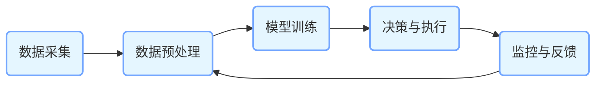

# AI驱动的软件项目自动化运维策略

> 关键词：AI、软件项目、自动化运维、策略、机器学习、智能监控、故障预测

> 摘要：本文围绕AI驱动的软件项目自动化运维策略展开深入探讨。在软件系统日益复杂的背景下，传统运维方式面临诸多挑战，而AI技术的融入为自动化运维带来了新的机遇。文章详细阐述了相关核心概念、算法原理、数学模型，通过项目实战案例展示具体实现过程，分析了实际应用场景，并推荐了相关的工具和资源。最后总结了未来发展趋势与挑战，旨在为软件项目的自动化运维提供全面、深入的技术参考和策略指导。

## 1. 背景介绍 
### 1.1 目的和范围
随着信息技术的飞速发展，软件项目的规模和复杂度不断增加，传统的人工运维方式在面对海量数据和复杂系统时显得力不从心。本文章的目的在于探讨如何利用AI技术实现软件项目的自动化运维，提高运维效率、降低成本、增强系统的稳定性和可靠性。范围涵盖了从核心概念的阐述到算法原理的分析，再到实际项目的应用案例，以及相关工具和资源的推荐等多个方面。

### 1.2 预期读者
本文预期读者包括软件开发者、运维工程师、软件架构师、CTO等IT领域的专业人士，以及对AI和自动化运维技术感兴趣的研究人员和学生。这些读者希望通过阅读本文，深入了解AI驱动的软件项目自动化运维策略，获取相关的技术知识和实践经验。

### 1.3 文档结构概述
本文将按照以下结构展开：首先介绍相关背景信息，包括目的、预期读者和文档结构概述等；接着阐述核心概念与联系，通过文本示意图和Mermaid流程图展示相关原理和架构；然后详细讲解核心算法原理和具体操作步骤，并使用Python源代码进行阐述；之后介绍数学模型和公式，并举例说明；再通过项目实战案例展示代码的实际实现和详细解释；接着分析实际应用场景；推荐相关的工具和资源；最后总结未来发展趋势与挑战，提供常见问题与解答以及扩展阅读和参考资料。

### 1.4 术语表
#### 1.4.1 核心术语定义
- **AI（Artificial Intelligence）**：即人工智能，是研究、开发用于模拟、延伸和扩展人的智能的理论、方法、技术及应用系统的一门新的技术科学。
- **自动化运维**：指利用工具和技术，实现软件系统运维过程的自动化，减少人工干预，提高运维效率和质量。
- **机器学习**：是一门多领域交叉学科，涉及概率论、统计学、逼近论、凸分析、算法复杂度理论等多门学科。它专门研究计算机怎样模拟或实现人类的学习行为，以获取新的知识或技能，重新组织已有的知识结构使之不断改善自身的性能。
- **智能监控**：利用AI技术对软件系统的运行状态进行实时监测和分析，及时发现潜在问题。
- **故障预测**：通过对系统运行数据的分析和建模，预测系统可能出现的故障，以便提前采取措施进行预防。

#### 1.4.2 相关概念解释
- **深度学习**：是机器学习的一个分支领域，它是一种基于对数据进行表征学习的方法。深度学习通过构建具有很多层的神经网络模型，自动从大量数据中学习到复杂的模式和特征。
- **大数据**：指无法在一定时间范围内用常规软件工具进行捕捉、管理和处理的数据集合，是需要新处理模式才能具有更强的决策力、洞察发现力和流程优化能力的海量、高增长率和多样化的信息资产。在自动化运维中，大数据为AI算法提供了丰富的训练数据。
- **云计算**：是基于互联网的相关服务的增加、使用和交付模式，通常涉及通过互联网来提供动态易扩展且经常是虚拟化的资源。云计算为软件项目的运行和运维提供了强大的计算资源和存储资源。

#### 1.4.3 缩略词列表
- **ML（Machine Learning）**：机器学习
- **DL（Deep Learning）**：深度学习
- **AIops（Artificial Intelligence for IT Operations）**：人工智能运维

## 2. 核心概念与联系 

### 核心概念原理
AI驱动的软件项目自动化运维主要基于以下几个核心概念：

#### 数据采集与预处理
数据是AI驱动自动化运维的基础。通过各种监控工具和传感器，采集软件系统的运行数据，包括系统性能指标（如CPU使用率、内存使用率、网络带宽等）、应用程序日志、用户行为数据等。采集到的数据通常是原始的、杂乱无章的，需要进行预处理，包括数据清洗（去除噪声和错误数据）、数据转换（如归一化、标准化等）和数据集成（将不同来源的数据整合到一起）。

#### 机器学习与深度学习模型
利用机器学习和深度学习算法对预处理后的数据进行分析和建模。常见的机器学习算法包括决策树、随机森林、支持向量机等，深度学习算法包括卷积神经网络（CNN）、循环神经网络（RNN）及其变体（如LSTM、GRU）等。这些模型可以用于故障预测、性能优化、异常检测等任务。

#### 智能决策与自动化执行
根据机器学习和深度学习模型的预测结果，进行智能决策，如自动调整系统配置、自动修复故障、自动进行资源分配等。通过自动化脚本和工具，将决策结果转化为实际的操作，实现软件项目的自动化运维。

### 架构的文本示意图
AI驱动的软件项目自动化运维架构主要包括以下几个层次：

#### 数据采集层
负责采集软件系统的各种运行数据，包括系统层数据、应用层数据和用户层数据。数据采集方式可以是实时采集、定时采集或事件驱动采集。

#### 数据处理层
对采集到的数据进行预处理，包括数据清洗、数据转换和数据集成。同时，将处理后的数据存储到数据仓库或数据库中，以便后续的分析和建模。

#### 模型训练层
利用机器学习和深度学习算法对处理后的数据进行训练，构建故障预测模型、性能优化模型、异常检测模型等。模型训练可以在本地服务器或云计算平台上进行。

#### 决策与执行层
根据训练好的模型，对软件系统的运行状态进行实时监测和分析，做出智能决策。同时，通过自动化脚本和工具，将决策结果转化为实际的操作，实现软件项目的自动化运维。

#### 监控与反馈层
对自动化运维的效果进行实时监控和评估，将监控结果反馈给模型训练层和决策与执行层，以便对模型和策略进行优化和调整。

### Mermaid流程图


## 3. 核心算法原理 & 具体操作步骤 

### 故障预测算法原理 - 基于LSTM的时间序列预测
长短期记忆网络（LSTM）是一种特殊的循环神经网络，能够有效地处理时间序列数据中的长期依赖关系。在软件项目自动化运维中，我们可以利用LSTM对系统性能指标的时间序列数据进行预测，从而提前发现潜在的故障。

#### 原理阐述
LSTM的核心是细胞状态（Cell State），它可以在时间序列中传递信息。LSTM通过三个门控单元（输入门、遗忘门和输出门）来控制细胞状态的更新和输出。

- **遗忘门**：决定上一时刻的细胞状态有多少信息需要被遗忘。
- **输入门**：决定当前输入有多少信息需要被添加到细胞状态中。
- **输出门**：决定当前细胞状态有多少信息需要被输出。

#### Python源代码实现
```python
import numpy as np
import pandas as pd
from keras.models import Sequential
from keras.layers import LSTM, Dense
from sklearn.preprocessing import MinMaxScaler

# 数据准备
def prepare_data(data, n_steps):
    X, y = [], []
    for i in range(len(data)):
        end_ix = i + n_steps
        if end_ix > len(data) - 1:
            break
        seq_x, seq_y = data[i:end_ix], data[end_ix]
        X.append(seq_x)
        y.append(seq_y)
    return np.array(X), np.array(y)

# 加载数据
data = pd.read_csv('system_performance.csv', header=None)
data = data.values.astype('float32')

# 数据归一化
scaler = MinMaxScaler(feature_range=(0, 1))
data = scaler.fit_transform(data)

# 准备训练数据
n_steps = 3
X, y = prepare_data(data, n_steps)

# 调整输入数据的形状以适应LSTM模型
X = X.reshape((X.shape[0], X.shape[1], 1))

# 构建LSTM模型
model = Sequential()
model.add(LSTM(50, activation='relu', input_shape=(n_steps, 1)))
model.add(Dense(1))
model.compile(optimizer='adam', loss='mse')

# 训练模型
model.fit(X, y, epochs=100, verbose=1)

# 进行预测
x_input = np.array([data[-3:, 0], data[-2:, 0], data[-1:, 0]])
x_input = x_input.reshape((1, n_steps, 1))
yhat = model.predict(x_input, verbose=0)

# 反归一化预测结果
yhat = scaler.inverse_transform(yhat)
print('预测结果:', yhat)
```

### 具体操作步骤
1. **数据采集**：使用监控工具采集软件系统的性能指标数据，如CPU使用率、内存使用率等，保存为CSV文件。
2. **数据预处理**：使用`pandas`库读取数据，并使用`MinMaxScaler`对数据进行归一化处理。
3. **数据准备**：将时间序列数据转换为适合LSTM模型输入的格式，即`[样本数,时间步长,特征数]`。
4. **模型构建**：使用`Keras`库构建LSTM模型，包括一个LSTM层和一个全连接层。
5. **模型训练**：使用训练数据对模型进行训练，设置训练轮数和优化器等参数。
6. **模型预测**：使用训练好的模型对未来的系统性能指标进行预测，并将预测结果进行反归一化处理。

## 4. 数学模型和公式 & 详细讲解 & 举例说明 

### LSTM的数学模型和公式
#### 遗忘门
遗忘门的作用是决定上一时刻的细胞状态 $C_{t-1}$ 有多少信息需要被遗忘。遗忘门的输出 $f_t$ 由以下公式计算：
$$
f_t = \sigma(W_f[h_{t-1}, x_t] + b_f)
$$
其中，$\sigma$ 是Sigmoid激活函数，$W_f$ 是遗忘门的权重矩阵，$h_{t-1}$ 是上一时刻的隐藏状态，$x_t$ 是当前时刻的输入，$b_f$ 是遗忘门的偏置向量。

#### 输入门
输入门的作用是决定当前输入 $x_t$ 有多少信息需要被添加到细胞状态中。输入门的输出 $i_t$ 和候选细胞状态 $\tilde{C}_t$ 由以下公式计算：
$$
i_t = \sigma(W_i[h_{t-1}, x_t] + b_i)
$$
$$
\tilde{C}_t = \tanh(W_C[h_{t-1}, x_t] + b_C)
$$
其中，$\sigma$ 是Sigmoid激活函数，$\tanh$ 是双曲正切激活函数，$W_i$ 和 $W_C$ 分别是输入门和候选细胞状态的权重矩阵，$b_i$ 和 $b_C$ 分别是输入门和候选细胞状态的偏置向量。

#### 细胞状态更新
细胞状态 $C_t$ 的更新由遗忘门和输入门的输出共同决定，更新公式如下：
$$
C_t = f_t \odot C_{t-1} + i_t \odot \tilde{C}_t
$$
其中，$\odot$ 表示逐元素相乘。

#### 输出门
输出门的作用是决定当前细胞状态 $C_t$ 有多少信息需要被输出。输出门的输出 $o_t$ 和当前时刻的隐藏状态 $h_t$ 由以下公式计算：
$$
o_t = \sigma(W_o[h_{t-1}, x_t] + b_o)
$$
$$
h_t = o_t \odot \tanh(C_t)
$$
其中，$\sigma$ 是Sigmoid激活函数，$W_o$ 是输出门的权重矩阵，$b_o$ 是输出门的偏置向量。

### 详细讲解
LSTM通过遗忘门、输入门和输出门的协同作用，能够有效地处理时间序列数据中的长期依赖关系。遗忘门控制了细胞状态的遗忘程度，输入门控制了新信息的添加，输出门控制了细胞状态的输出。通过不断地更新细胞状态和隐藏状态，LSTM能够学习到时间序列数据中的模式和规律。

### 举例说明
假设我们有一个时间序列数据 $[1, 2, 3, 4, 5, 6, 7, 8, 9, 10]$，我们想要使用LSTM预测下一个值。我们可以将数据划分为多个时间步长为3的样本，如 $[1, 2, 3]$ 预测 $4$，$[2, 3, 4]$ 预测 $5$ 等。然后使用上述的LSTM数学模型和公式进行训练和预测，最终得到预测结果。

## 5. 项目实战：代码实际案例和详细解释说明 

### 5.1  开发环境搭建
#### 操作系统
可以选择Linux（如Ubuntu、CentOS）或Windows操作系统。

#### 编程语言和开发工具
- **Python**：版本3.6及以上。
- **Anaconda**：用于管理Python环境和安装相关库。
- **IDE**：可以选择PyCharm、Jupyter Notebook等。

#### 相关库的安装
在命令行中使用以下命令安装所需的库：
```sh
pip install numpy pandas keras scikit-learn
```

### 5.2  源代码详细实现和代码解读
以下是一个完整的AI驱动的软件项目自动化运维的代码示例，包括数据采集、数据预处理、模型训练和预测等步骤。

```python
import numpy as np
import pandas as pd
from keras.models import Sequential
from keras.layers import LSTM, Dense
from sklearn.preprocessing import MinMaxScaler
import matplotlib.pyplot as plt

# 数据采集（模拟）
def simulate_data():
    # 模拟系统性能指标数据
    time_steps = 100
    data = np.sin(np.arange(time_steps) * 0.1) + np.random.normal(0, 0.1, time_steps)
    return data

# 数据预处理
def preprocess_data(data):
    # 数据归一化
    scaler = MinMaxScaler(feature_range=(0, 1))
    data = data.reshape(-1, 1)
    data = scaler.fit_transform(data)
    return data, scaler

# 数据准备
def prepare_data(data, n_steps):
    X, y = [], []
    for i in range(len(data)):
        end_ix = i + n_steps
        if end_ix > len(data) - 1:
            break
        seq_x, seq_y = data[i:end_ix], data[end_ix]
        X.append(seq_x)
        y.append(seq_y)
    return np.array(X), np.array(y)

# 构建LSTM模型
def build_model(n_steps):
    model = Sequential()
    model.add(LSTM(50, activation='relu', input_shape=(n_steps, 1)))
    model.add(Dense(1))
    model.compile(optimizer='adam', loss='mse')
    return model

# 训练模型
def train_model(model, X, y):
    model.fit(X, y, epochs=100, verbose=1)
    return model

# 进行预测
def predict(model, data, scaler, n_steps):
    x_input = data[-n_steps:].reshape((1, n_steps, 1))
    yhat = model.predict(x_input, verbose=0)
    yhat = scaler.inverse_transform(yhat)
    return yhat

# 主函数
def main():
    # 数据采集
    data = simulate_data()
    
    # 数据预处理
    data, scaler = preprocess_data(data)
    
    # 数据准备
    n_steps = 3
    X, y = prepare_data(data, n_steps)
    
    # 构建模型
    model = build_model(n_steps)
    
    # 训练模型
    model = train_model(model, X, y)
    
    # 进行预测
    yhat = predict(model, data, scaler, n_steps)
    
    # 可视化结果
    plt.plot(np.arange(len(data)), scaler.inverse_transform(data), label='Actual')
    plt.plot(len(data), yhat, 'ro', label='Predicted')
    plt.legend()
    plt.show()

if __name__ == "__main__":
    main()
```

### 5.3  代码解读与分析
1. **数据采集**：`simulate_data` 函数模拟了系统性能指标数据，实际应用中可以使用监控工具采集真实数据。
2. **数据预处理**：`preprocess_data` 函数使用`MinMaxScaler`对数据进行归一化处理，将数据缩放到0到1的范围内。
3. **数据准备**：`prepare_data` 函数将时间序列数据转换为适合LSTM模型输入的格式，即`[样本数,时间步长,特征数]`。
4. **模型构建**：`build_model` 函数使用`Keras`库构建LSTM模型，包括一个LSTM层和一个全连接层。
5. **模型训练**：`train_model` 函数使用训练数据对模型进行训练，设置训练轮数为100。
6. **模型预测**：`predict` 函数使用训练好的模型对未来的系统性能指标进行预测，并将预测结果进行反归一化处理。
7. **可视化结果**：使用`matplotlib`库将实际数据和预测结果进行可视化展示，方便观察预测效果。

## 6. 实际应用场景 

### 性能优化
通过对系统性能指标的实时监测和分析，利用AI算法预测系统的性能瓶颈，自动调整系统配置参数，如增加服务器资源、优化数据库查询语句等，以提高系统的性能和响应速度。

### 故障预测与预防
利用机器学习和深度学习模型对系统运行数据进行分析，预测系统可能出现的故障，如硬件故障、软件崩溃等。在故障发生之前，自动采取措施进行预防，如备份数据、重启服务等，减少系统停机时间。

### 资源管理
根据系统的负载情况和业务需求，利用AI算法自动进行资源分配和调度，如动态调整虚拟机的数量、分配存储资源等，提高资源利用率，降低成本。

### 安全监控
通过对用户行为数据和系统日志的分析，利用AI技术实时监测系统的安全状况，及时发现异常行为和安全漏洞，如入侵检测、恶意软件防范等，保障系统的安全性。

## 7. 工具和资源推荐
### 7.1 学习资源推荐
#### 7.1.1 书籍推荐
- 《Python机器学习》：介绍了Python在机器学习领域的应用，包括各种机器学习算法的原理和实现。
- 《深度学习》：由深度学习领域的三位先驱Ian Goodfellow、Yoshua Bengio和Aaron Courville撰写，是深度学习领域的经典教材。
- 《人工智能：一种现代的方法》：全面介绍了人工智能的各个领域，包括搜索、知识表示、推理、机器学习、自然语言处理等。

#### 7.1.2 在线课程
- Coursera上的“机器学习”课程：由斯坦福大学教授Andrew Ng主讲，是机器学习领域的经典课程。
- edX上的“深度学习”课程：由伯克利大学教授Stuart Russell和Peter Norvig主讲，深入介绍了深度学习的原理和应用。
- 中国大学MOOC上的“人工智能基础”课程：由国内知名高校的教授主讲，适合初学者学习人工智能的基础知识。

#### 7.1.3 技术博客和网站
- Medium：是一个汇聚了众多技术专家和开发者的博客平台，有很多关于AI和自动化运维的优质文章。
- arXiv：是一个预印本服务器，提供了大量的学术论文和研究成果，对于了解AI和自动化运维的最新研究动态非常有帮助。
- 开源中国：是国内知名的开源技术社区，有很多关于AI和自动化运维的技术文章和案例分享。

### 7.2 开发工具框架推荐
#### 7.2.1 IDE和编辑器
- PyCharm：是一款专门为Python开发设计的集成开发环境，提供了丰富的代码编辑、调试、测试等功能。
- Jupyter Notebook：是一个交互式的开发环境，适合进行数据分析、模型训练和可视化等工作。
- Visual Studio Code：是一款轻量级的代码编辑器，支持多种编程语言和插件，具有强大的扩展功能。

#### 7.2.2 调试和性能分析工具
- TensorBoard：是TensorFlow提供的一个可视化工具，用于监控模型的训练过程、查看模型的结构和性能指标等。
- Py-Spy：是一个用于分析Python代码性能的工具，可以帮助开发者找出代码中的性能瓶颈。
- cProfile：是Python标准库中的一个性能分析工具，可以统计函数的调用次数、执行时间等信息。

#### 7.2.3 相关框架和库
- TensorFlow：是Google开发的一个开源深度学习框架，提供了丰富的深度学习模型和工具。
- PyTorch：是Facebook开发的一个开源深度学习框架，具有动态计算图和易于使用的特点。
- Scikit-learn：是一个用于机器学习的Python库，提供了各种机器学习算法和工具，如分类、回归、聚类等。

### 7.3 相关论文著作推荐
#### 7.3.1 经典论文
- “Long Short-Term Memory”：由Sepp Hochreiter和Jürgen Schmidhuber发表，介绍了LSTM的原理和实现。
- “Gradient-based learning applied to document recognition”：由Yann LeCun等人发表，介绍了卷积神经网络（CNN）的原理和应用。
- “Attention Is All You Need”：由Ashish Vaswani等人发表，介绍了Transformer模型的原理和应用。

#### 7.3.2 最新研究成果
- 关注顶级学术会议，如NeurIPS（神经信息处理系统大会）、ICML（国际机器学习会议）、CVPR（计算机视觉与模式识别会议）等，这些会议上会发布很多关于AI和自动化运维的最新研究成果。
- 查阅相关的学术期刊，如Journal of Artificial Intelligence Research（JAIR）、Artificial Intelligence（AI）等，这些期刊上会发表很多高质量的学术论文。

#### 7.3.3 应用案例分析
- 研究一些知名公司的AI驱动的自动化运维案例，如Google的Borg系统、Facebook的F1数据库等，了解他们在实际应用中遇到的问题和解决方案。
- 参考一些开源项目的文档和案例，如Kubernetes、Prometheus等，学习他们的设计理念和实现方法。

## 8. 总结：未来发展趋势与挑战
### 未来发展趋势
- **融合更多AI技术**：未来的自动化运维将融合更多的AI技术，如强化学习、迁移学习、元学习等，以提高系统的智能决策能力和自适应能力。
- **实现全栈自动化运维**：从系统层、应用层到用户层，实现全栈的自动化运维，包括硬件设备的自动化管理、软件系统的自动化部署和更新、用户体验的自动化优化等。
- **跨领域融合**：AI驱动的自动化运维将与其他领域进行深度融合，如物联网、大数据、云计算等，实现更加智能化、高效化的运维管理。
- **可视化与可解释性**：提高AI模型的可视化和可解释性，让运维人员能够更好地理解模型的决策过程和结果，增强对自动化运维系统的信任。

### 挑战
- **数据质量和安全**：AI驱动的自动化运维依赖于大量的数据，数据的质量和安全是关键问题。如何保证数据的准确性、完整性和安全性，防止数据泄露和滥用，是需要解决的挑战。
- **模型复杂度和性能**：随着AI模型的不断发展，模型的复杂度也在不断增加。如何在保证模型性能的前提下，降低模型的复杂度，提高模型的训练和推理效率，是需要解决的问题。
- **人才短缺**：AI和自动化运维领域的专业人才短缺，如何培养和吸引更多的专业人才，提高运维人员的技术水平和能力，是推动AI驱动的自动化运维发展的关键。
- **伦理和法律问题**：AI驱动的自动化运维涉及到很多伦理和法律问题，如算法偏见、隐私保护、责任界定等。如何制定相应的伦理和法律规范，确保自动化运维系统的合法、合规和公正，是需要解决的挑战。

## 9. 附录：常见问题与解答
### 问题1：AI驱动的自动化运维需要多少数据？
答：数据量的需求取决于具体的应用场景和模型复杂度。一般来说，数据量越大，模型的训练效果越好。但同时也需要注意数据的质量，避免使用噪声数据和错误数据。

### 问题2：如何选择合适的AI算法？
答：选择合适的AI算法需要考虑多个因素，如数据类型、问题类型、模型复杂度、计算资源等。一般来说，可以先尝试一些简单的算法，如决策树、随机森林等，然后根据实验结果选择更复杂的算法，如深度学习算法。

### 问题3：AI模型的训练时间和计算资源需求如何？
答：AI模型的训练时间和计算资源需求取决于模型的复杂度和数据量。一般来说，深度学习模型的训练时间和计算资源需求较高，需要使用GPU或云计算平台进行加速。

### 问题4：如何评估AI驱动的自动化运维系统的性能？
答：可以使用多种指标来评估AI驱动的自动化运维系统的性能，如准确率、召回率、F1值、均方误差等。同时，还可以通过实际应用场景中的测试和验证，评估系统的可靠性、稳定性和效率。

## 10. 扩展阅读 & 参考资料
- 李开复. 《人工智能》. 文化发展出版社.
- 周志华. 《机器学习》. 清华大学出版社.
- Goodfellow, I., Bengio, Y., & Courville, A. (2016). Deep Learning. MIT Press.
- Hochreiter, S., & Schmidhuber, J. (1997). Long Short-Term Memory. Neural Computation, 9(8), 1735-1780.
- Vaswani, A., Shazeer, N., Parmar, N., Uszkoreit, J., Jones, L., Gomez, A. N., ... & Polosukhin, I. (2017). Attention Is All You Need. Advances in Neural Information Processing Systems.
- 相关技术博客和论坛，如Stack Overflow、Reddit等。
- 相关的开源项目和文档，如GitHub上的AI和自动化运维相关项目。