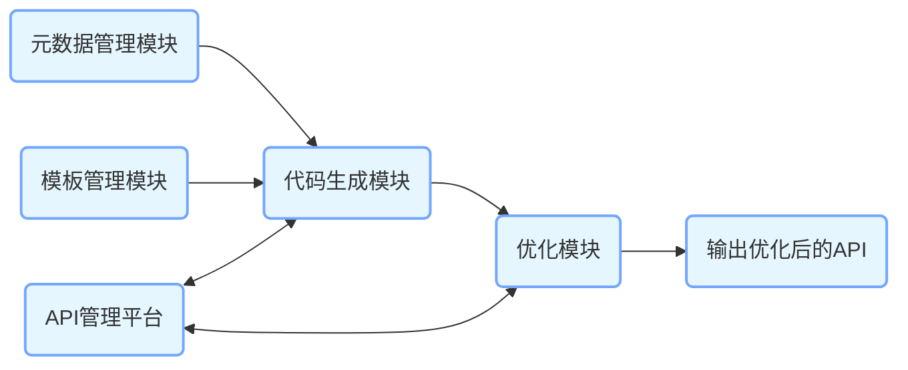

# API设计自动化：接口生成与优化

> 关键词：API设计自动化、接口生成、接口优化、自动化工具、API管理

> 摘要：本文围绕API设计自动化展开，深入探讨接口生成与优化的相关技术和方法。详细介绍API设计自动化的背景、核心概念、算法原理、数学模型等内容，并结合项目实战案例进行代码实现与分析。同时，阐述API设计自动化在不同场景下的实际应用，推荐相关的工具和资源。最后，总结API设计自动化的未来发展趋势与挑战，为读者提供全面且深入的技术参考，助力读者更好地掌握API设计自动化的关键要点，提升API设计的效率和质量。

## 1. 背景介绍 
### 1.1 目的和范围
随着软件系统的不断发展和复杂化，API（Application Programming Interface，应用程序编程接口）在系统间的交互和集成中扮演着越来越重要的角色。传统的API设计方式往往依赖人工手动编写和维护，不仅效率低下，还容易出现错误和不一致性。API设计自动化旨在通过技术手段实现接口的自动生成和优化，提高API设计的效率、准确性和可维护性。

本文的范围涵盖了API设计自动化的各个方面，包括核心概念、算法原理、数学模型、项目实战、实际应用场景等，旨在为读者提供全面的技术指导和实践经验。

### 1.2 预期读者
本文预期读者包括软件开发者、API设计者、软件架构师、技术管理人员等相关领域的专业人士。对于希望了解API设计自动化技术，提升API设计能力和效率的读者具有较高的参考价值。

### 1.3 文档结构概述
本文将按照以下结构进行组织：
1. **背景介绍**：介绍API设计自动化的目的、范围、预期读者和文档结构概述，以及相关术语的定义和解释。
2. **核心概念与联系**：阐述API设计自动化的核心概念、原理和架构，并通过文本示意图和Mermaid流程图进行直观展示。
3. **核心算法原理 & 具体操作步骤**：详细讲解API设计自动化的核心算法原理，并使用Python源代码进行具体操作步骤的阐述。
4. **数学模型和公式 & 详细讲解 & 举例说明**：介绍API设计自动化中涉及的数学模型和公式，并进行详细讲解和举例说明。
5. **项目实战：代码实际案例和详细解释说明**：通过实际项目案例，介绍开发环境搭建、源代码实现和代码解读，帮助读者更好地理解和应用API设计自动化技术。
6. **实际应用场景**：探讨API设计自动化在不同领域和场景下的实际应用。
7. **工具和资源推荐**：推荐相关的学习资源、开发工具框架和论文著作，帮助读者进一步深入学习和研究API设计自动化技术。
8. **总结：未来发展趋势与挑战**：总结API设计自动化的未来发展趋势和面临的挑战。
9. **附录：常见问题与解答**：解答读者在学习和应用API设计自动化技术过程中常见的问题。
10. **扩展阅读 & 参考资料**：提供相关的扩展阅读资料和参考书目，方便读者进一步深入学习。

### 1.4 术语表
#### 1.4.1 核心术语定义
- **API（Application Programming Interface）**：应用程序编程接口，是一组定义、协议和工具，用于构建软件应用程序，允许不同的软件系统之间进行交互和通信。
- **API设计自动化**：利用技术手段自动生成和优化API接口的过程，旨在提高API设计的效率和质量。
- **接口生成**：根据一定的规则和模板，自动生成API接口的过程。
- **接口优化**：对已有的API接口进行性能、安全性、易用性等方面的优化，提高接口的质量和可用性。

#### 1.4.2 相关概念解释
- **元数据**：描述数据的数据，在API设计自动化中，元数据可以用于描述API接口的各种属性和信息，如接口名称、参数、返回值等。
- **代码生成器**：根据元数据和模板，自动生成代码的工具，在API设计自动化中，代码生成器可以用于生成API接口的实现代码。
- **API管理平台**：用于管理API的全生命周期，包括API的设计、开发、发布、监控和维护等功能的平台。

#### 1.4.3 缩略词列表
- **REST（Representational State Transfer）**：表述性状态转移，一种软件架构风格，常用于设计网络API。
- **JSON（JavaScript Object Notation）**：一种轻量级的数据交换格式，常用于API接口的数据传输。
- **XML（eXtensible Markup Language）**：一种可扩展标记语言，也常用于API接口的数据传输。

## 2. 核心概念与联系 
### 核心概念原理
API设计自动化的核心原理是基于元数据和模板，通过自动化工具实现API接口的自动生成和优化。元数据是描述API接口的各种属性和信息的结构化数据，包括接口名称、参数、返回值、请求方法、请求路径等。模板是定义API接口代码结构和格式的文件，包含了代码的基本框架和占位符。

自动化工具根据元数据和模板，将元数据中的信息填充到模板的占位符中，生成API接口的实现代码。同时，自动化工具还可以对生成的代码进行优化，如代码格式化、性能优化、安全性检查等，提高API接口的质量和可用性。

### 架构的文本示意图
API设计自动化的架构主要包括以下几个部分：
1. **元数据管理模块**：负责管理API接口的元数据，包括元数据的存储、查询、修改等操作。
2. **模板管理模块**：负责管理API接口的模板，包括模板的存储、查询、修改等操作。
3. **代码生成模块**：根据元数据和模板，生成API接口的实现代码。
4. **优化模块**：对生成的代码进行优化，如代码格式化、性能优化、安全性检查等。
5. **API管理平台**：用于管理API的全生命周期，包括API的设计、开发、发布、监控和维护等功能。

```plaintext
+-----------------+       +-----------------+       +-----------------+
| 元数据管理模块 | ----> | 代码生成模块    | ----> | 优化模块        |
+-----------------+       +-----------------+       +-----------------+
       ^                          ^                          |
       |                          |                          |
       |                          |                          v
+-----------------+       +-----------------+       +-----------------+
| 模板管理模块    |       | API管理平台     | <---- | 输出优化后的API |
+-----------------+       +-----------------+       +-----------------+
```

### Mermaid流程图


## 3. 核心算法原理 & 具体操作步骤 
### 核心算法原理
API设计自动化的核心算法主要包括元数据解析算法、模板渲染算法和代码优化算法。

#### 元数据解析算法
元数据解析算法用于解析元数据文件，提取元数据中的信息，如接口名称、参数、返回值等。常见的元数据格式包括JSON、XML等。以下是一个使用Python解析JSON格式元数据的示例代码：

```python
import json

def parse_metadata(metadata_file):
    try:
        with open(metadata_file, 'r') as f:
            metadata = json.load(f)
        return metadata
    except Exception as e:
        print(f"Error parsing metadata: {e}")
        return None
```

#### 模板渲染算法
模板渲染算法用于将元数据中的信息填充到模板的占位符中，生成API接口的实现代码。常见的模板引擎包括Jinja2、Mustache等。以下是一个使用Jinja2模板引擎进行模板渲染的示例代码：

```python
from jinja2 import Environment, FileSystemLoader

def render_template(metadata, template_file):
    try:
        env = Environment(loader=FileSystemLoader('.'))
        template = env.get_template(template_file)
        rendered_code = template.render(metadata)
        return rendered_code
    except Exception as e:
        print(f"Error rendering template: {e}")
        return None
```

#### 代码优化算法
代码优化算法用于对生成的代码进行优化，如代码格式化、性能优化、安全性检查等。常见的代码优化工具包括Black、Pylint等。以下是一个使用Black进行代码格式化的示例代码：

```python
import black

def optimize_code(code):
    try:
        mode = black.FileMode()
        optimized_code = black.format_str(code, mode=mode)
        return optimized_code
    except Exception as e:
        print(f"Error optimizing code: {e}")
        return code
```

### 具体操作步骤
1. **准备元数据文件**：根据API接口的需求，编写元数据文件，如JSON或XML格式的文件，包含接口名称、参数、返回值等信息。
2. **准备模板文件**：根据API接口的实现语言和框架，编写模板文件，包含代码的基本框架和占位符。
3. **解析元数据**：使用元数据解析算法解析元数据文件，提取元数据中的信息。
4. **渲染模板**：使用模板渲染算法将元数据中的信息填充到模板的占位符中，生成API接口的实现代码。
5. **优化代码**：使用代码优化算法对生成的代码进行优化，如代码格式化、性能优化、安全性检查等。
6. **输出优化后的API**：将优化后的代码保存到文件中，或者直接部署到API管理平台中。

以下是一个完整的示例代码，演示了如何使用上述算法和步骤实现API设计自动化：

```python
# 解析元数据
metadata = parse_metadata('metadata.json')
if metadata:
    # 渲染模板
    rendered_code = render_template(metadata, 'template.j2')
    if rendered_code:
        # 优化代码
        optimized_code = optimize_code(rendered_code)
        # 输出优化后的API
        with open('api.py', 'w') as f:
            f.write(optimized_code)
```

## 4. 数学模型和公式 & 详细讲解 & 举例说明 
### 数学模型
在API设计自动化中，数学模型主要用于描述API接口的性能和质量指标，如响应时间、吞吐量、错误率等。常见的数学模型包括排队论模型、马尔可夫链模型等。

#### 排队论模型
排队论模型用于描述顾客到达系统、排队等待服务、接受服务和离开系统的过程。在API设计自动化中，排队论模型可以用于描述API请求的到达、排队等待处理、处理和返回响应的过程。

排队论模型的基本参数包括：
- $\lambda$：顾客到达率，表示单位时间内到达系统的顾客数量。
- $\mu$：服务率，表示单位时间内系统能够处理的顾客数量。
- $\rho$：利用率，表示系统的繁忙程度，计算公式为 $\rho = \frac{\lambda}{\mu}$。
- $L_s$：系统中的平均顾客数量。
- $L_q$：队列中的平均顾客数量。
- $W_s$：顾客在系统中的平均停留时间。
- $W_q$：顾客在队列中的平均等待时间。

排队论模型的主要公式包括：
- 当 $\rho < 1$ 时，系统是稳定的，$L_s = \frac{\rho}{1 - \rho}$，$L_q = \frac{\rho^2}{1 - \rho}$，$W_s = \frac{1}{\mu - \lambda}$，$W_q = \frac{\lambda}{\mu(\mu - \lambda)}$。

#### 马尔可夫链模型
马尔可夫链模型用于描述系统在不同状态之间的转移过程。在API设计自动化中，马尔可夫链模型可以用于描述API接口在不同状态（如正常、异常、超时等）之间的转移过程。

马尔可夫链模型的基本参数包括：
- 状态集合 $S = \{s_1, s_2, \cdots, s_n\}$，表示系统的所有可能状态。
- 转移概率矩阵 $P = (p_{ij})_{n \times n}$，其中 $p_{ij}$ 表示系统从状态 $s_i$ 转移到状态 $s_j$ 的概率。

马尔可夫链模型的主要公式包括：
- 状态转移方程：$\pi_{k + 1} = \pi_k P$，其中 $\pi_k$ 表示系统在第 $k$ 步的状态概率分布。

### 详细讲解
#### 排队论模型的应用
排队论模型可以用于分析API接口的性能瓶颈，如确定系统的最大并发请求数、平均响应时间等。通过调整系统的参数（如增加服务器数量、优化算法等），可以提高系统的性能和吞吐量。

例如，假设一个API接口的顾客到达率 $\lambda = 10$ 次/秒，服务率 $\mu = 20$ 次/秒，则利用率 $\rho = \frac{\lambda}{\mu} = \frac{10}{20} = 0.5$。根据排队论模型的公式，可以计算出系统中的平均顾客数量 $L_s = \frac{\rho}{1 - \rho} = \frac{0.5}{1 - 0.5} = 1$，队列中的平均顾客数量 $L_q = \frac{\rho^2}{1 - \rho} = \frac{0.5^2}{1 - 0.5} = 0.5$，顾客在系统中的平均停留时间 $W_s = \frac{1}{\mu - \lambda} = \frac{1}{20 - 10} = 0.1$ 秒，顾客在队列中的平均等待时间 $W_q = \frac{\lambda}{\mu(\mu - \lambda)} = \frac{10}{20(20 - 10)} = 0.05$ 秒。

#### 马尔可夫链模型的应用
马尔可夫链模型可以用于分析API接口的可靠性和稳定性，如计算API接口在不同状态之间的转移概率、平均故障间隔时间等。通过调整系统的参数（如增加备份服务器、优化网络配置等），可以提高系统的可靠性和稳定性。

例如，假设一个API接口的状态集合 $S = \{正常, 异常, 超时\}$，转移概率矩阵 $P = \begin{bmatrix} 0.9 & 0.05 & 0.05 \\ 0.2 & 0.7 & 0.1 \\ 0.1 & 0.1 & 0.8 \end{bmatrix}$，初始状态概率分布 $\pi_0 = [1, 0, 0]$。根据马尔可夫链模型的状态转移方程，可以计算出系统在第 $k$ 步的状态概率分布 $\pi_k$。

### 举例说明
#### 排队论模型举例
假设一个API接口的顾客到达率 $\lambda = 15$ 次/秒，服务率 $\mu = 20$ 次/秒，计算系统的利用率、系统中的平均顾客数量、队列中的平均顾客数量、顾客在系统中的平均停留时间和顾客在队列中的平均等待时间。

1. 计算利用率：$\rho = \frac{\lambda}{\mu} = \frac{15}{20} = 0.75$。
2. 计算系统中的平均顾客数量：$L_s = \frac{\rho}{1 - \rho} = \frac{0.75}{1 - 0.75} = 3$。
3. 计算队列中的平均顾客数量：$L_q = \frac{\rho^2}{1 - \rho} = \frac{0.75^2}{1 - 0.75} = 2.25$。
4. 计算顾客在系统中的平均停留时间：$W_s = \frac{1}{\mu - \lambda} = \frac{1}{20 - 15} = 0.2$ 秒。
5. 计算顾客在队列中的平均等待时间：$W_q = \frac{\lambda}{\mu(\mu - \lambda)} = \frac{15}{20(20 - 15)} = 0.15$ 秒。

#### 马尔可夫链模型举例
假设一个API接口的状态集合 $S = \{正常, 异常, 超时\}$，转移概率矩阵 $P = \begin{bmatrix} 0.8 & 0.1 & 0.1 \\ 0.3 & 0.6 & 0.1 \\ 0.2 & 0.2 & 0.6 \end{bmatrix}$，初始状态概率分布 $\pi_0 = [1, 0, 0]$，计算系统在第 1 步和第 2 步的状态概率分布。

1. 计算系统在第 1 步的状态概率分布：$\pi_1 = \pi_0 P = [1, 0, 0] \begin{bmatrix} 0.8 & 0.1 & 0.1 \\ 0.3 & 0.6 & 0.1 \\ 0.2 & 0.2 & 0.6 \end{bmatrix} = [0.8, 0.1, 0.1]$。
2. 计算系统在第 2 步的状态概率分布：$\pi_2 = \pi_1 P = [0.8, 0.1, 0.1] \begin{bmatrix} 0.8 & 0.1 & 0.1 \\ 0.3 & 0.6 & 0.1 \\ 0.2 & 0.2 & 0.6 \end{bmatrix} = [0.69, 0.16, 0.15]$。

## 5. 项目实战：代码实际案例和详细解释说明 
### 5.1  开发环境搭建
#### 安装Python
首先，确保你已经安装了Python 3.x版本。可以从Python官方网站（https://www.python.org/downloads/） 下载并安装适合你操作系统的Python版本。

#### 安装必要的库
使用pip命令安装以下必要的库：
```bash
pip install jinja2 black
```

### 5.2  源代码详细实现和代码解读
#### 元数据文件（metadata.json）
```json
{
    "api_name": "example_api",
    "parameters": [
        {
            "name": "param1",
            "type": "string",
            "description": "Example parameter 1"
        },
        {
            "name": "param2",
            "type": "int",
            "description": "Example parameter 2"
        }
    ],
    "return_value": {
        "type": "string",
        "description": "Example return value"
    }
}
```

#### 模板文件（template.j2）
```python
def {{ api_name }}({{ ', '.join([param.name for param in parameters]) }}):
    # {{ return_value.description }}
    return "This is an example API."
```

#### 主程序文件（main.py）
```python
import json
from jinja2 import Environment, FileSystemLoader
import black

def parse_metadata(metadata_file):
    try:
        with open(metadata_file, 'r') as f:
            metadata = json.load(f)
        return metadata
    except Exception as e:
        print(f"Error parsing metadata: {e}")
        return None

def render_template(metadata, template_file):
    try:
        env = Environment(loader=FileSystemLoader('.'))
        template = env.get_template(template_file)
        rendered_code = template.render(metadata)
        return rendered_code
    except Exception as e:
        print(f"Error rendering template: {e}")
        return None

def optimize_code(code):
    try:
        mode = black.FileMode()
        optimized_code = black.format_str(code, mode=mode)
        return optimized_code
    except Exception as e:
        print(f"Error optimizing code: {e}")
        return code

if __name__ == "__main__":
    # 解析元数据
    metadata = parse_metadata('metadata.json')
    if metadata:
        # 渲染模板
        rendered_code = render_template(metadata, 'template.j2')
        if rendered_code:
            # 优化代码
            optimized_code = optimize_code(rendered_code)
            # 输出优化后的API
            with open('api.py', 'w') as f:
                f.write(optimized_code)
```

### 5.3  代码解读与分析
#### 元数据文件解读
元数据文件 `metadata.json` 包含了API接口的基本信息，如接口名称、参数、返回值等。这些信息将被用于生成API接口的实现代码。

#### 模板文件解读
模板文件 `template.j2` 定义了API接口的代码结构和格式，包含了代码的基本框架和占位符。占位符使用Jinja2模板引擎的语法，将在模板渲染过程中被元数据中的信息替换。

#### 主程序文件解读
主程序文件 `main.py` 实现了API设计自动化的主要逻辑，包括元数据解析、模板渲染、代码优化和输出优化后的API。具体步骤如下：
1. **解析元数据**：调用 `parse_metadata` 函数解析元数据文件 `metadata.json`，提取元数据中的信息。
2. **渲染模板**：调用 `render_template` 函数将元数据中的信息填充到模板文件 `template.j2` 的占位符中，生成API接口的实现代码。
3. **优化代码**：调用 `optimize_code` 函数对生成的代码进行优化，如代码格式化。
4. **输出优化后的API**：将优化后的代码保存到文件 `api.py` 中。

## 6. 实际应用场景 
### 企业级应用开发
在企业级应用开发中，API设计自动化可以提高API开发的效率和质量，减少人工编写和维护API接口的工作量。例如，企业内部的不同部门或系统之间需要进行数据交互和业务协同，通过API设计自动化可以快速生成和优化API接口，实现系统间的无缝集成。

### 开源项目开发
在开源项目开发中，API设计自动化可以帮助开发者快速定义和发布API接口，提高项目的可维护性和可扩展性。例如，开源的Web框架、机器学习库等项目，通过API设计自动化可以方便地生成API文档和示例代码，降低用户使用和贡献的门槛。

### 云计算和微服务架构
在云计算和微服务架构中，API设计自动化可以实现服务之间的快速集成和通信。例如，云服务提供商提供的各种云服务，如计算、存储、数据库等，通过API设计自动化可以方便地生成和优化API接口，让用户可以快速调用和集成这些云服务。

### 移动应用开发
在移动应用开发中，API设计自动化可以提高移动应用与后端服务器之间的交互效率和稳定性。例如，移动应用需要调用后端服务器的API接口获取数据、提交表单等，通过API设计自动化可以生成高效、安全的API接口，提升用户体验。

## 7. 工具和资源推荐
### 7.1 学习资源推荐
#### 7.1.1 书籍推荐
- 《RESTful API 设计模式》：介绍RESTful API的设计原则、模式和最佳实践，帮助读者掌握API设计的核心要点。
- 《Python 自动化测试实战》：介绍Python在自动化测试中的应用，包括API测试、自动化脚本编写等内容，有助于读者提升API测试和自动化的能力。
- 《软件架构设计：程序员向架构师转型必备》：讲解软件架构设计的基本概念、原则和方法，对理解API设计自动化在软件架构中的作用有很大帮助。

#### 7.1.2 在线课程
- Coursera上的“API Design and Documentation”课程：由专业讲师讲解API设计和文档编写的相关知识和技能。
- edX上的“Building Scalable RESTful APIs”课程：深入介绍如何构建可扩展的RESTful API，适合有一定基础的开发者学习。
- 慕课网上的“Python Web API开发实战”课程：通过实际项目案例，详细讲解如何使用Python开发Web API。

#### 7.1.3 技术博客和网站
- API Evangelist（https://apievangelist.com/）：一个专注于API行业的博客，提供API设计、开发、管理等方面的最新资讯和技术文章。
- RESTful API Tutorial（https://www.restapitutorial.com/）：提供RESTful API的详细教程和示例，帮助读者快速入门和掌握RESTful API的开发。
- Stack Overflow（https://stackoverflow.com/）：一个知名的技术问答社区，有大量关于API设计和开发的问题和解答，可以帮助读者解决实际遇到的问题。

### 7.2 开发工具框架推荐
#### 7.2.1 IDE和编辑器
- PyCharm：一款专业的Python集成开发环境，提供代码编辑、调试、版本控制等功能，适合Python开发者进行API设计自动化开发。
- Visual Studio Code：一款轻量级的代码编辑器，支持多种编程语言和插件扩展，具有丰富的代码编辑和调试功能，可用于API设计自动化的开发和调试。
- IntelliJ IDEA：一款功能强大的Java集成开发环境，也支持Python等其他编程语言，适合Java开发者进行API设计自动化开发。

#### 7.2.2 调试和性能分析工具
- Postman：一款流行的API调试工具，支持发送各种类型的HTTP请求，方便开发者测试和调试API接口。
- Swagger UI：一个可视化的API文档和测试工具，可以根据API的元数据自动生成API文档，并提供交互式的测试界面，方便开发者进行API的测试和调试。
- Apache JMeter：一款开源的性能测试工具，可用于对API接口进行性能测试和分析，帮助开发者发现和解决API接口的性能问题。

#### 7.2.3 相关框架和库
- Flask：一个轻量级的Python Web框架，简单易用，适合快速开发RESTful API。
- Django REST framework：一个基于Django的强大的RESTful API开发框架，提供了丰富的功能和工具，可用于开发复杂的RESTful API。
- FastAPI：一个快速的Python Web框架，基于Python的类型提示，具有高性能和易于使用的特点，适合开发高性能的RESTful API。

### 7.3 相关论文著作推荐
#### 7.3.1 经典论文
- “Architectural Styles and the Design of Network-based Software Architectures”：这篇论文提出了REST架构风格的概念和原则，是RESTful API设计的经典之作。
- “API Design for C++”：介绍了C++语言中API设计的方法和技巧，对理解API设计的一般性原则有很大帮助。
- “Designing Evolvable Web APIs with ASP.NET”：讲解了如何使用ASP.NET设计可演进的Web API，对API设计的演进和维护有一定的参考价值。

#### 7.3.2 最新研究成果
- 关注顶级学术会议和期刊，如ACM SIGCOMM、IEEE INFOCOM等，这些会议和期刊上发表的最新研究成果可以帮助读者了解API设计自动化领域的最新技术和趋势。
- 一些知名的研究机构和学者也会在其个人网站或学术平台上发布最新的研究成果，如MIT的计算机科学与人工智能实验室（CSAIL）、斯坦福大学的计算机科学系等。

#### 7.3.3 应用案例分析
- 《API Economy: How Developers and Companies Are Monetizing APIs》：通过实际的应用案例，分析了API经济的发展现状和趋势，以及企业如何通过API实现业务创新和盈利。
- 《API Management in the Cloud: Strategies and Best Practices》：介绍了在云计算环境下API管理的策略和最佳实践，包含了大量的实际应用案例，对企业进行API管理有很大的参考价值。

## 8. 总结：未来发展趋势与挑战
### 未来发展趋势
#### 智能化和自动化程度不断提高
随着人工智能和机器学习技术的不断发展，API设计自动化将朝着更加智能化和自动化的方向发展。例如，利用自然语言处理技术实现对API需求的自动理解和分析，利用机器学习算法自动生成最优的API接口设计方案。

#### 与云计算和微服务的深度融合
云计算和微服务架构的广泛应用，将促使API设计自动化与云计算和微服务更加紧密地结合。例如，在云原生环境中，API设计自动化可以实现服务的快速部署和弹性伸缩，提高系统的性能和可靠性。

#### 标准化和规范化
API设计自动化将越来越注重标准化和规范化，以提高API的互操作性和可维护性。例如，制定统一的API设计规范和元数据标准，促进不同系统和平台之间的API集成和共享。

#### 安全和隐私保护
随着API的广泛应用，安全和隐私保护将成为API设计自动化的重要关注点。未来的API设计自动化工具将更加注重安全和隐私保护功能的实现，如加密传输、身份认证、访问控制等。

### 挑战
#### 技术复杂度
API设计自动化涉及到多个领域的技术，如元数据管理、模板引擎、代码生成、性能优化等，技术复杂度较高。需要开发者具备广泛的技术知识和丰富的实践经验，才能有效地实现API设计自动化。

#### 数据质量和一致性
API设计自动化依赖于高质量和一致的元数据。如果元数据存在错误或不一致性，将导致生成的API接口出现问题。因此，如何保证元数据的质量和一致性是API设计自动化面临的一个重要挑战。

#### 兼容性和互操作性
不同的系统和平台可能采用不同的API设计规范和技术标准，这给API设计自动化的兼容性和互操作性带来了挑战。如何实现不同系统和平台之间的API集成和共享，是API设计自动化需要解决的问题之一。

#### 安全和隐私问题
API接口的安全和隐私问题是API设计自动化必须面对的挑战。如何保证API接口的安全性和隐私性，防止数据泄露和恶意攻击，是API设计自动化需要重点关注的问题。

## 9. 附录：常见问题与解答
### 1. 如何选择合适的元数据格式？
选择合适的元数据格式需要考虑多个因素，如数据的复杂度、可读性、可维护性、与现有系统的兼容性等。常见的元数据格式包括JSON、XML、YAML等。JSON格式简洁、易于解析和生成，适合大多数场景；XML格式具有良好的结构化和可读性，适合处理复杂的数据；YAML格式则更加简洁和易读，适合配置文件和数据描述。

### 2. 如何优化API接口的性能？
优化API接口的性能可以从多个方面入手，如优化算法、减少数据传输量、使用缓存、分布式部署等。具体来说，可以采用以下方法：
- 优化算法：选择高效的算法和数据结构，减少计算复杂度。
- 减少数据传输量：只返回必要的数据，避免返回过多的冗余数据。
- 使用缓存：对于频繁访问的数据，可以使用缓存技术，减少数据库查询和计算的次数。
- 分布式部署：将API服务部署到多个服务器上，实现负载均衡，提高系统的并发处理能力。

### 3. 如何保证API接口的安全性？
保证API接口的安全性可以从以下几个方面入手：
- 身份认证：对API请求进行身份认证，确保请求来自合法的用户或系统。常见的身份认证方式包括基本认证、OAuth、JWT等。
- 访问控制：根据用户的角色和权限，对API接口的访问进行控制，确保用户只能访问其有权限访问的资源。
- 数据加密：对API请求和响应的数据进行加密，防止数据在传输过程中被窃取或篡改。常见的加密算法包括SSL/TLS、AES等。
- 安全审计：对API接口的访问进行审计，记录用户的操作和行为，及时发现和处理安全问题。

### 4. 如何处理API接口的版本管理？
处理API接口的版本管理可以采用以下几种方法：
- 路径版本化：在API请求的路径中包含版本号，如 `/v1/api`、`/v2/api` 等。这种方法简单直观，易于实现，但会增加URL的长度。
- 头部版本化：在API请求的头部中包含版本号，如 `Accept-Version: v1`、`Accept-Version: v2` 等。这种方法不会影响URL的长度，但需要在服务器端进行相应的处理。
- 内容协商版本化：根据客户端请求的内容类型（如 `Accept` 头部）来确定API接口的版本。这种方法可以实现更加灵活的版本管理，但需要在服务器端进行复杂的处理。

## 10. 扩展阅读 & 参考资料
### 扩展阅读
- 《APIs for Dummies》：一本通俗易懂的API入门书籍，适合对API不太熟悉的读者阅读。
- 《The API Economy: How to Monetize Your Data and Apps》：深入探讨了API经济的概念和发展趋势，以及企业如何通过API实现业务创新和盈利。
- 《REST in Practice: Hypermedia and Systems Architecture》：通过实际的案例和实践经验，介绍了REST架构风格的应用和实现方法。

### 参考资料
- OpenAPI Specification（https://swagger.io/specification/）：一个用于描述RESTful API的标准规范，提供了丰富的工具和资源，可用于API的设计、开发、测试和文档生成。
- JSON Schema（https://json-schema.org/）：一个用于验证JSON数据的标准规范，可用于定义API接口的输入和输出数据结构。
- API Blueprint（https://apiblueprint.org/）：一个用于描述API的高级文本格式，支持生成API文档和模拟服务器，方便API的设计和开发。