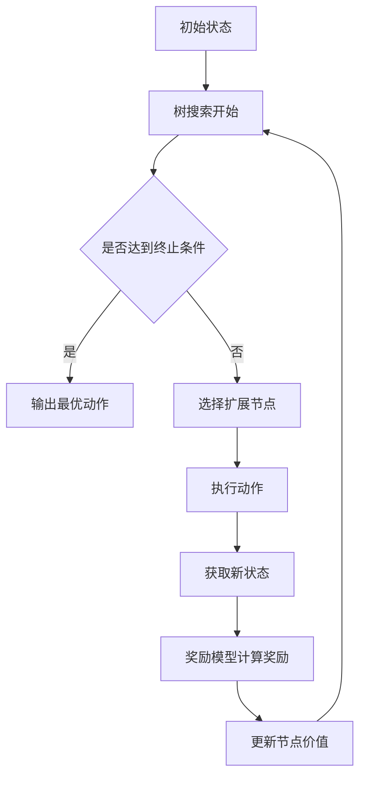

# GPU上实现奖励模型和树搜索的性能挑战

> 关键词：GPU、奖励模型、树搜索、性能挑战、并行计算

> 摘要：本文聚焦于在GPU上实现奖励模型和树搜索所面临的性能挑战。首先介绍相关背景知识，包括目的范围、预期读者等。接着阐述奖励模型和树搜索的核心概念与联系，详细讲解其核心算法原理及具体操作步骤，给出数学模型和公式并举例说明。通过项目实战展示代码实现和解读，分析实际应用场景。推荐相关工具和资源，最后总结未来发展趋势与挑战，还提供常见问题解答和扩展阅读参考资料，旨在全面深入地探讨该领域的技术要点和难题。

## 1. 背景介绍 
### 1.1 目的和范围
在当今的人工智能和机器学习领域，强化学习作为一种强大的技术，被广泛应用于各种复杂的决策任务中。奖励模型和树搜索是强化学习中两个关键的组成部分。奖励模型用于评估不同动作的价值，而树搜索则帮助在决策空间中寻找最优的行动路径。随着问题复杂度的不断增加，传统的CPU计算方式往往难以满足实时性和高效性的需求。GPU由于其强大的并行计算能力，成为加速奖励模型和树搜索的理想选择。

本文的目的在于深入探讨在GPU上实现奖励模型和树搜索时所面临的性能挑战。我们将分析这些挑战产生的原因，研究可能的解决方案，并通过实际案例和实验来验证相关的理论和方法。范围涵盖了从基本概念的介绍到具体算法的实现，以及实际应用场景的分析。

### 1.2 预期读者
本文主要面向对人工智能、机器学习、强化学习以及GPU编程有一定了解的专业人士，包括研究人员、工程师和开发人员。对于那些正在从事相关领域研究或开发工作，希望提高奖励模型和树搜索性能的读者来说，本文将提供有价值的参考和指导。同时，对于对该领域感兴趣，想要深入了解GPU计算在强化学习中应用的初学者，也可以通过本文获得初步的认识和启发。

### 1.3 文档结构概述
本文将按照以下结构进行组织：
- 核心概念与联系：介绍奖励模型和树搜索的基本概念，以及它们之间的联系，并通过示意图和流程图进行直观展示。
- 核心算法原理 & 具体操作步骤：详细讲解奖励模型和树搜索的核心算法原理，并使用Python源代码进行阐述。
- 数学模型和公式 & 详细讲解 & 举例说明：给出相关的数学模型和公式，并通过具体例子进行说明。
- 项目实战：代码实际案例和详细解释说明：通过一个实际项目，展示在GPU上实现奖励模型和树搜索的具体步骤和代码实现。
- 实际应用场景：分析奖励模型和树搜索在不同领域的实际应用场景。
- 工具和资源推荐：推荐相关的学习资源、开发工具框架和论文著作。
- 总结：未来发展趋势与挑战：总结在GPU上实现奖励模型和树搜索的发展趋势和面临的挑战。
- 附录：常见问题与解答：解答读者可能遇到的常见问题。
- 扩展阅读 & 参考资料：提供相关的扩展阅读材料和参考资料。

### 1.4 术语表
#### 1.4.1 核心术语定义
- **奖励模型（Reward Model）**：在强化学习中，奖励模型用于评估智能体在环境中执行某个动作后所获得的奖励。奖励是对智能体行为的一种反馈，用于指导智能体学习最优策略。
- **树搜索（Tree Search）**：一种搜索算法，通过构建搜索树来探索决策空间。树的每个节点表示一个状态，每条边表示一个动作。树搜索的目标是找到从根节点到某个目标节点的最优路径。
- **GPU（Graphics Processing Unit）**：图形处理器，一种专门用于图形处理的硬件设备。由于其具有大量的并行计算单元，现在也被广泛应用于通用计算领域，特别是在深度学习和强化学习中。
- **并行计算（Parallel Computing）**：指同时使用多个计算资源来完成一个任务的计算方式。GPU通过并行计算可以显著提高计算效率。

#### 1.4.2 相关概念解释
- **强化学习（Reinforcement Learning）**：一种机器学习范式，智能体通过与环境进行交互，根据环境反馈的奖励信号来学习最优策略。强化学习的目标是最大化长期累积奖励。
- **状态（State）**：在强化学习中，状态表示环境在某个时刻的特征描述。智能体根据当前状态来选择动作。
- **动作（Action）**：智能体在某个状态下可以执行的操作。不同的动作会导致环境状态的变化，并可能获得不同的奖励。

#### 1.4.3 缩略词列表
- **GPU**：Graphics Processing Unit
- **CPU**：Central Processing Unit
- **RL**：Reinforcement Learning

## 2. 核心概念与联系 

### 奖励模型原理
奖励模型是强化学习中的一个重要组成部分，它的主要作用是为智能体在环境中执行的每个动作分配一个奖励值。奖励值反映了该动作的好坏程度，智能体的目标是通过学习找到能够获得最大累积奖励的策略。

奖励模型可以是一个简单的函数，也可以是一个复杂的神经网络。在简单的情况下，奖励函数可以直接根据状态和动作的特征来计算奖励值。例如，在一个游戏中，如果智能体成功完成了一个任务，奖励函数可以返回一个正的奖励值；如果智能体失败了，奖励函数可以返回一个负的奖励值。

在复杂的情况下，奖励模型可以是一个神经网络，通过学习大量的样本数据来预测奖励值。这种方法可以处理更加复杂的环境和任务，提高奖励预测的准确性。

### 树搜索原理
树搜索是一种用于探索决策空间的算法，它通过构建搜索树来寻找最优的行动路径。搜索树的每个节点表示一个状态，每条边表示一个动作。从根节点开始，树搜索算法会不断扩展节点，直到找到一个目标节点或达到某个终止条件。

常见的树搜索算法包括广度优先搜索（BFS）、深度优先搜索（DFS）、蒙特卡罗树搜索（MCTS）等。不同的树搜索算法有不同的搜索策略和特点，适用于不同的问题场景。

### 奖励模型和树搜索的联系
奖励模型和树搜索在强化学习中是相互关联的。奖励模型为树搜索提供了评估节点价值的依据，树搜索则利用奖励模型的输出在决策空间中进行搜索。

在树搜索过程中，每个节点的价值可以通过奖励模型来计算。例如，在蒙特卡罗树搜索中，每个节点的价值可以通过模拟多次随机游戏来估计，而奖励模型可以用于计算每次模拟游戏的奖励值。树搜索算法根据节点的价值来选择扩展的节点，从而引导搜索朝着更有希望的方向进行。

### 文本示意图
```plaintext
+----------------+       +----------------+
|   奖励模型     | ----> |   树搜索       |
+----------------+       +----------------+
| 输入：状态、动作 |       | 输入：初始状态 |
| 输出：奖励值     |       | 输出：最优动作 |
+----------------+       +----------------+
```

### Mermaid 流程图


## 3. 核心算法原理 & 具体操作步骤 

### 奖励模型算法原理
我们以一个简单的基于神经网络的奖励模型为例来讲解其算法原理。假设我们的奖励模型是一个多层感知机（MLP），输入是状态和动作的特征向量，输出是一个标量奖励值。

#### 算法步骤
1. **数据预处理**：将输入的状态和动作特征向量进行归一化处理，使其在合适的范围内。
2. **前向传播**：将预处理后的输入向量输入到神经网络中，通过一系列的线性变换和非线性激活函数，得到输出的奖励值。
3. **损失计算**：根据真实的奖励值和模型预测的奖励值，计算损失函数。常用的损失函数包括均方误差（MSE）、交叉熵损失等。
4. **反向传播**：根据损失函数的梯度，更新神经网络的参数，以减小损失。

#### Python 源代码实现
```python
import torch
import torch.nn as nn
import torch.optim as optim

# 定义奖励模型
class RewardModel(nn.Module):
    def __init__(self, input_dim):
        super(RewardModel, self).__init__()
        self.fc1 = nn.Linear(input_dim, 64)
        self.relu = nn.ReLU()
        self.fc2 = nn.Linear(64, 1)

    def forward(self, x):
        x = self.fc1(x)
        x = self.relu(x)
        x = self.fc2(x)
        return x

# 初始化模型、损失函数和优化器
input_dim = 10
model = RewardModel(input_dim)
criterion = nn.MSELoss()
optimizer = optim.Adam(model.parameters(), lr=0.001)

# 模拟训练数据
num_samples = 100
x = torch.randn(num_samples, input_dim)
y_true = torch.randn(num_samples, 1)

# 训练模型
num_epochs = 100
for epoch in range(num_epochs):
    # 前向传播
    y_pred = model(x)
    loss = criterion(y_pred, y_true)

    # 反向传播和优化
    optimizer.zero_grad()
    loss.backward()
    optimizer.step()

    if (epoch + 1) % 10 == 0:
        print(f'Epoch [{epoch+1}/{num_epochs}], Loss: {loss.item():.4f}')
```

### 树搜索算法原理
我们以蒙特卡罗树搜索（MCTS）为例来讲解树搜索的算法原理。蒙特卡罗树搜索是一种基于随机模拟的树搜索算法，它通过多次模拟随机游戏来估计每个节点的价值。

#### 算法步骤
1. **选择（Selection）**：从根节点开始，根据节点的价值和置信度上界（UCB）公式选择一个子节点，直到到达一个叶子节点。
2. **扩展（Expansion）**：如果叶子节点不是终止节点，则扩展该节点，生成其所有可能的子节点。
3. **模拟（Simulation）**：从扩展后的叶子节点开始，进行一次随机游戏，直到到达一个终止节点，记录游戏的总奖励。
4. **回溯（Backpropagation）**：将模拟得到的总奖励回溯到从根节点到叶子节点的路径上的所有节点，更新它们的访问次数和价值。

#### Python 源代码实现
```python
import numpy as np

# 定义节点类
class Node:
    def __init__(self, state, parent=None):
        self.state = state
        self.parent = parent
        self.children = []
        self.visit_count = 0
        self.total_reward = 0

    def is_leaf(self):
        return len(self.children) == 0

    def select_child(self):
        best_score = -np.inf
        best_child = None
        for child in self.children:
            score = child.total_reward / (child.visit_count + 1e-6) + np.sqrt(2 * np.log(self.visit_count) / (child.visit_count + 1e-6))
            if score > best_score:
                best_score = score
                best_child = child
        return best_child

    def expand(self, actions):
        for action in actions:
            new_state = self.state + action  # 简单示例，实际中需要根据具体问题定义状态转移
            child = Node(new_state, self)
            self.children.append(child)

    def simulate(self):
        # 简单示例，实际中需要根据具体问题定义模拟过程
        total_reward = np.random.randn()
        return total_reward

    def backpropagate(self, reward):
        self.visit_count += 1
        self.total_reward += reward
        if self.parent is not None:
            self.parent.backpropagate(reward)

# 蒙特卡罗树搜索算法
def mcts(root, num_simulations):
    for _ in range(num_simulations):
        node = root
        # 选择
        while not node.is_leaf():
            node = node.select_child()
        # 扩展
        if not is_terminal(node.state):  # 假设 is_terminal 函数用于判断状态是否终止
            actions = get_actions(node.state)  # 假设 get_actions 函数用于获取当前状态下的所有可能动作
            node.expand(actions)
            node = node.children[0]
        # 模拟
        reward = node.simulate()
        # 回溯
        node.backpropagate(reward)

    # 选择最优子节点
    best_child = max(root.children, key=lambda child: child.visit_count)
    return best_child

# 示例使用
root_state = np.zeros(10)
root = Node(root_state)
num_simulations = 100
best_child = mcts(root, num_simulations)
print(f'Best action leads to state: {best_child.state}')
```

## 4. 数学模型和公式 & 详细讲解 & 举例说明 

### 奖励模型数学模型和公式
#### 多层感知机（MLP）模型
假设输入向量为 $\mathbf{x} \in \mathbb{R}^n$，神经网络的第 $l$ 层的输出为 $\mathbf{h}^l \in \mathbb{R}^{m_l}$，其中 $m_l$ 是第 $l$ 层的神经元数量。则第 $l$ 层的计算可以表示为：

$$
\mathbf{h}^l = f(\mathbf{W}^l \mathbf{h}^{l - 1} + \mathbf{b}^l)
$$

其中 $\mathbf{W}^l \in \mathbb{R}^{m_l \times m_{l - 1}}$ 是第 $l$ 层的权重矩阵，$\mathbf{b}^l \in \mathbb{R}^{m_l}$ 是第 $l$ 层的偏置向量，$f(\cdot)$ 是激活函数，如 ReLU 函数：

$$
f(x) = \max(0, x)
$$

对于输出层，由于我们的奖励模型输出是一个标量，所以最后一层的输出为：

$$
r = \mathbf{w}^T \mathbf{h}^{L - 1} + b
$$

其中 $\mathbf{w} \in \mathbb{R}^{m_{L - 1}}$ 是输出层的权重向量，$b$ 是输出层的偏置，$L$ 是神经网络的总层数。

#### 均方误差损失函数
假设我们有 $N$ 个训练样本 $\{(\mathbf{x}_i, r_i)\}_{i = 1}^N$，其中 $\mathbf{x}_i$ 是输入向量，$r_i$ 是真实的奖励值。则均方误差损失函数可以表示为：

$$
\mathcal{L} = \frac{1}{N} \sum_{i = 1}^N (r_i - \hat{r}_i)^2
$$

其中 $\hat{r}_i$ 是模型预测的奖励值。

#### 举例说明
假设我们有一个简单的二维输入向量 $\mathbf{x} = [x_1, x_2]$，神经网络有一个隐藏层，隐藏层有 3 个神经元，输出层有 1 个神经元。则权重矩阵和偏置向量可以表示为：

$$
\mathbf{W}^1 = \begin{bmatrix}
w_{11}^1 & w_{12}^1 \\
w_{21}^1 & w_{22}^1 \\
w_{31}^1 & w_{32}^1
\end{bmatrix}, \quad \mathbf{b}^1 = \begin{bmatrix}
b_1^1 \\
b_2^1 \\
b_3^1
\end{bmatrix}, \quad \mathbf{w} = \begin{bmatrix}
w_1 \\
w_2 \\
w_3
\end{bmatrix}, \quad b
$$

输入向量经过第一层的计算为：

$$
\mathbf{h}^1 = f(\mathbf{W}^1 \mathbf{x} + \mathbf{b}^1) = \begin{bmatrix}
\max(0, w_{11}^1 x_1 + w_{12}^1 x_2 + b_1^1) \\
\max(0, w_{21}^1 x_1 + w_{22}^1 x_2 + b_2^1) \\
\max(0, w_{31}^1 x_1 + w_{32}^1 x_2 + b_3^1)
\end{bmatrix}
$$

输出层的计算为：

$$
r = \mathbf{w}^T \mathbf{h}^1 + b = w_1 \max(0, w_{11}^1 x_1 + w_{12}^1 x_2 + b_1^1) + w_2 \max(0, w_{21}^1 x_1 + w_{22}^1 x_2 + b_2^1) + w_3 \max(0, w_{31}^1 x_1 + w_{32}^1 x_2 + b_3^1) + b
$$

### 树搜索数学模型和公式
#### 置信度上界（UCB）公式
在蒙特卡罗树搜索中，用于选择子节点的置信度上界（UCB）公式可以表示为：

$$
UCB(s, a) = \frac{Q(s, a)}{N(s, a)} + c \sqrt{\frac{\ln N(s)}{N(s, a)}}
$$

其中 $Q(s, a)$ 是状态 $s$ 下执行动作 $a$ 的累积奖励，$N(s, a)$ 是状态 $s$ 下执行动作 $a$ 的次数，$N(s)$ 是状态 $s$ 的访问次数，$c$ 是一个超参数，用于平衡探索和利用。

#### 举例说明
假设我们有一个状态 $s$，有 3 个可能的动作 $a_1, a_2, a_3$，它们的累积奖励和访问次数分别为：

$$
Q(s, a_1) = 10, \quad N(s, a_1) = 5, \quad Q(s, a_2) = 8, \quad N(s, a_2) = 3, \quad Q(s, a_3) = 12, \quad N(s, a_3) = 4
$$

状态 $s$ 的访问次数为 $N(s) = 12$，超参数 $c = 1$。则每个动作的 UCB 值为：

$$
UCB(s, a_1) = \frac{10}{5} + 1 \sqrt{\frac{\ln 12}{5}} \approx 2 + 0.69 = 2.69
$$

$$
UCB(s, a_2) = \frac{8}{3} + 1 \sqrt{\frac{\ln 12}{3}} \approx 2.67 + 0.86 = 3.53
$$

$$
UCB(s, a_3) = \frac{12}{4} + 1 \sqrt{\frac{\ln 12}{4}} \approx 3 + 0.77 = 3.77
$$

根据 UCB 值，我们应该选择动作 $a_3$ 进行扩展。

## 5. 项目实战：代码实际案例和详细解释说明 

### 5.1  开发环境搭建
#### 硬件环境
- **GPU**：建议使用 NVIDIA GPU，如 NVIDIA GeForce RTX 30系列或更高版本，以确保有足够的计算能力。
- **CPU**：Intel Core i7 或更高版本，用于辅助计算和系统管理。
- **内存**：至少 16GB，以满足数据存储和处理的需求。

#### 软件环境
- **操作系统**：Ubuntu 20.04 或更高版本，Linux 系统在深度学习和 GPU 编程方面具有良好的支持。
- **CUDA**：安装与 GPU 硬件兼容的 CUDA 版本，例如 CUDA 11.3 或更高版本，用于 GPU 加速计算。
- **cuDNN**：安装与 CUDA 版本对应的 cuDNN 库，以加速深度学习计算。
- **Python**：Python 3.8 或更高版本，作为主要的开发语言。
- **深度学习框架**：安装 PyTorch 或 TensorFlow 等深度学习框架，本文以 PyTorch 为例。

#### 安装步骤
1. **安装 CUDA**：从 NVIDIA 官方网站下载并安装适合自己 GPU 硬件的 CUDA 版本。安装过程中按照提示进行操作，确保环境变量配置正确。
2. **安装 cuDNN**：从 NVIDIA 官方网站下载与 CUDA 版本对应的 cuDNN 库，将其解压并复制到 CUDA 安装目录下的相应位置。
3. **安装 Python**：可以使用 Anaconda 或 Miniconda 来管理 Python 环境。下载并安装 Anaconda 或 Miniconda，创建一个新的 Python 环境：
```bash
conda create -n rl_gpu python=3.8
conda activate rl_gpu
```
4. **安装 PyTorch**：根据自己的 CUDA 版本，从 PyTorch 官方网站选择合适的安装命令进行安装。例如，对于 CUDA 11.3：
```bash
pip install torch torchvision torchaudio --extra-index-url https://download.pytorch.org/whl/cu113
```

### 5.2  源代码详细实现和代码解读
#### 奖励模型实现
```python
import torch
import torch.nn as nn
import torch.optim as optim

# 定义奖励模型
class RewardModel(nn.Module):
    def __init__(self, input_dim):
        super(RewardModel, self).__init__()
        self.fc1 = nn.Linear(input_dim, 64)
        self.relu = nn.ReLU()
        self.fc2 = nn.Linear(64, 1)

    def forward(self, x):
        x = self.fc1(x)
        x = self.relu(x)
        x = self.fc2(x)
        return x

# 初始化模型、损失函数和优化器
input_dim = 10
model = RewardModel(input_dim)
# 将模型移动到 GPU 上
device = torch.device("cuda" if torch.cuda.is_available() else "cpu")
model.to(device)
criterion = nn.MSELoss()
optimizer = optim.Adam(model.parameters(), lr=0.001)

# 模拟训练数据
num_samples = 100
x = torch.randn(num_samples, input_dim).to(device)
y_true = torch.randn(num_samples, 1).to(device)

# 训练模型
num_epochs = 100
for epoch in range(num_epochs):
    # 前向传播
    y_pred = model(x)
    loss = criterion(y_pred, y_true)

    # 反向传播和优化
    optimizer.zero_grad()
    loss.backward()
    optimizer.step()

    if (epoch + 1) % 10 == 0:
        print(f'Epoch [{epoch+1}/{num_epochs}], Loss: {loss.item():.4f}')
```
**代码解读**：
- `RewardModel` 类定义了一个简单的多层感知机（MLP）作为奖励模型。它包含一个输入层、一个隐藏层和一个输出层。
- `forward` 方法定义了模型的前向传播过程，输入数据依次通过全连接层和激活函数。
- `model.to(device)` 将模型移动到 GPU 上进行计算。
- 训练数据 `x` 和 `y_true` 也需要移动到 GPU 上，以确保与模型在同一设备上。
- 在训练过程中，前向传播、损失计算、反向传播和参数更新都在 GPU 上进行，从而加速训练过程。

#### 树搜索实现
```python
import numpy as np
import torch

# 定义节点类
class Node:
    def __init__(self, state, parent=None):
        self.state = state
        self.parent = parent
        self.children = []
        self.visit_count = 0
        self.total_reward = 0

    def is_leaf(self):
        return len(self.children) == 0

    def select_child(self):
        best_score = -np.inf
        best_child = None
        for child in self.children:
            score = child.total_reward / (child.visit_count + 1e-6) + np.sqrt(2 * np.log(self.visit_count) / (child.visit_count + 1e-6))
            if score > best_score:
                best_score = score
                best_child = child
        return best_child

    def expand(self, actions):
        for action in actions:
            new_state = self.state + action  # 简单示例，实际中需要根据具体问题定义状态转移
            child = Node(new_state, self)
            self.children.append(child)

    def simulate(self):
        # 简单示例，实际中需要根据具体问题定义模拟过程
        total_reward = np.random.randn()
        return total_reward

    def backpropagate(self, reward):
        self.visit_count += 1
        self.total_reward += reward
        if self.parent is not None:
            self.parent.backpropagate(reward)

# 蒙特卡罗树搜索算法
def mcts(root, num_simulations):
    for _ in range(num_simulations):
        node = root
        # 选择
        while not node.is_leaf():
            node = node.select_child()
        # 扩展
        if not is_terminal(node.state):  # 假设 is_terminal 函数用于判断状态是否终止
            actions = get_actions(node.state)  # 假设 get_actions 函数用于获取当前状态下的所有可能动作
            node.expand(actions)
            node = node.children[0]
        # 模拟
        reward = node.simulate()
        # 回溯
        node.backpropagate(reward)

    # 选择最优子节点
    best_child = max(root.children, key=lambda child: child.visit_count)
    return best_child

# 示例使用
root_state = np.zeros(10)
root = Node(root_state)
num_simulations = 100
best_child = mcts(root, num_simulations)
print(f'Best action leads to state: {best_child.state}')
```
**代码解读**：
- `Node` 类定义了树搜索中的节点结构，包含状态、父节点、子节点、访问次数和累积奖励等信息。
- `select_child` 方法使用置信度上界（UCB）公式选择最优子节点。
- `expand` 方法扩展当前节点，生成所有可能的子节点。
- `simulate` 方法进行一次随机模拟，返回模拟的总奖励。
- `backpropagate` 方法将模拟得到的奖励回溯到从根节点到当前节点的路径上的所有节点，更新它们的访问次数和累积奖励。
- `mcts` 函数实现了蒙特卡罗树搜索算法的主要逻辑，包括选择、扩展、模拟和回溯四个步骤。

### 5.3  代码解读与分析
#### 奖励模型分析
- **优点**：使用神经网络作为奖励模型可以处理复杂的输入特征，通过训练可以学习到输入和奖励之间的复杂映射关系。将模型和数据移动到 GPU 上可以显著加速训练过程，提高训练效率。
- **缺点**：神经网络的训练需要大量的计算资源和时间，并且可能存在过拟合的问题。需要合理选择网络结构和超参数，以及进行适当的正则化处理。

#### 树搜索分析
- **优点**：蒙特卡罗树搜索算法通过随机模拟和回溯的方式，可以在复杂的决策空间中找到较优的行动路径。该算法具有较好的通用性和可扩展性，可以应用于不同的问题场景。
- **缺点**：蒙特卡罗树搜索算法的计算复杂度较高，特别是在决策空间较大的情况下，需要进行大量的模拟和节点扩展操作。可以通过剪枝、并行计算等方法来提高算法的效率。

## 6. 实际应用场景 
### 游戏领域
在游戏领域，奖励模型和树搜索被广泛应用于游戏 AI 的开发中。例如，在围棋、国际象棋等棋类游戏中，蒙特卡罗树搜索算法可以帮助 AI 玩家在复杂的棋局中找到最优的落子位置。奖励模型可以根据棋局的状态和落子动作，评估该动作的好坏程度，为树搜索提供指导。

在电子竞技游戏中，如《英雄联盟》、《DOTA2》等，奖励模型和树搜索可以帮助 AI 玩家制定战略和决策。例如，根据游戏中的地图状态、敌我双方的英雄状态等信息，奖励模型可以计算出不同行动的奖励值，树搜索算法可以在决策空间中寻找最优的行动路径，如选择攻击目标、躲避技能等。

### 机器人控制领域
在机器人控制领域，奖励模型和树搜索可以用于机器人的路径规划和动作决策。例如，在机器人导航任务中，奖励模型可以根据机器人的当前位置、目标位置和周围环境信息，计算出不同移动动作的奖励值。树搜索算法可以在状态空间中搜索最优的路径，使机器人能够安全、高效地到达目标位置。

在机器人操作任务中，如抓取物体、装配零件等，奖励模型和树搜索可以帮助机器人选择最优的动作序列。奖励模型可以根据物体的位置、姿态和机器人的动作，评估动作的成功概率和效率，树搜索算法可以在动作空间中寻找最优的动作组合。

### 自动驾驶领域
在自动驾驶领域，奖励模型和树搜索可以用于车辆的决策和规划。例如，根据车辆的当前状态、道路信息、交通规则和其他车辆的状态等信息，奖励模型可以计算出不同驾驶动作的奖励值，如加速、减速、转弯等。树搜索算法可以在决策空间中寻找最优的驾驶策略，使车辆能够安全、高效地行驶。

同时，奖励模型和树搜索还可以用于自动驾驶车辆的路径规划和避障。根据地图信息和传感器数据，奖励模型可以评估不同路径的优劣，树搜索算法可以在路径空间中搜索最优的路径，避免碰撞和其他危险情况。

## 7. 工具和资源推荐
### 7.1 学习资源推荐
#### 7.1.1 书籍推荐
- 《Reinforcement Learning: An Introduction》（Richard S. Sutton 和 Andrew G. Barto 著）：这是强化学习领域的经典教材，系统地介绍了强化学习的基本概念、算法和应用。
- 《Deep Reinforcement Learning Hands-On》（Max Lapan 著）：本书通过实际案例和代码示例，详细介绍了深度强化学习的实现方法和技巧。
- 《Artificial Intelligence: A Modern Approach》（Stuart Russell 和 Peter Norvig 著）：这是人工智能领域的经典教材，涵盖了人工智能的各个方面，包括搜索算法、机器学习、强化学习等。

#### 7.1.2 在线课程
- Coursera 上的 “Reinforcement Learning Specialization”：由 Andrew G. Barto 等知名学者授课，系统地介绍了强化学习的理论和实践。
- edX 上的 “Introduction to Artificial Intelligence”：由麻省理工学院（MIT）的教授授课，涵盖了人工智能的基本概念和算法，包括搜索算法和强化学习。
- Udemy 上的 “Deep Reinforcement Learning: Hands-On in Python”：通过实际项目和代码示例，帮助学习者掌握深度强化学习的实现方法。

#### 7.1.3 技术博客和网站
- OpenAI Blog（https://openai.com/blog/）：OpenAI 官方博客，发布了许多关于人工智能和强化学习的最新研究成果和技术文章。
- DeepMind Blog（https://deepmind.com/blog/）：DeepMind 官方博客，分享了深度强化学习在游戏、机器人等领域的应用案例和研究进展。
- Towards Data Science（https://towardsdatascience.com/）：一个专注于数据科学和机器学习的技术博客平台，有许多关于强化学习的高质量文章。

### 7.2 开发工具框架推荐
#### 7.2.1 IDE和编辑器
- PyCharm：一款功能强大的 Python 集成开发环境（IDE），支持代码编辑、调试、版本控制等功能，对 PyTorch 和 TensorFlow 等深度学习框架有良好的支持。
- Visual Studio Code：一款轻量级的代码编辑器，具有丰富的插件生态系统，可以通过安装相关插件来支持 Python 开发和深度学习编程。
- Jupyter Notebook：一个交互式的开发环境，适合进行数据探索、模型训练和实验验证。可以在浏览器中运行代码，并实时查看代码的执行结果。

#### 7.2.2 调试和性能分析工具
- NVIDIA Nsight Compute：NVIDIA 提供的一款性能分析工具，可以帮助开发者分析 GPU 程序的性能瓶颈，优化代码性能。
- PyTorch Profiler：PyTorch 内置的性能分析工具，可以帮助开发者分析模型训练和推理过程中的性能瓶颈，如 GPU 利用率、内存使用情况等。
- TensorBoard：TensorFlow 提供的一款可视化工具，可以帮助开发者监控模型训练过程中的各种指标，如损失函数、准确率等，还可以可视化模型的结构和计算图。

#### 7.2.3 相关框架和库
- PyTorch：一个开源的深度学习框架，具有动态计算图、易于使用和高效的特点，被广泛应用于强化学习和深度学习研究中。
- TensorFlow：一个开源的深度学习框架，具有强大的分布式计算能力和丰富的工具集，被广泛应用于工业界和学术界。
- Stable Baselines3：一个基于 PyTorch 的强化学习库，提供了许多常用的强化学习算法的实现，如 A2C、PPO、DQN 等，方便开发者快速实现和测试强化学习算法。

### 7.3 相关论文著作推荐
#### 7.3.1 经典论文
- “Mastering the Game of Go without Human Knowledge”（David Silver 等著）：该论文介绍了 AlphaGo Zero 算法，通过自我对弈的方式在围棋游戏中取得了超越人类的水平，展示了深度强化学习的强大能力。
- “Playing Atari with Deep Reinforcement Learning”（Volodymyr Mnih 等著）：该论文提出了深度 Q 网络（DQN）算法，首次将深度学习和强化学习相结合，在 Atari 游戏中取得了很好的效果。
- “Asynchronous Methods for Deep Reinforcement Learning”（Volodymyr Mnih 等著）：该论文提出了异步优势演员-评论家（A3C）算法，通过异步更新的方式提高了深度强化学习的训练效率。

#### 7.3.2 最新研究成果
- 关注顶级学术会议，如 NeurIPS（Conference on Neural Information Processing Systems）、ICML（International Conference on Machine Learning）、IJCAI（International Joint Conference on Artificial Intelligence）等，这些会议上会发布许多关于强化学习和深度学习的最新研究成果。
- 关注预印本平台，如 arXiv（https://arxiv.org/），许多研究人员会在该平台上提前发布自己的研究论文。

#### 7.3.3 应用案例分析
- “Deep Reinforcement Learning for Autonomous Driving: A Survey”（Qi Dou 等著）：该论文对深度强化学习在自动驾驶领域的应用进行了全面的综述，分析了相关的算法和技术，并讨论了面临的挑战和未来的发展方向。
- “Reinforcement Learning in Robotics: A Survey”（Jan Peters 和 Stefan Schaal 著）：该论文对强化学习在机器人领域的应用进行了综述，介绍了相关的算法和应用案例，并分析了面临的挑战和解决方案。

## 8. 总结：未来发展趋势与挑战
### 未来发展趋势
#### 更高效的算法
随着研究的不断深入，未来将会出现更加高效的奖励模型和树搜索算法。例如，结合深度学习和强化学习的最新技术，开发出能够在更复杂环境中快速收敛的算法。同时，利用并行计算和分布式计算的优势，进一步提高算法的计算效率。

#### 多智能体系统
在实际应用中，往往需要多个智能体进行协作和竞争。未来的研究将更加关注多智能体系统中的奖励模型和树搜索算法。例如，如何设计合适的奖励机制，使多个智能体能够协同工作，实现共同的目标；如何在多智能体环境中进行有效的树搜索，找到最优的策略组合。

#### 与其他技术的融合
奖励模型和树搜索将与其他技术，如计算机视觉、自然语言处理等进行更深入的融合。例如，在自动驾驶领域，结合计算机视觉技术，奖励模型可以根据车辆周围的视觉信息更准确地评估驾驶动作的好坏；在智能客服领域，结合自然语言处理技术，树搜索算法可以根据用户的对话内容更智能地选择回复策略。

### 面临的挑战
#### 计算资源限制
虽然 GPU 提供了强大的计算能力，但在处理大规模的决策空间和复杂的奖励模型时，仍然面临计算资源的限制。例如，在一些复杂的游戏和机器人控制任务中，树搜索需要进行大量的模拟和节点扩展操作，对 GPU 的计算能力和内存容量提出了很高的要求。

#### 数据质量和可解释性
奖励模型的性能很大程度上依赖于训练数据的质量。在实际应用中，获取高质量的训练数据往往是一个挑战。同时，深度学习模型的可解释性也是一个问题，特别是在一些对安全性和可靠性要求较高的领域，如自动驾驶和医疗领域，需要能够解释模型的决策过程。

#### 环境的不确定性
在实际环境中，往往存在许多不确定性因素，如噪声、动态变化等。这些不确定性因素会影响奖励模型的准确性和树搜索算法的性能。例如，在机器人导航任务中，传感器数据可能存在噪声，导致奖励模型对环境状态的评估不准确；在自动驾驶任务中，其他车辆的行为可能是不确定的，增加了树搜索的难度。

## 9. 附录：常见问题与解答
### 问题 1：在 GPU 上实现奖励模型和树搜索时，如何解决内存不足的问题？
**解答**：可以采取以下几种方法来解决内存不足的问题：
- **优化数据存储**：尽量减少不必要的数据存储，如使用更紧凑的数据类型，及时释放不再使用的内存。
- **分批次处理**：将大规模的数据分成小批次进行处理，避免一次性将所有数据加载到内存中。
- **模型压缩**：采用模型压缩技术，如剪枝、量化等，减少模型的参数数量，降低内存占用。
- **使用分布式计算**：利用多个 GPU 或多台计算机进行分布式计算，将数据和计算任务分布到不同的设备上，减轻单个设备的内存压力。

### 问题 2：如何提高奖励模型的准确性？
**解答**：可以从以下几个方面提高奖励模型的准确性：
- **增加训练数据**：收集更多高质量的训练数据，丰富数据的多样性，使模型能够学习到更全面的特征和规律。
- **优化模型结构**：选择合适的模型结构，如增加网络的层数和神经元数量，或者采用更复杂的模型架构，如卷积神经网络（CNN）、循环神经网络（RNN）等。
- **调整超参数**：通过实验和调优，选择合适的超参数，如学习率、批量大小、正则化系数等，以提高模型的泛化能力。
- **使用集成学习**：将多个不同的奖励模型进行集成，综合它们的预测结果，提高预测的准确性和稳定性。

### 问题 3：树搜索算法的计算复杂度较高，如何进行优化？
**解答**：可以采用以下几种方法来优化树搜索算法的计算复杂度：
- **剪枝策略**：在树搜索过程中，采用剪枝策略，如 α-β 剪枝、蒙特卡罗剪枝等，减少不必要的节点扩展和模拟操作，提高搜索效率。
- **并行计算**：利用 GPU 的并行计算能力，对树搜索的不同部分进行并行处理，如同时扩展多个节点、并行进行模拟操作等，加速搜索过程。
- **启发式搜索**：引入启发式信息，如领域知识、经验规则等，引导树搜索朝着更有希望的方向进行，减少搜索空间。
- **增量搜索**：在每次搜索时，利用上一次搜索的结果，进行增量式的搜索，避免重复计算，提高搜索效率。

## 10. 扩展阅读 & 参考资料
### 扩展阅读
- 《Deep Learning》（Ian Goodfellow、Yoshua Bengio 和 Aaron Courville 著）：深度学习领域的经典教材，深入介绍了深度学习的基本原理、算法和应用。
- 《Algorithms for Reinforcement Learning》（Csaba Szepesvári 著）：系统地介绍了强化学习的各种算法，包括基于价值的算法、基于策略的算法、模型基算法等。
- 《Game Theory: An Introduction》（Steven Tadelis 著）：博弈论领域的入门教材，介绍了博弈论的基本概念、模型和应用，对于理解多智能体系统中的决策和策略有很大帮助。

### 参考资料
- NVIDIA 官方文档（https://docs.nvidia.com/）：提供了关于 CUDA、cuDNN 等 NVIDIA 技术的详细文档和教程。
- PyTorch 官方文档（https://pytorch.org/docs/stable/）：提供了 PyTorch 深度学习框架的详细文档和教程，包括 API 参考、示例代码等。
- TensorFlow 官方文档（https://www.tensorflow.org/api_docs）：提供了 TensorFlow 深度学习框架的详细文档和教程，包括 API 参考、示例代码等。
- OpenAI Gym 官方文档（https://gym.openai.com/docs/）：提供了 OpenAI Gym 强化学习环境的详细文档和教程，方便开发者进行强化学习算法的测试和验证。