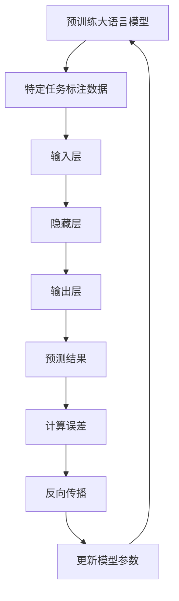

# LLM fine-tuning技术：定制化AI Agent的关键

> 关键词：LLM fine-tuning、定制化AI Agent、大语言模型、微调技术、人工智能

> 摘要：本文深入探讨了LLM fine-tuning技术作为定制化AI Agent的关键所在。首先介绍了该技术的背景，包括其目的、适用读者、文档结构和相关术语。接着阐述了核心概念与联系，通过文本示意图和Mermaid流程图呈现其原理和架构。详细讲解了核心算法原理和具体操作步骤，使用Python源代码进行说明。还分析了数学模型和公式，并举例说明。通过项目实战，展示了代码实际案例及详细解释。探讨了其实际应用场景，推荐了相关工具和资源，包括学习资源、开发工具框架和论文著作。最后总结了未来发展趋势与挑战，解答常见问题并提供扩展阅读和参考资料，旨在帮助读者全面深入地理解LLM fine-tuning技术及其在定制化AI Agent中的重要作用。

## 1. 背景介绍 
### 1.1 目的和范围
随着人工智能技术的飞速发展，大语言模型（LLM）在自然语言处理领域展现出了强大的能力。然而，通用的大语言模型往往不能满足特定领域或任务的需求。LLM fine-tuning技术应运而生，其目的在于通过对预训练的大语言模型进行微调，使其能够更好地适应特定的任务和场景，从而定制出满足用户个性化需求的AI Agent。

本文的范围将涵盖LLM fine-tuning技术的基本概念、核心算法原理、数学模型、实际应用案例以及相关的工具和资源推荐等方面，旨在为读者提供一个全面且深入的技术解读。

### 1.2 预期读者
本文预期读者包括但不限于人工智能领域的研究人员、开发人员、对AI技术感兴趣的学生以及希望利用AI技术解决实际问题的企业从业者。无论是想要深入了解LLM fine-tuning技术原理的专业人士，还是希望快速上手并应用该技术的初学者，都能从本文中获得有价值的信息。

### 1.3 文档结构概述
本文将按照以下结构展开：首先介绍LLM fine-tuning技术的背景信息，包括目的、读者和术语等；接着阐述核心概念与联系，通过文本示意图和流程图呈现其原理和架构；详细讲解核心算法原理和具体操作步骤，并使用Python代码进行说明；分析数学模型和公式，并举例说明；通过项目实战展示代码实际案例及详细解释；探讨实际应用场景；推荐相关工具和资源；总结未来发展趋势与挑战；解答常见问题并提供扩展阅读和参考资料。

### 1.4 术语表
#### 1.4.1 核心术语定义
- **大语言模型（LLM）**：是指基于Transformer架构的预训练语言模型，如GPT、BERT等，这些模型在大规模文本数据上进行无监督学习，学习到丰富的语言知识和语义表示。
- **LLM fine-tuning**：在预训练的大语言模型基础上，使用特定的任务数据对模型进行进一步训练，调整模型的参数，使其更好地适应特定任务的过程。
- **AI Agent**：是一种能够感知环境、进行决策并采取行动的智能实体，在自然语言处理领域，AI Agent可以根据用户输入的文本进行回答、生成文本等操作。

#### 1.4.2 相关概念解释
- **预训练**：在大规模无标注文本数据上对模型进行训练，使模型学习到通用的语言知识和语义表示，为后续的微调打下基础。
- **微调（fine-tuning）**：在预训练的基础上，使用特定任务的标注数据对模型进行训练，调整模型的参数，使其适应特定任务的需求。
- **迁移学习**：将在一个任务上学习到的知识和技能迁移到另一个相关任务上的过程，LLM fine-tuning就是一种典型的迁移学习方法。

#### 1.4.3 缩略词列表
- **LLM**：Large Language Model（大语言模型）
- **GPT**：Generative Pretrained Transformer（生成式预训练变换器）
- **BERT**：Bidirectional Encoder Representations from Transformers（基于变换器的双向编码器表示）

## 2. 核心概念与联系 

### 核心概念原理
LLM fine-tuning的核心原理基于迁移学习的思想。预训练的大语言模型在大规模无标注文本数据上进行训练，学习到了丰富的语言知识和语义表示。这些知识和表示具有一定的通用性，可以为不同的自然语言处理任务提供一个良好的基础。

在进行fine-tuning时，我们使用特定任务的标注数据对预训练模型进行进一步训练。通过调整模型的参数，使其能够更好地适应特定任务的需求。例如，在文本分类任务中，我们可以使用标注好的文本数据对预训练模型进行微调，使模型能够准确地将文本分类到不同的类别中。

### 架构的文本示意图
预训练的大语言模型可以看作是一个通用的语言知识容器，它包含了丰富的语言信息和语义表示。在fine-tuning阶段，我们将特定任务的标注数据输入到这个模型中，通过反向传播算法调整模型的参数，使其能够更好地完成特定任务。

具体来说，输入数据首先经过模型的输入层，将文本转换为向量表示。然后，这些向量在模型的隐藏层中进行一系列的计算和变换，提取出文本的特征。最后，经过输出层，将特征映射到任务的输出空间，得到任务的预测结果。在fine-tuning过程中，我们根据预测结果和真实标签之间的误差，通过反向传播算法更新模型的参数，使误差逐渐减小。

### Mermaid流程图


## 3. 核心算法原理 & 具体操作步骤 

### 核心算法原理
LLM fine-tuning的核心算法基于梯度下降法。在fine-tuning过程中，我们的目标是最小化模型的损失函数。损失函数通常定义为预测结果和真实标签之间的差异度量，例如交叉熵损失函数在分类任务中被广泛使用。

具体来说，对于一个给定的训练样本 $(x, y)$，其中 $x$ 是输入文本，$y$ 是对应的真实标签。模型的预测结果为 $\hat{y}$。损失函数 $L(y, \hat{y})$ 衡量了预测结果和真实标签之间的差异。我们的目标是找到一组模型参数 $\theta$，使得在整个训练数据集上的平均损失最小，即：

$$\min_{\theta} \frac{1}{N} \sum_{i=1}^{N} L(y_i, \hat{y}_i(\theta))$$

其中 $N$ 是训练数据集的样本数量。

为了找到最优的模型参数 $\theta$，我们使用梯度下降法。梯度下降法的基本思想是沿着损失函数的负梯度方向更新模型参数，每次更新的步长由学习率 $\alpha$ 控制。具体的更新公式为：

$$\theta_{t+1} = \theta_t - \alpha \nabla_{\theta} L(y, \hat{y}(\theta_t))$$

其中 $\theta_t$ 是第 $t$ 次迭代的模型参数，$\nabla_{\theta} L(y, \hat{y}(\theta_t))$ 是损失函数关于模型参数 $\theta$ 在 $\theta_t$ 处的梯度。

### 具体操作步骤
1. **数据准备**：收集和整理特定任务的标注数据，并将其划分为训练集、验证集和测试集。训练集用于模型的训练，验证集用于调整模型的超参数，测试集用于评估模型的性能。
2. **模型选择**：选择合适的预训练大语言模型，如GPT、BERT等。根据任务的需求和数据集的特点，选择合适的模型结构和参数。
3. **模型加载**：使用相应的深度学习框架（如PyTorch、TensorFlow等）加载预训练模型，并将其设置为可训练状态。
4. **定义损失函数和优化器**：根据任务的类型，选择合适的损失函数，如交叉熵损失函数、均方误差损失函数等。同时，选择合适的优化器，如Adam、SGD等，并设置学习率等超参数。
5. **训练模型**：将训练数据输入到模型中，进行前向传播计算预测结果，然后根据预测结果和真实标签计算损失函数。接着，使用反向传播算法计算损失函数关于模型参数的梯度，并使用优化器更新模型参数。重复这个过程，直到模型的性能达到满意的程度。
6. **模型评估**：使用验证集和测试集对训练好的模型进行评估，计算模型的准确率、召回率、F1值等性能指标，评估模型的性能。

### Python源代码实现
以下是一个使用PyTorch和Hugging Face Transformers库进行LLM fine-tuning的示例代码：

```python
import torch
from torch.utils.data import Dataset, DataLoader
from transformers import AutoTokenizer, AutoModelForSequenceClassification, AdamW
from sklearn.model_selection import train_test_split
import pandas as pd

# 定义数据集类
class CustomDataset(Dataset):
    def __init__(self, texts, labels, tokenizer, max_length):
        self.texts = texts
        self.labels = labels
        self.tokenizer = tokenizer
        self.max_length = max_length

    def __len__(self):
        return len(self.texts)

    def __getitem__(self, idx):
        text = str(self.texts[idx])
        label = self.labels[idx]
        encoding = self.tokenizer.encode_plus(
            text,
            add_special_tokens=True,
            max_length=self.max_length,
            padding='max_length',
            truncation=True,
            return_tensors='pt'
        )
        return {
            'input_ids': encoding['input_ids'].flatten(),
            'attention_mask': encoding['attention_mask'].flatten(),
            'labels': torch.tensor(label, dtype=torch.long)
        }

# 数据准备
data = pd.read_csv('data.csv')
texts = data['text'].tolist()
labels = data['label'].tolist()

train_texts, val_texts, train_labels, val_labels = train_test_split(texts, labels, test_size=0.2, random_state=42)

# 模型选择和加载
tokenizer = AutoTokenizer.from_pretrained('bert-base-uncased')
model = AutoModelForSequenceClassification.from_pretrained('bert-base-uncased', num_labels=2)

# 定义数据集和数据加载器
train_dataset = CustomDataset(train_texts, train_labels, tokenizer, max_length=128)
val_dataset = CustomDataset(val_texts, val_labels, tokenizer, max_length=128)

train_dataloader = DataLoader(train_dataset, batch_size=16, shuffle=True)
val_dataloader = DataLoader(val_dataset, batch_size=16, shuffle=False)

# 定义损失函数和优化器
optimizer = AdamW(model.parameters(), lr=2e-5)
criterion = torch.nn.CrossEntropyLoss()

# 训练模型
device = torch.device('cuda' if torch.cuda.is_available() else 'cpu')
model.to(device)

num_epochs = 3
for epoch in range(num_epochs):
    model.train()
    total_loss = 0
    for batch in train_dataloader:
        input_ids = batch['input_ids'].to(device)
        attention_mask = batch['attention_mask'].to(device)
        labels = batch['labels'].to(device)

        optimizer.zero_grad()
        outputs = model(input_ids, attention_mask=attention_mask)
        logits = outputs.logits
        loss = criterion(logits, labels)
        loss.backward()
        optimizer.step()
        total_loss += loss.item()

    print(f'Epoch {epoch + 1}, Loss: {total_loss / len(train_dataloader)}')

    # 模型评估
    model.eval()
    correct_predictions = 0
    total_predictions = 0
    with torch.no_grad():
        for batch in val_dataloader:
            input_ids = batch['input_ids'].to(device)
            attention_mask = batch['attention_mask'].to(device)
            labels = batch['labels'].to(device)

            outputs = model(input_ids, attention_mask=attention_mask)
            logits = outputs.logits
            predictions = torch.argmax(logits, dim=1)
            correct_predictions += (predictions == labels).sum().item()
            total_predictions += labels.size(0)

    accuracy = correct_predictions / total_predictions
    print(f'Epoch {epoch + 1}, Validation Accuracy: {accuracy}')
```

## 4. 数学模型和公式 & 详细讲解 & 举例说明 

### 损失函数
在LLM fine-tuning中，常用的损失函数包括交叉熵损失函数和均方误差损失函数等。

#### 交叉熵损失函数
交叉熵损失函数常用于分类任务中，它衡量了预测概率分布和真实概率分布之间的差异。对于一个多分类问题，假设真实标签的概率分布为 $y = [y_1, y_2, \cdots, y_K]$，其中 $y_i$ 表示样本属于第 $i$ 类的概率，且 $\sum_{i=1}^{K} y_i = 1$。模型的预测概率分布为 $\hat{y} = [\hat{y}_1, \hat{y}_2, \cdots, \hat{y}_K]$，其中 $\hat{y}_i$ 表示模型预测样本属于第 $i$ 类的概率，且 $\sum_{i=1}^{K} \hat{y}_i = 1$。交叉熵损失函数的定义为：

$$L(y, \hat{y}) = - \sum_{i=1}^{K} y_i \log(\hat{y}_i)$$

在实际应用中，真实标签通常采用one-hot编码，即只有一个类别对应的概率为1，其他类别对应的概率为0。例如，对于一个三分类问题，样本的真实标签为第2类，则 $y = [0, 1, 0]$。

#### 均方误差损失函数
均方误差损失函数常用于回归任务中，它衡量了预测值和真实值之间的平均平方误差。对于一个回归问题，假设真实值为 $y$，模型的预测值为 $\hat{y}$。均方误差损失函数的定义为：

$$L(y, \hat{y}) = \frac{1}{N} \sum_{i=1}^{N} (y_i - \hat{y}_i)^2$$

其中 $N$ 是样本数量。

### 梯度计算
在梯度下降法中，我们需要计算损失函数关于模型参数的梯度。以交叉熵损失函数为例，假设模型的输出为 $z = [z_1, z_2, \cdots, z_K]$，经过softmax函数得到预测概率分布 $\hat{y} = [\hat{y}_1, \hat{y}_2, \cdots, \hat{y}_K]$，其中：

$$\hat{y}_i = \frac{e^{z_i}}{\sum_{j=1}^{K} e^{z_j}}$$

交叉熵损失函数关于 $z_i$ 的梯度为：

$$\frac{\partial L}{\partial z_i} = \hat{y}_i - y_i$$

通过链式法则，我们可以将梯度传播到模型的各个参数上，从而更新模型的参数。

### 举例说明
假设我们有一个二分类问题，样本的真实标签为 $y = [0, 1]$，模型的输出为 $z = [1, 2]$。首先，计算预测概率分布：

$$\hat{y}_1 = \frac{e^1}{e^1 + e^2} \approx 0.2689$$
$$\hat{y}_2 = \frac{e^2}{e^1 + e^2} \approx 0.7311$$

然后，计算交叉熵损失函数：

$$L(y, \hat{y}) = - (0 \times \log(0.2689) + 1 \times \log(0.7311)) \approx 0.3133$$

接着，计算梯度：

$$\frac{\partial L}{\partial z_1} = \hat{y}_1 - y_1 = 0.2689 - 0 = 0.2689$$
$$\frac{\partial L}{\partial z_2} = \hat{y}_2 - y_2 = 0.7311 - 1 = -0.2689$$

最后，根据梯度下降法更新模型的参数。

## 5. 项目实战：代码实际案例和详细解释说明 

### 5.1  开发环境搭建
在进行LLM fine-tuning项目实战之前，需要搭建相应的开发环境。以下是具体的步骤：

1. **安装Python**：建议使用Python 3.7及以上版本。可以从Python官方网站（https://www.python.org/downloads/）下载并安装Python。
2. **创建虚拟环境**：使用虚拟环境可以隔离不同项目的依赖，避免版本冲突。可以使用`venv`或`conda`创建虚拟环境。例如，使用`venv`创建虚拟环境的命令如下：

```bash
python -m venv myenv
```

3. **激活虚拟环境**：在Windows系统上，激活虚拟环境的命令为：

```bash
myenv\Scripts\activate
```

在Linux或Mac系统上，激活虚拟环境的命令为：

```bash
source myenv/bin/activate
```

4. **安装依赖库**：在激活的虚拟环境中，安装所需的依赖库，包括`torch`、`transformers`、`pandas`、`sklearn`等。可以使用`pip`进行安装，命令如下：

```bash
pip install torch transformers pandas scikit-learn
```

### 5.2  源代码详细实现和代码解读
以下是一个完整的LLM fine-tuning项目实战代码，包括数据准备、模型选择、训练和评估等步骤：

```python
import torch
from torch.utils.data import Dataset, DataLoader
from transformers import AutoTokenizer, AutoModelForSequenceClassification, AdamW
from sklearn.model_selection import train_test_split
import pandas as pd

# 定义数据集类
class CustomDataset(Dataset):
    def __init__(self, texts, labels, tokenizer, max_length):
        self.texts = texts
        self.labels = labels
        self.tokenizer = tokenizer
        self.max_length = max_length

    def __len__(self):
        return len(self.texts)

    def __getitem__(self, idx):
        text = str(self.texts[idx])
        label = self.labels[idx]
        encoding = self.tokenizer.encode_plus(
            text,
            add_special_tokens=True,
            max_length=self.max_length,
            padding='max_length',
            truncation=True,
            return_tensors='pt'
        )
        return {
            'input_ids': encoding['input_ids'].flatten(),
            'attention_mask': encoding['attention_mask'].flatten(),
            'labels': torch.tensor(label, dtype=torch.long)
        }

# 数据准备
data = pd.read_csv('data.csv')
texts = data['text'].tolist()
labels = data['label'].tolist()

train_texts, val_texts, train_labels, val_labels = train_test_split(texts, labels, test_size=0.2, random_state=42)

# 模型选择和加载
tokenizer = AutoTokenizer.from_pretrained('bert-base-uncased')
model = AutoModelForSequenceClassification.from_pretrained('bert-base-uncased', num_labels=2)

# 定义数据集和数据加载器
train_dataset = CustomDataset(train_texts, train_labels, tokenizer, max_length=128)
val_dataset = CustomDataset(val_texts, val_labels, tokenizer, max_length=128)

train_dataloader = DataLoader(train_dataset, batch_size=16, shuffle=True)
val_dataloader = DataLoader(val_dataset, batch_size=16, shuffle=False)

# 定义损失函数和优化器
optimizer = AdamW(model.parameters(), lr=2e-5)
criterion = torch.nn.CrossEntropyLoss()

# 训练模型
device = torch.device('cuda' if torch.cuda.is_available() else 'cpu')
model.to(device)

num_epochs = 3
for epoch in range(num_epochs):
    model.train()
    total_loss = 0
    for batch in train_dataloader:
        input_ids = batch['input_ids'].to(device)
        attention_mask = batch['attention_mask'].to(device)
        labels = batch['labels'].to(device)

        optimizer.zero_grad()
        outputs = model(input_ids, attention_mask=attention_mask)
        logits = outputs.logits
        loss = criterion(logits, labels)
        loss.backward()
        optimizer.step()
        total_loss += loss.item()

    print(f'Epoch {epoch + 1}, Loss: {total_loss / len(train_dataloader)}')

    # 模型评估
    model.eval()
    correct_predictions = 0
    total_predictions = 0
    with torch.no_grad():
        for batch in val_dataloader:
            input_ids = batch['input_ids'].to(device)
            attention_mask = batch['attention_mask'].to(device)
            labels = batch['labels'].to(device)

            outputs = model(input_ids, attention_mask=attention_mask)
            logits = outputs.logits
            predictions = torch.argmax(logits, dim=1)
            correct_predictions += (predictions == labels).sum().item()
            total_predictions += labels.size(0)

    accuracy = correct_predictions / total_predictions
    print(f'Epoch {epoch + 1}, Validation Accuracy: {accuracy}')
```

### 5.3  代码解读与分析
1. **数据集类**：`CustomDataset`类继承自`torch.utils.data.Dataset`，用于处理和加载数据。在`__init__`方法中，初始化数据集的文本、标签、分词器和最大长度。在`__getitem__`方法中，对每个样本进行分词处理，并返回输入ID、注意力掩码和标签。
2. **数据准备**：使用`pandas`读取CSV文件，将文本和标签分别存储在`texts`和`labels`列表中。然后，使用`sklearn.model_selection.train_test_split`函数将数据划分为训练集和验证集。
3. **模型选择和加载**：使用`transformers`库的`AutoTokenizer`和`AutoModelForSequenceClassification`类选择和加载预训练的BERT模型和分词器。
4. **数据集和数据加载器**：创建`CustomDataset`对象，并使用`torch.utils.data.DataLoader`类创建数据加载器，用于批量加载数据。
5. **损失函数和优化器**：使用`torch.nn.CrossEntropyLoss`作为损失函数，`AdamW`作为优化器，并设置学习率为`2e-5`。
6. **训练模型**：将模型移动到GPU（如果可用）上，进行多个epoch的训练。在每个epoch中，遍历训练数据加载器，计算损失并更新模型参数。
7. **模型评估**：在每个epoch结束后，使用验证集对模型进行评估，计算准确率并打印输出。

## 6. 实际应用场景 
LLM fine-tuning技术在多个领域都有广泛的应用，以下是一些常见的实际应用场景：

### 文本分类
文本分类是自然语言处理中的一个基本任务，用于将文本分类到不同的类别中。例如，新闻分类、情感分析、垃圾邮件分类等。通过LLM fine-tuning技术，可以在预训练的大语言模型基础上，使用特定的文本分类数据集进行微调，使模型能够准确地对文本进行分类。

### 命名实体识别
命名实体识别是指从文本中识别出人名、地名、组织机构名等实体。在实际应用中，不同领域的命名实体可能有所不同。通过LLM fine-tuning技术，可以在预训练模型的基础上，使用特定领域的命名实体识别数据集进行微调，使模型能够更好地适应特定领域的需求。

### 机器翻译
机器翻译是将一种语言的文本翻译成另一种语言的过程。在机器翻译任务中，使用LLM fine-tuning技术可以在预训练的多语言模型基础上，使用特定语言对的翻译数据集进行微调，提高翻译的质量和准确性。

### 问答系统
问答系统是一种能够回答用户问题的智能系统。通过LLM fine-tuning技术，可以在预训练的大语言模型基础上，使用特定领域的问答数据集进行微调，使问答系统能够更好地理解用户的问题并给出准确的答案。

### 文本生成
文本生成是指根据给定的输入生成相关的文本。例如，自动摘要、故事生成、对话生成等。在文本生成任务中，使用LLM fine-tuning技术可以在预训练的生成式模型基础上，使用特定的文本生成数据集进行微调，使模型能够生成更符合用户需求的文本。

## 7. 工具和资源推荐
### 7.1 学习资源推荐
#### 7.1.1 书籍推荐
- 《深度学习》（Deep Learning）：由Ian Goodfellow、Yoshua Bengio和Aaron Courville合著，是深度学习领域的经典教材，涵盖了深度学习的基本概念、算法和应用。
- 《自然语言处理入门》（Natural Language Processing in Action）：由Hobson Lane、Cole Howard和Hugo Bowne-Anderson合著，介绍了自然语言处理的基本概念和技术，包括文本分类、命名实体识别、机器翻译等。
- 《Python深度学习》（Deep Learning with Python）：由Francois Chollet著，是一本实用的Python深度学习教程，介绍了如何使用Keras和TensorFlow进行深度学习模型的开发和训练。

#### 7.1.2 在线课程
- Coursera上的“深度学习专项课程”（Deep Learning Specialization）：由Andrew Ng教授授课，包括深度学习基础、卷积神经网络、循环神经网络等多个课程，是学习深度学习的经典课程。
- edX上的“自然语言处理基础”（Foundations of Natural Language Processing）：由哥伦比亚大学的教授授课，介绍了自然语言处理的基本概念和技术，包括分词、词性标注、句法分析等。
- 哔哩哔哩上的“李宏毅机器学习课程”：由台湾大学的李宏毅教授授课，课程内容生动有趣，涵盖了机器学习的多个领域，包括深度学习、自然语言处理等。

#### 7.1.3 技术博客和网站
- Hugging Face博客（https://huggingface.co/blog）：Hugging Face是自然语言处理领域的知名开源组织，其博客上有很多关于大语言模型、fine-tuning技术等方面的文章和教程。
- Medium上的Towards Data Science（https://towardsdatascience.com/）：是一个数据科学和机器学习领域的技术博客，有很多关于自然语言处理、深度学习等方面的优质文章。
- arXiv（https://arxiv.org/）：是一个学术预印本平台，上面有很多关于人工智能、自然语言处理等领域的最新研究成果。

### 7.2 开发工具框架推荐
#### 7.2.1 IDE和编辑器
- PyCharm：是一款专业的Python集成开发环境，提供了丰富的代码编辑、调试、测试等功能，适合Python项目的开发。
- Visual Studio Code：是一款轻量级的代码编辑器，支持多种编程语言，有丰富的插件扩展功能，适合快速开发和调试代码。

#### 7.2.2 调试和性能分析工具
- PyTorch Profiler：是PyTorch提供的性能分析工具，可以帮助开发者分析模型的训练和推理过程中的性能瓶颈，优化代码性能。
- TensorBoard：是TensorFlow提供的可视化工具，可以帮助开发者可视化模型的训练过程、损失曲线、准确率等指标，方便调试和优化模型。

#### 7.2.3 相关框架和库
- Hugging Face Transformers：是一个开源的自然语言处理库，提供了丰富的预训练模型和工具，方便开发者进行大语言模型的fine-tuning和应用开发。
- PyTorch：是一个开源的深度学习框架，提供了丰富的深度学习模型和工具，支持GPU加速，适合进行大规模的深度学习模型训练和推理。
- TensorFlow：是另一个开源的深度学习框架，具有广泛的应用和社区支持，提供了丰富的深度学习模型和工具，适合进行深度学习模型的开发和部署。

### 7.3 相关论文著作推荐
#### 7.3.1 经典论文
- “Attention Is All You Need”：提出了Transformer架构，是大语言模型的基础。
- “BERT: Pre-training of Deep Bidirectional Transformers for Language Understanding”：介绍了BERT模型的预训练和微调方法，开启了大语言模型在自然语言处理领域的广泛应用。
- “GPT: Generative Pretrained Transformer”：介绍了GPT模型的生成式预训练方法，推动了生成式大语言模型的发展。

#### 7.3.2 最新研究成果
- 关注arXiv等学术预印本平台上关于大语言模型、fine-tuning技术等方面的最新研究论文，了解该领域的最新发展动态。
- 参加相关的学术会议，如ACL（Association for Computational Linguistics）、EMNLP（Conference on Empirical Methods in Natural Language Processing）等，听取最新的研究报告和成果分享。

#### 7.3.3 应用案例分析
- 关注工业界的应用案例和技术博客，了解LLM fine-tuning技术在实际应用中的经验和教训，学习如何将该技术应用到实际项目中。
- 参加相关的技术社区和论坛，与其他开发者交流和分享经验，共同提高技术水平。

## 8. 总结：未来发展趋势与挑战
### 未来发展趋势
1. **模型规模不断扩大**：随着计算资源的不断提升和技术的不断进步，大语言模型的规模将不断扩大，模型的性能和能力也将不断提高。
2. **多模态融合**：未来的大语言模型将不仅仅局限于文本处理，还将融合图像、音频、视频等多种模态的信息，实现更加全面和智能的交互。
3. **个性化定制**：随着用户需求的不断多样化，LLM fine-tuning技术将更加注重个性化定制，为不同用户提供更加符合其需求的AI Agent。
4. **自动化微调**：为了降低fine-tuning的门槛和成本，未来将出现更多的自动化微调工具和方法，使开发者能够更加方便快捷地进行模型微调。

### 挑战
1. **数据隐私和安全**：在fine-tuning过程中，需要使用大量的标注数据，这些数据可能包含用户的隐私信息。如何保证数据的隐私和安全是一个重要的挑战。
2. **计算资源需求**：大语言模型的fine-tuning需要大量的计算资源，包括GPU、TPU等。如何降低计算资源的需求，提高fine-tuning的效率是一个亟待解决的问题。
3. **模型可解释性**：大语言模型通常是一个黑盒模型，其决策过程难以解释。如何提高模型的可解释性，让用户更好地理解模型的决策过程是一个重要的挑战。
4. **伦理和道德问题**：随着AI技术的不断发展，伦理和道德问题也越来越受到关注。如何确保AI Agent的行为符合伦理和道德规范，避免对社会造成负面影响是一个重要的挑战。

## 9. 附录：常见问题与解答
### 问题1：LLM fine-tuning和从头训练模型有什么区别？
解答：从头训练模型需要大量的计算资源和时间，并且需要使用大规模的无标注数据。而LLM fine-tuning是在预训练的大语言模型基础上进行微调，利用了预训练模型学习到的通用语言知识和语义表示，只需要使用少量的特定任务标注数据，就可以快速地使模型适应特定任务的需求，大大减少了计算资源和时间的消耗。

### 问题2：如何选择合适的预训练模型进行fine-tuning？
解答：选择合适的预训练模型需要考虑以下几个因素：任务的类型、数据集的特点、计算资源的限制等。例如，如果是文本分类任务，可以选择BERT、RoBERTa等预训练模型；如果是生成式任务，可以选择GPT、T5等预训练模型。同时，还需要根据数据集的大小和特点选择合适的模型规模。

### 问题3：在fine-tuning过程中，如何避免过拟合？
解答：可以采取以下措施来避免过拟合：
1. **增加训练数据**：尽可能收集更多的标注数据，增加数据的多样性。
2. **正则化**：使用L1、L2正则化等方法，限制模型的复杂度。
3. **早停策略**：在验证集上监控模型的性能，当性能不再提升时，停止训练。
4. **数据增强**：对训练数据进行数据增强，如随机替换、插入、删除等操作，增加数据的多样性。

### 问题4：LLM fine-tuning的计算资源需求如何？
解答：LLM fine-tuning的计算资源需求取决于模型的规模、数据集的大小和训练的轮数等因素。一般来说，大语言模型的fine-tuning需要使用GPU或TPU等加速设备，以提高训练的效率。对于较小的模型和数据集，可以在普通的GPU上进行训练；对于较大的模型和数据集，可能需要使用多GPU或TPU集群进行训练。

## 10. 扩展阅读 & 参考资料
### 扩展阅读
- 《人工智能：现代方法》（Artificial Intelligence: A Modern Approach）：全面介绍了人工智能的基本概念、算法和应用，是人工智能领域的经典教材。
- 《深度学习实战》（Deep Learning in Practice）：通过实际案例介绍了深度学习的应用和实践，包括图像识别、自然语言处理、语音识别等领域。

### 参考资料
- Hugging Face官方文档（https://huggingface.co/docs/transformers/index）：提供了关于Hugging Face Transformers库的详细文档和教程。
- PyTorch官方文档（https://pytorch.org/docs/stable/index.html）：提供了关于PyTorch框架的详细文档和教程。
- TensorFlow官方文档（https://www.tensorflow.org/api_docs）：提供了关于TensorFlow框架的详细文档和教程。