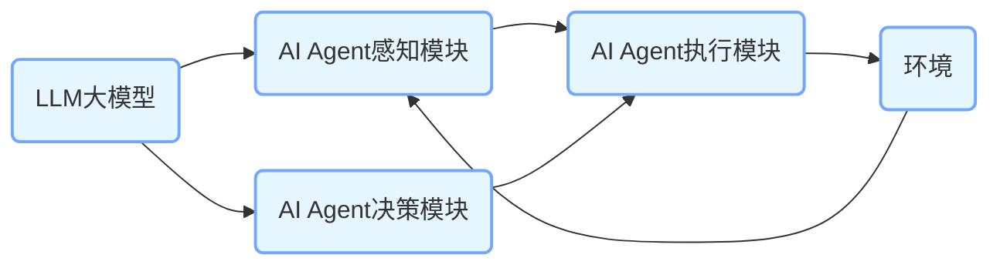

# LLM大模型在AI Agent开发中的核心作用

> 关键词：LLM大模型、AI Agent、自然语言处理、智能体开发、核心作用、语言理解、决策执行

> 摘要：本文深入探讨了LLM大模型在AI Agent开发中的核心作用。首先介绍了相关背景信息，包括目的范围、预期读者等。接着阐述了LLM大模型与AI Agent的核心概念及联系，通过原理和架构示意图、流程图进行清晰展示。详细讲解了核心算法原理及具体操作步骤，结合Python源代码进行说明。呈现了相关数学模型和公式并举例。通过项目实战，展示了开发环境搭建、源代码实现与解读。探讨了实际应用场景，推荐了相关工具和资源。最后总结了未来发展趋势与挑战，提供了常见问题解答和扩展阅读参考资料，旨在全面剖析LLM大模型对AI Agent开发的关键影响和价值。

## 1. 背景介绍 
### 1.1 目的和范围
在当今人工智能飞速发展的时代，AI Agent作为能够自主感知环境、做出决策并执行动作的智能实体，其开发和应用受到了广泛关注。LLM大模型（Large Language Model，大语言模型）凭借其强大的语言理解和生成能力，在AI Agent开发中逐渐发挥着核心作用。本文的目的在于深入剖析LLM大模型在AI Agent开发各个环节中的具体作用，包括但不限于语言交互、知识推理、决策制定等方面。范围涵盖了LLM大模型的基本原理、与AI Agent的结合方式、相关算法和数学模型，以及在实际项目中的应用案例和未来发展趋势。

### 1.2 预期读者
本文预期读者包括对人工智能领域有一定了解的专业人士，如AI开发者、研究人员、软件工程师等，他们希望深入学习LLM大模型和AI Agent相关知识，探索两者结合的技术细节和应用场景。同时，也适合对人工智能前沿技术感兴趣的爱好者，帮助他们更好地理解LLM大模型在AI Agent开发中的重要性和潜力。

### 1.3 文档结构概述
本文将按照以下结构展开：首先介绍LLM大模型和AI Agent的核心概念及它们之间的联系，通过示意图和流程图进行直观展示；接着详细讲解LLM大模型在AI Agent开发中的核心算法原理和具体操作步骤，并结合Python源代码进行说明；然后阐述相关的数学模型和公式，并举例进行详细讲解；通过项目实战，展示开发环境搭建、源代码实现与解读；探讨LLM大模型和AI Agent在实际应用中的场景；推荐相关的学习资源、开发工具框架和论文著作；最后总结未来发展趋势与挑战，提供常见问题解答和扩展阅读参考资料。

### 1.4 术语表
#### 1.4.1 核心术语定义
- **LLM大模型**：指具有大量参数和强大语言处理能力的语言模型，如GPT系列、BERT等，能够对自然语言进行理解、生成和推理。
- **AI Agent**：即人工智能智能体，是一种能够感知环境、根据内部状态和目标做出决策，并通过执行动作与环境进行交互的智能实体。
- **自然语言处理（NLP）**：研究计算机与人类自然语言之间交互的领域，包括语言的理解、生成、翻译等任务。
- **知识图谱**：一种用于表示实体及其之间关系的语义网络，可帮助AI Agent存储和利用知识。

#### 1.4.2 相关概念解释
- **语言理解**：LLM大模型通过对输入的自然语言进行分析和处理，理解其语义、语法和上下文信息，从而提取有用的知识和意图。
- **语言生成**：根据给定的输入或任务要求，LLM大模型生成符合语法和语义规则的自然语言文本，如回答问题、生成故事等。
- **决策制定**：AI Agent根据感知到的环境信息、内部状态和目标，利用LLM大模型的推理能力，选择合适的行动方案。

#### 1.4.3 缩略词列表
- **LLM**：Large Language Model（大语言模型）
- **AI**：Artificial Intelligence（人工智能）
- **NLP**：Natural Language Processing（自然语言处理）

## 2. 核心概念与联系 

### 2.1 LLM大模型原理
LLM大模型通常基于深度学习技术，特别是Transformer架构。Transformer架构由编码器和解码器组成，通过自注意力机制（Self - Attention Mechanism）来捕捉输入序列中不同位置之间的依赖关系。自注意力机制允许模型在处理每个位置的输入时，考虑到序列中其他位置的信息，从而更好地理解句子的上下文和语义。

以GPT（Generative Pretrained Transformer）系列模型为例，它是一种基于Transformer解码器的自回归语言模型。在预训练阶段，模型在大规模的文本语料库上进行无监督学习，通过预测下一个单词来学习语言的模式和规律。在微调阶段，模型可以针对特定的任务进行有监督学习，如文本分类、问答系统等。

### 2.2 AI Agent原理
AI Agent由感知模块、决策模块和执行模块组成。感知模块负责从环境中获取信息，如视觉、听觉、文本等；决策模块根据感知到的信息和内部状态，选择合适的行动方案；执行模块根据决策结果，在环境中执行相应的动作。

AI Agent的目标是在复杂的环境中实现特定的任务，如自主导航、对话交互、智能推荐等。为了实现这些目标，AI Agent需要具备一定的知识和推理能力，能够理解环境信息并做出合理的决策。

### 2.3 LLM大模型与AI Agent的联系
LLM大模型为AI Agent提供了强大的语言处理能力，使AI Agent能够更好地与人类进行交互。具体来说，LLM大模型可以用于以下几个方面：
- **语言理解**：帮助AI Agent理解人类输入的自然语言指令和问题，提取关键信息和意图。
- **知识推理**：利用LLM大模型的知识储备和推理能力，为AI Agent提供决策支持，使其能够在复杂的情况下做出合理的决策。
- **语言生成**：使AI Agent能够生成自然流畅的语言回复，与人类进行自然的对话交互。

### 2.4 文本示意图
```plaintext
           +----------------+
           |    LLM大模型   |
           +----------------+
               |         |
               |         |
               v         v
+------------------+  +------------------+
|  AI Agent感知模块 |  |  AI Agent决策模块 |
+------------------+  +------------------+
               |         |
               |         |
               v         v
+------------------+  +------------------+
|  AI Agent执行模块 |  |    环境          |
+------------------+  +------------------+
```

### 2.5 Mermaid流程图


## 3. 核心算法原理 & 具体操作步骤 

### 3.1 核心算法原理
#### 3.1.1 自注意力机制
自注意力机制是Transformer架构的核心组成部分，其主要作用是计算输入序列中每个位置与其他位置之间的相关性。具体来说，对于输入序列 $\mathbf{X} = [\mathbf{x}_1, \mathbf{x}_2, \cdots, \mathbf{x}_n]$，其中 $\mathbf{x}_i \in \mathbb{R}^d$ 表示第 $i$ 个位置的输入向量，自注意力机制的计算步骤如下：
1. 计算查询（Query）、键（Key）和值（Value）向量：
   - $\mathbf{Q} = \mathbf{X} \mathbf{W}^Q$
   - $\mathbf{K} = \mathbf{X} \mathbf{W}^K$
   - $\mathbf{V} = \mathbf{X} \mathbf{W}^V$
   其中 $\mathbf{W}^Q, \mathbf{W}^K, \mathbf{W}^V \in \mathbb{R}^{d \times d_k}$ 是可学习的权重矩阵，$d_k$ 是查询、键和值向量的维度。
2. 计算注意力分数：
   - $\mathbf{S} = \frac{\mathbf{Q} \mathbf{K}^T}{\sqrt{d_k}}$
   其中 $\mathbf{S} \in \mathbb{R}^{n \times n}$ 表示注意力分数矩阵，$\mathbf{S}_{ij}$ 表示第 $i$ 个位置与第 $j$ 个位置之间的相关性。
3. 应用Softmax函数：
   - $\mathbf{A} = \text{Softmax}(\mathbf{S})$
   其中 $\mathbf{A} \in \mathbb{R}^{n \times n}$ 表示注意力权重矩阵，$\mathbf{A}_{ij}$ 表示第 $i$ 个位置对第 $j$ 个位置的注意力权重。
4. 计算输出向量：
   - $\mathbf{Z} = \mathbf{A} \mathbf{V}$
   其中 $\mathbf{Z} \in \mathbb{R}^{n \times d_k}$ 表示自注意力机制的输出向量。

#### 3.1.2 基于LLM大模型的决策算法
在AI Agent的决策模块中，LLM大模型可以用于评估不同行动方案的优劣，选择最优的行动方案。具体来说，可以通过以下步骤实现：
1. 定义行动空间：明确AI Agent在当前环境中可以采取的所有可能行动。
2. 生成行动描述：对于每个行动方案，生成相应的自然语言描述。
3. 输入LLM大模型：将当前环境信息和行动描述作为输入，输入到LLM大模型中。
4. 评估行动价值：LLM大模型根据输入信息，评估每个行动方案的价值或得分。
5. 选择最优行动：选择得分最高的行动方案作为AI Agent的决策结果。

### 3.2 具体操作步骤
#### 3.2.1 数据预处理
在使用LLM大模型之前，需要对输入数据进行预处理，包括分词、编码等操作。以下是一个使用Python和Hugging Face的Transformers库进行数据预处理的示例代码：
```python
from transformers import AutoTokenizer

# 加载预训练的分词器
tokenizer = AutoTokenizer.from_pretrained('gpt2')

# 输入文本
text = "Hello, how are you?"

# 分词
tokens = tokenizer.tokenize(text)

# 编码
input_ids = tokenizer.convert_tokens_to_ids(tokens)

print("Tokens:", tokens)
print("Input IDs:", input_ids)
```
#### 3.2.2 模型推理
使用预处理后的数据进行模型推理，获取LLM大模型的输出。以下是一个使用Hugging Face的Transformers库进行模型推理的示例代码：
```python
from transformers import AutoModelForCausalLM
import torch

# 加载预训练的语言模型
model = AutoModelForCausalLM.from_pretrained('gpt2')

# 将输入ID转换为PyTorch张量
input_tensor = torch.tensor([input_ids])

# 模型推理
output = model(input_tensor)

# 获取预测的下一个单词的概率分布
logits = output.logits[:, -1, :]

# 获取预测的下一个单词的ID
predicted_id = torch.argmax(logits, dim=-1).item()

# 将ID转换为单词
predicted_token = tokenizer.convert_ids_to_tokens(predicted_id)

print("Predicted Token:", predicted_token)
```
#### 3.2.3 决策制定
根据LLM大模型的输出，结合AI Agent的行动空间，选择最优的行动方案。以下是一个简单的决策制定示例代码：
```python
# 定义行动空间
action_space = ["action1", "action2", "action3"]

# 定义每个行动的描述
action_descriptions = {
    "action1": "This is action 1",
    "action2": "This is action 2",
    "action3": "This is action 3"
}

# 定义环境信息
environment_info = "The current situation is ..."

# 评估每个行动的价值
action_values = {}
for action in action_space:
    input_text = f"{environment_info} {action_descriptions[action]}"
    input_ids = tokenizer.encode(input_text, return_tensors='pt')
    output = model(input_ids)
    logits = output.logits[:, -1, :]
    value = torch.mean(logits).item()
    action_values[action] = value

# 选择价值最高的行动
best_action = max(action_values, key=action_values.get)

print("Best Action:", best_action)
```

## 4. 数学模型和公式 & 详细讲解 & 举例说明 

### 4.1 自注意力机制的数学模型
自注意力机制的数学模型可以用以下公式表示：
$$
\text{Attention}(\mathbf{Q}, \mathbf{K}, \mathbf{V}) = \text{Softmax}\left(\frac{\mathbf{Q} \mathbf{K}^T}{\sqrt{d_k}}\right) \mathbf{V}
$$
其中 $\mathbf{Q} \in \mathbb{R}^{n \times d_k}$ 是查询矩阵，$\mathbf{K} \in \mathbb{R}^{n \times d_k}$ 是键矩阵，$\mathbf{V} \in \mathbb{R}^{n \times d_v}$ 是值矩阵，$d_k$ 是查询和键向量的维度，$d_v$ 是值向量的维度，$n$ 是输入序列的长度。

### 4.2 详细讲解
- **查询、键和值矩阵**：查询、键和值矩阵是通过将输入序列 $\mathbf{X}$ 分别乘以可学习的权重矩阵 $\mathbf{W}^Q, \mathbf{W}^K, \mathbf{W}^V$ 得到的。这些权重矩阵在训练过程中不断调整，以学习输入序列中不同位置之间的相关性。
- **注意力分数**：注意力分数矩阵 $\mathbf{S} = \frac{\mathbf{Q} \mathbf{K}^T}{\sqrt{d_k}}$ 表示输入序列中每个位置与其他位置之间的相关性。通过除以 $\sqrt{d_k}$ 可以防止点积结果过大，导致Softmax函数的梯度消失。
- **注意力权重**：注意力权重矩阵 $\mathbf{A} = \text{Softmax}(\mathbf{S})$ 表示每个位置对其他位置的注意力程度。Softmax函数将注意力分数转换为概率分布，使得每个位置的注意力权重之和为1。
- **输出向量**：输出向量 $\mathbf{Z} = \mathbf{A} \mathbf{V}$ 是通过将注意力权重矩阵与值矩阵相乘得到的。它表示每个位置在考虑了其他位置的信息后的表示。

### 4.3 举例说明
假设输入序列 $\mathbf{X} = [\mathbf{x}_1, \mathbf{x}_2, \mathbf{x}_3]$，其中 $\mathbf{x}_i \in \mathbb{R}^4$，$d_k = d_v = 2$。可学习的权重矩阵 $\mathbf{W}^Q, \mathbf{W}^K, \mathbf{W}^V \in \mathbb{R}^{4 \times 2}$ 如下：
$$
\mathbf{W}^Q = \begin{bmatrix}
1 & 2 \\
3 & 4 \\
5 & 6 \\
7 & 8
\end{bmatrix},
\mathbf{W}^K = \begin{bmatrix}
2 & 3 \\
4 & 5 \\
6 & 7 \\
8 & 9
\end{bmatrix},
\mathbf{W}^V = \begin{bmatrix}
3 & 4 \\
5 & 6 \\
7 & 8 \\
9 & 10
\end{bmatrix}
$$
输入序列 $\mathbf{X}$ 如下：
$$
\mathbf{X} = \begin{bmatrix}
1 & 2 & 3 & 4 \\
5 & 6 & 7 & 8 \\
9 & 10 & 11 & 12
\end{bmatrix}
$$
计算查询、键和值矩阵：
$$
\mathbf{Q} = \mathbf{X} \mathbf{W}^Q = \begin{bmatrix}
1\times1 + 2\times3 + 3\times5 + 4\times7 & 1\times2 + 2\times4 + 3\times6 + 4\times8 \\
5\times1 + 6\times3 + 7\times5 + 8\times7 & 5\times2 + 6\times4 + 7\times6 + 8\times8 \\
9\times1 + 10\times3 + 11\times5 + 12\times7 & 9\times2 + 10\times4 + 11\times6 + 12\times8
\end{bmatrix} = \begin{bmatrix}
50 & 60 \\
150 & 180 \\
250 & 300
\end{bmatrix}
$$
$$
\mathbf{K} = \mathbf{X} \mathbf{W}^K = \begin{bmatrix}
1\times2 + 2\times4 + 3\times6 + 4\times8 & 1\times3 + 2\times5 + 3\times7 + 4\times9 \\
5\times2 + 6\times4 + 7\times6 + 8\times8 & 5\times3 + 6\times5 + 7\times7 + 8\times9 \\
9\times2 + 10\times4 + 11\times6 + 12\times8 & 9\times3 + 10\times5 + 11\times7 + 12\times9
\end{bmatrix} = \begin{bmatrix}
60 & 70 \\
180 & 210 \\
300 & 350
\end{bmatrix}
$$
$$
\mathbf{V} = \mathbf{X} \mathbf{W}^V = \begin{bmatrix}
1\times3 + 2\times5 + 3\times7 + 4\times9 & 1\times4 + 2\times6 + 3\times8 + 4\times10 \\
5\times3 + 6\times5 + 7\times7 + 8\times9 & 5\times4 + 6\times6 + 7\times8 + 8\times10 \\
9\times3 + 10\times5 + 11\times7 + 12\times9 & 9\times4 + 10\times6 + 11\times8 + 12\times10
\end{bmatrix} = \begin{bmatrix}
70 & 80 \\
210 & 240 \\
350 & 400
\end{bmatrix}
$$
计算注意力分数矩阵：
$$
\mathbf{S} = \frac{\mathbf{Q} \mathbf{K}^T}{\sqrt{d_k}} = \frac{1}{\sqrt{2}} \begin{bmatrix}
50\times60 + 60\times70 & 50\times180 + 60\times210 & 50\times300 + 60\times350 \\
150\times60 + 180\times70 & 150\times180 + 180\times210 & 150\times300 + 180\times350 \\
250\times60 + 300\times70 & 250\times180 + 300\times210 & 250\times300 + 300\times350
\end{bmatrix} = \frac{1}{\sqrt{2}} \begin{bmatrix}
7200 & 21600 & 36000 \\
21600 & 64800 & 108000 \\
36000 & 108000 & 180000
\end{bmatrix}
$$
应用Softmax函数计算注意力权重矩阵：
$$
\mathbf{A} = \text{Softmax}(\mathbf{S})
$$
计算输出向量：
$$
\mathbf{Z} = \mathbf{A} \mathbf{V}
$$

## 5. 项目实战：代码实际案例和详细解释说明 

### 5.1  开发环境搭建
#### 5.1.1 安装Python
首先需要安装Python 3.x版本。可以从Python官方网站（https://www.python.org/downloads/） 下载并安装适合自己操作系统的Python版本。

#### 5.1.2 创建虚拟环境
为了避免不同项目之间的依赖冲突，建议使用虚拟环境。可以使用`venv`模块创建虚拟环境：
```bash
python -m venv myenv
```
激活虚拟环境：
- 在Windows上：
```bash
myenv\Scripts\activate
```
- 在Linux或Mac上：
```bash
source myenv/bin/activate
```

#### 5.1.3 安装依赖库
在虚拟环境中安装所需的依赖库，包括Hugging Face的Transformers库、PyTorch等：
```bash
pip install transformers torch
```

### 5.2  源代码详细实现和代码解读
以下是一个简单的基于LLM大模型的AI Agent对话系统的实现代码：
```python
from transformers import AutoTokenizer, AutoModelForCausalLM

# 加载预训练的分词器和语言模型
tokenizer = AutoTokenizer.from_pretrained('gpt2')
model = AutoModelForCausalLM.from_pretrained('gpt2')

def generate_response(input_text):
    # 分词和编码
    input_ids = tokenizer.encode(input_text, return_tensors='pt')
    
    # 模型推理
    output = model.generate(input_ids, max_length=100, num_return_sequences=1)
    
    # 解码输出
    response = tokenizer.decode(output[0], skip_special_tokens=True)
    
    return response

# 对话循环
while True:
    user_input = input("You: ")
    if user_input.lower() == 'exit':
        break
    response = generate_response(user_input)
    print("Agent: ", response)
```
### 5.2.1 代码解读
- **加载预训练模型和分词器**：使用`AutoTokenizer.from_pretrained('gpt2')`和`AutoModelForCausalLM.from_pretrained('gpt2')`加载预训练的GPT - 2分词器和语言模型。
- **生成回复函数**：`generate_response`函数接受用户输入的文本，将其分词并编码为输入ID，然后使用`model.generate`方法生成回复的输出ID，最后将输出ID解码为文本。
- **对话循环**：使用`while True`循环不断接收用户输入，直到用户输入`exit`退出循环。对于每个用户输入，调用`generate_response`函数生成回复并打印。

### 5.3  代码解读与分析
#### 5.3.1 优点
- **简单易用**：使用Hugging Face的Transformers库可以方便地加载和使用预训练的语言模型，无需从头开始训练模型。
- **语言生成能力**：GPT - 2模型具有强大的语言生成能力，可以生成自然流畅的回复。

#### 5.3.2 缺点
- **缺乏上下文理解**：当前实现只是简单地根据用户的输入生成回复，没有考虑对话的上下文信息，可能导致回复与上下文不连贯。
- **缺乏知识推理**：模型只是基于预训练的语言模式生成回复，没有进行深入的知识推理，对于一些需要专业知识的问题可能无法给出准确的回答。

#### 5.3.3 改进方向
- **引入上下文管理**：可以使用对话历史记录来维护对话的上下文信息，将上下文信息作为输入的一部分传递给模型，提高回复的连贯性。
- **结合知识图谱**：将知识图谱与LLM大模型相结合，为模型提供更多的知识支持，增强模型的知识推理能力。

## 6. 实际应用场景 
### 6.1 智能客服
在智能客服领域，LLM大模型可以帮助AI Agent理解用户的问题，生成准确、自然的回复。例如，在电商平台的客服系统中，用户可能会咨询商品信息、订单状态、退换货政策等问题。AI Agent可以利用LLM大模型的语言理解能力，准确识别用户的问题意图，然后根据预定义的知识库或实时查询结果，生成合适的回复。通过与用户进行自然流畅的对话，AI Agent可以快速解决用户的问题，提高用户满意度。

### 6.2 智能助手
智能助手如Siri、小爱同学等，利用LLM大模型可以更好地理解用户的语音指令，执行各种任务。例如，用户可以通过语音指令让智能助手查询天气、设置提醒、播放音乐等。LLM大模型可以将用户的语音转换为文本，理解文本的语义和意图，然后根据用户的需求调用相应的功能模块。同时，智能助手还可以与用户进行多轮对话，根据上下文信息提供更准确的服务。

### 6.3 智能写作
在智能写作领域，AI Agent结合LLM大模型可以帮助用户生成各种类型的文本，如文章、故事、诗歌等。用户可以提供一些关键词或主题，AI Agent利用LLM大模型的语言生成能力，生成符合要求的文本内容。例如，在新闻写作中，AI Agent可以根据事件的关键信息，自动生成新闻稿件的初稿，提高写作效率。同时，AI Agent还可以对生成的文本进行语法检查、词汇推荐等优化，提升文本质量。

### 6.4 教育领域
在教育领域，LLM大模型可以用于智能辅导系统。AI Agent可以根据学生的问题，提供详细的解答和学习建议。例如，在数学辅导中，学生可以向AI Agent提出数学问题，AI Agent可以利用LLM大模型的知识推理能力，分析问题的类型和难度，然后提供相应的解题思路和步骤。此外，AI Agent还可以根据学生的学习情况，制定个性化的学习计划，帮助学生提高学习效果。

### 6.5 金融领域
在金融领域，AI Agent结合LLM大模型可以用于风险评估、投资建议等方面。例如，在信贷审批中，AI Agent可以分析客户的申请资料和信用记录，利用LLM大模型理解文本信息，评估客户的信用风险。在投资建议方面，AI Agent可以根据市场动态和客户的投资目标，生成个性化的投资建议。同时，AI Agent还可以与客户进行沟通，解答客户的疑问，提高客户的投资决策能力。

## 7. 工具和资源推荐
### 7.1 学习资源推荐
#### 7.1.1 书籍推荐
- 《深度学习》（Deep Learning）：由Ian Goodfellow、Yoshua Bengio和Aaron Courville合著，是深度学习领域的经典教材，全面介绍了深度学习的基本概念、算法和应用。
- 《自然语言处理入门》：详细介绍了自然语言处理的基础知识和常用技术，包括分词、词性标注、命名实体识别等。
- 《Python自然语言处理》（Natural Language Processing with Python）：通过Python代码示例，介绍了自然语言处理的各种任务和技术，适合初学者学习。

#### 7.1.2 在线课程
- Coursera上的“深度学习专项课程”（Deep Learning Specialization）：由Andrew Ng教授授课，系统地介绍了深度学习的各个方面，包括神经网络、卷积神经网络、循环神经网络等。
- edX上的“自然语言处理”（Natural Language Processing）课程：由麻省理工学院（MIT）的教授授课，深入讲解了自然语言处理的理论和实践。
- 哔哩哔哩（Bilibili）上有许多关于人工智能和自然语言处理的免费视频教程，适合初学者快速入门。

#### 7.1.3 技术博客和网站
- Hugging Face官方博客（https://huggingface.co/blog）：提供了关于自然语言处理、大语言模型等方面的最新研究成果和技术文章。
- Medium上的Towards Data Science（https://towardsdatascience.com/）：有许多关于人工智能、机器学习和自然语言处理的高质量文章和教程。
- arXiv（https://arxiv.org/）：是一个开放获取的学术预印本平台，提供了大量关于人工智能和自然语言处理的最新研究论文。

### 7.2 开发工具框架推荐
#### 7.2.1 IDE和编辑器
- PyCharm：是一款专门为Python开发设计的集成开发环境（IDE），具有强大的代码编辑、调试和智能提示功能，适合专业的Python开发者使用。
- Visual Studio Code（VS Code）：是一款轻量级的代码编辑器，支持多种编程语言和插件扩展，具有丰富的功能和良好的用户体验，适合初学者和有经验的开发者。

#### 7.2.2 调试和性能分析工具
- Py-Spy：是一个用于Python程序的性能分析工具，可以实时监测Python程序的CPU使用率、函数调用栈等信息，帮助开发者找出性能瓶颈。
- TensorBoard：是TensorFlow的可视化工具，也可以用于PyTorch等其他深度学习框架。它可以帮助开发者可视化模型的训练过程、损失函数曲线、梯度分布等信息，方便调试和优化模型。

#### 7.2.3 相关框架和库
- Hugging Face Transformers：是一个用于自然语言处理的开源库，提供了各种预训练的语言模型和工具，方便开发者快速实现自然语言处理任务。
- PyTorch：是一个开源的深度学习框架，具有动态图计算、自动求导等优点，广泛应用于自然语言处理、计算机视觉等领域。
- NLTK（Natural Language Toolkit）：是一个Python的自然语言处理工具包，提供了丰富的语料库和工具，适合初学者学习和实践自然语言处理任务。

### 7.3 相关论文著作推荐
#### 7.3.1 经典论文
- “Attention Is All You Need”：介绍了Transformer架构，提出了自注意力机制，是自然语言处理领域的里程碑式论文。
- “BERT: Pre-training of Deep Bidirectional Transformers for Language Understanding”：提出了BERT模型，通过预训练和微调的方式，在多个自然语言处理任务上取得了优异的成绩。
- “Generative Pretrained Transformer 3”：介绍了GPT - 3模型，展示了大语言模型在语言生成方面的强大能力。

#### 7.3.2 最新研究成果
- 关注顶级学术会议如ACL（Association for Computational Linguistics）、EMNLP（Conference on Empirical Methods in Natural Language Processing）等的最新论文，了解自然语言处理和大语言模型的最新研究动态。
- 关注各大科研机构和高校的研究成果，如OpenAI、Google Brain、斯坦福大学、麻省理工学院等的相关研究。

#### 7.3.3 应用案例分析
- 许多科技公司会发布关于AI Agent和大语言模型应用的案例分析，如Google、Microsoft、Amazon等公司的官方博客和技术报告。这些案例分析可以帮助开发者了解实际应用中的技术挑战和解决方案。

## 8. 总结：未来发展趋势与挑战
### 8.1 未来发展趋势
#### 8.1.1 多模态融合
未来的AI Agent将不仅仅局限于处理文本信息，还会融合视觉、听觉等多种模态的信息。例如，在智能客服场景中，AI Agent可以通过图像识别技术识别用户上传的商品图片，结合用户的文本描述，提供更准确的服务。LLM大模型也将与其他模态的模型进行融合，实现更强大的智能交互。

#### 8.1.2 个性化定制
随着用户需求的不断多样化，AI Agent将更加注重个性化定制。通过对用户的历史数据和行为模式进行分析，AI Agent可以了解用户的偏好和需求，为用户提供个性化的服务和推荐。LLM大模型可以在个性化对话生成、知识推荐等方面发挥重要作用。

#### 8.1.3 自主学习和进化
未来的AI Agent将具备更强的自主学习和进化能力。它们可以在不断与环境交互的过程中，自动学习新的知识和技能，适应环境的变化。LLM大模型可以作为AI Agent的知识引擎，为其提供丰富的知识支持，帮助AI Agent更好地进行自主学习和决策。

#### 8.1.4 与物联网的结合
AI Agent将与物联网技术紧密结合，实现对物理世界的智能控制和管理。例如，在智能家居场景中，AI Agent可以通过与各种智能设备的连接，实现对家居设备的远程控制、环境监测等功能。LLM大模型可以帮助AI Agent理解用户的自然语言指令，与智能设备进行有效的交互。

### 8.2 挑战
#### 8.2.1 计算资源和能耗
LLM大模型通常具有大量的参数，训练和推理过程需要消耗大量的计算资源和能源。这不仅增加了开发成本，还对环境造成了一定的压力。未来需要研究更高效的训练算法和硬件架构，降低计算资源和能耗。

#### 8.2.2 数据隐私和安全
AI Agent在运行过程中需要处理大量的用户数据，包括个人信息、隐私数据等。如何保障数据的隐私和安全是一个重要的挑战。需要研究有效的数据加密、访问控制等技术，防止数据泄露和滥用。

#### 8.2.3 可解释性和可信度
LLM大模型通常是基于深度学习的黑盒模型，其决策过程和结果难以解释。在一些关键领域，如医疗、金融等，用户需要了解AI Agent的决策依据，以确保其可信度。因此，提高LLM大模型的可解释性是一个亟待解决的问题。

#### 8.2.4 伦理和社会影响
AI Agent的广泛应用可能会对社会产生一系列的伦理和社会影响，如就业结构的变化、人类与机器的关系等。需要建立相应的伦理准则和法律法规，引导AI Agent的健康发展，确保其符合人类的价值观和利益。

## 9. 附录：常见问题与解答
### 9.1 什么是LLM大模型？
LLM大模型是指具有大量参数和强大语言处理能力的语言模型，如GPT系列、BERT等。这些模型通过在大规模的文本语料库上进行预训练，学习语言的模式和规律，能够对自然语言进行理解、生成和推理。

### 9.2 LLM大模型与传统语言模型有什么区别？
传统语言模型通常基于统计方法，如n - gram模型，其表达能力和泛化能力有限。而LLM大模型基于深度学习技术，特别是Transformer架构，具有更强的语言理解和生成能力。LLM大模型可以处理长文本，捕捉上下文信息，并且在多个自然语言处理任务上取得了优异的成绩。

### 9.3 AI Agent为什么需要LLM大模型？
AI Agent需要具备一定的语言处理能力，以便与人类进行自然的交互。LLM大模型可以为AI Agent提供强大的语言理解和生成能力，帮助AI Agent理解人类的指令和问题，生成自然流畅的回复。同时，LLM大模型的知识推理能力可以为AI Agent的决策制定提供支持。

### 9.4 如何选择适合的LLM大模型？
选择适合的LLM大模型需要考虑多个因素，如模型的规模、性能、应用场景等。如果应用场景对计算资源有限制，可以选择相对较小的模型；如果对语言处理能力要求较高，可以选择较大的模型。此外，还需要考虑模型的开源性、社区支持等因素。

### 9.5 LLM大模型的训练过程是怎样的？
LLM大模型的训练过程通常分为预训练和微调两个阶段。在预训练阶段，模型在大规模的文本语料库上进行无监督学习，通过预测下一个单词来学习语言的模式和规律。在微调阶段，模型针对特定的任务进行有监督学习，通过调整模型的参数来优化任务的性能。

## 10. 扩展阅读 & 参考资料
- Goodfellow, I., Bengio, Y., & Courville, A. (2016). Deep Learning. MIT Press.
- Bird, S., Klein, E., & Loper, E. (2009). Natural Language Processing with Python. O'Reilly Media.
- Vaswani, A., Shazeer, N., Parmar, N., Uszkoreit, J., Jones, L., Gomez, A. N., ... & Polosukhin, I. (2017). Attention is all you need. In Advances in neural information processing systems (pp. 5998 - 6008).
- Devlin, J., Chang, M. W., Lee, K., & Toutanova, K. (2018). Bert: Pre - training of deep bidirectional transformers for language understanding. arXiv preprint arXiv:1810.04805.
- Brown, T. B., Mann, B., Ryder, N., Subbiah, M., Kaplan, J. D., Dhariwal, P., ... & Amodei, D. (2020). Language models are few - shot learners. arXiv preprint arXiv:2005.14165.
- Hugging Face官方文档（https://huggingface.co/docs/transformers/index）
- PyTorch官方文档（https://pytorch.org/docs/stable/index.html）
- NLTK官方文档（https://www.nltk.org/）