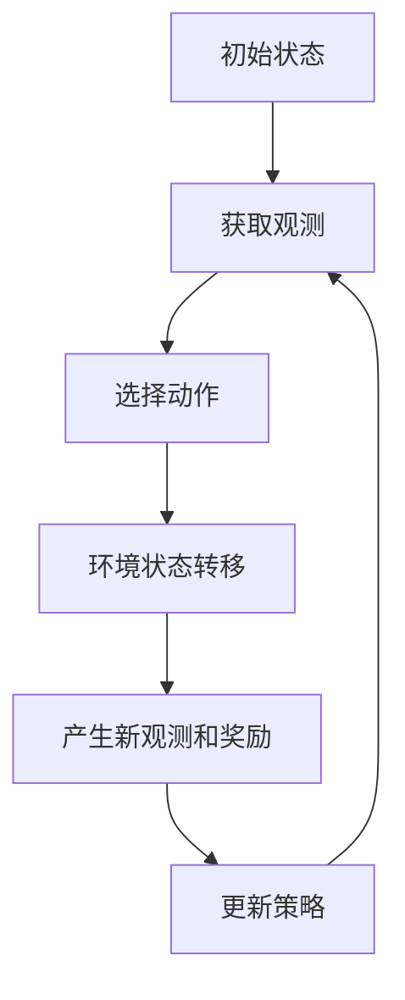

# POMDP在复杂AI决策中的应用

> 关键词：POMDP、复杂AI决策、部分可观测马尔可夫决策过程、AI算法、决策理论

> 摘要：本文深入探讨了POMDP（部分可观测马尔可夫决策过程）在复杂AI决策中的应用。首先介绍了POMDP的背景知识，包括其目的、适用读者、文档结构和相关术语。接着详细阐述了POMDP的核心概念、原理和架构，通过Mermaid流程图进行直观展示。然后讲解了POMDP的核心算法原理，并给出Python源代码进行详细说明。还介绍了POMDP的数学模型和公式，并举例说明。通过项目实战，展示了POMDP在实际开发中的代码实现和解读。分析了POMDP的实际应用场景，推荐了相关的学习资源、开发工具框架和论文著作。最后总结了POMDP的未来发展趋势与挑战，并提供了常见问题解答和扩展阅读参考资料，旨在为读者全面深入地了解POMDP在复杂AI决策中的应用提供帮助。

## 1. 背景介绍 
### 1.1 目的和范围
在复杂的AI决策场景中，智能体往往面临着信息不完全可观测的情况。例如，在自动驾驶中，车辆传感器可能无法获取到所有的环境信息；在机器人探索未知环境时，也难以完全掌握环境的全貌。POMDP作为一种强大的决策模型，能够处理这种部分可观测的不确定性，为智能体提供最优的决策策略。本文的目的就是深入探讨POMDP在复杂AI决策中的应用原理、算法实现和实际案例，范围涵盖了从理论基础到实际应用的各个方面。

### 1.2 预期读者
本文预期读者包括对人工智能决策领域感兴趣的研究人员、AI算法开发者、相关专业的学生以及希望了解复杂AI决策技术的技术爱好者。无论你是初学者想要了解POMDP的基本概念，还是有一定经验的开发者希望深入研究其算法实现和应用，都能从本文中获得有价值的信息。

### 1.3 文档结构概述
本文首先介绍POMDP的背景知识，包括目的、读者、文档结构和术语表。然后详细阐述POMDP的核心概念、原理和架构，通过流程图进行直观展示。接着讲解核心算法原理并给出Python代码示例。再介绍数学模型和公式，并举例说明。通过项目实战展示代码实现和解读。分析实际应用场景，推荐相关学习资源、开发工具框架和论文著作。最后总结未来发展趋势与挑战，提供常见问题解答和扩展阅读参考资料。

### 1.4 术语表
#### 1.4.1 核心术语定义
- **POMDP（部分可观测马尔可夫决策过程）**：是一种在部分可观测环境下进行决策的数学模型，它考虑了环境状态的不确定性和智能体观测的不完全性。
- **状态（State）**：表示环境的一种可能配置，智能体的决策和环境的动态变化都与状态相关。
- **动作（Action）**：智能体在某个状态下可以采取的行为。
- **观测（Observation）**：智能体从环境中获取的信息，由于部分可观测性，观测可能不能完全反映环境的真实状态。
- **策略（Policy）**：是一个从观测到动作的映射，它指导智能体在不同的观测下采取合适的动作。

#### 1.4.2 相关概念解释
- **马尔可夫性质**：指系统的未来状态只依赖于当前状态，而与过去的状态无关。在POMDP中，环境的动态变化满足马尔可夫性质。
- **部分可观测性**：意味着智能体不能直接获取环境的真实状态，只能通过观测来推断状态的概率分布。
- **价值函数**：用于评估策略的优劣，它表示在某个策略下智能体从当前状态开始所能获得的长期累积奖励的期望值。

#### 1.4.3 缩略词列表
- **POMDP**：Partially Observable Markov Decision Process（部分可观测马尔可夫决策过程）
- **MDP**：Markov Decision Process（马尔可夫决策过程）

## 2. 核心概念与联系 
POMDP的核心概念包括状态、动作、观测、奖励和转移概率等。智能体在环境中处于某个状态，根据观测到的信息选择一个动作，环境根据转移概率转移到下一个状态，并给智能体一个奖励。智能体的目标是通过选择合适的动作来最大化长期累积奖励。

### 核心概念原理和架构的文本示意图
POMDP的架构可以描述为一个循环过程。智能体首先处于一个初始状态，它从环境中获取观测信息。根据观测信息和当前的策略，智能体选择一个动作。环境接收到动作后，根据转移概率转移到下一个状态，并产生一个新的观测和奖励。智能体根据新的观测更新策略，继续下一轮的决策。

### Mermaid流程图


## 3. 核心算法原理 & 具体操作步骤 
### 算法原理讲解
POMDP的核心目标是找到一个最优策略，使得智能体在长期内获得最大的累积奖励。常用的求解方法是基于价值迭代的算法。价值迭代算法通过不断更新价值函数来逼近最优策略。

价值函数 $V(s)$ 表示在状态 $s$ 下，智能体按照最优策略行动所能获得的长期累积奖励的期望值。在POMDP中，由于状态是部分可观测的，我们通常使用信念状态 $b$ 来表示对状态的概率分布。信念状态 $b$ 是一个概率向量，其中每个元素表示处于某个状态的概率。

价值迭代算法的基本思想是，从一个初始的价值函数 $V_0$ 开始，不断迭代更新价值函数，直到收敛。在每次迭代中，对于每个信念状态 $b$，我们计算在每个动作 $a$ 下的期望价值，然后选择期望价值最大的动作作为最优动作。

### Python源代码详细阐述
```python
import numpy as np

# 定义POMDP的参数
num_states = 3  # 状态数量
num_actions = 2  # 动作数量
num_observations = 2  # 观测数量

# 转移概率矩阵 P(s'|s, a)
transition_prob = np.array([
    [[0.7, 0.2, 0.1], [0.1, 0.8, 0.1]],
    [[0.3, 0.6, 0.1], [0.1, 0.2, 0.7]],
    [[0.1, 0.1, 0.8], [0.2, 0.7, 0.1]]
])

# 观测概率矩阵 O(o|s', a)
observation_prob = np.array([
    [[0.8, 0.2], [0.2, 0.8]],
    [[0.7, 0.3], [0.3, 0.7]],
    [[0.6, 0.4], [0.4, 0.6]]
])

# 奖励矩阵 R(s, a)
reward_matrix = np.array([
    [10, -5],
    [5, -10],
    [-10, 20]
])

# 折扣因子
discount_factor = 0.9

# 初始信念状态
initial_belief = np.array([0.3, 0.3, 0.4])

# 价值迭代算法
def value_iteration(num_iterations):
    # 初始化价值函数
    value_function = np.zeros(num_states)
    
    for _ in range(num_iterations):
        new_value_function = np.zeros(num_states)
        
        for s in range(num_states):
            action_values = []
            for a in range(num_actions):
                expected_reward = reward_matrix[s, a]
                expected_future_value = 0
                
                for s_prime in range(num_states):
                    expected_future_value += transition_prob[s, a, s_prime] * value_function[s_prime]
                
                action_value = expected_reward + discount_factor * expected_future_value
                action_values.append(action_value)
            
            new_value_function[s] = max(action_values)
        
        value_function = new_value_function
    
    return value_function

# 运行价值迭代算法
num_iterations = 100
optimal_value_function = value_iteration(num_iterations)
print("最优价值函数:", optimal_value_function)
```

### 具体操作步骤
1. **定义POMDP的参数**：包括状态数量、动作数量、观测数量、转移概率矩阵、观测概率矩阵、奖励矩阵和折扣因子。
2. **初始化价值函数**：将价值函数初始化为全零向量。
3. **进行价值迭代**：在每次迭代中，对于每个状态，计算在每个动作下的期望价值，选择期望价值最大的动作作为最优动作，更新价值函数。
4. **返回最优价值函数**：迭代结束后，返回最终的价值函数。

## 4. 数学模型和公式 & 详细讲解 & 举例说明 
### 数学模型
POMDP可以用一个六元组 $\langle S, A, T, Z, O, R \rangle$ 来表示，其中：
- $S$ 是有限的状态集合。
- $A$ 是有限的动作集合。
- $T: S \times A \times S \to [0, 1]$ 是转移概率函数，表示在状态 $s$ 下采取动作 $a$ 转移到状态 $s'$ 的概率，即 $T(s, a, s') = P(s'|s, a)$。
- $Z$ 是有限的观测集合。
- $O: S' \times A \times Z \to [0, 1]$ 是观测概率函数，表示在状态 $s'$ 下采取动作 $a$ 得到观测 $o$ 的概率，即 $O(s', a, o) = P(o|s', a)$。
- $R: S \times A \to \mathbb{R}$ 是奖励函数，表示在状态 $s$ 下采取动作 $a$ 获得的奖励。

### 数学公式
#### 信念状态更新
信念状态 $b$ 是一个概率向量，它表示智能体对当前状态的概率分布。当智能体采取动作 $a$ 并获得观测 $o$ 后，信念状态 $b$ 更新为 $b'$，更新公式为：
$$b'(s') = \frac{O(s', a, o) \sum_{s \in S} T(s, a, s') b(s)}{\sum_{s'' \in S} O(s'', a, o) \sum_{s \in S} T(s, a, s'') b(s)}$$

#### 价值函数更新
价值函数 $V(b)$ 表示在信念状态 $b$ 下，智能体按照最优策略行动所能获得的长期累积奖励的期望值。价值函数的更新公式为：
$$V_{k+1}(b) = \max_{a \in A} \left[ \sum_{s \in S} b(s) R(s, a) + \gamma \sum_{o \in Z} P(o|b, a) V_k(b') \right]$$
其中，$\gamma$ 是折扣因子，$P(o|b, a)$ 是在信念状态 $b$ 下采取动作 $a$ 获得观测 $o$ 的概率，$b'$ 是更新后的信念状态。

### 举例说明
假设一个简单的POMDP问题，有两个状态 $S = \{s_1, s_2\}$，两个动作 $A = \{a_1, a_2\}$，两个观测 $Z = \{o_1, o_2\}$。转移概率矩阵、观测概率矩阵和奖励矩阵如下：
$$T = \begin{bmatrix}
\begin{bmatrix} 0.8 & 0.2 \\ 0.2 & 0.8 \end{bmatrix} & \begin{bmatrix} 0.3 & 0.7 \\ 0.7 & 0.3 \end{bmatrix} \\
\begin{bmatrix} 0.7 & 0.3 \\ 0.3 & 0.7 \end{bmatrix} & \begin{bmatrix} 0.2 & 0.8 \\ 0.8 & 0.2 \end{bmatrix}
\end{bmatrix}$$
$$O = \begin{bmatrix}
\begin{bmatrix} 0.9 & 0.1 \\ 0.1 & 0.9 \end{bmatrix} & \begin{bmatrix} 0.8 & 0.2 \\ 0.2 & 0.8 \end{bmatrix} \\
\begin{bmatrix} 0.7 & 0.3 \\ 0.3 & 0.7 \end{bmatrix} & \begin{bmatrix} 0.6 & 0.4 \\ 0.4 & 0.6 \end{bmatrix}
\end{bmatrix}$$
$$R = \begin{bmatrix}
10 & -5 \\
5 & -10
\end{bmatrix}$$
初始信念状态 $b = [0.6, 0.4]$，折扣因子 $\gamma = 0.9$。

我们可以根据上述公式计算信念状态的更新和价值函数的更新。例如，当智能体采取动作 $a_1$ 并获得观测 $o_1$ 时，更新信念状态：
1. 计算分子：
    - 对于 $s' = s_1$：
        - $\sum_{s \in S} T(s, a_1, s_1) b(s) = T(s_1, a_1, s_1) b(s_1) + T(s_2, a_1, s_1) b(s_2) = 0.8 \times 0.6 + 0.2 \times 0.4 = 0.56$
        - $O(s_1, a_1, o_1) \sum_{s \in S} T(s, a_1, s_1) b(s) = 0.9 \times 0.56 = 0.504$
    - 对于 $s' = s_2$：
        - $\sum_{s \in S} T(s, a_1, s_2) b(s) = T(s_1, a_1, s_2) b(s_1) + T(s_2, a_1, s_2) b(s_2) = 0.2 \times 0.6 + 0.8 \times 0.4 = 0.44$
        - $O(s_2, a_1, o_1) \sum_{s \in S} T(s, a_1, s_2) b(s) = 0.1 \times 0.44 = 0.044$
2. 计算分母：
    - $\sum_{s'' \in S} O(s'', a_1, o_1) \sum_{s \in S} T(s, a_1, s'') b(s) = 0.504 + 0.044 = 0.548$
3. 计算更新后的信念状态：
    - $b'(s_1) = \frac{0.504}{0.548} \approx 0.92$
    - $b'(s_2) = \frac{0.044}{0.548} \approx 0.08$

然后可以根据价值函数更新公式计算 $V_{k+1}(b)$。

## 5. 项目实战：代码实际案例和详细解释说明 
### 5.1  开发环境搭建
为了实现POMDP的项目实战，我们需要搭建一个Python开发环境。以下是具体步骤：
1. **安装Python**：从Python官方网站（https://www.python.org/downloads/）下载并安装Python 3.x版本。
2. **安装必要的库**：我们需要使用 `numpy` 库来进行数值计算。可以使用以下命令安装：
```sh
pip install numpy
```
3. **选择开发工具**：可以选择使用PyCharm、Jupyter Notebook等开发工具。这里我们以Jupyter Notebook为例，使用以下命令安装：
```sh
pip install jupyter notebook
```
4. **启动Jupyter Notebook**：在命令行中输入以下命令启动Jupyter Notebook：
```sh
jupyter notebook
```

### 5.2  源代码详细实现和代码解读
以下是一个完整的POMDP项目实战代码示例，实现了一个简单的机器人导航问题。

```python
import numpy as np

# 定义POMDP的参数
num_states = 4  # 状态数量
num_actions = 4  # 动作数量（上、下、左、右）
num_observations = 4  # 观测数量（前、后、左、右有障碍物）

# 转移概率矩阵 P(s'|s, a)
transition_prob = np.zeros((num_states, num_actions, num_states))

# 简单的转移规则：如果没有障碍物，机器人可以移动到相邻的状态
# 假设状态的编号为 0-3，按顺序排列
for s in range(num_states):
    for a in range(num_actions):
        if a == 0:  # 上
            if s - 2 >= 0:
                transition_prob[s, a, s - 2] = 1.0
            else:
                transition_prob[s, a, s] = 1.0
        elif a == 1:  # 下
            if s + 2 < num_states:
                transition_prob[s, a, s + 2] = 1.0
            else:
                transition_prob[s, a, s] = 1.0
        elif a == 2:  # 左
            if s % 2 == 1:
                transition_prob[s, a, s - 1] = 1.0
            else:
                transition_prob[s, a, s] = 1.0
        elif a == 3:  # 右
            if s % 2 == 0:
                transition_prob[s, a, s + 1] = 1.0
            else:
                transition_prob[s, a, s] = 1.0

# 观测概率矩阵 O(o|s', a)
observation_prob = np.zeros((num_states, num_actions, num_observations))

# 简单的观测规则：机器人可以观测到相邻位置是否有障碍物
for s_prime in range(num_states):
    for a in range(num_actions):
        if a == 0:  # 上
            if s_prime - 2 < 0:
                observation_prob[s_prime, a, 0] = 1.0
            else:
                observation_prob[s_prime, a, 0] = 0.0
        elif a == 1:  # 下
            if s_prime + 2 >= num_states:
                observation_prob[s_prime, a, 1] = 1.0
            else:
                observation_prob[s_prime, a, 1] = 0.0
        elif a == 2:  # 左
            if s_prime % 2 == 0:
                observation_prob[s_prime, a, 2] = 1.0
            else:
                observation_prob[s_prime, a, 2] = 0.0
        elif a == 3:  # 右
            if s_prime % 2 == 1:
                observation_prob[s_prime, a, 3] = 1.0
            else:
                observation_prob[s_prime, a, 3] = 0.0

# 奖励矩阵 R(s, a)
reward_matrix = np.zeros((num_states, num_actions))

# 目标状态为状态 3，到达目标状态给予奖励 100
for s in range(num_states):
    for a in range(num_actions):
        s_prime = np.argmax(transition_prob[s, a, :])
        if s_prime == 3:
            reward_matrix[s, a] = 100
        else:
            reward_matrix[s, a] = -1

# 折扣因子
discount_factor = 0.9

# 初始信念状态
initial_belief = np.array([0.25, 0.25, 0.25, 0.25])

# 信念状态更新函数
def update_belief(belief, action, observation):
    new_belief = np.zeros(num_states)
    denominator = 0.0
    
    for s_prime in range(num_states):
        numerator = observation_prob[s_prime, action, observation]
        for s in range(num_states):
            numerator *= transition_prob[s, action, s_prime] * belief[s]
        new_belief[s_prime] = numerator
        denominator += numerator
    
    if denominator > 0:
        new_belief /= denominator
    
    return new_belief

# 价值迭代算法
def value_iteration(num_iterations):
    # 初始化价值函数
    value_function = np.zeros(num_states)
    
    for _ in range(num_iterations):
        new_value_function = np.zeros(num_states)
        
        for s in range(num_states):
            action_values = []
            for a in range(num_actions):
                expected_reward = reward_matrix[s, a]
                expected_future_value = 0
                
                for s_prime in range(num_states):
                    expected_future_value += transition_prob[s, a, s_prime] * value_function[s_prime]
                
                action_value = expected_reward + discount_factor * expected_future_value
                action_values.append(action_value)
            
            new_value_function[s] = max(action_values)
        
        value_function = new_value_function
    
    return value_function

# 运行价值迭代算法
num_iterations = 100
optimal_value_function = value_iteration(num_iterations)
print("最优价值函数:", optimal_value_function)

# 模拟机器人导航过程
current_belief = initial_belief
current_state = np.random.choice(num_states, p=current_belief)

for step in range(10):
    action_values = []
    for a in range(num_actions):
        expected_value = 0
        for s in range(num_states):
            expected_value += current_belief[s] * (reward_matrix[s, a] + discount_factor * optimal_value_function[np.argmax(transition_prob[s, a, :])])
        action_values.append(expected_value)
    
    action = np.argmax(action_values)
    next_state = np.random.choice(num_states, p=transition_prob[current_state, action, :])
    observation = np.random.choice(num_observations, p=observation_prob[next_state, action, :])
    
    current_belief = update_belief(current_belief, action, observation)
    current_state = next_state
    
    print(f"Step {step}: Action = {action}, Observation = {observation}, Current State = {current_state}")
```

### 5.3  代码解读与分析
1. **参数定义**：定义了状态数量、动作数量、观测数量、转移概率矩阵、观测概率矩阵、奖励矩阵和折扣因子等POMDP的参数。
2. **转移概率矩阵**：根据机器人的移动规则，定义了在每个状态下采取每个动作后转移到下一个状态的概率。
3. **观测概率矩阵**：根据机器人的观测规则，定义了在每个状态下采取每个动作后获得每个观测的概率。
4. **奖励矩阵**：定义了在每个状态下采取每个动作获得的奖励，到达目标状态给予奖励 100，其他情况给予 -1 的惩罚。
5. **信念状态更新函数**：根据观测和动作更新信念状态。
6. **价值迭代算法**：通过不断迭代更新价值函数，找到最优策略。
7. **模拟机器人导航过程**：从初始信念状态和初始状态开始，根据最优策略选择动作，更新信念状态和当前状态，模拟机器人的导航过程。

## 6. 实际应用场景 
### 自动驾驶
在自动驾驶中，车辆传感器只能获取部分环境信息，例如前方车辆的位置、速度，道路的标志等。POMDP可以帮助车辆在部分可观测的情况下做出最优的决策，例如是否加速、减速、转弯等。通过考虑环境的不确定性和车辆的观测信息，POMDP可以提高自动驾驶的安全性和可靠性。

### 机器人探索
机器人在探索未知环境时，往往无法完全掌握环境的全貌。POMDP可以用于机器人的路径规划和决策，帮助机器人在部分可观测的环境中选择最优的探索路径，提高探索效率。

### 医疗决策
在医疗领域，医生往往无法获取患者的所有信息。POMDP可以用于医疗决策，根据患者的症状、检查结果等部分信息，选择最优的治疗方案，提高治疗效果。

### 智能游戏
在智能游戏中，玩家的行为和环境的状态往往是部分可观测的。POMDP可以用于游戏AI的决策，帮助AI玩家在部分可观测的情况下做出最优的决策，提高游戏的趣味性和挑战性。

## 7. 工具和资源推荐
### 7.1 学习资源推荐
#### 7.1.1 书籍推荐
- 《Artificial Intelligence: A Modern Approach》：这是一本经典的人工智能教材，其中包含了POMDP的详细介绍和相关算法。
- 《Decision Making Under Uncertainty: Theory and Application》：这本书深入探讨了在不确定性下的决策理论，包括POMDP的相关内容。

#### 7.1.2 在线课程
- Coursera上的“Artificial Intelligence for Robotics”：该课程介绍了机器人领域中的人工智能技术，包括POMDP的应用。
- edX上的“Probabilistic Graphical Models”：该课程讲解了概率图模型，其中包含了POMDP的相关知识。

#### 7.1.3 技术博客和网站
- AI Stack Exchange：一个人工智能领域的问答社区，可以在上面找到关于POMDP的相关问题和解答。
- Towards Data Science：一个数据科学和人工智能的技术博客，上面有很多关于POMDP的文章和教程。

### 7.2 开发工具框架推荐
#### 7.2.1 IDE和编辑器
- PyCharm：一个功能强大的Python集成开发环境，适合开发POMDP相关的Python代码。
- Jupyter Notebook：一个交互式的开发环境，适合进行代码的调试和演示。

#### 7.2.2 调试和性能分析工具
- Python的 `pdb` 模块：一个内置的调试工具，可以帮助调试POMDP相关的Python代码。
- `cProfile` 模块：一个性能分析工具，可以帮助分析POMDP算法的性能瓶颈。

#### 7.2.3 相关框架和库
- `pomdp-py`：一个Python实现的POMDP框架，提供了POMDP的建模和求解功能。
- `sarsop`：一个高效的POMDP求解器，可以用于求解大规模的POMDP问题。

### 7.3 相关论文著作推荐
#### 7.3.1 经典论文
- “A Survey of POMDP Solvers”：这篇论文对POMDP的求解器进行了全面的综述，介绍了各种求解方法的优缺点。
- “Partially Observable Markov Decision Processes for Robotics”：该论文探讨了POMDP在机器人领域的应用，提出了一些新的算法和方法。

#### 7.3.2 最新研究成果
- 每年的人工智能领域的顶级会议，如AAAI、IJCAI等，都会有关于POMDP的最新研究成果发表。可以关注这些会议的论文，了解POMDP的最新发展动态。

#### 7.3.3 应用案例分析
- 一些实际应用领域的论文，如自动驾驶、机器人探索等，会有关于POMDP应用案例的详细分析。可以通过阅读这些论文，了解POMDP在实际应用中的具体实现和效果。

## 8. 总结：未来发展趋势与挑战
### 未来发展趋势
- **与深度学习的结合**：将POMDP与深度学习相结合，可以更好地处理复杂的感知和决策问题。例如，使用深度学习模型来学习观测的特征表示，然后将其输入到POMDP模型中进行决策。
- **大规模问题求解**：随着应用场景的不断扩大，POMDP需要处理的问题规模也越来越大。未来的研究将致力于开发更高效的求解算法，以解决大规模的POMDP问题。
- **多智能体系统**：在多智能体系统中，每个智能体的观测信息都是部分可观测的。POMDP可以用于多智能体系统的决策，未来的研究将关注如何在多智能体环境中高效地应用POMDP。

### 挑战
- **计算复杂度**：POMDP的求解是一个NP-hard问题，计算复杂度很高。如何降低计算复杂度，提高求解效率是一个亟待解决的问题。
- **模型的可解释性**：POMDP模型通常比较复杂，其决策过程难以解释。在一些对可解释性要求较高的应用场景中，如医疗决策、自动驾驶等，如何提高模型的可解释性是一个挑战。
- **数据的获取和处理**：POMDP需要大量的数据来训练和优化模型。如何获取高质量的数据，并有效地处理和利用这些数据是一个挑战。

## 9. 附录：常见问题与解答
### 问题1：POMDP和MDP有什么区别？
答：MDP（马尔可夫决策过程）假设智能体可以完全观测到环境的状态，而POMDP（部分可观测马尔可夫决策过程）考虑了智能体只能部分观测到环境状态的情况。在POMDP中，智能体需要根据观测信息来推断环境的状态，因此决策过程更加复杂。

### 问题2：POMDP的求解方法有哪些？
答：常见的POMDP求解方法包括价值迭代算法、策略迭代算法、基于采样的算法等。价值迭代算法通过不断更新价值函数来逼近最优策略；策略迭代算法通过不断更新策略来找到最优策略；基于采样的算法通过采样来估计价值函数和策略。

### 问题3：POMDP在实际应用中面临哪些困难？
答：POMDP在实际应用中面临的困难包括计算复杂度高、模型的可解释性差、数据的获取和处理困难等。计算复杂度高使得POMDP难以应用于大规模问题；模型的可解释性差使得在一些对可解释性要求较高的应用场景中难以使用；数据的获取和处理困难则影响了POMDP模型的训练和优化。

## 10. 扩展阅读 & 参考资料
### 扩展阅读
- 《Probabilistic Robotics》：这本书深入介绍了概率机器人学的相关知识，包括POMDP在机器人领域的应用。
- 《Reinforcement Learning: An Introduction》：该书是强化学习领域的经典教材，其中包含了POMDP的相关内容。

### 参考资料
- Kaelbling, L. P., Littman, M. L., & Cassandra, A. R. (1998). Planning and acting in partially observable stochastic domains. Artificial intelligence, 101(1-2), 99-134.
- Lovejoy, W. S. (1991). A survey of algorithmic methods for partially observed Markov decision processes. Annals of Operations Research, 28(1-4), 47-66.
- Pineau, J., Gordon, G., & Thrun, S. (2003). Point-based value iteration: An anytime algorithm for POMDPs. Journal of Artificial Intelligence Research, 27, 1-51.