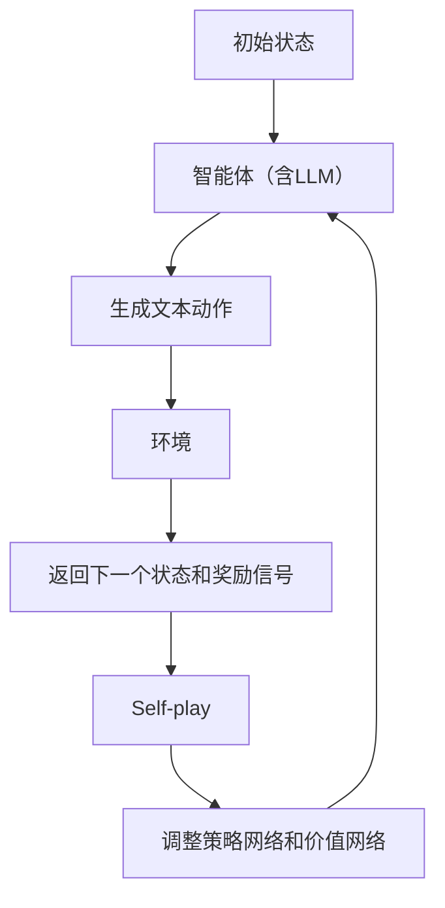

# Self-play LLM RL方法在推理任务中的效果评估

> 关键词：Self-play、大语言模型（LLM）、强化学习（RL）、推理任务、效果评估

> 摘要：本文聚焦于Self-play LLM RL方法在推理任务中的效果评估。首先介绍了该研究的背景和相关基础概念，包括Self-play、LLM和RL的原理及联系。接着详细阐述了核心算法原理，并给出Python源代码示例。通过数学模型和公式进一步剖析其理论基础，同时结合实际案例进行说明。在项目实战部分，展示了开发环境搭建、源代码实现及解读。探讨了该方法的实际应用场景，推荐了相关学习资源、开发工具和论文著作。最后总结其未来发展趋势与挑战，解答常见问题并提供扩展阅读和参考资料，旨在全面深入地评估Self-play LLM RL方法在推理任务中的效果。

## 1. 背景介绍 
### 1.1 目的和范围
近年来，大语言模型（LLM）在自然语言处理领域取得了显著进展，能够生成高质量的文本。然而，在处理复杂推理任务时，其表现仍有待提高。Self-play强化学习（RL）方法作为一种新兴技术，有望通过智能体之间的交互和学习来提升LLM在推理任务中的性能。本研究的目的在于全面评估Self-play LLM RL方法在推理任务中的效果，范围涵盖从理论原理到实际应用的多个方面，包括算法原理、数学模型、项目实战以及实际应用场景等。

### 1.2 预期读者
本文预期读者包括自然语言处理、人工智能、机器学习等领域的研究人员、工程师和学生。对于对大语言模型和强化学习技术感兴趣，希望深入了解Self-play LLM RL方法在推理任务中应用的专业人士，本文将提供有价值的参考。

### 1.3 文档结构概述
本文共分为十个部分。第一部分为背景介绍，阐述研究目的、预期读者和文档结构。第二部分介绍核心概念与联系，包括Self-play、LLM和RL的原理及架构。第三部分详细讲解核心算法原理，并给出Python源代码。第四部分介绍数学模型和公式，并进行详细讲解和举例说明。第五部分为项目实战，包括开发环境搭建、源代码实现和代码解读。第六部分探讨实际应用场景。第七部分推荐相关工具和资源，包括学习资源、开发工具框架和论文著作。第八部分总结未来发展趋势与挑战。第九部分为附录，解答常见问题。第十部分提供扩展阅读和参考资料。

### 1.4 术语表
#### 1.4.1 核心术语定义
- **Self-play（自我对弈）**：指智能体与自身或其他智能体进行交互和学习的过程，通过不断地博弈和反馈来提升性能。
- **大语言模型（LLM）**：基于深度学习的语言模型，通常具有大量的参数和强大的语言理解与生成能力，如GPT系列、BERT等。
- **强化学习（RL）**：一种机器学习范式，智能体通过与环境进行交互，根据环境反馈的奖励信号来学习最优策略。
- **推理任务**：需要智能体运用逻辑推理、知识推理等能力来解决问题的任务，如问答系统、逻辑推理题解答等。

#### 1.4.2 相关概念解释
- **策略网络**：在强化学习中，用于生成智能体的动作策略的神经网络。
- **价值网络**：用于评估智能体在某个状态下的价值的神经网络，帮助智能体判断当前状态的好坏。
- **奖励函数**：定义智能体在与环境交互过程中获得的奖励，是强化学习中引导智能体学习的重要因素。

#### 1.4.3 缩略词列表
- **LLM**：Large Language Model（大语言模型）
- **RL**：Reinforcement Learning（强化学习）
- **GPT**：Generative Pretrained Transformer（生成式预训练变压器）
- **BERT**：Bidirectional Encoder Representations from Transformers（基于变压器的双向编码器表示）

## 2. 核心概念与联系 
### 2.1 Self-play原理
Self-play是一种强大的学习机制，其核心思想是智能体通过与自身或其他智能体进行交互和博弈来不断学习和改进。在Self-play过程中，智能体可以从不同的角度观察问题，探索各种可能的策略，并根据反馈的奖励信号来调整自己的行为。例如，在围棋等棋类游戏中，智能体可以通过不断地自我对弈来学习最优的下棋策略。

### 2.2 大语言模型（LLM）原理
大语言模型基于深度学习技术，通常采用Transformer架构。Transformer架构通过自注意力机制（Self-Attention）能够有效地捕捉文本中的长距离依赖关系。LLM在大规模文本数据上进行预训练，学习到丰富的语言知识和语义信息。在推理阶段，LLM可以根据输入的文本生成相应的输出，如文本生成、问答等。

### 2.3 强化学习（RL）原理
强化学习的基本框架包括智能体（Agent）、环境（Environment）和奖励信号（Reward）。智能体在环境中执行动作，环境根据智能体的动作返回下一个状态和奖励信号。智能体的目标是通过不断地与环境交互，学习到一个最优策略，使得长期累积奖励最大化。常见的强化学习算法包括Q-learning、Policy Gradient等。

### 2.4 三者联系
Self-play LLM RL方法将Self-play、LLM和RL有机结合。LLM作为智能体的语言处理模块，负责生成自然语言文本。Self-play机制为智能体提供了一种学习和探索的方式，通过与自身或其他智能体的交互来提升性能。RL则为智能体的学习提供了目标和反馈机制，通过奖励信号引导智能体学习最优策略。具体来说，在推理任务中，LLM生成的文本作为智能体的动作，环境根据文本的质量和准确性返回奖励信号，智能体通过Self-play不断地调整策略，以提高在推理任务中的表现。

### 2.5 文本示意图
Self-play LLM RL方法的核心架构可以描述如下：

智能体（包含LLM）与环境进行交互，智能体根据当前状态生成文本动作，环境根据动作返回下一个状态和奖励信号。智能体在Self-play过程中，不断地与自身或其他智能体进行博弈，根据奖励信号调整策略网络和价值网络，以提高性能。

### 2.6 Mermaid流程图


## 3. 核心算法原理 & 具体操作步骤 
### 3.1 核心算法原理
Self-play LLM RL方法的核心是通过强化学习来优化LLM在推理任务中的表现。具体来说，采用策略梯度算法，通过最大化累积奖励来更新策略网络的参数。策略网络根据当前状态生成文本动作的概率分布，智能体根据该概率分布采样得到具体的动作。环境根据动作返回奖励信号，通过计算策略梯度来更新策略网络的参数，使得智能体在未来的交互中能够获得更高的奖励。

### 3.2 具体操作步骤
1. **初始化**：初始化策略网络和价值网络的参数，设置学习率、折扣因子等超参数。
2. **交互阶段**：智能体与环境进行交互，根据当前状态生成文本动作，环境返回下一个状态和奖励信号。
3. **Self-play阶段**：智能体在Self-play过程中，与自身或其他智能体进行博弈，记录每个状态、动作和奖励。
4. **训练阶段**：根据记录的状态、动作和奖励，计算策略梯度和价值损失，更新策略网络和价值网络的参数。
5. **重复步骤2-4**：不断地进行交互、Self-play和训练，直到达到收敛条件。

### 3.3 Python源代码示例
```python
import torch
import torch.nn as nn
import torch.optim as optim
import numpy as np

# 定义策略网络
class PolicyNetwork(nn.Module):
    def __init__(self, input_size, output_size):
        super(PolicyNetwork, self).__init__()
        self.fc1 = nn.Linear(input_size, 128)
        self.fc2 = nn.Linear(128, output_size)
        self.softmax = nn.Softmax(dim=1)

    def forward(self, x):
        x = torch.relu(self.fc1(x))
        x = self.fc2(x)
        x = self.softmax(x)
        return x

# 定义价值网络
class ValueNetwork(nn.Module):
    def __init__(self, input_size):
        super(ValueNetwork, self).__init__()
        self.fc1 = nn.Linear(input_size, 128)
        self.fc2 = nn.Linear(128, 1)

    def forward(self, x):
        x = torch.relu(self.fc1(x))
        x = self.fc2(x)
        return x

# 定义智能体
class Agent:
    def __init__(self, input_size, output_size, learning_rate=0.001, gamma=0.99):
        self.policy_network = PolicyNetwork(input_size, output_size)
        self.value_network = ValueNetwork(input_size)
        self.policy_optimizer = optim.Adam(self.policy_network.parameters(), lr=learning_rate)
        self.value_optimizer = optim.Adam(self.value_network.parameters(), lr=learning_rate)
        self.gamma = gamma

    def get_action(self, state):
        state = torch.FloatTensor(state).unsqueeze(0)
        action_probs = self.policy_network(state)
        action = torch.multinomial(action_probs, 1).item()
        return action

    def update(self, states, actions, rewards):
        states = torch.FloatTensor(states)
        actions = torch.LongTensor(actions)
        rewards = torch.FloatTensor(rewards)

        # 计算优势函数
        values = self.value_network(states).squeeze()
        returns = []
        discounted_return = 0
        for reward in reversed(rewards):
            discounted_return = reward + self.gamma * discounted_return
            returns.insert(0, discounted_return)
        returns = torch.FloatTensor(returns)
        advantages = returns - values

        # 计算策略损失
        action_probs = self.policy_network(states)
        action_log_probs = torch.log(action_probs.gather(1, actions.unsqueeze(1)).squeeze())
        policy_loss = -(action_log_probs * advantages.detach()).mean()

        # 计算价值损失
        value_loss = nn.MSELoss()(values, returns)

        # 更新策略网络和价值网络
        self.policy_optimizer.zero_grad()
        policy_loss.backward()
        self.policy_optimizer.step()

        self.value_optimizer.zero_grad()
        value_loss.backward()
        self.value_optimizer.step()

# 示例使用
input_size = 10
output_size = 5
agent = Agent(input_size, output_size)

states = np.random.rand(10, input_size)
actions = [agent.get_action(state) for state in states]
rewards = np.random.rand(10)

agent.update(states, actions, rewards)
```

## 4. 数学模型和公式 & 详细讲解 & 举例说明 
### 4.1 策略梯度算法数学模型
策略梯度算法的目标是最大化累积奖励的期望，即：

$$J(\theta) = \mathbb{E}_{\tau \sim \pi_{\theta}} \left[ \sum_{t=0}^{T} \gamma^t r_t \right]$$

其中，$\theta$ 是策略网络的参数，$\tau$ 是一个轨迹，包含状态、动作和奖励序列，$\pi_{\theta}$ 是策略网络根据参数 $\theta$ 生成的策略，$\gamma$ 是折扣因子，$r_t$ 是第 $t$ 步的奖励。

### 4.2 策略梯度公式
根据策略梯度定理，策略梯度可以表示为：

$$\nabla_{\theta} J(\theta) = \mathbb{E}_{\tau \sim \pi_{\theta}} \left[ \sum_{t=0}^{T} \nabla_{\theta} \log \pi_{\theta}(a_t | s_t) Q^{\pi_{\theta}}(s_t, a_t) \right]$$

其中，$\pi_{\theta}(a_t | s_t)$ 是在状态 $s_t$ 下采取动作 $a_t$ 的概率，$Q^{\pi_{\theta}}(s_t, a_t)$ 是在策略 $\pi_{\theta}$ 下状态 $s_t$ 和动作 $a_t$ 的动作价值。

### 4.3 详细讲解
策略梯度算法的核心思想是通过梯度上升的方法来更新策略网络的参数，使得累积奖励的期望最大化。在实际实现中，通常使用蒙特卡罗估计来近似策略梯度，即：

$$\nabla_{\theta} J(\theta) \approx \frac{1}{N} \sum_{i=1}^{N} \sum_{t=0}^{T} \nabla_{\theta} \log \pi_{\theta}(a_{t}^i | s_{t}^i) R_t^i$$

其中，$N$ 是轨迹的数量，$R_t^i$ 是第 $i$ 个轨迹中从第 $t$ 步开始的累积奖励。

### 4.4 举例说明
假设我们有一个简单的推理任务，智能体需要在一个二维网格中找到目标位置。状态 $s$ 可以表示为智能体的当前位置，动作 $a$ 可以表示为智能体的移动方向（上、下、左、右）。奖励函数可以定义为：当智能体到达目标位置时，获得正奖励；当智能体远离目标位置时，获得负奖励。

在每个时间步，智能体根据当前状态 $s$ 生成动作 $a$ 的概率分布 $\pi_{\theta}(a | s)$，并根据该概率分布采样得到具体的动作。环境根据动作返回下一个状态 $s'$ 和奖励 $r$。智能体记录每个状态、动作和奖励，在训练阶段，根据上述策略梯度公式更新策略网络的参数。

## 5. 项目实战：代码实际案例和详细解释说明 
### 5.1  开发环境搭建
#### 5.1.1 安装Python
首先，确保你已经安装了Python 3.6及以上版本。可以从Python官方网站（https://www.python.org/downloads/）下载并安装。

#### 5.1.2 安装深度学习框架
本文使用PyTorch作为深度学习框架，可以使用以下命令安装：
```sh
pip install torch torchvision
```

#### 5.1.3 安装其他依赖库
根据具体需求，可能还需要安装其他依赖库，如NumPy、Matplotlib等。可以使用以下命令安装：
```sh
pip install numpy matplotlib
```

### 5.2  源代码详细实现和代码解读
#### 5.2.1 定义环境
```python
import numpy as np

class GridWorld:
    def __init__(self, grid_size=5):
        self.grid_size = grid_size
        self.reset()

    def reset(self):
        self.agent_pos = [0, 0]
        self.target_pos = [self.grid_size - 1, self.grid_size - 1]
        return self.get_state()

    def get_state(self):
        state = np.zeros((self.grid_size, self.grid_size))
        state[self.agent_pos[0], self.agent_pos[1]] = 1
        state[self.target_pos[0], self.target_pos[1]] = 2
        return state.flatten()

    def step(self, action):
        if action == 0:  # 上
            self.agent_pos[0] = max(0, self.agent_pos[0] - 1)
        elif action == 1:  # 下
            self.agent_pos[0] = min(self.grid_size - 1, self.agent_pos[0] + 1)
        elif action == 2:  # 左
            self.agent_pos[1] = max(0, self.agent_pos[1] - 1)
        elif action == 3:  # 右
            self.agent_pos[1] = min(self.grid_size - 1, self.agent_pos[1] + 1)

        done = self.agent_pos == self.target_pos
        reward = 1 if done else -0.1
        next_state = self.get_state()

        return next_state, reward, done
```
**代码解读**：定义了一个简单的二维网格世界环境，智能体需要从起点移动到目标位置。`reset` 方法用于重置环境状态，`get_state` 方法用于获取当前状态，`step` 方法用于执行动作并返回下一个状态、奖励和是否完成的标志。

#### 5.2.2 定义智能体
```python
import torch
import torch.nn as nn
import torch.optim as optim

# 定义策略网络
class PolicyNetwork(nn.Module):
    def __init__(self, input_size, output_size):
        super(PolicyNetwork, self).__init__()
        self.fc1 = nn.Linear(input_size, 128)
        self.fc2 = nn.Linear(128, output_size)
        self.softmax = nn.Softmax(dim=1)

    def forward(self, x):
        x = torch.relu(self.fc1(x))
        x = self.fc2(x)
        x = self.softmax(x)
        return x

# 定义价值网络
class ValueNetwork(nn.Module):
    def __init__(self, input_size):
        super(ValueNetwork, self).__init__()
        self.fc1 = nn.Linear(input_size, 128)
        self.fc2 = nn.Linear(128, 1)

    def forward(self, x):
        x = torch.relu(self.fc1(x))
        x = self.fc2(x)
        return x

# 定义智能体
class Agent:
    def __init__(self, input_size, output_size, learning_rate=0.001, gamma=0.99):
        self.policy_network = PolicyNetwork(input_size, output_size)
        self.value_network = ValueNetwork(input_size)
        self.policy_optimizer = optim.Adam(self.policy_network.parameters(), lr=learning_rate)
        self.value_optimizer = optim.Adam(self.value_network.parameters(), lr=learning_rate)
        self.gamma = gamma

    def get_action(self, state):
        state = torch.FloatTensor(state).unsqueeze(0)
        action_probs = self.policy_network(state)
        action = torch.multinomial(action_probs, 1).item()
        return action

    def update(self, states, actions, rewards):
        states = torch.FloatTensor(states)
        actions = torch.LongTensor(actions)
        rewards = torch.FloatTensor(rewards)

        # 计算优势函数
        values = self.value_network(states).squeeze()
        returns = []
        discounted_return = 0
        for reward in reversed(rewards):
            discounted_return = reward + self.gamma * discounted_return
            returns.insert(0, discounted_return)
        returns = torch.FloatTensor(returns)
        advantages = returns - values

        # 计算策略损失
        action_probs = self.policy_network(states)
        action_log_probs = torch.log(action_probs.gather(1, actions.unsqueeze(1)).squeeze())
        policy_loss = -(action_log_probs * advantages.detach()).mean()

        # 计算价值损失
        value_loss = nn.MSELoss()(values, returns)

        # 更新策略网络和价值网络
        self.policy_optimizer.zero_grad()
        policy_loss.backward()
        self.policy_optimizer.step()

        self.value_optimizer.zero_grad()
        value_loss.backward()
        self.value_optimizer.step()
```
**代码解读**：定义了策略网络、价值网络和智能体类。策略网络用于生成动作的概率分布，价值网络用于评估状态的价值。智能体类包含获取动作和更新网络参数的方法。

#### 5.2.3 训练过程
```python
# 初始化环境和智能体
env = GridWorld()
input_size = env.grid_size * env.grid_size
output_size = 4
agent = Agent(input_size, output_size)

num_episodes = 1000
for episode in range(num_episodes):
    state = env.reset()
    states, actions, rewards = [], [], []
    done = False

    while not done:
        action = agent.get_action(state)
        next_state, reward, done = env.step(action)

        states.append(state)
        actions.append(action)
        rewards.append(reward)

        state = next_state

    agent.update(states, actions, rewards)

    if episode % 100 == 0:
        print(f"Episode {episode}: Total reward = {sum(rewards)}")
```
**代码解读**：初始化环境和智能体，进行多轮训练。在每一轮训练中，智能体与环境进行交互，记录状态、动作和奖励，训练结束后更新智能体的网络参数。

### 5.3  代码解读与分析
#### 5.3.1 策略网络
策略网络的作用是根据当前状态生成动作的概率分布。在本代码中，策略网络由两个全连接层和一个Softmax层组成。输入是环境状态，输出是每个动作的概率。

#### 5.3.2 价值网络
价值网络用于评估当前状态的价值。在本代码中，价值网络由两个全连接层组成，输入是环境状态，输出是一个标量值，表示该状态的价值。

#### 5.3.3 智能体更新
智能体的更新过程包括计算优势函数、策略损失和价值损失，并使用梯度下降法更新策略网络和价值网络的参数。优势函数用于衡量动作的优劣，策略损失用于优化策略网络，价值损失用于优化价值网络。

#### 5.3.4 训练过程
训练过程中，智能体与环境进行交互，收集状态、动作和奖励数据，然后使用这些数据更新智能体的网络参数。通过不断地训练，智能体逐渐学习到最优策略，能够在推理任务中获得更高的奖励。

## 6. 实际应用场景 
### 6.1 问答系统
在问答系统中，Self-play LLM RL方法可以用于提高智能问答的准确性和效率。智能体可以通过Self-play不断地与自身或其他智能体进行交互，学习到更好的问题理解和答案生成策略。例如，在面对复杂的知识推理问题时，智能体可以通过与其他智能体的讨论和交流，不断地完善自己的答案，提高回答的质量。

### 6.2 逻辑推理游戏
在逻辑推理游戏中，如数独、围棋等，Self-play LLM RL方法可以帮助智能体学习到最优的游戏策略。智能体可以通过不断地自我对弈，探索各种可能的走法，并根据游戏结果调整自己的策略。例如，在围棋中，AlphaGo就是通过Self-play强化学习方法取得了巨大的成功，击败了人类顶尖棋手。

### 6.3 智能客服
在智能客服系统中，Self-play LLM RL方法可以用于提高客服的服务质量和效率。智能体可以通过与用户的交互和Self-play学习，不断地优化自己的回答策略，更好地理解用户的问题并提供准确的答案。例如，在电商平台的智能客服中，智能体可以通过与用户的对话，学习到常见问题的回答方式，提高用户满意度。

### 6.4 自动推理编程
在自动推理编程中，Self-play LLM RL方法可以帮助智能体学习到更好的编程策略。智能体可以通过Self-play不断地尝试不同的代码实现，并根据程序的运行结果调整自己的策略。例如，在解决复杂的算法问题时，智能体可以通过与其他智能体的交流和学习，找到最优的代码实现方案。

## 7. 工具和资源推荐
### 7.1 学习资源推荐
#### 7.1.1 书籍推荐
- 《深度学习》（Deep Learning）：由Ian Goodfellow、Yoshua Bengio和Aaron Courville撰写，是深度学习领域的经典教材，全面介绍了深度学习的基本原理和方法。
- 《强化学习：原理与Python实现》（Reinforcement Learning: An Introduction）：由Richard S. Sutton和Andrew G. Barto撰写，是强化学习领域的权威书籍，详细介绍了强化学习的理论和算法。
- 《自然语言处理入门》（Natural Language Processing in Action）：由Hobson Lane、Cole Howard和 Hannes Hapke撰写，介绍了自然语言处理的基本概念和方法，包括大语言模型的应用。

#### 7.1.2 在线课程
- Coursera上的“深度学习专项课程”（Deep Learning Specialization）：由Andrew Ng教授授课，涵盖了深度学习的各个方面，包括神经网络、卷积神经网络、循环神经网络等。
- edX上的“强化学习基础”（Fundamentals of Reinforcement Learning）：由Peter Abbeel教授授课，介绍了强化学习的基本原理和算法。
- 哔哩哔哩（Bilibili）上的自然语言处理相关教程：有许多优质的自然语言处理教程，包括大语言模型的讲解和实践。

#### 7.1.3 技术博客和网站
- Medium：有许多关于深度学习、强化学习和自然语言处理的技术博客，如Towards Data Science等。
- arXiv：是一个预印本数据库，包含了许多最新的学术研究成果，对于了解Self-play LLM RL方法的前沿研究非常有帮助。
- Hugging Face：是一个专注于自然语言处理的开源社区，提供了许多大语言模型的实现和工具。

### 7.2 开发工具框架推荐
#### 7.2.1 IDE和编辑器
- PyCharm：是一款专业的Python集成开发环境，提供了丰富的代码编辑、调试和管理功能。
- Jupyter Notebook：是一个交互式的开发环境，适合进行数据探索、模型训练和结果展示。
- Visual Studio Code：是一款轻量级的代码编辑器，支持多种编程语言，有丰富的插件扩展功能。

#### 7.2.2 调试和性能分析工具
- TensorBoard：是TensorFlow的可视化工具，可以用于查看模型的训练过程、损失曲线、梯度分布等信息。
- PyTorch Profiler：是PyTorch的性能分析工具，可以帮助用户分析模型的性能瓶颈，优化代码。
- cProfile：是Python的内置性能分析工具，可以用于分析Python代码的执行时间和调用关系。

#### 7.2.3 相关框架和库
- PyTorch：是一个开源的深度学习框架，提供了丰富的神经网络层和优化算法，易于使用和扩展。
- Hugging Face Transformers：是一个专注于自然语言处理的开源库，提供了许多预训练的大语言模型，如GPT、BERT等。
- Stable Baselines3：是一个基于PyTorch的强化学习库，提供了许多常见的强化学习算法的实现，方便用户进行强化学习实验。

### 7.3 相关论文著作推荐
#### 7.3.1 经典论文
- “Mastering the Game of Go without Human Knowledge”：介绍了AlphaGo Zero的Self-play强化学习方法，是Self-play技术在棋类游戏中的经典应用。
- “Attention Is All You Need”：提出了Transformer架构，为大语言模型的发展奠定了基础。
- “Proximal Policy Optimization Algorithms”：介绍了近端策略优化算法（PPO），是一种高效的策略梯度算法。

#### 7.3.2 最新研究成果
- 在arXiv等预印本数据库中搜索“Self-play LLM RL”相关的论文，可以了解到该领域的最新研究进展。
- 参加相关的学术会议，如NeurIPS、ICML、ACL等，了解最新的研究成果和趋势。

#### 7.3.3 应用案例分析
- 分析AlphaGo、AlphaZero等在棋类游戏中的应用案例，了解Self-play强化学习方法的实际效果和实现细节。
- 研究智能客服、问答系统等领域中Self-play LLM RL方法的应用案例，学习如何将该方法应用到实际问题中。

## 8. 总结：未来发展趋势与挑战
### 8.1 未来发展趋势
#### 8.1.1 多智能体协作
未来，Self-play LLM RL方法可能会更多地应用于多智能体协作场景。多个智能体可以通过Self-play进行协作和竞争，共同完成复杂的推理任务。例如，在智能交通系统中，多个自动驾驶车辆可以通过Self-play学习到最优的驾驶策略，实现高效的交通管理。

#### 8.1.2 与其他技术融合
Self-play LLM RL方法可能会与其他技术，如计算机视觉、知识图谱等进行融合。例如，将大语言模型与计算机视觉模型相结合，可以实现更复杂的多模态推理任务。通过知识图谱提供的结构化知识，可以增强智能体的推理能力。

#### 8.1.3 应用领域拓展
Self-play LLM RL方法的应用领域将不断拓展，除了现有的问答系统、逻辑推理游戏等领域，还可能应用于医疗诊断、金融投资、工业控制等领域。例如，在医疗诊断中，智能体可以通过Self-play学习到最优的诊断策略，提高诊断的准确性和效率。

### 8.2 挑战
#### 8.2.1 计算资源需求
Self-play LLM RL方法通常需要大量的计算资源，尤其是在训练大语言模型和进行大规模的Self-play时。如何有效地利用计算资源，提高训练效率，是一个亟待解决的问题。

#### 8.2.2 奖励设计
奖励函数的设计是强化学习中的关键问题，直接影响智能体的学习效果。在Self-play LLM RL方法中，如何设计合理的奖励函数，使得智能体能够学习到最优的推理策略，是一个具有挑战性的问题。

#### 8.2.3 可解释性
大语言模型和强化学习模型通常具有较高的复杂性，其决策过程难以解释。在一些对可解释性要求较高的应用场景中，如医疗诊断、金融投资等，如何提高Self-play LLM RL方法的可解释性，是一个需要解决的问题。

## 9. 附录：常见问题与解答
### 9.1 什么是Self-play？
Self-play是指智能体与自身或其他智能体进行交互和学习的过程。通过Self-play，智能体可以从不同的角度观察问题，探索各种可能的策略，并根据反馈的奖励信号来调整自己的行为。

### 9.2 Self-play LLM RL方法与传统的强化学习方法有什么区别？
Self-play LLM RL方法将Self-play、大语言模型和强化学习有机结合。与传统的强化学习方法相比，它引入了大语言模型，能够处理自然语言文本，适用于更复杂的推理任务。同时，Self-play机制为智能体提供了一种学习和探索的方式，能够提高智能体的学习效率和性能。

### 9.3 如何选择合适的奖励函数？
选择合适的奖励函数需要考虑任务的目标和特点。奖励函数应该能够准确地反映智能体的行为对任务目标的贡献。一般来说，可以从以下几个方面考虑：任务的最终目标、中间状态的好坏、行为的合理性等。在实际应用中，需要通过不断的实验和调整来确定合适的奖励函数。

### 9.4 Self-play LLM RL方法的训练时间长吗？
Self-play LLM RL方法的训练时间通常较长，尤其是在训练大语言模型和进行大规模的Self-play时。训练时间受到多种因素的影响，如模型的复杂度、数据集的大小、计算资源的配置等。为了缩短训练时间，可以采用并行计算、模型压缩等技术。

### 9.5 如何提高Self-play LLM RL方法的可解释性？
提高Self-play LLM RL方法的可解释性是一个具有挑战性的问题。可以从以下几个方面入手：采用可解释的模型结构，如决策树、规则引擎等；引入注意力机制，可视化智能体的决策过程；结合知识图谱等结构化知识，解释智能体的推理依据。

## 10. 扩展阅读 & 参考资料
### 10.1 扩展阅读
- 《人工智能：一种现代的方法》（Artificial Intelligence: A Modern Approach）：全面介绍了人工智能的各个领域，包括机器学习、自然语言处理、知识表示与推理等。
- 《动手学深度学习》（Dive into Deep Learning）：通过大量的代码示例和实践项目，介绍了深度学习的基本原理和方法。
- 《强化学习精要：核心算法与TensorFlow实现》：详细介绍了强化学习的核心算法，并使用TensorFlow进行实现。

### 10.2 参考资料
- OpenAI官方文档：提供了关于大语言模型和强化学习的最新研究成果和技术文档。
- PyTorch官方文档：是PyTorch深度学习框架的官方文档，包含了详细的API文档和教程。
- Hugging Face官方文档：提供了关于Transformer库的详细文档和使用示例。