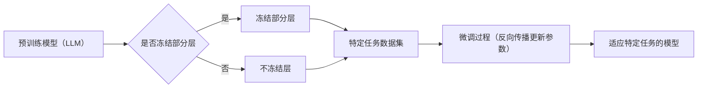

# fine-tuning技巧：如何让LLM更适应特定任务

> 关键词：fine-tuning、大语言模型（LLM）、特定任务、微调技巧、模型适应

> 摘要：本文围绕fine-tuning技巧展开，深入探讨如何让大语言模型（LLM）更适应特定任务。首先介绍了相关背景知识，包括目的、预期读者、文档结构和术语表。接着阐述了核心概念与联系，用文本示意图和Mermaid流程图展示其原理和架构。详细讲解了核心算法原理及具体操作步骤，结合Python源代码进行阐述。给出了数学模型和公式并举例说明。通过项目实战，从开发环境搭建到源代码详细实现与解读，让读者深入理解fine-tuning的实际应用。探讨了实际应用场景，推荐了相关的工具和资源。最后总结了未来发展趋势与挑战，提供了常见问题解答和扩展阅读参考资料，旨在为读者全面呈现让LLM更适应特定任务的fine-tuning技巧。

## 1. 背景介绍 
### 1.1 目的和范围
随着大语言模型（LLM）的不断发展，其在自然语言处理领域展现出了强大的能力。然而，通用的大语言模型往往不能直接满足各种特定任务的需求。本文章的目的在于深入探讨fine-tuning（微调）技巧，帮助开发者和研究者了解如何通过微调让LLM更适应特定任务。范围涵盖了从基础概念到实际应用的各个方面，包括核心算法原理、数学模型、项目实战以及实际应用场景等。

### 1.2 预期读者
本文预期读者包括自然语言处理领域的开发者、研究者、数据科学家以及对大语言模型和fine-tuning技术感兴趣的技术爱好者。无论是想要深入学习相关知识的初学者，还是希望优化现有模型性能的专业人士，都能从本文中获得有价值的信息。

### 1.3 文档结构概述
本文将按照以下结构展开：首先介绍背景知识，包括目的、预期读者、文档结构和术语表；接着阐述核心概念与联系，用示意图和流程图展示其原理和架构；详细讲解核心算法原理及具体操作步骤，结合Python源代码进行阐述；给出数学模型和公式并举例说明；通过项目实战，从开发环境搭建到源代码详细实现与解读，让读者深入理解fine-tuning的实际应用；探讨实际应用场景；推荐相关的工具和资源；最后总结未来发展趋势与挑战，提供常见问题解答和扩展阅读参考资料。

### 1.4 术语表
#### 1.4.1 核心术语定义
- **大语言模型（LLM）**：基于大量文本数据训练的语言模型，具有强大的语言理解和生成能力，如GPT系列、BERT等。
- **fine-tuning（微调）**：在预训练模型的基础上，使用特定任务的数据集对模型进行进一步训练，以使其更适应特定任务。
- **预训练模型**：在大规模无监督数据上进行训练的模型，学习到了通用的语言知识和模式。
- **特定任务**：指具有明确目标和需求的自然语言处理任务，如文本分类、情感分析、机器翻译等。

#### 1.4.2 相关概念解释
- **迁移学习**：将在一个任务上学习到的知识和技能迁移到另一个相关任务上的学习方法。fine-tuning是迁移学习的一种具体实现方式。
- **数据集**：用于训练和评估模型的数据集合，包括输入数据和对应的标签。
- **损失函数**：用于衡量模型预测结果与真实标签之间的差异，指导模型的训练过程。

#### 1.4.3 缩略词列表
- **LLM**：大语言模型（Large Language Model）
- **NLP**：自然语言处理（Natural Language Processing）

## 2. 核心概念与联系 

### 核心概念原理
fine-tuning的核心原理基于迁移学习的思想。预训练的大语言模型在大规模无监督数据上进行训练，学习到了丰富的语言知识和模式。这些知识和模式可以作为通用的基础，在面对特定任务时，通过fine-tuning在特定任务的数据集上对模型进行进一步训练，让模型在保留通用知识的基础上，学习到与特定任务相关的特征和模式，从而提高模型在特定任务上的性能。

### 架构的文本示意图
```plaintext
预训练模型（LLM）
|
|-- 冻结部分层（可选）
|
|-- 特定任务数据集
|
|-- 微调过程（反向传播更新参数）
|
|-- 适应特定任务的模型
```

### Mermaid流程图


## 3. 核心算法原理 & 具体操作步骤 

### 核心算法原理
fine-tuning的核心算法基于梯度下降优化算法。在微调过程中，模型接收特定任务的输入数据，通过前向传播计算预测结果，然后使用损失函数计算预测结果与真实标签之间的差异。接着，通过反向传播算法计算损失函数对模型参数的梯度，最后使用优化器根据梯度更新模型的参数，不断迭代这个过程，直到模型在特定任务上的性能达到满意的效果。

### 具体操作步骤
1. **选择预训练模型**：根据特定任务的需求和数据集的特点，选择合适的预训练大语言模型。
2. **准备特定任务数据集**：收集、整理和标注与特定任务相关的数据集，将其划分为训练集、验证集和测试集。
3. **冻结部分层（可选）**：如果预训练模型非常大，为了减少计算量和防止过拟合，可以选择冻结部分层，只对部分层的参数进行更新。
4. **定义损失函数和优化器**：根据特定任务的类型，选择合适的损失函数，如交叉熵损失函数用于分类任务，均方误差损失函数用于回归任务。选择合适的优化器，如Adam优化器。
5. **微调模型**：将特定任务的数据集输入到模型中，进行前向传播、计算损失、反向传播和参数更新的迭代过程，直到模型收敛。
6. **评估模型**：使用验证集和测试集对微调后的模型进行评估，计算模型在特定任务上的性能指标，如准确率、召回率、F1值等。

### Python源代码阐述
以下是一个使用Hugging Face的Transformers库进行文本分类任务的fine-tuning示例：

```python
import torch
from torch.utils.data import DataLoader, Dataset
from transformers import AutoTokenizer, AutoModelForSequenceClassification, AdamW
from sklearn.model_selection import train_test_split
import pandas as pd

# 定义数据集类
class TextClassificationDataset(Dataset):
    def __init__(self, texts, labels, tokenizer, max_length):
        self.texts = texts
        self.labels = labels
        self.tokenizer = tokenizer
        self.max_length = max_length

    def __len__(self):
        return len(self.texts)

    def __getitem__(self, idx):
        text = self.texts[idx]
        label = self.labels[idx]
        encoding = self.tokenizer.encode_plus(
            text,
            add_special_tokens=True,
            max_length=self.max_length,
            padding='max_length',
            truncation=True,
            return_tensors='pt'
        )
        return {
            'input_ids': encoding['input_ids'].flatten(),
            'attention_mask': encoding['attention_mask'].flatten(),
            'labels': torch.tensor(label, dtype=torch.long)
        }

# 加载预训练模型和分词器
model_name = 'bert-base-uncased'
tokenizer = AutoTokenizer.from_pretrained(model_name)
model = AutoModelForSequenceClassification.from_pretrained(model_name, num_labels=2)

# 加载数据集
data = pd.read_csv('data.csv')
texts = data['text'].tolist()
labels = data['label'].tolist()

# 划分训练集和测试集
train_texts, test_texts, train_labels, test_labels = train_test_split(texts, labels, test_size=0.2, random_state=42)

# 创建数据集和数据加载器
max_length = 128
train_dataset = TextClassificationDataset(train_texts, train_labels, tokenizer, max_length)
test_dataset = TextClassificationDataset(test_texts, test_labels, tokenizer, max_length)

train_dataloader = DataLoader(train_dataset, batch_size=16, shuffle=True)
test_dataloader = DataLoader(test_dataset, batch_size=16, shuffle=False)

# 定义优化器
optimizer = AdamW(model.parameters(), lr=2e-5)

# 训练模型
device = torch.device('cuda' if torch.cuda.is_available() else 'cpu')
model.to(device)

num_epochs = 3
for epoch in range(num_epochs):
    model.train()
    total_loss = 0
    for batch in train_dataloader:
        input_ids = batch['input_ids'].to(device)
        attention_mask = batch['attention_mask'].to(device)
        labels = batch['labels'].to(device)

        optimizer.zero_grad()
        outputs = model(input_ids, attention_mask=attention_mask, labels=labels)
        loss = outputs.loss
        loss.backward()
        optimizer.step()
        total_loss += loss.item()

    print(f'Epoch {epoch + 1}, Loss: {total_loss / len(train_dataloader)}')

# 评估模型
model.eval()
correct_predictions = 0
total_predictions = 0
with torch.no_grad():
    for batch in test_dataloader:
        input_ids = batch['input_ids'].to(device)
        attention_mask = batch['attention_mask'].to(device)
        labels = batch['labels'].to(device)

        outputs = model(input_ids, attention_mask=attention_mask)
        logits = outputs.logits
        predictions = torch.argmax(logits, dim=1)
        correct_predictions += (predictions == labels).sum().item()
        total_predictions += labels.size(0)

accuracy = correct_predictions / total_predictions
print(f'Test Accuracy: {accuracy}')
```

## 4. 数学模型和公式 & 详细讲解 & 举例说明 

### 数学模型
在fine-tuning过程中，我们使用的数学模型主要基于神经网络。以文本分类任务为例，输入的文本数据经过分词器处理后转换为词向量序列，然后输入到预训练的大语言模型中。模型通过一系列的层（如Transformer层）对输入进行特征提取和变换，最后通过全连接层输出预测结果。

### 损失函数
对于文本分类任务，常用的损失函数是交叉熵损失函数。交叉熵损失函数的公式如下：

$$H(p, q) = - \sum_{i=1}^{C} p_i \log(q_i)$$

其中，$p$ 是真实标签的概率分布，$q$ 是模型预测的概率分布，$C$ 是类别数。

### 优化器
在fine-tuning中，常用的优化器是Adam优化器。Adam优化器结合了Adagrad和RMSProp的优点，能够自适应地调整每个参数的学习率。Adam优化器的更新公式如下：

$$m_t = \beta_1 m_{t-1} + (1 - \beta_1) g_t$$
$$v_t = \beta_2 v_{t-1} + (1 - \beta_2) g_t^2$$
$$\hat{m}_t = \frac{m_t}{1 - \beta_1^t}$$
$$\hat{v}_t = \frac{v_t}{1 - \beta_2^t}$$
$$\theta_{t+1} = \theta_t - \frac{\alpha}{\sqrt{\hat{v}_t} + \epsilon} \hat{m}_t$$

其中，$m_t$ 和 $v_t$ 分别是梯度的一阶矩估计和二阶矩估计，$\beta_1$ 和 $\beta_2$ 是衰减率，$\alpha$ 是学习率，$\epsilon$ 是一个很小的常数，用于防止分母为零。

### 举例说明
假设我们有一个二分类的文本分类任务，真实标签为 $p = [1, 0]$，模型预测的概率分布为 $q = [0.8, 0.2]$。则交叉熵损失函数的值为：

$$H(p, q) = - (1 \times \log(0.8) + 0 \times \log(0.2)) \approx 0.223$$

在训练过程中，我们的目标是通过不断调整模型的参数，使得交叉熵损失函数的值最小化。

## 5. 项目实战：代码实际案例和详细解释说明 

### 5.1  开发环境搭建
1. **安装Python**：确保你的系统中安装了Python 3.6或以上版本。
2. **安装必要的库**：使用pip安装Hugging Face的Transformers库、torch库、pandas库和sklearn库。
```bash
pip install transformers torch pandas scikit-learn
```
3. **准备数据集**：将数据集保存为CSV文件，包含两列：`text` 列存储文本数据，`label` 列存储对应的标签。

### 5.2  源代码详细实现和代码解读
```python
import torch
from torch.utils.data import DataLoader, Dataset
from transformers import AutoTokenizer, AutoModelForSequenceClassification, AdamW
from sklearn.model_selection import train_test_split
import pandas as pd

# 定义数据集类
class TextClassificationDataset(Dataset):
    def __init__(self, texts, labels, tokenizer, max_length):
        self.texts = texts
        self.labels = labels
        self.tokenizer = tokenizer
        self.max_length = max_length

    def __len__(self):
        return len(self.texts)

    def __getitem__(self, idx):
        text = self.texts[idx]
        label = self.labels[idx]
        encoding = self.tokenizer.encode_plus(
            text,
            add_special_tokens=True,
            max_length=self.max_length,
            padding='max_length',
            truncation=True,
            return_tensors='pt'
        )
        return {
            'input_ids': encoding['input_ids'].flatten(),
            'attention_mask': encoding['attention_mask'].flatten(),
            'labels': torch.tensor(label, dtype=torch.long)
        }

# 加载预训练模型和分词器
model_name = 'bert-base-uncased'
tokenizer = AutoTokenizer.from_pretrained(model_name)
model = AutoModelForSequenceClassification.from_pretrained(model_name, num_labels=2)

# 加载数据集
data = pd.read_csv('data.csv')
texts = data['text'].tolist()
labels = data['label'].tolist()

# 划分训练集和测试集
train_texts, test_texts, train_labels, test_labels = train_test_split(texts, labels, test_size=0.2, random_state=42)

# 创建数据集和数据加载器
max_length = 128
train_dataset = TextClassificationDataset(train_texts, train_labels, tokenizer, max_length)
test_dataset = TextClassificationDataset(test_texts, test_labels, tokenizer, max_length)

train_dataloader = DataLoader(train_dataset, batch_size=16, shuffle=True)
test_dataloader = DataLoader(test_dataset, batch_size=16, shuffle=False)

# 定义优化器
optimizer = AdamW(model.parameters(), lr=2e-5)

# 训练模型
device = torch.device('cuda' if torch.cuda.is_available() else 'cpu')
model.to(device)

num_epochs = 3
for epoch in range(num_epochs):
    model.train()
    total_loss = 0
    for batch in train_dataloader:
        input_ids = batch['input_ids'].to(device)
        attention_mask = batch['attention_mask'].to(device)
        labels = batch['labels'].to(device)

        optimizer.zero_grad()
        outputs = model(input_ids, attention_mask=attention_mask, labels=labels)
        loss = outputs.loss
        loss.backward()
        optimizer.step()
        total_loss += loss.item()

    print(f'Epoch {epoch + 1}, Loss: {total_loss / len(train_dataloader)}')

# 评估模型
model.eval()
correct_predictions = 0
total_predictions = 0
with torch.no_grad():
    for batch in test_dataloader:
        input_ids = batch['input_ids'].to(device)
        attention_mask = batch['attention_mask'].to(device)
        labels = batch['labels'].to(device)

        outputs = model(input_ids, attention_mask=attention_mask)
        logits = outputs.logits
        predictions = torch.argmax(logits, dim=1)
        correct_predictions += (predictions == labels).sum().item()
        total_predictions += labels.size(0)

accuracy = correct_predictions / total_predictions
print(f'Test Accuracy: {accuracy}')
```

### 代码解读与分析
1. **数据集类**：`TextClassificationDataset` 类用于封装数据集，将文本数据转换为模型可以接受的输入格式。在 `__getitem__` 方法中，使用分词器对文本进行编码，添加特殊标记，进行填充和截断，并返回输入ID、注意力掩码和标签。
2. **加载预训练模型和分词器**：使用 `AutoTokenizer` 和 `AutoModelForSequenceClassification` 从Hugging Face的模型库中加载预训练的BERT模型和对应的分词器。
3. **数据处理**：使用 `pandas` 库加载数据集，将文本和标签分别存储在列表中。使用 `train_test_split` 函数将数据集划分为训练集和测试集。
4. **数据加载器**：使用 `DataLoader` 类创建训练集和测试集的数据加载器，方便批量处理数据。
5. **优化器**：使用 `AdamW` 优化器来更新模型的参数。
6. **训练模型**：将模型移动到GPU（如果可用）上，进行多个epoch的训练。在每个epoch中，遍历训练集的每个批次，进行前向传播、计算损失、反向传播和参数更新。
7. **评估模型**：将模型设置为评估模式，遍历测试集的每个批次，计算模型的预测结果，并统计正确预测的数量，最后计算准确率。

## 6. 实际应用场景 
### 文本分类
在新闻分类、情感分析、垃圾邮件过滤等任务中，fine-tuning可以让大语言模型更好地适应特定的分类任务。例如，在新闻分类中，可以使用特定领域的新闻数据集对预训练模型进行微调，使其能够准确地将新闻文章分类到不同的类别中。

### 问答系统
在智能客服、智能助手等问答系统中，fine-tuning可以提高模型对特定领域问题的回答能力。例如，在医疗问答系统中，可以使用医疗领域的问答数据集对预训练模型进行微调，使其能够准确地回答用户的医疗问题。

### 机器翻译
在机器翻译任务中，fine-tuning可以让模型更好地适应特定语言对的翻译任务。例如，在中英翻译任务中，可以使用中英平行语料库对预训练模型进行微调，提高翻译的质量和准确性。

### 文本生成
在故事生成、对话生成等文本生成任务中，fine-tuning可以让模型生成更符合特定风格和需求的文本。例如，在故事生成中，可以使用特定风格的故事数据集对预训练模型进行微调，使其生成的故事更具有连贯性和逻辑性。

## 7. 工具和资源推荐
### 7.1 学习资源推荐
#### 7.1.1 书籍推荐
- 《深度学习》（Deep Learning）：由Ian Goodfellow、Yoshua Bengio和Aaron Courville撰写，是深度学习领域的经典教材，涵盖了神经网络、优化算法等基础知识。
- 《自然语言处理入门》：介绍了自然语言处理的基本概念、方法和技术，适合初学者入门。
- 《基于深度学习的自然语言处理》：详细介绍了深度学习在自然语言处理中的应用，包括预训练模型、fine-tuning等技术。

#### 7.1.2 在线课程
- Coursera上的“深度学习专项课程”：由Andrew Ng教授讲授，涵盖了深度学习的各个方面，包括神经网络、卷积神经网络、循环神经网络等。
- edX上的“自然语言处理”课程：介绍了自然语言处理的基本概念、方法和技术，包括文本分类、情感分析、机器翻译等任务。
- Hugging Face的官方文档和教程：提供了关于预训练模型、fine-tuning等技术的详细介绍和示例代码。

#### 7.1.3 技术博客和网站
- Medium上的自然语言处理相关博客：有很多专业人士分享自然语言处理的最新研究成果和实践经验。
- arXiv.org：一个开放的学术预印本平台，提供了大量关于自然语言处理和深度学习的研究论文。
- 开源中国：提供了丰富的技术文章和开源项目，包括自然语言处理领域的相关内容。

### 7.2 开发工具框架推荐
#### 7.2.1 IDE和编辑器
- PyCharm：一款专业的Python集成开发环境，提供了代码编辑、调试、版本控制等功能。
- Visual Studio Code：一款轻量级的代码编辑器，支持多种编程语言，有丰富的插件可以扩展功能。
- Jupyter Notebook：一个交互式的开发环境，适合进行数据探索、模型训练和实验。

#### 7.2.2 调试和性能分析工具
- TensorBoard：一个可视化工具，用于监控模型的训练过程，查看损失函数、准确率等指标的变化。
- PyTorch Profiler：用于分析PyTorch模型的性能，找出性能瓶颈，优化模型的运行效率。
- cProfile：Python自带的性能分析工具，可以统计函数的调用次数、执行时间等信息。

#### 7.2.3 相关框架和库
- Hugging Face Transformers：一个用于自然语言处理的开源库，提供了大量的预训练模型和fine-tuning工具。
- PyTorch：一个深度学习框架，支持动态图计算，具有高效的计算性能和丰富的工具库。
- TensorFlow：一个广泛使用的深度学习框架，提供了丰富的工具和资源，支持分布式训练和模型部署。

### 7.3 相关论文著作推荐
#### 7.3.1 经典论文
- “Attention Is All You Need”：介绍了Transformer架构，是自然语言处理领域的经典论文。
- “BERT: Pre-training of Deep Bidirectional Transformers for Language Understanding”：提出了BERT预训练模型，开启了预训练语言模型的新时代。
- “GPT-3: Language Models are Few-Shot Learners”：介绍了GPT-3模型，展示了大语言模型在少样本学习方面的强大能力。

#### 7.3.2 最新研究成果
- 关注顶级学术会议（如ACL、EMNLP、NeurIPS等）上的最新研究论文，了解自然语言处理和fine-tuning技术的最新发展趋势。
- 关注知名研究机构（如OpenAI、Google Research等）的官方博客，获取最新的研究成果和技术分享。

#### 7.3.3 应用案例分析
- 阅读相关的技术博客和论文，了解fine-tuning技术在实际应用中的案例和经验分享，学习如何解决实际问题。

## 8. 总结：未来发展趋势与挑战
### 未来发展趋势
1. **模型规模的不断扩大**：随着计算资源的不断提升，大语言模型的规模将继续扩大，其性能和能力也将不断提高。
2. **多模态融合**：将语言模型与图像、音频等其他模态的模型进行融合，实现更加丰富和智能的交互。
3. **个性化定制**：根据用户的需求和偏好，对大语言模型进行个性化的fine-tuning，提供更加个性化的服务。
4. **自动化fine-tuning**：开发自动化的fine-tuning工具和框架，降低fine-tuning的技术门槛，提高开发效率。

### 挑战
1. **数据隐私和安全**：在fine-tuning过程中，使用的数据集可能包含用户的隐私信息，需要解决数据隐私和安全问题。
2. **计算资源需求**：大语言模型的fine-tuning需要大量的计算资源，如何降低计算成本和提高计算效率是一个挑战。
3. **过拟合问题**：在fine-tuning过程中，容易出现过拟合现象，需要采用有效的正则化方法来解决。
4. **模型可解释性**：大语言模型通常是黑盒模型，其决策过程难以解释，如何提高模型的可解释性是一个重要的研究方向。

## 9. 附录：常见问题与解答
### 问题1：fine-tuning和从头训练有什么区别？
**解答**：从头训练需要在大规模的无监督数据上对模型进行训练，需要大量的计算资源和时间。而fine-tuning是在预训练模型的基础上，使用特定任务的数据集对模型进行进一步训练，利用了预训练模型学习到的通用知识，能够更快地收敛，并且在特定任务上取得更好的性能。

### 问题2：如何选择合适的预训练模型？
**解答**：选择预训练模型需要考虑特定任务的需求、数据集的特点和计算资源等因素。如果任务是文本分类、情感分析等自然语言处理任务，可以选择BERT、RoBERTa等预训练模型；如果任务是文本生成，可以选择GPT系列模型。同时，还需要考虑模型的大小和计算复杂度，选择适合自己计算资源的模型。

### 问题3：在fine-tuning过程中，如何防止过拟合？
**解答**：可以采用以下方法防止过拟合：
1. **增加数据集**：使用更多的数据进行训练，提高模型的泛化能力。
2. **正则化方法**：如L1、L2正则化，Dropout等，限制模型的复杂度。
3. **早停策略**：在验证集上监控模型的性能，当性能不再提升时，停止训练。
4. **冻结部分层**：冻结预训练模型的部分层，只对部分层的参数进行更新，减少模型的可训练参数数量。

### 问题4：fine-tuning的计算资源需求大吗？
**解答**：fine-tuning的计算资源需求取决于预训练模型的大小、数据集的规模和训练的参数等因素。一般来说，大语言模型的fine-tuning需要较大的计算资源，如GPU或TPU。可以根据自己的计算资源选择合适的模型和训练参数，或者使用分布式训练来提高计算效率。

## 10. 扩展阅读 & 参考资料
- Hugging Face官方文档：https://huggingface.co/docs/transformers/index
- PyTorch官方文档：https://pytorch.org/docs/stable/index.html
- TensorFlow官方文档：https://www.tensorflow.org/api_docs
- 《自然语言处理实战》（Natural Language Processing in Action）
- “How to Fine-Tune a Pretrained Language Model” - Towards Data Science

以上内容仅供参考，你可以根据实际情况进行调整和补充。希望这篇博客能对你有所帮助！ 